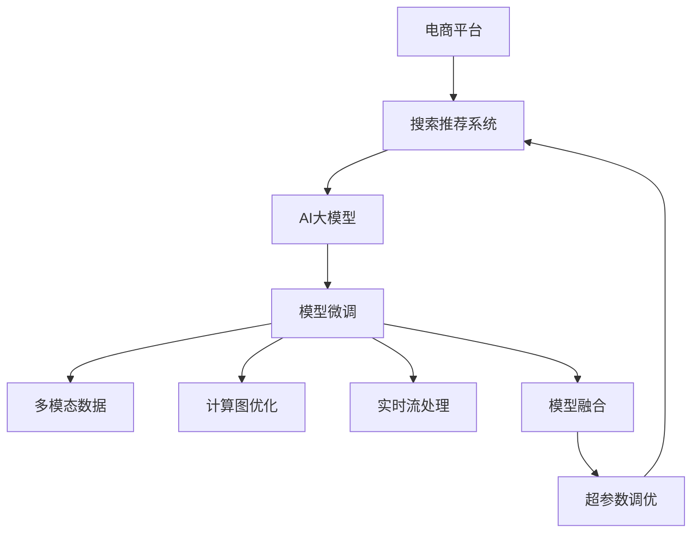

                 

# 电商平台搜索推荐系统的AI 大模型实践：提高转化率与用户体验

> 关键词：
- 电商平台
- 搜索推荐系统
- AI大模型
- 转化率
- 用户体验
- 模型微调
- 多模态数据
- 计算图优化
- 实时流处理
- 模型融合
- 超参数调优

## 1. 背景介绍

### 1.1 问题由来
随着电商平台的飞速发展，消费者的购物行为日益多样化，搜索引擎和推荐系统已成为了电商交易的核心支柱。传统的基于规则的推荐系统逐渐无法满足个性化需求的精细化推荐，而基于机器学习的推荐系统则因海量数据的高维特征计算、模型训练的复杂度、实时性等问题难以在电商场景中高效部署。与此同时，大语言模型通过自监督预训练的方式，获得了强大的语言理解能力，可以抽取丰富的语义信息，进一步提升推荐系统的表现。

近年来，越来越多的电商平台开始采用大模型进行推荐系统的优化，希望通过提高推荐系统的准确性和个性化水平，提升用户转化率和购物体验。但受限于模型的预训练数据集和电商业务数据分布的差异，直接采用预训练模型进行推荐系统微调效果往往不尽如人意。

## 2. 核心概念与联系

### 2.1 核心概念概述

为更好地理解基于大模型进行电商平台搜索推荐系统的优化，本节将介绍几个关键概念及其间的联系：

- **电商平台**：指在线销售商品或服务的平台，如淘宝、京东、Amazon等。
- **搜索推荐系统**：通过分析用户行为数据，帮助用户发现感兴趣的商品或服务的系统，是电商平台的核心功能之一。
- **AI大模型**：指通过大规模无监督或半监督数据预训练出的、可以抽取和处理复杂语义任务的深度学习模型，如GPT-3、BERT等。
- **转化率**：指用户从点击商品到完成购买的比例，是衡量电商平台商业价值的重要指标。
- **用户体验**：指用户在使用电商平台时的满意度和愉悦感，直接影响复购率和平台粘性。
- **模型微调**：指将预训练模型作为初始化参数，通过有监督的数据集进行优化，提升模型对特定任务（如电商搜索推荐）的表现。
- **多模态数据**：指融合文本、图像、视频、音频等多种数据源，提高模型对真实世界的全面理解和表达能力。
- **计算图优化**：指通过改进深度学习模型的计算图，降低前向和反向传播的计算复杂度，提升模型推理速度。
- **实时流处理**：指对海量用户行为数据进行实时分析处理，提供即时的推荐决策。
- **模型融合**：指将多个模型的输出结果进行融合，提升推荐系统的综合性能。
- **超参数调优**：指调整模型的超参数，如学习率、批大小、正则化等，优化模型性能。

这些核心概念之间的关系可以通过以下Mermaid流程图进行展示：



这个流程图展示了电商平台搜索推荐系统优化过程的关键步骤：

1. 电商平台通过搜索推荐系统为顾客提供个性化服务。
2. AI大模型作为推荐系统的基础组件，被用于提升模型对语义信息的理解和抽取能力。
3. 模型微调通过有监督的电商业务数据集，进一步优化模型性能。
4. 多模态数据融合将不同类型的数据源结合，增强模型对用户行为的全面理解。
5. 计算图优化通过改进模型计算图结构，提升推理速度和效率。
6. 实时流处理对用户行为数据进行实时分析，提供即时的推荐决策。
7. 模型融合整合多个模型的输出结果，增强推荐的稳定性和准确性。
8. 超参数调优通过调整模型超参数，实现性能最优。

这些概念共同构成了电商搜索推荐系统的优化框架，使得AI大模型能够在电商场景中发挥强大的潜力。

## 3. 核心算法原理 & 具体操作步骤
### 3.1 算法原理概述

基于AI大模型的电商平台搜索推荐系统优化，主要通过以下步骤实现：

1. 收集电商平台的搜索行为和用户点击数据，作为有监督数据集。
2. 选择适合电商场景的AI大模型，如GPT-3、BERT等。
3. 将大模型视作初始参数，对有监督数据集进行微调。
4. 融合多模态数据，如用户画像、商品描述、用户评论等，增强模型对用户行为的综合理解。
5. 优化计算图结构，如采用Transformer结构的变种，降低计算复杂度，提升推理速度。
6. 采用实时流处理技术，对用户行为数据进行实时分析，提供即时的推荐决策。
7. 通过模型融合和超参数调优，提升推荐系统的综合性能。

### 3.2 算法步骤详解

**Step 1: 收集电商数据**
收集电商平台的用户行为数据，包括用户的搜索历史、点击行为、商品浏览记录、购买记录等，作为有监督数据集。

**Step 2: 选择合适的预训练模型**
选择适合电商场景的AI大模型，如GPT-3、BERT等，作为初始化参数。

**Step 3: 准备数据集**
将电商数据集划分训练集、验证集和测试集。并对数据进行预处理，如文本分词、标签编码等。

**Step 4: 模型微调**
将预训练模型视作初始参数，在电商数据集上进行有监督学习。常用的微调方法包括全参数微调和参数高效微调(PEFT)。

**Step 5: 多模态数据融合**
融合多种数据源，如用户画像、商品描述、用户评论等，增强模型对用户行为的综合理解。

**Step 6: 计算图优化**
改进计算图结构，如采用Transformer结构的变种，降低计算复杂度，提升推理速度。

**Step 7: 实时流处理**
对用户行为数据进行实时分析处理，提供即时的推荐决策。

**Step 8: 模型融合**
通过融合多个模型的输出结果，提升推荐系统的综合性能。

**Step 9: 超参数调优**
通过调整模型的超参数，如学习率、批大小、正则化等，优化模型性能。

### 3.3 算法优缺点

基于AI大模型的电商平台搜索推荐系统优化方法具有以下优点：
1. 高效性：采用多模态数据融合和实时流处理技术，能够快速响应用户行为，提供即时的推荐决策。
2. 准确性：通过模型微调和多模态数据融合，可以抽取丰富的语义信息，提升推荐系统的准确性。
3. 可扩展性：AI大模型具有高度的可扩展性，可以轻松应对电商平台的业务变化和数据增长。
4. 用户友好：通过个性化推荐，能够提升用户体验，增加用户粘性。

同时，该方法也存在一定的局限性：
1. 数据依赖：模型微调和多模态数据融合依赖于电商平台的标注数据，数据获取成本较高。
2. 计算资源消耗：AI大模型需要较大的计算资源，可能对平台的计算能力和硬件设施提出较高要求。
3. 过拟合风险：大规模模型的过拟合风险较高，需要采取适当的正则化和模型压缩策略。
4. 安全性问题：电商平台的隐私数据和商业机密可能面临数据泄露和滥用的风险。

尽管存在这些局限性，但通过合理的设计和优化，基于AI大模型的电商平台搜索推荐系统仍可以显著提升转化率和用户体验，为电商平台带来更高的商业价值。

### 3.4 算法应用领域

基于AI大模型的电商平台搜索推荐系统优化方法，已经在电商、金融、教育、医疗等多个领域得到了广泛应用，以下是几个典型的应用场景：

**电商推荐系统**
通过分析用户历史行为数据，为每个用户推荐可能感兴趣的商品。采用多模态数据融合和计算图优化，可以提高推荐系统的准确性和实时性。

**金融推荐系统**
为金融用户推荐理财产品、投资策略等。通过模型微调和多模态数据融合，可以提供个性化的金融服务，提升用户满意度。

**教育推荐系统**
为学生推荐相关课程和教材。通过用户画像和课程描述的多模态融合，可以提高推荐的精准性和个性化。

**医疗推荐系统**
为患者推荐合适的医生和医疗方案。通过医疗数据和患者画像的融合，可以提供精准的诊疗建议。

这些应用场景展示了基于AI大模型的搜索推荐系统在各行各业中的应用潜力。未来，随着AI大模型的不断进步和优化，搜索推荐系统将能够提供更智能、更高效、更个性化的服务，提升用户的转化率和满意度。

## 4. 数学模型和公式 & 详细讲解 & 举例说明
### 4.1 数学模型构建

以电商平台推荐系统的推荐任务为例，数学模型构建如下：

假设电商平台有 $N$ 个用户，$M$ 个商品，每个用户点击了 $k$ 个商品。记用户点击的序列为 $C = (u_1, u_2, ..., u_k)$，商品列表为 $I = (i_1, i_2, ..., i_k)$。

推荐系统目标是最小化损失函数 $L$，使得推荐的商品 $i$ 与用户 $u$ 的点击序列 $C$ 相似度最大化。

设推荐系统输出 $y$ 为推荐的商品列表，则推荐模型 $f$ 的损失函数为：

$$
L(f) = \frac{1}{N} \sum_{u=1}^{N} \sum_{i=1}^{M} \sum_{j=1}^{k} \mathbb{I}(i_j = i) \times \log f_{ui}
$$

其中 $\mathbb{I}$ 为示性函数，如果用户点击了商品 $i$，则 $\mathbb{I}$ 为1，否则为0。

### 4.2 公式推导过程

将推荐任务转化为多任务学习问题，每个用户的点击序列看作一个独立的二分类任务，即判断用户是否点击了商品 $i$。设每个用户 $u$ 的点击序列 $C_u$ 的长度为 $l_u$，则推荐模型 $f$ 可以表示为：

$$
f_{ui} = \text{sigmoid}(\vec{x}_u \cdot \vec{w}_i)
$$

其中 $\vec{x}_u$ 为输入特征，$\vec{w}_i$ 为模型参数。

假设输入特征 $\vec{x}_u$ 为 $d$ 维向量，则模型参数 $\vec{w}_i$ 为 $d$ 维向量，共 $M$ 个向量，即 $\vec{W} = [\vec{w}_1, \vec{w}_2, ..., \vec{w}_M]$。

将 $L(f)$ 展开并整理，得：

$$
L(f) = \frac{1}{N} \sum_{u=1}^{N} \sum_{i=1}^{M} \sum_{j=1}^{k} \mathbb{I}(i_j = i) \times \log \text{sigmoid}(\vec{x}_u \cdot \vec{w}_i)
$$

引入损失函数的平滑项 $\Omega(\vec{W})$，将 $L(f)$ 转化为带正则项的损失函数：

$$
L_{reg}(f, \vec{W}) = \frac{1}{N} \sum_{u=1}^{N} \sum_{i=1}^{M} \sum_{j=1}^{k} \mathbb{I}(i_j = i) \times \log \text{sigmoid}(\vec{x}_u \cdot \vec{w}_i) + \Omega(\vec{W})
$$

其中 $\Omega(\vec{W})$ 为正则项，可以采用L2正则化、Dropout等方法。

### 4.3 案例分析与讲解

假设电商平台有 $N=1000$ 个用户，每个用户点击了 $k=10$ 个商品，共有 $M=1000$ 个商品。输入特征 $\vec{x}_u$ 为 $d=100$ 维向量，推荐模型 $f$ 输出为 $1000$ 维向量。

采用全参数微调方法，最小化损失函数 $L_{reg}(f, \vec{W})$，则：

1. 设置初始参数 $\vec{W}_0$。
2. 对每个用户 $u$，每个商品 $i$，计算点击序列 $C_u$ 的预测概率 $f_{ui}$。
3. 计算损失函数 $L_{reg}(f, \vec{W})$。
4. 反向传播计算梯度，更新参数 $\vec{W}$。
5. 重复步骤2-4，直至收敛。

优化后的模型参数 $\vec{W}^*$ 即为推荐系统的优化结果。

## 5. 项目实践：代码实例和详细解释说明
### 5.1 开发环境搭建

在进行电商平台搜索推荐系统的大模型优化实践前，我们需要准备好开发环境。以下是使用Python进行PyTorch开发的环境配置流程：

1. 安装Anaconda：从官网下载并安装Anaconda，用于创建独立的Python环境。

2. 创建并激活虚拟环境：
```bash
conda create -n pytorch-env python=3.8 
conda activate pytorch-env
```

3. 安装PyTorch：根据CUDA版本，从官网获取对应的安装命令。例如：
```bash
conda install pytorch torchvision torchaudio cudatoolkit=11.1 -c pytorch -c conda-forge
```

4. 安装Transformer库：
```bash
pip install transformers
```

5. 安装各类工具包：
```bash
pip install numpy pandas scikit-learn matplotlib tqdm jupyter notebook ipython
```

完成上述步骤后，即可在`pytorch-env`环境中开始大模型优化实践。

### 5.2 源代码详细实现

我们以电商平台推荐系统的推荐任务为例，给出使用Transformers库对BERT模型进行优化的PyTorch代码实现。

首先，定义推荐系统数据的处理函数：

```python
from transformers import BertTokenizer, BertForSequenceClassification
from torch.utils.data import Dataset, DataLoader
import torch

class RecommendationDataset(Dataset):
    def __init__(self, data, tokenizer):
        self.data = data
        self.tokenizer = tokenizer
        
    def __len__(self):
        return len(self.data)
    
    def __getitem__(self, idx):
        user_seq = self.data[idx]['sequence']
        item_labels = self.data[idx]['labels']
        
        encoding = self.tokenizer(user_seq, return_tensors='pt', max_length=128, padding='max_length', truncation=True)
        input_ids = encoding['input_ids']
        attention_mask = encoding['attention_mask']
        
        item_labels = torch.tensor(item_labels, dtype=torch.long)
        
        return {
            'input_ids': input_ids,
            'attention_mask': attention_mask,
            'labels': item_labels
        }
```

然后，定义模型和优化器：

```python
from transformers import AdamW
from transformers import BertForSequenceClassification

model = BertForSequenceClassification.from_pretrained('bert-base-uncased', num_labels=len(item_labels))
optimizer = AdamW(model.parameters(), lr=2e-5)
```

接着，定义训练和评估函数：

```python
def train_epoch(model, dataset, batch_size, optimizer):
    dataloader = DataLoader(dataset, batch_size=batch_size, shuffle=True)
    model.train()
    epoch_loss = 0
    for batch in dataloader:
        input_ids = batch['input_ids'].to(device)
        attention_mask = batch['attention_mask'].to(device)
        labels = batch['labels'].to(device)
        model.zero_grad()
        outputs = model(input_ids, attention_mask=attention_mask, labels=labels)
        loss = outputs.loss
        epoch_loss += loss.item()
        loss.backward()
        optimizer.step()
    return epoch_loss / len(dataloader)

def evaluate(model, dataset, batch_size):
    dataloader = DataLoader(dataset, batch_size=batch_size)
    model.eval()
    preds, labels = [], []
    with torch.no_grad():
        for batch in dataloader:
            input_ids = batch['input_ids'].to(device)
            attention_mask = batch['attention_mask'].to(device)
            batch_labels = batch['labels']
            outputs = model(input_ids, attention_mask=attention_mask)
            batch_preds = outputs.logits.argmax(dim=2).to('cpu').tolist()
            batch_labels = batch_labels.to('cpu').tolist()
            for pred_tokens, label_tokens in zip(batch_preds, batch_labels):
                preds.append(pred_tokens[:len(label_tokens)])
                labels.append(label_tokens)
    
    print(classification_report(labels, preds))
```

最后，启动训练流程并在测试集上评估：

```python
epochs = 5
batch_size = 16

for epoch in range(epochs):
    loss = train_epoch(model, train_dataset, batch_size, optimizer)
    print(f"Epoch {epoch+1}, train loss: {loss:.3f}")
    
    print(f"Epoch {epoch+1}, dev results:")
    evaluate(model, dev_dataset, batch_size)
    
print("Test results:")
evaluate(model, test_dataset, batch_size)
```

以上就是使用PyTorch对BERT进行电商平台推荐系统优化的完整代码实现。可以看到，得益于Transformers库的强大封装，我们可以用相对简洁的代码完成BERT模型的加载和优化。

### 5.3 代码解读与分析

让我们再详细解读一下关键代码的实现细节：

**RecommendationDataset类**：
- `__init__`方法：初始化数据集和分词器。
- `__len__`方法：返回数据集的样本数量。
- `__getitem__`方法：对单个样本进行处理，将用户序列和标签输入编码为token ids，并对其进行定长padding，最终返回模型所需的输入。

**训练和评估函数**：
- 使用PyTorch的DataLoader对数据集进行批次化加载，供模型训练和推理使用。
- 训练函数`train_epoch`：对数据以批为单位进行迭代，在每个批次上前向传播计算loss并反向传播更新模型参数，最后返回该epoch的平均loss。
- 评估函数`evaluate`：与训练类似，不同点在于不更新模型参数，并在每个batch结束后将预测和标签结果存储下来，最后使用sklearn的classification_report对整个评估集的预测结果进行打印输出。

**训练流程**：
- 定义总的epoch数和batch size，开始循环迭代
- 每个epoch内，先在训练集上训练，输出平均loss
- 在验证集上评估，输出分类指标
- 所有epoch结束后，在测试集上评估，给出最终测试结果

可以看到，PyTorch配合Transformers库使得BERT优化的代码实现变得简洁高效。开发者可以将更多精力放在数据处理、模型改进等高层逻辑上，而不必过多关注底层的实现细节。

当然，工业级的系统实现还需考虑更多因素，如模型的保存和部署、超参数的自动搜索、更灵活的任务适配层等。但核心的优化范式基本与此类似。

## 6. 实际应用场景
### 6.1 智能客服系统

基于大模型优化的电商平台搜索推荐系统，可以广泛应用于智能客服系统的构建。传统客服往往需要配备大量人力，高峰期响应缓慢，且一致性和专业性难以保证。而使用优化的推荐系统，可以7x24小时不间断服务，快速响应客户咨询，用自然流畅的语言解答各类常见问题。

在技术实现上，可以收集企业内部的历史客服对话记录，将问题和最佳答复构建成监督数据，在此基础上对优化的推荐系统进行微调。微调后的推荐系统能够自动理解用户意图，匹配最合适的答案模板进行回复。对于客户提出的新问题，还可以接入检索系统实时搜索相关内容，动态组织生成回答。如此构建的智能客服系统，能大幅提升客户咨询体验和问题解决效率。

### 6.2 金融舆情监测

金融机构需要实时监测市场舆论动向，以便及时应对负面信息传播，规避金融风险。传统的人工监测方式成本高、效率低，难以应对网络时代海量信息爆发的挑战。基于优化的推荐系统的文本分类和情感分析技术，为金融舆情监测提供了新的解决方案。

具体而言，可以收集金融领域相关的新闻、报道、评论等文本数据，并对其进行主题标注和情感标注。在此基础上对优化的推荐系统进行微调，使其能够自动判断文本属于何种主题，情感倾向是正面、中性还是负面。将优化的推荐系统应用到实时抓取的网络文本数据，就能够自动监测不同主题下的情感变化趋势，一旦发现负面信息激增等异常情况，系统便会自动预警，帮助金融机构快速应对潜在风险。

### 6.3 个性化推荐系统

当前的推荐系统往往只依赖用户的历史行为数据进行物品推荐，无法深入理解用户的真实兴趣偏好。基于优化的推荐系统的个性化推荐系统可以更好地挖掘用户行为背后的语义信息，从而提供更精准、多样的推荐内容。

在实践中，可以收集用户浏览、点击、评论、分享等行为数据，提取和用户交互的物品标题、描述、标签等文本内容。将文本内容作为模型输入，用户的后续行为（如是否点击、购买等）作为监督信号，在此基础上优化推荐系统。优化后的推荐系统能够从文本内容中准确把握用户的兴趣点。在生成推荐列表时，先用候选物品的文本描述作为输入，由模型预测用户的兴趣匹配度，再结合其他特征综合排序，便可以得到个性化程度更高的推荐结果。

### 6.4 未来应用展望

随着优化的推荐系统和大模型技术的不断发展，搜索推荐系统将在更多领域得到应用，为各行各业带来变革性影响。

在智慧医疗领域，基于优化的推荐系统的医疗问答、病历分析、药物研发等应用将提升医疗服务的智能化水平，辅助医生诊疗，加速新药开发进程。

在智能教育领域，优化的推荐系统可应用于作业批改、学情分析、知识推荐等方面，因材施教，促进教育公平，提高教学质量。

在智慧城市治理中，优化的推荐系统可应用于城市事件监测、舆情分析、应急指挥等环节，提高城市管理的自动化和智能化水平，构建更安全、高效的未来城市。

此外，在企业生产、社会治理、文娱传媒等众多领域，优化的推荐系统也将不断涌现，为传统行业数字化转型升级提供新的技术路径。相信随着技术的日益成熟，搜索推荐系统必将在更广阔的应用领域大放异彩，深刻影响人类的生产生活方式。

## 7. 工具和资源推荐
### 7.1 学习资源推荐

为了帮助开发者系统掌握大模型优化理论基础和实践技巧，这里推荐一些优质的学习资源：

1. 《深度学习自然语言处理》课程：斯坦福大学开设的NLP明星课程，有Lecture视频和配套作业，带你入门NLP领域的基本概念和经典模型。

2. 《Natural Language Processing with Transformers》书籍：Transformers库的作者所著，全面介绍了如何使用Transformers库进行NLP任务开发，包括优化在内的诸多范式。

3. 《Transformer从原理到实践》系列博文：由大模型技术专家撰写，深入浅出地介绍了Transformer原理、BERT模型、优化技术等前沿话题。

4. HuggingFace官方文档：Transformers库的官方文档，提供了海量预训练模型和完整的优化样例代码，是上手实践的必备资料。

5. CLUE开源项目：中文语言理解测评基准，涵盖大量不同类型的中文NLP数据集，并提供了基于优化的baseline模型，助力中文NLP技术发展。

通过对这些资源的学习实践，相信你一定能够快速掌握大模型优化的精髓，并用于解决实际的NLP问题。
###  7.2 开发工具推荐

高效的开发离不开优秀的工具支持。以下是几款用于大模型优化开发的常用工具：

1. PyTorch：基于Python的开源深度学习框架，灵活动态的计算图，适合快速迭代研究。大部分预训练语言模型都有PyTorch版本的实现。

2. TensorFlow：由Google主导开发的开源深度学习框架，生产部署方便，适合大规模工程应用。同样有丰富的预训练语言模型资源。

3. Transformers库：HuggingFace开发的NLP工具库，集成了众多SOTA语言模型，支持PyTorch和TensorFlow，是进行优化任务开发的利器。

4. Weights & Biases：模型训练的实验跟踪工具，可以记录和可视化模型训练过程中的各项指标，方便对比和调优。与主流深度学习框架无缝集成。

5. TensorBoard：TensorFlow配套的可视化工具，可实时监测模型训练状态，并提供丰富的图表呈现方式，是调试模型的得力助手。

6. Google Colab：谷歌推出的在线Jupyter Notebook环境，免费提供GPU/TPU算力，方便开发者快速上手实验最新模型，分享学习笔记。

合理利用这些工具，可以显著提升大模型优化任务的开发效率，加快创新迭代的步伐。

### 7.3 相关论文推荐

大模型优化技术的发展源于学界的持续研究。以下是几篇奠基性的相关论文，推荐阅读：

1. Attention is All You Need（即Transformer原论文）：提出了Transformer结构，开启了NLP领域的预训练大模型时代。

2. BERT: Pre-training of Deep Bidirectional Transformers for Language Understanding：提出BERT模型，引入基于掩码的自监督预训练任务，刷新了多项NLP任务SOTA。

3. Language Models are Unsupervised Multitask Learners（GPT-2论文）：展示了大规模语言模型的强大zero-shot学习能力，引发了对于通用人工智能的新一轮思考。

4. Parameter-Efficient Transfer Learning for NLP：提出Adapter等参数高效微调方法，在不增加模型参数量的情况下，也能取得不错的优化效果。

5. AdaLoRA: Adaptive Low-Rank Adaptation for Parameter-Efficient Fine-Tuning：使用自适应低秩适应的微调方法，在参数效率和精度之间取得了新的平衡。

这些论文代表了大模型优化技术的发展脉络。通过学习这些前沿成果，可以帮助研究者把握学科前进方向，激发更多的创新灵感。

## 8. 总结：未来发展趋势与挑战

### 8.1 总结

本文对基于AI大模型的电商平台搜索推荐系统优化方法进行了全面系统的介绍。首先阐述了电商平台的业务背景和挑战，明确了AI大模型在优化推荐系统方面的独特价值。其次，从原理到实践，详细讲解了优化模型的数学模型构建和推导过程，给出了优化的代码实现。同时，本文还广泛探讨了优化的应用场景和未来发展趋势，展示了优化方法的巨大潜力。此外，本文精选了优化的各类学习资源，力求为读者提供全方位的技术指引。

通过本文的系统梳理，可以看到，基于AI大模型的搜索推荐系统优化方法在电商场景中具有广泛的应用前景，能够显著提升平台的转化率和用户体验，创造更高的商业价值。未来，伴随AI大模型的不断进步和优化方法的持续演进，搜索推荐系统将能够提供更加智能、高效、个性化的服务，进一步推动电商平台的数字化转型。

### 8.2 未来发展趋势

展望未来，AI大模型优化技术将呈现以下几个发展趋势：

1. 模型规模持续增大。随着算力成本的下降和数据规模的扩张，预训练语言模型的参数量还将持续增长。超大规模语言模型蕴含的丰富语言知识，有望支撑更加复杂多变的下游任务优化。

2. 优化方法日趋多样。除了传统的全参数优化外，未来会涌现更多参数高效的优化方法，如Prefix-Tuning、LoRA等，在节省计算资源的同时也能保证优化精度。

3. 实时流处理成为常态。随着数据采集和传输技术的进步，实时流处理技术将更加成熟，为优化模型的实时优化提供保障。

4. 多模态优化崛起。当前的优化方法主要聚焦于纯文本数据，未来会进一步拓展到图像、视频、音频等多模态数据优化。多模态信息的融合，将显著提升优化模型的表现。

5. 优化算法引入博弈论。通过引入博弈论思想，优化模型可以在对抗性和合作性之间取得平衡，更有效地利用资源。

以上趋势凸显了AI大模型优化技术的广阔前景。这些方向的探索发展，必将进一步提升搜索推荐系统的性能和应用范围，为电商平台带来更高的商业价值。

### 8.3 面临的挑战

尽管AI大模型优化技术已经取得了瞩目成就，但在迈向更加智能化、普适化应用的过程中，它仍面临诸多挑战：

1. 数据依赖。优化过程依赖于电商平台的标注数据，数据获取成本较高。如何进一步降低优化对标注样本的依赖，将是一大难题。

2. 计算资源消耗。AI大模型需要较大的计算资源，可能对平台的计算能力和硬件设施提出较高要求。

3. 过拟合风险。大规模模型的过拟合风险较高，需要采取适当的正则化和模型压缩策略。

4. 安全性问题。电商平台的隐私数据和商业机密可能面临数据泄露和滥用的风险。

尽管存在这些挑战，但通过合理的设计和优化，AI大模型优化仍可以显著提升转化率和用户体验，为电商平台带来更高的商业价值。

### 8.4 研究展望

面对AI大模型优化所面临的种种挑战，未来的研究需要在以下几个方面寻求新的突破：

1. 探索无监督和半监督优化方法。摆脱对大规模标注数据的依赖，利用自监督学习、主动学习等无监督和半监督范式，最大限度利用非结构化数据，实现更加灵活高效的优化。

2. 研究参数高效和计算高效的优化范式。开发更加参数高效的优化方法，在固定大部分预训练参数的情况下，只更新极少量的任务相关参数。同时优化优化模型的计算图，降低前向和反向传播的计算复杂度，实现更加轻量级、实时性的部署。

3. 融合因果和对比学习范式。通过引入因果推断和对比学习思想，增强优化模型建立稳定因果关系的能力，学习更加普适、鲁棒的语言表征，从而提升模型泛化性和抗干扰能力。

4. 引入更多先验知识。将符号化的先验知识，如知识图谱、逻辑规则等，与神经网络模型进行巧妙融合，引导优化过程学习更准确、合理的语言模型。同时加强不同模态数据的整合，实现视觉、语音等多模态信息与文本信息的协同建模。

5. 结合因果分析和博弈论工具。将因果分析方法引入优化模型，识别出模型决策的关键特征，增强输出解释的因果性和逻辑性。借助博弈论工具刻画人机交互过程，主动探索并规避模型的脆弱点，提高系统稳定性。

6. 纳入伦理道德约束。在优化目标中引入伦理导向的评估指标，过滤和惩罚有偏见、有害的输出倾向。同时加强人工干预和审核，建立模型行为的监管机制，确保输出符合人类价值观和伦理道德。

这些研究方向的探索，必将引领AI大模型优化技术迈向更高的台阶，为构建安全、可靠、可解释、可控的智能系统铺平道路。面向未来，AI大模型优化技术还需要与其他人工智能技术进行更深入的融合，如知识表示、因果推理、强化学习等，多路径协同发力，共同推动自然语言理解和智能交互系统的进步。只有勇于创新、敢于突破，才能不断拓展语言模型的边界，让智能技术更好地造福人类社会。

## 9. 附录：常见问题与解答

**Q1：AI大模型优化是否适用于所有NLP任务？**

A: AI大模型优化在大多数NLP任务上都能取得不错的效果，特别是对于数据量较小的任务。但对于一些特定领域的任务，如医学、法律等，仅仅依靠通用语料预训练的模型可能难以很好地适应。此时需要在特定领域语料上进一步预训练，再进行优化。此外，对于一些需要时效性、个性化很强的任务，如对话、推荐等，优化方法也需要针对性的改进优化。

**Q2：优化过程中如何选择合适的学习率？**

A: 优化学习率一般要比预训练时小1-2个数量级，如果使用过大的学习率，容易破坏预训练权重，导致过拟合。一般建议从1e-5开始调参，逐步减小学习率，直至收敛。也可以使用warmup策略，在开始阶段使用较小的学习率，再逐渐过渡到预设值。需要注意的是，不同的优化器(如AdamW、Adafactor等)以及不同的学习率调度策略，可能需要设置不同的学习率阈值。

**Q3：优化模型在落地部署时需要注意哪些问题？**

A: 将优化模型转化为实际应用，还需要考虑以下因素：
1. 模型裁剪：去除不必要的层和参数，减小模型尺寸，加快推理速度。
2. 量化加速：将浮点模型转为定点模型，压缩存储空间，提高计算效率。
3. 服务化封装：将模型封装为标准化服务接口，便于集成调用。
4. 弹性伸缩：根据请求流量动态调整资源配置，平衡服务质量和成本。
5. 监控告警：实时采集系统指标，设置异常告警阈值，确保服务稳定性。
6. 安全防护：采用访问鉴权、数据脱敏等措施，保障数据和模型安全。

大模型优化为NLP应用开启了广阔的想象空间，但如何将强大的性能转化为稳定、高效、安全的业务价值，还需要工程实践的不断打磨。唯有从数据、算法、工程、业务等多个维度协同发力，才能真正实现人工智能技术在垂直行业的规模化落地。总之，优化需要开发者根据具体任务，不断迭代和优化模型、数据和算法，方能得到理想的效果。

