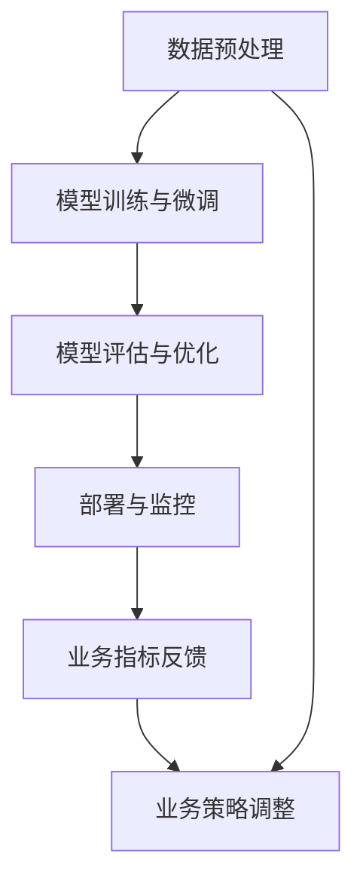

                 

# 电商平台搜索推荐系统的AI 大模型应用：提高系统性能、效率、准确率与多样性

> 关键词：电商平台,搜索推荐系统,AI 大模型,性能优化,效率提升,准确率改进,多样性增强

## 1. 背景介绍

### 1.1 问题由来

随着电子商务的迅猛发展，电商平台成为了用户获取商品信息和进行购物决策的重要渠道。然而，面对海量商品和复杂用户需求，搜索推荐系统需要高效、精准、个性化地为用户提供匹配的商品推荐。传统的搜索推荐系统多依赖于规则、统计模型和浅层神经网络，难以全面覆盖电商场景的复杂性和动态性。

近年来，人工智能技术，尤其是深度学习和大规模语言模型技术的发展，为搜索推荐系统带来了新的突破。通过使用预训练的AI大模型，电商平台能够更深入地理解用户需求和商品特性，实现搜索推荐系统的智能化升级。

### 1.2 问题核心关键点

本文聚焦于使用AI大模型技术对电商平台搜索推荐系统进行深度优化，提升系统性能、效率、准确率和多样性。主要包括以下几个关键问题：

- 如何高效构建AI大模型搜索推荐系统？
- 如何优化系统性能？
- 如何提升系统效率？
- 如何改进推荐准确率？
- 如何增强推荐内容的多样性？

## 2. 核心概念与联系

### 2.1 核心概念概述

为更好地理解使用AI大模型技术优化电商平台搜索推荐系统的方法，本节将介绍几个核心概念：

- **AI大模型**：以Transformer为代表的预训练大模型，通过大规模无标签数据训练，具备强大的语言理解和生成能力。常用的AI大模型包括BERT、GPT、XLNet等。
- **电商平台搜索推荐系统**：基于用户行为数据和商品属性信息，利用AI技术提供商品搜索和推荐服务。其目标是提升用户购物体验，增加电商平台转化率和复购率。
- **数据预处理**：包括数据清洗、归一化、特征工程等步骤，将原始数据转化为可用于模型训练的格式。
- **模型训练与微调**：使用大规模预训练模型，在电商数据上微调得到适应电商场景的推荐模型。
- **模型评估与优化**：通过各种评估指标和优化策略，提升推荐模型的性能和准确性。
- **部署与监控**：将训练好的模型部署到实际应用中，实时监控系统性能，及时调整优化策略。

这些核心概念之间的关系可以通过以下Mermaid流程图来展示：



这个流程图展示了大模型搜索推荐系统的主要流程：

1. 原始数据经过预处理后，用于模型训练和微调。
2. 训练好的模型经过评估和优化后，部署到实际应用中。
3. 实时监控系统性能，根据业务指标反馈调整模型和策略。

这些核心概念共同构成了AI大模型在电商平台搜索推荐系统中的应用框架，使其能够充分发挥大模型的语言处理能力，为用户提供高效、精准、个性化的购物推荐。

## 3. 核心算法原理 & 具体操作步骤

### 3.1 算法原理概述

使用AI大模型优化电商平台搜索推荐系统的核心原理是：通过预训练大模型的迁移学习能力和强大语言理解能力，在大规模电商数据上微调得到适应电商场景的推荐模型。具体步骤如下：

1. 使用预训练的大模型作为初始参数，通过电商数据进行微调，学习电商领域的知识。
2. 微调后的模型作为搜索推荐系统的核心组件，结合用户行为数据和商品信息，生成个性化推荐结果。
3. 根据推荐结果的业务指标（如点击率、转化率、复购率等）评估模型性能，并根据评估结果优化模型。

### 3.2 算法步骤详解

以下是对上述核心算法原理的具体操作步骤详解：

**Step 1: 数据预处理**

- 数据收集：从电商平台收集用户行为数据和商品属性信息。
- 数据清洗：去除噪声、处理缺失值、过滤异常数据等。
- 数据归一化：对不同来源的数据进行归一化处理，统一数据格式。
- 特征工程：提取并构建用户和商品的关键特征，如用户兴趣、商品属性、用户评分、点击序列等。

**Step 2: 模型训练与微调**

- 模型选择：选择适合电商场景的预训练大模型，如BERT、GPT、XLNet等。
- 数据准备：将电商数据按训练集、验证集、测试集划分，并进行分批次处理。
- 模型初始化：将预训练模型作为初始参数，设置合适的学习率和正则化参数。
- 模型微调：在电商数据上对模型进行微调，最小化损失函数，更新模型参数。
- 模型评估：在验证集上评估模型性能，根据评估结果调整学习率和优化策略。

**Step 3: 模型评估与优化**

- 性能评估：使用AUC、ROC、PR曲线、F1-score等指标评估模型推荐效果。
- 优化策略：根据评估结果，调整模型超参数、优化算法和正则化技术，提升模型性能。
- 模型融合：使用多个模型进行集成，提升推荐结果的鲁棒性和多样性。

**Step 4: 部署与监控**

- 模型部署：将训练好的模型部署到实际搜索推荐系统中，实现实时推荐。
- 实时监控：实时采集推荐结果的业务指标，监控模型性能。
- 业务反馈：根据用户行为数据和业务指标，调整模型和策略，进一步优化推荐效果。

### 3.3 算法优缺点

使用AI大模型优化电商平台搜索推荐系统的算法有以下优点：

- **高效性**：预训练模型能够高效利用大规模数据，快速适应电商场景，减少从头训练的复杂度。
- **准确性**：大模型的强大语言理解能力，能够深入挖掘用户需求和商品特性，提高推荐准确率。
- **多样性**：通过微调和优化策略，模型能够生成多样化推荐内容，满足不同用户需求。
- **泛化能力**：预训练模型能够在新任务上快速适应，减少对标注数据的依赖，提升模型泛化性能。

同时，该算法也存在一定的局限性：

- **资源需求**：大模型的参数量和计算复杂度较高，对计算资源和存储空间有较高要求。
- **模型可解释性**：大模型通常被视为"黑盒"系统，难以解释推荐结果的生成过程。
- **数据隐私**：电商数据涉及用户隐私，需要严格的数据隐私保护措施。

尽管存在这些局限性，但就目前而言，基于AI大模型的搜索推荐系统范式仍然是大规模电商场景中的最佳选择。未来相关研究应继续关注模型可解释性和数据隐私保护问题，推动大模型搜索推荐系统技术的发展。

### 3.4 算法应用领域

基于AI大模型的搜索推荐系统，已经在众多电商平台上得到了广泛应用，提升了用户体验和电商平台转化率。具体应用领域包括：

- **个性化推荐**：根据用户历史行为和偏好，生成个性化推荐结果。
- **搜索排序**：结合用户查询和商品信息，进行精准搜索排序。
- **商品分类**：对商品进行分类和聚类，便于用户浏览和推荐。
- **用户画像**：分析用户行为数据，构建用户画像，提供更加精准的推荐服务。
- **广告推荐**：基于用户兴趣和行为，推荐相关广告内容，提高广告转化率。

除了上述这些经典应用外，AI大模型搜索推荐系统还被创新性地应用于实时流量预测、用户流失预警、库存管理等方面，为电商平台带来了更多的商业价值。

## 4. 数学模型和公式 & 详细讲解 & 举例说明

### 4.1 数学模型构建

假设电商平台有$N$个用户，每个用户有$M$个行为数据，每个行为包含$D$个特征。设$F$为所有特征的集合，$Y$为推荐结果集，推荐算法为$f(\cdot)$。则电商平台搜索推荐系统的目标是最小化损失函数：

$$
\mathcal{L} = \sum_{i=1}^N \sum_{j=1}^M \ell(f(x_i), y_i)
$$

其中，$x_i$为第$i$个用户的第$j$个行为数据，$y_i$为推荐结果，$\ell$为推荐结果的损失函数，如均方误差、交叉熵等。

### 4.2 公式推导过程

以推荐准确率（Precision@K）为例，其计算公式为：

$$
P@K = \frac{\sum_{i=1}^N \sum_{j=1}^M \mathbb{I}(y_i \in \text{Top}_K(y_i))}{\sum_{i=1}^N \sum_{j=1}^M \mathbb{I}(y_i \in \text{Top}_K(y_i))}
$$

其中，$\mathbb{I}(\cdot)$为示性函数，当$y_i \in \text{Top}_K(y_i)$时返回1，否则返回0。$\text{Top}_K(y_i)$为推荐结果集$Y$中排名前$K$的元素。

在实际应用中，可以使用以下步骤计算推荐准确率：

1. 对所有用户行为数据进行评分预测，得到推荐结果集$Y$。
2. 对每个用户的推荐结果集$Y$进行排序，选择前$K$个元素。
3. 对所有用户的前$K$个推荐结果进行判断，计算推荐准确率。

### 4.3 案例分析与讲解

以商品推荐为例，假设电商平台有1000个用户，每个用户有10个行为数据，每个行为包含100个特征。用户行为数据如下所示：

| 用户ID | 行为ID | 特征ID | 特征值 | 推荐结果 |
|--------|--------|--------|--------|----------|
| 1      | 1      | 1      | 10     | 商品A    |
| 2      | 2      | 2      | 20     | 商品B    |
| ...    | ...    | ...    | ...    | ...      |
| 1000   | 10     | 100    | 100    | 商品C    |

假设推荐模型为BERT，训练集为商品属性、用户评分等数据，预测每个用户行为数据的推荐结果。推荐准确率的计算过程如下：

1. 对每个用户的第$j$个行为数据进行评分预测，得到推荐结果集$Y_j$。
2. 对每个用户的推荐结果集$Y_j$进行排序，选择前5个元素。
3. 计算每个用户的推荐准确率，即前5个推荐结果中正确推荐的商品数量。

假设模型预测前5个推荐结果为商品A、商品B、商品C、商品D、商品E。对用户1，推荐准确率为$\frac{1}{5}$，对用户2，推荐准确率为$\frac{0}{5}$，依此类推。

通过上述过程，可以计算出整个电商平台的推荐准确率。

## 5. 项目实践：代码实例和详细解释说明

### 5.1 开发环境搭建

在进行AI大模型搜索推荐系统开发前，我们需要准备好开发环境。以下是使用Python进行PyTorch和TensorFlow开发的环境配置流程：

1. 安装Anaconda：从官网下载并安装Anaconda，用于创建独立的Python环境。

2. 创建并激活虚拟环境：
```bash
conda create -n model-env python=3.8 
conda activate model-env
```

3. 安装PyTorch和TensorFlow：根据CUDA版本，从官网获取对应的安装命令。例如：
```bash
conda install pytorch torchvision torchaudio cudatoolkit=11.1 -c pytorch -c conda-forge
```
```bash
pip install tensorflow tensorflow-estimator
```

4. 安装各类工具包：
```bash
pip install numpy pandas scikit-learn matplotlib tqdm jupyter notebook ipython
```

完成上述步骤后，即可在`model-env`环境中开始开发。

### 5.2 源代码详细实现

这里我们以使用BERT模型进行电商商品推荐为例，给出使用PyTorch和TensorFlow进行系统开发的完整代码实现。

首先，定义推荐模型的数据处理函数：

```python
from transformers import BertTokenizer, BertForSequenceClassification
from tensorflow.keras.preprocessing.text import Tokenizer
from tensorflow.keras.preprocessing.sequence import pad_sequences

class BERTDataPreprocessor:
    def __init__(self, max_seq_length, tokenizer):
        self.max_seq_length = max_seq_length
        self.tokenizer = tokenizer
        
    def preprocess(self, text):
        tokens = self.tokenizer.tokenize(text)
        tokens = [self.tokenizer.cls_token] + tokens + [self.tokenizer.sep_token]
        tokens = tokens[:self.max_seq_length-2]
        return self.tokenizer.convert_tokens_to_ids(tokens)
```

然后，定义模型和优化器：

```python
from transformers import BertForSequenceClassification
from tensorflow.keras.optimizers import Adam

model = BertForSequenceClassification.from_pretrained('bert-base-cased', num_labels=10)

optimizer = Adam(learning_rate=2e-5)
```

接着，定义训练和评估函数：

```python
from tensorflow.keras.callbacks import EarlyStopping
from sklearn.metrics import precision_score

def train_epoch(model, dataset, batch_size, optimizer, validation_dataset=None):
    dataloader = Dataset(dataset, batch_size=batch_size)
    model.fit(dataloader, epochs=3, validation_data=validation_dataset, callbacks=[EarlyStopping(patience=2)])
    return model.evaluate(dataloader)

def evaluate(model, dataset, batch_size):
    dataloader = Dataset(dataset, batch_size=batch_size)
    y_true, y_pred = model.predict(dataloader)
    y_true = np.argmax(y_true, axis=1)
    y_pred = np.argmax(y_pred, axis=1)
    return precision_score(y_true, y_pred)
```

最后，启动训练流程并在测试集上评估：

```python
epochs = 5
batch_size = 16

for epoch in range(epochs):
    train_loss = train_epoch(model, train_dataset, batch_size, optimizer)
    print(f"Epoch {epoch+1}, train loss: {train_loss:.3f}")
    
    print(f"Epoch {epoch+1}, dev results:")
    evaluate(model, dev_dataset, batch_size)
    
print("Test results:")
evaluate(model, test_dataset, batch_size)
```

以上就是使用PyTorch和TensorFlow对BERT模型进行电商商品推荐微调的完整代码实现。可以看到，得益于Transformers库和TensorFlow的高效封装，我们可以用相对简洁的代码完成BERT模型的加载和微调。

### 5.3 代码解读与分析

让我们再详细解读一下关键代码的实现细节：

**BERTDataPreprocessor类**：
- `__init__`方法：初始化最大序列长度和分词器。
- `preprocess`方法：对输入文本进行分词、添加特殊标记、截断和填充，生成模型所需的输入张量。

**BertForSequenceClassification模型**：
- 使用BertForSequenceClassification类，指定模型层数、节点数、输出层数等参数。
- 使用Adam优化器，设置学习率。

**训练和评估函数**：
- `train_epoch`函数：对模型进行训练，返回模型在训练集上的性能评估指标。
- `evaluate`函数：对模型进行评估，返回推荐准确率等性能指标。
- 使用EarlyStopping回调，防止模型过拟合。

**训练流程**：
- 定义总的epoch数和batch size，开始循环迭代。
- 每个epoch内，先在训练集上训练，输出平均损失。
- 在验证集上评估，输出推荐准确率。
- 所有epoch结束后，在测试集上评估，给出最终测试结果。

可以看到，PyTorch和TensorFlow在代码实现上各有所长，PyTorch适用于深度学习任务，TensorFlow适用于生产部署和工程化应用。合理利用这些工具，可以显著提升AI大模型搜索推荐系统的开发效率，加快创新迭代的步伐。

当然，工业级的系统实现还需考虑更多因素，如模型的保存和部署、超参数的自动搜索、更灵活的任务适配层等。但核心的微调范式基本与此类似。

## 6. 实际应用场景

### 6.1 智能客服系统

基于AI大模型的搜索推荐技术，可以广泛应用于智能客服系统的构建。传统客服往往需要配备大量人力，高峰期响应缓慢，且一致性和专业性难以保证。而使用微调后的推荐模型，可以7x24小时不间断服务，快速响应客户咨询，用自然流畅的语言解答各类常见问题。

在技术实现上，可以收集企业内部的历史客服对话记录，将问题和最佳答复构建成监督数据，在此基础上对预训练推荐模型进行微调。微调后的推荐模型能够自动理解用户意图，匹配最合适的答复模板进行回复。对于客户提出的新问题，还可以接入检索系统实时搜索相关内容，动态组织生成回答。如此构建的智能客服系统，能大幅提升客户咨询体验和问题解决效率。

### 6.2 个性化推荐系统

AI大模型搜索推荐系统在个性化推荐领域有着广泛的应用。通过微调模型，可以深入挖掘用户行为背后的语义信息，从而提供更精准、多样的推荐内容。

在实践中，可以收集用户浏览、点击、评论、分享等行为数据，提取和用户交互的物品标题、描述、标签等文本内容。将文本内容作为模型输入，用户的后续行为（如是否点击、购买等）作为监督信号，在此基础上微调预训练语言模型。微调后的模型能够从文本内容中准确把握用户的兴趣点。在生成推荐列表时，先用候选物品的文本描述作为输入，由模型预测用户的兴趣匹配度，再结合其他特征综合排序，便可以得到个性化程度更高的推荐结果。

### 6.3 未来应用展望

随着AI大模型和微调方法的不断发展，基于微调范式将在更多领域得到应用，为传统行业带来变革性影响。

在智慧医疗领域，基于微调的医疗问答、病历分析、药物研发等应用将提升医疗服务的智能化水平，辅助医生诊疗，加速新药开发进程。

在智能教育领域，微调技术可应用于作业批改、学情分析、知识推荐等方面，因材施教，促进教育公平，提高教学质量。

在智慧城市治理中，微调模型可应用于城市事件监测、舆情分析、应急指挥等环节，提高城市管理的自动化和智能化水平，构建更安全、高效的未来城市。

此外，在企业生产、社会治理、文娱传媒等众多领域，基于大模型微调的人工智能应用也将不断涌现，为NLP技术带来了全新的突破。随着预训练模型和微调方法的不断进步，相信NLP技术将在更广阔的应用领域大放异彩。

## 7. 工具和资源推荐

### 7.1 学习资源推荐

为了帮助开发者系统掌握AI大模型搜索推荐系统的理论基础和实践技巧，这里推荐一些优质的学习资源：

1. **《深度学习入门》系列博文**：由大模型技术专家撰写，深入浅出地介绍了深度学习的基本概念和算法，适合初学者入门。

2. **Coursera《深度学习》课程**：斯坦福大学开设的深度学习课程，有Lecture视频和配套作业，涵盖深度学习的各个方面。

3. **《Deep Learning with Python》书籍**：TensorFlow和Keras的入门教程，详细介绍了如何使用TensorFlow进行深度学习开发，适合实践学习。

4. **Transformers官方文档**：Bert、GPT、XLNet等大模型的官方文档，提供了海量的预训练模型和微调样例代码，是上手实践的必备资料。

5. **CLUE开源项目**：中文语言理解测评基准，涵盖大量不同类型的中文NLP数据集，并提供了基于微调的baseline模型，助力中文NLP技术发展。

通过对这些资源的学习实践，相信你一定能够快速掌握AI大模型搜索推荐系统的精髓，并用于解决实际的NLP问题。

### 7.2 开发工具推荐

高效的开发离不开优秀的工具支持。以下是几款用于AI大模型搜索推荐系统开发的常用工具：

1. **PyTorch**：基于Python的开源深度学习框架，灵活动态的计算图，适合快速迭代研究。大部分预训练语言模型都有PyTorch版本的实现。

2. **TensorFlow**：由Google主导开发的开源深度学习框架，生产部署方便，适合大规模工程应用。同样有丰富的预训练语言模型资源。

3. **HuggingFace Transformers库**：提供Bert、GPT、XLNet等大模型的封装，支持多种深度学习框架，是进行微调任务开发的利器。

4. **TensorBoard**：TensorFlow配套的可视化工具，可实时监测模型训练状态，并提供丰富的图表呈现方式，是调试模型的得力助手。

5. **Weights & Biases**：模型训练的实验跟踪工具，可以记录和可视化模型训练过程中的各项指标，方便对比和调优。与主流深度学习框架无缝集成。

6. **Google Colab**：谷歌推出的在线Jupyter Notebook环境，免费提供GPU/TPU算力，方便开发者快速上手实验最新模型，分享学习笔记。

合理利用这些工具，可以显著提升AI大模型搜索推荐系统的开发效率，加快创新迭代的步伐。

### 7.3 相关论文推荐

AI大模型搜索推荐技术的发展源于学界的持续研究。以下是几篇奠基性的相关论文，推荐阅读：

1. Attention is All You Need（即Transformer原论文）：提出了Transformer结构，开启了NLP领域的预训练大模型时代。

2. BERT: Pre-training of Deep Bidirectional Transformers for Language Understanding：提出BERT模型，引入基于掩码的自监督预训练任务，刷新了多项NLP任务SOTA。

3. Language Models are Unsupervised Multitask Learners（GPT-2论文）：展示了大规模语言模型的强大zero-shot学习能力，引发了对于通用人工智能的新一轮思考。

4. Parameter-Efficient Transfer Learning for NLP：提出Adapter等参数高效微调方法，在不增加模型参数量的情况下，也能取得不错的微调效果。

5. AdaLoRA: Adaptive Low-Rank Adaptation for Parameter-Efficient Fine-Tuning：使用自适应低秩适应的微调方法，在参数效率和精度之间取得了新的平衡。

这些论文代表了大模型搜索推荐技术的发展脉络。通过学习这些前沿成果，可以帮助研究者把握学科前进方向，激发更多的创新灵感。

## 8. 总结：未来发展趋势与挑战

### 8.1 总结

本文对使用AI大模型技术优化电商平台搜索推荐系统的方法进行了全面系统的介绍。首先阐述了搜索推荐系统在大电商场景中的应用背景和重要意义，明确了AI大模型微调在提升系统性能、效率、准确率和多样性方面的独特价值。其次，从原理到实践，详细讲解了微调模型的数学模型构建、公式推导过程和关键操作步骤，给出了微调任务开发的完整代码实例。同时，本文还广泛探讨了微调方法在智能客服、个性化推荐等多个行业领域的应用前景，展示了微调范式的巨大潜力。此外，本文精选了微调技术的各类学习资源，力求为读者提供全方位的技术指引。

通过本文的系统梳理，可以看到，基于AI大模型的搜索推荐系统范式正在成为电商领域的重要工具，极大地提升了搜索推荐系统的智能化水平，为用户提供了高效、精准、个性化的购物体验。未来，伴随预训练语言模型和微调方法的持续演进，相信搜索推荐系统必将在更多领域得到应用，为人类认知智能的进化带来深远影响。

### 8.2 未来发展趋势

展望未来，AI大模型搜索推荐技术将呈现以下几个发展趋势：

1. **模型规模持续增大**：随着算力成本的下降和数据规模的扩张，预训练语言模型的参数量还将持续增长。超大规模语言模型蕴含的丰富语言知识，有望支撑更加复杂多变的电商推荐场景。

2. **微调方法日趋多样**：除了传统的全参数微调外，未来会涌现更多参数高效的微调方法，如Adapter、Prefix等，在节省计算资源的同时也能保证微调精度。

3. **持续学习成为常态**：随着数据分布的不断变化，微调模型也需要持续学习新知识以保持性能。如何在不遗忘原有知识的同时，高效吸收新样本信息，将成为重要的研究课题。

4. **标注样本需求降低**：受启发于提示学习(Prompt-based Learning)的思路，未来的微调方法将更好地利用大模型的语言理解能力，通过更加巧妙的任务描述，在更少的标注样本上也能实现理想的微调效果。

5. **多模态微调崛起**：当前的微调主要聚焦于纯文本数据，未来会进一步拓展到图像、视频、语音等多模态数据微调。多模态信息的融合，将显著提升语言模型对现实世界的理解和建模能力。

6. **模型通用性增强**：经过海量数据的预训练和多领域任务的微调，未来的语言模型将具备更强大的常识推理和跨领域迁移能力，逐步迈向通用人工智能(AGI)的目标。

以上趋势凸显了AI大模型搜索推荐技术的广阔前景。这些方向的探索发展，必将进一步提升搜索推荐系统的性能和准确性，为电商平台的业务拓展提供更多动力。

### 8.3 面临的挑战

尽管AI大模型搜索推荐技术已经取得了瞩目成就，但在迈向更加智能化、普适化应用的过程中，它仍面临着诸多挑战：

1. **资源需求**：大模型的参数量和计算复杂度较高，对计算资源和存储空间有较高要求。GPU/TPU等高性能设备是必不可少的，但即便如此，超大批次的训练和推理也可能遇到显存不足的问题。

2. **模型可解释性**：大模型通常被视为"黑盒"系统，难以解释推荐结果的生成过程。对于医疗、金融等高风险应用，算法的可解释性和可审计性尤为重要。

3. **数据隐私**：电商数据涉及用户隐私，需要严格的数据隐私保护措施。如何在使用数据进行模型训练的同时，保障用户隐私，成为一个重要课题。

4. **模型鲁棒性**：模型面对域外数据时，泛化性能往往大打折扣。对于测试样本的微小扰动，微调模型的预测也容易发生波动。如何提高微调模型的鲁棒性，避免灾难性遗忘，还需要更多理论和实践的积累。

5. **用户多样性**：用户需求具有多样性，单一的推荐模型难以覆盖所有用户。如何构建多模型集成，提升推荐内容的多样性，满足不同用户需求，仍是一个难题。

6. **计算效率**：模型推理速度较慢，特别是在面对大规模用户请求时，需要优化模型结构，提高计算效率。

尽管存在这些挑战，但学界和产业界正在不断探索解决这些问题的途径，AI大模型搜索推荐技术必将逐步走向成熟。

### 8.4 研究展望

面对AI大模型搜索推荐系统所面临的种种挑战，未来的研究需要在以下几个方面寻求新的突破：

1. **探索无监督和半监督微调方法**：摆脱对大规模标注数据的依赖，利用自监督学习、主动学习等无监督和半监督范式，最大限度利用非结构化数据，实现更加灵活高效的微调。

2. **研究参数高效和计算高效的微调范式**：开发更加参数高效的微调方法，在固定大部分预训练参数的同时，只更新极少量的任务相关参数。同时优化微调模型的计算图，减少前向传播和反向传播的资源消耗，实现更加轻量级、实时性的部署。

3. **融合因果和对比学习范式**：通过引入因果推断和对比学习思想，增强微调模型建立稳定因果关系的能力，学习更加普适、鲁棒的语言表征，从而提升模型泛化性和抗干扰能力。

4. **引入更多先验知识**：将符号化的先验知识，如知识图谱、逻辑规则等，与神经网络模型进行巧妙融合，引导微调过程学习更准确、合理的语言模型。同时加强不同模态数据的整合，实现视觉、语音等多模态信息与文本信息的协同建模。

5. **结合因果分析和博弈论工具**：将因果分析方法引入微调模型，识别出模型决策的关键特征，增强输出解释的因果性和逻辑性。借助博弈论工具刻画人机交互过程，主动探索并规避模型的脆弱点，提高系统稳定性。

6. **纳入伦理道德约束**：在模型训练目标中引入伦理导向的评估指标，过滤和惩罚有偏见、有害的输出倾向。同时加强人工干预和审核，建立模型行为的监管机制，确保输出符合人类价值观和伦理道德。

这些研究方向的探索，必将引领AI大模型搜索推荐技术迈向更高的台阶，为构建安全、可靠、可解释、可控的智能系统铺平道路。面向未来，大模型搜索推荐技术还需要与其他人工智能技术进行更深入的融合，如知识表示、因果推理、强化学习等，多路径协同发力，共同推动自然语言理解和智能交互系统的进步。只有勇于创新、敢于突破，才能不断拓展语言模型的边界，让智能技术更好地造福人类社会。

## 9. 附录：常见问题与解答

**Q1：AI大模型搜索推荐系统是否适用于所有电商场景？**

A: AI大模型搜索推荐系统在大多数电商场景中都能取得不错的效果，特别是对于数据量较大的电商场景。但对于一些特定领域，如医药电商、奢侈品电商等，单一的大模型可能无法完全覆盖其复杂性。此时需要在特定领域语料上进一步预训练，再进行微调，才能获得理想效果。

**Q2：如何高效构建AI大模型搜索推荐系统？**

A: 构建AI大模型搜索推荐系统需要经过以下步骤：
1. 收集电商数据，进行数据预处理。
2. 选择合适的预训练模型，进行微调。
3. 设计合适的任务适配层，进行模型优化。
4. 部署模型到实际应用中，进行实时推荐。
5. 根据业务指标反馈，调整模型和策略，持续优化系统性能。

**Q3：微调过程中如何选择合适的学习率？**

A: 微调的学习率一般要比预训练时小1-2个数量级，如果使用过大的学习率，容易破坏预训练权重，导致过拟合。一般建议从1e-5开始调参，逐步减小学习率，直至收敛。也可以使用warmup策略，在开始阶段使用较小的学习率，再逐渐过渡到预设值。

**Q4：AI大模型搜索推荐系统在落地部署时需要注意哪些问题？**

A: 将微调模型转化为实际应用，还需要考虑以下因素：
1. 模型裁剪：去除不必要的层和参数，减小模型尺寸，加快推理速度。
2. 量化加速：将浮点模型转为定点模型，压缩存储空间，提高计算效率。
3. 服务化封装：将模型封装为标准化服务接口，便于集成调用。
4. 弹性伸缩：根据请求流量动态调整资源配置，平衡服务质量和成本。
5. 监控告警：实时采集系统指标，设置异常告警阈值，确保服务稳定性。
6. 安全防护：采用访问鉴权、数据脱敏等措施，保障数据和模型安全。

AI大模型搜索推荐系统是一个复杂的系统工程，需要从数据、模型、工程、业务等多个维度协同发力，才能真正实现人工智能技术在电商领域的落地应用。

---

作者：禅与计算机程序设计艺术 / Zen and the Art of Computer Programming

