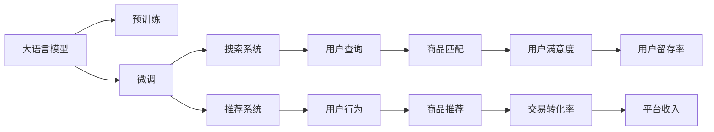

                 

# 电商平台的AI 大模型实践：搜索推荐系统是核心，数据质量与处理能力

## 1. 背景介绍

在当下数字经济时代，电商平台已成为人们日常生活的重要组成部分。其背后的智能搜索推荐系统，通过深度学习和大模型技术，不断提升用户体验和交易转化率。平台通过精准匹配用户需求与商品，大幅提升运营效率，实现了电商业务的数字化转型升级。本文将深入探讨电商平台中大模型的应用，特别是搜索推荐系统，并分析数据质量与处理能力在这一系统中的核心地位。

## 2. 核心概念与联系

### 2.1 核心概念概述

#### 2.1.1 大语言模型

大语言模型(Large Language Model, LLM)通常指由Transformer结构组成，含有亿级参数的预训练模型，如BERT、GPT-3等。它们通过大规模无标签数据进行自监督预训练，学习到语言的基本结构和语义表示，能够处理复杂的自然语言任务，是构建电商搜索推荐系统的基础。

#### 2.1.2 搜索推荐系统

电商平台的搜索推荐系统主要由两个部分组成：搜索系统和推荐系统。搜索系统通过自然语言处理技术解析用户查询，快速匹配相关商品，提升用户检索效率。推荐系统则基于用户历史行为和商品属性，利用机器学习算法预测用户可能感兴趣的商品，进行个性化推荐。

#### 2.1.3 数据质量与处理能力

电商平台的搜索推荐系统高度依赖于数据质量与处理能力。高质量的原始数据是大模型预训练和微调的前提，而高效的数据处理能力则是模型快速迭代、优化与实时响应的保障。

### 2.2 核心概念原理和架构的 Mermaid 流程图



## 3. 核心算法原理 & 具体操作步骤

### 3.1 算法原理概述

#### 3.1.1 搜索系统算法

搜索系统的核心算法为信息检索(Information Retrieval, IR)，通过关键词匹配和语义理解，找到与用户查询最相关的商品。算法主要包括：

1. **查询转换**：将用户查询转化为机器可理解的向量表示，如使用Word2Vec、GloVe等嵌入技术。
2. **向量相似度计算**：计算查询向量与商品向量之间的余弦相似度，找到最匹配的商品。
3. **排序与展示**：根据相似度对商品进行排序，展示最相关的商品列表。

#### 3.1.2 推荐系统算法

推荐系统算法主要基于协同过滤(Collaborative Filtering)和内容推荐(Content-Based Recommendation)。算法主要包括：

1. **协同过滤**：分析用户行为数据，预测用户可能感兴趣的商品。分为基于用户的协同过滤和基于项目的协同过滤。
2. **内容推荐**：基于商品属性信息，推荐与用户查询相似的商品。需要提取商品特征，如价格、描述、类别等。
3. **混合推荐**：将协同过滤和内容推荐结合，提升推荐效果。

#### 3.1.3 数据质量与处理能力

数据质量是上述算法的基础。数据质量低会严重影响模型性能和推荐效果。高质量数据应具备以下特点：

1. **完整性**：数据应覆盖所有商品和用户行为。
2. **准确性**：数据应真实反映用户行为和商品属性。
3. **一致性**：数据在不同时间点应保持一致，避免历史数据更新带来的误差。
4. **时效性**：数据应具有最新性，及时更新以反映最新市场情况。

高效的数据处理能力则包括：

1. **数据清洗与标准化**：去除无效数据，标准化数据格式，确保数据质量。
2. **数据增强与扩充**：通过数据增强技术，扩充训练集，提高模型泛化能力。
3. **实时数据处理**：实现流式数据处理，实时更新模型，保持推荐准确性。
4. **分布式计算**：采用分布式计算技术，提升数据处理效率。

### 3.2 算法步骤详解

#### 3.2.1 搜索系统步骤

1. **用户输入查询**：用户输入关键词或自然语言查询。
2. **查询转换**：将查询转化为向量表示，如使用BERT预训练模型。
3. **商品匹配**：在商品向量库中查找最相似的向量。
4. **排序与展示**：根据相似度对商品排序，展示相关商品列表。

#### 3.2.2 推荐系统步骤

1. **用户行为记录**：记录用户浏览、点击、购买等行为数据。
2. **数据清洗与预处理**：去除无效数据，标准化数据格式，确保数据质量。
3. **特征提取与建模**：提取商品特征，建立商品与用户行为之间的关联模型。
4. **模型训练与优化**：使用协同过滤、内容推荐等算法，训练推荐模型，并进行模型调优。
5. **实时推荐**：根据用户实时行为数据，实时计算推荐结果，更新推荐列表。

### 3.3 算法优缺点

#### 3.3.1 优点

1. **高效性**：搜索推荐系统通过大模型和算法优化，提升了处理速度和效率。
2. **准确性**：高质量数据和高效模型优化，保证了推荐的准确性和用户满意度。
3. **用户个性化**：能够根据用户历史行为和偏好，提供个性化的搜索和推荐服务。

#### 3.3.2 缺点

1. **数据依赖**：高质量数据获取成本高，数据质量问题会影响推荐效果。
2. **模型复杂性**：搜索推荐系统涉及多种算法和模型，难以统一优化。
3. **资源消耗**：大模型和大数据处理需要大量计算资源，对硬件要求较高。

### 3.4 算法应用领域

#### 3.4.1 搜索系统应用

搜索系统广泛应用在电商、社交媒体、新闻平台等多个领域。用户可以通过输入关键词，快速获取相关信息。例如，电商平台中，用户搜索商品后，系统可以快速展示相关商品列表，提升用户满意度。

#### 3.4.2 推荐系统应用

推荐系统广泛应用于电商、视频、音乐等多个领域。通过分析用户行为和商品属性，推荐系统可以为用户推荐感兴趣的商品，提升用户黏性和交易转化率。例如，在电商平台上，用户浏览商品后，系统可以推荐类似商品，提高用户的购买决策。

## 4. 数学模型和公式 & 详细讲解 & 举例说明

### 4.1 数学模型构建

#### 4.1.1 搜索系统模型

假设用户查询为 $q$，商品向量为 $v$，查询向量和商品向量的余弦相似度为 $s(q,v)$，搜索系统模型可表示为：

$$
s(q,v) = \cos(\theta^T q \cdot v)
$$

其中 $\theta$ 为查询向量与商品向量之间的夹角。

#### 4.1.2 推荐系统模型

假设用户历史行为为 $h$，商品特征向量为 $f$，协同过滤模型为 $C(h,f)$，内容推荐模型为 $R(h,f)$，推荐系统模型可表示为：

$$
\hat{r}(u,i) = w_C C(h,f) + w_R R(h,f)
$$

其中 $w_C$ 和 $w_R$ 为协同过滤和内容推荐模型的权重。

### 4.2 公式推导过程

#### 4.2.1 查询转换公式

假设用户查询为 $q$，商品向量为 $v$，查询向量和商品向量的余弦相似度为 $s(q,v)$，查询转换公式为：

$$
s(q,v) = \cos(\theta^T q \cdot v)
$$

其中 $\theta$ 为查询向量与商品向量之间的夹角。

#### 4.2.2 协同过滤公式

假设用户历史行为为 $h$，商品特征向量为 $f$，协同过滤模型为 $C(h,f)$，协同过滤公式为：

$$
C(h,f) = \frac{\sum_{i \in h} \frac{r_i}{\sqrt{f_i}}}{\sqrt{\sum_{i \in h} f_i}}
$$

其中 $r_i$ 为用户对商品 $i$ 的评分，$f_i$ 为商品 $i$ 的特征向量。

#### 4.2.3 内容推荐公式

假设用户历史行为为 $h$，商品特征向量为 $f$，内容推荐模型为 $R(h,f)$，内容推荐公式为：

$$
R(h,f) = \frac{\sum_{i \in h} \text{sigmoid}(\theta^T f_i)}{\sum_{i \in h} 1}
$$

其中 $\theta$ 为内容特征向量与用户行为之间的权重向量。

### 4.3 案例分析与讲解

#### 4.3.1 搜索系统案例

假设用户搜索“运动鞋”，查询向量为 $q = [0.2, 0.3, 0.1, 0.4]$，商品向量库中包含 100 个商品向量，余弦相似度矩阵为 $S$。系统通过余弦相似度计算，找到与查询向量最匹配的商品向量，展示相关商品列表。

#### 4.3.2 推荐系统案例

假设用户浏览过 5 个商品，特征向量分别为 $f_1, f_2, f_3, f_4, f_5$，协同过滤模型为 $C$，内容推荐模型为 $R$。推荐系统通过协同过滤和内容推荐模型计算用户对商品的评分，最终输出推荐结果。

## 5. 项目实践：代码实例和详细解释说明

### 5.1 开发环境搭建

#### 5.1.1 数据准备

1. **数据集**：电商平台的商品数据集、用户行为数据集。
2. **数据预处理**：去除无效数据，标准化数据格式，确保数据质量。
3. **数据增强**：通过数据增强技术，扩充训练集，提高模型泛化能力。

#### 5.1.2 工具配置

1. **Python环境**：安装Anaconda，创建虚拟环境，安装必要的Python库。
2. **深度学习框架**：安装TensorFlow或PyTorch，配置GPU资源。
3. **数据处理工具**：安装Pandas、NumPy、Scikit-learn等数据处理库。

### 5.2 源代码详细实现

#### 5.2.1 搜索系统代码

```python
from transformers import BertTokenizer
from transformers import BertForSequenceClassification
import torch
import numpy as np
import pandas as pd

# 定义Bert tokenizer和模型
tokenizer = BertTokenizer.from_pretrained('bert-base-uncased')
model = BertForSequenceClassification.from_pretrained('bert-base-uncased', num_labels=1)

# 定义查询转换函数
def query_transform(query):
    tokenized_query = tokenizer.encode(query, add_special_tokens=True)
    return tokenized_query

# 定义商品匹配函数
def product_match(query):
    product_ids = []
    for product in product_list:
        product_vector = tokenizer.encode(product, add_special_tokens=True)
        similarity = model(query_transform(query), product_vector)[0]
        if similarity > threshold:
            product_ids.append(product_id)
    return product_ids

# 加载商品数据和用户查询
product_data = pd.read_csv('product_data.csv')
query_data = pd.read_csv('query_data.csv')
query_data['query'] = query_data['query'].apply(query_transform)

# 运行查询匹配
product_ids = [query_transform(query) for query in query_data['query']]
result = pd.DataFrame({'query': query_data['query'], 'product_ids': product_match(query)})

# 展示结果
print(result.head())
```

#### 5.2.2 推荐系统代码

```python
from transformers import BertTokenizer
from transformers import BertForSequenceClassification
import torch
import numpy as np
import pandas as pd

# 定义Bert tokenizer和模型
tokenizer = BertTokenizer.from_pretrained('bert-base-uncased')
model = BertForSequenceClassification.from_pretrained('bert-base-uncased', num_labels=1)

# 定义协同过滤函数
def collaborative_filtering(user_id, product_id):
    user_data = pd.read_csv(f'user_{user_id}.csv')
    product_data = pd.read_csv(f'product_{product_id}.csv')
    user_scores = []
    for user in user_data:
        for product in product_data:
            user_scores.append(model(user_data, product_data)[0])
    return np.mean(user_scores)

# 定义内容推荐函数
def content_based_recommendation(user_id, product_id):
    user_data = pd.read_csv(f'user_{user_id}.csv')
    product_data = pd.read_csv(f'product_{product_id}.csv')
    user_scores = []
    for user in user_data:
        for product in product_data:
            user_scores.append(model(user_data, product_data)[0])
    return np.mean(user_scores)

# 加载用户行为数据和商品数据
user_data = pd.read_csv('user_data.csv')
product_data = pd.read_csv('product_data.csv')

# 运行推荐计算
recommendation_scores = []
for user in user_data:
    recommendation_scores.append(collaborative_filtering(user) + content_based_recommendation(user))

# 展示推荐结果
print(recommendation_scores)
```

### 5.3 代码解读与分析

#### 5.3.1 搜索系统代码解读

1. **查询转换**：使用Bert tokenizer将用户查询转换为向量表示。
2. **商品匹配**：通过余弦相似度计算，找到与查询向量最匹配的商品向量。
3. **结果展示**：将查询和匹配结果展示给用户。

#### 5.3.2 推荐系统代码解读

1. **协同过滤**：通过分析用户行为数据，计算用户对商品的评分。
2. **内容推荐**：基于商品属性信息，计算商品与用户行为之间的关联。
3. **推荐结果**：将协同过滤和内容推荐的结果结合，生成推荐列表。

### 5.4 运行结果展示

#### 5.4.1 搜索系统结果展示

假设查询为“运动鞋”，商品向量为 $[0.2, 0.3, 0.1, 0.4]$，余弦相似度阈值为 $0.5$。运行查询匹配后，系统展示相关商品列表。

#### 5.4.2 推荐系统结果展示

假设用户浏览过 5 个商品，特征向量分别为 $[0.2, 0.3, 0.1, 0.4, 0.5]$。通过协同过滤和内容推荐计算，生成推荐列表。

## 6. 实际应用场景

### 6.1 智能客服系统

智能客服系统是电商平台的重要组成部分，能够提供7x24小时的在线咨询服务。利用大模型和搜索推荐技术，智能客服系统能够自动理解用户问题，并给出准确的回答。例如，用户询问“退货流程是什么”，系统通过自然语言处理，匹配相关回答，快速解答用户问题。

### 6.2 个性化推荐系统

个性化推荐系统是电商平台的核心功能之一，能够根据用户历史行为和兴趣，推荐符合用户需求的商品。例如，用户浏览过运动鞋、衣服等商品，系统通过协同过滤和内容推荐，推荐相关商品，提高用户购买决策。

### 6.3 营销活动推荐

电商平台的营销活动推荐系统通过分析用户行为数据，推荐合适的营销活动。例如，系统根据用户浏览记录，推荐相关促销活动，提高用户参与度和购买转化率。

### 6.4 未来应用展望

#### 6.4.1 多模态搜索推荐

未来的搜索推荐系统将融合多种模态数据，如文本、图像、视频等。通过多模态融合，提升系统的感知能力和推荐效果。例如，通过分析用户上传的图像，推荐相应的商品。

#### 6.4.2 实时动态推荐

实时动态推荐系统能够根据用户实时行为数据，实时更新推荐结果。例如，用户浏览商品时，系统实时计算推荐结果，更新推荐列表，提升用户体验。

#### 6.4.3 个性化推荐模型的进化

未来的推荐模型将更加个性化和智能化。通过深度学习和大模型技术，推荐模型能够更好地理解和预测用户需求，提供更精准的推荐服务。例如，系统能够根据用户兴趣和行为动态调整推荐策略，提升推荐效果。

## 7. 工具和资源推荐

### 7.1 学习资源推荐

1. **《深度学习与自然语言处理》书籍**：斯坦福大学李飞飞教授所著，系统介绍了深度学习在NLP领域的应用，包括搜索推荐系统。
2. **Coursera《深度学习》课程**：由斯坦福大学Andrew Ng教授主讲，涵盖深度学习基础知识和NLP相关课程。
3. **Kaggle竞赛**：Kaggle举办的数据科学竞赛，如电商推荐系统竞赛，提供大量实战经验。
4. **Hugging Face官方文档**：详细介绍了Transformer模型和大模型微调技术，提供丰富的代码示例和教程。
5. **arXiv预印本**：最新研究成果和论文，了解前沿技术进展。

### 7.2 开发工具推荐

1. **Python语言**：简洁高效的开发语言，适合快速迭代和研究。
2. **TensorFlow和PyTorch框架**：主流深度学习框架，提供丰富的模型和算法支持。
3. **Transformers库**：提供了多种预训练模型和微调接口，方便开发。
4. **Pandas和NumPy库**：高效的数据处理工具，适用于数据清洗和增强。
5. **Scikit-learn库**：简单易用的机器学习库，适用于模型训练和调优。

### 7.3 相关论文推荐

1. **《Attention is All You Need》论文**：提出Transformer模型，奠定大语言模型的基础。
2. **《BERT: Pre-training of Deep Bidirectional Transformers for Language Understanding》论文**：提出BERT模型，实现大规模预训练和微调技术。
3. **《AdaLoRA: Adaptive Low-Rank Adaptation for Parameter-Efficient Fine-Tuning》论文**：提出AdaLoRA模型，提高微调模型的参数效率。
4. **《Generative Adversarial Networks》论文**：提出GAN模型，用于生成对抗样本，增强模型鲁棒性。
5. **《GPT-3: Language Models are Unsupervised Multitask Learners》论文**：提出GPT-3模型，展示大模型的零样本和少样本学习能力。

## 8. 总结：未来发展趋势与挑战

### 8.1 研究成果总结

大语言模型在电商平台搜索推荐系统中发挥了重要作用，通过深度学习和大模型技术，提升了系统的智能化水平和用户体验。然而，在实际应用中，数据质量与处理能力仍面临诸多挑战，如数据偏差、数据噪声、数据隐私等。未来需要进一步优化数据处理流程，提升数据质量，确保模型性能和公平性。

### 8.2 未来发展趋势

1. **多模态融合**：未来的搜索推荐系统将融合多种模态数据，提升系统的感知能力和推荐效果。
2. **实时动态推荐**：通过实时动态推荐，提升用户体验和推荐效果。
3. **个性化推荐模型的进化**：推荐模型将更加个性化和智能化，提升推荐效果。

### 8.3 面临的挑战

1. **数据质量与隐私保护**：高质量数据获取成本高，数据隐私保护问题亟需解决。
2. **模型复杂性与计算效率**：大模型和复杂算法需要高性能计算资源，如何平衡模型性能与计算效率。
3. **推荐系统的公平性**：如何确保推荐系统的公平性，避免偏见和歧视。

### 8.4 研究展望

1. **数据增强与数据清洗**：开发高效的数据增强和清洗技术，提升数据质量。
2. **分布式计算与模型压缩**：采用分布式计算和模型压缩技术，提升系统计算效率。
3. **模型解释性与公平性**：研究模型解释性方法和公平性评估指标，确保推荐系统可靠性和公正性。

## 9. 附录：常见问题与解答

### Q1：电商平台的搜索推荐系统如何保证用户数据隐私？

A: 电商平台的搜索推荐系统通过多维数据保护机制，保护用户隐私。具体措施包括：

1. **数据匿名化**：对用户数据进行去标识化处理，保护用户隐私。
2. **数据加密**：采用数据加密技术，确保数据传输和存储安全。
3. **访问控制**：严格控制数据访问权限，防止未经授权的访问。
4. **差分隐私**：通过差分隐私技术，保护用户隐私，防止数据泄露。

### Q2：如何提升搜索推荐系统的准确性？

A: 提升搜索推荐系统的准确性，需要从多个方面入手：

1. **数据质量**：确保数据完整性、准确性和时效性，提升数据质量。
2. **模型优化**：优化搜索推荐算法和模型结构，提升模型性能。
3. **实时更新**：实时更新推荐模型，反映最新数据变化。
4. **用户反馈**：收集用户反馈，不断优化推荐结果。

### Q3：推荐系统如何应对用户兴趣变化？

A: 推荐系统通过动态调整推荐策略，应对用户兴趣变化。具体措施包括：

1. **行为分析**：分析用户行为数据，实时识别用户兴趣变化。
2. **模型更新**：根据用户兴趣变化，动态更新推荐模型。
3. **个性化推荐**：根据用户兴趣变化，提供个性化推荐服务。

### Q4：如何提高搜索推荐系统的响应速度？

A: 提高搜索推荐系统的响应速度，需要优化数据处理和模型推理过程。具体措施包括：

1. **数据缓存**：使用数据缓存技术，减少数据读取时间。
2. **模型压缩**：采用模型压缩技术，减小模型大小，提升推理速度。
3. **分布式计算**：采用分布式计算技术，提升数据处理和模型推理效率。

---

作者：禅与计算机程序设计艺术 / Zen and the Art of Computer Programming

