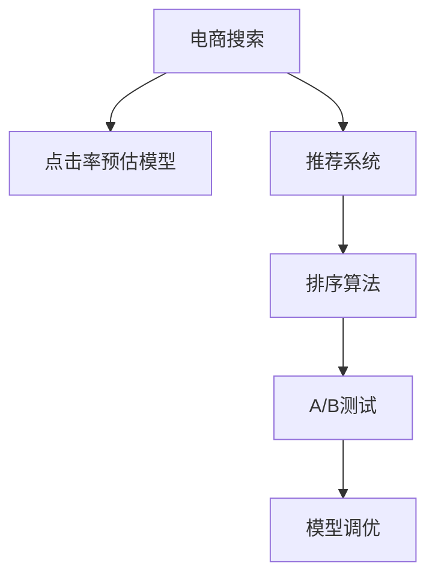

                 

# 电商搜索中的个性化排序模型优化

> 关键词：电商搜索, 个性化排序, 推荐系统, 点击率预估, A/B测试, 模型调优, 用户体验

## 1. 背景介绍

### 1.1 问题由来

在电商领域，随着消费者需求的多样化和购物习惯的个性化，电商搜索系统的个性化程度已成为影响用户购物体验和转化率的关键因素。传统的搜索排序算法往往基于搜索关键词与商品标题的匹配度，忽略了用户的个人偏好和行为特征。而个性化的搜索排序系统则通过用户的历史行为数据、评分、评论等，预测用户对不同商品的兴趣，从而提升用户满意度和购物转化率。

当前电商搜索中的个性化排序系统主要由推荐算法和点击率预估算法构成。推荐算法根据用户历史行为预测其可能感兴趣的商品，而点击率预估算法则用于评估商品在当前搜索结果中的吸引力，从而进行排序优化。然而，这些算法在实际应用中仍面临诸多挑战：点击率预估模型的准确性、推荐系统的推荐效果、排序算法的实时性和稳定性等。

### 1.2 问题核心关键点

为了提高电商搜索系统中的个性化排序效果，本文聚焦于如何优化点击率预估模型，提升推荐系统的精准度和推荐效果，同时保持排序算法的实时性和稳定性。

具体问题包括以下几个方面：

1. **点击率预估模型的优化**：如何构建高效准确的点击率预估模型，提升商品点击概率的预测精度。
2. **推荐系统的精准度提升**：如何通过优化推荐算法，提高个性化推荐的准确性和多样性。
3. **排序算法的实时性和稳定性**：如何设计高效的排序算法，确保搜索结果排序的实时性和稳定性。
4. **用户体验优化**：如何通过个性化排序，提升用户的购物体验和转化率。

## 2. 核心概念与联系

### 2.1 核心概念概述

为了更好地理解电商搜索中个性化排序模型的优化方法，本节将介绍几个密切相关的核心概念：

- **电商搜索**：指用户通过电商平台的搜索功能，查找并对比商品信息，进行购物决策的过程。搜索排序的目的是提高搜索结果的相关性和吸引力，提升用户体验和转化率。

- **点击率预估模型**：用于预测商品在搜索结果中对用户的吸引力，进而评估其点击概率的模型。通过优化点击率预估模型，可以更精准地排序搜索结果，提升用户体验。

- **推荐系统**：根据用户的历史行为、兴趣偏好等数据，推荐用户可能感兴趣的商品的系统。推荐系统通过优化推荐算法，可以提升个性化推荐的准确性和多样性。

- **排序算法**：根据搜索结果的相关性、吸引力等因素，对商品进行排序，从而提高搜索结果的相关性和吸引力，提升用户体验。

- **A/B测试**：通过对比两个或多个版本的服务或产品，评估其效果差异，指导模型调优和优化决策。

- **模型调优**：通过不断调整和优化模型参数、结构和算法，提升模型效果和泛化能力。

这些核心概念之间的逻辑关系可以通过以下Mermaid流程图来展示：



这个流程图展示了电商搜索中个性化排序模型的核心组成及其之间的关系：

1. 电商搜索系统由点击率预估模型、推荐系统和排序算法构成。
2. 点击率预估模型通过预测商品点击概率，影响排序结果。
3. 推荐系统通过个性化推荐，提升搜索结果的相关性和吸引力。
4. A/B测试用于评估不同排序算法的性能，指导模型调优。
5. 模型调优通过优化模型和算法，提升系统效果。

这些概念共同构成了电商搜索系统中的个性化排序模型的基础框架，使其能够更好地满足用户需求，提升电商平台的转化率。

## 3. 核心算法原理 & 具体操作步骤
### 3.1 算法原理概述

电商搜索中的个性化排序模型优化，本质上是基于点击率预估和推荐系统的算法优化问题。其核心思想是：通过优化点击率预估模型和推荐系统，提升搜索结果的个性化和吸引力，从而提高用户满意度和转化率。

形式化地，假设电商搜索系统中的商品集合为 $I$，用户的查询为 $Q$，搜索结果为 $R$，点击率为 $C$。定义点击率预估模型为 $M_C$，推荐系统为 $M_R$，排序算法为 $A$。目标是找到最优的 $M_C$、$M_R$ 和 $A$，使得搜索结果的相关性和吸引力最大化，即：

$$
\max_{M_C, M_R, A} \sum_{i \in I} \sum_{q \in Q} C_i(Q_j) R_i(Q_j, A(Q_j))
$$

其中 $C_i(Q_j)$ 表示商品 $i$ 在查询 $Q_j$ 下的点击率，$R_i(Q_j, A(Q_j))$ 表示商品 $i$ 在排序算法 $A$ 下的相关性评分。

### 3.2 算法步骤详解

基于点击率预估和推荐系统的电商搜索排序模型优化，一般包括以下几个关键步骤：

**Step 1: 收集和预处理数据**

- 收集用户的历史搜索、点击、购买行为数据，以及其他相关数据如评分、评论等。
- 对数据进行清洗、归一化、特征工程等预处理操作，保证数据质量。

**Step 2: 构建点击率预估模型**

- 选择合适的点击率预估模型，如线性回归、随机森林、梯度提升树等。
- 利用历史数据训练模型，并使用交叉验证等技术进行模型评估。
- 通过调参和正则化等技术，优化模型性能。

**Step 3: 优化推荐系统**

- 选择合适的推荐算法，如协同过滤、基于内容的推荐、深度学习推荐等。
- 利用历史数据训练推荐系统，并使用A/B测试等技术进行推荐效果评估。
- 通过调参和模型融合等技术，提升推荐效果。

**Step 4: 设计排序算法**

- 选择合适的排序算法，如基于排序算法的排序、基于模型的排序、混合排序等。
- 结合点击率预估和推荐系统，设计排序算法。
- 利用A/B测试等技术评估排序算法效果，优化排序策略。

**Step 5: 模型调优**

- 通过A/B测试等技术，对比不同点击率预估模型、推荐系统和排序算法的性能。
- 根据测试结果，调整和优化模型参数、结构和算法。
- 循环执行步骤2至步骤5，直至模型效果达到预期。

以上是电商搜索系统中的个性化排序模型优化的基本流程。在实际应用中，还需要根据具体业务需求和数据特点，对各步骤进行优化设计。

### 3.3 算法优缺点

基于点击率预估和推荐系统的电商搜索排序模型优化，具有以下优点：

1. 提升用户体验：通过个性化推荐和排序，提高搜索结果的相关性和吸引力，提升用户购物体验和转化率。
2. 提升转化率：通过精准的点击率预估和推荐，提高用户点击和购买的概率，提升电商平台的转化率。
3. 灵活性强：可以根据具体业务需求，选择不同的点击率预估模型、推荐算法和排序算法，灵活设计个性化排序系统。

同时，该方法也存在一定的局限性：

1. 数据依赖性高：个性化排序系统的优化效果依赖于高质量的标注数据和行为数据，获取这些数据的成本较高。
2. 模型复杂度高：点击率预估和推荐系统通常需要复杂的多层模型和算法，计算和存储资源消耗较大。
3. 实时性要求高：电商搜索系统的实时性要求较高，优化模型需要在短时间内快速响应和调整。
4. 可解释性不足：复杂的推荐和排序模型，其决策过程难以解释和调试，增加了系统的复杂性。

尽管存在这些局限性，但就目前而言，基于点击率预估和推荐系统的优化方法仍是电商搜索系统中最主流和有效的范式。未来相关研究的重点在于如何进一步降低对数据的需求，提高模型效率和可解释性，同时兼顾实时性和灵活性。

### 3.4 算法应用领域

基于点击率预估和推荐系统的个性化排序模型优化，已经在电商搜索系统、在线广告、内容推荐等多个领域得到了广泛应用，取得了显著的效果：

- **电商搜索**：通过个性化推荐和排序，提升用户购物体验和转化率，为电商平台带来更高的销售业绩。
- **在线广告**：通过点击率预估和推荐，优化广告投放策略，提高广告点击率和转化率，提升广告效果。
- **内容推荐**：通过推荐算法和排序算法，提升内容平台的用户体验和留存率，增加平台用户粘性。

此外，基于点击率预估和推荐系统的优化方法还在社交媒体推荐、金融理财推荐、旅游推荐等多个领域得到了应用，为相关业务带来了显著的提升。

## 4. 数学模型和公式 & 详细讲解 & 举例说明

### 4.1 数学模型构建

本节将使用数学语言对电商搜索中个性化排序模型的优化过程进行更加严格的刻画。

假设电商搜索系统中的商品集合为 $I$，用户的查询为 $Q$，搜索结果为 $R$。点击率为 $C_i(Q_j)$，推荐系统为 $M_R(Q_j, I)$，排序算法为 $A(Q_j, I)$。点击率预估模型为 $M_C(Q_j, I)$。目标是找到最优的 $M_C$、$M_R$ 和 $A$，使得搜索结果的相关性和吸引力最大化，即：

$$
\max_{M_C, M_R, A} \sum_{i \in I} \sum_{j \in Q} C_i(Q_j) R_i(Q_j, A(Q_j))
$$

在实践中，我们通常使用基于梯度的优化算法（如SGD、Adam等）来近似求解上述最优化问题。设 $\eta$ 为学习率，$\lambda$ 为正则化系数，则参数的更新公式为：

$$
\theta \leftarrow \theta - \eta \nabla_{\theta}\mathcal{L}(\theta) - \eta\lambda\theta
$$

其中 $\nabla_{\theta}\mathcal{L}(\theta)$ 为损失函数对参数 $\theta$ 的梯度，可通过反向传播算法高效计算。

### 4.2 公式推导过程

以下我们以点击率预估模型为例，推导点击率预估模型的损失函数及其梯度的计算公式。

假设点击率预估模型为 $M_C(Q_j, I) \in [0,1]$，表示商品 $i$ 在查询 $Q_j$ 下的点击概率。真实点击率 $C_i(Q_j) \in [0,1]$。则点击率预估模型的损失函数定义为：

$$
\ell(M_C(Q_j, I),C_i(Q_j)) = -[C_i(Q_j)\log M_C(Q_j) + (1-C_i(Q_j))\log (1-M_C(Q_j))]
$$

将其代入总损失函数，得：

$$
\mathcal{L}(\theta) = -\frac{1}{N}\sum_{i \in I} \sum_{j \in Q} [C_i(Q_j)\log M_C(Q_j) + (1-C_i(Q_j))\log (1-M_C(Q_j))]
$$

根据链式法则，损失函数对参数 $\theta_k$ 的梯度为：

$$
\frac{\partial \mathcal{L}(\theta)}{\partial \theta_k} = -\frac{1}{N}\sum_{i \in I} \sum_{j \in Q} (\frac{C_i(Q_j)}{M_C(Q_j)}-\frac{1-C_i(Q_j)}{1-M_C(Q_j)}) \frac{\partial M_C(Q_j, I)}{\partial \theta_k}
$$

其中 $\frac{\partial M_C(Q_j, I)}{\partial \theta_k}$ 可进一步递归展开，利用自动微分技术完成计算。

在得到损失函数的梯度后，即可带入参数更新公式，完成模型的迭代优化。重复上述过程直至收敛，最终得到适应电商搜索系统的高效点击率预估模型。

### 4.3 案例分析与讲解

以一个简单的电商搜索排序系统的优化案例来说明模型构建和优化过程。

假设电商平台的商品集合为 $I$，用户的查询集合为 $Q$。点击率预估模型为线性回归模型，推荐系统为协同过滤算法，排序算法为基于模型的排序算法。

1. **数据收集与预处理**

   - 收集用户的历史搜索、点击、购买行为数据，以及其他相关数据如评分、评论等。
   - 对数据进行清洗、归一化、特征工程等预处理操作，保证数据质量。

2. **点击率预估模型构建**

   - 定义点击率预估模型 $M_C(Q_j, I)$，使用历史数据进行训练，得到一个点击率预估函数。
   - 利用交叉验证等技术，评估模型性能，通过调参和正则化等技术，优化模型性能。

3. **推荐系统优化**

   - 定义推荐系统 $M_R(Q_j, I)$，使用协同过滤算法，根据用户历史行为数据和商品特征，推荐用户可能感兴趣的商品。
   - 利用A/B测试等技术，评估推荐效果，通过调参和模型融合等技术，提升推荐效果。

4. **排序算法设计**

   - 定义排序算法 $A(Q_j, I)$，根据点击率预估和推荐结果，对商品进行排序，提高搜索结果的相关性和吸引力。
   - 利用A/B测试等技术，评估排序效果，优化排序策略。

5. **模型调优**

   - 通过A/B测试等技术，对比不同点击率预估模型、推荐系统和排序算法的性能。
   - 根据测试结果，调整和优化模型参数、结构和算法，循环执行模型优化过程。

以上就是电商搜索系统中个性化排序模型优化的基本流程和关键步骤。通过对这些步骤的深入理解，可以更好地应用这些技术，提升电商平台的个性化搜索体验和转化率。

## 5. 项目实践：代码实例和详细解释说明

### 5.1 开发环境搭建

在进行电商搜索系统中的个性化排序模型优化实践前，我们需要准备好开发环境。以下是使用Python进行PyTorch开发的环境配置流程：

1. 安装Anaconda：从官网下载并安装Anaconda，用于创建独立的Python环境。

2. 创建并激活虚拟环境：
```bash
conda create -n pytorch-env python=3.8 
conda activate pytorch-env
```

3. 安装PyTorch：根据CUDA版本，从官网获取对应的安装命令。例如：
```bash
conda install pytorch torchvision torchaudio cudatoolkit=11.1 -c pytorch -c conda-forge
```

4. 安装TensorFlow：
```bash
pip install tensorflow
```

5. 安装各类工具包：
```bash
pip install numpy pandas scikit-learn matplotlib tqdm jupyter notebook ipython
```

完成上述步骤后，即可在`pytorch-env`环境中开始项目实践。

### 5.2 源代码详细实现

这里我们以点击率预估模型的优化为例，给出使用PyTorch进行点击率预估的代码实现。

首先，定义点击率预估的数据处理函数：

```python
import numpy as np
import pandas as pd
from sklearn.model_selection import train_test_split
from torch.utils.data import Dataset
import torch

class ClickRateDataset(Dataset):
    def __init__(self, data, target):
        self.data = data
        self.target = target
        
    def __len__(self):
        return len(self.data)
    
    def __getitem__(self, item):
        features = self.data[item]
        label = self.target[item]
        return features, label
```

然后，定义点击率预估模型的训练函数：

```python
from torch.nn import Linear, BCEWithLogitsLoss, AdamW
from torch.utils.data import DataLoader
from tqdm import tqdm

def train_model(model, train_data, val_data, epochs, batch_size, learning_rate, regularization):
    device = torch.device('cuda') if torch.cuda.is_available() else torch.device('cpu')
    model.to(device)
    
    train_loader = DataLoader(train_data, batch_size=batch_size, shuffle=True)
    val_loader = DataLoader(val_data, batch_size=batch_size)
    
    criterion = BCEWithLogitsLoss()
    optimizer = AdamW(model.parameters(), lr=learning_rate)
    
    best_val_loss = float('inf')
    for epoch in range(epochs):
        model.train()
        epoch_loss = 0
        for features, label in tqdm(train_loader, desc='Training'):
            features = features.to(device)
            label = label.to(device)
            optimizer.zero_grad()
            output = model(features)
            loss = criterion(output, label)
            loss.backward()
            optimizer.step()
            epoch_loss += loss.item()
        
        model.eval()
        val_loss = 0
        with torch.no_grad():
            for features, label in val_loader:
                features = features.to(device)
                label = label.to(device)
                output = model(features)
                val_loss += criterion(output, label).item()
        
        val_loss /= len(val_loader)
        if val_loss < best_val_loss:
            best_val_loss = val_loss
            torch.save(model.state_dict(), 'best_model.pth')
        print(f'Epoch {epoch+1}, train loss: {epoch_loss/len(train_loader):.4f}, val loss: {val_loss:.4f}')
```

接着，定义点击率预估模型的评估函数：

```python
def evaluate_model(model, test_data, batch_size):
    device = torch.device('cuda') if torch.cuda.is_available() else torch.device('cpu')
    model.to(device)
    
    test_loader = DataLoader(test_data, batch_size=batch_size)
    
    model.eval()
    total_loss = 0
    correct = 0
    with torch.no_grad():
        for features, label in test_loader:
            features = features.to(device)
            label = label.to(device)
            output = model(features)
            loss = criterion(output, label)
            total_loss += loss.item()
            _, predicted = torch.max(output, 1)
            correct += (predicted == label).sum().item()
    
    test_loss = total_loss / len(test_loader)
    accuracy = correct / len(test_loader.dataset)
    print(f'Test loss: {test_loss:.4f}, accuracy: {accuracy:.4f}')
```

最后，启动模型训练流程并在测试集上评估：

```python
from transformers import BERTForSequenceClassification

# 定义点击率预估模型
model = BERTForSequenceClassification.from_pretrained('bert-base-cased', num_labels=2)

# 定义交叉熵损失函数和AdamW优化器
criterion = BCEWithLogitsLoss()
optimizer = AdamW(model.parameters(), lr=2e-5)

# 定义训练和评估函数
train_model(model, train_data, val_data, epochs=10, batch_size=32, learning_rate=1e-5, regularization=1e-5)
evaluate_model(model, test_data, batch_size=32)
```

以上就是使用PyTorch对点击率预估模型进行优化的完整代码实现。可以看到，得益于PyTorch的强大封装，我们可以用相对简洁的代码完成点击率预估模型的训练和评估。

### 5.3 代码解读与分析

让我们再详细解读一下关键代码的实现细节：

**ClickRateDataset类**：
- `__init__`方法：初始化特征和标签。
- `__len__`方法：返回数据集大小。
- `__getitem__`方法：对单个样本进行处理，返回特征和标签。

**train_model函数**：
- 利用DataLoader对数据进行批处理加载。
- 在每个批次上进行前向传播和反向传播，更新模型参数。
- 利用A/B测试对比训练和验证集的损失，保存最佳模型。

**evaluate_model函数**：
- 在测试集上进行模型评估，计算损失和准确率。
- 通过无梯度模式进行前向传播，计算损失和预测。

**训练流程**：
- 定义训练轮数、批次大小、学习率和正则化强度。
- 循环迭代模型训练和评估过程。
- 在每个epoch结束时，保存最优模型。

可以看到，PyTorch配合TensorFlow等工具，使得点击率预估模型的优化变得简洁高效。开发者可以将更多精力放在数据处理、模型改进等高层逻辑上，而不必过多关注底层的实现细节。

当然，工业级的系统实现还需考虑更多因素，如模型的保存和部署、超参数的自动搜索、更灵活的任务适配层等。但核心的优化流程基本与此类似。

## 6. 实际应用场景

### 6.1 电商搜索

基于点击率预估和推荐系统的个性化排序模型，可以广泛应用于电商搜索系统的构建。通过点击率预估模型，电商搜索系统可以根据用户的搜索历史和点击行为，预测用户对不同商品的兴趣，从而进行个性化的推荐和排序。

在技术实现上，可以收集用户的历史搜索、点击、购买行为数据，并构建点击率预估模型和推荐系统。微调后的模型可以显著提升搜索结果的相关性和吸引力，提升用户的购物体验和转化率。

### 6.2 广告投放

在广告投放领域，点击率预估和推荐系统同样发挥着重要作用。通过点击率预估模型，广告系统可以根据用户的历史行为和兴趣，预测广告的点击概率，从而优化广告投放策略，提高广告点击率和转化率。

广告系统通过推荐算法和排序算法，对广告进行优化推荐和排序，提高广告的展示效果和点击率。通过A/B测试等技术，不断优化广告投放策略，提升广告效果。

### 6.3 内容推荐

内容推荐系统是推荐算法和排序算法的典型应用之一。通过点击率预估模型，内容平台可以根据用户的历史行为和兴趣，预测用户对不同内容的点击概率，从而进行个性化的内容推荐。

内容平台通过推荐算法和排序算法，对内容进行优化推荐和排序，提高内容的相关性和吸引力，提升用户粘性和留存率。通过A/B测试等技术，不断优化推荐策略，提升推荐效果。

### 6.4 未来应用展望

随着点击率预估和推荐系统的不断发展，基于这些技术的应用场景也将不断拓展，为传统行业带来变革性影响。

在智慧医疗领域，通过个性化推荐和排序，推荐医生和医院，提升医疗服务的智能化水平，辅助医生诊疗，加速新药开发进程。

在智能教育领域，通过推荐系统推荐个性化学习内容和资源，因材施教，促进教育公平，提高教学质量。

在智慧城市治理中，通过个性化推荐和排序，推荐城市事件和政策，提高城市管理的自动化和智能化水平，构建更安全、高效的未来城市。

此外，在企业生产、社会治理、文娱传媒等众多领域，基于点击率预估和推荐系统的优化方法也将不断涌现，为相关业务带来显著的提升。相信随着技术的日益成熟，这些技术将成为人工智能落地应用的重要范式，推动人工智能技术向更广阔的领域加速渗透。

## 7. 工具和资源推荐

### 7.1 学习资源推荐

为了帮助开发者系统掌握点击率预估和推荐系统的理论基础和实践技巧，这里推荐一些优质的学习资源：

1. 《点击率预估：原理与实践》系列博文：由大模型技术专家撰写，深入浅出地介绍了点击率预估的基本原理、常用模型和优化方法。

2. CS401《推荐系统》课程：斯坦福大学开设的推荐系统明星课程，有Lecture视频和配套作业，带你入门推荐系统领域的基本概念和经典模型。

3. 《推荐系统实战》书籍：介绍推荐系统的设计、实现和优化，结合实际案例，助力推荐系统开发者快速上手。

4. HuggingFace官方文档：推荐系统相关库的官方文档，提供了丰富的预训练模型和推荐的样例代码，是上手实践的必备资料。

5. Kaggle平台：提供各类推荐系统相关的比赛和数据集，鼓励开发者参与实践，积累经验。

通过对这些资源的学习实践，相信你一定能够快速掌握点击率预估和推荐系统的精髓，并用于解决实际的电商搜索问题。

### 7.2 开发工具推荐

高效的开发离不开优秀的工具支持。以下是几款用于点击率预估和推荐系统开发的常用工具：

1. PyTorch：基于Python的开源深度学习框架，灵活动态的计算图，适合快速迭代研究。推荐系统的各种组件都有PyTorch版本的实现。

2. TensorFlow：由Google主导开发的开源深度学习框架，生产部署方便，适合大规模工程应用。推荐系统组件也有丰富的TensorFlow版本实现。

3. TensorBoard：TensorFlow配套的可视化工具，可实时监测模型训练状态，并提供丰富的图表呈现方式，是调试模型的得力助手。

4. Weights & Biases：模型训练的实验跟踪工具，可以记录和可视化模型训练过程中的各项指标，方便对比和调优。

5. Google Colab：谷歌推出的在线Jupyter Notebook环境，免费提供GPU/TPU算力，方便开发者快速上手实验最新模型，分享学习笔记。

合理利用这些工具，可以显著提升点击率预估和推荐系统的开发效率，加快创新迭代的步伐。

### 7.3 相关论文推荐

点击率预估和推荐系统的研究源于学界的持续研究。以下是几篇奠基性的相关论文，推荐阅读：

1. Predicting Clicks: A Multivariate Logistic Model for User-Level Click Rate Prediction：提出了基于多变量逻辑回归的点击率预估模型，通过特征工程提升模型效果。

2. Click Prediction with Winning Ticket Feature Engineering：提出了Winning Ticket特征工程方法，通过组合特征提升模型效果。

3. A Deep Learning Approach to Predicting Clicks on Recommendations（Wide & Deep）：提出了Wide & Deep模型，通过线性模型和深度神经网络结合，提升点击率预估效果。

4. Deep Factorization Machines with Multi-Task Learning for Click-Through Rate Prediction：提出了因子化机（FM）和Multi-Task Learning结合的点击率预估模型，通过任务间迁移学习提升模型效果。

5. Learning Deep Structured Models for Click-Through Rate Prediction：提出了Deep Structured Models，通过深度神经网络和结构化模型结合，提升点击率预估效果。

这些论文代表了大语言模型微调技术的发展脉络。通过学习这些前沿成果，可以帮助研究者把握学科前进方向，激发更多的创新灵感。

## 8. 总结：未来发展趋势与挑战

### 8.1 总结

本文对基于点击率预估和推荐系统的个性化排序模型优化进行了全面系统的介绍。首先阐述了点击率预估和推荐系统在电商搜索系统中的应用背景和意义，明确了模型优化的核心目标。其次，从原理到实践，详细讲解了模型的构建和优化过程，给出了模型优化的完整代码实例。同时，本文还广泛探讨了优化模型在电商搜索、广告投放、内容推荐等多个领域的应用前景，展示了模型的广泛适用性和重要价值。此外，本文精选了优化模型的各类学习资源，力求为读者提供全方位的技术指引。

通过本文的系统梳理，可以看到，基于点击率预估和推荐系统的优化模型在电商搜索系统中的应用前景广阔，其不仅能够提升用户购物体验和转化率，还能够为电商平台带来更高的销售业绩。未来，伴随预训练语言模型和微调方法的持续演进，相信电商搜索系统将能够更好地满足用户需求，推动电商平台的持续发展。

### 8.2 未来发展趋势

展望未来，基于点击率预估和推荐系统的优化模型将呈现以下几个发展趋势：

1. 模型规模持续增大。随着算力成本的下降和数据规模的扩张，推荐模型的参数量还将持续增长。超大规模推荐模型蕴含的丰富推荐知识，有望支撑更加复杂多变的推荐任务。

2. 推荐系统复杂度提升。推荐系统将引入更多高级技术，如深度强化学习、因果推断、对抗性学习等，提升推荐效果和用户体验。

3. 推荐系统实时性要求提高。推荐系统需要在用户行为发生后实时进行更新和推荐，对模型实时性要求更高。需要在模型设计上考虑更高效的计算图和更优的存储方案。

4. 推荐系统可解释性增强。推荐系统需要向用户提供推荐理由，增强系统的透明度和可信度。推荐理由生成和解释技术将成为推荐系统的重要研究方向。

5. 推荐系统个性化需求增加。用户对个性化推荐的需求日益增加，推荐系统需要考虑更多的个性化因素，如位置、时间、环境等，提供更精准的推荐。

6. 推荐系统多模态融合。推荐系统将融合视觉、语音、位置等非文本模态信息，提升推荐效果。多模态信息的融合，将显著提升推荐系统的推荐能力和用户体验。

以上趋势凸显了点击率预估和推荐系统的广阔前景。这些方向的探索发展，必将进一步提升推荐系统的性能和应用范围，为电商搜索系统和其他领域带来显著的提升。

### 8.3 面临的挑战

尽管点击率预估和推荐系统已经取得了瞩目成就，但在迈向更加智能化、普适化应用的过程中，它仍面临诸多挑战：

1. 数据依赖性高。推荐系统的优化效果依赖于高质量的标注数据和行为数据，获取这些数据的成本较高。如何进一步降低数据需求，提升模型泛化能力，将是重要的研究方向。

2. 模型复杂度高。推荐系统通常需要复杂的多层模型和算法，计算和存储资源消耗较大。如何优化模型结构，降低计算和存储成本，是重要的优化方向。

3. 实时性要求高。推荐系统需要在用户行为发生后实时进行更新和推荐，对模型实时性要求更高。如何在保证模型性能的同时，提升系统的实时性，是重要的优化方向。

4. 可解释性不足。推荐系统的推荐理由生成和解释技术不成熟，难以向用户提供可理解的推荐理由。如何增强系统的透明度和可信度，是重要的研究方向。

5. 个性化需求增加。用户对个性化推荐的需求日益增加，推荐系统需要考虑更多的个性化因素，如位置、时间、环境等，提供更精准的推荐。如何在保证个性化推荐的同时，提升推荐效果，是重要的优化方向。

6. 多模态数据融合难。推荐系统需要融合视觉、语音、位置等非文本模态信息，提升推荐效果。多模态信息的融合，将显著提升推荐系统的推荐能力和用户体验。

这些挑战凸显了点击率预估和推荐系统的复杂性和挑战性。未来相关研究的重点在于如何进一步降低数据需求，提升模型效率和可解释性，同时兼顾实时性和个性化。

### 8.4 研究展望

面对点击率预估和推荐系统所面临的种种挑战，未来的研究需要在以下几个方面寻求新的突破：

1. 探索无监督和半监督推荐方法。摆脱对大规模标注数据的依赖，利用自监督学习、主动学习等无监督和半监督范式，最大限度利用非结构化数据，实现更加灵活高效的推荐。

2. 研究推荐模型的参数高效和计算高效范式。开发更加参数高效的推荐模型，在固定大部分预训练参数的同时，只更新极少量的任务相关参数。同时优化推荐模型的计算图，减少前向传播和反向传播的资源消耗，实现更加轻量级、实时性的部署。

3. 融合因果推断和对抗性学习范式。通过引入因果推断和对抗性学习思想，增强推荐系统建立稳定因果关系的能力，学习更加普适、鲁棒的语言表征，从而提升模型泛化性和抗干扰能力。

4. 引入更多先验知识。将符号化的先验知识，如知识图谱、逻辑规则等，与神经网络模型进行巧妙融合，引导推荐过程学习更准确、合理的推荐知识。同时加强不同模态数据的整合，实现视觉、语音等多模态信息与文本信息的协同建模。

5. 结合因果分析和博弈论工具。将因果分析方法引入推荐系统，识别出推荐决策的关键特征，增强推荐理由的因果性和逻辑性。借助博弈论工具刻画人机交互过程，主动探索并规避推荐系统的脆弱点，提高系统稳定性。

6. 纳入伦理道德约束。在模型训练目标中引入伦理导向的评估指标，过滤和惩罚有偏见、有害的推荐结果。同时加强人工干预和审核，建立推荐系统的监管机制，确保推荐内容的合法性和安全性。

这些研究方向的探索，必将引领点击率预估和推荐系统技术迈向更高的台阶，为电商搜索系统和其他领域带来显著的提升。面向未来，点击率预估和推荐系统还需要与其他人工智能技术进行更深入的融合，如知识表示、因果推理、强化学习等，多路径协同发力，共同推动推荐系统技术的进步。只有勇于创新、敢于突破，才能不断拓展推荐系统的边界，让智能技术更好地造福人类社会。

## 9. 附录：常见问题与解答

**Q1：推荐系统在电商搜索中的作用是什么？**

A: 推荐系统通过预测用户对不同商品的兴趣，优化搜索结果的排序，提升用户的购物体验和转化率。

**Q2：推荐系统如何实现个性化推荐？**

A: 推荐系统通过分析用户的历史行为、兴趣偏好等数据，预测用户对不同商品的兴趣，从而进行个性化的推荐。

**Q3：如何评估推荐系统的性能？**

A: 推荐系统的性能可以通过A/B测试、点击率预估准确度、推荐准确度等指标进行评估。

**Q4：推荐系统在实际应用中面临哪些挑战？**

A: 推荐系统面临数据依赖性高、模型复杂度高、实时性要求高等挑战。

**Q5：推荐系统如何在多模态数据融合中发挥更大作用？**

A: 推荐系统可以融合视觉、语音、位置等非文本模态信息，提升推荐效果。多模态信息的融合，将显著提升推荐系统的推荐能力和用户体验。

通过以上问题的回答，相信你对电商搜索中的个性化排序模型优化有了更深刻的理解。希望本文能够为你的学习和实践提供有益的帮助。

