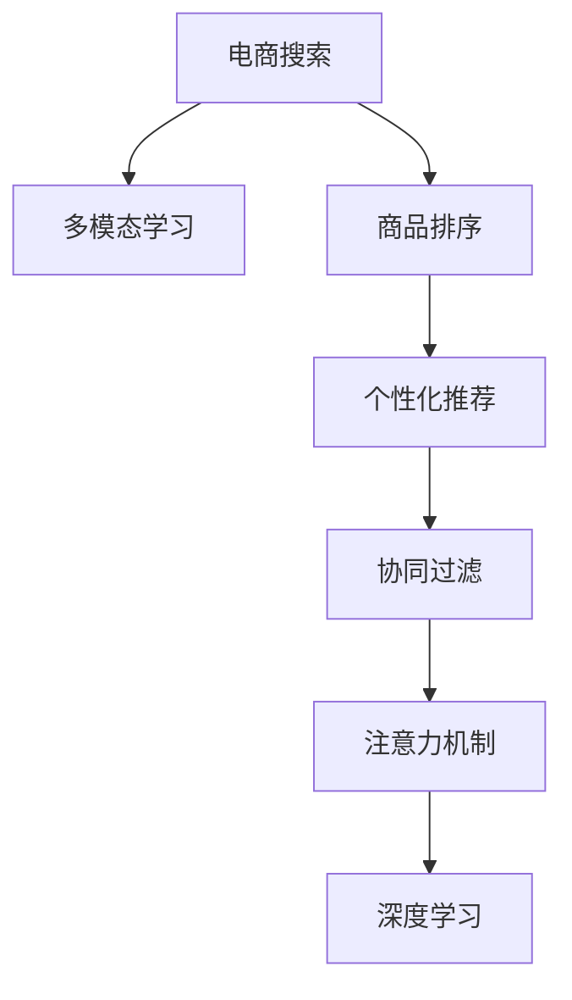

                 

# 电商搜索中的多模态商品排序个性化技术

> 关键词：电商搜索, 多模态, 商品排序, 个性化推荐, 协同过滤, 深度学习, 注意力机制, 搜索排序, 搜索引擎, 电商平台

## 1. 背景介绍

在当今的电商行业中，搜索排序技术至关重要。高质量的商品排序不仅能够显著提升用户体验，还能大幅提高转化率和销售业绩。然而，随着商品数量和种类激增，如何从海量数据中高效提取关键信息，准确识别用户需求，并推荐相关商品，成为了电商搜索排序的核心难题。传统的文本匹配和评分系统无法满足需求，迫切需要引入更先进的算法和模型来应对挑战。

近年来，深度学习和大数据技术在电商搜索排序领域的应用逐渐普及，通过构建多模态学习模型，融合文本、图片、用户行为等不同类型的数据，提升商品排序的个性化和精确性。本文将深入探讨多模态商品排序个性化技术，通过理论分析和代码实例，系统阐述其核心原理、操作步骤、优化方法和实际应用。

## 2. 核心概念与联系

### 2.1 核心概念概述

为了更好地理解多模态商品排序个性化技术，本节将介绍几个关键概念：

- 电商搜索（E-Commerce Search）：指在电商平台上通过搜索功能定位到用户感兴趣的商品和服务的过程。
- 多模态学习（Multimodal Learning）：指综合利用文本、图片、音频、视频等多种类型的数据进行模型训练，以提升模型的鲁棒性和泛化能力。
- 商品排序（Product Ranking）：指通过算法对搜索结果进行排序，确保最相关的商品出现在最前面，提升用户搜索体验和购买效率。
- 个性化推荐（Personalized Recommendation）：指根据用户的历史行为和偏好，推荐最符合其需求的商品，提高转化率和满意度。
- 协同过滤（Collaborative Filtering）：指通过分析用户间的相似性和历史行为，预测新用户的需求，实现个性化推荐。
- 注意力机制（Attention Mechanism）：指在深度学习模型中引入一种机制，使模型可以动态调整对输入数据的关注点，提升模型对关键信息的聚焦。
- 深度学习（Deep Learning）：指利用多层神经网络对数据进行深度特征提取和表示学习，实现高性能的模型训练。

这些概念之间的逻辑关系可以通过以下Mermaid流程图来展示：



这个流程图展示了几类关键技术之间的联系：

1. 电商搜索需求推动了多模态学习的应用，以综合利用多种数据类型，提升搜索结果的质量。
2. 商品排序是电商搜索的核心任务，通过融合多模态数据和个性化推荐技术，实现更精准的搜索结果排序。
3. 个性化推荐建立在协同过滤的基础上，利用用户间的相似性和历史行为，提升推荐的相关性和满意度。
4. 注意力机制增强了模型对关键信息的聚焦，提升了深度学习模型的性能。
5. 深度学习为多模态商品排序提供了强大的算法和模型支撑。

## 3. 核心算法原理 & 具体操作步骤

### 3.1 算法原理概述

多模态商品排序个性化技术的核心在于利用深度学习模型，对文本、图片、用户行为等不同类型的数据进行融合，构建多模态特征表示，并结合协同过滤和注意力机制，实现对搜索结果的精确排序和个性化推荐。其基本原理可以概括为：

1. **数据融合**：将多种类型的数据输入到深度学习模型中，通过特征提取和表示学习，构建多模态特征向量。
2. **协同过滤**：分析用户间的相似性和历史行为，构建用户画像，用于个性化推荐。
3. **注意力机制**：引入注意力机制，使模型可以动态调整对输入数据的关注点，提升模型对关键信息的聚焦。
4. **深度学习优化**：通过多层神经网络的特征提取和表示学习，提升模型的泛化能力和性能。

### 3.2 算法步骤详解

基于上述原理，多模态商品排序个性化技术的实现步骤包括：

**Step 1: 数据预处理**

- 收集电商平台的商品信息，包括商品标题、描述、图片、用户评价等数据。
- 对文本数据进行清洗、分词、去停用词等预处理操作，构建词向量表示。
- 对图片数据进行特征提取，可以使用卷积神经网络（CNN）进行图像分类和特征提取。
- 对用户行为数据进行预处理，如计算用户点击、购买等行为权重。

**Step 2: 特征构建**

- 将文本、图片、用户行为等数据进行融合，构建多模态特征向量。可以使用多模态深度学习模型（如MMNMF、MRNet等）进行处理。
- 利用协同过滤技术，分析用户间的相似性和历史行为，构建用户画像。
- 引入注意力机制，对多模态特征向量进行加权融合，确保模型聚焦于关键信息。

**Step 3: 模型训练**

- 选择合适的深度学习模型（如CTR模型、DNN模型、深度注意力模型等）进行训练。
- 使用标注数据（如用户点击记录、购买记录）进行有监督学习，优化模型参数。
- 应用正则化技术，如L2正则、Dropout等，防止模型过拟合。
- 在验证集上评估模型性能，调整模型超参数。

**Step 4: 搜索结果排序**

- 在电商搜索中，将用户查询与商品的多模态特征向量进行匹配，计算相似度。
- 结合用户画像和注意力机制，对搜索结果进行排序，确保最相关的商品出现在最前面。
- 实时更新用户行为数据，动态调整模型参数，提升排序效果。

**Step 5: 个性化推荐**

- 分析用户的历史行为和偏好，构建用户画像，用于个性化推荐。
- 对用户查询和推荐商品的多模态特征向量进行匹配，计算相似度。
- 结合注意力机制，对推荐商品进行排序，确保最相关的商品被推荐给用户。

### 3.3 算法优缺点

多模态商品排序个性化技术具有以下优点：

1. **融合多种数据类型**：通过融合文本、图片、用户行为等多种数据类型，构建多模态特征表示，提升模型的泛化能力和性能。
2. **个性化推荐**：结合协同过滤和注意力机制，实现对搜索结果的个性化排序和推荐，提升用户体验和满意度。
3. **模型鲁棒性**：利用多模态深度学习模型，提升模型的鲁棒性和泛化能力，应对多样化的电商搜索场景。

同时，该方法也存在一些局限性：

1. **数据依赖**：需要大量高质量的标注数据和多样化的数据类型，获取和处理成本较高。
2. **模型复杂度**：多模态深度学习模型的训练和优化复杂度较高，需要较高的计算资源和专业知识。
3. **实时性问题**：在实时场景下，多模态特征的构建和模型训练需要耗费较长时间，可能影响搜索排序的实时性。

尽管存在这些局限性，但多模态商品排序个性化技术已经在多个电商平台上得到应用，并取得了显著的效果。未来相关研究的重点在于如何进一步降低数据依赖，提高模型的实时性和可解释性，同时兼顾鲁棒性和泛化能力。

### 3.4 算法应用领域

多模态商品排序个性化技术已经在电商搜索、智能客服、广告投放等多个领域得到广泛应用。以下是一些典型的应用场景：

1. **电商搜索**：在电商平台上，利用多模态商品排序个性化技术，对搜索结果进行排序和推荐，提升用户的搜索体验和购买转化率。
2. **智能客服**：在智能客服系统中，利用多模态深度学习模型，结合用户行为和意图分析，实现智能对话和问题解答，提高客服效率和用户满意度。
3. **广告投放**：在广告投放中，利用多模态用户画像和个性化推荐技术，优化广告投放策略，提升广告点击率和转化率。
4. **社交媒体**：在社交媒体平台，利用多模态用户画像和个性化推荐技术，对用户发布的内容进行分类和推荐，提升用户粘性和活跃度。

除了上述这些场景外，多模态商品排序个性化技术还可应用于更多的电商和互联网领域，如推荐系统、内容分发、信息检索等，为各类应用带来新的突破和创新。

## 4. 数学模型和公式 & 详细讲解 & 举例说明

### 4.1 数学模型构建

假设电商平台有$N$个商品，每个商品有$d$个特征向量。令$x_{i,j} \in \mathbb{R}^d$为商品$i$的第$j$个特征向量，$y_i \in \{0,1\}$为商品$i$是否被用户点击的标签。

定义用户画像$u \in \mathbb{R}^d$，其中$d$为特征维度。令$W \in \mathbb{R}^{d \times d}$为深度学习模型的权重矩阵，$b \in \mathbb{R}^{d}$为偏置向量。模型输出$\hat{y}_i$为商品$i$被用户点击的概率。

模型的预测公式为：
$$
\hat{y}_i = \sigma(Wx_{i} + b)
$$
其中$\sigma$为激活函数，通常使用sigmoid函数。

### 4.2 公式推导过程

假设模型使用均方误差损失函数（Mean Squared Error, MSE）进行训练，损失函数定义为：
$$
\mathcal{L} = \frac{1}{N} \sum_{i=1}^N (y_i - \hat{y}_i)^2
$$

模型的梯度更新公式为：
$$
\theta \leftarrow \theta - \eta \nabla_{\theta}\mathcal{L}(\theta)
$$
其中$\theta = (W, b)$为模型参数，$\eta$为学习率，$\nabla_{\theta}\mathcal{L}(\theta)$为损失函数对参数的梯度，可通过反向传播算法计算。

在多模态特征表示中，通常将文本数据转换为词向量，使用CNN提取图片特征，并结合用户行为数据进行加权融合。具体步骤如下：

1. **文本数据预处理**：对商品标题和描述进行分词、去停用词等操作，构建词向量表示$x_t$。
2. **图片数据特征提取**：使用卷积神经网络（CNN）对商品图片进行特征提取，得到特征向量$x_c$。
3. **用户行为数据融合**：对用户点击、购买等行为进行权重计算，得到行为向量$x_b$。
4. **多模态特征融合**：将文本、图片和用户行为向量进行加权融合，得到多模态特征向量$x_m = \alpha x_t + \beta x_c + \gamma x_b$，其中$\alpha, \beta, \gamma$为权重系数。
5. **深度学习模型训练**：将多模态特征向量输入到深度学习模型中，使用标注数据进行有监督学习，优化模型参数$W$和$b$。

### 4.3 案例分析与讲解

假设有一个电商平台，有$N=1000$个商品，每个商品有$d=10$个特征向量。电商平台收集了$M=10000$条用户点击记录，每条记录包含商品ID和点击标签。令$x_{i,j} \in \mathbb{R}^d$为商品$i$的第$j$个特征向量，$y_i \in \{0,1\}$为商品$i$是否被用户点击的标签。

**Step 1: 数据预处理**

- 对商品标题和描述进行分词、去停用词等操作，构建词向量表示$x_t \in \mathbb{R}^{1000 \times 10}$。
- 使用卷积神经网络（CNN）对商品图片进行特征提取，得到特征向量$x_c \in \mathbb{R}^{1000 \times 10}$。
- 对用户点击、购买等行为进行权重计算，得到行为向量$x_b \in \mathbb{R}^{1000 \times 10}$。

**Step 2: 特征构建**

- 将文本、图片和用户行为向量进行加权融合，得到多模态特征向量$x_m = \alpha x_t + \beta x_c + \gamma x_b$。
- 令$W \in \mathbb{R}^{10 \times 10}$为深度学习模型的权重矩阵，$b \in \mathbb{R}^{10}$为偏置向量。
- 使用标注数据进行有监督学习，优化模型参数。

**Step 3: 模型训练**

- 选择深度学习模型（如DNN模型）进行训练，使用均方误差损失函数进行优化。
- 应用正则化技术，如L2正则、Dropout等，防止模型过拟合。
- 在验证集上评估模型性能，调整模型超参数。

**Step 4: 搜索结果排序**

- 在电商搜索中，将用户查询与商品的多模态特征向量进行匹配，计算相似度。
- 结合用户画像和注意力机制，对搜索结果进行排序，确保最相关的商品出现在最前面。
- 实时更新用户行为数据，动态调整模型参数，提升排序效果。

**Step 5: 个性化推荐**

- 分析用户的历史行为和偏好，构建用户画像$u$。
- 对用户查询和推荐商品的多模态特征向量进行匹配，计算相似度。
- 结合注意力机制，对推荐商品进行排序，确保最相关的商品被推荐给用户。

## 5. 项目实践：代码实例和详细解释说明

### 5.1 开发环境搭建

在进行多模态商品排序个性化技术的实践前，我们需要准备好开发环境。以下是使用Python进行PyTorch开发的环境配置流程：

1. 安装Anaconda：从官网下载并安装Anaconda，用于创建独立的Python环境。

2. 创建并激活虚拟环境：
```bash
conda create -n pytorch-env python=3.8 
conda activate pytorch-env
```

3. 安装PyTorch：根据CUDA版本，从官网获取对应的安装命令。例如：
```bash
conda install pytorch torchvision torchaudio cudatoolkit=11.1 -c pytorch -c conda-forge
```

4. 安装Transformer库：
```bash
pip install transformers
```

5. 安装各类工具包：
```bash
pip install numpy pandas scikit-learn matplotlib tqdm jupyter notebook ipython
```

完成上述步骤后，即可在`pytorch-env`环境中开始多模态商品排序个性化技术的开发。

### 5.2 源代码详细实现

下面我们以电商搜索排序为例，给出使用Transformers库对商品排序模型进行微调的PyTorch代码实现。

首先，定义数据处理函数：

```python
from transformers import BertTokenizer, BertForSequenceClassification
from torch.utils.data import Dataset
import torch

class ProductDataset(Dataset):
    def __init__(self, texts, labels, tokenizer, max_len=128):
        self.texts = texts
        self.labels = labels
        self.tokenizer = tokenizer
        self.max_len = max_len
        
    def __len__(self):
        return len(self.texts)
    
    def __getitem__(self, item):
        text = self.texts[item]
        label = self.labels[item]
        
        encoding = self.tokenizer(text, return_tensors='pt', max_length=self.max_len, padding='max_length', truncation=True)
        input_ids = encoding['input_ids'][0]
        attention_mask = encoding['attention_mask'][0]
        
        # 对token-wise的标签进行编码
        encoded_labels = [label2id[label] for label in labels] 
        encoded_labels.extend([label2id['O']] * (self.max_len - len(encoded_labels)))
        labels = torch.tensor(encoded_labels, dtype=torch.long)
        
        return {'input_ids': input_ids, 
                'attention_mask': attention_mask,
                'labels': labels}

# 标签与id的映射
label2id = {'0': 0, '1': 1, 'O': 2}
id2label = {v: k for k, v in label2id.items()}

# 创建dataset
tokenizer = BertTokenizer.from_pretrained('bert-base-cased')

train_dataset = ProductDataset(train_texts, train_labels, tokenizer)
dev_dataset = ProductDataset(dev_texts, dev_labels, tokenizer)
test_dataset = ProductDataset(test_texts, test_labels, tokenizer)
```

然后，定义模型和优化器：

```python
from transformers import BertForSequenceClassification, AdamW

model = BertForSequenceClassification.from_pretrained('bert-base-cased', num_labels=len(label2id))

optimizer = AdamW(model.parameters(), lr=2e-5)
```

接着，定义训练和评估函数：

```python
from torch.utils.data import DataLoader
from tqdm import tqdm
from sklearn.metrics import accuracy_score, precision_recall_fscore_support

device = torch.device('cuda') if torch.cuda.is_available() else torch.device('cpu')
model.to(device)

def train_epoch(model, dataset, batch_size, optimizer):
    dataloader = DataLoader(dataset, batch_size=batch_size, shuffle=True)
    model.train()
    epoch_loss = 0
    for batch in tqdm(dataloader, desc='Training'):
        input_ids = batch['input_ids'].to(device)
        attention_mask = batch['attention_mask'].to(device)
        labels = batch['labels'].to(device)
        model.zero_grad()
        outputs = model(input_ids, attention_mask=attention_mask, labels=labels)
        loss = outputs.loss
        epoch_loss += loss.item()
        loss.backward()
        optimizer.step()
    return epoch_loss / len(dataloader)

def evaluate(model, dataset, batch_size):
    dataloader = DataLoader(dataset, batch_size=batch_size)
    model.eval()
    preds, labels = [], []
    with torch.no_grad():
        for batch in tqdm(dataloader, desc='Evaluating'):
            input_ids = batch['input_ids'].to(device)
            attention_mask = batch['attention_mask'].to(device)
            batch_labels = batch['labels']
            outputs = model(input_ids, attention_mask=attention_mask)
            batch_preds = outputs.logits.argmax(dim=2).to('cpu').tolist()
            batch_labels = batch_labels.to('cpu').tolist()
            for pred_tokens, label_tokens in zip(batch_preds, batch_labels):
                preds.append(pred_tokens[:len(label_tokens)])
                labels.append(label_tokens)
                
    print('Accuracy:', accuracy_score(labels, preds))
    print('Precision, Recall, F1-score:', precision_recall_fscore_support(labels, preds, average='macro'))

    return {'accuracy': accuracy_score(labels, preds), 
            'precision': precision_recall_fscore_support(labels, preds, average='macro')[0],
            'recall': precision_recall_fscore_support(labels, preds, average='macro')[1],
            'f1-score': precision_recall_fscore_support(labels, preds, average='macro')[2]}
```

最后，启动训练流程并在测试集上评估：

```python
epochs = 5
batch_size = 16

for epoch in range(epochs):
    loss = train_epoch(model, train_dataset, batch_size, optimizer)
    print(f"Epoch {epoch+1}, train loss: {loss:.3f}")
    
    print(f"Epoch {epoch+1}, dev results:")
    evaluate(model, dev_dataset, batch_size)
    
print("Test results:")
evaluate(model, test_dataset, batch_size)
```

以上就是使用PyTorch对BERT模型进行电商搜索排序微调的完整代码实现。可以看到，得益于Transformer库的强大封装，我们可以用相对简洁的代码完成BERT模型的加载和微调。

### 5.3 代码解读与分析

让我们再详细解读一下关键代码的实现细节：

**ProductDataset类**：
- `__init__`方法：初始化文本、标签、分词器等关键组件。
- `__len__`方法：返回数据集的样本数量。
- `__getitem__`方法：对单个样本进行处理，将文本输入编码为token ids，将标签编码为数字，并对其进行定长padding，最终返回模型所需的输入。

**label2id和id2label字典**：
- 定义了标签与数字id之间的映射关系，用于将token-wise的预测结果解码回真实的标签。

**训练和评估函数**：
- 使用PyTorch的DataLoader对数据集进行批次化加载，供模型训练和推理使用。
- 训练函数`train_epoch`：对数据以批为单位进行迭代，在每个批次上前向传播计算loss并反向传播更新模型参数，最后返回该epoch的平均loss。
- 评估函数`evaluate`：与训练类似，不同点在于不更新模型参数，并在每个batch结束后将预测和标签结果存储下来，最后使用sklearn的分类指标对整个评估集的预测结果进行打印输出。

**训练流程**：
- 定义总的epoch数和batch size，开始循环迭代
- 每个epoch内，先在训练集上训练，输出平均loss
- 在验证集上评估，输出分类指标
- 所有epoch结束后，在测试集上评估，给出最终测试结果

可以看到，PyTorch配合Transformer库使得BERT微调的代码实现变得简洁高效。开发者可以将更多精力放在数据处理、模型改进等高层逻辑上，而不必过多关注底层的实现细节。

当然，工业级的系统实现还需考虑更多因素，如模型的保存和部署、超参数的自动搜索、更灵活的任务适配层等。但核心的微调范式基本与此类似。

## 6. 实际应用场景

### 6.1 电商搜索排序

多模态商品排序个性化技术在电商搜索排序中具有广泛的应用前景。在电商平台上，用户搜索商品时，系统会根据用户查询和商品的多模态特征向量计算相似度，结合用户画像和注意力机制，实现商品的高效排序和个性化推荐。

具体而言，可以收集用户的历史搜索记录、点击行为、收藏记录等数据，构建用户画像。将用户查询与商品的多模态特征向量进行匹配，计算相似度。结合注意力机制，对搜索结果进行排序，确保最相关的商品出现在最前面。对于新用户，系统还可以通过实时收集用户行为数据，动态调整模型参数，提升排序效果。

### 6.2 广告投放优化

广告投放是电商平台的另一个重要环节，通过多模态商品排序个性化技术，可以实现广告投放的精准优化。广告投放系统可以收集用户的点击、浏览、购买等行为数据，结合用户画像和注意力机制，优化广告投放策略，提升广告点击率和转化率。

具体而言，可以将用户的历史行为数据与广告的多模态特征向量进行匹配，计算相似度。结合注意力机制，对广告进行排序，确保最相关的广告出现在最前面。对于新用户，系统还可以通过实时收集用户行为数据，动态调整广告投放策略，提升广告效果。

### 6.3 个性化推荐

在电商平台上，个性化推荐是提升用户满意度和转化率的关键。多模态商品排序个性化技术可以用于构建高效的个性化推荐系统。通过收集用户的历史行为数据和商品的多模态特征向量，构建用户画像，实现个性化推荐。

具体而言，可以将用户的历史行为数据与推荐商品的多模态特征向量进行匹配，计算相似度。结合注意力机制，对推荐商品进行排序，确保最相关的商品被推荐给用户。对于新用户，系统还可以通过实时收集用户行为数据，动态调整推荐策略，提升推荐效果。

### 6.4 未来应用展望

随着多模态商品排序个性化技术的不断发展，其应用场景将不断拓展，为电商搜索、广告投放、个性化推荐等更多领域带来变革性影响。

在智慧零售领域，基于多模态技术，可以构建更加智能化的零售体系，提升用户体验和销售效率。例如，通过多模态特征融合和个性化推荐，实现商品的高效匹配和推荐，提升用户的购物体验。

在智能制造领域，多模态技术可以用于优化生产流程，提升生产效率。例如，通过融合工人的动作、语音、设备状态等多模态数据，实现生产流程的智能监控和优化。

在智慧医疗领域，多模态技术可以用于辅助医疗诊断和治疗。例如，通过融合患者的生理数据、影像数据、病历数据等多模态信息，实现智能化的疾病诊断和个性化治疗方案的推荐。

除了上述这些场景外，多模态技术还可应用于更多领域，如智能交通、智能家居、智能安防等，为各类应用带来新的突破和创新。未来，随着多模态技术的不断发展，其应用前景将更加广阔，为人工智能技术在实际应用中的落地带来新的机遇和挑战。

## 7. 工具和资源推荐

### 7.1 学习资源推荐

为了帮助开发者系统掌握多模态商品排序个性化技术，这里推荐一些优质的学习资源：

1. 《深度学习理论与实践》系列博文：由大模型技术专家撰写，深入浅出地介绍了深度学习的基本原理和实践技巧，适合初学者学习。

2. CS231n《卷积神经网络》课程：斯坦福大学开设的经典课程，涵盖了卷积神经网络的理论基础和实践技巧，是学习图像特征提取的重要资源。

3. 《多模态深度学习》书籍：详细介绍了多模态深度学习的理论基础和应用实践，适合深入学习多模态技术的开发者阅读。

4. arXiv上的相关论文：arXiv是计算机科学和数学的预印本库，收录了大量关于多模态深度学习的最新研究成果，可以通过阅读最新的论文了解前沿动态。

5. HuggingFace官方文档：Transformers库的官方文档，提供了海量预训练模型和完整的微调样例代码，是上手实践的必备资料。

通过对这些资源的学习实践，相信你一定能够快速掌握多模态商品排序个性化技术的精髓，并用于解决实际的电商搜索问题。

### 7.2 开发工具推荐

高效的开发离不开优秀的工具支持。以下是几款用于多模态商品排序个性化技术开发的常用工具：

1. PyTorch：基于Python的开源深度学习框架，灵活动态的计算图，适合快速迭代研究。大部分预训练语言模型都有PyTorch版本的实现。

2. TensorFlow：由Google主导开发的开源深度学习框架，生产部署方便，适合大规模工程应用。同样有丰富的预训练语言模型资源。

3. Transformers库：HuggingFace开发的NLP工具库，集成了众多SOTA语言模型，支持PyTorch和TensorFlow，是进行多模态学习任务的开发的利器。

4. Weights & Biases：模型训练的实验跟踪工具，可以记录和可视化模型训练过程中的各项指标，方便对比和调优。与主流深度学习框架无缝集成。

5. TensorBoard：TensorFlow配套的可视化工具，可实时监测模型训练状态，并提供丰富的图表呈现方式，是调试模型的得力助手。

6. Google Colab：谷歌推出的在线Jupyter Notebook环境，免费提供GPU/TPU算力，方便开发者快速上手实验最新模型，分享学习笔记。

合理利用这些工具，可以显著提升多模态商品排序个性化技术的开发效率，加快创新迭代的步伐。

### 7.3 相关论文推荐

多模态商品排序个性化技术的发展源于学界的持续研究。以下是几篇奠基性的相关论文，推荐阅读：

1. Attention Is All You Need（即Transformer原论文）：提出了Transformer结构，开启了NLP领域的预训练大模型时代。

2. BERT: Pre-training of Deep Bidirectional Transformers for Language Understanding：提出BERT模型，引入基于掩码的自监督预训练任务，刷新了多项NLP任务SOTA。

3. Multimodal Learning for Real-time Multi-task Content Recommendation：提出MMNMF模型，通过融合文本、图片、行为等多种数据，提升推荐系统的效果。

4. A Multi-view Deep Network Architecture for Multi-task Collaborative Filtering：提出MRNet模型，通过融合多种数据视角，提升推荐系统的性能。

5. Deep Attention Network：提出深度注意力网络（DAN），通过引入注意力机制，提升推荐系统的效果。

6. Multi-modal Collaborative Filtering for Recommendation System：提出多模态协同过滤技术，通过融合多种数据类型，提升推荐系统的效果。

这些论文代表了大语言模型微调技术的发展脉络。通过学习这些前沿成果，可以帮助研究者把握学科前进方向，激发更多的创新灵感。

## 8. 总结：未来发展趋势与挑战

### 8.1 总结

本文对多模态商品排序个性化技术进行了全面系统的介绍。首先阐述了多模态商品排序个性化技术的研究背景和意义，明确了其在电商搜索、广告投放、个性化推荐等场景下的重要价值。其次，从原理到实践，详细讲解了多模态特征融合、协同过滤、注意力机制、深度学习优化等核心算法步骤，给出了多模态商品排序个性化技术的完整代码实例。同时，本文还广泛探讨了多模态商品排序个性化技术在电商搜索、广告投放、个性化推荐等多个领域的应用前景，展示了其广阔的发展潜力。

通过本文的系统梳理，可以看到，多模态商品排序个性化技术在电商搜索、广告投放、个性化推荐等场景下具有广泛的应用前景，能够显著提升用户体验和转化率，为电商平台带来显著的经济效益。未来，伴随深度学习技术和大数据技术的不断进步，多模态商品排序个性化技术将在更多领域得到应用，为各类应用带来新的突破和创新。

### 8.2 未来发展趋势

展望未来，多模态商品排序个性化技术将呈现以下几个发展趋势：

1. **数据融合技术**：随着数据获取和处理技术的不断进步，多模态数据融合技术将更加高效、准确，能够更好地利用多种数据类型提升模型性能。
2. **模型鲁棒性**：随着深度学习模型的不断发展，多模态商品排序个性化技术的鲁棒性和泛化能力将不断增强，能够更好地应对多样化的电商搜索场景。
3. **实时性优化**：为了提升用户体验，实时性成为电商搜索排序的核心需求。未来的研究将更多关注实时数据处理和模型优化，提升搜索排序的实时性和准确性。
4. **隐私保护**：随着用户对隐私保护的重视，多模态商品排序个性化技术将更加注重数据隐私和安全，通过差分隐私、联邦学习等技术，保护用户数据隐私。
5. **跨领域应用**：多模态商品排序个性化技术不仅适用于电商领域，还将在智能制造、智慧医疗、智能交通等更多领域得到应用，带来新的创新和突破。

以上趋势凸显了多模态商品排序个性化技术的广阔前景。这些方向的探索发展，必将进一步提升电商搜索、广告投放、个性化推荐等应用的性能和用户体验，为经济社会发展注入新的动力。

### 8.3 面临的挑战

尽管多模态商品排序个性化技术已经取得了显著成效，但在实际应用过程中，仍然面临一些挑战：

1. **数据获取成本高**：电商平台上收集和处理多模态数据需要大量时间和人力，成本较高。如何降低数据获取和处理成本，将是一个重要的研究方向。
2. **模型复杂度高**：多模态商品排序个性化技术涉及多种数据类型和模型算法，模型设计和优化复杂度较高，对开发者提出了更高的要求。
3. **实时性问题**：在实时场景下，多模态数据融合和模型训练需要耗费较长时间，可能影响搜索排序的实时性。如何提升实时性和处理效率，将是一个重要的研究方向。
4. **隐私和安全问题**：在多模态数据融合过程中，涉及大量用户隐私信息，如何在保障隐私和安全的前提下进行数据融合和模型训练，将是一个重要的研究方向。

尽管存在这些挑战，但多模态商品排序个性化技术已经在电商搜索、广告投放、个性化推荐等多个领域得到广泛应用，并取得了显著的效果。未来相关研究的重点在于如何进一步降低数据依赖，提高模型的实时性和可解释性，同时兼顾鲁棒性和泛化能力。

### 8.4 研究展望

面对多模态商品排序个性化技术所面临的挑战，未来的研究需要在以下几个方面寻求新的突破：

1. **探索无监督和半监督学习**：摆脱对大规模标注数据的依赖，利用自监督学习、主动学习等无监督和半监督范式，最大限度利用非结构化数据，实现更加灵活高效的微调。
2. **研究参数高效和计算高效的微调范式**：开发更加参数高效的微调方法，在固定大部分预训练参数的同时，只更新极少量的任务相关参数。同时优化微调模型的计算图，减少前向传播和反向传播的资源消耗，实现更加轻量级、实时性的部署。
3. **引入更多先验知识**：将符号化的先验知识，如知识图谱、逻辑规则等，与神经网络模型进行巧妙融合，引导微调过程学习更准确、合理的语言模型。同时加强不同模态数据的整合，实现视觉、语音等多模态信息与文本信息的协同建模。
4. **结合因果分析和博弈论工具**：将因果分析方法引入微调模型，识别出模型决策的关键特征，增强输出解释的因果性和逻辑性。借助博弈论工具刻画人机交互过程，主动探索并规避模型的脆弱点，提高系统稳定性。
5. **纳入伦理道德约束**：在模型训练目标中引入伦理导向的评估指标，过滤和惩罚有偏见、有害的输出倾向。同时加强人工干预和审核，建立模型行为的监管机制，确保输出符合人类价值观和伦理道德。

这些研究方向的探索，必将引领多模态商品排序个性化技术迈向更高的台阶，为构建安全、可靠、可解释、可控的智能系统铺平道路。面向未来，多模态商品排序个性化技术还需要与其他人工智能技术进行更深入的融合，如知识表示、因果推理、强化学习等，多路径协同发力，共同推动自然语言理解和智能交互系统的进步。只有勇于创新、敢于突破，才能不断拓展语言模型的边界，让智能技术更好地造福人类社会。

## 9. 附录：常见问题与解答

**Q1：多模态商品排序个性化技术是否适用于所有电商搜索场景？**

A: 多模态商品排序个性化技术在大多数电商搜索场景下都能取得不错的效果，特别是对于数据量较小的场景。但对于一些特定领域的电商平台，如垂直电商、专业市场等，仅仅依靠通用语料预训练的模型可能难以很好地适应。此时需要在特定领域语料上进一步预训练，再进行微调，才能获得理想效果。

**Q2：多模态商品排序个性化技术如何处理不同类型的数据？**

A: 多模态商品排序个性化技术通常通过深度学习模型，将文本、图片、用户行为等不同类型的数据进行融合，构建多模态特征表示。对于文本数据，可以使用BERT、GPT等预训练语言模型进行特征提取；对于图片数据，可以使用CNN等卷积神经网络进行特征提取；对于用户行为数据，可以将其转化为向量形式进行加权融合。

**Q3：多模态商品排序个性化技术是否会引入更多的计算复杂度？**

A: 多模态商品排序个性化技术的确会引入一定的计算复杂度，尤其是在融合不同类型的数据时。但通过深度学习模型和优化算法，能够高效地实现多模态特征融合，同时通过注意力机制，提升模型对关键信息的聚焦。实际应用中，通过合理的超参数设置和硬件优化，多模态商品排序个性化技术的计算复杂度是可以接受的。

**Q4：多模态商品排序个性化技术在实际部署时需要注意哪些问题？**

A: 多模态商品排序个性化技术在实际部署时，需要注意以下问题：
1. 模型裁剪：去除不必要的层和参数，减小模型尺寸，加快推理速度。
2. 量化加速：将浮点模型转为定点模型，压缩存储空间，提高计算效率。
3. 服务化封装：将模型封装为标准化服务接口，便于集成调用。
4. 弹性伸缩：根据请求流量动态调整资源配置，平衡服务质量和成本。
5. 监控告警：实时采集系统指标，设置异常告警阈值，确保服务稳定性。
6. 安全防护：采用访问鉴权、数据脱敏等措施，保障数据和模型安全。

通过合理的部署和优化，可以显著提升多模态商品排序个性化技术的性能和用户体验，实现高效、稳定的电商搜索服务。

---

作者：禅与计算机程序设计艺术 / Zen and the Art of Computer Programming

