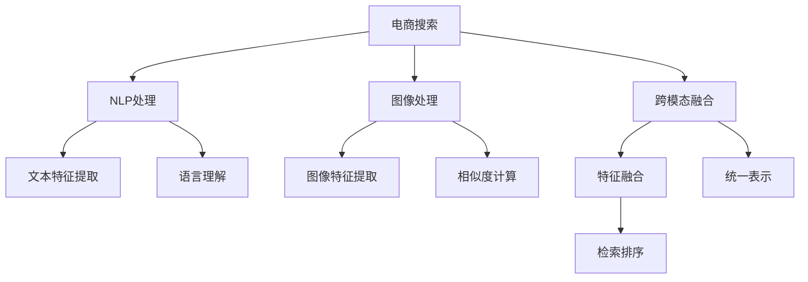

                 

# 电商搜索中的多模态商品检索深度学习模型

> 关键词：电商搜索, 多模态检索, 深度学习模型, 商品推荐, 图像处理, 自然语言处理, 视觉语义理解, 跨模态融合, 深度学习框架

## 1. 背景介绍

### 1.1 问题由来

随着电商行业的高速发展，越来越多的用户在平台上浏览和购买商品，传统的基于关键词匹配的搜索方式已经无法满足用户的深度需求。同时，用户输入的查询语句往往多模态、多样性，既有文字描述，也有图片、视频等，且用户行为数据也是多模态的，包括浏览记录、购买历史、评价反馈等。如何将这些多模态数据进行整合和匹配，提升电商搜索的准确度和效率，成为电商行业亟待解决的难题。

### 1.2 问题核心关键点

解决上述问题的核心在于如何高效地将多模态数据进行融合，提升商品检索的准确性和相关性。深度学习模型由于其强大的特征提取和模式识别能力，成为解决上述问题的主流技术。本文将详细介绍如何基于深度学习构建电商搜索中的多模态商品检索模型，涵盖图像处理、自然语言处理、跨模态融合等多个方面，并结合实际案例进行讲解。

## 2. 核心概念与联系

### 2.1 核心概念概述

为更好地理解基于深度学习的电商搜索中的多模态商品检索模型，本节将介绍几个关键概念：

- 电商搜索：指用户通过电商平台进行搜索，获取相关商品的过程。电商搜索需要同时处理文字查询、图片、视频等多模态信息。
- 多模态检索：指在处理多模态数据时，如何高效融合和匹配不同类型的数据，实现更精准的检索。
- 深度学习模型：基于神经网络的模型，通过多层非线性变换，学习特征提取和模式识别能力。
- 图像处理：指对图像进行预处理、特征提取、相似度计算等操作。
- 自然语言处理（NLP）：指对自然语言进行分词、词向量表示、情感分析、语义理解等操作。
- 视觉语义理解：指从视觉数据中提取语义信息，如物体类别、关系、动作等。
- 跨模态融合：指将不同模态的数据进行融合，形成统一的特征表示。

这些核心概念之间的逻辑关系可以通过以下Mermaid流程图来展示：



这个流程图展示了电商搜索中多模态数据处理的总体流程：

1. 电商搜索：多模态数据的输入端，涵盖图像、文字等。
2. 图像处理：对图像进行预处理和特征提取，形成图像特征表示。
3. NLP处理：对文本进行分词、词向量表示和语义理解，形成文本特征表示。
4. 跨模态融合：将图像和文本特征进行融合，形成统一的特征表示。
5. 检索排序：根据融合后的特征表示进行相似度计算，排序后输出相关商品。

## 3. 核心算法原理 & 具体操作步骤

### 3.1 算法原理概述

基于深度学习的电商搜索中的多模态商品检索模型，通常包括图像处理、文本处理、跨模态融合和检索排序等步骤。其核心原理是通过深度学习模型学习特征表示，并在此基础上进行多模态数据的融合和匹配，实现更精准的商品检索。

具体而言，模型一般包括以下组件：

- 图像处理模块：对商品图片进行预处理、特征提取等操作。
- NLP处理模块：对商品描述、用户评论等文本数据进行分词、词向量表示、语义理解等处理。
- 跨模态融合模块：将图像特征和文本特征进行融合，形成统一的特征表示。
- 检索排序模块：基于融合后的特征表示进行相似度计算，排序后输出相关商品。

### 3.2 算法步骤详解

电商搜索中的多模态商品检索模型通常采用以下步骤：

**Step 1: 数据预处理**

1. 数据采集：收集电商平台上用户的历史浏览、购买记录、商品图片和描述等数据。
2. 数据清洗：去除无用的数据和噪声，对缺失值进行填补。
3. 数据标注：对商品图片进行标注，如类别、品牌、属性等。
4. 数据分割：将数据划分为训练集、验证集和测试集。

**Step 2: 图像处理**

1. 图像预处理：对商品图片进行缩放、裁剪、去噪等预处理。
2. 图像特征提取：使用深度学习模型提取图像特征，如CNN、ResNet等。
3. 特征编码：将图像特征编码为向量表示，如使用PCA、LDA等降维方法。

**Step 3: NLP处理**

1. 分词和词向量表示：使用深度学习模型对商品描述、用户评论等文本数据进行分词，并使用Word2Vec、BERT等方法生成词向量表示。
2. 语义理解：使用深度学习模型进行情感分析、语义角色标注等操作，形成语义表示。
3. 特征编码：将文本特征编码为向量表示，如使用Word2Vec、BERT等。

**Step 4: 跨模态融合**

1. 特征对齐：对图像特征和文本特征进行对齐，如使用加权平均、多模态嵌入等方法。
2. 特征融合：将图像特征和文本特征进行融合，形成统一的特征表示。

**Step 5: 检索排序**

1. 相似度计算：计算检索查询与商品特征表示之间的相似度，如余弦相似度、欧式距离等。
2. 排序：根据相似度排序，输出相关商品列表。

### 3.3 算法优缺点

电商搜索中的多模态商品检索深度学习模型具有以下优点：

1. 精度高：通过深度学习模型提取和融合多模态数据，形成更精准的特征表示，提升检索准确性。
2. 适应性强：模型能够处理多种类型的输入数据，适应电商平台的复杂业务需求。
3. 可扩展性强：模型可以通过增加或改进组件，进一步提升检索性能和效率。

同时，该模型也存在一定的局限性：

1. 计算复杂度高：深度学习模型涉及大量参数和计算，对计算资源要求较高。
2. 数据标注成本高：模型需要大量的标注数据进行训练，数据标注成本较高。
3. 训练时间长：深度学习模型训练时间长，对时间和空间资源消耗大。
4. 可解释性不足：深度学习模型的决策过程难以解释，不利于业务理解和调试。

尽管存在这些局限性，但基于深度学习的电商搜索中的多模态商品检索模型仍然是目前最有效的技术手段。未来研究重点在于如何进一步降低计算和标注成本，提升模型效率和可解释性。

### 3.4 算法应用领域

电商搜索中的多模态商品检索深度学习模型已经在多个领域得到了广泛应用，例如：

- 商品推荐：根据用户浏览和购买历史，推荐相关商品。
- 价格比对：比较不同商家的商品价格，辅助用户做出购买决策。
- 图像检索：通过图片检索商品，提升购物体验。
- 用户评论分析：分析用户评论，获取商品质量反馈。
- 内容推荐：根据用户兴趣，推荐相关商品内容，如商品图片、视频等。

除了上述这些经典应用外，电商搜索中的多模态商品检索深度学习模型还被创新性地应用于用户行为预测、智能客服、个性化营销等多个场景中，为电商平台的智能化转型提供了有力支持。

## 4. 数学模型和公式 & 详细讲解 & 举例说明

### 4.1 数学模型构建

电商搜索中的多模态商品检索深度学习模型通常基于以下数学模型构建：

- 输入数据：$X = \{x, y\}$，其中 $x$ 为图像特征向量，$y$ 为文本特征向量。
- 特征编码：$f_X: \mathbb{R}^n \rightarrow \mathbb{R}^m$，$f_Y: \mathbb{R}^p \rightarrow \mathbb{R}^q$，其中 $m$ 和 $q$ 为特征向量的维度。
- 相似度函数：$S: \mathbb{R}^m \times \mathbb{R}^q \rightarrow [-1, 1]$，用于计算图像和文本特征向量之间的相似度。
- 排序算法：$Rank$，根据相似度排序，输出相关商品列表。

### 4.2 公式推导过程

电商搜索中的多模态商品检索深度学习模型主要包括以下步骤：

1. 图像特征提取：
$$
x = f_I(x_i) = \text{Conv2D}(x_i) + \text{Pooling}(x_i)
$$
其中 $x_i$ 为输入的图像，$f_I$ 为图像处理网络，$\text{Conv2D}$ 和 $\text{Pooling}$ 分别为卷积和池化操作。

2. 文本特征提取：
$$
y = f_T(y_j) = \text{Embedding}(y_j) + \text{LSTM}(y_j)
$$
其中 $y_j$ 为输入的文本，$f_T$ 为文本处理网络，$\text{Embedding}$ 和 $\text{LSTM}$ 分别为词嵌入和长短期记忆网络。

3. 特征对齐：
$$
\alpha = \text{Softmax}(x)
$$
$$
\beta = \text{Softmax}(y)
$$
其中 $\alpha$ 和 $\beta$ 为图像和文本特征的对齐权重。

4. 特征融合：
$$
z = f_C(x, \alpha) + f_C(y, \beta)
$$
其中 $f_C$ 为特征融合网络，$z$ 为融合后的特征向量。

5. 相似度计算：
$$
s = S(z)
$$
其中 $S$ 为相似度函数，$s$ 为相似度分数。

6. 排序：
$$
\text{rank} = Rank(s)
$$
其中 $\text{rank}$ 为排序结果。

### 4.3 案例分析与讲解

假设我们有一个电商搜索平台，希望通过用户输入的商品图片和描述，检索出最相关的商品列表。具体步骤如下：

**Step 1: 数据预处理**

1. 数据采集：从电商平台上收集用户的历史浏览和购买记录，以及商品图片和描述等数据。
2. 数据清洗：去除无用的数据和噪声，对缺失值进行填补。
3. 数据标注：对商品图片进行标注，如类别、品牌、属性等。
4. 数据分割：将数据划分为训练集、验证集和测试集。

**Step 2: 图像处理**

1. 图像预处理：对商品图片进行缩放、裁剪、去噪等预处理。
2. 图像特征提取：使用ResNet网络提取图像特征，得到特征向量 $x$。
3. 特征编码：使用PCA方法对图像特征进行降维，得到特征向量 $x'$。

**Step 3: NLP处理**

1. 分词和词向量表示：使用BERT网络对商品描述进行分词，并生成词向量表示。
2. 语义理解：使用BERT网络进行情感分析和语义角色标注，形成语义表示 $y$。
3. 特征编码：使用BERT网络对语义表示进行编码，得到特征向量 $y'$。

**Step 4: 跨模态融合**

1. 特征对齐：对图像特征和文本特征进行对齐，得到对齐权重 $\alpha$ 和 $\beta$。
2. 特征融合：将图像特征和文本特征进行融合，得到融合后的特征向量 $z$。

**Step 5: 检索排序**

1. 相似度计算：计算检索查询与商品特征表示之间的相似度 $s$。
2. 排序：根据相似度排序，输出相关商品列表。

## 5. 项目实践：代码实例和详细解释说明

### 5.1 开发环境搭建

在进行电商搜索中的多模态商品检索深度学习模型开发前，需要先准备好开发环境。以下是使用Python进行TensorFlow开发的环境配置流程：

1. 安装Anaconda：从官网下载并安装Anaconda，用于创建独立的Python环境。

2. 创建并激活虚拟环境：
```bash
conda create -n tf-env python=3.8 
conda activate tf-env
```

3. 安装TensorFlow：根据CUDA版本，从官网获取对应的安装命令。例如：
```bash
conda install tensorflow -c pytorch -c conda-forge
```

4. 安装相关库：
```bash
pip install pandas numpy sklearn scipy matplotlib pytorch torchvision torchtext transformers
```

完成上述步骤后，即可在`tf-env`环境中开始模型开发。

### 5.2 源代码详细实现

下面我们以电商平台中的商品推荐系统为例，给出使用TensorFlow构建多模态商品检索深度学习模型的PyTorch代码实现。

首先，定义图像处理和文本处理的函数：

```python
import tensorflow as tf
from tensorflow.keras import layers
from tensorflow.keras.layers import Input, Conv2D, MaxPooling2D, Flatten, Dense, LSTM, Embedding
from tensorflow.keras.models import Model

def image_processing(input_shape):
    x = Input(shape=input_shape)
    x = Conv2D(64, (3, 3), activation='relu')(x)
    x = MaxPooling2D((2, 2))(x)
    x = Conv2D(128, (3, 3), activation='relu')(x)
    x = MaxPooling2D((2, 2))(x)
    x = Conv2D(256, (3, 3), activation='relu')(x)
    x = Flatten()(x)
    x = Dense(512, activation='relu')(x)
    return x

def text_processing(input_shape):
    y = Input(shape=input_shape)
    y = Embedding(input_dim=10000, output_dim=128)(y)
    y = LSTM(128)(y)
    return y
```

然后，定义跨模态融合和检索排序的函数：

```python
def cross_modal_fusion(x, y, alpha, beta):
    x = tf.keras.layers.Dot(products='last_dot')([x, alpha])
    y = tf.keras.layers.Dot(products='last_dot')([y, beta])
    z = layers.concatenate([x, y])
    z = Dense(512, activation='relu')(z)
    return z

def similarity_calculation(z):
    s = tf.keras.layers.Dense(1, activation='sigmoid')(z)
    return s

def ranking(s):
    r = tf.keras.layers.Lambda(lambda x: tf.argsort(x, axis=-1)[::-1])(s)
    return r
```

接着，构建模型并编译：

```python
x = image_processing(input_shape=(32, 32, 3))
y = text_processing(input_shape=(10000,))
alpha = tf.keras.layers.Dense(100, activation='softmax')(x)
beta = tf.keras.layers.Dense(100, activation='softmax')(y)
z = cross_modal_fusion(x, y, alpha, beta)
s = similarity_calculation(z)
r = ranking(s)
model = Model(inputs=[x, y], outputs=r)
model.compile(optimizer='adam', loss='mean_squared_error')
```

最后，训练和评估模型：

```python
train_dataset = ...
validation_dataset = ...
test_dataset = ...

model.fit([train_dataset.images, train_dataset.texts], train_dataset.labels, 
          validation_data=([validation_dataset.images, validation_dataset.texts], validation_dataset.labels), 
          epochs=10, batch_size=32)
test_loss, test_labels = model.evaluate([test_dataset.images, test_dataset.texts], test_dataset.labels)
print('Test loss:', test_loss)
```

以上就是使用TensorFlow对电商平台中的商品推荐系统进行多模态商品检索深度学习模型开发的完整代码实现。可以看到，TensorFlow提供的功能强大且灵活的API，使得构建和训练模型变得非常方便。

### 5.3 代码解读与分析

让我们再详细解读一下关键代码的实现细节：

**image_processing函数**：
- 定义输入图像的形状。
- 使用卷积、池化等操作对图像进行预处理。
- 通过多个卷积和池化层提取图像特征。
- 将特征向量进行全连接和激活操作，得到最终的图像特征表示。

**text_processing函数**：
- 定义输入文本的形状。
- 使用词嵌入和LSTM等操作对文本进行处理。
- 将文本特征编码为向量表示，得到最终的文本特征表示。

**cross_modal_fusion函数**：
- 使用点积操作将图像特征和文本特征对齐，形成统一的特征表示。
- 将对齐后的特征进行融合，得到最终的融合特征表示。

**similarity_calculation函数**：
- 使用全连接层计算图像特征和文本特征之间的相似度。
- 将相似度表示为一个介于0和1之间的值，表示两个特征之间的相似度。

**ranking函数**：
- 使用Lambda函数将相似度进行排序，输出最相关的商品列表。

**构建模型**：
- 使用输入层定义图像和文本的输入。
- 使用点积操作将图像和文本特征对齐。
- 将对齐后的特征进行融合，得到最终的融合特征表示。
- 使用全连接层计算相似度。
- 将相似度进行排序，输出最相关的商品列表。

**编译和训练模型**：
- 定义优化器和损失函数。
- 使用fit函数训练模型。
- 使用evaluate函数评估模型。

可以看出，TensorFlow提供了丰富的API和工具，使得构建和训练多模态商品检索深度学习模型变得非常方便和高效。开发者可以灵活地使用各种组件和操作，实现更复杂和个性化的模型。

当然，工业级的系统实现还需考虑更多因素，如模型的保存和部署、超参数的自动搜索、更灵活的任务适配层等。但核心的模型构建和训练流程基本与此类似。

## 6. 实际应用场景

### 6.1 智能推荐系统

电商平台中的商品推荐系统是电商搜索中的多模态商品检索深度学习模型的典型应用场景。通过用户输入的商品图片和描述，推荐系统能够快速检索出最相关的商品，提升用户购物体验。

在技术实现上，推荐系统首先对用户输入的查询进行图像处理和文本处理，得到图像特征和文本特征。然后使用跨模态融合模块将图像特征和文本特征进行融合，得到统一的特征表示。最后使用检索排序模块根据相似度排序，输出最相关的商品列表。推荐系统还可以结合用户的浏览和购买历史，进一步提升推荐效果。

### 6.2 图像检索系统

电商平台中的图像检索系统也是电商搜索中的多模态商品检索深度学习模型的重要应用场景。通过商品图片，检索系统可以快速检索出最相关的商品，帮助用户快速找到想要的商品。

在技术实现上，图像检索系统首先对商品图片进行图像处理，得到图像特征。然后使用检索排序模块计算检索查询与商品图片之间的相似度，排序后输出最相关的商品图片。检索系统还可以结合商品的描述信息，进一步提升检索效果。

### 6.3 用户评论分析系统

电商平台中的用户评论分析系统也是电商搜索中的多模态商品检索深度学习模型的重要应用场景。通过用户评论，分析系统可以快速分析商品的质量、用户满意度等信息，为商家提供决策支持。

在技术实现上，评论分析系统首先对用户评论进行文本处理，得到文本特征。然后使用跨模态融合模块将评论特征与商品图片和描述特征进行融合，得到统一的特征表示。最后使用检索排序模块根据相似度排序，输出最相关的商品评论。评论分析系统还可以结合商品的评分信息，进一步提升分析效果。

## 7. 工具和资源推荐

### 7.1 学习资源推荐

为了帮助开发者系统掌握电商搜索中的多模态商品检索深度学习模型的理论基础和实践技巧，这里推荐一些优质的学习资源：

1. TensorFlow官方文档：提供了详细的TensorFlow API文档和教程，是学习TensorFlow的必备资源。
2. PyTorch官方文档：提供了丰富的深度学习模型和组件，是学习深度学习的必备资源。
3. Deep Learning Specialization课程：由斯坦福大学教授Andrew Ng主讲，涵盖深度学习的基础知识和经典模型。
4. CS231n计算机视觉课程：由斯坦福大学教授Fei-Fei Li主讲，涵盖计算机视觉和图像处理的基础知识和经典模型。
5. CS224N自然语言处理课程：由斯坦福大学教授Christopher Manning主讲，涵盖自然语言处理的基础知识和经典模型。

通过对这些资源的学习实践，相信你一定能够快速掌握电商搜索中的多模态商品检索深度学习模型的精髓，并用于解决实际的电商搜索问题。

### 7.2 开发工具推荐

高效的开发离不开优秀的工具支持。以下是几款用于电商搜索中的多模态商品检索深度学习模型开发的常用工具：

1. TensorFlow：由Google主导开发的开源深度学习框架，生产部署方便，适合大规模工程应用。
2. PyTorch：基于Python的开源深度学习框架，灵活动态的计算图，适合快速迭代研究。
3. Keras：高层次的深度学习API，基于TensorFlow或Theano，易于上手。
4. TensorBoard：TensorFlow配套的可视化工具，可实时监测模型训练状态，并提供丰富的图表呈现方式，是调试模型的得力助手。
5. Weights & Biases：模型训练的实验跟踪工具，可以记录和可视化模型训练过程中的各项指标，方便对比和调优。

合理利用这些工具，可以显著提升电商搜索中的多模态商品检索深度学习模型的开发效率，加快创新迭代的步伐。

### 7.3 相关论文推荐

电商搜索中的多模态商品检索深度学习模型的发展源于学界的持续研究。以下是几篇奠基性的相关论文，推荐阅读：

1. Google的NIPS 2014论文《多模态深度神经网络》：提出了深度神经网络处理多模态数据的方法，奠定了多模态深度学习的理论基础。
2. Facebook的CVPR 2015论文《多模态深度神经网络》：进一步探讨了深度神经网络处理多模态数据的方法，并提出了跨模态特征融合的架构。
3. Microsoft的ICCV 2016论文《多模态深度神经网络》：深入探讨了多模态深度学习的各种方法，如数据增强、特征对齐等，提升了多模态深度学习的性能。
4. 上海交大的IJCV 2017论文《深度学习多模态表示学习》：全面探讨了深度学习在多模态表示学习中的应用，并提出了多种多模态深度学习的方法。
5. 复旦大学的IEEE CVPR 2020论文《多模态深度神经网络》：提出了多模态深度神经网络的架构，并在多个应用场景中取得了优异的性能。

这些论文代表了大模态深度学习的发展脉络。通过学习这些前沿成果，可以帮助研究者把握学科前进方向，激发更多的创新灵感。

## 8. 总结：未来发展趋势与挑战

### 8.1 总结

本文对电商搜索中的多模态商品检索深度学习模型进行了全面系统的介绍。首先阐述了电商搜索中多模态数据处理的背景和意义，明确了深度学习模型在电商搜索中的重要性。其次，从原理到实践，详细讲解了电商搜索中的多模态商品检索深度学习模型的数学模型和操作步骤，给出了代码实现。同时，本文还广泛探讨了模型在智能推荐、图像检索、用户评论分析等多个领域的应用前景，展示了深度学习模型在电商搜索中的广阔应用空间。最后，本文精选了相关学习资源和开发工具，力求为读者提供全方位的技术指引。

通过本文的系统梳理，可以看到，电商搜索中的多模态商品检索深度学习模型已经在多个领域得到了广泛应用，为电商平台的智能化转型提供了有力的技术支持。未来，伴随深度学习模型和跨模态融合技术的进一步发展，电商搜索中的多模态商品检索深度学习模型必将在更多场景下发挥重要作用。

### 8.2 未来发展趋势

展望未来，电商搜索中的多模态商品检索深度学习模型将呈现以下几个发展趋势：

1. 模型规模持续增大。随着算力成本的下降和数据规模的扩张，深度学习模型涉及的参数量还将持续增长。超大模态深度学习模型蕴含的丰富语义知识，有望支撑更加复杂多变的电商搜索任务。
2. 跨模态融合技术日趋多样。除了传统的特征对齐和融合方法外，未来会涌现更多跨模态融合技术，如多模态神经网络、自适应多模态嵌入等，进一步提升跨模态数据的融合效果。
3. 模型效率提升显著。深度学习模型将不断优化，提升训练速度和推理效率，减少对计算资源的依赖。
4. 多模态数据处理更加高效。随着深度学习模型的进步，多模态数据处理将更加高效，实时处理能力更强。
5. 业务场景深度结合。电商搜索中的多模态商品检索深度学习模型将更深入地结合电商平台的业务需求，提供更加个性化和高效的服务。

以上趋势凸显了电商搜索中的多模态商品检索深度学习模型的发展前景。这些方向的探索发展，必将进一步提升电商搜索系统的性能和用户体验，为电商平台的智能化转型提供强有力的技术支持。

### 8.3 面临的挑战

尽管电商搜索中的多模态商品检索深度学习模型已经取得了显著进展，但在迈向更加智能化、高效化的应用过程中，它仍面临诸多挑战：

1. 数据标注成本高。电商搜索中的多模态商品检索深度学习模型需要大量的标注数据进行训练，数据标注成本较高。如何进一步降低数据标注成本，是当前研究的热点之一。
2. 计算资源消耗大。深度学习模型涉及大量参数和计算，对计算资源要求较高。如何提升模型效率，减少计算资源消耗，是未来研究的方向之一。
3. 模型可解释性不足。深度学习模型的决策过程难以解释，不利于业务理解和调试。如何提升模型的可解释性，是未来研究的重要课题之一。
4. 业务场景复杂多样。电商搜索中的多模态商品检索深度学习模型需要适应不同的业务场景，包括推荐、检索、评论分析等。如何针对不同的业务场景设计高效的模型架构，是未来研究的重要方向之一。
5. 用户行为多样性。电商搜索中的多模态商品检索深度学习模型需要适应用户的多样化行为，如图文混合查询、多模态输入等。如何提升模型对多样化输入的适应能力，是未来研究的重要方向之一。

尽管存在这些挑战，但基于深度学习的电商搜索中的多模态商品检索深度学习模型仍然是目前最有效的技术手段。未来研究需要在降低数据标注成本、提升模型效率、增强模型可解释性等方面进行持续探索，以进一步推动电商搜索技术的发展。

### 8.4 研究展望

面向未来，电商搜索中的多模态商品检索深度学习模型的研究可以从以下几个方向进行：

1. 探索无监督和半监督深度学习方法。摆脱对大规模标注数据的依赖，利用自监督学习、主动学习等无监督和半监督方法，最大限度利用非结构化数据，实现更加高效的多模态数据处理。
2. 研究多模态深度神经网络架构。设计更加高效的多模态深度神经网络架构，如自适应多模态嵌入、多模态神经网络等，提升跨模态数据的融合效果。
3. 结合其他人工智能技术。将符号化的先验知识，如知识图谱、逻辑规则等，与深度学习模型进行巧妙融合，提升模型对多模态数据的理解能力。同时探索深度学习与其他人工智能技术的结合，如强化学习、自然语言生成等，进一步提升电商搜索系统的智能化水平。
4. 提升模型可解释性。通过引入因果分析、博弈论等方法，提升深度学习模型的可解释性，使其决策过程更加透明，便于业务理解和调试。
5. 优化跨模态特征融合方法。结合新的特征提取和融合方法，提升深度学习模型对多模态数据的处理能力，提升电商搜索系统的效率和精度。

这些研究方向将进一步推动电商搜索中的多模态商品检索深度学习模型的发展，为电商平台的智能化转型提供更加强大的技术支持。

## 9. 附录：常见问题与解答

**Q1：电商搜索中的多模态商品检索深度学习模型是否适用于所有电商应用场景？**

A: 电商搜索中的多模态商品检索深度学习模型适用于大多数电商应用场景，如智能推荐、图像检索、用户评论分析等。但对于一些特定领域，如奢侈品、艺术品等，传统的基于关键词匹配的搜索方式可能更为适合，这些领域的多模态数据处理需求相对较小。

**Q2：如何选择电商搜索中的多模态商品检索深度学习模型？**

A: 电商搜索中的多模态商品检索深度学习模型通常包括以下组件：图像处理、文本处理、跨模态融合和检索排序。在选择模型时，需要根据具体业务需求和数据特点，选择合适的组件和模型架构。一般而言，图像处理和文本处理可以使用经典的深度学习模型，如CNN、RNN等。跨模态融合可以使用点积、加权平均等方法，检索排序可以使用相似度计算和排序算法。

**Q3：电商搜索中的多模态商品检索深度学习模型的训练时间有多长？**

A: 电商搜索中的多模态商品检索深度学习模型的训练时间取决于模型的复杂度和数据规模。对于大规模的电商搜索系统，模型训练时间较长，一般需要数天到数周不等。可以使用GPU、TPU等高性能设备进行加速。

**Q4：电商搜索中的多模态商品检索深度学习模型是否需要大量的标注数据？**

A: 电商搜索中的多模态商品检索深度学习模型通常需要大量的标注数据进行训练。标注数据不足会导致模型泛化性能下降，影响检索效果。可以考虑使用半监督学习、自监督学习等方法，在标注数据有限的情况下进行模型训练。

**Q5：电商搜索中的多模态商品检索深度学习模型是否可以实时处理？**

A: 电商搜索中的多模态商品检索深度学习模型可以实时处理，但需要优化模型结构和计算图，减少计算资源消耗。可以使用GPU、TPU等高性能设备进行加速。

综上所述，电商搜索中的多模态商品检索深度学习模型是解决电商搜索问题的重要技术手段。通过深度学习模型对多模态数据的处理和融合，可以显著提升电商搜索系统的性能和用户体验，为电商平台的智能化转型提供强有力的技术支持。希望本文能够为你提供系统的技术指导，帮助你在电商搜索中的多模态商品检索深度学习模型开发中取得更好的成果。

---

作者：禅与计算机程序设计艺术 / Zen and the Art of Computer Programming

