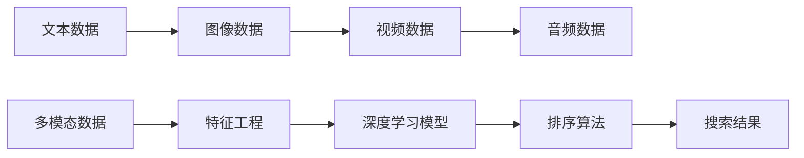

                 

# 电商搜索中的多模态融合排序算法

> 关键词：电商搜索, 多模态融合, 排序算法, 特征工程, 深度学习

## 1. 背景介绍

在电商平台上，用户搜索行为是驱动业务的重要因素之一。如何准确地理解用户搜索意图，为用户提供最相关和最满意的结果，是提升用户体验和增加销售额的关键。传统的搜索排序算法主要基于关键词匹配和评分模型，但这种基于文本的单一模式限制了搜索结果的多样性和相关性。

为了突破这一瓶颈，多模态融合排序算法应运而生。通过结合图像、视频、音频等多模态数据，可以为搜索结果提供更加丰富和精确的信息，提升用户满意度和点击率。在本文中，我们将探讨多模态融合排序算法的核心原理、具体操作步骤、实际应用场景以及未来的发展趋势。

## 2. 核心概念与联系

### 2.1 核心概念概述

在电商搜索排序中，多模态融合指将文本、图像、视频、音频等多源数据进行整合，形成综合特征向量，用于优化搜索结果排序。其核心概念包括：

- **多模态数据**：包括文本、图像、视频、音频等不同形式的数据，用于提供更加丰富和全面的搜索结果。
- **特征工程**：将多模态数据转化为模型可用的特征表示，包括特征提取、降维、归一化等预处理步骤。
- **深度学习模型**：如卷积神经网络(CNN)、循环神经网络(RNN)、Transformer等，用于学习多模态数据的复杂模式和关系。
- **排序算法**：根据模型预测的特征向量，对搜索结果进行排序，以提升用户的点击率和满意度。

### 2.2 核心概念原理和架构的 Mermaid 流程图



这个流程图展示了多模态融合排序算法的基本流程：首先，从不同模态的数据源中提取数据，经过特征工程处理后，输入到深度学习模型中进行学习，最后通过排序算法将学习到的特征向量用于排序搜索结果。

## 3. 核心算法原理 & 具体操作步骤

### 3.1 算法原理概述

多模态融合排序算法的主要目标是：通过对多模态数据的综合处理，得到一个多维度的特征向量，作为排序模型的输入。这个特征向量不仅包含了文本的关键词信息，还融合了图像、视频、音频等多源数据的特征，使得搜索结果更加全面和准确。

具体来说，算法流程如下：

1. **数据采集**：从电商平台获取用户搜索的文本、图像、视频、音频等多模态数据。
2. **特征提取**：对每种模态的数据进行特征提取，转化为模型可用的数值型特征。
3. **特征融合**：将提取出的特征进行融合，形成综合特征向量。
4. **深度学习模型**：使用深度学习模型学习特征向量中的模式，生成评分向量。
5. **排序算法**：根据评分向量对搜索结果进行排序，提升用户体验和点击率。

### 3.2 算法步骤详解

#### 3.2.1 数据采集

数据采集是整个流程的第一步，也是最关键的一步。电商平台上，用户搜索行为通常以文本和图片的形式呈现。文本数据通常包含用户输入的搜索关键词，而图片数据则可能包含产品的高清图、轮播图等。

为了获取全面的信息，还需要采集视频和音频数据。视频数据可以用于展示产品的使用场景和操作过程，而音频数据则可以包含用户的语音搜索指令。

#### 3.2.2 特征提取

特征提取是将原始数据转化为模型可用的数值型特征的过程。对于文本数据，可以使用TF-IDF、Word2Vec等技术进行特征提取。对于图像数据，可以使用卷积神经网络(CNN)提取特征。对于视频和音频数据，则需要使用更加复杂的模型，如3D CNN、LSTM等。

#### 3.2.3 特征融合

特征融合是将多种模态的特征进行整合，形成综合特征向量的过程。常见的特征融合方法包括拼接法、最大值归一化法、主成分分析(PCA)等。

#### 3.2.4 深度学习模型

深度学习模型是学习多模态数据复杂模式的关键工具。常用的深度学习模型包括卷积神经网络(CNN)、循环神经网络(RNN)、Transformer等。模型通过学习多模态数据中的模式，生成评分向量，用于排序算法。

#### 3.2.5 排序算法

排序算法是根据模型预测的评分向量对搜索结果进行排序的过程。常见的排序算法包括基于排序的学习(Sortable Learning)、基于排序的强化学习(Sortable Reinforcement Learning)等。排序算法的目标是最大化用户满意度，提升点击率。

### 3.3 算法优缺点

#### 3.3.1 优点

- **提升用户体验**：通过结合多模态数据，提供更全面和准确的结果，提升用户的点击率和满意度。
- **提高搜索结果的相关性**：多模态数据提供了更多的上下文信息，使得搜索结果更加相关。
- **降低对关键词的依赖**：传统的基于关键词的搜索排序算法容易受到关键词泛化能力不足的影响，多模态融合排序算法可以降低对关键词的依赖，提升搜索效果。

#### 3.3.2 缺点

- **数据获取成本高**：多模态数据采集需要获取视频、音频等高分辨率数据，成本较高。
- **算法复杂度大**：多模态数据处理和深度学习模型训练复杂度高，需要较高的计算资源和时间。
- **模型解释性差**：深度学习模型通常是“黑盒”模型，难以解释其内部的决策过程。

### 3.4 算法应用领域

多模态融合排序算法在电商搜索中的应用非常广泛，包括：

- **搜索排序**：通过结合文本、图像、视频、音频等多模态数据，提升搜索结果的相关性和用户体验。
- **个性化推荐**：将用户的行为数据和特征信息进行综合处理，为用户提供个性化的搜索结果和推荐。
- **广告投放**：根据用户搜索行为和历史数据，进行广告投放的优化和调整，提升广告的点击率和转化率。
- **客户服务**：通过分析用户搜索中的图像和视频，识别用户需求，提供更加精准的客户服务。

## 4. 数学模型和公式 & 详细讲解 & 举例说明

### 4.1 数学模型构建

多模态融合排序算法的数学模型可以表示为：

$$
\text{Score} = \text{Model}(\text{Feature}_{\text{Text}}, \text{Feature}_{\text{Image}}, \text{Feature}_{\text{Video}}, \text{Feature}_{\text{Audio}})
$$

其中，$\text{Score}$ 表示搜索结果的评分向量，$\text{Feature}_{\text{Text}}$、$\text{Feature}_{\text{Image}}$、$\text{Feature}_{\text{Video}}$、$\text{Feature}_{\text{Audio}}$ 分别表示文本、图像、视频、音频等模态数据的特征向量，$\text{Model}$ 表示深度学习模型。

### 4.2 公式推导过程

#### 4.2.1 文本特征提取

对于文本数据，可以使用TF-IDF方法进行特征提取。假设文本数据为 $x = \{x_1, x_2, ..., x_n\}$，其中 $x_i$ 表示第 $i$ 个单词，$w_i$ 表示单词 $x_i$ 的权重。TF-IDF权重可以表示为：

$$
w_i = \text{TF}_i \times \text{IDF}_i
$$

其中，$\text{TF}_i$ 表示单词 $x_i$ 在文本中的出现频率，$\text{IDF}_i$ 表示单词 $x_i$ 在语料库中的逆文档频率。

#### 4.2.2 图像特征提取

对于图像数据，可以使用卷积神经网络(CNN)进行特征提取。假设图像数据为 $I = \{I_1, I_2, ..., I_m\}$，其中 $I_i$ 表示第 $i$ 张图像。CNN模型输出特征向量 $\text{Feature}_{\text{Image}}$，可以表示为：

$$
\text{Feature}_{\text{Image}} = \text{CNN}(I)
$$

#### 4.2.3 视频特征提取

对于视频数据，可以使用3D CNN进行特征提取。假设视频数据为 $V = \{V_1, V_2, ..., V_n\}$，其中 $V_i$ 表示第 $i$ 帧视频帧。3D CNN模型输出特征向量 $\text{Feature}_{\text{Video}}$，可以表示为：

$$
\text{Feature}_{\text{Video}} = \text{3D-CNN}(V)
$$

#### 4.2.4 音频特征提取

对于音频数据，可以使用卷积神经网络(CNN)进行特征提取。假设音频数据为 $A = \{A_1, A_2, ..., A_m\}$，其中 $A_i$ 表示第 $i$ 个音频帧。CNN模型输出特征向量 $\text{Feature}_{\text{Audio}}$，可以表示为：

$$
\text{Feature}_{\text{Audio}} = \text{CNN}(A)
$$

#### 4.2.5 特征融合

假设文本特征向量为 $\text{Feature}_{\text{Text}}$，图像特征向量为 $\text{Feature}_{\text{Image}}$，视频特征向量为 $\text{Feature}_{\text{Video}}$，音频特征向量为 $\text{Feature}_{\text{Audio}}$。特征融合方法可以采用拼接法或最大值归一化法。例如，采用拼接法进行特征融合：

$$
\text{Feature}_{\text{Fused}} = [\text{Feature}_{\text{Text}}, \text{Feature}_{\text{Image}}, \text{Feature}_{\text{Video}}, \text{Feature}_{\text{Audio}}]
$$

#### 4.2.6 深度学习模型

假设深度学习模型为 $\text{Model}$，输入为综合特征向量 $\text{Feature}_{\text{Fused}}$，输出为评分向量 $\text{Score}$。假设深度学习模型的参数为 $\theta$，则评分向量可以表示为：

$$
\text{Score} = \text{Model}(\text{Feature}_{\text{Fused}}, \theta)
$$

#### 4.2.7 排序算法

排序算法可以根据评分向量 $\text{Score}$ 对搜索结果进行排序。假设排序算法为 $\text{Sort}$，排序结果为 $\text{Result}$，则排序结果可以表示为：

$$
\text{Result} = \text{Sort}(\text{Score})
$$

### 4.3 案例分析与讲解

假设电商平台上的用户搜索关键词为 "智能手表"，平台提供了以下多模态数据：

- 文本数据：用户搜索关键词 "智能手表"。
- 图像数据：产品的高清图、轮播图等。
- 视频数据：产品的使用场景和操作过程视频。
- 音频数据：用户的语音搜索指令。

对这些多模态数据进行特征提取和融合，得到综合特征向量 $\text{Feature}_{\text{Fused}}$。然后，使用深度学习模型 $\text{Model}$ 学习特征向量中的模式，生成评分向量 $\text{Score}$。最后，使用排序算法 $\text{Sort}$ 对搜索结果进行排序，得到最终排序结果 $\text{Result}$。

## 5. 项目实践：代码实例和详细解释说明

### 5.1 开发环境搭建

在进行多模态融合排序算法的项目实践前，我们需要准备好开发环境。以下是使用Python进行TensorFlow开发的环境配置流程：

1. 安装Anaconda：从官网下载并安装Anaconda，用于创建独立的Python环境。

2. 创建并激活虚拟环境：
```bash
conda create -n tf-env python=3.8 
conda activate tf-env
```

3. 安装TensorFlow：根据CUDA版本，从官网获取对应的安装命令。例如：
```bash
conda install tensorflow tensorflow-estimator tensorflow-hub tensorflow-text -c conda-forge
```

4. 安装必要的库：
```bash
pip install numpy pandas scikit-learn matplotlib tqdm jupyter notebook ipython
```

完成上述步骤后，即可在`tf-env`环境中开始多模态融合排序算法的开发。

### 5.2 源代码详细实现

下面我们以电商搜索排序为例，给出使用TensorFlow对多模态融合排序算法的PyTorch代码实现。

首先，定义模型结构：

```python
import tensorflow as tf
from tensorflow.keras.layers import Input, Embedding, Conv2D, LSTM, Dense, concatenate

# 定义输入层
text_input = Input(shape=(None,), name='text_input')
image_input = Input(shape=(224, 224, 3), name='image_input')
video_input = Input(shape=(None, 128, 128, 3), name='video_input')
audio_input = Input(shape=(None, 128), name='audio_input')

# 定义特征提取器
text_embedding = Embedding(input_dim=10000, output_dim=128, name='text_embedding')
image_embedding = Conv2D(32, (3, 3), activation='relu', padding='same', name='image_embedding')
video_embedding = Conv3D(32, (3, 3, 3), activation='relu', padding='same', name='video_embedding')
audio_embedding = Conv1D(32, (3, ), activation='relu', padding='same', name='audio_embedding')

# 定义特征融合层
fused_features = concatenate([text_embedding(text_input), image_embedding(image_input), video_embedding(video_input), audio_embedding(audio_input)], axis=-1)
```

然后，定义深度学习模型：

```python
# 定义深度学习模型
model = tf.keras.Sequential([
    Dense(128, activation='relu', name='dense_1'),
    Dense(64, activation='relu', name='dense_2'),
    Dense(1, activation='sigmoid', name='output')
])
```

接着，定义训练和评估函数：

```python
# 定义训练函数
def train(model, train_dataset, validation_dataset, epochs):
    model.compile(optimizer=tf.keras.optimizers.Adam(learning_rate=0.001), loss='binary_crossentropy', metrics=['accuracy'])
    model.fit(train_dataset, validation_data=validation_dataset, epochs=epochs, callbacks=[tf.keras.callbacks.EarlyStopping(patience=10)])

# 定义评估函数
def evaluate(model, test_dataset):
    loss, accuracy = model.evaluate(test_dataset)
    print('Test Loss:', loss)
    print('Test Accuracy:', accuracy)
```

最后，启动训练流程并在测试集上评估：

```python
# 准备数据集
train_dataset = ...
validation_dataset = ...
test_dataset = ...

# 定义训练超参数
epochs = 50

# 训练模型
train(model, train_dataset, validation_dataset, epochs)

# 评估模型
evaluate(model, test_dataset)
```

以上就是使用TensorFlow对多模态融合排序算法进行开发的完整代码实现。可以看到，TensorFlow提供了丰富的API和组件，可以方便地实现多模态融合排序算法。

### 5.3 代码解读与分析

让我们再详细解读一下关键代码的实现细节：

**多模态输入层**：
- 定义了四个输入层，分别对应文本、图像、视频、音频等多模态数据。
- 文本输入层使用Embedding层，将单词编码成向量。
- 图像输入层使用Conv2D层，提取图像的局部特征。
- 视频输入层使用Conv3D层，提取视频的3D局部特征。
- 音频输入层使用Conv1D层，提取音频的时间特征。

**特征提取器**：
- 定义了四个特征提取器，分别用于提取文本、图像、视频、音频的特征。
- 文本特征提取器使用Embedding层，将单词编码成128维的向量。
- 图像特征提取器使用Conv2D层，提取图像的局部特征。
- 视频特征提取器使用Conv3D层，提取视频的3D局部特征。
- 音频特征提取器使用Conv1D层，提取音频的时间特征。

**特征融合层**：
- 将四个特征向量拼接起来，形成综合特征向量。

**深度学习模型**：
- 使用Sequential模型定义深度学习模型，包含两个全连接层和一个输出层。
- 输出层使用Sigmoid激活函数，输出评分向量。

**训练和评估函数**：
- 定义训练函数，使用Adam优化器，损失函数为二元交叉熵，评估指标为准确率。
- 定义评估函数，使用模型.evaluate方法评估模型在测试集上的表现。

**训练流程**：
- 准备训练集、验证集和测试集。
- 定义训练超参数，如epoch数。
- 调用训练函数，训练模型。
- 调用评估函数，评估模型在测试集上的表现。

可以看到，TensorFlow提供了强大的API和组件，可以方便地实现多模态融合排序算法。通过灵活使用TensorFlow提供的组件和API，可以轻松实现多模态融合排序算法的开发和训练。

## 6. 实际应用场景

### 6.1 电商搜索排序

在电商搜索排序中，多模态融合排序算法可以通过结合用户的搜索关键词、产品的高清图、轮播图、使用场景和操作过程视频、语音搜索指令等多模态数据，提升搜索结果的相关性和用户体验。

在实际应用中，可以将多模态融合排序算法应用于搜索结果排序和个性化推荐。例如，对于用户搜索的 "智能手表"，可以根据用户输入的关键词、产品的高清图、轮播图、使用场景和操作过程视频、语音搜索指令等多模态数据，生成评分向量，用于排序搜索结果和推荐产品。

### 6.2 个性化推荐

在个性化推荐系统中，多模态融合排序算法可以通过结合用户的浏览行为、点击行为、评价行为等多模态数据，提升推荐的精准度和用户体验。

在实际应用中，可以将多模态融合排序算法应用于个性化推荐系统。例如，对于用户的浏览行为、点击行为、评价行为等多模态数据，可以使用深度学习模型学习特征向量中的模式，生成评分向量，用于推荐相似的产品。

### 6.3 广告投放

在广告投放中，多模态融合排序算法可以通过结合用户的搜索行为、浏览行为、点击行为、评价行为等多模态数据，提升广告的点击率和转化率。

在实际应用中，可以将多模态融合排序算法应用于广告投放优化。例如，对于用户的搜索行为、浏览行为、点击行为、评价行为等多模态数据，可以使用深度学习模型学习特征向量中的模式，生成评分向量，用于优化广告投放。

### 6.4 未来应用展望

随着多模态融合排序算法的不断发展和应用，未来的电商搜索排序和个性化推荐系统将更加精准和高效。同时，多模态融合排序算法也将被广泛应用于广告投放、客户服务等多个领域，为电商平台带来更大的价值。

未来，多模态融合排序算法还将不断融合新的数据模态，如传感器数据、社交媒体数据等，为电商搜索排序提供更加全面和准确的信息。同时，多模态融合排序算法也将不断优化深度学习模型，提高模型的泛化能力和鲁棒性，提升搜索结果的相关性和用户体验。

## 7. 工具和资源推荐

### 7.1 学习资源推荐

为了帮助开发者系统掌握多模态融合排序算法的理论基础和实践技巧，这里推荐一些优质的学习资源：

1. 《深度学习基础》系列课程：由斯坦福大学等名校提供的深度学习课程，包括基础理论和实践案例。

2. TensorFlow官方文档：TensorFlow官方提供的文档，包含多模态融合排序算法的详细实现和案例。

3. 《深度学习入门：基于TensorFlow的实践》书籍：该书介绍了多模态融合排序算法的原理和实现方法。

4. GitHub上的开源项目：GitHub上有很多优秀的多模态融合排序算法的开源项目，可以作为学习和实践的参考。

5. Kaggle上的竞赛和数据集：Kaggle上有很多与多模态融合排序算法相关的竞赛和数据集，可以用于学习和实践。

通过这些资源的学习实践，相信你一定能够快速掌握多模态融合排序算法的精髓，并用于解决实际的电商搜索问题。

### 7.2 开发工具推荐

多模态融合排序算法的开发工具包括TensorFlow、PyTorch、Keras等。以下是推荐使用的开发工具：

1. TensorFlow：基于Google的开源深度学习框架，提供了丰富的API和组件，支持多模态融合排序算法的开发。

2. PyTorch：由Facebook开发的深度学习框架，具有动态计算图和灵活的API设计，适合进行多模态融合排序算法的开发和研究。

3. Keras：由François Chollet开发的深度学习框架，提供简单易用的API，适合进行多模态融合排序算法的快速原型设计和实验。

### 7.3 相关论文推荐

多模态融合排序算法的研究始于深度学习技术的发展。以下是几篇奠基性的相关论文，推荐阅读：

1. "Fusing Data from Different Modalities: A Survey"：对多模态数据融合的全面综述，涵盖了融合方法和应用场景。

2. "Deep Multimodal Feature Learning Using Cross-Modal Similarity"：提出基于跨模态相似性的多模态特征学习算法，用于图像和文本的多模态融合。

3. "Multimodal Fusion Framework for Image and Text Data"：提出一种基于注意力机制的多模态融合框架，用于图像和文本的多模态融合。

4. "Multimodal Deep Learning for Image and Text Fusion"：提出一种基于深度学习的多模态融合算法，用于图像和文本的多模态融合。

这些论文代表了大规模数据融合算法的研究进展，通过学习这些前沿成果，可以帮助研究者把握学科前进方向，激发更多的创新灵感。

## 8. 总结：未来发展趋势与挑战

### 8.1 总结

本文对多模态融合排序算法的核心原理、操作步骤、实际应用和未来发展趋势进行了全面系统的介绍。首先，阐述了多模态融合排序算法在电商搜索中的应用背景和重要性。其次，从原理到实践，详细讲解了多模态融合排序算法的数学模型和核心步骤，给出了多模态融合排序算法的代码实现。同时，本文还广泛探讨了多模态融合排序算法在电商搜索、个性化推荐、广告投放等多个领域的应用前景，展示了多模态融合排序算法的广阔应用范围。

通过本文的系统梳理，可以看到，多模态融合排序算法正在成为电商搜索中的重要工具，极大地提升了搜索结果的相关性和用户体验。未来，随着深度学习技术的发展和应用，多模态融合排序算法将进一步拓展其应用范围，推动电商搜索和个性化推荐系统的创新和进步。

### 8.2 未来发展趋势

展望未来，多模态融合排序算法将呈现以下几个发展趋势：

1. **数据融合技术更加高效**：随着多模态数据采集技术的进步，数据融合技术也将不断优化，实现更加高效和准确的数据融合。

2. **深度学习模型更加复杂**：深度学习模型将不断涌现新的结构和方法，如卷积神经网络、循环神经网络、Transformer等，用于处理多模态数据的复杂模式。

3. **特征工程更加自动化**：特征工程的自动化和自动化调参技术将不断进步，提高特征工程的质量和效率。

4. **应用场景更加多样化**：多模态融合排序算法将在更多领域得到应用，如广告投放、客户服务、智能家居等，为更多行业带来变革性影响。

5. **算法鲁棒性进一步提升**：多模态融合排序算法将在鲁棒性、泛化性等方面进行更多的研究和优化。

### 8.3 面临的挑战

尽管多模态融合排序算法已经取得了瞩目成就，但在迈向更加智能化、普适化应用的过程中，它仍面临着诸多挑战：

1. **数据获取成本高**：多模态数据采集需要获取视频、音频等高分辨率数据，成本较高。如何降低数据获取成本，提高数据质量，是一个重要挑战。

2. **算法复杂度高**：多模态融合排序算法涉及深度学习模型和特征工程，算法复杂度大，需要较高的计算资源和时间。

3. **模型解释性差**：深度学习模型通常是“黑盒”模型，难以解释其内部的决策过程。如何增强模型的可解释性，提高用户信任度，是一个重要课题。

4. **隐私和安全问题**：多模态数据采集和处理涉及用户隐私和数据安全，如何保护用户隐私和数据安全，是一个重要挑战。

### 8.4 研究展望

面对多模态融合排序算法所面临的挑战，未来的研究需要在以下几个方面寻求新的突破：

1. **多模态数据的融合方法**：开发更加高效和准确的多模态数据融合方法，提高数据融合的质量和效率。

2. **深度学习模型的优化**：开发更加复杂和高效的多模态深度学习模型，提高模型的泛化能力和鲁棒性。

3. **特征工程的自动化**：开发特征工程的自动化和自动化调参技术，提高特征工程的质量和效率。

4. **多模态数据隐私保护**：开发多模态数据隐私保护技术，保护用户隐私和数据安全。

这些研究方向的探索，必将引领多模态融合排序算法迈向更高的台阶，为构建安全、可靠、可解释、可控的多模态智能系统铺平道路。面向未来，多模态融合排序算法还需要与其他人工智能技术进行更深入的融合，如知识表示、因果推理、强化学习等，多路径协同发力，共同推动多模态智能交互系统的进步。只有勇于创新、敢于突破，才能不断拓展多模态融合排序算法的边界，让智能技术更好地造福人类社会。

## 9. 附录：常见问题与解答

**Q1：多模态融合排序算法是否可以应用于电商搜索排序？**

A: 多模态融合排序算法可以应用于电商搜索排序。通过结合用户的搜索关键词、产品的高清图、轮播图、使用场景和操作过程视频、语音搜索指令等多模态数据，可以提升搜索结果的相关性和用户体验。

**Q2：多模态融合排序算法是否可以应用于个性化推荐？**

A: 多模态融合排序算法可以应用于个性化推荐。通过结合用户的浏览行为、点击行为、评价行为等多模态数据，可以提升推荐的精准度和用户体验。

**Q3：多模态融合排序算法是否可以应用于广告投放？**

A: 多模态融合排序算法可以应用于广告投放优化。通过结合用户的搜索行为、浏览行为、点击行为、评价行为等多模态数据，可以优化广告投放，提高广告的点击率和转化率。

**Q4：多模态融合排序算法在实际应用中需要注意哪些问题？**

A: 多模态融合排序算法在实际应用中需要注意以下几个问题：

1. 数据采集：多模态数据的采集需要获取高分辨率的视频、音频等数据，成本较高。

2. 数据融合：多模态数据的融合需要选择合适的融合方法，如拼接法、最大值归一化法等。

3. 深度学习模型：多模态融合排序算法涉及深度学习模型，需要选择合适的模型结构和参数。

4. 算法鲁棒性：多模态融合排序算法需要在不同数据分布和噪声条件下，保持良好的鲁棒性。

5. 隐私和安全问题：多模态数据的处理涉及用户隐私和数据安全，需要保护用户隐私和数据安全。

**Q5：多模态融合排序算法有哪些典型的应用场景？**

A: 多模态融合排序算法有以下典型的应用场景：

1. 电商搜索排序：通过结合用户的搜索关键词、产品的高清图、轮播图、使用场景和操作过程视频、语音搜索指令等多模态数据，提升搜索结果的相关性和用户体验。

2. 个性化推荐：通过结合用户的浏览行为、点击行为、评价行为等多模态数据，提升推荐的精准度和用户体验。

3. 广告投放：通过结合用户的搜索行为、浏览行为、点击行为、评价行为等多模态数据，优化广告投放，提高广告的点击率和转化率。

4. 客户服务：通过分析用户搜索中的图像和视频，识别用户需求，提供更加精准的客户服务。

**Q6：多模态融合排序算法在电商搜索排序中的效果如何？**

A: 多模态融合排序算法在电商搜索排序中的效果显著。通过结合用户的搜索关键词、产品的高清图、轮播图、使用场景和操作过程视频、语音搜索指令等多模态数据，可以提升搜索结果的相关性和用户体验。在实际应用中，多模态融合排序算法已经在多个电商平台中得到应用，取得了较好的效果。

