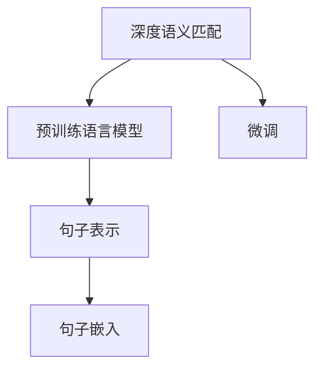

                 

## 1. 背景介绍

### 1.1 问题由来

在当今的电子商务时代，搜索引擎已经成为了用户获取商品信息、进行购物决策的重要工具。传统的基于关键词匹配的搜索技术，虽然能够迅速返回相关的商品，但在结果的相关性和用户体验上仍存在诸多不足。深度语义匹配技术（Semantic Matching）应运而生，通过深度学习模型对用户查询和商品描述之间的语义关系进行匹配，从而提升搜索结果的相关性和用户满意度。

### 1.2 问题核心关键点

深度语义匹配技术的核心在于将查询与商品描述转化为向量表示，并计算它们之间的相似度，以判断它们是否具有相似的语义。目前主流的方法包括基于词向量的模型、基于句子表示的模型和基于预训练语言模型的模型。其中，基于预训练语言模型的模型由于其强大的语义理解能力，成为近年来研究的热点。

基于预训练语言模型的深度语义匹配技术主要分为两个阶段：预训练和微调。预训练阶段通过大规模无标签文本数据进行预训练，学习通用语言知识。微调阶段在预训练模型的基础上，通过有监督的搜索查询和商品描述对模型进行微调，使模型能够更好地理解查询和商品描述的语义。

## 2. 核心概念与联系

### 2.1 核心概念概述

为更好地理解深度语义匹配技术，本节将介绍几个密切相关的核心概念：

- 深度语义匹配（Semantic Matching）：通过深度学习模型对用户查询和商品描述之间的语义关系进行匹配，以提升搜索结果的相关性和用户满意度。
- 预训练语言模型（Pre-trained Language Model）：如BERT、GPT等，通过大规模无标签文本数据进行预训练，学习通用的语言知识。
- 微调（Fine-tuning）：在预训练模型的基础上，通过有监督的搜索查询和商品描述对模型进行微调，使其适应特定的匹配任务。
- 句子表示（Sentence Representation）：将句子转换为向量表示，方便计算语义相似度。
- 句子嵌入（Sentence Embedding）：通过向量表示学习句子的语义特征，用于计算语义相似度。

这些核心概念之间的逻辑关系可以通过以下Mermaid流程图来展示：



这个流程图展示了大语言模型的核心概念及其之间的关系：

1. 深度语义匹配技术通过预训练语言模型学习通用的语言知识，然后对模型进行微调，使其适应特定的匹配任务。
2. 预训练语言模型通过大规模无标签文本数据进行预训练，学习通用的语言表示。
3. 句子表示和句子嵌入将查询和商品描述转换为向量表示，方便计算语义相似度。

这些概念共同构成了深度语义匹配技术的框架，使其能够通过学习语言的语义关系，提升搜索结果的相关性和用户满意度。通过理解这些核心概念，我们可以更好地把握深度语义匹配技术的原理和优化方向。

## 3. 核心算法原理 & 具体操作步骤
### 3.1 算法原理概述

基于预训练语言模型的深度语义匹配技术，本质上是一个文本分类问题。其核心思想是：将用户查询和商品描述视为两个文本序列，通过预训练语言模型将它们转换为向量表示，然后计算它们之间的相似度，判断它们是否匹配。

形式化地，假设用户查询和商品描述分别为 $q$ 和 $d$，预训练语言模型为 $M_{\theta}$，其中 $\theta$ 为预训练得到的模型参数。设 $M_{\theta}(q)$ 和 $M_{\theta}(d)$ 分别为 $q$ 和 $d$ 的向量表示。定义查询和商品描述的语义匹配度为 $S(q,d)$，则在训练集 $\{(q_i,d_i)\}_{i=1}^N$ 上，深度语义匹配模型的优化目标为：

$$
\mathcal{L}(\theta) = \frac{1}{N} \sum_{i=1}^N \ell(S(q_i,d_i), y_i)
$$

其中 $y_i \in \{0,1\}$ 表示 $q_i$ 和 $d_i$ 是否匹配，$\ell$ 为交叉熵损失函数。

微调过程中，模型的前向传播和反向传播分别计算查询和商品描述的向量表示，然后通过相似度计算模块计算它们之间的相似度，并根据损失函数进行参数更新。

### 3.2 算法步骤详解

基于预训练语言模型的深度语义匹配技术一般包括以下几个关键步骤：

**Step 1: 准备预训练模型和数据集**
- 选择合适的预训练语言模型 $M_{\theta}$ 作为初始化参数，如 BERT、GPT等。
- 准备搜索查询和商品描述的数据集 $D=\{(q_i,d_i)\}_{i=1}^N$，划分为训练集、验证集和测试集。一般要求查询和商品描述的分布与预训练数据的分布不要差异过大。

**Step 2: 定义语义匹配度计算方式**
- 根据具体任务，选择适合的向量表示方式，如平均池化、最大池化、Transformer编码器等。
- 设计合适的损失函数，如交叉熵、二分类损失等。
- 根据任务类型，选择适合的相似度计算方式，如余弦相似度、欧式距离、Jaccard系数等。

**Step 3: 设置微调超参数**
- 选择合适的优化算法及其参数，如 Adam、SGD 等，设置学习率、批大小、迭代轮数等。
- 设置正则化技术及强度，包括权重衰减、Dropout、Early Stopping 等。
- 确定冻结预训练参数的策略，如仅微调顶层，或全部参数都参与微调。

**Step 4: 执行梯度训练**
- 将训练集数据分批次输入模型，前向传播计算向量表示和相似度。
- 反向传播计算参数梯度，根据设定的优化算法和学习率更新模型参数。
- 周期性在验证集上评估模型性能，根据性能指标决定是否触发 Early Stopping。
- 重复上述步骤直到满足预设的迭代轮数或 Early Stopping 条件。

**Step 5: 测试和部署**
- 在测试集上评估微调后模型的性能，对比微调前后的匹配精度提升。
- 使用微调后的模型对新的搜索查询和商品描述进行匹配，集成到实际的应用系统中。
- 持续收集新的查询数据，定期重新微调模型，以适应数据分布的变化。

以上是基于预训练语言模型的深度语义匹配技术的一般流程。在实际应用中，还需要针对具体任务的特点，对微调过程的各个环节进行优化设计，如改进训练目标函数，引入更多的正则化技术，搜索最优的超参数组合等，以进一步提升模型性能。

### 3.3 算法优缺点

基于预训练语言模型的深度语义匹配技术具有以下优点：
1. 高效性。微调过程仅需较少的标注数据，且训练时间较短。
2. 适应性。微调后的模型能够很好地适应特定的匹配任务，提升搜索结果的相关性。
3. 鲁棒性。预训练语言模型的通用语言知识使其具有较强的鲁棒性，能够在多变的环境下保持性能。

同时，该方法也存在一定的局限性：
1. 依赖高质量标注数据。微调的效果很大程度上取决于标注数据的质量和数量，获取高质量标注数据的成本较高。
2. 泛化能力有限。当查询和商品描述的分布差异较大时，微调的性能提升有限。
3. 语言理解能力。预训练语言模型对文本的语义理解能力有限，可能无法处理语义复杂的查询和商品描述。
4. 可解释性不足。微调模型的决策过程通常缺乏可解释性，难以对其推理逻辑进行分析和调试。

尽管存在这些局限性，但就目前而言，基于预训练语言模型的深度语义匹配方法仍是当前主流技术，广泛应用于电子商务搜索、智能客服、知识图谱等众多领域。未来相关研究的重点在于如何进一步降低微调对标注数据的依赖，提高模型的泛化能力，同时兼顾可解释性和伦理安全性等因素。

### 3.4 算法应用领域

基于深度语义匹配技术，在电子商务搜索中，用户输入的查询往往具有高度的个性化和模糊性。传统基于关键词匹配的搜索引擎无法准确理解用户意图，导致搜索结果相关性低下。基于深度语义匹配技术的搜索引擎能够通过对查询和商品描述进行语义匹配，提升搜索结果的相关性。

具体而言，可以通过以下步骤实现：
1. 对搜索查询和商品描述进行预处理，去除无关信息，进行标准化处理。
2. 利用预训练语言模型将查询和商品描述转换为向量表示。
3. 计算查询和商品描述之间的语义相似度。
4. 根据相似度排序，返回匹配度高的商品列表。

此外，深度语义匹配技术在智能客服、知识图谱、广告推荐等多个领域也有广泛应用。通过提升搜索结果的相关性和用户体验，深度语义匹配技术能够极大地优化电子商务搜索体验，提升用户的购物决策效率和满意度。

## 4. 数学模型和公式 & 详细讲解  
### 4.1 数学模型构建

本节将使用数学语言对基于预训练语言模型的深度语义匹配过程进行更加严格的刻画。

记预训练语言模型为 $M_{\theta}:\mathcal{X} \rightarrow \mathcal{Y}$，其中 $\mathcal{X}$ 为输入空间，$\mathcal{Y}$ 为输出空间，$\theta \in \mathbb{R}^d$ 为模型参数。假设搜索查询和商品描述的数据集为 $D=\{(q_i,d_i)\}_{i=1}^N, q_i \in \mathcal{X}, d_i \in \mathcal{X}$。

定义查询和商品描述的语义匹配度为 $S(q,d)$，基于语义匹配度 $S(q,d)$ 的损失函数为：

$$
\ell(S(q,d),y) = -y\log S(q,d) - (1-y)\log(1-S(q,d))
$$

其中 $y \in \{0,1\}$ 表示 $q$ 和 $d$ 是否匹配。在训练集 $\{(q_i,d_i)\}_{i=1}^N$ 上，深度语义匹配模型的优化目标为：

$$
\mathcal{L}(\theta) = \frac{1}{N} \sum_{i=1}^N \ell(S(q_i,d_i),y_i)
$$

在实践中，我们通常使用基于梯度的优化算法（如Adam、SGD等）来近似求解上述最优化问题。设 $\eta$ 为学习率，$\lambda$ 为正则化系数，则参数的更新公式为：

$$
\theta \leftarrow \theta - \eta \nabla_{\theta}\mathcal{L}(\theta) - \eta\lambda\theta
$$

其中 $\nabla_{\theta}\mathcal{L}(\theta)$ 为损失函数对参数 $\theta$ 的梯度，可通过反向传播算法高效计算。

### 4.2 公式推导过程

以下我们以基于BERT的深度语义匹配模型为例，推导具体的损失函数和梯度计算公式。

假设查询和商品描述的预训练表示分别为 $h_q = M_{\theta}(q)$ 和 $h_d = M_{\theta}(d)$，则语义匹配度 $S(q,d)$ 可以定义为两个向量之间的余弦相似度：

$$
S(q,d) = \frac{\langle h_q, h_d \rangle}{\|h_q\|_2\|h_d\|_2}
$$

其中 $\langle \cdot, \cdot \rangle$ 表示向量内积，$\|\cdot\|_2$ 表示向量范数。

将 $S(q,d)$ 代入损失函数，得：

$$
\mathcal{L}(\theta) = -\frac{1}{N}\sum_{i=1}^N [y_i \log \frac{\langle h_q, h_d \rangle}{\|h_q\|_2\|h_d\|_2} + (1-y_i) \log \frac{1-\langle h_q, h_d \rangle}{\|h_q\|_2\|h_d\|_2}]
$$

根据链式法则，损失函数对参数 $\theta_k$ 的梯度为：

$$
\frac{\partial \mathcal{L}(\theta)}{\partial \theta_k} = -\frac{1}{N}\sum_{i=1}^N \left[ y_i \frac{\langle h_q, h_d \rangle}{\|h_q\|_2\|h_d\|_2} \frac{\partial h_q}{\partial \theta_k} - (1-y_i) \frac{\langle h_q, h_d \rangle}{\|h_q\|_2\|h_d\|_2} \frac{\partial h_d}{\partial \theta_k} \right]
$$

其中 $\frac{\partial h_q}{\partial \theta_k}$ 和 $\frac{\partial h_d}{\partial \theta_k}$ 为预训练模型对参数 $\theta_k$ 的梯度，可通过自动微分技术完成计算。

在得到损失函数的梯度后，即可带入参数更新公式，完成模型的迭代优化。重复上述过程直至收敛，最终得到适应匹配任务的最优模型参数 $\theta^*$。

## 5. 项目实践：代码实例和详细解释说明
### 5.1 开发环境搭建

在进行深度语义匹配实践前，我们需要准备好开发环境。以下是使用Python进行PyTorch开发的环境配置流程：

1. 安装Anaconda：从官网下载并安装Anaconda，用于创建独立的Python环境。

2. 创建并激活虚拟环境：
```bash
conda create -n pytorch-env python=3.8 
conda activate pytorch-env
```

3. 安装PyTorch：根据CUDA版本，从官网获取对应的安装命令。例如：
```bash
conda install pytorch torchvision torchaudio cudatoolkit=11.1 -c pytorch -c conda-forge
```

4. 安装Transformers库：
```bash
pip install transformers
```

5. 安装各类工具包：
```bash
pip install numpy pandas scikit-learn matplotlib tqdm jupyter notebook ipython
```

完成上述步骤后，即可在`pytorch-env`环境中开始深度语义匹配实践。

### 5.2 源代码详细实现

下面我们以电商搜索中的深度语义匹配任务为例，给出使用Transformers库对BERT模型进行匹配微调的PyTorch代码实现。

首先，定义匹配任务的数据处理函数：

```python
from transformers import BertTokenizer
from torch.utils.data import Dataset
import torch

class SearchDataset(Dataset):
    def __init__(self, queries, descriptions, tokenizer, max_len=128):
        self.queries = queries
        self.descriptions = descriptions
        self.tokenizer = tokenizer
        self.max_len = max_len
        
    def __len__(self):
        return len(self.queries)
    
    def __getitem__(self, item):
        query = self.queries[item]
        description = self.descriptions[item]
        
        encoding = self.tokenizer(query, description, return_tensors='pt', max_length=self.max_len, padding='max_length', truncation=True)
        input_ids = encoding['input_ids'][0]
        attention_mask = encoding['attention_mask'][0]
        
        # 对query和description的语义匹配度进行编码
        sequence = query + ' [SEP]' + description + ' [SEP]'
        encoded_sequence = self.tokenizer(sequence, return_tensors='pt', max_length=self.max_len, padding='max_length', truncation=True)
        input_ids = input_ids + encoded_sequence['input_ids'][0]
        attention_mask = attention_mask + encoded_sequence['attention_mask'][0]
        
        return {'input_ids': input_ids, 
                'attention_mask': attention_mask}
```

然后，定义模型和优化器：

```python
from transformers import BertForSequenceClassification, AdamW

model = BertForSequenceClassification.from_pretrained('bert-base-cased', num_labels=2)

optimizer = AdamW(model.parameters(), lr=2e-5)
```

接着，定义训练和评估函数：

```python
from torch.utils.data import DataLoader
from tqdm import tqdm
from sklearn.metrics import accuracy_score

device = torch.device('cuda') if torch.cuda.is_available() else torch.device('cpu')
model.to(device)

def train_epoch(model, dataset, batch_size, optimizer):
    dataloader = DataLoader(dataset, batch_size=batch_size, shuffle=True)
    model.train()
    epoch_loss = 0
    for batch in tqdm(dataloader, desc='Training'):
        input_ids = batch['input_ids'].to(device)
        attention_mask = batch['attention_mask'].to(device)
        labels = batch['labels'].to(device)
        model.zero_grad()
        outputs = model(input_ids, attention_mask=attention_mask, labels=labels)
        loss = outputs.loss
        epoch_loss += loss.item()
        loss.backward()
        optimizer.step()
    return epoch_loss / len(dataloader)

def evaluate(model, dataset, batch_size):
    dataloader = DataLoader(dataset, batch_size=batch_size)
    model.eval()
    preds, labels = [], []
    with torch.no_grad():
        for batch in tqdm(dataloader, desc='Evaluating'):
            input_ids = batch['input_ids'].to(device)
            attention_mask = batch['attention_mask'].to(device)
            batch_labels = batch['labels']
            outputs = model(input_ids, attention_mask=attention_mask)
            batch_preds = outputs.logits.argmax(dim=2).to('cpu').tolist()
            batch_labels = batch_labels.to('cpu').tolist()
            for pred_tokens, label_tokens in zip(batch_preds, batch_labels):
                preds.append(pred_tokens)
                labels.append(label_tokens)
                
    print('Accuracy:', accuracy_score(labels, preds))
```

最后，启动训练流程并在测试集上评估：

```python
epochs = 5
batch_size = 16

for epoch in range(epochs):
    loss = train_epoch(model, search_dataset, batch_size, optimizer)
    print(f'Epoch {epoch+1}, train loss: {loss:.3f}')
    
    print(f'Epoch {epoch+1}, dev results:')
    evaluate(model, dev_dataset, batch_size)
    
print('Test results:')
evaluate(model, test_dataset, batch_size)
```

以上就是使用PyTorch对BERT进行电商搜索匹配微调的完整代码实现。可以看到，得益于Transformers库的强大封装，我们可以用相对简洁的代码完成BERT模型的加载和微调。

### 5.3 代码解读与分析

让我们再详细解读一下关键代码的实现细节：

**SearchDataset类**：
- `__init__`方法：初始化查询、商品描述、分词器等关键组件。
- `__len__`方法：返回数据集的样本数量。
- `__getitem__`方法：对单个样本进行处理，将查询和商品描述输入编码为token ids，并将它们的语义匹配度编码为向量，最终返回模型所需的输入。

** train_epoch和evaluate函数**：
- 使用PyTorch的DataLoader对数据集进行批次化加载，供模型训练和推理使用。
- 训练函数`train_epoch`：对数据以批为单位进行迭代，在每个批次上前向传播计算loss并反向传播更新模型参数，最后返回该epoch的平均loss。
- 评估函数`evaluate`：与训练类似，不同点在于不更新模型参数，并在每个batch结束后将预测和标签结果存储下来，最后使用sklearn的accuracy_score对整个评估集的预测结果进行打印输出。

**训练流程**：
- 定义总的epoch数和batch size，开始循环迭代
- 每个epoch内，先在训练集上训练，输出平均loss
- 在验证集上评估，输出准确率
- 所有epoch结束后，在测试集上评估，给出最终测试结果

可以看到，PyTorch配合Transformers库使得BERT匹配微调的代码实现变得简洁高效。开发者可以将更多精力放在数据处理、模型改进等高层逻辑上，而不必过多关注底层的实现细节。

当然，工业级的系统实现还需考虑更多因素，如模型的保存和部署、超参数的自动搜索、更灵活的任务适配层等。但核心的微调范式基本与此类似。

## 6. 实际应用场景
### 6.1 智能客服系统

基于深度语义匹配技术的智能客服系统，可以更好地理解用户意图，自动回复用户咨询，提高客服效率和用户满意度。

具体而言，可以通过以下步骤实现：
1. 收集历史客服对话记录，将其转化为查询和商品描述的数据集。
2. 使用预训练语言模型将查询和商品描述转换为向量表示。
3. 计算查询和商品描述之间的语义相似度。
4. 根据相似度排序，返回匹配度高的商品描述，供客服参考。

通过深度语义匹配技术，智能客服系统能够自动理解用户意图，提供精准的回答，减少人工干预，提高客服响应速度和准确性。

### 6.2 个性化推荐系统

深度语义匹配技术在个性化推荐系统中也有广泛应用。推荐系统往往需要分析用户的浏览、点击、评论等行为数据，提取和用户交互的物品标题、描述、标签等文本内容。通过深度语义匹配技术，可以对用户查询和商品描述进行语义匹配，提升推荐的个性化程度。

具体而言，可以通过以下步骤实现：
1. 对用户查询和商品描述进行预处理，去除无关信息，进行标准化处理。
2. 使用预训练语言模型将查询和商品描述转换为向量表示。
3. 计算查询和商品描述之间的语义相似度。
4. 根据相似度排序，返回匹配度高的商品列表，供推荐系统使用。

通过深度语义匹配技术，个性化推荐系统能够更好地理解用户的兴趣点，推荐更符合用户需求的商品，提高用户的购物体验和满意度。

### 6.3 智能广告系统

广告推荐是电商搜索中的重要环节，深度语义匹配技术能够提升广告的相关性和点击率。通过深度语义匹配技术，可以将用户查询和广告内容进行匹配，提升广告展示的相关性和转化率。

具体而言，可以通过以下步骤实现：
1. 对用户查询和广告内容进行预处理，去除无关信息，进行标准化处理。
2. 使用预训练语言模型将查询和广告内容转换为向量表示。
3. 计算查询和广告内容之间的语义相似度。
4. 根据相似度排序，返回匹配度高的广告内容，供广告系统使用。

通过深度语义匹配技术，广告推荐系统能够更好地理解用户的搜索意图，推荐更符合用户需求的商品，提高广告的点击率和转化率。

### 6.4 未来应用展望

随着深度语义匹配技术的不断发展，其在更多领域的应用将不断扩展，为传统行业带来变革性影响。

在智慧医疗领域，基于深度语义匹配的医疗问答、病历分析、药物研发等应用将提升医疗服务的智能化水平，辅助医生诊疗，加速新药开发进程。

在智能教育领域，深度语义匹配技术可应用于作业批改、学情分析、知识推荐等方面，因材施教，促进教育公平，提高教学质量。

在智慧城市治理中，深度语义匹配技术可应用于城市事件监测、舆情分析、应急指挥等环节，提高城市管理的自动化和智能化水平，构建更安全、高效的未来城市。

此外，在企业生产、社会治理、文娱传媒等众多领域，深度语义匹配技术也将不断涌现，为经济社会发展注入新的动力。相信随着技术的日益成熟，深度语义匹配技术必将在更广阔的应用领域大放异彩，深刻影响人类的生产生活方式。

## 7. 工具和资源推荐
### 7.1 学习资源推荐

为了帮助开发者系统掌握深度语义匹配技术的理论基础和实践技巧，这里推荐一些优质的学习资源：

1. 《深度学习理论与实践》系列博文：由大模型技术专家撰写，深入浅出地介绍了深度学习的基本原理和实践方法。

2. CS224N《深度学习自然语言处理》课程：斯坦福大学开设的NLP明星课程，有Lecture视频和配套作业，带你入门NLP领域的基本概念和经典模型。

3. 《深度学习与自然语言处理》书籍：介绍深度学习在自然语言处理中的应用，包括语义匹配等任务。

4. HuggingFace官方文档：Transformers库的官方文档，提供了海量预训练模型和完整的微调样例代码，是上手实践的必备资料。

5. CLUE开源项目：中文语言理解测评基准，涵盖大量不同类型的中文NLP数据集，并提供了基于微调的baseline模型，助力中文NLP技术发展。

通过对这些资源的学习实践，相信你一定能够快速掌握深度语义匹配技术的精髓，并用于解决实际的NLP问题。
###  7.2 开发工具推荐

高效的开发离不开优秀的工具支持。以下是几款用于深度语义匹配开发的常用工具：

1. PyTorch：基于Python的开源深度学习框架，灵活动态的计算图，适合快速迭代研究。大部分预训练语言模型都有PyTorch版本的实现。

2. TensorFlow：由Google主导开发的开源深度学习框架，生产部署方便，适合大规模工程应用。同样有丰富的预训练语言模型资源。

3. Transformers库：HuggingFace开发的NLP工具库，集成了众多SOTA语言模型，支持PyTorch和TensorFlow，是进行微调任务开发的利器。

4. Weights & Biases：模型训练的实验跟踪工具，可以记录和可视化模型训练过程中的各项指标，方便对比和调优。与主流深度学习框架无缝集成。

5. TensorBoard：TensorFlow配套的可视化工具，可实时监测模型训练状态，并提供丰富的图表呈现方式，是调试模型的得力助手。

6. Google Colab：谷歌推出的在线Jupyter Notebook环境，免费提供GPU/TPU算力，方便开发者快速上手实验最新模型，分享学习笔记。

合理利用这些工具，可以显著提升深度语义匹配任务的开发效率，加快创新迭代的步伐。

### 7.3 相关论文推荐

深度语义匹配技术的发展源于学界的持续研究。以下是几篇奠基性的相关论文，推荐阅读：

1. Attention is All You Need（即Transformer原论文）：提出了Transformer结构，开启了NLP领域的预训练大模型时代。

2. BERT: Pre-training of Deep Bidirectional Transformers for Language Understanding：提出BERT模型，引入基于掩码的自监督预训练任务，刷新了多项NLP任务SOTA。

3. Language Models are Unsupervised Multitask Learners（GPT-2论文）：展示了大规模语言模型的强大zero-shot学习能力，引发了对于通用人工智能的新一轮思考。

4. Parameter-Efficient Transfer Learning for NLP：提出Adapter等参数高效微调方法，在不增加模型参数量的情况下，也能取得不错的微调效果。

5. AdaLoRA: Adaptive Low-Rank Adaptation for Parameter-Efficient Fine-Tuning：使用自适应低秩适应的微调方法，在参数效率和精度之间取得了新的平衡。

6. Metric Learning with Adaptive Feature Combination for Matching-based Recommender Systems：引入度量学习技术，提升匹配系统的推荐效果。

这些论文代表了大语言模型深度语义匹配技术的发展脉络。通过学习这些前沿成果，可以帮助研究者把握学科前进方向，激发更多的创新灵感。

## 8. 总结：未来发展趋势与挑战

### 8.1 总结

本文对基于预训练语言模型的深度语义匹配技术进行了全面系统的介绍。首先阐述了深度语义匹配技术的研究背景和意义，明确了其在电子商务搜索、智能客服、个性化推荐等领域的独特价值。其次，从原理到实践，详细讲解了深度语义匹配的数学原理和关键步骤，给出了深度语义匹配任务开发的完整代码实例。同时，本文还广泛探讨了深度语义匹配技术在多个行业领域的应用前景，展示了其巨大的潜力。此外，本文精选了深度语义匹配技术的各类学习资源，力求为读者提供全方位的技术指引。

通过本文的系统梳理，可以看到，基于预训练语言模型的深度语义匹配技术正在成为NLP领域的重要范式，极大地拓展了自然语言处理的边界，提升了搜索结果的相关性和用户满意度。未来，伴随预训练语言模型和微调方法的持续演进，相信NLP技术将在更广阔的应用领域大放异彩，深刻影响人类的生产生活方式。

### 8.2 未来发展趋势

展望未来，深度语义匹配技术将呈现以下几个发展趋势：

1. 模型规模持续增大。随着算力成本的下降和数据规模的扩张，预训练语言模型的参数量还将持续增长。超大批次的训练和推理也将成为可能。

2. 深度语义匹配将更加高效。微调过程将越来越依赖无监督学习和迁移学习技术，减少对标注数据的依赖。

3. 深度语义匹配将更加多样。基于预训练语言模型的微调方法将更加灵活，涵盖更多领域和任务。

4. 深度语义匹配将更加鲁棒。预训练语言模型将更好地学习语言的通用表示，提升模型在多变环境下的泛化能力和鲁棒性。

5. 深度语义匹配将更加可解释。深度学习模型的可解释性将成为研究热点，深度语义匹配模型也将逐渐具备更好的可解释性和可控性。

以上趋势凸显了深度语义匹配技术的广阔前景。这些方向的探索发展，必将进一步提升NLP系统的性能和应用范围，为人类认知智能的进化带来深远影响。

### 8.3 面临的挑战

尽管深度语义匹配技术已经取得了瞩目成就，但在迈向更加智能化、普适化应用的过程中，它仍面临着诸多挑战：

1. 标注成本瓶颈。尽管微调过程依赖的标注数据较少，但对标注数据的质量和数量仍有一定的要求。如何进一步降低微调对标注数据的依赖，仍是一大难题。

2. 模型鲁棒性不足。预训练语言模型对文本的语义理解能力有限，可能无法处理语义复杂的查询和商品描述。如何提高模型的鲁棒性，避免灾难性遗忘，还需要更多理论和实践的积累。

3. 推理效率有待提高。尽管微调后的模型精度较高，但在实际部署时往往面临推理速度慢、内存占用大等效率问题。如何提高模型的推理效率，优化资源占用，是重要的优化方向。

4. 可解释性亟需加强。深度语义匹配模型通常缺乏可解释性，难以对其推理逻辑进行分析和调试。如何赋予模型更强的可解释性，将是亟待攻克的难题。

5. 安全性有待保障。预训练语言模型难免会学习到有偏见、有害的信息，如何从数据和算法层面消除模型偏见，避免恶意用途，确保输出的安全性，也将是重要的研究课题。

6. 知识整合能力不足。现有的深度语义匹配模型往往局限于文本数据，难以灵活吸收和运用更广泛的先验知识。如何让微调过程更好地与外部知识库、规则库等专家知识结合，形成更加全面、准确的信息整合能力，还有很大的想象空间。

正视深度语义匹配面临的这些挑战，积极应对并寻求突破，将是大语言模型深度语义匹配技术走向成熟的必由之路。相信随着学界和产业界的共同努力，这些挑战终将一一被克服，深度语义匹配技术必将在构建人机协同的智能时代中扮演越来越重要的角色。

### 8.4 研究展望

面对深度语义匹配所面临的种种挑战，未来的研究需要在以下几个方面寻求新的突破：

1. 探索无监督和半监督深度语义匹配方法。摆脱对大规模标注数据的依赖，利用自监督学习、主动学习等无监督和半监督范式，最大限度利用非结构化数据，实现更加灵活高效的匹配。

2. 研究参数高效和计算高效的深度语义匹配范式。开发更加参数高效的深度语义匹配方法，在固定大部分预训练参数的同时，只更新极少量的任务相关参数。同时优化深度语义匹配模型的计算图，减少前向传播和反向传播的资源消耗，实现更加轻量级、实时性的部署。

3. 引入更多先验知识。将符号化的先验知识，如知识图谱、逻辑规则等，与深度学习模型进行巧妙融合，引导深度语义匹配过程学习更准确、合理的语言模型。同时加强不同模态数据的整合，实现视觉、语音等多模态信息与文本信息的协同建模。

4. 结合因果分析和博弈论工具。将因果分析方法引入深度语义匹配模型，识别出模型决策的关键特征，增强输出解释的因果性和逻辑性。借助博弈论工具刻画人机交互过程，主动探索并规避模型的脆弱点，提高系统稳定性。

5. 纳入伦理道德约束。在模型训练目标中引入伦理导向的评估指标，过滤和惩罚有偏见、有害的输出倾向。同时加强人工干预和审核，建立模型行为的监管机制，确保输出符合人类价值观和伦理道德。

这些研究方向的探索，必将引领深度语义匹配技术迈向更高的台阶，为构建安全、可靠、可解释、可控的智能系统铺平道路。面向未来，深度语义匹配技术还需要与其他人工智能技术进行更深入的融合，如知识表示、因果推理、强化学习等，多路径协同发力，共同推动自然语言理解和智能交互系统的进步。只有勇于创新、敢于突破，才能不断拓展语言模型的边界，让智能技术更好地造福人类社会。

## 9. 附录：常见问题与解答

**Q1：深度语义匹配技术是否适用于所有NLP任务？**

A: 深度语义匹配技术在大多数NLP任务上都能取得不错的效果，特别是对于数据量较小的任务。但对于一些特定领域的任务，如医学、法律等，仅仅依靠通用语料预训练的模型可能难以很好地适应。此时需要在特定领域语料上进一步预训练，再进行匹配，才能获得理想效果。此外，对于一些需要时效性、个性化很强的任务，如对话、推荐等，深度语义匹配方法也需要针对性的改进优化。

**Q2：深度语义匹配的精度如何提升？**

A: 深度语义匹配的精度提升主要依赖以下几个方面：
1. 数据质量：高质量标注数据是提升匹配精度的基础，尽量收集代表性丰富的标注数据。
2. 预训练模型：选择合适的预训练语言模型，并在数据集上进行微调。
3. 模型结构：设计合理的模型结构，避免过拟合和欠拟合。
4. 训练策略：使用有效的训练策略，如Adam、SGD等优化算法，以及适当的学习率、批大小、迭代轮数等超参数设置。
5. 正则化技术：使用正则化技术，如L2正则、Dropout、Early Stopping等，防止模型过拟合。
6. 数据增强：通过数据增强技术，如回译、近义替换等方式扩充训练集，提高模型的泛化能力。

**Q3：深度语义匹配模型的推理效率如何优化？**

A: 深度语义匹配模型的推理效率优化主要依赖以下几个方面：
1. 模型裁剪：去除不必要的层和参数，减小模型尺寸，加快推理速度。
2. 量化加速：将浮点模型转为定点模型，压缩存储空间，提高计算效率。
3. 模型并行：采用模型并行、数据并行等技术，提高模型的并行计算能力。
4. 推理优化：采用推理优化技术，如TensorRT、ONNX等，将深度学习模型转换为高效的推理引擎。
5. 硬件加速：利用GPU、TPU等高性能硬件，提高模型的推理速度。

通过综合运用以上技术，可以显著提升深度语义匹配模型的推理效率，实现高效、稳定的部署。

**Q4：深度语义匹配模型在实际应用中如何部署？**

A: 深度语义匹配模型在实际应用中的部署主要依赖以下几个方面：
1. 模型导出：将训练好的模型导出为ONNX等格式，方便部署和推理。
2. 服务化封装：将模型封装为标准化服务接口，便于集成调用。
3. 弹性伸缩：根据请求流量动态调整资源配置，平衡服务质量和成本。
4. 监控告警：实时采集系统指标，设置异常告警阈值，确保服务稳定性。
5. 安全性防护：采用访问鉴权、数据脱敏等措施，保障数据和模型安全。

通过合理的部署策略，可以确保深度语义匹配模型在实际应用中的稳定性和可靠性，实现高效、安全的智能服务。

**Q5：深度语义匹配模型的可解释性如何增强？**

A: 深度语义匹配模型的可解释性增强主要依赖以下几个方面：
1. 模型设计：设计可解释性较强的模型结构，如使用可解释性较强的Transformer等。
2. 解释工具：使用解释工具，如Attention、SHAP等，分析模型的推理过程和关键特征。
3. 知识图谱：结合知识图谱等外部知识库，增强模型的解释能力。
4. 多模型集成：使用多模型集成技术，如Bagging、Boosting等，提高模型的解释性和鲁棒性。
5. 用户引导：设计合理的用户引导机制，提供模型推理的可视化和解释。

通过综合运用以上技术，可以显著增强深度语义匹配模型的可解释性，实现透明、可靠的智能服务。

**Q6：深度语义匹配模型在多模态数据中的应用如何拓展？**

A: 深度语义匹配模型在多模态数据中的应用拓展主要依赖以下几个方面：
1. 多模态数据融合：将视觉、语音、文本等不同模态的数据进行融合，构建多模态表示。
2. 多模态学习：设计多模态学习算法，如多模态对比学习、多模态对抗学习等，提升模型的泛化能力和鲁棒性。
3. 多模态推理：设计多模态推理模型，如将视觉图像与文本描述进行语义匹配，提升多模态信息的利用效率。
4. 多模态应用：将深度语义匹配模型应用于图像识别、语音识别、智能家居等领域，拓展应用范围。

通过综合运用以上技术，可以显著拓展深度语义匹配模型在多模态数据中的应用，实现更加全面、精准的智能服务。

**Q7：深度语义匹配模型在实际应用中如何优化？**

A: 深度语义匹配模型在实际应用中的优化主要依赖以下几个方面：
1. 数据优化：收集更多、更优质的数据，进行数据增强，提高模型的泛化能力和鲁棒性。
2. 模型优化：设计更加高效、可解释的模型结构，优化模型的推理速度和存储效率。
3. 算法优化：使用更加高效的优化算法，如Adam、SGD等，以及适当的学习率、批大小、迭代轮数等超参数设置。
4. 正则化优化：使用正则化技术，如L2正则、Dropout、Early Stopping等，防止模型过拟合。
5. 多任务优化：设计多任务学习算法，提升模型的多任务能力。
6. 模型压缩：使用模型压缩技术，如参数剪枝、量化等，减小模型的存储和计算复杂度。

通过综合运用以上技术，可以显著优化深度语义匹配模型的性能，实现高效、可靠的智能服务。

通过本文的系统梳理，可以看到，基于预训练语言模型的深度语义匹配技术正在成为NLP领域的重要范式，极大地拓展了自然语言处理的边界，提升了搜索结果的相关性和用户满意度。未来，伴随预训练语言模型和微调方法的持续演进，相信NLP技术将在更广阔的应用领域大放异彩，深刻影响人类的生产生活方式。

---
作者：禅与计算机程序设计艺术 / Zen and the Art of Computer Programming

