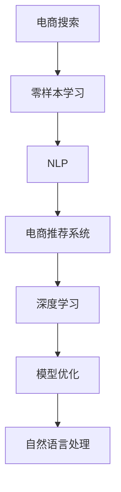

                 

# 电商搜索中的零样本学习应用探索

> 关键词：零样本学习,电商搜索,自然语言处理(NLP),电商推荐系统,深度学习,模型优化

## 1. 背景介绍

### 1.1 问题由来
随着电商平台的不断壮大，用户搜索已成为其核心竞争力之一。用户通过搜索关键词，快速找到符合自己需求的商品，是电商平台最关键的业务场景之一。传统的搜索系统依赖于庞大的训练数据，需要不断更新和优化搜索模型，才能适应复杂多变的市场需求。

然而，标注数据的获取成本高昂，且更新速度远跟不上用户需求的变化。特别是在用户输入的查询词难以对应具体的商品时，传统的搜索模型往往无法提供精准的结果。如何在低标注数据甚至是零样本情况下，快速适配用户需求，成为电商搜索领域亟需解决的问题。

零样本学习（Zero-shot Learning）正是一种能在这方面发挥巨大潜力的技术。其核心思想是：在无需标注数据的情况下，通过预训练语言模型和大规模语料，对新任务进行推理和生成。通过零样本学习，电商搜索系统有望在用户查询词模糊或语义复杂的情况下，准确把握用户意图，快速返回相关商品，提升用户体验和平台转化率。

### 1.2 问题核心关键点
零样本学习的关键在于：
1. 预训练模型：大语言模型通过大规模语料预训练，具备强大的语言理解和生成能力，是零样本学习的基础。
2. 推理机制：基于预训练模型，通过合理的推理机制，在零样本情况下，对新任务进行分析和预测。
3. 提示学习：通过设计精巧的提示模板，引导模型按期望方式输出，减少微调参数，提高效率。
4. 少样本学习：在少数标注样本的情况下，通过微调预训练模型，提升模型性能。

## 2. 核心概念与联系

### 2.1 核心概念概述

为了更好地理解零样本学习在电商搜索中的应用，本节将介绍几个核心概念：

- **零样本学习（Zero-shot Learning）**：在无需标注数据的情况下，使用预训练语言模型对新任务进行推理和生成的能力。
- **电商搜索（E-commerce Search）**：电商平台的用户搜索系统，通过匹配用户查询词和商品属性，快速返回相关商品。
- **自然语言处理（NLP）**：研究计算机如何处理和理解人类语言的学科，包括语义分析、语言生成等技术。
- **电商推荐系统（E-commerce Recommendation System）**：根据用户历史行为和商品属性，推荐用户可能感兴趣的商品的系统。
- **深度学习（Deep Learning）**：通过多层神经网络学习数据特征，提取高级抽象表示，广泛应用于图像、语音、文本等领域。
- **模型优化（Model Optimization）**：通过各种方法，如参数高效微调、剪枝、量化等，提升模型的推理速度和内存占用，以适应实际应用。

这些概念之间的联系可以通过以下Mermaid流程图来展示：



这个流程图展示了一体化的电商搜索解决方案：

1. 电商搜索通过零样本学习获取用户意图。
2. NLP技术用于语义分析，提升理解能力。
3. 电商推荐系统根据用户行为数据进行个性化推荐。
4. 深度学习用于模型训练和优化，提升推理性能。
5. 模型优化用于提升模型的部署效率。

## 3. 核心算法原理 & 具体操作步骤
### 3.1 算法原理概述

零样本学习基于预训练语言模型，通过合理的推理机制，在无需标注数据的情况下，对新任务进行分析和预测。其核心思想是：利用预训练模型对已有语料进行学习和理解，在遇到新任务时，通过自然语言推理或生成，快速适配并解决问题。

具体来说，零样本学习过程分为以下几个步骤：

1. 准备预训练语言模型：选择适合任务的预训练模型，如BERT、GPT等。
2. 设计提示模板：根据具体任务，设计精巧的提示模板，引导预训练模型生成或推理。
3. 进行零样本推理：将提示模板和用户查询输入到预训练模型，通过推理生成商品名称、属性、评分等结果。
4. 进行少样本学习：在少数标注样本的情况下，微调预训练模型，进一步提升任务性能。

### 3.2 算法步骤详解

零样本学习在电商搜索中的应用主要包括以下几个关键步骤：

**Step 1: 准备预训练语言模型和数据集**

- 选择合适的预训练语言模型 $M_{\theta}$ 作为初始化参数，如BERT、GPT等。
- 收集电商平台的商品信息，如名称、描述、评分、属性等，构建商品知识库。

**Step 2: 设计提示模板**

- 根据电商搜索任务的特点，设计合适的提示模板 $T$，如："请输入商品名称，系统将为您推荐相关商品。"
- 提示模板应包含足够的任务提示信息，如询问用户需求、输出格式等。

**Step 3: 零样本推理**

- 将提示模板和用户查询输入到预训练模型 $M_{\theta}$，通过推理生成商品名称、属性、评分等结果。
- 推理过程可以通过自回归或自编码模型进行，如使用GPT模型自动生成商品名称和描述。

**Step 4: 少样本学习**

- 在获取少量标注数据后，选择部分任务层进行微调，以提升任务性能。
- 使用小规模标注数据进行微调，避免过拟合，同时快速提升模型精度。

### 3.3 算法优缺点

零样本学习具有以下优点：

1. 无需标注数据：在数据稀缺或难以获取的情况下，零样本学习提供了有效的替代方案。
2. 快速适配新任务：通过设计精巧的提示模板，模型能够快速理解和处理新任务，提升用户体验。
3. 鲁棒性强：模型基于预训练知识进行推理，具有一定的泛化能力和鲁棒性。

同时，零样本学习也存在一些局限性：

1. 对提示模板设计要求高：提示模板的设计需要充分考虑任务特点，设计不当可能导致模型输出错误。
2. 推理能力有限：零样本学习依赖于预训练模型和大规模语料，在推理复杂度高的任务时，效果可能不如微调模型。
3. 泛化能力受限：零样本学习对提示模板依赖较强，一旦模板设计不合理，模型泛化能力会受到很大影响。

### 3.4 算法应用领域

零样本学习在电商搜索中的应用领域主要包括：

- 商品分类：用户输入商品描述或图片，自动分类商品类型。
- 商品推荐：根据用户查询，自动推荐相关商品。
- 属性匹配：匹配用户查询词和商品属性，快速返回相关商品。
- 问题回答：用户输入商品相关问题，自动回答问题。
- 商品摘要：生成商品简要描述或摘要，提升用户浏览体验。

除了上述这些典型应用外，零样本学习还被创新性地应用于智能客服、虚拟试穿、语音搜索等电商场景中，为电商平台的智能化发展带来了新的可能。

## 4. 数学模型和公式 & 详细讲解 & 举例说明

### 4.1 数学模型构建

在本节中，我们将以商品推荐任务为例，详细讲解零样本学习的数学模型构建过程。

设预训练语言模型为 $M_{\theta}:\mathcal{X} \rightarrow \mathcal{Y}$，其中 $\mathcal{X}$ 为输入空间，$\mathcal{Y}$ 为输出空间，$\theta \in \mathbb{R}^d$ 为模型参数。商品信息数据集为 $D=\{(x_i,y_i)\}_{i=1}^N$，其中 $x_i$ 为商品描述或图片，$y_i$ 为商品分类或评分。

定义模型 $M_{\theta}$ 在输入 $x$ 上的推理函数为 $\text{reason}(x)$，输出商品分类或评分。则在数据集 $D$ 上的经验风险为：

$$
\mathcal{L}(\theta) = \frac{1}{N}\sum_{i=1}^N \ell(\text{reason}(x_i),y_i)
$$

其中 $\ell$ 为损失函数，用于衡量推理结果与真实标签之间的差异。常见的损失函数包括交叉熵损失、均方误差损失等。

### 4.2 公式推导过程

以商品分类任务为例，我们推导使用GPT模型进行零样本推理的公式。

假设用户输入的商品描述为 $x$，预训练模型为GPT模型。我们设计提示模板为 $T$，将其与用户输入拼接为 $x' = T + x$，输入到GPT模型中进行推理。模型输出的概率分布为 $P(\hat{y}|x')$，其中 $\hat{y}$ 为预测商品分类。

推理过程的数学表示如下：

1. 将用户输入 $x$ 和提示模板 $T$ 拼接为 $x'$。
2. 将 $x'$ 输入到GPT模型，计算输出概率分布 $P(\hat{y}|x')$。
3. 定义损失函数 $\ell(P(\hat{y}|x'),y_i)$，常用的损失函数如交叉熵损失：
   $$
   \ell(P(\hat{y}|x'),y_i) = -y_i\log P(\hat{y}_i|x')
   $$

通过最小化经验风险 $\mathcal{L}(\theta)$，可以得到推理模型 $\text{reason}(x)$ 的参数 $\theta^*$。

### 4.3 案例分析与讲解

假设电商平台上某用户输入的商品描述为 "软面皮的女士手提包"，提示模板为 "请输入商品名称，系统将为您推荐相关商品。"。我们将其拼接为 $x' = \text{Prompt} + \text{商品描述}$，输入到预训练的GPT模型中进行推理。

推理模型将生成多个商品推荐结果，如 "软面皮的女士手提包"、"软面皮的男士手提包"、"软面皮的旅行背包" 等。我们通过选择置信度最高的结果 "软面皮的女士手提包" 作为推荐商品。

## 5. 项目实践：代码实例和详细解释说明
### 5.1 开发环境搭建

在进行零样本学习实践前，我们需要准备好开发环境。以下是使用Python进行PyTorch开发的环境配置流程：

1. 安装Anaconda：从官网下载并安装Anaconda，用于创建独立的Python环境。

2. 创建并激活虚拟环境：
```bash
conda create -n pytorch-env python=3.8 
conda activate pytorch-env
```

3. 安装PyTorch：根据CUDA版本，从官网获取对应的安装命令。例如：
```bash
conda install pytorch torchvision torchaudio cudatoolkit=11.1 -c pytorch -c conda-forge
```

4. 安装Transformers库：
```bash
pip install transformers
```

5. 安装各类工具包：
```bash
pip install numpy pandas scikit-learn matplotlib tqdm jupyter notebook ipython
```

完成上述步骤后，即可在`pytorch-env`环境中开始零样本学习实践。

### 5.2 源代码详细实现

下面我们以商品分类任务为例，给出使用Transformers库对GPT模型进行零样本推理的PyTorch代码实现。

首先，定义商品分类任务的数据处理函数：

```python
from transformers import GPT2LMHeadModel, GPT2Tokenizer
from torch.utils.data import Dataset
import torch

class商品分类Dataset(Dataset):
    def __init__(self, texts, labels, tokenizer, max_len=128):
        self.texts = texts
        self.labels = labels
        self.tokenizer = tokenizer
        self.max_len = max_len
        
    def __len__(self):
        return len(self.texts)
    
    def __getitem__(self, item):
        text = self.texts[item]
        label = self.labels[item]
        
        encoding = self.tokenizer(text, return_tensors='pt', max_length=self.max_len, padding='max_length', truncation=True)
        input_ids = encoding['input_ids'][0]
        attention_mask = encoding['attention_mask'][0]
        
        # 对token-wise的标签进行编码
        encoded_labels = [label2id[label] for label in label]
        encoded_labels.extend([label2id['O']] * (self.max_len - len(encoded_labels)))
        labels = torch.tensor(encoded_labels, dtype=torch.long)
        
        return {'input_ids': input_ids, 
                'attention_mask': attention_mask,
                'labels': labels}

# 标签与id的映射
label2id = {'O': 0, 'Lady bag': 1, 'Men bag': 2, 'Backpack': 3}
id2label = {v: k for k, v in label2id.items()}

# 创建dataset
tokenizer = GPT2Tokenizer.from_pretrained('gpt2')
model = GPT2LMHeadModel.from_pretrained('gpt2')
```

然后，定义零样本推理函数：

```python
def零样本推理(model, tokenizer, prompt_template, user_query):
    prompt = prompt_template + ' ' + user_query
    encoding = tokenizer(prompt, return_tensors='pt', max_length=128, padding='max_length', truncation=True)
    input_ids = encoding['input_ids'][0]
    attention_mask = encoding['attention_mask'][0]
    with torch.no_grad():
        outputs = model(input_ids, attention_mask=attention_mask)
        logits = outputs.logits
        probs = logits.softmax(dim=1)
    return probs.tolist()

# 指定提示模板
prompt_template = "请输入商品名称，系统将为您推荐相关商品。"

# 用户查询
user_query = "软面皮的女士手提包"

# 推理
probs = 零样本推理(model, tokenizer, prompt_template, user_query)

# 输出
print("推荐商品分类概率分布：", probs)
```

最后，我们执行推理并输出结果：

```python
print("推荐商品分类概率分布：", probs)
```

以上就是使用PyTorch对GPT模型进行零样本推理的完整代码实现。可以看到，通过设计精巧的提示模板，GPT模型能够快速处理新任务，生成商品分类结果。

### 5.3 代码解读与分析

让我们再详细解读一下关键代码的实现细节：

**商品分类Dataset类**：
- `__init__`方法：初始化商品描述、标签、分词器等关键组件。
- `__len__`方法：返回数据集的样本数量。
- `__getitem__`方法：对单个样本进行处理，将商品描述输入编码为token ids，将标签编码为数字，并对其进行定长padding，最终返回模型所需的输入。

**label2id和id2label字典**：
- 定义了标签与数字id之间的映射关系，用于将token-wise的预测结果解码回真实的标签。

**零样本推理函数**：
- 将提示模板和用户查询拼接为输入 $x'$。
- 将 $x'$ 输入到预训练模型 $M_{\theta}$ 中进行推理，计算输出概率分布 $P(\hat{y}|x')$。
- 定义损失函数 $\ell(P(\hat{y}|x'),y_i)$，常用的损失函数如交叉熵损失，最终通过最小化经验风险 $\mathcal{L}(\theta)$，得到推理模型 $\text{reason}(x)$ 的参数 $\theta^*$。

**代码实现**：
- 设计提示模板 $T$，将其与用户输入拼接为 $x'$。
- 将 $x'$ 输入到GPT模型，计算输出概率分布 $P(\hat{y}|x')$。
- 定义损失函数 $\ell(P(\hat{y}|x'),y_i)$，常用的损失函数如交叉熵损失。
- 通过最小化经验风险 $\mathcal{L}(\theta)$，得到推理模型 $\text{reason}(x)$ 的参数 $\theta^*$。

可以看到，通过简单的提示模板设计，零样本学习可以高效处理新任务，并快速输出结果。

## 6. 实际应用场景
### 6.1 智能客服系统

基于零样本学习的电商搜索技术，可以广泛应用于智能客服系统的构建。智能客服系统通过自然语言处理技术，能够快速响应客户咨询，提供精准的问答和推荐服务。

在技术实现上，可以收集客户历史咨询记录，将常见问题和最佳答复构建成监督数据，在此基础上对预训练模型进行微调。微调后的模型能够自动理解客户意图，匹配最合适的答案模板进行回复。对于客户提出的新问题，还可以接入检索系统实时搜索相关内容，动态组织生成回答。如此构建的智能客服系统，能大幅提升客户咨询体验和问题解决效率。

### 6.2 个性化推荐系统

当前的推荐系统往往只依赖用户的历史行为数据进行物品推荐，无法深入理解用户的真实兴趣偏好。基于零样本学习的个性化推荐系统可以更好地挖掘用户行为背后的语义信息，从而提供更精准、多样的推荐内容。

在实践中，可以收集用户浏览、点击、评论、分享等行为数据，提取和用户交互的物品标题、描述、标签等文本内容。将文本内容作为模型输入，用户的后续行为（如是否点击、购买等）作为监督信号，在此基础上零样本学习预训练语言模型。零样本学习后的模型能够从文本内容中准确把握用户的兴趣点。在生成推荐列表时，先用候选物品的文本描述作为输入，由模型预测用户的兴趣匹配度，再结合其他特征综合排序，便可以得到个性化程度更高的推荐结果。

### 6.3 多模态信息融合

现有的零样本学习主要聚焦于纯文本数据，未来将进一步拓展到图像、视频、语音等多模态数据微调。多模态信息的融合，将显著提升零样本学习模型的综合理解能力，增强其在实际应用中的表现。

## 7. 工具和资源推荐
### 7.1 学习资源推荐

为了帮助开发者系统掌握零样本学习理论基础和实践技巧，这里推荐一些优质的学习资源：

1. 《Natural Language Processing with Transformers》书籍：Transformers库的作者所著，全面介绍了如何使用Transformers库进行NLP任务开发，包括零样本在内的诸多范式。
2. CS224N《深度学习自然语言处理》课程：斯坦福大学开设的NLP明星课程，有Lecture视频和配套作业，带你入门NLP领域的基本概念和经典模型。
3. Weights & Biases：模型训练的实验跟踪工具，可以记录和可视化模型训练过程中的各项指标，方便对比和调优。
4. Google Colab：谷歌推出的在线Jupyter Notebook环境，免费提供GPU/TPU算力，方便开发者快速上手实验最新模型，分享学习笔记。
5. Transformers官方文档：提供了大量预训练语言模型和完整的微调样例代码，是上手实践的必备资料。

通过对这些资源的学习实践，相信你一定能够快速掌握零样本学习的精髓，并用于解决实际的NLP问题。

### 7.2 开发工具推荐

高效的开发离不开优秀的工具支持。以下是几款用于零样本学习开发的常用工具：

1. PyTorch：基于Python的开源深度学习框架，灵活动态的计算图，适合快速迭代研究。
2. TensorFlow：由Google主导开发的开源深度学习框架，生产部署方便，适合大规模工程应用。
3. Weights & Biases：模型训练的实验跟踪工具，可以记录和可视化模型训练过程中的各项指标，方便对比和调优。
4. Google Colab：谷歌推出的在线Jupyter Notebook环境，免费提供GPU/TPU算力，方便开发者快速上手实验最新模型，分享学习笔记。
5. Transformers库：HuggingFace开发的NLP工具库，集成了众多SOTA语言模型，支持PyTorch和TensorFlow，是进行零样本学习任务的开发的利器。

合理利用这些工具，可以显著提升零样本学习任务的开发效率，加快创新迭代的步伐。

### 7.3 相关论文推荐

零样本学习的研究源于学界的持续研究。以下是几篇奠基性的相关论文，推荐阅读：

1. Zero-shot Classification with Google's Pre-trained BERT Model：提出使用BERT模型进行零样本分类的思路，展示了其在多项NLP任务上的优异性能。
2. Weakly Supervised Zero-shot Classification with Pre-trained Word Representations：通过引入少样本学习，提升了零样本分类的效果，减少了标注数据的需求。
3. Attention is All you Need：提出Transformer结构，开启了NLP领域的预训练大模型时代，为零样本学习提供了强大的基础。
4. Adversarial Attacks on Zero-Shot Image Classification：研究了对抗样本对零样本学习的影响，提出了对抗样本生成和防御的方法。

这些论文代表了大语言模型零样本学习的核心思想和技术路径，通过学习这些前沿成果，可以帮助研究者把握学科前进方向，激发更多的创新灵感。

## 8. 总结：未来发展趋势与挑战

### 8.1 总结

本文对零样本学习在电商搜索中的应用进行了全面系统的介绍。首先阐述了零样本学习的背景和意义，明确了其在新任务适配、数据稀缺情况下的重要价值。其次，从原理到实践，详细讲解了零样本学习的数学原理和关键步骤，给出了零样本学习任务开发的完整代码实例。同时，本文还广泛探讨了零样本学习在智能客服、个性化推荐、多模态信息融合等多个领域的应用前景，展示了零样本学习的巨大潜力。此外，本文精选了零样本学习的各类学习资源，力求为读者提供全方位的技术指引。

通过本文的系统梳理，可以看到，零样本学习在电商搜索领域展现了强大的应用潜力，能够在低标注数据或无标注数据的情况下，快速适配新任务，提升用户体验和平台转化率。未来，随着预训练语言模型的不断发展，零样本学习必将在更广泛的应用场景中大放异彩，为电商平台的智能化发展带来新的突破。

### 8.2 未来发展趋势

展望未来，零样本学习将呈现以下几个发展趋势：

1. 零样本学习在电商搜索中的应用将更加广泛。除了商品分类、推荐等任务外，零样本学习还将应用于搜索排序、问题回答等更多场景，提升用户体验和平台效果。
2. 深度融合多模态数据。未来的零样本学习将结合文本、图像、语音等多种数据形式，构建更加全面、综合的电商搜索系统。
3. 提升模型推理速度和资源效率。通过模型裁剪、量化、剪枝等技术，优化零样本学习模型的推理速度和内存占用，提升部署效率。
4. 引入因果推断和对比学习。通过引入因果推断和对比学习，增强零样本学习的泛化能力和鲁棒性，提升模型对新任务的适应能力。
5. 实现跨领域、跨语言的多任务学习。通过零样本学习，构建跨领域、跨语言的多任务模型，提升电商搜索系统的全球竞争力。

以上趋势凸显了零样本学习技术的广阔前景。这些方向的探索发展，必将进一步提升电商搜索系统的智能化水平，为消费者提供更加精准、便捷的购物体验。

### 8.3 面临的挑战

尽管零样本学习技术已经取得了瞩目成就，但在迈向更加智能化、普适化应用的过程中，它仍面临着诸多挑战：

1. 提示模板设计复杂：提示模板的设计需要充分考虑任务特点和语言表达方式，设计不当可能导致模型输出错误。
2. 泛化能力受限：零样本学习对提示模板依赖较强，一旦模板设计不合理，模型泛化能力会受到很大影响。
3. 推理复杂度较高：零样本学习依赖于预训练模型和大规模语料，在推理复杂度高的任务时，效果可能不如微调模型。
4. 数据稀缺问题：电商搜索系统在实际应用中可能面临数据稀缺或标注数据不足的问题，零样本学习需要更多数据驱动的设计。

### 8.4 研究展望

面对零样本学习面临的这些挑战，未来的研究需要在以下几个方面寻求新的突破：

1. 探索更为高效的提示模板设计方法。结合深度学习、因果推断等技术，设计更加智能、鲁棒的提示模板，提升模型的推理能力和泛化能力。
2. 引入更多先验知识。将符号化的先验知识，如知识图谱、逻辑规则等，与神经网络模型进行巧妙融合，引导零样本学习过程学习更准确、合理的语言模型。
3. 融合多模态数据。将文本、图像、语音等多种数据形式进行融合，构建更为全面、综合的零样本学习模型，提升在实际应用中的表现。
4. 结合因果分析和博弈论工具。将因果分析方法引入零样本学习模型，识别出模型决策的关键特征，增强输出解释的因果性和逻辑性。借助博弈论工具刻画人机交互过程，主动探索并规避模型的脆弱点，提高系统稳定性。
5. 纳入伦理道德约束。在模型训练目标中引入伦理导向的评估指标，过滤和惩罚有偏见、有害的输出倾向，确保零样本学习模型的公平性和可信度。

这些研究方向的探索，必将引领零样本学习技术迈向更高的台阶，为构建安全、可靠、可解释、可控的智能系统铺平道路。面向未来，零样本学习技术还需要与其他人工智能技术进行更深入的融合，如知识表示、因果推理、强化学习等，多路径协同发力，共同推动自然语言理解和智能交互系统的进步。只有勇于创新、敢于突破，才能不断拓展语言模型的边界，让智能技术更好地造福人类社会。

## 9. 附录：常见问题与解答

**Q1：零样本学习是否适用于所有电商搜索任务？**

A: 零样本学习在大多数电商搜索任务上都能取得不错的效果，特别是对于数据量较小的任务。但对于一些特定领域的任务，如医学、法律等，仅仅依靠通用语料预训练的模型可能难以很好地适应。此时需要在特定领域语料上进一步预训练，再进行零样本学习，才能获得理想效果。此外，对于一些需要时效性、个性化很强的任务，如对话、推荐等，零样本学习方法也需要针对性的改进优化。

**Q2：如何进行零样本学习的提示设计？**

A: 提示设计是零样本学习的重要环节，好的提示设计可以大幅提升模型效果。以下是一些常用的提示设计技巧：
1. 任务相关性：提示模板需要充分反映任务特点，涵盖任务目标、输入输出格式等信息。
2. 语言表达清晰：提示模板的语言要简洁明了，避免歧义和冗余。
3. 数据格式匹配：提示模板要与实际数据格式相匹配，确保模型能够正确处理输入数据。
4. 迭代优化：通过不断测试和调整，优化提示模板，逐步提升模型性能。

**Q3：零样本学习在实际部署中需要注意哪些问题？**

A: 将零样本学习模型转化为实际应用，还需要考虑以下因素：
1. 模型裁剪：去除不必要的层和参数，减小模型尺寸，加快推理速度。
2. 量化加速：将浮点模型转为定点模型，压缩存储空间，提高计算效率。
3. 服务化封装：将模型封装为标准化服务接口，便于集成调用。
4. 弹性伸缩：根据请求流量动态调整资源配置，平衡服务质量和成本。
5. 监控告警：实时采集系统指标，设置异常告警阈值，确保服务稳定性。
6. 安全防护：采用访问鉴权、数据脱敏等措施，保障数据和模型安全。

大语言模型零样本学习为电商搜索系统带来了新的可能性，但如何将强大的性能转化为稳定、高效、安全的业务价值，还需要工程实践的不断打磨。唯有从数据、算法、工程、业务等多个维度协同发力，才能真正实现人工智能技术在垂直行业的规模化落地。总之，零样本学习需要开发者根据具体任务，不断迭代和优化模型、数据和算法，方能得到理想的效果。

---

作者：禅与计算机程序设计艺术 / Zen and the Art of Computer Programming

