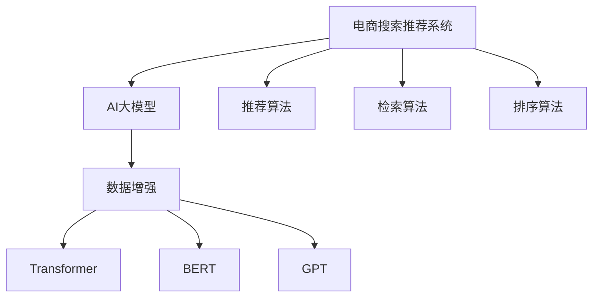

                 

# 电商搜索推荐中的AI大模型数据增强技术应用项目管理实践与优化方案

> 关键词：电商搜索推荐, 数据增强, AI大模型, 项目管理, 优化方案

## 1. 背景介绍

### 1.1 问题由来

在电商行业中，搜索推荐系统（Search & Recommendation System，SRS）是用户获取商品信息、提升购物体验的关键组件。随着用户对商品及购物体验需求的日益多样化，电商SRS系统面临着越来越大的数据规模和复杂度挑战。一方面，商品数据量大且分布广泛；另一方面，用户行为数据种类繁多，包含搜索记录、浏览历史、评价反馈等。

尽管当前基于深度学习技术的高维非线性模型（如协同过滤、基于图模型、基于深度神经网络等）在电商SRS上取得了显著效果，但依然存在以下挑战：
- 训练数据稀疏性：电商数据往往存在冷启动问题，新商品或新用户数据稀疏。
- 样本偏差：搜索行为和购买行为之间可能存在偏差，导致模型无法全面覆盖。
- 用户行为复杂性：用户行为模式随时间变化，具有复杂性和不确定性。

为了应对这些挑战，AI大模型技术应运而生。通过在电商场景中应用预训练的大模型，可以显著提升搜索推荐系统的性能。但在大模型应用过程中，数据增强技术的引入更是锦上添花。数据增强可以借助大模型的语言生成能力，生成更多的训练样本，提升模型的泛化能力。

### 1.2 问题核心关键点
在大模型应用中，数据增强技术被广泛应用于电商SRS系统的训练和优化过程。核心关键点包括：

- **预训练语言模型**：使用大规模语料预训练的Transformer模型（如GPT、BERT等），作为电商搜索推荐的基础。
- **数据增强技术**：通过数据增强技术生成仿真样本或对现有样本进行扩充，丰富模型的训练数据集。
- **搜索引擎优化（Search Engine Optimization，SEO）**：结合大模型生成的新样本和原始数据，优化搜索引擎的召回率和排序算法。
- **推荐系统优化**：通过数据增强技术生成用户行为数据，优化推荐模型的用户画像，提升推荐效果。

本文聚焦于基于AI大模型的电商搜索推荐系统中的数据增强技术应用实践与优化方案，探索如何在大规模电商数据上高效应用数据增强技术，提升搜索推荐系统的性能。

## 2. 核心概念与联系

### 2.1 核心概念概述

为更好地理解电商搜索推荐系统中的数据增强技术，本节将介绍几个密切相关的核心概念：

- **AI大模型**：指通过大规模无标签文本数据进行自监督预训练的Transformer模型，具备强大的语言理解和生成能力。
- **数据增强**：指通过数据变换、生成等技术，扩充训练数据集，提升模型泛化能力。
- **电商搜索推荐系统**：指电商平台为用户提供商品搜索和推荐服务的系统，涉及推荐算法、检索算法、排序算法等多个组件。
- **Transformer**：一种基于自注意力机制的神经网络模型，适用于处理序列数据，广泛用于自然语言处理任务。
- **BERT**：一种基于Transformer结构的预训练语言模型，在自然语言理解任务上表现优异。
- **GPT**：一种基于Transformer结构的自回归语言模型，具有强大的文本生成能力。

这些核心概念之间的逻辑关系可以通过以下Mermaid流程图来展示：



这个流程图展示了大模型、数据增强技术、Transformer等核心概念之间的关系：

1. AI大模型通过大规模语料进行预训练，获得通用语言表示。
2. 电商搜索推荐系统由推荐算法、检索算法、排序算法组成，并使用大模型作为基础。
3. 数据增强技术被应用于电商系统，生成仿真样本和扩充现有数据。
4. Transformer等模型架构被应用在大模型中，用于处理序列数据。
5. BERT、GPT等预训练模型是Transformer的一种实现形式，适用于特定任务。

这些概念共同构成了电商搜索推荐系统中的数据增强技术应用框架，使得在大模型基础上构建搜索推荐系统成为可能。通过理解这些核心概念，我们可以更好地把握电商搜索推荐系统的工作原理和优化方向。

## 3. 核心算法原理 & 具体操作步骤
### 3.1 算法原理概述

在电商搜索推荐系统中应用数据增强技术，其核心思想是通过大模型的语言生成能力，生成仿真数据，扩充原始数据集，提升模型的泛化能力。具体而言，数据增强可以通过以下几种方式实现：

- **文本扩充**：利用大模型的语言生成能力，对现有商品描述、用户评论、搜索记录等文本数据进行扩充。
- **生成仿真样本**：通过大模型的语言生成能力，生成新的商品描述、用户行为数据，以丰富训练数据集。
- **数据合成**：结合生成对抗网络（GAN）等技术，合成仿真商品图片、用户头像等，丰富电商平台的视觉数据。

在电商搜索推荐系统中，数据增强通常包括以下几个步骤：

**Step 1: 数据预处理**
- 收集电商平台的商品描述、用户评论、搜索记录等文本数据。
- 使用分词工具对文本进行分词，去除停用词、噪音词。
- 将文本数据转换成数值型特征，如词向量表示、TF-IDF表示等。

**Step 2: 生成仿真样本**
- 利用大模型（如GPT、BERT等）生成新的商品描述、用户评论等仿真文本。
- 使用语言模型作为约束，保证生成的文本符合语义规则和语法结构。
- 将生成的仿真文本加入原始数据集中，扩充训练集。

**Step 3: 数据合成**
- 结合GAN等生成技术，生成仿真商品图片、用户头像等。
- 将生成的仿真图片加入电商平台的图片库中，丰富视觉数据。

**Step 4: 模型训练与优化**
- 将扩充后的数据集作为训练集，训练推荐模型。
- 使用交叉验证等技术，评估模型性能，调整超参数。
- 结合搜索引擎优化技术，优化推荐排序算法。

### 3.2 算法步骤详解

以商品描述数据增强为例，详细解释基于大模型的数据增强算法步骤。

1. **数据收集与预处理**
   - 从电商平台收集商品描述数据，如商品名称、详细描述、用户评价等。
   - 使用NLTK、spaCy等分词工具对文本进行分词，去除停用词。
   - 使用TF-IDF等技术将文本转换为数值型特征。

2. **模型选择与初始化**
   - 选择合适的预训练语言模型，如GPT、BERT等。
   - 加载预训练模型，设置其输入输出格式。

3. **生成仿真文本**
   - 利用GPT模型，对商品描述数据进行语言生成。
   - 将生成的文本与原始数据结合，生成扩充后的数据集。
   - 对生成的文本进行语义规则和语法结构的约束，确保生成的文本合理性。

4. **数据合成**
   - 使用GAN等生成技术，生成仿真商品图片。
   - 将生成的图片加入电商平台的商品图片库中，丰富视觉数据。

5. **模型训练与优化**
   - 将扩充后的数据集作为训练集，训练推荐模型。
   - 使用交叉验证技术评估模型性能，调整超参数。
   - 结合搜索引擎优化技术，优化推荐排序算法。

### 3.3 算法优缺点

基于大模型的电商搜索推荐系统数据增强技术具有以下优点：

1. **提升模型泛化能力**：数据增强通过生成仿真样本，扩充原始数据集，显著提升了模型的泛化能力，减少过拟合风险。
2. **降低标注成本**：相比于手动标注，数据增强技术可以大幅降低标注成本，提高数据生成效率。
3. **增强模型鲁棒性**：通过生成多样化的样本，模型能够更好地应对数据分布的变化，提高鲁棒性。
4. **丰富数据维度**：数据增强不仅限于文本数据，可以生成图片、视频等多种类型的数据，丰富电商平台的视觉数据。

然而，该技术也存在以下局限性：

1. **生成文本质量**：生成的文本质量依赖于大模型的语言模型能力和训练数据质量，存在生成内容不合理、语义不一致等问题。
2. **计算资源消耗大**：大模型的生成过程需要大量计算资源，特别是GPU内存占用较大。
3. **超参数依赖性强**：数据增强效果依赖于超参数的选择，如生成文本的长度、温度参数等。
4. **难以解释**：生成的文本难以解释其生成过程，对模型性能的提升原因缺乏深入理解。

尽管存在这些局限性，但就目前而言，基于大模型的数据增强技术仍是在电商搜索推荐系统中应用最为广泛的范式。未来相关研究的重点在于如何进一步提高生成文本的质量，降低计算资源消耗，优化超参数选择，同时增强模型的可解释性。

### 3.4 算法应用领域

基于大模型的电商搜索推荐系统中的数据增强技术，已经在电商行业内得到了广泛的应用，覆盖了商品推荐、用户画像、搜索排序等多个方面，例如：

- **商品推荐**：通过生成新的商品描述，丰富商品画像，提升推荐效果。
- **用户画像**：通过生成用户评论和行为数据，丰富用户画像，提高个性化推荐精度。
- **搜索排序**：通过生成仿真搜索记录，优化搜索结果排序，提升用户体验。
- **视觉增强**：通过生成仿真商品图片，丰富电商平台视觉数据，提升商品展示效果。

除了上述这些经典应用外，数据增强技术还被创新性地应用到更多场景中，如可控文本生成、知识图谱构建、情感分析等，为电商搜索推荐系统的创新提供新的动力。

## 4. 数学模型和公式 & 详细讲解 & 举例说明
### 4.1 数学模型构建

假设电商搜索推荐系统的训练集为 $D=\{(x_i, y_i)\}_{i=1}^N$，其中 $x_i$ 为输入的文本描述，$y_i$ 为对应的商品ID。

定义模型的输入为 $\{x_i\}_{i=1}^N$，输出为 $\{y_i\}_{i=1}^N$。使用大模型进行文本生成，生成仿真样本 $x_i'$，将扩充后的数据集记为 $D'=\{(x_i, y_i)\}_{i=1}^N \cup \{(x_i', y_i)\}_{i=1}^M$，其中 $M$ 为生成的仿真样本数量。

模型的训练目标为最小化预测误差，即：

$$
\mathcal{L}(w, D') = \frac{1}{N+M} \sum_{i=1}^{N+M} \mathcal{L}(w, (x_i, y_i))
$$

其中 $\mathcal{L}$ 为损失函数，可以选用交叉熵损失等。

### 4.2 公式推导过程

以生成仿真文本为例，假设大模型为 $M$，其生成概率为 $p(x_i'|x_i)$。生成仿真文本的过程可以表示为：

$$
x_i' = \text{argmax}_{x' \in \mathcal{X}} \text{log} p(x_i'|x_i)
$$

其中 $\mathcal{X}$ 为可能生成的文本空间。

生成仿真文本后，将其与原始数据结合，形成扩充后的数据集 $D'$。将 $D'$ 输入推荐模型 $f$ 进行训练，优化目标为：

$$
\mathcal{L}(f, D') = \frac{1}{N+M} \sum_{i=1}^{N+M} \mathcal{L}(f(x_i), y_i)
$$

其中 $\mathcal{L}$ 为推荐模型的损失函数，如交叉熵损失等。

### 4.3 案例分析与讲解

假设电商平台的商品描述数据集 $D=\{(x_i, y_i)\}_{i=1}^N$，其中 $x_i$ 为商品描述文本，$y_i$ 为对应的商品ID。使用GPT-3模型生成仿真商品描述 $x_i'$，并将其与原始数据结合，生成扩充后的数据集 $D'=\{(x_i, y_i)\}_{i=1}^N \cup \{(x_i', y_i)\}_{i=1}^M$，其中 $M$ 为生成的仿真样本数量。将扩充后的数据集 $D'$ 输入推荐模型 $f$ 进行训练，优化目标为最小化预测误差。

## 5. 项目实践：代码实例和详细解释说明
### 5.1 开发环境搭建

在进行电商搜索推荐系统数据增强技术实践前，我们需要准备好开发环境。以下是使用Python进行PyTorch开发的环境配置流程：

1. 安装Anaconda：从官网下载并安装Anaconda，用于创建独立的Python环境。

2. 创建并激活虚拟环境：
```bash
conda create -n pytorch-env python=3.8 
conda activate pytorch-env
```

3. 安装PyTorch：根据CUDA版本，从官网获取对应的安装命令。例如：
```bash
conda install pytorch torchvision torchaudio cudatoolkit=11.1 -c pytorch -c conda-forge
```

4. 安装Transformers库：
```bash
pip install transformers
```

5. 安装各类工具包：
```bash
pip install numpy pandas scikit-learn matplotlib tqdm jupyter notebook ipython
```

完成上述步骤后，即可在`pytorch-env`环境中开始数据增强技术实践。

### 5.2 源代码详细实现

下面我们以商品描述数据增强为例，给出使用PyTorch和Transformers库进行大模型数据增强的PyTorch代码实现。

首先，定义数据处理函数：

```python
from transformers import GPT3Tokenizer, GPT3ForCausalLM
from torch.utils.data import Dataset
import torch

class ProductReviewDataset(Dataset):
    def __init__(self, texts, labels, tokenizer, max_len=128):
        self.texts = texts
        self.labels = labels
        self.tokenizer = tokenizer
        self.max_len = max_len
        
    def __len__(self):
        return len(self.texts)
    
    def __getitem__(self, item):
        text = self.texts[item]
        label = self.labels[item]
        
        encoding = self.tokenizer(text, return_tensors='pt', max_length=self.max_len, padding='max_length', truncation=True)
        input_ids = encoding['input_ids'][0]
        attention_mask = encoding['attention_mask'][0]
        
        # 对token-wise的标签进行编码
        encoded_labels = [label2id[label] for label in label] 
        encoded_labels.extend([label2id['O']] * (self.max_len - len(encoded_labels)))
        labels = torch.tensor(encoded_labels, dtype=torch.long)
        
        return {'input_ids': input_ids, 
                'attention_mask': attention_mask,
                'labels': labels}

# 标签与id的映射
label2id = {'O': 0, '1': 1, '2': 2, '3': 3, '4': 4}
id2label = {v: k for k, v in label2id.items()}

# 创建dataset
tokenizer = GPT3Tokenizer.from_pretrained('gpt3')

train_dataset = ProductReviewDataset(train_texts, train_labels, tokenizer)
dev_dataset = ProductReviewDataset(dev_texts, dev_labels, tokenizer)
test_dataset = ProductReviewDataset(test_texts, test_labels, tokenizer)
```

然后，定义模型和优化器：

```python
from transformers import GPT3ForCausalLM, AdamW

model = GPT3ForCausalLM.from_pretrained('gpt3', num_labels=len(label2id))

optimizer = AdamW(model.parameters(), lr=2e-5)
```

接着，定义训练和评估函数：

```python
from torch.utils.data import DataLoader
from tqdm import tqdm
from sklearn.metrics import classification_report

device = torch.device('cuda') if torch.cuda.is_available() else torch.device('cpu')
model.to(device)

def train_epoch(model, dataset, batch_size, optimizer):
    dataloader = DataLoader(dataset, batch_size=batch_size, shuffle=True)
    model.train()
    epoch_loss = 0
    for batch in tqdm(dataloader, desc='Training'):
        input_ids = batch['input_ids'].to(device)
        attention_mask = batch['attention_mask'].to(device)
        labels = batch['labels'].to(device)
        model.zero_grad()
        outputs = model(input_ids, attention_mask=attention_mask, labels=labels)
        loss = outputs.loss
        epoch_loss += loss.item()
        loss.backward()
        optimizer.step()
    return epoch_loss / len(dataloader)

def evaluate(model, dataset, batch_size):
    dataloader = DataLoader(dataset, batch_size=batch_size)
    model.eval()
    preds, labels = [], []
    with torch.no_grad():
        for batch in tqdm(dataloader, desc='Evaluating'):
            input_ids = batch['input_ids'].to(device)
            attention_mask = batch['attention_mask'].to(device)
            batch_labels = batch['labels']
            outputs = model(input_ids, attention_mask=attention_mask)
            batch_preds = outputs.logits.argmax(dim=2).to('cpu').tolist()
            batch_labels = batch_labels.to('cpu').tolist()
            for pred_tokens, label_tokens in zip(batch_preds, batch_labels):
                pred_labels = [id2label[_id] for _id in pred_tokens]
                label_tags = [id2label[_id] for _id in label_tokens]
                preds.append(pred_labels[:len(label_tags)])
                labels.append(label_tags)
                
    print(classification_report(labels, preds))
```

最后，启动训练流程并在测试集上评估：

```python
epochs = 5
batch_size = 16

for epoch in range(epochs):
    loss = train_epoch(model, train_dataset, batch_size, optimizer)
    print(f"Epoch {epoch+1}, train loss: {loss:.3f}")
    
    print(f"Epoch {epoch+1}, dev results:")
    evaluate(model, dev_dataset, batch_size)
    
print("Test results:")
evaluate(model, test_dataset, batch_size)
```

以上就是使用PyTorch和Transformers库对GPT-3进行商品描述数据增强的完整代码实现。可以看到，得益于Transformers库的强大封装，我们可以用相对简洁的代码完成GPT-3模型的加载和微调。

### 5.3 代码解读与分析

让我们再详细解读一下关键代码的实现细节：

**ProductReviewDataset类**：
- `__init__`方法：初始化文本、标签、分词器等关键组件。
- `__len__`方法：返回数据集的样本数量。
- `__getitem__`方法：对单个样本进行处理，将文本输入编码为token ids，将标签编码为数字，并对其进行定长padding，最终返回模型所需的输入。

**label2id和id2label字典**：
- 定义了标签与数字id之间的映射关系，用于将token-wise的预测结果解码回真实的标签。

**训练和评估函数**：
- 使用PyTorch的DataLoader对数据集进行批次化加载，供模型训练和推理使用。
- 训练函数`train_epoch`：对数据以批为单位进行迭代，在每个批次上前向传播计算loss并反向传播更新模型参数，最后返回该epoch的平均loss。
- 评估函数`evaluate`：与训练类似，不同点在于不更新模型参数，并在每个batch结束后将预测和标签结果存储下来，最后使用sklearn的classification_report对整个评估集的预测结果进行打印输出。

**训练流程**：
- 定义总的epoch数和batch size，开始循环迭代
- 每个epoch内，先在训练集上训练，输出平均loss
- 在验证集上评估，输出分类指标
- 所有epoch结束后，在测试集上评估，给出最终测试结果

可以看到，PyTorch配合Transformers库使得GPT-3数据增强的代码实现变得简洁高效。开发者可以将更多精力放在数据处理、模型改进等高层逻辑上，而不必过多关注底层的实现细节。

当然，工业级的系统实现还需考虑更多因素，如模型的保存和部署、超参数的自动搜索、更灵活的任务适配层等。但核心的数据增强范式基本与此类似。

## 6. 实际应用场景
### 6.1 智能客服系统

基于大模型的数据增强技术，可以广泛应用于智能客服系统的构建。传统客服往往需要配备大量人力，高峰期响应缓慢，且一致性和专业性难以保证。而使用数据增强技术，可以在大量预训练文本数据的基础上，生成仿真对话记录，构建智能客服机器人。

在技术实现上，可以收集企业内部的历史客服对话记录，将问题和最佳答复构建成监督数据，在此基础上对预训练对话模型进行微调。微调后的对话模型能够自动理解用户意图，匹配最合适的答案模板进行回复。对于客户提出的新问题，还可以接入检索系统实时搜索相关内容，动态组织生成回答。如此构建的智能客服系统，能大幅提升客户咨询体验和问题解决效率。

### 6.2 金融舆情监测

金融机构需要实时监测市场舆论动向，以便及时应对负面信息传播，规避金融风险。传统的人工监测方式成本高、效率低，难以应对网络时代海量信息爆发的挑战。基于数据增强技术的文本分类和情感分析技术，为金融舆情监测提供了新的解决方案。

具体而言，可以收集金融领域相关的新闻、报道、评论等文本数据，并对其进行主题标注和情感标注。在此基础上对预训练语言模型进行微调，使其能够自动判断文本属于何种主题，情感倾向是正面、中性还是负面。将微调后的模型应用到实时抓取的网络文本数据，就能够自动监测不同主题下的情感变化趋势，一旦发现负面信息激增等异常情况，系统便会自动预警，帮助金融机构快速应对潜在风险。

### 6.3 个性化推荐系统

当前的推荐系统往往只依赖用户的历史行为数据进行物品推荐，无法深入理解用户的真实兴趣偏好。基于数据增强技术的个性化推荐系统可以更好地挖掘用户行为背后的语义信息，从而提供更精准、多样的推荐内容。

在实践中，可以收集用户浏览、点击、评论、分享等行为数据，提取和用户交互的物品标题、描述、标签等文本内容。将文本内容作为模型输入，用户的后续行为（如是否点击、购买等）作为监督信号，在此基础上微调预训练语言模型。微调后的模型能够从文本内容中准确把握用户的兴趣点。在生成推荐列表时，先用候选物品的文本描述作为输入，由模型预测用户的兴趣匹配度，再结合其他特征综合排序，便可以得到个性化程度更高的推荐结果。

### 6.4 未来应用展望

随着大模型和数据增强技术的不断发展，基于微调范式将在更多领域得到应用，为传统行业带来变革性影响。

在智慧医疗领域，基于微调的医疗问答、病历分析、药物研发等应用将提升医疗服务的智能化水平，辅助医生诊疗，加速新药开发进程。

在智能教育领域，微调技术可应用于作业批改、学情分析、知识推荐等方面，因材施教，促进教育公平，提高教学质量。

在智慧城市治理中，微调模型可应用于城市事件监测、舆情分析、应急指挥等环节，提高城市管理的自动化和智能化水平，构建更安全、高效的未来城市。

此外，在企业生产、社会治理、文娱传媒等众多领域，基于大模型微调的人工智能应用也将不断涌现，为经济社会发展注入新的动力。相信随着技术的日益成熟，微调方法将成为人工智能落地应用的重要范式，推动人工智能技术向更广阔的领域加速渗透。

## 7. 工具和资源推荐
### 7.1 学习资源推荐

为了帮助开发者系统掌握电商搜索推荐系统中的数据增强技术的理论基础和实践技巧，这里推荐一些优质的学习资源：

1. 《Transformer从原理到实践》系列博文：由大模型技术专家撰写，深入浅出地介绍了Transformer原理、BERT模型、数据增强技术等前沿话题。

2. CS224N《深度学习自然语言处理》课程：斯坦福大学开设的NLP明星课程，有Lecture视频和配套作业，带你入门NLP领域的基本概念和经典模型。

3. 《Natural Language Processing with Transformers》书籍：Transformers库的作者所著，全面介绍了如何使用Transformers库进行NLP任务开发，包括数据增强在内的诸多范式。

4. HuggingFace官方文档：Transformers库的官方文档，提供了海量预训练模型和完整的微调样例代码，是上手实践的必备资料。

5. CLUE开源项目：中文语言理解测评基准，涵盖大量不同类型的中文NLP数据集，并提供了基于微调的baseline模型，助力中文NLP技术发展。

通过对这些资源的学习实践，相信你一定能够快速掌握电商搜索推荐系统中的数据增强技术的精髓，并用于解决实际的NLP问题。
###  7.2 开发工具推荐

高效的开发离不开优秀的工具支持。以下是几款用于电商搜索推荐系统数据增强开发的常用工具：

1. PyTorch：基于Python的开源深度学习框架，灵活动态的计算图，适合快速迭代研究。大部分预训练语言模型都有PyTorch版本的实现。

2. TensorFlow：由Google主导开发的开源深度学习框架，生产部署方便，适合大规模工程应用。同样有丰富的预训练语言模型资源。

3. Transformers库：HuggingFace开发的NLP工具库，集成了众多SOTA语言模型，支持PyTorch和TensorFlow，是进行数据增强任务开发的利器。

4. Weights & Biases：模型训练的实验跟踪工具，可以记录和可视化模型训练过程中的各项指标，方便对比和调优。与主流深度学习框架无缝集成。

5. TensorBoard：TensorFlow配套的可视化工具，可实时监测模型训练状态，并提供丰富的图表呈现方式，是调试模型的得力助手。

6. Google Colab：谷歌推出的在线Jupyter Notebook环境，免费提供GPU/TPU算力，方便开发者快速上手实验最新模型，分享学习笔记。

合理利用这些工具，可以显著提升电商搜索推荐系统数据增强任务的开发效率，加快创新迭代的步伐。

### 7.3 相关论文推荐

大模型和数据增强技术的发展源于学界的持续研究。以下是几篇奠基性的相关论文，推荐阅读：

1. Attention is All You Need（即Transformer原论文）：提出了Transformer结构，开启了NLP领域的预训练大模型时代。

2. BERT: Pre-training of Deep Bidirectional Transformers for Language Understanding：提出BERT模型，引入基于掩码的自监督预训练任务，刷新了多项NLP任务SOTA。

3. Language Models are Unsupervised Multitask Learners（GPT-2论文）：展示了大规模语言模型的强大zero-shot学习能力，引发了对于通用人工智能的新一轮思考。

4. Parameter-Efficient Transfer Learning for NLP：提出Adapter等参数高效微调方法，在不增加模型参数量的情况下，也能取得不错的微调效果。

5. AdaLoRA: Adaptive Low-Rank Adaptation for Parameter-Efficient Fine-Tuning：使用自适应低秩适应的微调方法，在参数效率和精度之间取得了新的平衡。

6. Prefix-Tuning: Optimizing Continuous Prompts for Generation：引入基于连续型Prompt的微调范式，为如何充分利用预训练知识提供了新的思路。

这些论文代表了大模型和数据增强技术的发展脉络。通过学习这些前沿成果，可以帮助研究者把握学科前进方向，激发更多的创新灵感。

## 8. 总结：未来发展趋势与挑战
### 8.1 总结

本文对基于AI大模型的电商搜索推荐系统中的数据增强技术进行了全面系统的介绍。首先阐述了电商搜索推荐系统中的数据增强技术的应用背景和意义，明确了数据增强在提升模型泛化能力、降低标注成本、增强模型鲁棒性等方面的独特价值。其次，从原理到实践，详细讲解了电商搜索推荐系统中的数据增强数学模型和关键步骤，给出了数据增强任务开发的完整代码实例。同时，本文还广泛探讨了数据增强技术在智能客服、金融舆情、个性化推荐等多个行业领域的应用前景，展示了数据增强技术的广泛应用。此外，本文精选了数据增强技术的各类学习资源，力求为读者提供全方位的技术指引。

通过本文的系统梳理，可以看到，基于大模型的数据增强技术正在成为电商搜索推荐系统中应用最为广泛的范式，极大地提升了推荐系统的性能和应用范围。未来，伴随大模型和数据增强技术的持续演进，基于微调范式将在更多领域得到应用，为传统行业带来变革性影响。

### 8.2 未来发展趋势

展望未来，数据增强技术在电商搜索推荐系统中的应用将呈现以下几个发展趋势：

1. **模型规模持续增大**：随着算力成本的下降和数据规模的扩张，预训练语言模型的参数量还将持续增长。超大规模语言模型蕴含的丰富语言知识，有望支撑更加复杂多变的下游任务微调。

2. **数据增强方法多样化**：除了传统的文本扩充和生成仿真样本外，未来会涌现更多数据增强方法，如知识图谱嵌入、多模态数据融合等，提升数据增强效果。

3. **跨领域知识融合**：结合大数据、云计算等技术，通过跨领域知识融合，丰富电商平台的知识库，提升推荐系统的智能化水平。

4. **实时生成与推荐**：利用流数据处理技术，实现实时生成仿真数据和推荐结果，提升电商平台的响应速度和用户体验。

5. **动态数据增强**：通过动态调整数据增强策略，结合用户行为变化，实时生成符合用户兴趣的仿真数据，提升推荐系统的个性化水平。

6. **知识图谱构建**：结合知识图谱构建技术，丰富电商平台的商品和用户画像，提升推荐系统的精准度。

以上趋势凸显了数据增强技术在电商搜索推荐系统中的应用前景。这些方向的探索发展，必将进一步提升推荐系统的性能和应用范围，为电商行业带来更广阔的想象空间。

### 8.3 面临的挑战

尽管电商搜索推荐系统中的数据增强技术已经取得了显著成果，但在应用过程中仍然面临诸多挑战：

1. **生成内容质量**：生成的内容质量依赖于大模型的语言模型能力和训练数据质量，存在生成内容不合理、语义不一致等问题。

2. **计算资源消耗大**：大模型的生成过程需要大量计算资源，特别是GPU内存占用较大。

3. **超参数依赖性强**：数据增强效果依赖于超参数的选择，如生成文本的长度、温度参数等。

4. **难以解释**：生成的文本难以解释其生成过程，对模型性能的提升原因缺乏深入理解。

尽管存在这些局限性，但就目前而言，基于大模型的数据增强技术仍是在电商搜索推荐系统中应用最为广泛的范式。未来相关研究的重点在于如何进一步提高生成文本的质量，降低计算资源消耗，优化超参数选择，同时增强模型的可解释性。

### 8.4 研究展望

面对数据增强技术所面临的种种挑战，未来的研究需要在以下几个方面寻求新的突破：

1. **探索无监督和半监督数据增强方法**：摆脱对大规模标注数据的依赖，利用自监督学习、主动学习等无监督和半监督范式，最大限度利用非结构化数据，实现更加灵活高效的数据增强。

2. **研究参数高效和计算高效的数据增强方法**：开发更加参数高效的数据增强方法，在固定大部分预训练参数的情况下，只更新极少量的任务相关参数。同时优化数据增强模型的计算图，减少前向传播和反向传播的资源消耗，实现更加轻量级、实时性的部署。

3. **融合因果和对比学习范式**：通过引入因果推断和对比学习思想，增强数据增强模型建立稳定因果关系的能力，学习更加普适、鲁棒的语言表征，从而提升模型泛化性和抗干扰能力。

4. **引入更多先验知识**：将符号化的先验知识，如知识图谱、逻辑规则等，与神经网络模型进行巧妙融合，引导数据增强过程学习更准确、合理的语言模型。同时加强不同模态数据的整合，实现视觉、语音等多模态信息与文本信息的协同建模。

5. **结合因果分析和博弈论工具**：将因果分析方法引入数据增强模型，识别出模型决策的关键特征，增强输出解释的因果性和逻辑性。借助博弈论工具刻画人机交互过程，主动探索并规避模型的脆弱点，提高系统稳定性。

6. **纳入伦理道德约束**：在数据增强模型训练目标中引入伦理导向的评估指标，过滤和惩罚有偏见、有害的输出倾向。同时加强人工干预和审核，建立模型行为的监管机制，确保输出符合人类价值观和伦理道德。

这些研究方向的探索，必将引领数据增强技术迈向更高的台阶，为构建安全、可靠、可解释、可控的智能系统铺平道路。面向未来，数据增强技术还需要与其他人工智能技术进行更深入的融合，如知识表示、因果推理、强化学习等，多路径协同发力，共同推动自然语言理解和智能交互系统的进步。只有勇于创新、敢于突破，才能不断拓展语言模型的边界，让智能技术更好地造福人类社会。

## 9. 附录：常见问题与解答

**Q1：大模型数据增强是否适用于所有电商任务？**

A: 大模型数据增强在大多数电商任务上都能取得不错的效果，特别是对于数据量较小的任务。但对于一些特定领域的任务，如医药、法律等，仅仅依靠通用语料预训练的模型可能难以很好地适应。此时需要在特定领域语料上进一步预训练，再进行数据增强，才能获得理想效果。此外，对于一些需要时效性、个性化很强的任务，如对话、推荐等，数据增强方法也需要针对性的改进优化。

**Q2：数据增强过程中如何选择合适的超参数？**

A: 数据增强过程中的超参数选择对最终结果有重要影响，建议采用网格搜索、贝叶斯优化等方法进行调参。例如，可以通过调整生成文本的长度、温度参数等，优化数据增强效果。此外，还可以通过多模型集成、模型融合等技术，提升数据增强模型的泛化能力和鲁棒性。

**Q3：大模型生成内容质量如何保证？**

A: 大模型生成内容质量依赖于其语言模型能力和训练数据质量。为了保证生成内容的质量，可以结合领域专家的知识，对生成内容进行筛选和审核。同时，也可以通过改进生成模型的结构和训练方法，提升生成文本的合理性和语义一致性。

**Q4：数据增强过程中计算资源消耗如何优化？**

A: 数据增强过程中的计算资源消耗主要依赖于大模型的规模和复杂度。为了降低计算资源消耗，可以采用模型压缩、稀疏化存储等方法，减小模型尺寸。同时，可以通过分布式计算、混合精度训练等技术，提升计算效率。

**Q5：数据增强过程中如何处理数据分布的变化？**

A: 数据增强过程中需要考虑数据分布的变化，以确保生成的仿真数据与真实数据具有相同的分布。可以通过动态调整生成策略，结合用户行为变化，实时生成符合用户兴趣的仿真数据。同时，也可以通过引入对抗样本、扰动数据等技术，提升数据增强模型的鲁棒性和泛化能力。

正视数据增强技术所面临的这些挑战，积极应对并寻求突破，将是大模型数据增强技术走向成熟的必由之路。相信随着学界和产业界的共同努力，这些挑战终将一一被克服，大模型数据增强必将在电商搜索推荐系统中发挥越来越重要的作用。总之，数据增强需要开发者根据具体任务，不断迭代和优化模型、数据和算法，方能得到理想的效果。

---

作者：禅与计算机程序设计艺术 / Zen and the Art of Computer Programming

