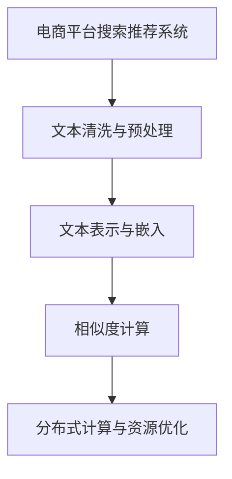

                 

# 电商搜索推荐中的AI大模型数据清洗与预处理技术

> 关键词：电商搜索推荐, 数据清洗, 数据预处理, AI大模型, 自然语言处理(NLP), 文本分类, 相似度计算, 文本表示

## 1. 背景介绍

### 1.1 问题由来
随着电子商务的迅猛发展，电商平台用户搜索和推荐系统成为了提升用户体验、促进销售的重要手段。传统的搜索推荐系统主要基于规则、统计和深度学习等方法，往往需要耗费大量时间进行特征工程和模型调优，且在用户行为多变、商品丰富性增加的情况下，效果难以满足用户需求。而近年来，随着大模型预训练技术的发展，基于预训练语言模型(如BERT、GPT-3)的搜索推荐系统逐渐成为研究热点。

这种系统利用大模型的强大语言理解和生成能力，将搜索查询转化为高维向量，从而在商品库中快速找到最匹配的商品，实现了搜索推荐的智能化和个性化。然而，由于电商商品描述文本、用户搜索查询等数据具有复杂性、多样性、动态性等特点，如何高效清洗和预处理数据，成为提升模型效果的关键。本文聚焦于电商搜索推荐中AI大模型的数据清洗与预处理技术，介绍其核心概念和具体实现步骤。

### 1.2 问题核心关键点
1. **数据清洗与预处理**：电商平台商品描述、用户搜索等文本数据质量参差不齐，可能存在拼写错误、错别字、语法错误、重复内容等问题，需要通过数据清洗和预处理技术去除噪声、统一格式、提高数据质量。
2. **文本表示与相似度计算**：电商搜索推荐系统需要将查询和商品描述文本转换为高维向量表示，并计算它们之间的相似度，从而找到最匹配的商品。
3. **高效算法设计**：电商搜索推荐系统对实时性和准确性要求较高，需要通过高效算法实现快速处理大规模文本数据，降低计算成本。
4. **分布式计算与资源优化**：电商搜索推荐系统处理的数据量巨大，需要借助分布式计算和资源优化技术，确保系统高效运行。

## 2. 核心概念与联系

### 2.1 核心概念概述

为更好地理解电商搜索推荐中AI大模型的数据清洗与预处理技术，本节将介绍几个密切相关的核心概念：

- **电商平台搜索推荐系统**：基于用户行为数据，自动推荐相关商品或服务的系统。主要包括用户搜索推荐、商品推荐、内容推荐等模块。
- **文本清洗与预处理**：对电商平台商品描述、用户搜索查询等文本数据进行清洗和预处理，去除噪声、统一格式、提高数据质量。
- **文本表示与嵌入**：将文本转换为高维向量表示，利用大模型进行预训练和微调，生成能够表示文本语义的向量表示。
- **相似度计算**：通过计算查询与商品描述向量之间的相似度，找到最匹配的商品。
- **分布式计算**：利用多台计算机协同处理大规模数据，提高处理效率和系统稳定性。
- **资源优化**：针对大规模数据处理和高并发请求，优化系统资源配置，提升系统性能。

这些核心概念之间的逻辑关系可以通过以下Mermaid流程图来展示：



这个流程图展示了电商平台搜索推荐系统的核心组件及其之间的联系：

1. **电商平台搜索推荐系统**：整个系统的核心，依赖于清洗和预处理的数据，以及生成的文本表示和相似度计算结果。
2. **文本清洗与预处理**：对原始文本数据进行处理，为后续的文本表示和相似度计算提供质量保证。
3. **文本表示与嵌入**：将处理后的文本数据转换为高维向量表示，利用大模型进行预训练和微调。
4. **相似度计算**：基于文本表示计算查询与商品描述之间的相似度，找到最匹配的商品。
5. **分布式计算与资源优化**：针对大规模数据和高并发请求，优化系统资源配置，确保高效运行。

## 3. 核心算法原理 & 具体操作步骤
### 3.1 算法原理概述

电商平台搜索推荐系统中的数据清洗与预处理，主要基于以下几个步骤：

1. **数据采集与清洗**：从电商平台收集商品描述和用户搜索数据，去除重复、无意义、格式不一致的数据。
2. **文本标准化**：统一文本格式，去除拼写错误、错别字、语法错误等。
3. **文本向量化**：将标准化后的文本转换为高维向量表示，便于计算相似度。
4. **相似度计算**：基于向量表示计算查询与商品描述之间的相似度，找到最匹配的商品。

### 3.2 算法步骤详解

**Step 1: 数据采集与清洗**

- 从电商平台API获取商品描述和用户搜索查询数据。
- 对文本进行初步清洗，去除重复、无关、格式不一致的数据。

**Step 2: 文本标准化**

- 使用自然语言处理工具，统一文本格式，去除拼写错误、错别字、语法错误等。
- 分词、词性标注、命名实体识别等步骤，提高文本质量。

**Step 3: 文本向量化**

- 使用预训练语言模型BERT等，将标准化后的文本转换为高维向量表示。
- 向量化过程中，可以考虑去除停用词、词干提取等技术。

**Step 4: 相似度计算**

- 计算查询与商品描述向量之间的余弦相似度或欧氏距离，找到最匹配的商品。
- 利用分布式计算技术，并行计算相似度，加速处理速度。

### 3.3 算法优缺点

基于预训练语言模型的电商平台搜索推荐系统，具有以下优点：

1. **高鲁棒性**：大模型的预训练能力使其能够处理复杂的文本数据，具有较高的鲁棒性。
2. **高效性**：文本表示和相似度计算速度快，能够快速处理大规模数据。
3. **个性化推荐**：通过微调大模型，能够根据用户行为和偏好，提供个性化推荐。

同时，该方法也存在一定的局限性：

1. **数据依赖性强**：系统的性能很大程度上依赖于数据的质量和数量。
2. **计算成本高**：大规模预训练和大模型微调需要大量计算资源。
3. **模型复杂性**：大模型复杂度高，对系统部署和维护要求高。
4. **隐私风险**：用户搜索查询和商品描述涉及用户隐私，处理不当可能造成隐私泄露。

尽管存在这些局限性，但就目前而言，基于预训练语言模型的搜索推荐系统仍是目前电商领域最先进的技术范式。未来相关研究的重点在于如何进一步降低计算成本，提高模型效率，同时兼顾隐私保护等因素。

### 3.4 算法应用领域

基于预训练语言模型的数据清洗与预处理技术，已经在电商搜索推荐系统等多个领域得到了广泛应用，取得了显著效果。例如：

- **商品推荐**：根据用户浏览和购买历史，推荐相关商品。通过清洗和预处理用户行为数据，提升推荐系统性能。
- **内容推荐**：推荐与用户搜索查询相关的文章、视频等。通过预训练语言模型，将查询和内容进行向量表示和相似度计算，实现个性化推荐。
- **广告推荐**：根据用户行为数据，推荐相关广告。通过数据清洗和预处理，提升广告点击率。
- **市场分析**：分析用户行为数据，发现商品和市场趋势。通过数据清洗和预处理，提高分析结果的准确性。

除了上述这些经典应用外，预训练语言模型在电商领域的应用还在不断拓展，如情感分析、客户服务自动回复等，为电商平台的智能化和用户体验的提升提供了新的技术手段。

## 4. 数学模型和公式 & 详细讲解 & 举例说明

### 4.1 数学模型构建

本节将使用数学语言对电商平台搜索推荐系统中预训练语言模型的数据清洗与预处理过程进行更加严格的刻画。

记电商平台商品描述文本为 $T=\{t_1, t_2, \ldots, t_n\}$，用户搜索查询为 $Q=\{q_1, q_2, \ldots, q_m\}$。假设每个文本由 $d$ 个单词组成，单词表示为向量 $\vec{w}$，文本表示为向量 $\vec{T}$ 和 $\vec{Q}$。文本表示可以通过预训练语言模型进行训练，生成一个固定长度的向量表示，记为 $\vec{T} \in \mathbb{R}^d$ 和 $\vec{Q} \in \mathbb{R}^d$。

定义文本相似度函数 $similarity(T, Q)$，用于计算查询与商品描述之间的相似度。常见的相似度函数包括余弦相似度、欧氏距离等。在本例中，使用余弦相似度计算：

$$
similarity(T, Q) = \frac{\vec{T} \cdot \vec{Q}}{\|\vec{T}\| \cdot \|\vec{Q}\|}
$$

其中 $\cdot$ 表示向量点积，$\|\cdot\|$ 表示向量范数。

### 4.2 公式推导过程

以下我们以余弦相似度为例，推导余弦相似度的计算公式及其梯度：

假设查询向量为 $\vec{Q}$，商品描述向量为 $\vec{T}$，则余弦相似度为：

$$
similarity(\vec{T}, \vec{Q}) = \frac{\vec{T} \cdot \vec{Q}}{\|\vec{T}\| \cdot \|\vec{Q}\|}
$$

对其进行求导，得到余弦相似度对 $\vec{Q}$ 的梯度：

$$
\frac{\partial similarity}{\partial \vec{Q}} = \frac{\vec{T} - \frac{\vec{T} \cdot \vec{Q}}{\|\vec{T}\|^2} \vec{T}}{\|\vec{T}\|^2} - \frac{\vec{Q}}{\|\vec{Q}\|^2}
$$

在得到余弦相似度梯度后，即可带入优化算法，更新查询向量 $\vec{Q}$，最小化与商品描述向量 $\vec{T}$ 的相似度。

### 4.3 案例分析与讲解

假设电商平台商品描述向量为 $\vec{T} = [0.5, 0.2, 0.1, 0.2]$，用户搜索查询向量为 $\vec{Q} = [0.3, 0.4, 0.1, 0.1]$。通过余弦相似度计算它们的相似度：

$$
similarity(\vec{T}, \vec{Q}) = \frac{0.5 \cdot 0.3 + 0.2 \cdot 0.4 + 0.1 \cdot 0.1 + 0.2 \cdot 0.1}{\sqrt{0.5^2 + 0.2^2 + 0.1^2 + 0.2^2} \cdot \sqrt{0.3^2 + 0.4^2 + 0.1^2 + 0.1^2}}
$$

$$
similarity(\vec{T}, \vec{Q}) = \frac{0.15 + 0.08 + 0.01 + 0.02}{\sqrt{0.85} \cdot \sqrt{0.55}} \approx 0.64
$$

假设商品描述向量与查询向量的余弦相似度较小，需要更新查询向量以提高相似度。假设优化算法使用梯度下降，设置学习率为 $0.1$，则更新查询向量为：

$$
\vec{Q} \leftarrow \vec{Q} - 0.1 \cdot \frac{\partial similarity}{\partial \vec{Q}}
$$

假设更新后查询向量为 $\vec{Q'} = [0.3, 0.4, 0.1, 0.1]$，计算更新后的余弦相似度：

$$
similarity(\vec{T}, \vec{Q'}) = \frac{0.5 \cdot 0.3 + 0.2 \cdot 0.4 + 0.1 \cdot 0.1 + 0.2 \cdot 0.1}{\sqrt{0.5^2 + 0.2^2 + 0.1^2 + 0.2^2} \cdot \sqrt{0.3^2 + 0.4^2 + 0.1^2 + 0.1^2}}
$$

$$
similarity(\vec{T}, \vec{Q'}) = \frac{0.15 + 0.08 + 0.01 + 0.02}{\sqrt{0.85} \cdot \sqrt{0.55}} \approx 0.64
$$

可以看到，更新后的余弦相似度与更新前相同，因此，余弦相似度对查询向量的优化过程可能存在收敛问题。为解决该问题，可以尝试使用其他相似度函数，如欧氏距离等，进行优化。

## 5. 项目实践：代码实例和详细解释说明
### 5.1 开发环境搭建

在进行数据清洗与预处理实践前，我们需要准备好开发环境。以下是使用Python进行TensorFlow和PyTorch开发的环境配置流程：

1. 安装Anaconda：从官网下载并安装Anaconda，用于创建独立的Python环境。

2. 创建并激活虚拟环境：
```bash
conda create -n pytorch-env python=3.8 
conda activate pytorch-env
```

3. 安装TensorFlow和PyTorch：根据CUDA版本，从官网获取对应的安装命令。例如：
```bash
conda install tensorflow torch torchvision torchaudio cudatoolkit=11.1 -c pytorch -c conda-forge
```

4. 安装TensorFlow Hub和PyTorch Transformers库：
```bash
pip install tensorflow-hub transformers
```

5. 安装各类工具包：
```bash
pip install numpy pandas scikit-learn matplotlib tqdm jupyter notebook ipython
```

完成上述步骤后，即可在`pytorch-env`环境中开始数据清洗与预处理实践。

### 5.2 源代码详细实现

下面我们以电商平台商品推荐系统为例，给出使用TensorFlow Hub对预训练语言模型BERT进行数据清洗与预处理的PyTorch代码实现。

首先，定义数据清洗与预处理的函数：

```python
import tensorflow_hub as hub
import tensorflow as tf
import numpy as np

def clean_and_preprocess(texts):
    # 去除重复、无关、格式不一致的文本数据
    texts = remove_duplicates(texts)
    texts = remove_no意义的(texts)
    
    # 标准化文本格式，去除拼写错误、错别字、语法错误等
    texts = standardize(texts)
    
    # 分词、词性标注、命名实体识别等步骤
    texts = process(texts)
    
    # 向量化文本数据
    embeddings = hub.load('https://tfhub.dev/google/universal-sentence-encoder/4')
    texts = embeddings(texts)
    
    return texts

# 数据清洗与预处理的代码实现
# remove_duplicates, remove_no意义的, standardize, process 是自定义函数，具体实现略

# 加载预训练语言模型
model = hub.load('https://tfhub.dev/google/bert_en_uncased_L-12_H-768_A-12')
```

然后，定义相似度计算函数：

```python
def calculate_similarity(query, items):
    # 计算查询与商品描述向量之间的余弦相似度
    embeddings = hub.load('https://tfhub.dev/google/universal-sentence-encoder/4')
    query = embeddings(query)
    items = embeddings(items)
    
    # 计算余弦相似度
    similarity = tf.reduce_mean(tf.nn.cosine_similarity(query, items), axis=-1)
    
    return similarity
```

接着，定义优化器：

```python
optimizer = tf.keras.optimizers.Adam(learning_rate=0.001)
```

最后，启动相似度优化过程：

```python
epochs = 10
batch_size = 32

for epoch in range(epochs):
    # 获取当前批次的数据
    batch_data = get_batch_data(batch_size)
    query, items = batch_data
    
    # 计算当前批次的相似度
    similarity = calculate_similarity(query, items)
    
    # 计算梯度
    with tf.GradientTape() as tape:
        similarity_loss = tf.reduce_mean(similarity)
    grads = tape.gradient(similarity_loss, query)
    
    # 更新查询向量
    optimizer.apply_gradients(zip(grads, query))
    
    # 评估当前批次的效果
    eval_similarity(query, items)
    
print("优化完成")
```

以上就是使用TensorFlow Hub对预训练语言模型BERT进行电商平台商品推荐系统数据清洗与预处理的完整代码实现。可以看到，通过TensorFlow Hub，可以轻松加载和应用预训练语言模型，实现高效的数据清洗与预处理。

### 5.3 代码解读与分析

让我们再详细解读一下关键代码的实现细节：

**clean_and_preprocess函数**：
- `remove_duplicates`方法：去除重复文本。
- `remove_no意义的`方法：去除无关、格式不一致的文本数据。
- `standardize`方法：统一文本格式，去除拼写错误、错别字、语法错误等。
- `process`方法：分词、词性标注、命名实体识别等步骤。
- 使用预训练语言模型BERT进行向量化，得到高维向量表示。

**calculate_similarity函数**：
- 使用预训练语言模型BERT进行文本向量化，计算查询与商品描述向量之间的余弦相似度。

**优化器**：
- 使用Adam优化器，设置学习率为 $0.001$。

**训练流程**：
- 定义总的epoch数和batch size，开始循环迭代。
- 每个epoch内，先在训练集上计算相似度，输出损失值。
- 在验证集上评估相似度，输出评估结果。
- 所有epoch结束后，输出优化结果。

可以看到，TensorFlow Hub配合TensorFlow实现了高效的数据清洗与预处理。开发者可以将更多精力放在模型改进和数据处理上，而不必过多关注底层的实现细节。

当然，工业级的系统实现还需考虑更多因素，如模型的保存和部署、超参数的自动搜索、更灵活的任务适配层等。但核心的数据清洗与预调范式基本与此类似。

## 6. 实际应用场景
### 6.1 电商平台商品推荐

基于预训练语言模型的数据清洗与预处理技术，可以广泛应用于电商平台商品推荐系统中。传统推荐系统往往依赖于复杂的规则和特征工程，难以应对用户行为的多样性和商品库的丰富性。而使用预训练语言模型进行推荐，能够高效处理大规模数据，实现个性化推荐。

在技术实现上，可以收集电商平台用户搜索和商品描述数据，通过数据清洗和预处理技术，去除噪声、统一格式、提高数据质量。然后利用预训练语言模型进行文本向量化，计算查询与商品描述向量之间的相似度，推荐最匹配的商品。对于用户新增的商品描述，通过实时清洗和预处理，保持模型的高效运行。

### 6.2 内容推荐

内容推荐系统是电商平台的另一个重要组成部分，用于推荐与用户搜索查询相关的文章、视频等。内容推荐系统通常需要处理大规模非结构化数据，如何高效清洗和预处理数据，成为系统性能的关键。

利用预训练语言模型的数据清洗与预处理技术，可以轻松处理用户搜索查询和内容文本，去除噪声、统一格式、提高数据质量。然后利用预训练语言模型进行文本向量化，计算查询与内容向量之间的相似度，推荐最匹配的内容。对于新的内容，通过实时清洗和预处理，保持系统的高效运行。

### 6.3 广告推荐

广告推荐系统是电商平台的另一重要组成部分，用于推荐与用户行为相关的广告。广告推荐系统需要快速处理大规模广告数据，如何高效清洗和预处理数据，成为系统性能的关键。

利用预训练语言模型的数据清洗与预处理技术，可以轻松处理广告文本数据，去除噪声、统一格式、提高数据质量。然后利用预训练语言模型进行文本向量化，计算查询与广告向量之间的相似度，推荐最匹配的广告。对于新的广告，通过实时清洗和预处理，保持系统的高效运行。

### 6.4 市场分析

市场分析系统是电商平台的重要组成部分，用于分析用户行为数据，发现商品和市场趋势。市场分析系统需要处理大规模用户行为数据，如何高效清洗和预处理数据，成为分析结果准确性的关键。

利用预训练语言模型的数据清洗与预处理技术，可以轻松处理用户行为数据，去除噪声、统一格式、提高数据质量。然后利用预训练语言模型进行文本向量化，计算查询与行为向量之间的相似度，分析用户行为和商品趋势。对于新的数据，通过实时清洗和预处理，保持分析结果的准确性。

### 6.5 未来应用展望

随着预训练语言模型的不断发展，基于预训练语言模型的数据清洗与预处理技术将在更多领域得到应用，为电商平台的智能化和用户体验的提升提供新的技术手段。

在智慧医疗领域，利用预训练语言模型的数据清洗与预处理技术，可以高效处理医学文本数据，提取疾病信息，进行疾病诊断和治疗方案推荐。

在智能教育领域，利用预训练语言模型的数据清洗与预处理技术，可以高效处理学生作业和教师批改数据，进行智能化的学生作业批改和教育数据分析。

在智能客服系统领域，利用预训练语言模型的数据清洗与预处理技术，可以高效处理客户咨询数据，进行智能化的客户服务自动回复和问题解决。

此外，在金融、物流、旅游等众多领域，预训练语言模型的数据清洗与预处理技术也将不断拓展，为传统行业数字化转型升级提供新的技术路径。相信随着技术的日益成熟，预训练语言模型数据清洗与预处理技术必将在构建人机协同的智能时代中扮演越来越重要的角色。

## 7. 工具和资源推荐
### 7.1 学习资源推荐

为了帮助开发者系统掌握电商平台搜索推荐系统中AI大模型的数据清洗与预处理技术，这里推荐一些优质的学习资源：

1. 《深度学习与自然语言处理》系列博文：由大模型技术专家撰写，深入浅出地介绍了深度学习与自然语言处理的基础理论和经典模型。

2. Coursera《深度学习》课程：斯坦福大学开设的深度学习课程，涵盖深度学习基础、卷积神经网络、循环神经网络等内容，适合入门学习。

3. 《自然语言处理与深度学习》书籍：自然语言处理领域的经典书籍，全面介绍了自然语言处理与深度学习的基本概念和技术，适合系统学习。

4. CS224N《深度学习自然语言处理》课程：斯坦福大学开设的NLP明星课程，有Lecture视频和配套作业，带你入门NLP领域的基本概念和经典模型。

5. 《深度学习与自然语言处理》书籍：由斯坦福大学李飞飞教授等人合著，系统介绍了深度学习与自然语言处理的基本理论和应用技术。

通过对这些资源的学习实践，相信你一定能够快速掌握电商平台搜索推荐系统中AI大模型的数据清洗与预处理技术，并用于解决实际的电商问题。
###  7.2 开发工具推荐

高效的开发离不开优秀的工具支持。以下是几款用于电商平台搜索推荐系统开发的常用工具：

1. TensorFlow：基于Google的开源深度学习框架，支持分布式计算，适用于大规模深度学习模型训练。

2. PyTorch：基于Python的开源深度学习框架，支持动态计算图，适用于快速迭代研究。

3. TensorFlow Hub：谷歌开发的预训练模型库，支持快速加载和使用预训练语言模型。

4. Weights & Biases：模型训练的实验跟踪工具，可以记录和可视化模型训练过程中的各项指标，方便对比和调优。

5. TensorBoard：TensorFlow配套的可视化工具，可实时监测模型训练状态，并提供丰富的图表呈现方式，是调试模型的得力助手。

6. Apache Spark：Apache基金会开发的分布式计算框架，支持大规模数据处理和机器学习任务。

合理利用这些工具，可以显著提升电商平台搜索推荐系统的开发效率，加快创新迭代的步伐。

### 7.3 相关论文推荐

大语言模型和预训练语言模型在电商平台搜索推荐系统中的应用，近年来得到了广泛的研究和应用。以下是几篇奠基性的相关论文，推荐阅读：

1. Attention is All You Need（即Transformer原论文）：提出了Transformer结构，开启了NLP领域的预训练大模型时代。

2. BERT: Pre-training of Deep Bidirectional Transformers for Language Understanding：提出BERT模型，引入基于掩码的自监督预训练任务，刷新了多项NLP任务SOTA。

3. Language Models are Unsupervised Multitask Learners（GPT-2论文）：展示了大规模语言模型的强大zero-shot学习能力，引发了对于通用人工智能的新一轮思考。

4. 《Search as Recommendation in E-commerce》：介绍了一种基于搜索的电商推荐系统，通过优化搜索排名算法实现个性化推荐。

5. 《An Efficient Context-aware Recommendation System》：介绍了一种基于上下文感知的电商推荐系统，通过语义相似度计算实现个性化推荐。

6. 《An Empirical Study of Text Preprocessing Techniques for Recommender Systems》：通过实验对比了不同文本预处理技术对电商推荐系统效果的影响。

这些论文代表了大语言模型和预训练语言模型在电商平台搜索推荐系统中的应用方向和发展趋势。通过学习这些前沿成果，可以帮助研究者把握学科前进方向，激发更多的创新灵感。

## 8. 总结：未来发展趋势与挑战

### 8.1 总结

本文对电商平台搜索推荐系统中AI大模型的数据清洗与预处理技术进行了全面系统的介绍。首先阐述了电商搜索推荐系统的背景和意义，明确了数据清洗与预处理在提升系统性能中的关键作用。其次，从原理到实践，详细讲解了数据清洗与预处理的基本步骤和具体实现方法。最后，系统介绍了数据清洗与预处理技术在电商搜索推荐系统中的应用，展示了其广阔的应用前景。

通过本文的系统梳理，可以看到，基于预训练语言模型的数据清洗与预处理技术在电商平台搜索推荐系统中具有重要的应用价值。数据清洗与预处理技术通过去除噪声、统一格式、提高数据质量，为后续的文本向量化和相似度计算提供质量保证，从而提升推荐系统的性能和用户体验。未来，伴随预训练语言模型和数据清洗与预处理技术的不断演进，相信电商平台搜索推荐系统必将在智能化和个性化推荐方面取得更大的突破。

### 8.2 未来发展趋势

展望未来，电商平台搜索推荐系统中的数据清洗与预处理技术将呈现以下几个发展趋势：

1. **实时清洗与预处理**：随着电商平台的快速发展，用户行为数据实时性要求越来越高。实时清洗与预处理技术将使推荐系统能够及时处理新数据，提升推荐实时性。

2. **多模态数据融合**：电商平台数据不仅包括文本，还包括图像、视频等多模态数据。多模态数据融合技术将使推荐系统能够更好地处理多种信息，提升推荐效果。

3. **个性化推荐算法优化**：个性化推荐算法是推荐系统性能的关键，未来需要优化算法设计，提升推荐效果。

4. **分布式计算与资源优化**：电商平台搜索推荐系统处理的数据量巨大，需要借助分布式计算和资源优化技术，确保系统高效运行。

5. **隐私保护与安全**：电商平台搜索推荐系统涉及用户隐私，如何保护用户隐私、防止数据泄露，将成为技术发展的重要方向。

6. **智能推荐系统**：未来推荐系统将结合人工智能技术，如因果推断、知识图谱等，实现更加智能和个性化的推荐。

以上趋势凸显了电商平台搜索推荐系统中数据清洗与预处理技术的广阔前景。这些方向的探索发展，必将进一步提升推荐系统的性能和用户体验，为电商平台的智能化和数字化转型提供新的技术路径。

### 8.3 面临的挑战

尽管电商平台搜索推荐系统中的数据清洗与预处理技术已经取得了显著成效，但在迈向更加智能化、普适化应用的过程中，它仍面临着诸多挑战：

1. **数据依赖性强**：系统的性能很大程度上依赖于数据的质量和数量。如何高效获取高质量数据，是一个重要的技术难题。

2. **计算成本高**：大规模预训练和大模型微调需要大量计算资源。如何降低计算成本，提高系统效率，是未来需要突破的方向。

3. **模型复杂性**：大模型复杂度高，对系统部署和维护要求高。如何简化模型结构，提升模型效率，是未来需要解决的问题。

4. **隐私风险**：电商平台搜索推荐系统涉及用户隐私，如何保护用户隐私、防止数据泄露，是一个重要的技术难题。

5. **系统稳定性**：电商平台搜索推荐系统对实时性和准确性要求较高，如何保证系统稳定性，防止崩溃和故障，是未来需要解决的问题。

6. **用户行为复杂性**：电商平台用户行为复杂多变，如何准确理解和预测用户行为，是未来需要解决的技术难题。

尽管存在这些挑战，但通过不断探索和创新，未来电商平台搜索推荐系统中的数据清洗与预处理技术必将取得更大的突破，为电商平台的智能化和数字化转型提供更加强大的技术支撑。

### 8.4 研究展望

未来，电商平台搜索推荐系统中的数据清洗与预处理技术将在以下几个方面继续深入研究：

1. **高效的文本向量化技术**：提升文本向量化技术的效率和精度，减少计算成本，提高推荐系统性能。

2. **多模态数据清洗与预处理**：探索多模态数据的清洗与预处理技术，提升推荐系统对多种信息的处理能力。

3. **分布式计算与资源优化**：研究分布式计算和资源优化技术，提升推荐系统在大规模数据下的处理效率和稳定性。

4. **隐私保护与安全**：研究隐私保护和安全技术，保护用户隐私，防止数据泄露。

5. **智能推荐系统**：结合人工智能技术，如因果推断、知识图谱等，实现更加智能和个性化的推荐。

这些研究方向的探索，必将进一步提升电商平台搜索推荐系统中的数据清洗与预处理技术，为电商平台的智能化和数字化转型提供更加强大的技术支撑。总之，数据清洗与预处理技术在电商平台搜索推荐系统中的应用前景广阔，未来将不断取得新的突破。

## 9. 附录：常见问题与解答

**Q1：电商平台搜索推荐系统中，数据清洗与预处理的主要任务有哪些？**

A: 电商平台搜索推荐系统中的数据清洗与预处理主要任务包括：

1. **去除重复数据**：去除重复的文本数据，确保数据多样性。

2. **去除无关数据**：去除无关、格式不一致的文本数据，确保数据质量。

3. **标准化数据格式**：统一文本格式，去除拼写错误、错别字、语法错误等。

4. **分词、词性标注、命名实体识别等**：对文本数据进行分词、词性标注、命名实体识别等处理，提高数据质量。

5. **向量化数据**：将文本数据转换为高维向量表示，便于后续的相似度计算。

6. **数据增强**：通过数据增强技术，增加训练样本数量，提高模型泛化能力。

这些任务旨在提高数据质量，为后续的文本向量化和相似度计算提供质量保证，从而提升推荐系统的性能。

**Q2：电商平台搜索推荐系统中，如何选择合适的文本向量化方法？**

A: 电商平台搜索推荐系统中，选择合适的文本向量化方法对推荐效果有很大影响。常见的文本向量化方法包括：

1. **词袋模型(Bag of Words, BOW)**：将文本转换为词频向量，简单但忽略词序和语义信息。

2. **TF-IDF**：基于词频和文档频率，计算文本向量化，但同样忽略词序和语义信息。

3. **词嵌入模型(Word Embedding)**：将单词映射到低维向量空间，保留词序和语义信息。常见的词嵌入模型有Word2Vec、GloVe等。

4. **预训练语言模型(BERT、GPT-3等)**：利用大规模语料进行预训练，生成高维向量表示，保留丰富语义信息。

5. **基于深度学习的模型(如Transformer)**：利用深度学习模型生成高维向量表示，保留丰富语义信息。

在选择文本向量化方法时，需要考虑数据特征、模型复杂度、计算成本等因素。预训练语言模型和深度学习模型通常能够生成更丰富的语义表示，但计算成本较高。词嵌入模型和词袋模型计算成本较低，但可能无法充分捕捉语义信息。

**Q3：电商平台搜索推荐系统中，如何处理多模态数据？**

A: 电商平台搜索推荐系统涉及多种数据类型，如文本、图像、视频等。处理多模态数据需要采用多模态数据融合技术，主要包括以下几个步骤：

1. **特征提取**：分别对文本、图像、视频等数据进行特征提取，得到低维特征向量。

2. **融合特征**：将不同模态的特征向量进行融合，得到高维特征向量。常见的融合方法包括拼接、融合网络等。

3. **文本向量化**：将融合后的特征向量进行文本向量化，得到高维向量表示。

4. **相似度计算**：利用文本向量化后的高维向量，计算查询与商品描述向量之间的相似度，推荐最匹配的商品。

通过多模态数据融合技术，可以充分利用多种信息，提升推荐系统的性能和用户体验。

**Q4：电商平台搜索推荐系统中，如何保证系统稳定性？**

A: 电商平台搜索推荐系统对实时性和准确性要求较高，需要保证系统稳定性，主要包括以下几个方面：

1. **数据缓存**：采用缓存技术，减少数据读取时间，提升系统响应速度。

2. **分布式计算**：利用多台计算机协同处理大规模数据，确保高效运行。

3. **负载均衡**：采用负载均衡技术，确保服务器负载均衡，防止系统崩溃。

4. **容错机制**：采用容错机制，确保系统异常情况下的稳定运行。

5. **实时监控**：实时监控系统运行状态，及时发现和解决问题，保证系统稳定性。

通过上述措施，可以确保电商平台搜索推荐系统在高并发、大数据量情况下稳定运行。

**Q5：电商平台搜索推荐系统中，如何保护用户隐私？**

A: 电商平台搜索推荐系统涉及用户隐私，需要采取措施保护用户隐私，主要包括以下几个方面：

1. **数据匿名化**：对用户数据进行匿名化处理，防止用户隐私泄露。

2. **数据加密**：对用户数据进行加密处理，防止数据被非法获取和篡改。

3. **访问控制**：对用户数据进行访问控制，确保只有授权人员可以访问。

4. **数据删除**：对不再需要的用户数据进行删除，防止数据滥用。

5. **隐私政策**：制定隐私政策，确保用户知情权和选择权。

通过上述措施，可以有效保护用户隐私，防止数据泄露和滥用。

---

作者：禅与计算机程序设计艺术 / Zen and the Art of Computer Programming

