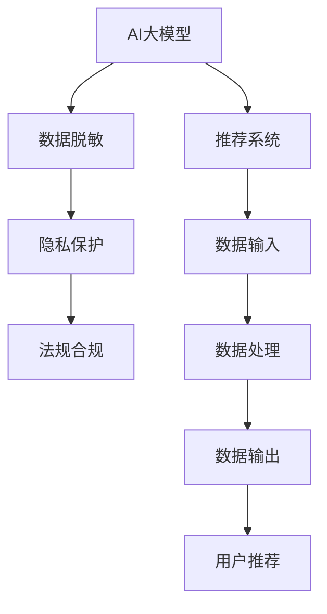

                 

# 电商搜索推荐中的AI大模型数据脱敏技术应用最佳实践与优化方案

## 1. 背景介绍

在电商搜索推荐领域，AI大模型的应用日益普及，从个性化推荐、内容理解到用户行为分析，AI技术已成为驱动业务增长的核心动力。然而，随着数据隐私和安全法规的收紧，对用户数据的处理方式提出了更高的要求。如何在保护用户隐私的同时，充分利用数据价值，成为电商企业必须解决的挑战。

### 1.1 问题由来

在电商搜索推荐系统中，用户数据（如浏览记录、购买历史、搜索行为等）是核心的数据资产，对模型的训练和优化至关重要。但同时，这些数据涉及用户隐私，一旦泄露可能对用户造成严重风险。传统的数据处理方法，如数据匿名化，虽然在一定程度上保护了隐私，但也会牺牲数据价值，影响模型的训练效果。

### 1.2 问题核心关键点

解决这一问题的关键在于找到平衡数据隐私和模型效果的方法，即如何在满足隐私保护法规的前提下，实现数据的有效利用。这需要引入数据脱敏技术，通过对敏感信息进行处理，既保护隐私，又保留数据的实用价值。

### 1.3 问题研究意义

数据脱敏技术的应用，不仅对电商搜索推荐系统的安全性、合规性具有重要意义，而且还能提升用户体验，增强用户信任。具体来说，它可以：

1. **保障用户隐私**：避免用户数据被滥用，减少数据泄露风险。
2. **增强模型鲁棒性**：通过数据脱敏，可以减少模型对特定用户数据的依赖，增强其泛化能力。
3. **优化推荐结果**：通过合理的数据处理，可以提升推荐的个性化和相关性，提高用户体验。
4. **符合法规要求**：满足GDPR等隐私保护法规的要求，确保业务合规性。

## 2. 核心概念与联系

### 2.1 核心概念概述

为了更好地理解电商搜索推荐中AI大模型数据脱敏技术的最佳实践与优化方案，本节将介绍几个核心概念及其联系：

- **AI大模型**：如GPT-3、BERT等，通过大规模无标签数据的预训练，学习通用的语言表示，具备强大的自然语言理解和生成能力。
- **数据脱敏**：通过对数据中的敏感信息进行处理，使其在不泄露个人信息的前提下，仍然具有实用价值。
- **隐私保护**：确保用户数据的安全性，防止数据被未经授权的第三方访问和滥用。
- **法规合规**：遵循GDPR等数据保护法规，保障用户数据的使用符合法律规定。
- **推荐系统**：通过分析用户行为数据，为用户提供个性化的搜索结果或商品推荐，提升用户满意度和业务转化率。

这些概念之间的逻辑关系可以通过以下Mermaid流程图来展示：



这个流程图展示了大模型在电商搜索推荐中的工作流程，即数据从采集到推荐的过程。数据脱敏是其中的关键环节，既能保护用户隐私，又能提供高质量的数据输入，提升推荐系统的效果。

## 3. 核心算法原理 & 具体操作步骤
### 3.1 算法原理概述

AI大模型数据脱敏技术的基本原理是：通过预定义的脱敏规则，对原始数据进行处理，以减少敏感信息（如姓名、身份证号、地址等）的泄露风险。常见的数据脱敏方法包括数据替换、数据模糊化、数据加密等。

在电商搜索推荐场景中，主要关注用户行为数据的隐私保护。这些数据通常包含用户的浏览记录、搜索关键词、购买历史等。为了保证用户隐私，需要在数据收集、存储、传输和处理等环节进行全面的数据脱敏。

### 3.2 算法步骤详解

数据脱敏的具体步骤一般包括：

**Step 1: 数据采集与预处理**

1. **数据采集**：收集用户的数据，包括但不限于浏览记录、搜索历史、购买行为等。
2. **数据预处理**：对原始数据进行清洗、去重、归一化等预处理操作，准备脱敏处理。

**Step 2: 数据分类与标记**

1. **数据分类**：根据数据的敏感性，将其分为高敏感、中敏感和低敏感三类。
2. **数据标记**：对每一类数据进行标记，如高敏感数据通常涉及姓名、身份证号等，中敏感数据可能包括住址、电话号码，低敏感数据如浏览器类型、操作系统版本等。

**Step 3: 数据脱敏处理**

1. **数据替换**：对于高敏感数据，使用模糊化的数据替换，如将姓名替换为“XXX”，身份证号使用掩码处理。
2. **数据模糊化**：对于中敏感数据，可以采用部分替换或随机化处理，如将部分住址信息替换为“XX市”。
3. **数据加密**：对于敏感数据，采用对称加密或非对称加密的方式进行保护，如使用AES、RSA等算法。

**Step 4: 数据输出与存储**

1. **数据输出**：将脱敏后的数据输出到模型训练或推荐系统中。
2. **数据存储**：采用安全的数据库存储系统，对敏感数据进行严格的访问控制。

### 3.3 算法优缺点

**优点**：

1. **隐私保护**：通过数据脱敏，有效保护了用户隐私，避免了数据泄露风险。
2. **数据可用性**：脱敏后的数据仍然保留了有价值的信息，可用于模型训练和推荐。
3. **法规合规**：符合GDPR等隐私保护法规要求，保障业务合规性。

**缺点**：

1. **数据失真**：部分数据被模糊化或替换，可能影响模型的训练效果。
2. **处理成本高**：数据分类、标记、替换等处理过程复杂，需要大量时间和人力。
3. **隐私保护效果有限**：尽管数据被脱敏，但恶意攻击者可能通过多次数据拼接或结合公开信息，仍然可能破解隐私数据。

### 3.4 算法应用领域

数据脱敏技术在电商搜索推荐中的应用领域包括但不限于：

- **用户行为分析**：通过对用户行为数据的脱敏处理，进行个性化推荐、流量分析等。
- **推荐系统优化**：通过脱敏数据优化推荐算法，提升推荐系统的效果和鲁棒性。
- **风险控制**：通过脱敏数据，控制交易风险，保护用户财产安全。
- **用户隐私保护**：保护用户数据隐私，增强用户信任。

## 4. 数学模型和公式 & 详细讲解  
### 4.1 数学模型构建

在大模型数据脱敏技术中，常见的数学模型包括：

- **对称加密模型**：如AES、DES等，通过密钥对数据进行加密和解密。
- **非对称加密模型**：如RSA、ECC等，通过公钥加密，私钥解密的方式进行保护。
- **数据模糊化模型**：如模糊化算法、掩码处理等，对数据进行替换或随机化。

这些模型在数学上的表达形式较为复杂，但可以简化为基本的加法、乘法、指数等基本运算，使用符号表示为：

$$
C = E_k(P) = P' \oplus F_k(P')
$$

其中，$C$ 表示加密后的密文，$P$ 表示明文，$E_k$ 表示加密算法，$P'$ 表示加密前的数据，$F_k$ 表示密钥，$\oplus$ 表示异或运算。

### 4.2 公式推导过程

以对称加密模型AES为例，其加密过程可以分为四个步骤：字节替换、行移位、列混淆、轮密钥加。公式化表达为：

$$
C = E_k(P) = (P \oplus F_k) \oplus F_{k'} \oplus F_{k''} \oplus F_{k'''} \oplus \ldots \oplus F_k
$$

其中，$F_k$ 表示轮密钥，$k'$、$k''$、$k'''$ 等表示轮次。

解密过程与加密过程相反，使用相同算法和密钥，但运算顺序相反。

### 4.3 案例分析与讲解

假设我们要对用户的搜索关键词进行脱敏处理，步骤如下：

1. **数据分类**：将搜索关键词标记为低敏感数据。
2. **数据替换**：使用随机字符串替换原始搜索关键词，如将“苹果”替换为“xxx”。
3. **数据输出**：将替换后的数据输出到推荐系统中。

通过数据替换，我们有效保护了用户隐私，同时保留了关键词的有用信息。

## 5. 项目实践：代码实例和详细解释说明
### 5.1 开发环境搭建

在进行数据脱敏实践前，我们需要准备好开发环境。以下是使用Python进行AES加密的开发环境配置流程：

1. 安装Anaconda：从官网下载并安装Anaconda，用于创建独立的Python环境。

2. 创建并激活虚拟环境：
```bash
conda create -n aes-env python=3.8 
conda activate aes-env
```

3. 安装必要的库：
```bash
conda install pyaes numpy
```

4. 安装PyCryptodome库：
```bash
pip install pycryptodome
```

完成上述步骤后，即可在`aes-env`环境中开始数据脱敏实践。

### 5.2 源代码详细实现

下面以AES加密为例，展示使用PyCryptodome库对敏感数据进行脱敏处理的PyTorch代码实现。

```python
from Crypto.Cipher import AES
from Crypto.Util.Padding import pad, unpad
from Crypto.Random import get_random_bytes
import numpy as np

def aes_encrypt(data, key):
    cipher = AES.new(key, AES.MODE_ECB)
    padded_data = pad(data.encode('utf-8'), AES.block_size)
    encrypted_data = cipher.encrypt(padded_data)
    return encrypted_data

def aes_decrypt(data, key):
    cipher = AES.new(key, AES.MODE_ECB)
    decrypted_data = unpad(cipher.decrypt(data), AES.block_size)
    return decrypted_data.decode('utf-8')

# 测试数据
data = '苹果 京东'
key = get_random_bytes(16)

# 加密处理
encrypted_data = aes_encrypt(data, key)
print('加密后的数据：', encrypted_data)

# 解密处理
decrypted_data = aes_decrypt(encrypted_data, key)
print('解密后的数据：', decrypted_data)
```

### 5.3 代码解读与分析

让我们再详细解读一下关键代码的实现细节：

**AES加密函数**：
- `from Crypto.Cipher import AES`：导入AES加密模块。
- `from Crypto.Util.Padding import pad, unpad`：导入填充和去填充函数。
- `from Crypto.Random import get_random_bytes`：导入随机生成密钥的函数。
- `def aes_encrypt(data, key)`：定义加密函数，使用AES算法和ECB模式进行加密。
- `cipher = AES.new(key, AES.MODE_ECB)`：创建新的AES加密器。
- `padded_data = pad(data.encode('utf-8'), AES.block_size)`：使用填充函数对数据进行填充，确保其长度为AES块大小。
- `encrypted_data = cipher.encrypt(padded_data)`：对填充后的数据进行加密。
- `return encrypted_data`：返回加密后的数据。

**AES解密函数**：
- `def aes_decrypt(data, key)`：定义解密函数，使用AES算法和ECB模式进行解密。
- `cipher = AES.new(key, AES.MODE_ECB)`：创建新的AES解密器。
- `decrypted_data = unpad(cipher.decrypt(data), AES.block_size)`：使用去填充函数对数据进行去填充，并解密。
- `return decrypted_data.decode('utf-8')`：返回解密后的数据。

通过上述代码，可以看到AES加密和解密的实现步骤，即使用随机密钥生成器生成密钥，对数据进行加密处理，最后解密还原原始数据。

## 6. 实际应用场景
### 6.1 电商搜索推荐系统

在大规模电商搜索推荐系统中，数据脱敏技术的应用至关重要。以下是几个具体场景：

**用户浏览记录脱敏**：
通过对用户浏览记录进行脱敏处理，保护用户隐私。可以使用AES、RSA等算法对浏览记录进行加密处理，确保数据在传输和存储过程中不被泄露。

**用户行为数据分析**：
通过脱敏处理，可以分析用户的行为模式，进行个性化推荐。例如，通过对搜索关键词和浏览记录的脱敏，分析用户的兴趣点，生成个性化的推荐列表。

**风险控制**：
通过对用户交易数据进行脱敏处理，保护用户财产安全。例如，对交易金额、交易时间等敏感信息进行加密，确保数据在处理过程中不泄露。

**数据安全审计**：
通过对数据的访问和处理过程进行审计，确保数据安全。例如，使用日志记录每次数据访问和处理的操作，以及操作人信息，确保数据的访问和使用符合规范。

### 6.2 未来应用展望

随着数据脱敏技术的不断发展，其在电商搜索推荐系统中的应用将更加广泛和深入。未来可能的发展趋势包括：

1. **自动化数据脱敏**：通过AI技术自动进行数据分类和标记，提高脱敏效率。
2. **多模态数据脱敏**：将文本、图片、视频等多种数据类型进行综合脱敏，提升数据保护能力。
3. **联邦学习**：通过联邦学习技术，在保证数据隐私的前提下，进行模型训练和更新。
4. **边缘计算**：在本地设备上进行数据处理和保护，减少数据传输风险。
5. **数据匿名化**：结合数据匿名化技术，进一步提升数据保护效果。

## 7. 工具和资源推荐
### 7.1 学习资源推荐

为了帮助开发者系统掌握大模型数据脱敏技术，以下是一些优质的学习资源：

1. **《数据脱敏技术》一书**：全面介绍了数据脱敏的基本概念、技术和应用案例。
2. **《AES算法详解》博客**：深入浅出地讲解了AES加密算法的原理和实现。
3. **Google Cloud博客**：提供了丰富的数据保护和隐私保护指南，涵盖数据加密、访问控制等。
4. **Hacker News安全社区**：汇集了全球安全领域专家，分享最新的安全技术和管理经验。
5. **Kaggle数据脱敏竞赛**：通过实际竞赛，练习数据脱敏技术，提升实战能力。

### 7.2 开发工具推荐

高效的数据脱敏实践离不开优秀的工具支持。以下是几款用于数据脱敏开发的常用工具：

1. **PyCryptodome**：Python加密库，支持多种对称和非对称加密算法。
2. **AES加密工具**：如aes-cbc、openssl等，提供简单易用的加密和解密接口。
3. **SQLServer脱敏工具**：如Microsoft SQL Server 2008 R2 Data Protection，对数据库中的敏感数据进行保护。
4. **数据脱敏软件**：如Exterpro Data Masking，提供全面的数据保护解决方案。

### 7.3 相关论文推荐

数据脱敏技术的发展得益于学界的持续研究。以下是几篇奠基性的相关论文，推荐阅读：

1. **《隐私保护的数据发布技术综述》**：对数据脱敏技术进行了全面总结，包括多种脱敏方法的比较和应用。
2. **《AES加密算法》**：详细讲解了AES加密算法的原理和应用，是学习数据加密的重要参考资料。
3. **《联邦学习》**：介绍了联邦学习的基本概念、算法和应用场景，为数据脱敏提供了新的思路。

## 8. 总结：未来发展趋势与挑战
### 8.1 研究成果总结

本文对电商搜索推荐系统中大模型数据脱敏技术的应用和优化进行了系统介绍。通过梳理数据脱敏的核心概念、算法原理和具体操作步骤，详细讲解了AES加密的实现步骤，并给出了具体的代码实例和分析。通过实际应用场景的展示，明确了数据脱敏技术在电商搜索推荐系统中的重要性和未来发展方向。

### 8.2 未来发展趋势

展望未来，数据脱敏技术在电商搜索推荐系统中的应用将呈现以下几个发展趋势：

1. **自动化与智能化**：通过AI技术实现自动化数据脱敏，提高效率和准确性。
2. **多模态数据保护**：结合文本、图片、视频等多种数据类型，提升数据保护能力。
3. **联邦学习与分布式保护**：通过联邦学习技术，在保障数据隐私的同时，进行模型训练和更新。
4. **边缘计算与本地保护**：在本地设备上进行数据处理和保护，减少数据传输风险。
5. **数据匿名化与隐私保护**：结合数据匿名化技术，进一步提升数据保护效果。

### 8.3 面临的挑战

尽管数据脱敏技术取得了一定进展，但在实际应用中也面临诸多挑战：

1. **隐私保护与数据可用性的平衡**：如何在保护用户隐私的同时，确保数据的可用性和有效性，是一个复杂的问题。
2. **技术复杂性**：数据脱敏涉及加密、去识别等多种技术，实现复杂度高，需要专业知识。
3. **法律合规**：数据脱敏需要符合GDPR等隐私保护法规，不同国家和地区的法规要求不同，增加了实现难度。
4. **隐私泄露风险**：尽管数据进行了脱敏处理，但恶意攻击者可能通过多次数据拼接或结合公开信息，仍然可能破解隐私数据。
5. **计算资源消耗**：数据脱敏需要大量计算资源，特别是在大规模数据处理时，资源消耗较大。

### 8.4 研究展望

未来，需要在以下几个方面对数据脱敏技术进行进一步研究：

1. **自动化数据脱敏**：通过AI技术实现自动化数据分类和标记，提高脱敏效率。
2. **隐私保护与数据效用平衡**：研究如何在保护隐私的同时，最大化数据效用。
3. **联邦学习与分布式保护**：研究联邦学习技术在数据脱敏中的应用，提升数据保护效果。
4. **多模态数据保护**：研究如何综合保护多种数据类型，提升数据保护能力。
5. **数据匿名化与隐私保护**：结合数据匿名化技术，进一步提升数据保护效果。

## 9. 附录：常见问题与解答

**Q1：数据脱敏技术对电商搜索推荐系统的影响是什么？**

A: 数据脱敏技术通过保护用户隐私，提高了电商搜索推荐系统的安全性，减少了数据泄露风险。同时，通过对数据进行脱敏处理，可以提升模型的鲁棒性和泛化能力，增强推荐系统的个性化和相关性。

**Q2：数据脱敏与数据匿名化的区别是什么？**

A: 数据脱敏和数据匿名化都是数据保护的重要手段，但它们的目的和方法有所不同。数据脱敏主要通过替换、掩码等方式保护数据隐私，但仍然保留了数据的实用价值。而数据匿名化则通过去除或替换数据中的个人标识信息，使得数据无法追溯到个人，但可能会影响数据的可用性和完整性。

**Q3：数据脱敏在实际应用中需要注意哪些问题？**

A: 数据脱敏在实际应用中需要注意以下几个问题：
1. 数据分类与标记：正确分类和标记数据是数据脱敏的前提，需要根据数据的敏感性进行合理分类。
2. 脱敏策略选择：选择合适的脱敏策略，根据数据类型和应用场景进行调整。
3. 数据保留：在脱敏过程中，需要保留数据的有用信息，避免过度脱敏影响模型效果。
4. 加密算法选择：选择适合的加密算法，确保数据在传输和存储过程中不被泄露。
5. 安全审计：对数据访问和处理过程进行审计，确保数据保护符合规范。

通过以上问题的深入探讨，可以更好地理解和应用数据脱敏技术，提升电商搜索推荐系统的安全性和性能。

**Q4：电商搜索推荐系统中常见的数据脱敏方法有哪些？**

A: 电商搜索推荐系统中常见的数据脱敏方法包括：
1. 数据替换：将敏感数据替换为随机字符串或掩码。
2. 数据模糊化：对敏感数据进行部分替换或随机化处理。
3. 数据加密：使用对称加密或非对称加密对敏感数据进行保护。
4. 数据去识别：通过去除个人标识信息，使得数据无法追溯到个人。

通过这些方法，可以在保护用户隐私的同时，确保数据的可用性和安全性。

通过本文的系统介绍和实践案例，相信读者对电商搜索推荐系统中AI大模型数据脱敏技术的最佳实践与优化方案有了更深入的了解。未来，伴随着技术的发展和应用的深入，数据脱敏技术将在电商搜索推荐系统及其他领域中发挥更大的作用，为保障用户隐私和数据安全提供有力支持。

---

作者：禅与计算机程序设计艺术 / Zen and the Art of Computer Programming

