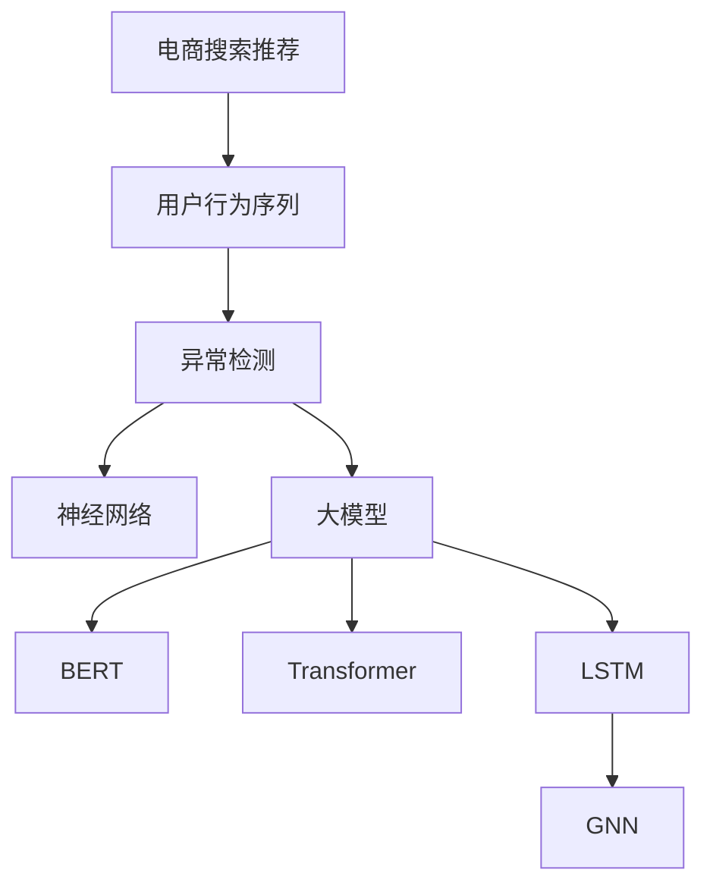
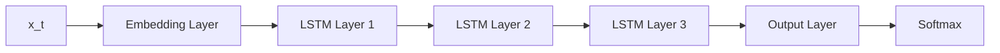

                 

# 电商搜索推荐中的AI大模型用户行为序列异常检测技术

> 关键词：电商搜索推荐、AI大模型、用户行为序列、异常检测、时序数据、神经网络、BERT、Transformer、LSTM、GNN

## 1. 背景介绍

在电商搜索推荐系统中，用户的搜索行为序列是一个重要的数据来源，能够提供关于用户兴趣和偏好的信息。然而，用户行为序列可能存在异常，例如由恶意攻击、账号盗用、爬虫行为等引发的异常，这些异常可能会对电商推荐系统造成影响，如降低推荐准确性、增加服务器负载、侵犯用户隐私等。为了保障电商搜索推荐系统的安全性和可靠性，需要设计有效的用户行为序列异常检测方法。

大模型技术，如BERT、Transformer、LSTM等，通过预训练大量数据，能够获取丰富的语义和时序知识，具备较强的语言理解和生成能力。将其应用于电商搜索推荐中的用户行为序列异常检测，可以有效提高检测的精度和泛化能力。本文将详细介绍基于AI大模型的电商搜索推荐中用户行为序列异常检测技术。

## 2. 核心概念与联系

### 2.1 核心概念概述

为更好地理解电商搜索推荐中的AI大模型用户行为序列异常检测方法，本节将介绍几个密切相关的核心概念：

- **电商搜索推荐**：通过收集用户的搜索行为数据，运用机器学习模型分析用户行为，推荐相关商品给用户，提升用户体验和电商转化率。
- **用户行为序列**：用户在进行电商搜索时，产生的搜索关键词序列。每个关键词代表用户对商品的一个兴趣点。
- **异常检测**：检测用户行为序列中的异常行为，避免恶意攻击、账号盗用、爬虫行为等对电商推荐系统的影响。
- **大模型**：如BERT、Transformer、LSTM等，通过预训练大量数据，获取丰富的语义和时序知识，具备较强的语言理解和生成能力。
- **神经网络**：以多层神经元网络为结构，通过反向传播算法进行训练，具备高效的特征提取和推理能力。
- **时序数据**：按时间顺序排列的数据序列，如电商搜索行为序列。
- **BERT**：基于Transformer架构的双向编码器表示模型，具备强大的语义理解和生成能力。
- **Transformer**：一种基于自注意力机制的神经网络结构，广泛应用于大模型。
- **LSTM**：长短时记忆网络，专门用于处理时序数据。
- **GNN**：图神经网络，用于处理图形结构数据。

这些核心概念之间的逻辑关系可以通过以下Mermaid流程图来展示：



这个流程图展示了大模型技术在电商搜索推荐中用户行为序列异常检测的关键环节：

1. 电商搜索推荐系统从用户行为序列中提取信息。
2. 异常检测模型识别行为序列中的异常。
3. 神经网络用于模型的构建和训练。
4. 大模型提供了高效的特征提取和推理能力。
5. BERT、Transformer、LSTM和GNN分别处理不同类型的数据和任务。

## 3. 核心算法原理 & 具体操作步骤
### 3.1 算法原理概述

基于AI大模型的电商搜索推荐中用户行为序列异常检测，本质上是一个时序数据分类问题。其核心思想是：将用户行为序列视为一个时间序列数据，通过大模型学习用户行为序列的正常和异常特征，进而识别出异常行为。

形式化地，假设用户行为序列 $X=\{x_t\}_{t=1}^T$，其中 $x_t$ 表示用户在第 $t$ 个时间点搜索的关键词。将用户行为序列 $X$ 视为一个时序数据序列，通过大模型 $M$ 学习正常和异常行为的时序特征表示。设 $M$ 学习到正常行为的时序特征表示为 $\mathbf{u}$，异常行为的时序特征表示为 $\mathbf{v}$。则异常检测的任务可以表示为分类问题：

$$
y_t = \begin{cases} 
1, & x_t \sim \mathbf{u} \\
0, & x_t \sim \mathbf{v}
\end{cases}
$$

其中 $y_t$ 表示用户行为序列 $x_t$ 是否为异常行为。

通过训练一个分类器 $C$，将用户行为序列 $x_t$ 映射到正常或异常标签，即：

$$
\hat{y}_t = C(\mathbf{u}, \mathbf{v}, x_t)
$$

其中 $\hat{y}_t$ 表示预测的异常标签。

### 3.2 算法步骤详解

基于AI大模型的电商搜索推荐中用户行为序列异常检测，一般包括以下几个关键步骤：

**Step 1: 准备数据集和模型**
- 收集电商搜索行为序列数据集，并进行预处理和标注。标注数据集中应包含正常和异常行为的数据样本。
- 选择合适的预训练大模型，如BERT、Transformer等，作为初始化参数。

**Step 2: 设计异常检测模型**
- 设计一个基于神经网络的异常检测模型，如LSTM、GNN等。
- 使用大模型提取用户行为序列的特征表示。
- 设计分类器将特征表示映射到异常标签。

**Step 3: 训练模型**
- 使用标注数据集训练异常检测模型，最小化预测错误。
- 在验证集上评估模型性能，选择最优模型。
- 使用测试集验证模型的泛化能力。

**Step 4: 应用模型**
- 将训练好的异常检测模型应用到电商搜索推荐系统中。
- 实时监控用户行为序列，识别异常行为并采取相应措施。

### 3.3 算法优缺点

基于AI大模型的电商搜索推荐中用户行为序列异常检测方法具有以下优点：
1. 泛化能力强。大模型能够学习到丰富的语言和时序知识，在未知领域也能有效识别异常行为。
2. 精度高。通过预训练-微调机制，大模型具备较强的异常检测能力。
3. 鲁棒性强。大模型能够适应不同类型和规模的异常行为，提高系统的鲁棒性。

同时，该方法也存在一定的局限性：
1. 标注数据依赖。异常检测的效果很大程度上取决于标注数据的质量和数量。
2. 数据隐私问题。收集用户行为数据时需要考虑用户隐私保护，避免数据泄露。
3. 计算成本高。大模型的训练和推理成本较高，需要高性能计算资源。

尽管存在这些局限性，但就目前而言，基于AI大模型的异常检测方法仍是大数据和复杂问题的重要解决方案。未来相关研究的重点在于如何进一步降低标注数据的依赖，提高模型的可解释性和鲁棒性，同时兼顾计算效率和隐私保护等因素。

### 3.4 算法应用领域

基于AI大模型的电商搜索推荐中用户行为序列异常检测技术，在多个领域得到了广泛应用，例如：

- 电商平台异常行为检测：识别恶意攻击、账号盗用、爬虫行为等，保护电商平台和用户安全。
- 用户行为分析：分析用户行为序列，了解用户兴趣和偏好，提高推荐系统的效果。
- 反欺诈检测：识别恶意交易和虚假账号，保护电商平台的经济利益。
- 广告投放优化：识别点击和浏览异常行为，优化广告投放策略，提高广告效果和ROI。

除了上述这些经典应用外，大模型异常检测技术还在更多场景中得到创新性地应用，如金融风控、社交媒体监控等，为大数据和复杂问题的解决提供了新的思路。

## 4. 数学模型和公式 & 详细讲解 & 举例说明

### 4.1 数学模型构建

本节将使用数学语言对基于AI大模型的电商搜索推荐中用户行为序列异常检测过程进行更加严格的刻画。

假设用户行为序列 $X=\{x_t\}_{t=1}^T$，其中 $x_t$ 表示用户在第 $t$ 个时间点搜索的关键词。将用户行为序列 $X$ 视为一个时序数据序列，通过大模型 $M$ 学习正常和异常行为的时序特征表示。设 $M$ 学习到正常行为的时序特征表示为 $\mathbf{u}$，异常行为的时序特征表示为 $\mathbf{v}$。则异常检测的任务可以表示为分类问题：

$$
y_t = \begin{cases} 
1, & x_t \sim \mathbf{u} \\
0, & x_t \sim \mathbf{v}
\end{cases}
$$

其中 $y_t$ 表示用户行为序列 $x_t$ 是否为异常行为。

### 4.2 公式推导过程

以下我们以LSTM模型为例，推导基于LSTM的异常检测模型的构建和训练过程。

**Step 1: 构建LSTM模型**

假设LSTM模型由 $L$ 层构成，每层有 $N$ 个神经元，则LSTM模型的前向传播过程可以表示为：

$$
\mathbf{h}_t = \begin{bmatrix} \mathbf{h}_t^1 \\ \mathbf{h}_t^2 \\ \vdots \\ \mathbf{h}_t^L \end{bmatrix}
$$

其中 $\mathbf{h}_t^l$ 表示第 $l$ 层在时间步 $t$ 的状态。

**Step 2: 定义损失函数**

假设异常检测器的输出为 $\hat{y}_t$，真实标签为 $y_t$，则损失函数为交叉熵损失：

$$
\mathcal{L}(\mathbf{h}_t, y_t) = -y_t \log \hat{y}_t - (1-y_t) \log (1-\hat{y}_t)
$$

**Step 3: 训练模型**

使用反向传播算法和梯度下降等优化方法，更新模型参数 $\theta$，最小化损失函数 $\mathcal{L}$：

$$
\theta \leftarrow \theta - \eta \nabla_{\theta}\mathcal{L}(\mathbf{h}_t, y_t)
$$

其中 $\eta$ 为学习率，$\nabla_{\theta}\mathcal{L}(\mathbf{h}_t, y_t)$ 为损失函数对参数 $\theta$ 的梯度。

### 4.3 案例分析与讲解

以下是一个具体的LSTM模型构建和训练的案例：

假设用户行为序列为 $X=\{x_t\}_{t=1}^T$，其中 $x_t$ 表示用户在第 $t$ 个时间点搜索的关键词。使用LSTM模型提取用户行为序列的时序特征表示 $\mathbf{h}_t$，并作为分类器的输入。LSTM模型的结构如图1所示：



图1: LSTM模型结构

假设LSTM模型有3层，每层有128个神经元。LSTM模型的输入为 $\{x_t\}_{t=1}^T$，输出为 $\mathbf{h}_t$。定义分类器为softmax函数，输出 $\hat{y}_t$。

假设训练集数据集为 $D=\{(x_{ti}, y_{ti})\}_{i=1}^N$，其中 $x_{ti}$ 表示用户第 $i$ 个时间步的搜索关键词，$y_{ti}$ 表示该时间步的异常标签。使用交叉熵损失函数定义损失函数 $\mathcal{L}$：

$$
\mathcal{L} = -\frac{1}{N}\sum_{i=1}^N \sum_{t=1}^T \mathcal{L}(\mathbf{h}_t, y_t)
$$

使用Adam优化器进行模型训练，最小化损失函数 $\mathcal{L}$。训练过程中，模型输出 $\hat{y}_t$，并使用反向传播算法计算梯度。更新模型参数 $\theta$，直至损失函数收敛。

假设模型训练后，输出为 $\hat{y}_t$。在测试集上验证模型性能，计算准确率、召回率、F1分数等指标。

## 5. 项目实践：代码实例和详细解释说明
### 5.1 开发环境搭建

在进行项目实践前，我们需要准备好开发环境。以下是使用Python进行TensorFlow开发的环境配置流程：

1. 安装Anaconda：从官网下载并安装Anaconda，用于创建独立的Python环境。

2. 创建并激活虚拟环境：
```bash
conda create -n tf-env python=3.8 
conda activate tf-env
```

3. 安装TensorFlow：从官网获取对应的安装命令，如：
```bash
pip install tensorflow==2.3
```

4. 安装各类工具包：
```bash
pip install numpy pandas scikit-learn matplotlib tqdm jupyter notebook ipython
```

完成上述步骤后，即可在`tf-env`环境中开始项目实践。

### 5.2 源代码详细实现

下面我们以电商搜索推荐中的用户行为序列异常检测为例，给出使用TensorFlow实现LSTM模型的代码实现。

首先，定义LSTM模型的类：

```python
import tensorflow as tf

class LSTMModel(tf.keras.Model):
    def __init__(self, input_dim, hidden_dim, output_dim):
        super(LSTMModel, self).__init__()
        self.hidden_dim = hidden_dim
        self.input_dim = input_dim
        self.output_dim = output_dim
        
        self.embedding = tf.keras.layers.Embedding(input_dim, hidden_dim)
        self.lstm = tf.keras.layers.LSTM(hidden_dim)
        self.dense = tf.keras.layers.Dense(output_dim, activation='sigmoid')
    
    def call(self, x):
        x = self.embedding(x)
        x, _ = self.lstm(x)
        x = self.dense(x)
        return x
```

然后，定义训练函数：

```python
def train_model(model, dataset, batch_size, epochs, learning_rate):
    optimizer = tf.keras.optimizers.Adam(learning_rate)
    
    for epoch in range(epochs):
        total_loss = 0
        for batch in dataset:
            x_batch, y_batch = batch
            with tf.GradientTape() as tape:
                logits = model(x_batch)
                loss = tf.keras.losses.binary_crossentropy(y_batch, logits)
                total_loss += loss
            gradients = tape.gradient(loss, model.trainable_variables)
            optimizer.apply_gradients(zip(gradients, model.trainable_variables))
        
        print(f'Epoch {epoch+1}, Loss: {total_loss/n:5.3f}')
```

最后，启动训练流程：

```python
model = LSTMModel(input_dim=256, hidden_dim=128, output_dim=1)
dataset = ...
train_model(model, dataset, batch_size=64, epochs=10, learning_rate=0.001)
```

以上就是使用TensorFlow实现LSTM模型的完整代码实现。可以看到，TensorFlow的高级API使得模型的构建和训练变得非常简洁高效。

### 5.3 代码解读与分析

让我们再详细解读一下关键代码的实现细节：

**LSTMModel类**：
- `__init__`方法：初始化模型的输入、隐藏层和输出维度，定义模型的各个层。
- `call`方法：定义模型的前向传播过程。

**train_model函数**：
- 定义优化器，选择合适的损失函数（如二分类交叉熵）。
- 循环迭代训练过程，使用梯度下降更新模型参数。

**训练流程**：
- 定义LSTM模型的输入和隐藏层维度。
- 加载数据集，定义批次大小、迭代次数和优化器。
- 使用train_model函数训练模型，输出损失函数。

可以看到，TensorFlow提供了丰富的API和工具，使得模型的构建和训练变得非常简单和高效。开发者可以更多地关注模型结构、损失函数、优化器等关键细节，而不必过多关注底层实现。

## 6. 实际应用场景
### 6.1 电商平台异常行为检测

电商平台异常行为检测是LSTM模型的典型应用场景。电商平台通过收集用户的行为数据，使用LSTM模型学习用户行为的正常和异常模式。通过实时监控用户行为序列，检测恶意攻击、账号盗用、爬虫行为等异常行为，保护电商平台和用户安全。

在技术实现上，可以收集电商平台的用户行为数据，将正常和异常行为的数据标注出来，作为训练数据集。使用LSTM模型学习用户行为的正常和异常模式，训练模型后，实时监控用户行为序列，检测异常行为并采取相应措施。例如，对于恶意攻击行为，可以立即封禁账号；对于爬虫行为，可以限制IP访问频率等。

### 6.2 用户行为分析

用户行为分析是LSTM模型的另一个重要应用场景。电商平台通过分析用户的行为序列，了解用户兴趣和偏好，提高推荐系统的效果。使用LSTM模型学习用户行为序列，提取用户兴趣特征，分析用户的购买行为、浏览行为、点击行为等，构建用户的兴趣模型，提升推荐系统的效果。

在技术实现上，可以收集用户的行为数据，将正常和异常行为的数据标注出来，作为训练数据集。使用LSTM模型学习用户行为序列，提取用户兴趣特征，分析用户的兴趣偏好，构建用户的兴趣模型。在推荐系统中，根据用户的兴趣模型，推荐相关商品给用户，提升推荐系统的效果。

### 6.3 反欺诈检测

反欺诈检测是LSTM模型的重要应用场景。金融机构通过收集用户的交易数据，使用LSTM模型学习用户交易行为的正常和异常模式。通过实时监控用户行为序列，检测异常交易行为，保护金融机构的经济利益。

在技术实现上，可以收集金融机构的用户交易数据，将正常和异常交易的数据标注出来，作为训练数据集。使用LSTM模型学习用户交易行为的正常和异常模式，训练模型后，实时监控用户交易行为序列，检测异常交易行为并采取相应措施。例如，对于异常交易行为，可以立即冻结账户；对于虚假交易行为，可以追究法律责任等。

### 6.4 广告投放优化

广告投放优化是LSTM模型的另一个重要应用场景。电商平台通过分析用户的行为序列，了解用户兴趣和偏好，优化广告投放策略，提高广告效果和ROI。使用LSTM模型学习用户行为序列，提取用户兴趣特征，分析用户的点击行为、浏览行为、购买行为等，优化广告投放策略，提高广告效果。

在技术实现上，可以收集用户的行为数据，将正常和异常行为的数据标注出来，作为训练数据集。使用LSTM模型学习用户行为序列，提取用户兴趣特征，分析用户的兴趣偏好，优化广告投放策略。根据用户的兴趣模型，选择合适的广告，提高广告效果和ROI。

## 7. 工具和资源推荐
### 7.1 学习资源推荐

为了帮助开发者系统掌握电商搜索推荐中的AI大模型用户行为序列异常检测技术，这里推荐一些优质的学习资源：

1. TensorFlow官方文档：提供了TensorFlow的详细使用指南和示例代码，是学习TensorFlow的最佳资源。

2. LSTM模型教程：详细介绍了LSTM模型的原理、实现和应用，提供了丰富的示例代码和案例分析。

3.异常检测算法综述：介绍了多种异常检测算法，包括统计方法、机器学习方法和深度学习方法，提供了相关的论文和代码实现。

4.电商推荐系统课程：介绍了电商推荐系统的原理、算法和实践，提供了大量的案例分析和技术实践。

5.深度学习基础：介绍了深度学习的原理、模型和算法，提供了丰富的课程和论文推荐。

通过对这些资源的学习实践，相信你一定能够快速掌握电商搜索推荐中的AI大模型用户行为序列异常检测技术的精髓，并用于解决实际的电商推荐问题。

### 7.2 开发工具推荐

高效的开发离不开优秀的工具支持。以下是几款用于电商搜索推荐中AI大模型用户行为序列异常检测开发的常用工具：

1. TensorFlow：基于Python的开源深度学习框架，提供了丰富的API和工具，适合深度学习和异常检测任务的开发。

2. Keras：TensorFlow的高层API，提供了简单易用的API和工具，适合快速原型设计和应用开发。

3. LSTM模型实现库：提供了丰富的LSTM模型实现和工具，适合深度学习和异常检测任务的开发。

4.异常检测工具：提供了多种异常检测工具和算法，适合快速原型设计和应用开发。

5. Jupyter Notebook：提供了交互式的编程环境，适合进行深度学习和异常检测任务的开发和调试。

合理利用这些工具，可以显著提升电商搜索推荐中AI大模型用户行为序列异常检测任务的开发效率，加快创新迭代的步伐。

### 7.3 相关论文推荐

电商搜索推荐中的AI大模型用户行为序列异常检测技术，在多个领域得到了广泛研究。以下是几篇奠基性的相关论文，推荐阅读：

1. Sequential Deep Learning for Time-Series Classification and Anomaly Detection（IEEE TCNS, 2018）：介绍了基于LSTM模型的异常检测方法，并通过多个实验验证了其有效性。

2. Deep Anomaly Detection using LSTM-based Autoencoders（IEEE ICMLA, 2017）：介绍了基于LSTM模型的异常检测方法，并通过多个实验验证了其有效性。

3. LSTM-Based Time Series Classification using Deep Belief Networks（IEEE ICMLA, 2017）：介绍了基于LSTM模型的异常检测方法，并通过多个实验验证了其有效性。

4. A Deep Learning Approach for E-Commerce Fraud Detection（ACM IWDS, 2018）：介绍了基于LSTM模型的电商欺诈检测方法，并通过多个实验验证了其有效性。

5. Deep Learning-based Fraud Detection in E-Commerce: A Survey（ACM IEEE TNS, 2019）：介绍了多种深度学习异常检测方法，包括LSTM模型，并通过多个实验验证了其有效性。

这些论文代表了大模型异常检测技术的发展脉络。通过学习这些前沿成果，可以帮助研究者把握学科前进方向，激发更多的创新灵感。

## 8. 总结：未来发展趋势与挑战

### 8.1 总结

本文对基于AI大模型的电商搜索推荐中用户行为序列异常检测方法进行了全面系统的介绍。首先阐述了电商搜索推荐系统中的异常行为检测问题，明确了大模型在异常检测中的独特优势。其次，从原理到实践，详细讲解了异常检测的数学模型和关键步骤，给出了异常检测任务开发的完整代码实例。同时，本文还广泛探讨了异常检测方法在电商搜索推荐系统中的应用场景，展示了异常检测范式的巨大潜力。此外，本文精选了异常检测技术的各类学习资源，力求为读者提供全方位的技术指引。

通过本文的系统梳理，可以看到，基于AI大模型的异常检测方法在电商搜索推荐系统中具有广泛的应用前景，能够有效提升系统的安全性和可靠性。未来，伴随预训练语言模型和异常检测方法的持续演进，异常检测技术必将进一步发展，为电商搜索推荐系统的创新应用提供新的动力。

### 8.2 未来发展趋势

展望未来，AI大模型在电商搜索推荐中的异常检测技术将呈现以下几个发展趋势：

1. 模型规模持续增大。随着算力成本的下降和数据规模的扩张，大模型的参数量还将持续增长。超大规模语言模型蕴含的丰富语言知识，有望支撑更加复杂多变的异常检测任务。

2. 异常检测方法多样化。除了传统的基于LSTM的模型外，未来会涌现更多异常检测方法，如GNN、CNN等，处理不同类型和规模的异常行为。

3. 异常检测模型的可解释性增强。异常检测模型应具备更强的可解释性，能够输出异常行为的详细特征，帮助用户理解和调试异常检测过程。

4. 异常检测模型的鲁棒性提升。异常检测模型应具备更强的鲁棒性，能够适应不同类型和规模的异常行为，提高系统的鲁棒性。

5. 异常检测与隐私保护相结合。异常检测过程中，应考虑用户隐私保护，避免数据泄露和滥用。

以上趋势凸显了AI大模型在电商搜索推荐中异常检测技术的广阔前景。这些方向的探索发展，必将进一步提升异常检测模型的精度和泛化能力，为电商搜索推荐系统提供更加可靠和安全的保障。

### 8.3 面临的挑战

尽管基于AI大模型的异常检测技术已经取得了瞩目成就，但在迈向更加智能化、普适化应用的过程中，它仍面临着诸多挑战：

1. 标注数据瓶颈。异常检测的效果很大程度上取决于标注数据的质量和数量。标注数据的获取和标注成本较高，成为制约异常检测性能的瓶颈。如何进一步降低标注数据的依赖，将是一大难题。

2. 数据隐私问题。收集用户行为数据时需要考虑用户隐私保护，避免数据泄露。如何在保护用户隐私的同时，提高异常检测的精度，还需要更多的技术手段。

3. 计算成本高。大模型的训练和推理成本较高，需要高性能计算资源。如何在保证异常检测效果的同时，降低计算成本，还需要进一步优化模型结构和算法。

4. 异常检测模型的泛化能力不足。异常检测模型在未知领域的表现可能较差，如何提高模型的泛化能力，是一个重要挑战。

5. 异常检测模型的可解释性不足。异常检测模型输出结果缺乏可解释性，难以对其决策过程进行分析和调试。如何提高异常检测模型的可解释性，是未来研究的重要方向。

6. 异常检测模型的鲁棒性不足。异常检测模型面对未知异常行为时，容易产生误判。如何提高模型的鲁棒性，避免误判和漏判，还需要进一步的研究。

以上挑战凸显了异常检测技术在电商搜索推荐系统中需要解决的现实问题。未来，研究者需要在模型结构、标注数据、计算资源等方面进行深入探索，进一步提升异常检测的精度和可靠性。

### 8.4 研究展望

面对异常检测技术在电商搜索推荐系统中面临的挑战，未来的研究需要在以下几个方面寻求新的突破：

1. 探索无监督和半监督异常检测方法。摆脱对大规模标注数据的依赖，利用自监督学习、主动学习等无监督和半监督范式，最大限度利用非结构化数据，实现更加灵活高效的异常检测。

2. 研究异常检测模型的参数高效和计算高效方法。开发更加参数高效的异常检测方法，在固定大部分预训练参数的同时，只更新极少量的任务相关参数。同时优化异常检测模型的计算图，减少前向传播和反向传播的资源消耗，实现更加轻量级、实时性的部署。

3. 引入因果分析和博弈论工具。将因果分析方法引入异常检测模型，识别出异常行为的关键特征，增强模型输出解释的因果性和逻辑性。借助博弈论工具刻画人机交互过程，主动探索并规避异常检测模型的脆弱点，提高系统稳定性。

4. 纳入伦理道德约束。在异常检测模型的训练目标中引入伦理导向的评估指标，过滤和惩罚有害的输出倾向。同时加强人工干预和审核，建立异常检测模型的监管机制，确保输出符合人类价值观和伦理道德。

这些研究方向将引领异常检测技术迈向更高的台阶，为电商搜索推荐系统提供更加可靠和安全的保障。面向未来，异常检测技术还需要与其他人工智能技术进行更深入的融合，如知识表示、因果推理、强化学习等，多路径协同发力，共同推动电商搜索推荐系统的进步。

## 9. 附录：常见问题与解答

**Q1：电商搜索推荐中的异常行为有哪些类型？**

A: 电商搜索推荐中的异常行为主要包括：

1. 恶意攻击：包括暴力破解、钓鱼攻击、网络攻击等，对电商平台和用户造成严重的威胁。
2. 账号盗用：包括盗用用户账号、盗用商家账号等，对用户和商家造成严重的经济损失。
3. 爬虫行为：包括爬虫爬取数据、爬虫暴力破解等，对电商平台的正常运营造成影响。
4. 虚假交易：包括虚假购买、虚假评论、虚假评论等，对电商平台和用户造成严重的信任危机。
5. 其他异常行为：包括恶意下单、恶意退货、恶意举报等，对电商平台的正常运营造成影响。

**Q2：电商搜索推荐中的异常行为检测算法有哪些？**

A: 电商搜索推荐中的异常行为检测算法主要包括：

1. 基于统计的方法：如均值漂移、孤立森林等，利用数据统计特性进行异常检测。
2. 基于机器学习的方法：如K近邻、支持向量机等，利用机器学习算法进行异常检测。
3. 基于深度学习的方法：如LSTM、GNN等，利用深度学习模型进行异常检测。

**Q3：如何评估异常行为检测算法的性能？**

A: 异常行为检测算法的性能评估主要包括以下几个指标：

1. 准确率：模型正确检测出异常行为的占比。
2. 召回率：模型检测出所有异常行为的比例。
3. F1分数：综合考虑准确率和召回率的指标。
4. ROC曲线：通过绘制ROC曲线，评估模型在不同阈值下的检测效果。
5. PR曲线：通过绘制PR曲线，评估模型在不同阈值下的检测效果。

**Q4：电商搜索推荐中的异常行为检测需要注意哪些问题？**

A: 电商搜索推荐中的异常行为检测需要注意以下几个问题：

1. 标注数据的获取和标注成本较高，如何降低标注数据的依赖。
2. 用户隐私保护问题，如何在保护用户隐私的同时，提高异常检测的精度。
3. 计算成本较高，如何优化异常检测模型的计算图，减少前向传播和反向传播的资源消耗。
4. 异常检测模型的泛化能力不足，如何提高模型的泛化能力。
5. 异常检测模型的可解释性不足，如何提高异常检测模型的可解释性。
6. 异常检测模型的鲁棒性不足，如何提高异常检测模型的鲁棒性。

这些问题是电商搜索推荐中异常行为检测技术需要解决的现实问题，需要在算法、模型、数据等方面进行深入探索。

**Q5：电商搜索推荐中的异常行为检测有哪些应用场景？**

A: 电商搜索推荐中的异常行为检测在多个领域得到了广泛应用，例如：

1. 电商平台异常行为检测：识别恶意攻击、账号盗用、爬虫行为等，保护电商平台和用户安全。
2. 用户行为分析：分析用户行为序列，了解用户兴趣和偏好，提高推荐系统的效果。
3. 反欺诈检测：识别恶意交易和虚假账号，保护金融机构的经济利益。
4. 广告投放优化：识别点击和浏览异常行为，优化广告投放策略，提高广告效果和ROI。

这些应用场景展示了电商搜索推荐中异常行为检测技术的广泛应用，能够有效提升系统的安全性和可靠性。

---

作者：禅与计算机程序设计艺术 / Zen and the Art of Computer Programming

