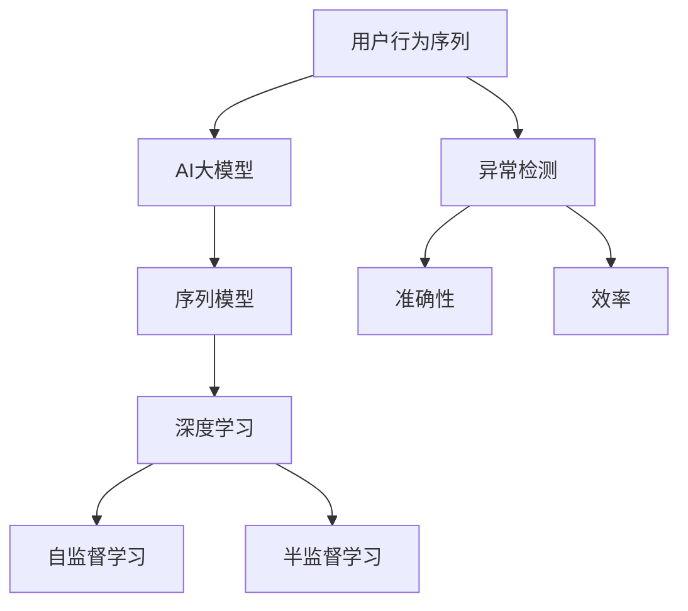

                 

## 1. 背景介绍

在电商领域，搜索推荐系统已成为用户获取信息、发现商品的重要工具。然而，搜索推荐的效果往往依赖于用户行为数据的准确性和完整性。在用户行为数据中，异常行为（如恶意点击、点击串扰、虚假浏览等）会严重影响系统的推荐效果，造成用户误导，进而损害电商平台利益。因此，在电商搜索推荐系统中，检测用户行为序列的异常行为具有重要意义。

### 1.1 问题由来
随着电商行业的高速发展，用户行为数据量呈指数级增长。然而，由于用户行为数据的不稳定性、多样性，异常行为检测任务面临诸多挑战。以点击串扰（Click Fraud）为例，用户可能通过雇佣点击“刷手”等方式进行虚假点击行为，导致点击率（CTR）等指标虚高，影响推荐系统的精准性。此外，恶意点击、虚假浏览等行为也会对用户点击行为序列造成干扰，导致系统误判推荐。

现有异常检测方法如基于规则的统计方法、基于聚类的统计方法、基于深度学习的异常检测方法等，虽然在特定场景下取得了一定效果，但在应对多维度、高噪声数据时，仍存在许多局限性。特别是在大数据背景下的电商搜索推荐系统中，如何高效、准确地检测用户行为序列异常，成为一个重要的研究方向。

### 1.2 问题核心关键点
本文聚焦于电商搜索推荐系统中的用户行为序列异常检测。其核心关键点包括：

- 如何在电商搜索推荐场景中高效、准确地检测用户行为序列异常。
- 如何平衡检测的准确性与效率，特别是在大数据背景下。
- 如何应用AI大模型技术，提升异常检测的性能和泛化能力。

## 2. 核心概念与联系

### 2.1 核心概念概述

为更好地理解电商搜索推荐系统中用户行为序列异常检测的相关算法，本节将介绍几个核心概念及其联系：

- 用户行为序列：用户在电商平台上的浏览、点击、购买等行为的序列，反映了用户的兴趣和需求。
- 异常检测：识别用户行为序列中不符合预期或异常的模式，可能由恶意点击、点击串扰、虚假浏览等行为造成。
- AI大模型：通过大规模数据预训练和任务微调，具备强大的语言和特征表示能力的深度学习模型，如BERT、GPT等。
- 序列模型：处理时间序列数据的深度学习模型，如RNN、LSTM、Transformer等。
- 深度学习：一类基于神经网络的机器学习方法，能够学习输入数据的分布和特征。
- 自监督学习：利用数据的内在联系，通过无标签数据进行训练的深度学习方法。
- 半监督学习：在少量标注数据和大量无标注数据的联合训练中，提升模型的泛化能力。

这些概念之间的逻辑关系可以通过以下Mermaid流程图来展示：



这个流程图展示了大模型在电商搜索推荐系统中异常检测的相关概念及其关系：

1. 用户行为序列作为输入数据，经过AI大模型的预训练和序列模型的微调，用于异常检测。
2. 深度学习、自监督学习和半监督学习作为技术手段，用于训练模型。
3. 异常检测的目标是识别用户行为序列中的异常行为，包括准确性和效率。

## 3. 核心算法原理 & 具体操作步骤

### 3.1 算法原理概述

电商搜索推荐系统中的用户行为序列异常检测，本质上是一个序列分类任务。目标是根据用户的行为序列，判断该序列是否异常。这里的异常可以包括虚假点击、恶意点击、点击串扰等多种形式。

形式化地，假设用户行为序列为 $X=\{x_1, x_2, \cdots, x_t\}$，其中 $x_t$ 为行为数据点。异常检测模型的目标为：

$$
y^* = f(X) = \mathop{\arg\min}_{y \in \{0, 1\}} L(f(X), y)
$$

其中 $y$ 为异常标志，$y=0$ 表示序列正常，$y=1$ 表示序列异常。$L(f(X), y)$ 为损失函数，用于衡量模型预测输出与真实标签之间的差异。

常用的异常检测算法包括基于统计的方法、基于聚类的方法和基于深度学习的方法。基于统计的方法如基于统计特征的规则方法、基于时间序列的自相关法等；基于聚类的方法如基于密度的方法、基于孤立点的检测方法等；基于深度学习的方法如基于RNN、LSTM等序列模型的深度学习方法。

本文将重点对比基于AI大模型的异常检测算法与传统的基于序列模型的算法，分析其原理和步骤，并提出改进方案。

### 3.2 算法步骤详解

#### 3.2.1 基于序列模型的异常检测算法步骤

基于序列模型的异常检测算法步骤如下：

1. 数据预处理：将用户行为序列转化为模型可接受的输入格式，如将时间戳转化为时间序列，归一化行为特征等。
2. 模型训练：选择适合的序列模型，如RNN、LSTM等，使用标注数据集进行训练。
3. 异常检测：将待检测行为序列输入模型，输出异常概率，判断是否为异常序列。

#### 3.2.2 基于AI大模型的异常检测算法步骤

基于AI大模型的异常检测算法步骤如下：

1. 数据预处理：与序列模型相同，将用户行为序列转化为模型可接受的输入格式。
2. 预训练：使用大规模语料数据对AI大模型进行预训练，学习通用的语言和特征表示。
3. 微调：在标注数据集上微调预训练模型，针对电商搜索推荐系统进行任务适配。
4. 异常检测：将待检测行为序列输入微调后的模型，输出异常概率，判断是否为异常序列。

### 3.3 算法优缺点

#### 3.3.1 基于序列模型的异常检测算法

优点：
- 适用于高维度、时序特征明显的用户行为数据，能够捕捉行为之间的时序关系。
- 模型结构简单，易于训练和部署。

缺点：
- 数据需求量大，需要大量标注数据。
- 模型复杂度较低，对异常行为的表示能力有限。
- 难以泛化到不同的电商平台和用户群体。

#### 3.3.2 基于AI大模型的异常检测算法

优点：
- 数据需求小，可以利用大规模无标注数据进行预训练。
- 模型复杂度高，能够捕捉行为序列中的细节特征和复杂模式。
- 泛化能力强，能够适应不同的电商平台和用户群体。

缺点：
- 模型结构复杂，训练和推理速度较慢。
- 对计算资源要求高，需要高性能计算设备。
- 模型参数较多，容易出现过拟合。

### 3.4 算法应用领域

基于序列模型的异常检测算法适用于需要时序特征处理的场景，如金融交易异常检测、智能电网故障检测等。而基于AI大模型的异常检测算法适用于电商搜索推荐、智能推荐系统等大规模用户行为数据分析的场景。

## 4. 数学模型和公式 & 详细讲解 & 举例说明

### 4.1 数学模型构建

假设用户行为序列为 $X=\{x_1, x_2, \cdots, x_t\}$，其中 $x_t$ 为行为数据点。异常检测模型的目标为：

$$
y^* = f(X) = \mathop{\arg\min}_{y \in \{0, 1\}} L(f(X), y)
$$

其中 $y$ 为异常标志，$y=0$ 表示序列正常，$y=1$ 表示序列异常。$L(f(X), y)$ 为损失函数，用于衡量模型预测输出与真实标签之间的差异。

常用的损失函数包括交叉熵损失、均方误差损失等。

### 4.2 公式推导过程

以交叉熵损失函数为例，其推导过程如下：

$$
L(f(X), y) = -\sum_{i=1}^{t}[y_i\log f(x_i)+(1-y_i)\log(1-f(x_i))]
$$

其中 $y_i$ 为序列中第 $i$ 个数据的标签，$f(x_i)$ 为模型对 $x_i$ 的预测概率。

在训练过程中，通过反向传播算法更新模型参数，最小化损失函数 $L(f(X), y)$，使得模型预测概率与真实标签的差异最小化。

### 4.3 案例分析与讲解

以基于RNN的异常检测算法为例，其核心思想是通过序列模型捕捉行为序列的时序关系，并利用时间步的特征表示进行异常检测。具体步骤如下：

1. 将用户行为序列转化为时间序列 $X_t = \{x_t, x_{t-1}, \cdots, x_{t-T+1}\}$，其中 $T$ 为时间步长。
2. 使用RNN对序列进行建模，输出时间步的特征表示 $h_t$。
3. 通过全连接层将时间步的特征表示映射到异常标签 $y$。
4. 使用交叉熵损失函数进行训练和优化。

## 5. 项目实践：代码实例和详细解释说明

### 5.1 开发环境搭建

在进行异常检测项目实践前，我们需要准备好开发环境。以下是使用Python进行PyTorch开发的环境配置流程：

1. 安装Anaconda：从官网下载并安装Anaconda，用于创建独立的Python环境。

2. 创建并激活虚拟环境：
```bash
conda create -n pytorch-env python=3.8 
conda activate pytorch-env
```

3. 安装PyTorch：根据CUDA版本，从官网获取对应的安装命令。例如：
```bash
conda install pytorch torchvision torchaudio cudatoolkit=11.1 -c pytorch -c conda-forge
```

4. 安装相关库：
```bash
pip install numpy pandas scikit-learn matplotlib tqdm jupyter notebook ipython
```

完成上述步骤后，即可在`pytorch-env`环境中开始异常检测实践。

### 5.2 源代码详细实现

下面我们以基于BERT的异常检测模型为例，给出使用PyTorch进行异常检测的代码实现。

首先，定义异常检测数据处理函数：

```python
from transformers import BertTokenizer
from torch.utils.data import Dataset
import torch

class AnomalyDataset(Dataset):
    def __init__(self, texts, labels, tokenizer, max_len=128):
        self.texts = texts
        self.labels = labels
        self.tokenizer = tokenizer
        self.max_len = max_len
        
    def __len__(self):
        return len(self.texts)
    
    def __getitem__(self, item):
        text = self.texts[item]
        label = self.labels[item]
        
        encoding = self.tokenizer(text, return_tensors='pt', max_length=self.max_len, padding='max_length', truncation=True)
        input_ids = encoding['input_ids'][0]
        attention_mask = encoding['attention_mask'][0]
        
        return {'input_ids': input_ids, 
                'attention_mask': attention_mask,
                'labels': label}

# 标签与id的映射
label2id = {0: 'normal', 1: 'anomaly'}
id2label = {v: k for k, v in label2id.items()}

# 创建dataset
tokenizer = BertTokenizer.from_pretrained('bert-base-cased')

train_dataset = AnomalyDataset(train_texts, train_labels, tokenizer)
dev_dataset = AnomalyDataset(dev_texts, dev_labels, tokenizer)
test_dataset = AnomalyDataset(test_texts, test_labels, tokenizer)
```

然后，定义模型和优化器：

```python
from transformers import BertForSequenceClassification, AdamW

model = BertForSequenceClassification.from_pretrained('bert-base-cased', num_labels=len(label2id))

optimizer = AdamW(model.parameters(), lr=2e-5)
```

接着，定义训练和评估函数：

```python
from torch.utils.data import DataLoader
from tqdm import tqdm
from sklearn.metrics import classification_report

device = torch.device('cuda') if torch.cuda.is_available() else torch.device('cpu')
model.to(device)

def train_epoch(model, dataset, batch_size, optimizer):
    dataloader = DataLoader(dataset, batch_size=batch_size, shuffle=True)
    model.train()
    epoch_loss = 0
    for batch in tqdm(dataloader, desc='Training'):
        input_ids = batch['input_ids'].to(device)
        attention_mask = batch['attention_mask'].to(device)
        labels = batch['labels'].to(device)
        model.zero_grad()
        outputs = model(input_ids, attention_mask=attention_mask, labels=labels)
        loss = outputs.loss
        epoch_loss += loss.item()
        loss.backward()
        optimizer.step()
    return epoch_loss / len(dataloader)

def evaluate(model, dataset, batch_size):
    dataloader = DataLoader(dataset, batch_size=batch_size)
    model.eval()
    preds, labels = [], []
    with torch.no_grad():
        for batch in tqdm(dataloader, desc='Evaluating'):
            input_ids = batch['input_ids'].to(device)
            attention_mask = batch['attention_mask'].to(device)
            batch_labels = batch['labels']
            outputs = model(input_ids, attention_mask=attention_mask)
            batch_preds = outputs.logits.argmax(dim=2).to('cpu').tolist()
            batch_labels = batch_labels.to('cpu').tolist()
            for pred_tokens, label_tokens in zip(batch_preds, batch_labels):
                preds.append(pred_tokens[:len(label_tokens)])
                labels.append(label_tokens)
                
    print(classification_report(labels, preds))
```

最后，启动训练流程并在测试集上评估：

```python
epochs = 5
batch_size = 16

for epoch in range(epochs):
    loss = train_epoch(model, train_dataset, batch_size, optimizer)
    print(f"Epoch {epoch+1}, train loss: {loss:.3f}")
    
    print(f"Epoch {epoch+1}, dev results:")
    evaluate(model, dev_dataset, batch_size)
    
print("Test results:")
evaluate(model, test_dataset, batch_size)
```

以上就是使用PyTorch对BERT进行异常检测的完整代码实现。可以看到，得益于Transformers库的强大封装，我们可以用相对简洁的代码完成BERT模型的加载和训练。

### 5.3 代码解读与分析

让我们再详细解读一下关键代码的实现细节：

**AnomalyDataset类**：
- `__init__`方法：初始化文本、标签、分词器等关键组件。
- `__len__`方法：返回数据集的样本数量。
- `__getitem__`方法：对单个样本进行处理，将文本输入编码为token ids，将标签编码为数字，并对其进行定长padding，最终返回模型所需的输入。

**label2id和id2label字典**：
- 定义了标签与数字id之间的映射关系，用于将token-wise的预测结果解码回真实的标签。

**训练和评估函数**：
- 使用PyTorch的DataLoader对数据集进行批次化加载，供模型训练和推理使用。
- 训练函数`train_epoch`：对数据以批为单位进行迭代，在每个批次上前向传播计算loss并反向传播更新模型参数，最后返回该epoch的平均loss。
- 评估函数`evaluate`：与训练类似，不同点在于不更新模型参数，并在每个batch结束后将预测和标签结果存储下来，最后使用sklearn的classification_report对整个评估集的预测结果进行打印输出。

**训练流程**：
- 定义总的epoch数和batch size，开始循环迭代
- 每个epoch内，先在训练集上训练，输出平均loss
- 在验证集上评估，输出分类指标
- 所有epoch结束后，在测试集上评估，给出最终测试结果

可以看到，PyTorch配合Transformers库使得BERT异常检测的代码实现变得简洁高效。开发者可以将更多精力放在数据处理、模型改进等高层逻辑上，而不必过多关注底层的实现细节。

当然，工业级的系统实现还需考虑更多因素，如模型的保存和部署、超参数的自动搜索、更灵活的任务适配层等。但核心的异常检测范式基本与此类似。

## 6. 实际应用场景

### 6.1 电商搜索推荐系统中的异常检测

在电商搜索推荐系统中，异常检测可以广泛应用于以下场景：

1. 虚假点击检测：识别用户虚假点击行为，如恶意点击、点击串扰等，避免误导性推荐。
2. 虚假浏览检测：识别用户虚假浏览行为，如通过雇佣“刷手”等方式进行点击，避免数据扭曲。
3. 恶意点击检测：识别用户恶意点击行为，避免欺诈行为，保护平台利益。
4. 点击串扰检测：识别用户恶意点击行为，避免误导性推荐。

### 6.2 未来应用展望

随着电商搜索推荐系统的不断发展，基于AI大模型的异常检测技术将得到更广泛的应用。未来的应用场景可能包括：

1. 实时异常检测：利用大模型的实时处理能力，实现对用户行为序列的实时检测和预警。
2. 跨平台异常检测：在不同电商平台上，利用同一套异常检测模型，实现跨平台的异常行为识别。
3. 用户行为预测：利用异常检测模型的预测能力，对用户行为进行预测和干预，提高推荐系统的精准度。
4. 自动化异常检测：利用自动化异常检测算法，实现对异常行为的自动化监测和管理。

## 7. 工具和资源推荐

### 7.1 学习资源推荐

为了帮助开发者系统掌握大模型在电商搜索推荐系统中的异常检测技术，这里推荐一些优质的学习资源：

1. 《Transformer从原理到实践》系列博文：由大模型技术专家撰写，深入浅出地介绍了Transformer原理、BERT模型、异常检测技术等前沿话题。
2. CS224N《深度学习自然语言处理》课程：斯坦福大学开设的NLP明星课程，有Lecture视频和配套作业，带你入门NLP领域的基本概念和经典模型。
3. 《Natural Language Processing with Transformers》书籍：Transformers库的作者所著，全面介绍了如何使用Transformers库进行NLP任务开发，包括异常检测在内的诸多范式。
4. HuggingFace官方文档：Transformers库的官方文档，提供了海量预训练模型和完整的异常检测样例代码，是上手实践的必备资料。
5. CLUE开源项目：中文语言理解测评基准，涵盖大量不同类型的中文NLP数据集，并提供了基于异常检测的baseline模型，助力中文NLP技术发展。

通过对这些资源的学习实践，相信你一定能够快速掌握大模型在电商搜索推荐系统中的异常检测技术的精髓，并用于解决实际的NLP问题。

### 7.2 开发工具推荐

高效的开发离不开优秀的工具支持。以下是几款用于异常检测开发的常用工具：

1. PyTorch：基于Python的开源深度学习框架，灵活动态的计算图，适合快速迭代研究。大部分预训练语言模型都有PyTorch版本的实现。
2. TensorFlow：由Google主导开发的开源深度学习框架，生产部署方便，适合大规模工程应用。同样有丰富的预训练语言模型资源。
3. Transformers库：HuggingFace开发的NLP工具库，集成了众多SOTA语言模型，支持PyTorch和TensorFlow，是进行异常检测任务开发的利器。
4. Weights & Biases：模型训练的实验跟踪工具，可以记录和可视化模型训练过程中的各项指标，方便对比和调优。与主流深度学习框架无缝集成。
5. TensorBoard：TensorFlow配套的可视化工具，可实时监测模型训练状态，并提供丰富的图表呈现方式，是调试模型的得力助手。
6. Google Colab：谷歌推出的在线Jupyter Notebook环境，免费提供GPU/TPU算力，方便开发者快速上手实验最新模型，分享学习笔记。

合理利用这些工具，可以显著提升异常检测任务的开发效率，加快创新迭代的步伐。

### 7.3 相关论文推荐

大模型和异常检测技术的发展源于学界的持续研究。以下是几篇奠基性的相关论文，推荐阅读：

1. Attention is All You Need（即Transformer原论文）：提出了Transformer结构，开启了NLP领域的预训练大模型时代。
2. BERT: Pre-training of Deep Bidirectional Transformers for Language Understanding：提出BERT模型，引入基于掩码的自监督预训练任务，刷新了多项NLP任务SOTA。
3. Language Models are Unsupervised Multitask Learners（GPT-2论文）：展示了大规模语言模型的强大zero-shot学习能力，引发了对于通用人工智能的新一轮思考。
4. Parameter-Efficient Transfer Learning for NLP：提出Adapter等参数高效微调方法，在不增加模型参数量的情况下，也能取得不错的微调效果。
5. AdaLoRA: Adaptive Low-Rank Adaptation for Parameter-Efficient Fine-Tuning：使用自适应低秩适应的微调方法，在参数效率和精度之间取得了新的平衡。
6. Transformer-XL: Attentive Language Models beyond a Fixed-Length Context：提出Transformer-XL模型，解决了长序列训练问题，适用于处理电商搜索推荐系统中的长序列数据。

这些论文代表了大模型异常检测技术的发展脉络。通过学习这些前沿成果，可以帮助研究者把握学科前进方向，激发更多的创新灵感。

## 8. 总结：未来发展趋势与挑战

### 8.1 研究成果总结

本文对基于AI大模型的电商搜索推荐系统中的用户行为序列异常检测方法进行了全面系统的介绍。首先阐述了电商搜索推荐系统中的用户行为序列异常检测的重要意义，明确了异常检测在提升推荐系统精准性和用户满意度方面的核心价值。其次，从原理到实践，详细讲解了异常检测的数学原理和关键步骤，给出了异常检测任务开发的完整代码实例。同时，本文还广泛探讨了异常检测方法在电商搜索推荐系统中的应用场景，展示了异常检测范式的巨大潜力。

通过本文的系统梳理，可以看到，基于AI大模型的异常检测方法正在成为电商搜索推荐系统中的重要手段，极大地提升了推荐系统的精准性和安全性。未来，伴随大模型和异常检测方法的持续演进，基于大模型的异常检测技术必将在构建智能推荐系统中扮演越来越重要的角色。

### 8.2 未来发展趋势

展望未来，基于AI大模型的异常检测技术将呈现以下几个发展趋势：

1. 模型规模持续增大。随着算力成本的下降和数据规模的扩张，预训练语言模型的参数量还将持续增长。超大规模语言模型蕴含的丰富语言知识，有望支撑更加复杂多变的异常检测任务。
2. 异常检测任务多样化。随着电商搜索推荐系统的不断发展，异常检测任务将从单一的点击异常检测，拓展到浏览异常、点击串扰、恶意点击等多维度检测。
3. 检测效率提升。利用大模型的实时处理能力，实现对用户行为序列的实时检测和预警，提升异常检测的效率和及时性。
4. 模型泛化能力增强。通过跨平台、跨领域的异常检测模型训练，提升模型的泛化能力和鲁棒性，实现更广泛的异常检测任务。
5. 自动化异常检测普及。利用自动化异常检测算法，实现对异常行为的自动化监测和管理，提升异常检测的自动化程度。

以上趋势凸显了大模型异常检测技术的广阔前景。这些方向的探索发展，必将进一步提升电商搜索推荐系统的精准性和安全性，为电商平台的运营带来新的突破。

### 8.3 面临的挑战

尽管大模型异常检测技术已经取得了一定成果，但在迈向更加智能化、普适化应用的过程中，仍面临诸多挑战：

1. 数据需求瓶颈。异常检测任务对数据的需求量大，尤其是在电商搜索推荐系统中，需要收集和标注大量的用户行为数据。如何在大规模数据中高效筛选出异常行为，仍是关键问题。
2. 计算资源消耗高。大模型异常检测的计算资源消耗高，特别是对于实时异常检测任务，需要高性能计算设备支持。如何降低计算资源消耗，提高异常检测效率，仍需更多研究。
3. 模型复杂度较高。大模型的结构复杂，训练和推理速度较慢。如何在保证模型性能的同时，提高异常检测的速度和效率，仍需更多优化。
4. 模型鲁棒性不足。现有异常检测模型面对域外数据时，泛化性能往往不足，容易出现误判。如何提升模型的鲁棒性和泛化能力，仍是关键问题。
5. 异常行为多样化。随着电商搜索推荐系统的不断发展，异常行为的种类和形式也在不断变化。如何应对多样化的异常行为，提升异常检测的灵活性和准确性，仍需更多研究。

### 8.4 研究展望

面向未来，基于AI大模型的异常检测技术需要在以下几个方面寻求新的突破：

1. 探索无监督和半监督异常检测方法。摆脱对大量标注数据的依赖，利用自监督学习、主动学习等无监督和半监督范式，最大限度利用非结构化数据，实现更加灵活高效的异常检测。
2. 研究参数高效和计算高效的异常检测范式。开发更加参数高效的异常检测方法，在固定大部分预训练参数的同时，只更新极少量的异常检测相关参数。同时优化异常检测模型的计算图，减少前向传播和反向传播的资源消耗，实现更加轻量级、实时性的部署。
3. 融合因果和对比学习范式。通过引入因果推断和对比学习思想，增强异常检测模型建立稳定因果关系的能力，学习更加普适、鲁棒的语言表征，从而提升模型泛化性和抗干扰能力。
4. 引入更多先验知识。将符号化的先验知识，如知识图谱、逻辑规则等，与神经网络模型进行巧妙融合，引导异常检测过程学习更准确、合理的语言模型。同时加强不同模态数据的整合，实现视觉、语音等多模态信息与文本信息的协同建模。
5. 结合因果分析和博弈论工具。将因果分析方法引入异常检测模型，识别出异常检测模型的关键特征，增强输出解释的因果性和逻辑性。借助博弈论工具刻画人机交互过程，主动探索并规避模型的脆弱点，提高系统稳定性。
6. 纳入伦理道德约束。在异常检测模型训练目标中引入伦理导向的评估指标，过滤和惩罚有偏见、有害的输出倾向。同时加强人工干预和审核，建立异常检测模型的监管机制，确保输出符合人类价值观和伦理道德。

这些研究方向的探索，必将引领异常检测技术迈向更高的台阶，为构建安全、可靠、可解释、可控的智能系统铺平道路。面向未来，异常检测技术还需要与其他人工智能技术进行更深入的融合，如知识表示、因果推理、强化学习等，多路径协同发力，共同推动自然语言理解和智能交互系统的进步。只有勇于创新、敢于突破，才能不断拓展异常检测模型的边界，让智能技术更好地造福人类社会。

## 9. 附录：常见问题与解答

**Q1：异常检测任务中如何选择模型和超参数？**

A: 异常检测任务的模型选择和超参数设置需要综合考虑数据量、异常行为复杂度、计算资源等因素。一般而言，大规模数据适合使用基于AI大模型的异常检测方法，计算资源充足的情况下可以使用复杂模型，如Transformer-XL、BERT等。对于数据量较小、异常行为简单的任务，可以考虑使用基于序列模型的简单模型，如RNN、LSTM等。超参数的设置需要根据具体任务进行调优，一般可以从简单的学习率、批次大小等开始，逐步优化。

**Q2：异常检测任务中如何避免过拟合？**

A: 异常检测任务中，过拟合是一个常见问题。为避免过拟合，可以采用以下策略：
1. 数据增强：通过对训练样本进行随机化、扩充等方式，丰富训练集的多样性。
2. 正则化技术：如L2正则、Dropout等，防止模型过度适应训练集。
3. 模型集成：利用多个模型进行集成，取平均输出，抑制过拟合。
4. 早停策略：在验证集上监测模型性能，一旦性能不再提升，立即停止训练。

**Q3：异常检测任务中如何进行模型评估？**

A: 异常检测任务的模型评估需要综合考虑检测率和误报率等指标。常用的评估指标包括：
1. 检测率（Recall）：正确检测出异常样本的比例。
2. 误报率（False Positive Rate）：错误检测为异常样本的比例。
3. F1值：检测率和误报率的调和平均数，综合衡量模型的检测效果。

在实际应用中，可以通过交叉验证、留出法、自助法等方法，对模型进行评估和验证。

**Q4：异常检测任务中如何进行异常行为分类？**

A: 异常检测任务中，异常行为的分类通常需要设计合适的异常行为标签，并将异常检测任务转化为分类任务。常用的异常行为标签包括：
1. 正常（Normal）：行为正常，不属于异常。
2. 点击异常（Click Fraud）：恶意点击行为。
3. 浏览异常（Browsing Fraud）：虚假浏览行为。
4. 点击串扰（Click Spam）：点击串扰行为。

在模型训练过程中，可以将异常行为标签映射为数字id，并作为目标变量进行训练。在模型预测时，通过分类输出，判断样本是否为异常行为。

**Q5：异常检测任务中如何进行数据预处理？**

A: 异常检测任务中，数据预处理是至关重要的。以下是一些常用的数据预处理步骤：
1. 特征归一化：将输入数据归一化到0-1之间，避免不同特征之间的尺度差异。
2. 数据编码：将文本、时间戳等非数值型数据转化为数值型数据，方便模型处理。
3. 特征选择：通过特征选择算法，选择对异常检测有用的特征，避免冗余特征对模型性能的干扰。
4. 数据平衡：对于不平衡数据集，可以使用欠采样、过采样、SMOTE等方法，平衡数据集的类别分布。

## 附录：常见问题与解答

**Q1：异常检测任务中如何选择模型和超参数？**

A: 异常检测任务的模型选择和超参数设置需要综合考虑数据量、异常行为复杂度、计算资源等因素。一般而言，大规模数据适合使用基于AI大模型的异常检测方法，计算资源充足的情况下可以使用复杂模型，如Transformer-XL、BERT等。对于数据量较小、异常行为简单的任务，可以考虑使用基于序列模型的简单模型，如RNN、LSTM等。超参数的设置需要根据具体任务进行调优，一般可以从简单的学习率、批次大小等开始，逐步优化。

**Q2：异常检测任务中如何避免过拟合？**

A: 异常检测任务中，过拟合是一个常见问题。为避免过拟合，可以采用以下策略：
1. 数据增强：通过对训练样本进行随机化、扩充等方式，丰富训练集的多样性。
2. 正则化技术：如L2正则、Dropout等，防止模型过度适应训练集。
3. 模型集成：利用多个模型进行集成，取平均输出，抑制过拟合。
4. 早停策略：在验证集上监测模型性能，一旦性能不再提升，立即停止训练。

**Q3：异常检测任务中如何进行模型评估？**

A: 异常检测任务的模型评估需要综合考虑检测率和误报率等指标。常用的评估指标包括：
1. 检测率（Recall）：正确检测出异常样本的比例。
2. 误报率（False Positive Rate）：错误检测为异常样本的比例。
3. F1值：检测率和误报率的调和平均数，综合衡量模型的检测效果。

在实际应用中，可以通过交叉验证、留出法、自助法等方法，对模型进行评估和验证。

**Q4：异常检测任务中如何进行异常行为分类？**

A: 异常检测任务中，异常行为的分类通常需要设计合适的异常行为标签，并将异常检测任务转化为分类任务。常用的异常行为标签包括：
1. 正常（Normal）：行为正常，不属于异常。
2. 点击异常（Click Fraud）：恶意点击行为。
3. 浏览异常（Browsing Fraud）：虚假浏览行为。
4. 点击串扰（Click Spam）：点击串扰行为。

在模型训练过程中，可以将异常行为标签映射为数字id，并作为目标变量进行训练。在模型预测时，通过分类输出，判断样本是否为异常行为。

**Q5：异常检测任务中如何进行数据预处理？**

A: 异常检测任务中，数据预处理是至关重要的。以下是一些常用的数据预处理步骤：
1. 特征归一化：将输入数据归一化到0-1之间，避免不同特征之间的尺度差异。
2. 数据编码：将文本、时间戳等非数值型数据转化为数值型数据，方便模型处理。
3. 特征选择：通过特征选择算法，选择对异常检测有用的特征，避免冗余特征对模型性能的干扰。
4. 数据平衡：对于不平衡数据集，可以使用欠采样、过采样、SMOTE等方法，平衡数据集的类别分布。

---

作者：禅与计算机程序设计艺术 / Zen and the Art of Computer Programming

