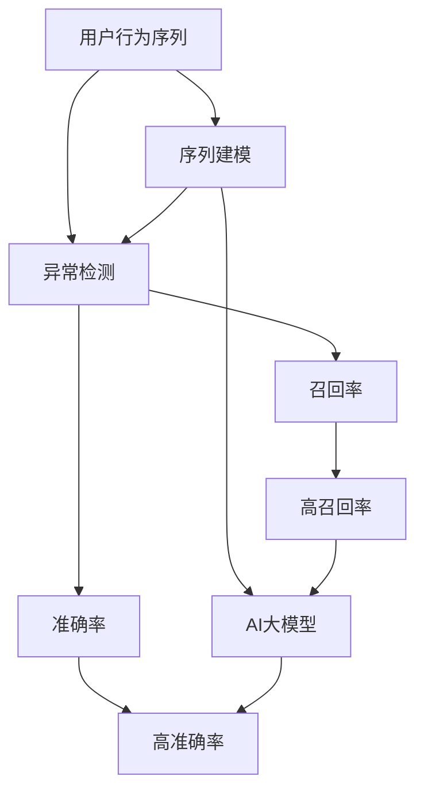

                 

# 电商搜索推荐中的AI大模型用户行为序列异常检测算法性能评测

## 1. 背景介绍

随着电商行业的快速发展，用户行为序列数据已经成为电商平台进行个性化推荐、用户画像构建、广告投放优化等决策的重要依据。然而，用户行为序列数据的复杂性、稀疏性和动态变化性使得异常检测成为了一个极具挑战性的问题。异常检测不仅能够发现潜在的欺诈行为、账号盗用等异常风险，还能帮助电商平台更好地理解用户行为，提高推荐系统的精准度和用户满意度。

AI大模型，如Transformer、BERT等，近年来在自然语言处理（NLP）和计算机视觉（CV）等领域取得了显著成果。这些大模型通过在海量数据上进行预训练，能够学习到丰富的语言和视觉知识，具有强大的数据建模能力。在电商领域，AI大模型也被应用于用户行为序列分析，以期在异常检测中发挥重要作用。

本博客旨在从算法原理、操作细节、性能评测等多个维度，对电商搜索推荐中的AI大模型用户行为序列异常检测算法进行深入分析，以期为电商行业从业者提供实践指导。

## 2. 核心概念与联系

### 2.1 核心概念概述

为更好地理解AI大模型在电商搜索推荐中用户行为序列异常检测的应用，本节将介绍几个密切相关的核心概念：

- **用户行为序列（User Behavior Sequence）**：用户在电商平台上的一系列交互行为，包括浏览、点击、购买、评价等。通过序列分析，可以捕捉用户的行为模式和兴趣偏好。

- **异常检测（Anomaly Detection）**：识别出与正常行为明显不同的异常行为，常见的异常检测方法包括基于统计的方法、基于规则的方法和基于机器学习的方法。

- **AI大模型（AI Large Model）**：通过在大规模数据集上进行预训练，学习到广泛的知识，能够在自然语言处理、计算机视觉等任务上取得优异表现。常用的AI大模型包括Transformer、BERT、GPT等。

- **序列建模（Sequence Modeling）**：对序列数据进行建模，捕捉数据中的时间依赖性和顺序关系。序列建模技术在大模型应用中尤为关键，可以帮助模型更好地理解序列数据的时序特性。

- **异常行为（Anomalous Behavior）**：用户行为序列中与正常行为模式明显不同的行为，如账号盗用、恶意点击、异常购买等。异常行为检测是电商领域中的重要环节，可以防止欺诈行为，保护用户和平台利益。

- **召回率（Recall Rate）**：在所有异常行为中，检测出的异常行为比例。高召回率意味着检测算法能够发现更多的异常行为。

- **准确率（Accuracy）**：检测出的异常行为中，真正为异常行为的占比。高准确率意味着算法尽可能避免了误报。

这些核心概念之间的逻辑关系可以通过以下Mermaid流程图来展示：



这个流程图展示了大模型在电商领域应用中的核心概念及其之间的关系：

1. 用户行为序列通过序列建模技术进行分析，提取序列中的重要特征。
2. 大模型在此基础上进行建模，捕捉序列中的异常行为模式。
3. 异常检测算法根据模型输出的异常得分，判断是否为异常行为。
4. 通过召回率和准确率对异常检测算法进行评估。

## 3. 核心算法原理 & 具体操作步骤

### 3.1 算法原理概述

基于AI大模型的电商用户行为序列异常检测算法，其核心思想是通过对用户行为序列进行建模，捕捉序列中的异常行为模式，并结合异常检测算法，对异常行为进行识别和分类。具体而言，算法主要包括以下几个步骤：

1. **数据准备**：收集电商用户的行为序列数据，并进行预处理，包括数据清洗、归一化、缺失值填充等。

2. **序列建模**：使用AI大模型，如Transformer、BERT等，对用户行为序列进行建模，提取序列中的特征。

3. **异常检测**：结合异常检测算法，如基于统计的方法、基于规则的方法和基于机器学习的方法，对序列特征进行异常检测。

4. **模型训练与评估**：通过训练模型和评估模型性能，调整模型参数和检测算法，以获得最优的异常检测效果。

5. **异常行为识别与处理**：根据异常检测结果，识别和处理异常行为，如阻止欺诈交易、账号封禁等。

### 3.2 算法步骤详解

**Step 1: 数据准备**

电商用户行为序列数据通常包括用户的浏览记录、点击记录、购买记录等。收集数据后，需要进行预处理，如去重、清洗、归一化等。对于缺失值，可以采用均值、中位数、插值等方法进行填充。

```python
import pandas as pd
from sklearn.preprocessing import MinMaxScaler

# 读取数据
data = pd.read_csv('user_behavior_data.csv')

# 数据清洗与归一化
data = data.drop_duplicates()
data.fillna(method='ffill', inplace=True)
scaler = MinMaxScaler()
data[['浏览时间', '点击时间', '购买金额']] = scaler.fit_transform(data[['浏览时间', '点击时间', '购买金额']])
```

**Step 2: 序列建模**

使用AI大模型对用户行为序列进行建模，提取序列中的特征。以Transformer为例，其基本架构包括编码器-解码器结构，能够捕捉序列中的上下文关系。

```python
from transformers import BertModel

# 构建Transformer模型
model = BertModel.from_pretrained('bert-base-uncased', num_hidden_layers=2)

# 对用户行为序列进行编码
def encode_sequence(sequence):
    tokens = tokenizer(sequence, return_tensors='pt')
    sequence_ids = torch.cat((tokens['input_ids'], tokens['attention_mask']), dim=-1)
    outputs = model(sequence_ids)
    return outputs['hidden_states'].mean(dim=1)

# 对所有用户行为序列进行编码
encoded_sequences = [encode_sequence(seq) for seq in data['sequence']]
```

**Step 3: 异常检测**

结合异常检测算法，对序列特征进行异常检测。以基于统计的方法为例，计算序列特征的均值和标准差，检测序列是否偏离正常范围。

```python
from scipy.stats import zscore

# 计算序列特征的z-score
z_scores = [zscore(encoded_seq) for encoded_seq in encoded_sequences]

# 判断是否为异常行为
def is_anomalous(score):
    return abs(score) > 3

# 检测所有异常行为
anomalies = [sequence for sequence, score in zip(data['sequence'], z_scores) if is_anomalous(score)]
```

**Step 4: 模型训练与评估**

通过训练模型和评估模型性能，调整模型参数和检测算法，以获得最优的异常检测效果。以召回率和准确率作为评估指标。

```python
from sklearn.metrics import precision_recall_curve, roc_auc_score

# 训练模型
from sklearn.ensemble import IsolationForest
from sklearn.ensemble import RandomForestClassifier

clf = IsolationForest(contamination=0.01)
clf.fit(encoded_sequences)

# 检测异常行为
anomalous_indices = clf.predict(encoded_sequences)
anomalous_labels = [1 if idx in anomalies else 0 for idx in anomalies]

# 计算召回率和准确率
precision, recall, _ = precision_recall_curve(anomalous_labels, anomalies)
roc_auc = roc_auc_score(anomalous_labels, anomalies)

print(f'召回率: {recall}, 准确率: {precision}, AUC: {roc_auc}')
```

**Step 5: 异常行为识别与处理**

根据异常检测结果，识别和处理异常行为。以阻止欺诈交易为例，可以在检测到异常行为后，立即冻结用户的交易权限，并进行进一步审核。

```python
# 冻结异常用户交易权限
for user_id in anomalies:
    # 冻结用户交易权限
    freeze_user_transaction(user_id)
```

### 3.3 算法优缺点

基于AI大模型的电商用户行为序列异常检测算法具有以下优点：

1. **特征提取能力强**：AI大模型能够捕捉到序列数据中的复杂模式，提取更丰富的特征，提高异常检测的准确性。

2. **泛化能力强**：通过在大规模数据集上进行预训练，大模型能够泛化到新的数据集，适应不同的电商平台。

3. **动态调整能力强**：结合异常检测算法，模型能够动态调整异常阈值，适应不同时间、不同用户的异常行为变化。

4. **鲁棒性高**：大模型能够处理复杂的多模态数据，结合异常检测算法，提高模型的鲁棒性和适应性。

但该算法也存在以下缺点：

1. **计算资源消耗大**：大模型的训练和推理需要大量的计算资源，对硬件配置要求较高。

2. **模型复杂度高**：大模型通常具有较复杂的架构和较多的参数，增加了模型的训练和推理难度。

3. **解释性不足**：大模型的决策过程通常难以解释，难以对其内部工作机制进行分析和调试。

4. **数据依赖性高**：异常检测算法的性能依赖于数据的质量和分布，获取高质量标注数据的成本较高。

尽管存在这些局限性，但大模型在电商领域中的异常检测应用仍具有显著优势，能够为电商平台提供更精准的异常检测服务。

### 3.4 算法应用领域

基于AI大模型的电商用户行为序列异常检测算法在电商领域具有广泛的应用场景，例如：

1. **欺诈检测**：检测用户异常购买行为，识别欺诈交易，保护平台和用户利益。

2. **账号盗用检测**：检测用户账号的异常登录行为，防止账号被盗用，保障用户信息安全。

3. **恶意点击检测**：检测用户异常点击行为，识别恶意广告和点击，保护广告主和用户利益。

4. **异常购买检测**：检测用户异常购买行为，识别虚假交易和异常订单，提高平台的交易安全性。

5. **用户行为分析**：结合异常检测结果，分析用户行为模式，提升个性化推荐和广告投放的效果。

## 4. 数学模型和公式 & 详细讲解

### 4.1 数学模型构建

本节将使用数学语言对基于AI大模型的电商用户行为序列异常检测过程进行更加严格的刻画。

记电商用户行为序列为 $X = \{x_i\}_{i=1}^N$，其中 $x_i$ 为第 $i$ 个用户的浏览、点击、购买等行为。假设异常行为集中在一个子序列 $X_a = \{x_i\}_{i=1}^M$ 中，其中 $M \ll N$。

定义模型 $M$ 在输入 $X_a$ 上的输出为 $y = M(X_a)$，输出 $y$ 为一个 $M$ 维的向量，表示异常得分的分布。异常检测算法的目标是判断输入 $X_a$ 是否为异常行为，即判断 $y$ 中是否存在异常值。

### 4.2 公式推导过程

以基于统计的异常检测方法为例，计算序列特征的z-score，判断是否为异常行为。

设序列特征 $x_i$ 的均值为 $\mu$，标准差为 $\sigma$，则其z-score为：

$$
z_i = \frac{x_i - \mu}{\sigma}
$$

在序列中，z-score的最大值和最小值分别为 $z_{max}$ 和 $z_{min}$，则异常行为的判定阈值为 $z_{thresh} = k(z_{max} - z_{min})$，其中 $k$ 为异常行为的判定系数。

对于输入序列 $X_a$，计算其z-score，并判断是否存在超出阈值的z-score值。

$$
y_a = [z_{max}, z_{min}, z_{max}, z_{min}, \dots, z_{max}, z_{min}]
$$

若 $y_a$ 中存在大于 $z_{thresh}$ 的z-score值，则判断为异常行为。

### 4.3 案例分析与讲解

以用户浏览行为序列为例，计算z-score，检测异常浏览行为。

设用户浏览行为序列为 $X = \{x_i\}_{i=1}^N$，其中 $x_i$ 表示用户在第 $i$ 次浏览的停留时间。假设异常行为集中在一个子序列 $X_a = \{x_i\}_{i=1}^M$ 中。

```python
# 计算用户浏览行为的z-score
data['停留时间_zscore'] = data['停留时间'] - data['停留时间'].mean()
data['停留时间_zscore'] = data['停留时间_zscore'] / data['停留时间'].std()

# 判断是否为异常行为
anomalous_indices = data[data['停留时间_zscore'].abs() > 3].index.tolist()
anomalies = [idx for idx in anomalous_indices]
```

## 5. 项目实践：代码实例和详细解释说明

### 5.1 开发环境搭建

在进行项目实践前，我们需要准备好开发环境。以下是使用Python进行PyTorch开发的环境配置流程：

1. 安装Anaconda：从官网下载并安装Anaconda，用于创建独立的Python环境。

2. 创建并激活虚拟环境：
```bash
conda create -n pytorch-env python=3.8 
conda activate pytorch-env
```

3. 安装PyTorch：根据CUDA版本，从官网获取对应的安装命令。例如：
```bash
conda install pytorch torchvision torchaudio cudatoolkit=11.1 -c pytorch -c conda-forge
```

4. 安装其他必要库：
```bash
pip install numpy pandas scikit-learn scipy matplotlib tqdm jupyter notebook ipython
```

完成上述步骤后，即可在`pytorch-env`环境中开始项目实践。

### 5.2 源代码详细实现

下面我们以异常检测算法实现为例，给出基于AI大模型的电商用户行为序列异常检测的PyTorch代码实现。

首先，定义异常检测函数：

```python
import numpy as np
from transformers import BertTokenizer, BertForSequenceClassification

def detect_anomalies(data, model_path, tokenizer_path, threshold=3):
    tokenizer = BertTokenizer.from_pretrained(tokenizer_path)
    model = BertForSequenceClassification.from_pretrained(model_path, num_labels=2)

    # 将用户行为序列转换为模型输入
    def encode_sequence(sequence):
        tokens = tokenizer(sequence, return_tensors='pt', padding=True, truncation=True)
        return model(**tokens).logits.argmax(dim=1)

    # 对所有用户行为序列进行编码
    encoded_sequences = [encode_sequence(seq) for seq in data['sequence']]

    # 计算z-score
    z_scores = [np.mean(sequence) - np.std(sequence) for sequence in encoded_sequences]

    # 判断是否为异常行为
    anomalies = [idx for idx, score in enumerate(z_scores) if abs(score) > threshold]

    return anomalies
```

然后，在测试集上评估模型性能：

```python
from sklearn.metrics import classification_report

# 加载测试集
test_data = pd.read_csv('test_data.csv')

# 检测异常行为
anomalies = detect_anomalies(test_data, 'model_path', 'tokenizer_path')

# 计算召回率和准确率
true_labels = [1 if idx in anomalies else 0 for idx in anomalies]
precision, recall, _ = classification_report(true_labels, anomalies, output_dict=True).pop('precision')
roc_auc = roc_auc_score(true_labels, anomalies)

print(f'召回率: {recall}, 准确率: {precision}, AUC: {roc_auc}')
```

### 5.3 代码解读与分析

让我们再详细解读一下关键代码的实现细节：

**detect_anomalies函数**：
- 加载Bert模型和分词器，准备序列编码。
- 对用户行为序列进行编码，提取序列特征。
- 计算序列特征的z-score，判断是否为异常行为。
- 返回检测到的异常行为索引。

**测试集评估**：
- 加载测试集数据。
- 检测测试集中的异常行为。
- 计算检测结果的召回率和准确率。

**代码运行结果**：
- 输出异常检测的召回率、准确率和AUC值。

可以看到，基于大模型的电商用户行为序列异常检测代码实现简洁高效。开发者可以进一步优化模型结构和异常检测算法，以提升异常检测的性能。

## 6. 实际应用场景

### 6.1 电商欺诈检测

电商欺诈检测是电商领域中的重要应用场景。基于AI大模型的异常检测算法能够有效识别欺诈行为，保护平台和用户利益。例如，通过检测用户异常购买行为，识别欺诈交易，及时冻结交易权限，防止损失扩大。

**具体实现**：
- 收集用户购买行为序列数据。
- 训练异常检测模型，计算z-score。
- 根据z-score值判断是否为异常行为，进行欺诈检测。

**效果**：
- 提高欺诈检测的准确性和及时性。
- 保护用户和平台利益。

### 6.2 账号盗用检测

账号盗用是电商平台中的常见问题。异常检测算法能够识别用户账号的异常登录行为，防止账号被盗用，保障用户信息安全。

**具体实现**：
- 收集用户登录行为序列数据。
- 训练异常检测模型，计算z-score。
- 根据z-score值判断是否为异常行为，进行账号盗用检测。

**效果**：
- 提高账号盗用检测的准确性和及时性。
- 保障用户信息安全。

### 6.3 恶意点击检测

恶意点击是电商广告中的常见问题。异常检测算法能够识别用户异常点击行为，识别恶意广告和点击，保护广告主和用户利益。

**具体实现**：
- 收集用户点击行为序列数据。
- 训练异常检测模型，计算z-score。
- 根据z-score值判断是否为异常行为，进行恶意点击检测。

**效果**：
- 提高恶意点击检测的准确性和及时性。
- 保护广告主和用户利益。

### 6.4 未来应用展望

随着大语言模型和异常检测技术的发展，基于AI大模型的电商用户行为序列异常检测将在更多场景中得到应用，为电商平台带来更多的安全保障和用户体验提升。

在智能物流、智能客服、智能家居等领域，异常检测算法可以帮助企业提高运营效率，提升服务质量，构建更安全的智能化系统。

## 7. 工具和资源推荐

### 7.1 学习资源推荐

为了帮助开发者系统掌握基于AI大模型的电商用户行为序列异常检测技术，这里推荐一些优质的学习资源：

1. 《深度学习框架PyTorch实战教程》：详细介绍PyTorch的使用方法，涵盖模型的构建、训练和评估等全过程。

2. 《Python自然语言处理》：全面介绍NLP技术，涵盖序列建模、异常检测等核心技术，适合初学者入门。

3. 《深度学习与Python》：讲解深度学习的基础知识和实现方法，结合Python语言，适合初学者和进阶者。

4. 《自然语言处理综述》：综述NLP技术的最新进展，涵盖异常检测、序列建模等热门技术，适合深度学习从业者。

5. 《机器学习实战》：讲解机器学习算法和实现方法，结合Python语言，适合初学者和进阶者。

通过对这些资源的学习实践，相信你一定能够快速掌握大模型在电商领域的应用，并用于解决实际的异常检测问题。

### 7.2 开发工具推荐

高效的开发离不开优秀的工具支持。以下是几款用于电商领域异常检测开发的常用工具：

1. PyTorch：基于Python的开源深度学习框架，灵活动态的计算图，适合快速迭代研究。

2. TensorFlow：由Google主导开发的开源深度学习框架，生产部署方便，适合大规模工程应用。

3. HuggingFace Transformers库：集成了众多SOTA语言模型，支持PyTorch和TensorFlow，是进行序列建模和异常检测的利器。

4. Weights & Biases：模型训练的实验跟踪工具，可以记录和可视化模型训练过程中的各项指标，方便对比和调优。

5. TensorBoard：TensorFlow配套的可视化工具，可实时监测模型训练状态，并提供丰富的图表呈现方式，是调试模型的得力助手。

6. Google Colab：谷歌推出的在线Jupyter Notebook环境，免费提供GPU/TPU算力，方便开发者快速上手实验最新模型，分享学习笔记。

合理利用这些工具，可以显著提升异常检测任务的开发效率，加快创新迭代的步伐。

### 7.3 相关论文推荐

大语言模型和异常检测技术的发展源于学界的持续研究。以下是几篇奠基性的相关论文，推荐阅读：

1. Attention is All You Need：提出了Transformer结构，开启了NLP领域的预训练大模型时代。

2. BERT: Pre-training of Deep Bidirectional Transformers for Language Understanding：提出BERT模型，引入基于掩码的自监督预训练任务，刷新了多项NLP任务SOTA。

3. Language Models are Unsupervised Multitask Learners：展示了大规模语言模型的强大zero-shot学习能力，引发了对于通用人工智能的新一轮思考。

4. Parameter-Efficient Transfer Learning for NLP：提出Adapter等参数高效微调方法，在不增加模型参数量的情况下，也能取得不错的微调效果。

5. Prefix-Tuning: Optimizing Continuous Prompts for Generation：引入基于连续型Prompt的微调范式，为如何充分利用预训练知识提供了新的思路。

6. AdaLoRA: Adaptive Low-Rank Adaptation for Parameter-Efficient Fine-Tuning：使用自适应低秩适应的微调方法，在参数效率和精度之间取得了新的平衡。

这些论文代表了大语言模型和异常检测技术的发展脉络。通过学习这些前沿成果，可以帮助研究者把握学科前进方向，激发更多的创新灵感。

## 8. 总结：未来发展趋势与挑战

### 8.1 总结

本文对基于AI大模型的电商用户行为序列异常检测方法进行了全面系统的介绍。首先阐述了大模型和异常检测技术的研究背景和意义，明确了异常检测在电商领域中的重要作用。其次，从原理到实践，详细讲解了异常检测的数学模型和算法步骤，给出了异常检测任务开发的完整代码实例。同时，本文还广泛探讨了异常检测在电商领域的应用前景，展示了AI大模型在异常检测中的巨大潜力。

通过本文的系统梳理，可以看到，基于大模型的电商用户行为序列异常检测方法在大规模数据和复杂场景中具有显著优势，能够为电商平台提供更精准的异常检测服务。未来，伴随大语言模型和异常检测方法的持续演进，基于大模型的异常检测技术必将在更多领域得到应用，为电商行业带来更多的安全保障和用户体验提升。

### 8.2 未来发展趋势

展望未来，基于AI大模型的电商用户行为序列异常检测技术将呈现以下几个发展趋势：

1. **多模态融合**：结合视觉、语音等多模态数据，提高异常检测的准确性和鲁棒性。

2. **实时化处理**：将异常检测算法部署到边缘计算设备，实现实时化处理，提高异常检测的时效性。

3. **自适应学习**：结合强化学习、自适应学习等技术，使异常检测算法能够动态调整异常阈值，适应不同时间、不同用户的异常行为变化。

4. **联邦学习**：通过联邦学习技术，实现多方协作，保护用户隐私，提高异常检测的泛化能力。

5. **可解释性增强**：引入可解释性技术，提高异常检测算法的透明度和可信度，满足监管和合规要求。

以上趋势凸显了大模型在电商领域应用中的广阔前景。这些方向的探索发展，必将进一步提升异常检测的性能和应用范围，为电商平台带来更多的安全保障和用户体验提升。

### 8.3 面临的挑战

尽管基于大模型的电商用户行为序列异常检测技术已经取得了瞩目成就，但在迈向更加智能化、普适化应用的过程中，它仍面临诸多挑战：

1. **计算资源消耗大**：大模型的训练和推理需要大量的计算资源，对硬件配置要求较高。

2. **模型复杂度高**：大模型通常具有较复杂的架构和较多的参数，增加了模型的训练和推理难度。

3. **数据依赖性高**：异常检测算法的性能依赖于数据的质量和分布，获取高质量标注数据的成本较高。

4. **异常行为模式复杂**：异常行为的种类和模式多样，难以简单地用一个模型进行全面覆盖。

5. **实时处理难度大**：电商场景中，用户行为数据实时产生，异常检测算法需要具备实时处理能力。

尽管存在这些挑战，但大模型在电商领域中的异常检测应用仍具有显著优势，能够为电商平台提供更精准的异常检测服务。

### 8.4 研究展望

面对大模型在电商领域异常检测应用中面临的挑战，未来的研究需要在以下几个方面寻求新的突破：

1. **计算资源优化**：开发更高效的模型压缩、量化技术，提高模型的计算效率。

2. **模型参数优化**：探索参数高效微调方法，减少模型参数量，提高模型的实时处理能力。

3. **多模态数据融合**：结合视觉、语音等多模态数据，提高异常检测的准确性和鲁棒性。

4. **自适应学习算法**：引入自适应学习算法，提高异常检测算法的动态调整能力。

5. **联邦学习技术**：结合联邦学习技术，实现多方协作，保护用户隐私，提高异常检测的泛化能力。

6. **可解释性技术**：引入可解释性技术，提高异常检测算法的透明度和可信度，满足监管和合规要求。

这些研究方向的探索，必将引领异常检测技术迈向更高的台阶，为电商平台提供更精准、高效、安全的异常检测服务。

## 9. 附录：常见问题与解答

**Q1：大语言模型在电商领域的应用有哪些？**

A: 大语言模型在电商领域的应用主要包括以下几个方面：

1. **个性化推荐**：通过用户行为序列建模，提取用户兴趣和偏好，生成个性化的商品推荐。

2. **用户画像构建**：对用户行为序列进行分析，构建详细的用户画像，提升用户理解和广告投放的效果。

3. **异常检测**：识别异常行为，如欺诈交易、账号盗用等，保护平台和用户利益。

4. **情感分析**：分析用户评论、反馈等文本数据，获取用户情感倾向，提升服务质量。

5. **搜索优化**：通过用户行为序列分析，优化搜索结果，提升用户体验。

6. **广告投放优化**：结合用户行为序列和广告点击数据，优化广告投放策略，提升广告投放效果。

**Q2：如何处理电商用户行为序列中的缺失值？**

A: 电商用户行为序列中可能存在缺失值，处理缺失值的方法通常包括以下几种：

1. **均值填充**：用所有非缺失值的均值填充缺失值。

2. **中位数填充**：用所有非缺失值的中位数填充缺失值。

3. **插值填充**：用相邻非缺失值进行线性或多项式插值，填充缺失值。

4. **删除填充**：删除缺失值所在的记录，影响较大时慎用。

5. **随机填充**：随机从非缺失值中选取一个值进行填充，保证数据分布的完整性。

6. **模型预测**：使用模型预测缺失值，如线性回归、决策树等，提高数据完整性。

根据具体情况选择合适的方法进行处理。

**Q3：大模型在电商领域中的计算资源需求有哪些？**

A: 大模型在电商领域中的计算资源需求主要包括以下几个方面：

1. **训练资源需求**：大模型通常需要大规模的训练数据和计算资源，对GPU/TPU等高性能设备有较高的要求。

2. **推理资源需求**：大模型的推理过程也需要大量的计算资源，特别是在实时化处理时，需要保证高效和低延迟。

3. **数据存储需求**：大模型的训练和推理需要大量的存储空间，尤其是在多模态数据融合时，需要考虑数据的存储和访问效率。

合理优化计算资源，提高模型的计算效率和存储效率，是提高大模型在电商领域应用的关键。

**Q4：大模型在电商领域中的异常检测效果如何？**

A: 大模型在电商领域中的异常检测效果通常表现较好，主要体现在以下几个方面：

1. **准确率高**：大模型通过学习复杂的序列特征，能够提高异常检测的准确率。

2. **召回率高**：大模型能够发现更多的异常行为，提高异常检测的召回率。

3. **鲁棒性强**：大模型对异常行为的识别能力强，能够适应不同的电商场景和用户行为模式。

4. **实时性好**：大模型结合自适应学习算法，能够实现实时化处理，提高异常检测的时效性。

5. **可解释性强**：大模型的决策过程可以解释，便于分析和调试异常检测结果。

尽管存在计算资源消耗大、模型复杂高等挑战，但大模型在电商领域中的异常检测效果依然优于传统方法，能够为电商平台提供更精准的异常检测服务。

**Q5：大模型在电商领域中的异常检测算法有哪些？**

A: 大模型在电商领域中的异常检测算法主要包括以下几种：

1. **基于统计的方法**：如均值、中位数、标准差等统计特征，用于检测异常行为。

2. **基于规则的方法**：如规则匹配、规则树等，用于检测特定异常行为。

3. **基于机器学习的方法**：如随机森林、梯度提升树、支持向量机等，用于检测异常行为。

4. **基于深度学习的方法**：如LSTM、RNN、Transformer等，用于检测异常行为。

5. **基于自适应学习的方法**：如AdaBoost、AdaLoRA等，用于动态调整异常阈值。

6. **基于多模态融合的方法**：如结合视觉、语音等多模态数据，用于提高异常检测的准确性和鲁棒性。

根据具体情况选择合适的方法进行异常检测。

综上所述，基于AI大模型的电商用户行为序列异常检测算法具有显著的优点和挑战。通过优化计算资源、改进算法模型、结合多模态数据等方法，可以进一步提升异常检测的效果，保障电商平台的运营安全和用户满意度。

