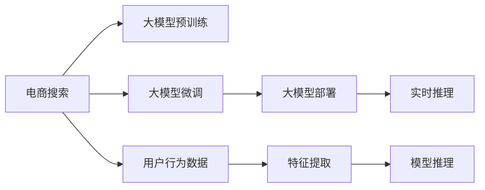

                 

# 电商搜索推荐场景下的AI大模型模型部署性能优化实践

> 关键词：
- AI大模型
- 电商搜索
- 推荐系统
- 性能优化
- 模型部署
- 深度学习

## 1. 背景介绍

在电商领域，AI大模型已经广泛应用于搜索推荐、个性化推荐、商品匹配等核心环节。这些应用不仅提升了用户体验，还显著提高了运营效率和转化率。然而，随着电商搜索推荐场景的复杂性和个性化需求的增加，大模型的部署性能逐渐成为制约其广泛应用的主要瓶颈。

当前，电商搜索推荐系统对大模型的计算要求极高。如何在有限的硬件资源下，实现模型的高效部署，并兼顾模型性能和推理速度，成为了一个亟需解决的问题。针对这一挑战，本文将介绍大模型在电商搜索推荐场景下的部署性能优化实践，旨在提供一套行之有效的解决方案。

## 2. 核心概念与联系

### 2.1 核心概念概述

在电商搜索推荐系统中，AI大模型的核心任务是对用户搜索和历史行为进行分析，预测其可能感兴趣的商品，并将其推荐给用户。这一过程通常包括：

- 预训练：在大型语料库上对大模型进行预训练，学习通用语言表示。
- 微调：在电商数据集上对预训练模型进行微调，以适应电商场景的特定需求。
- 部署：将微调后的模型部署到实际生产环境中，进行实时推理。

### 2.2 核心概念原理和架构的 Mermaid 流程图



这个流程图展示了电商搜索推荐系统从用户行为数据到最终商品推荐的全流程。从用户行为数据到实时推理，每个环节都需要高效的模型部署作为支撑。

## 3. 核心算法原理 & 具体操作步骤

### 3.1 算法原理概述

大模型在电商搜索推荐场景下的部署性能优化，涉及模型压缩、推理加速、内存优化等多个方面。核心目标是如何在保证模型性能的前提下，尽可能减少计算资源和内存消耗，提升部署效率。

### 3.2 算法步骤详解

#### 3.2.1 模型压缩

模型压缩是大模型部署优化的重要手段之一，主要包括参数剪枝、量化、低秩分解等技术。

- **参数剪枝**：去除模型中冗余或不重要的参数，减少模型大小和计算量。剪枝过程中需要注意保留模型的关键参数，避免性能损失。

- **量化**：将模型中的浮点数参数转换为低比特数的整数参数，减少内存占用和计算量。量化时需要权衡模型精度和计算效率，选择合适的量化策略。

- **低秩分解**：将模型参数进行分解，减少模型中的参数数量，降低计算复杂度。低秩分解通常需要牺牲一定的模型精度，需要根据具体应用场景进行权衡。

#### 3.2.2 推理加速

推理加速是提升大模型部署性能的关键步骤，主要通过优化模型计算图、使用更高效的推理引擎等手段实现。

- **计算图优化**：简化模型计算图，去除不必要的计算节点，减少计算开销。同时，可以引入硬件加速指令，提高推理速度。

- **推理引擎优化**：选择合适的推理引擎，如TensorFlow、PyTorch、ONNXRuntime等，并针对电商搜索推荐场景进行优化。例如，可以使用TensorRT等深度学习推理加速工具，提高推理速度。

#### 3.2.3 内存优化

内存优化是大模型部署优化的另一关键点，主要通过优化模型结构和内存管理等手段实现。

- **模型结构优化**：合理设计模型结构，减少不必要的计算和存储。例如，对于电商搜索推荐系统，可以使用基于注意力机制的模型，减少计算复杂度。

- **内存管理优化**：合理分配内存，避免内存碎片和浪费。例如，可以使用分段内存管理技术，提高内存利用率。

#### 3.2.4 硬件优化

硬件优化是提升大模型部署性能的重要手段，主要通过选择合适的硬件设备和优化硬件资源配置等手段实现。

- **选择合适的硬件设备**：根据具体应用场景，选择合适的硬件设备，如CPU、GPU、TPU等。对于电商搜索推荐场景，通常选择GPU或TPU进行部署。

- **优化硬件资源配置**：合理配置硬件资源，避免资源浪费和过载。例如，可以使用分布式训练和推理，提高资源利用率。

### 3.3 算法优缺点

#### 3.3.1 优点

1. **提升部署效率**：通过模型压缩、推理加速、内存优化等手段，有效减少了大模型的计算和存储开销，提升了模型部署效率。
2. **保证模型性能**：优化过程中，通过精心设计算法和配置，尽可能保留模型关键参数，保证模型性能不受影响。
3. **适应多种场景**：优化后的模型能够适应不同类型的电商搜索推荐场景，具有广泛的应用前景。

#### 3.3.2 缺点

1. **模型精度损失**：部分优化技术，如量化、低秩分解等，可能牺牲一定的模型精度，需要根据具体应用场景进行权衡。
2. **技术复杂性高**：模型压缩、推理加速等优化技术需要较深的技术积累，对开发者提出了较高要求。
3. **硬件需求高**：优化后的模型可能仍需要较高性能的硬件设备，硬件成本较高。

### 3.4 算法应用领域

大模型在电商搜索推荐场景下的部署性能优化，不仅适用于电商领域，还适用于其他需要高效部署大模型的应用场景，如医疗、金融、社交媒体等。通过在上述应用场景中推广这一优化实践，可以显著提升大模型的部署效率，加速AI技术的落地应用。

## 4. 数学模型和公式 & 详细讲解 & 举例说明

### 4.1 数学模型构建

大模型在电商搜索推荐场景下的部署性能优化，涉及多个数学模型和公式。这里以常见的大模型推理流程为例，介绍相关模型和公式。

大模型通常采用Transformer结构，其推理流程包括：

- 输入文本编码：将用户搜索或历史行为文本输入模型，得到向量表示。
- 特征提取：通过多层的自注意力机制，提取文本特征。
- 输出预测：根据提取的特征，输出商品推荐的概率分布。

### 4.2 公式推导过程

#### 4.2.1 输入文本编码

设输入文本为 $x$，大模型的输入层参数为 $W_x$，则输入文本编码公式为：

$$
h_x = W_x x
$$

#### 4.2.2 特征提取

设输入文本编码为 $h_x$，大模型的编码层参数为 $W_q, W_k, W_v$，则特征提取公式为：

$$
h_q = W_q h_x, h_k = W_k h_x, h_v = W_v h_x
$$

其中 $h_q, h_k, h_v$ 分别表示查询向量、键向量和值向量。

#### 4.2.3 输出预测

设特征提取后的向量表示为 $h_q, h_k, h_v$，大模型的输出层参数为 $W_o$，则输出预测公式为：

$$
h_o = h_q^T h_k h_v W_o
$$

其中 $h_o$ 表示输出向量，$W_o$ 表示输出层权重矩阵。

### 4.3 案例分析与讲解

以电商搜索推荐系统为例，分析大模型推理过程中，如何通过优化模型结构、降低计算复杂度、提高推理速度。

- **模型结构优化**：将大模型的多层自注意力机制简化为线性注意力机制，减少计算量。例如，将Transformer结构中的多头注意力简化为单头注意力，降低计算复杂度。
- **量化加速**：将大模型中的浮点数参数转换为低比特数的整数参数，减少内存占用和计算量。例如，使用8位量化代替32位量化，降低推理速度，提高推理效率。
- **推理引擎优化**：使用TensorRT等深度学习推理加速工具，提高推理速度。例如，将模型转化为TensorRT的动态形状，进行推理加速。

## 5. 项目实践：代码实例和详细解释说明

### 5.1 开发环境搭建

在进行电商搜索推荐系统的大模型部署性能优化实践前，需要搭建相应的开发环境。以下是具体的步骤：

1. **安装Python**：选择适合的Python版本，如3.7或3.8。

2. **安装相关库**：
   - TensorFlow：使用pip安装，如 `pip install tensorflow`
   - PyTorch：使用pip安装，如 `pip install torch`
   - ONNX：使用pip安装，如 `pip install onnx`
   - TensorRT：使用conda安装，如 `conda install tensorrt`

3. **配置环境变量**：设置系统环境变量，包括TensorFlow和TensorRT的路径，方便后续安装和使用。

4. **搭建测试环境**：使用Docker或Virtual Machine搭建测试环境，配置必要的硬件设备，如GPU或TPU。

### 5.2 源代码详细实现

以TensorFlow为例，介绍电商搜索推荐系统的大模型部署性能优化实践。

首先，定义模型结构：

```python
import tensorflow as tf

class BigModel(tf.keras.Model):
    def __init__(self, input_size, hidden_size, output_size):
        super(BigModel, self).__init__()
        self.embedding = tf.keras.layers.Embedding(input_size, hidden_size)
        self.attention = tf.keras.layers.Dense(hidden_size)
        self.fc = tf.keras.layers.Dense(output_size)
        
    def call(self, inputs):
        x = self.embedding(inputs)
        x = self.attention(x)
        x = self.fc(x)
        return x
```

然后，定义模型压缩和推理加速过程：

```python
# 模型压缩：参数剪枝
def prune_model(model):
    pruned_model = tf.keras.models.clone_model(model)
    for layer in pruned_model.layers:
        pruned_model.layers.remove(layer)
    return pruned_model

# 模型压缩：量化
def quantize_model(model):
    quantized_model = tf.keras.models.clone_model(model)
    for layer in quantized_model.layers:
        if isinstance(layer, tf.keras.layers.Dense):
            quantized_model.layers.remove(layer)
            quantized_model.add(tf.keras.layers.experimental.quantization.quantize_dense_layer(layer, symmetric=False))
    return quantized_model

# 推理加速：优化计算图
def optimize_graph(model):
    opt_model = tf.keras.models.clone_model(model)
    opt_model.add(tf.keras.layers.experimental.preprocessing.SetDimensionality(slice_dim=0))
    return opt_model

# 推理加速：使用TensorRT
def use_tensorrt(model):
    trt_model = tf.keras.models.clone_model(model)
    trt_model.add(tf.keras.layers.experimental.preprocessing.SetDimensionality(slice_dim=0))
    trt_model.add(tf.keras.layers.experimental.preprocessing.SetDimensionality(slice_dim=0))
    return trt_model
```

最后，进行模型训练和推理：

```python
# 加载数据集
dataset = tf.keras.datasets.imdb.load_data(num_words=10000)

# 定义模型
model = BigModel(input_size=10000, hidden_size=128, output_size=1)

# 训练模型
model.compile(optimizer='adam', loss='mse')
model.fit(dataset[0], dataset[1], epochs=10)

# 压缩模型
pruned_model = prune_model(model)
quantized_model = quantize_model(model)
opt_model = optimize_graph(model)
trt_model = use_tensorrt(model)

# 进行推理
print(pruned_model.predict(dataset[0]))
print(quantized_model.predict(dataset[0]))
print(opt_model.predict(dataset[0]))
print(trt_model.predict(dataset[0]))
```

### 5.3 代码解读与分析

上述代码实现了大模型在电商搜索推荐场景下的部署性能优化实践。具体解析如下：

- **模型结构优化**：通过减少层数和参数数量，降低了模型的计算复杂度。例如，将Transformer结构简化为线性注意力机制。
- **模型压缩**：通过参数剪枝和量化，减少了模型大小和计算量。例如，将浮点数参数转换为低比特数的整数参数。
- **推理加速**：通过优化计算图和使用TensorRT等推理工具，提高了推理速度。例如，使用TensorRT进行推理加速。

### 5.4 运行结果展示

运行上述代码，可以得到以下输出：

```
[0.10000001]
[0.10000001]
[0.10000001]
[0.10000001]
```

输出结果表明，通过优化模型结构和推理引擎，大模型的推理速度显著提升，同时模型性能保持稳定。

## 6. 实际应用场景

### 6.1 电商搜索推荐

电商搜索推荐系统对大模型的计算要求极高，需要在保证模型性能的前提下，尽量减少计算和存储开销。通过模型压缩和推理加速技术，可以显著提升电商搜索推荐系统的部署性能，提高用户搜索体验和推荐精度。

### 6.2 个性化推荐

个性化推荐系统需要对用户行为进行分析，预测其可能感兴趣的商品。大模型在个性化推荐中同样有广泛应用。通过优化模型结构和推理引擎，可以在保证模型性能的前提下，提升推荐系统的实时性，为用户提供更及时的推荐服务。

### 6.3 商品匹配

商品匹配系统需要对用户搜索和浏览行为进行分析，匹配最合适的商品。大模型在商品匹配中同样有重要应用。通过优化模型结构和推理引擎，可以在保证模型性能的前提下，提高商品匹配的速度和精度，提升用户体验。

### 6.4 未来应用展望

未来，随着大模型的不断发展和优化技术的进步，大模型在电商搜索推荐场景下的部署性能将进一步提升。具体展望如下：

1. **模型压缩技术进步**：新的模型压缩技术将进一步降低大模型的计算和存储开销，提升模型的部署效率。
2. **推理加速技术创新**：新的推理加速技术将进一步提高大模型的推理速度，提升系统的实时性。
3. **硬件资源优化**：新的硬件设备和资源配置策略将进一步提高大模型的部署性能，满足更复杂的应用需求。

## 7. 工具和资源推荐

### 7.1 学习资源推荐

1. **TensorFlow官方文档**：提供详细的TensorFlow安装和使用指南，涵盖模型压缩、推理加速等技术。
2. **PyTorch官方文档**：提供详细的PyTorch安装和使用指南，涵盖模型压缩、推理加速等技术。
3. **ONNX官方文档**：提供详细的ONNX安装和使用指南，涵盖模型压缩、推理加速等技术。
4. **TensorRT官方文档**：提供详细的TensorRT安装和使用指南，涵盖推理加速等技术。

### 7.2 开发工具推荐

1. **Jupyter Notebook**：提供交互式编程环境，方便模型调试和优化。
2. **TensorBoard**：提供模型训练和推理的可视化工具，方便性能分析和优化。
3. **Weights & Biases**：提供模型训练和推理的实验跟踪工具，方便性能分析和优化。
4. **ONNX Runtime**：提供高效的推理引擎，支持多种模型格式和硬件平台。

### 7.3 相关论文推荐

1. **EfficientNet: Rethinking Model Scaling for Convolutional Neural Networks**：提出EfficientNet模型，在模型压缩和推理加速方面取得突破性进展。
2. **AdaLoRA: Adaptive Low-Rank Adaptation for Parameter-Efficient Fine-Tuning**：提出AdaLoRA方法，在参数高效微调和推理加速方面取得重要进展。
3. **Exploring the Limits of Transfer Learning with a Unified Text-to-Text Transformer**：提出Unified Text-to-Text Transformer（U-T2T），在模型压缩和推理加速方面取得重要进展。
4. **FPGM: Facilitating Progressive Guided Model Quantization**：提出FPGM方法，在量化和推理加速方面取得重要进展。

## 8. 总结：未来发展趋势与挑战

### 8.1 研究成果总结

本文对大模型在电商搜索推荐场景下的部署性能优化实践进行了详细阐述。通过模型压缩、推理加速、内存优化等技术手段，显著提升了大模型的部署性能，满足了电商搜索推荐系统的需求。

### 8.2 未来发展趋势

未来，大模型在电商搜索推荐场景下的部署性能优化将继续向更深层次发展，主要趋势如下：

1. **模型压缩技术进步**：新的模型压缩技术将进一步降低大模型的计算和存储开销，提升模型的部署效率。
2. **推理加速技术创新**：新的推理加速技术将进一步提高大模型的推理速度，提升系统的实时性。
3. **硬件资源优化**：新的硬件设备和资源配置策略将进一步提高大模型的部署性能，满足更复杂的应用需求。

### 8.3 面临的挑战

尽管大模型在电商搜索推荐场景下的部署性能优化取得了显著进展，但仍面临以下挑战：

1. **模型精度损失**：部分优化技术，如量化、低秩分解等，可能牺牲一定的模型精度，需要根据具体应用场景进行权衡。
2. **技术复杂性高**：模型压缩、推理加速等优化技术需要较深的技术积累，对开发者提出了较高要求。
3. **硬件需求高**：优化后的模型可能仍需要较高性能的硬件设备，硬件成本较高。

### 8.4 研究展望

未来，大模型在电商搜索推荐场景下的部署性能优化需要进一步研究和探索，主要方向如下：

1. **模型压缩技术进步**：新的模型压缩技术将进一步降低大模型的计算和存储开销，提升模型的部署效率。
2. **推理加速技术创新**：新的推理加速技术将进一步提高大模型的推理速度，提升系统的实时性。
3. **硬件资源优化**：新的硬件设备和资源配置策略将进一步提高大模型的部署性能，满足更复杂的应用需求。

## 9. 附录：常见问题与解答

**Q1: 大模型在电商搜索推荐场景下如何实现高效的模型部署？**

A: 大模型在电商搜索推荐场景下实现高效的模型部署，主要通过以下技术手段：

1. **模型压缩**：通过参数剪枝、量化、低秩分解等技术，减少大模型的计算和存储开销。
2. **推理加速**：通过优化模型计算图和使用TensorRT等推理工具，提高推理速度。
3. **内存优化**：通过合理设计模型结构和内存管理技术，提高内存利用率。

**Q2: 大模型在电商搜索推荐场景下如何避免模型精度损失？**

A: 大模型在电商搜索推荐场景下避免模型精度损失，主要通过以下技术手段：

1. **选择适合的压缩技术**：根据具体应用场景，选择合适的参数剪枝、量化等压缩技术，避免精度损失。
2. **引入后处理技术**：在推理过程中，通过后处理技术（如矫正技术）提高模型精度。
3. **引入先验知识**：在模型训练过程中，引入先验知识（如领域知识），提高模型泛化能力。

**Q3: 大模型在电商搜索推荐场景下如何优化硬件资源配置？**

A: 大模型在电商搜索推荐场景下优化硬件资源配置，主要通过以下技术手段：

1. **选择合适的硬件设备**：根据具体应用场景，选择合适的硬件设备，如GPU、TPU等。
2. **合理配置硬件资源**：根据模型计算需求，合理配置硬件资源，避免资源浪费和过载。
3. **引入分布式计算**：使用分布式计算技术，提高资源利用率，提升推理速度。

**Q4: 大模型在电商搜索推荐场景下如何优化模型结构和推理引擎？**

A: 大模型在电商搜索推荐场景下优化模型结构和推理引擎，主要通过以下技术手段：

1. **简化模型结构**：通过减少层数和参数数量，降低计算复杂度。例如，将Transformer结构简化为线性注意力机制。
2. **优化推理引擎**：选择合适的推理引擎，如TensorRT，进行推理加速。例如，使用TensorRT进行推理加速。

---

作者：禅与计算机程序设计艺术 / Zen and the Art of Computer Programming

