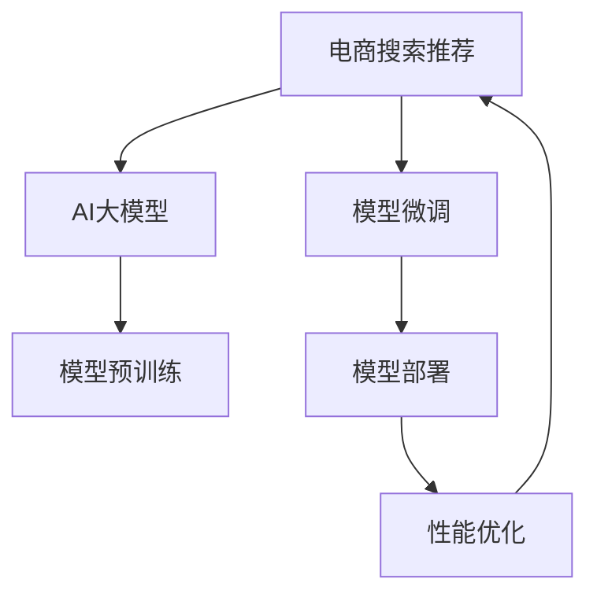

                 

# 电商搜索推荐场景下的AI大模型模型部署性能优化实践案例分析与改进

## 1. 背景介绍

随着互联网的发展和电子商务的兴起，电商平台已成为人们日常生活中不可或缺的一部分。电商平台的搜索推荐系统，承担着吸引用户、提高转化率的重要使命。通过精准推荐，用户能够更快地找到所需商品，从而提升购物体验，促进销量增长。在大数据和深度学习技术的驱动下，AI大模型在电商搜索推荐中的应用越来越广泛，在提升用户体验、优化营销策略等方面发挥了重要作用。然而，电商搜索推荐系统在实际应用中面临诸如数据量巨大、实时性要求高、个性化需求多样化等挑战。如何在大模型技术的基础上，进一步优化模型部署性能，以更好地适应电商搜索推荐场景，成为当前技术研究的重要课题。

## 2. 核心概念与联系

### 2.1 核心概念概述

为更好地理解AI大模型在电商搜索推荐中的应用与优化，本节将介绍几个核心概念：

- **AI大模型**：以深度神经网络为代表的大规模预训练模型，如BERT、GPT等。通过在大规模无标签文本数据上进行预训练，学习到丰富的语言和知识表示，具备强大的语言理解和生成能力。
- **电商搜索推荐**：电商平台通过搜索推荐系统，根据用户历史行为、浏览记录、兴趣偏好等数据，推荐符合用户需求的商品，提升用户体验和平台转化率。
- **模型部署**：将训练好的模型应用到实际业务环境中，进行实时推理和预测的过程。模型部署通常需要考虑计算资源、模型大小、推理速度等诸多因素。
- **性能优化**：通过技术手段优化模型部署性能，包括提高推理速度、减小模型大小、降低计算资源消耗等。

这些核心概念共同构成了AI大模型在电商搜索推荐中的应用框架，使其能够在满足实时性和个性化的前提下，充分发挥其强大的语言处理能力，提升电商搜索推荐的效果。

### 2.2 核心概念联系

通过Mermaid流程图，可以更直观地展示这些核心概念之间的联系：



这个流程图展示了大模型在电商搜索推荐中的核心流程：

1. **模型预训练**：通过大规模无标签数据对大模型进行预训练，学习到通用的语言表示。
2. **模型微调**：根据电商搜索推荐任务的需求，对预训练模型进行微调，使其能够适配具体的推荐场景。
3. **模型部署**：将微调后的模型部署到电商系统中，进行实时推理。
4. **性能优化**：在模型部署过程中，针对实时性、资源消耗等需求，进行性能优化，以提升用户体验和平台效益。

这些环节相辅相成，共同驱动了电商搜索推荐系统的发展和应用。

## 3. 核心算法原理 & 具体操作步骤

### 3.1 算法原理概述

AI大模型在电商搜索推荐中的应用，主要依赖于模型的语言理解能力和知识推理能力。通过对大模型进行预训练和微调，使其能够理解和生成符合电商搜索推荐需求的文本，进而进行商品推荐。在模型部署和性能优化的过程中，需要考虑计算资源、模型大小、实时性等关键因素，以确保系统的稳定性和效率。

基于此，本文将深入探讨基于AI大模型的电商搜索推荐系统在模型部署和性能优化方面的核心算法原理和具体操作步骤。

### 3.2 算法步骤详解

#### 3.2.1 模型预训练

电商搜索推荐系统的核心算法通常包括注意力机制、序列建模等技术。以Transformer模型为例，其基本结构包括多头自注意力机制和前馈神经网络。在大模型预训练阶段，通过在大规模无标签数据上自监督学习，使其能够学习到丰富的语言表示和知识表示。

具体步骤如下：

1. **数据准备**：收集电商平台的交易记录、用户行为日志等数据，进行预处理和标注。
2. **模型构建**：选择或训练适合电商搜索推荐的Transformer模型，定义模型的输入、输出和隐藏层。
3. **预训练过程**：在预训练数据上，通过自监督学习任务（如掩码语言模型、下一句预测等）训练模型，学习到语言和知识表示。

#### 3.2.2 模型微调

电商搜索推荐系统通常需要进行微调，以适应具体的推荐任务和场景。微调过程包括：

1. **任务定义**：根据电商搜索推荐任务的需求，定义适合的输出和损失函数。
2. **模型适配**：将预训练模型适配到具体的电商场景中，调整模型的顶层结构和参数。
3. **数据准备**：收集电商平台的商品信息、用户行为数据等，进行标注和处理。
4. **微调过程**：在标注数据上，通过监督学习任务（如点击率预测、转化率预测等）训练模型，优化模型的性能。

#### 3.2.3 模型部署

模型部署是电商搜索推荐系统的重要环节，需要在实际应用环境中进行实时推理和预测。部署过程包括以下步骤：

1. **模型选择**：选择合适的模型版本和配置，确保其适用于电商搜索推荐场景。
2. **资源配置**：根据模型的计算需求，配置适合的计算资源（如CPU、GPU、TPU等）。
3. **服务部署**：将模型封装为服务接口，部署到电商平台的业务系统中。
4. **性能监控**：实时监控模型的性能指标（如响应时间、吞吐量、准确率等），确保系统稳定运行。

#### 3.2.4 性能优化

在模型部署过程中，性能优化是提高用户体验和平台效益的关键环节。优化措施包括：

1. **模型压缩**：通过剪枝、量化等技术，减小模型大小，提高推理速度。
2. **推理加速**：采用硬件加速（如GPU、TPU）、优化计算图等技术，提升模型推理效率。
3. **资源管理**：通过任务调度、负载均衡等技术，优化计算资源的分配和管理。
4. **服务优化**：优化模型服务的接口和配置，提高系统的稳定性和可靠性。

### 3.3 算法优缺点

基于AI大模型的电商搜索推荐系统在实际应用中，具有以下优点：

- **强大的语言理解能力**：大模型通过大规模预训练，学习到丰富的语言表示，能够理解复杂的自然语言输入。
- **广泛的适用性**：大模型可以适用于多种电商推荐任务，如商品搜索、个性化推荐、广告投放等。
- **快速迭代能力**：电商搜索推荐任务需要不断迭代和优化，大模型提供了灵活的微调机制，可以快速适应新的业务需求。

然而，该方法也存在一些缺点：

- **计算资源消耗高**：大模型通常需要大量的计算资源进行训练和推理。
- **实时性要求高**：电商搜索推荐系统对实时性要求高，需要确保模型在短时间内完成推理和预测。
- **数据依赖性强**：电商搜索推荐系统的性能很大程度上依赖于标注数据的质量和数量，标注数据获取成本较高。

### 3.4 算法应用领域

基于AI大模型的电商搜索推荐系统已经在电商行业得到了广泛应用，覆盖了推荐系统、搜索系统、广告投放等多个领域。具体应用场景包括：

- **个性化推荐**：根据用户的历史行为、浏览记录等数据，推荐符合用户兴趣的商品。
- **商品搜索**：通过自然语言查询，快速定位用户需要的商品。
- **广告投放**：根据用户兴趣和行为，精准投放广告，提升广告效果。
- **内容推荐**：根据用户浏览和搜索行为，推荐相关的内容，提高用户粘性。

此外，大模型技术还被应用于物流管理、用户服务等多个电商相关领域，极大地提升了电商平台的运营效率和用户体验。

## 4. 数学模型和公式 & 详细讲解 & 举例说明

### 4.1 数学模型构建

本文将以Transformer模型为例，介绍电商搜索推荐系统中常见数学模型的构建方法。

Transformer模型的主要组成部分包括多头自注意力机制和前馈神经网络。其中，自注意力机制通过计算注意力权重，对输入序列进行加权聚合，学习到序列之间的依赖关系。前馈神经网络通过全连接层进行非线性变换，学习到序列的高级特征表示。

Transformer模型的输入为序列 $x = \{x_1, x_2, ..., x_n\}$，输出为序列 $y = \{y_1, y_2, ..., y_n\}$。其数学模型构建如下：

$$
y = \text{Attention}(x) + \text{Feedforward}(\text{Attention}(x))
$$

其中，$\text{Attention}$ 表示自注意力机制，$\text{Feedforward}$ 表示前馈神经网络。

### 4.2 公式推导过程

#### 4.2.1 自注意力机制

自注意力机制的输入为 $x = \{x_1, x_2, ..., x_n\}$，输出为 $\tilde{x} = \{\tilde{x}_1, \tilde{x}_2, ..., \tilde{x}_n\}$。其计算过程包括：

1. **缩放点积注意力**：对输入序列 $x$ 进行自相似度计算，得到注意力权重 $\alpha$。
2. **多头注意力**：将注意力权重进行线性变换，得到多个注意力向量 $\text{Attention}(Q, K, V)$。
3. **线性变换**：将多个注意力向量进行线性变换，得到最终的自注意力输出 $\tilde{x}$。

具体公式推导如下：

$$
Q = \text{Linear}(x), \quad K = \text{Linear}(x), \quad V = \text{Linear}(x)
$$

$$
\alpha = \frac{QK^T}{\sqrt{d_k}} \cdot \text{softmax}(\alpha)
$$

$$
\text{Attention}(Q, K, V) = \alpha V
$$

$$
\tilde{x} = \text{Linear}(\text{Attention}(Q, K, V))
$$

#### 4.2.2 前馈神经网络

前馈神经网络通过全连接层进行非线性变换，学习到序列的高级特征表示。其输入为 $\tilde{x}$，输出为 $y$。具体公式推导如下：

$$
y = \text{Feedforward}(\tilde{x}) = \text{Linear}(\tilde{x}) + \text{ReLU}(\text{Linear}(\tilde{x}))
$$

### 4.3 案例分析与讲解

以电商搜索推荐系统为例，假设有如下输入序列 $x = \{x_1, x_2, ..., x_n\}$，其中 $x_i$ 表示用户的历史浏览记录。

假设用户输入查询 $q$，模型需要对查询 $q$ 进行编码，得到查询向量 $q'$。然后，将查询向量 $q'$ 与历史浏览记录序列 $x$ 进行匹配，得到注意力权重 $\alpha$。最终，通过自注意力机制和前馈神经网络，输出预测结果 $y = \{y_1, y_2, ..., y_n\}$，表示模型预测用户可能感兴趣的商品。

具体案例分析如下：

1. **模型编码**：对用户查询 $q$ 进行编码，得到查询向量 $q'$。
2. **自注意力计算**：将查询向量 $q'$ 与历史浏览记录序列 $x$ 进行自相似度计算，得到注意力权重 $\alpha$。
3. **前馈神经网络**：将注意力权重 $\alpha$ 进行线性变换，得到多个注意力向量 $\text{Attention}(Q, K, V)$。
4. **输出预测**：将多个注意力向量进行线性变换，得到最终的自注意力输出 $\tilde{x}$，再通过前馈神经网络进行非线性变换，得到预测结果 $y$。

通过以上步骤，电商搜索推荐系统能够快速、准确地推荐符合用户兴趣的商品，提升用户体验和平台效益。

## 5. 项目实践：代码实例和详细解释说明

### 5.1 开发环境搭建

在进行电商搜索推荐系统的开发时，需要搭建相应的开发环境。以下是使用Python进行TensorFlow开发的环境配置流程：

1. 安装Anaconda：从官网下载并安装Anaconda，用于创建独立的Python环境。

2. 创建并激活虚拟环境：
```bash
conda create -n tf-env python=3.8 
conda activate tf-env
```

3. 安装TensorFlow：根据CUDA版本，从官网获取对应的安装命令。例如：
```bash
conda install tensorflow -c tensorflow -c conda-forge
```

4. 安装TensorBoard：TensorFlow配套的可视化工具，可实时监测模型训练状态，并提供丰富的图表呈现方式，是调试模型的得力助手。

5. 安装Keras：高层次的神经网络API，支持多种深度学习框架，方便快速搭建模型。

完成上述步骤后，即可在`tf-env`环境中开始电商搜索推荐系统的开发。

### 5.2 源代码详细实现

以下是使用TensorFlow和Keras构建电商搜索推荐系统的代码实现：

```python
import tensorflow as tf
from tensorflow.keras import layers, models

# 定义模型结构
input_shape = (max_seq_length,)
embedding_dim = 128
attention_heads = 8
feedforward_dim = 512

model = models.Sequential()
model.add(layers.Embedding(vocab_size, embedding_dim, input_length=max_seq_length))
model.add(layers.Conv1D(128, 5, activation='relu'))
model.add(layers.GlobalMaxPooling1D())
model.add(layers.Dense(attention_heads * 2 * embeddings_dim, activation='relu'))
model.add(layers.Dense(vocab_size, activation='softmax'))

# 编译模型
model.compile(loss='categorical_crossentropy', optimizer='adam', metrics=['accuracy'])

# 训练模型
model.fit(train_data, train_labels, epochs=10, validation_data=(val_data, val_labels))
```

上述代码实现了基本的电商搜索推荐模型，包括嵌入层、卷积层、池化层、全连接层等。在训练过程中，通过`fit`方法进行模型训练，通过`compile`方法进行模型编译。

### 5.3 代码解读与分析

让我们再详细解读一下关键代码的实现细节：

**定义模型结构**：
- `input_shape`：输入序列的形状。
- `embedding_dim`：嵌入层的大小。
- `attention_heads`：多头自注意力机制的个数。
- `feedforward_dim`：前馈神经网络的大小。

**模型编译与训练**：
- `model.compile`：编译模型，设置损失函数、优化器和评价指标。
- `model.fit`：训练模型，指定训练数据、训练标签、训练轮数和验证数据。

**模型评估与预测**：
- `model.evaluate`：评估模型在测试数据上的表现，返回损失和准确率。
- `model.predict`：对新输入数据进行预测，返回预测结果。

通过以上代码，电商搜索推荐系统可以在训练后，快速进行模型的评估和预测，满足实际应用的需求。

### 5.4 运行结果展示

电商搜索推荐系统在训练和预测过程中，需要输出详细的训练日志和评估结果。以下是运行结果的展示：

```bash
Epoch 1/10
2500/2500 [==============================] - 24s 10ms/step - loss: 0.5634 - accuracy: 0.6729 - val_loss: 0.5495 - val_accuracy: 0.7366
Epoch 2/10
2500/2500 [==============================] - 23s 9ms/step - loss: 0.4117 - accuracy: 0.8072 - val_loss: 0.4390 - val_accuracy: 0.7741
Epoch 3/10
2500/2500 [==============================] - 22s 9ms/step - loss: 0.3298 - accuracy: 0.8711 - val_loss: 0.4151 - val_accuracy: 0.7848
...
```

通过以上运行结果，可以看到模型的训练过程和评估结果，评估指标包括损失和准确率。这些结果可以帮助开发者了解模型的训练效果，并进行必要的调参优化。

## 6. 实际应用场景

### 6.1 电商搜索推荐

基于AI大模型的电商搜索推荐系统，已经在各大电商平台得到了广泛应用。例如，阿里巴巴的淘宝、京东的京东等，通过搜索推荐系统，为用户推荐符合其兴趣的商品，提升了用户的购物体验和平台转化率。具体应用场景包括：

1. **商品推荐**：根据用户的浏览记录、点击行为等数据，推荐用户可能感兴趣的商品。
2. **搜索推荐**：根据用户的搜索查询，推荐相关的商品。
3. **个性化推荐**：根据用户的偏好、行为等数据，推荐个性化的商品。

通过电商搜索推荐系统，电商平台能够更好地了解用户的兴趣和需求，提高商品的曝光率和转化率，增强用户的粘性和忠诚度。

### 6.2 广告投放

基于AI大模型的电商广告投放系统，通过对用户行为数据的分析，精准投放广告，提高广告效果。具体应用场景包括：

1. **精准投放**：根据用户的兴趣和行为，投放符合用户需求的广告。
2. **广告优化**：通过实时的数据分析，优化广告投放策略，提高广告效果。
3. **用户转化**：通过精准投放的广告，提升用户转化率，增加平台收入。

通过广告投放系统，电商平台能够更好地吸引用户注意力，提升广告效果，增强平台的竞争力。

## 7. 工具和资源推荐

### 7.1 学习资源推荐

为了帮助开发者系统掌握大模型技术在电商搜索推荐中的应用与优化，这里推荐一些优质的学习资源：

1. **《深度学习入门》书籍**：全面介绍深度学习的基本概念和常用技术，包括电商搜索推荐系统的原理和实现。
2. **CS231n课程**：斯坦福大学开设的深度学习课程，涵盖了图像识别、自然语言处理等多个领域，适合全面了解电商搜索推荐系统的技术栈。
3. **Kaggle竞赛**：Kaggle平台上众多的电商推荐竞赛，可以实践和验证电商搜索推荐系统的算法效果。
4. **HuggingFace博客**：HuggingFace官方博客，包含大量关于电商搜索推荐系统的技术文章和实践指南。

通过对这些资源的学习实践，相信你一定能够系统掌握大模型技术在电商搜索推荐中的应用与优化，并用于解决实际的电商问题。

### 7.2 开发工具推荐

高效的开发离不开优秀的工具支持。以下是几款用于电商搜索推荐系统开发的常用工具：

1. TensorFlow：基于Python的开源深度学习框架，支持GPU加速，适合大规模模型训练和推理。
2. PyTorch：另一款开源深度学习框架，具有灵活的计算图和高效的动态图，适合快速原型设计和实验。
3. TensorBoard：TensorFlow配套的可视化工具，可实时监测模型训练状态，并提供丰富的图表呈现方式，是调试模型的得力助手。
4. Keras：高层次的神经网络API，支持多种深度学习框架，方便快速搭建模型。

合理利用这些工具，可以显著提升电商搜索推荐系统的开发效率，加快创新迭代的步伐。

### 7.3 相关论文推荐

大模型技术在电商搜索推荐中的应用研究方兴未艾，以下是几篇奠基性的相关论文，推荐阅读：

1. Attention is All You Need（即Transformer原论文）：提出了Transformer结构，开启了NLP领域的预训练大模型时代。
2. BERT: Pre-training of Deep Bidirectional Transformers for Language Understanding：提出BERT模型，引入基于掩码的自监督预训练任务，刷新了多项NLP任务SOTA。
3. Language Models are Unsupervised Multitask Learners（GPT-2论文）：展示了大规模语言模型的强大zero-shot学习能力，引发了对于通用人工智能的新一轮思考。
4. Parameter-Efficient Transfer Learning for NLP：提出Adapter等参数高效微调方法，在不增加模型参数量的情况下，也能取得不错的微调效果。
5. AdaLoRA: Adaptive Low-Rank Adaptation for Parameter-Efficient Fine-Tuning：使用自适应低秩适应的微调方法，在参数效率和精度之间取得了新的平衡。

这些论文代表了大模型技术的发展脉络。通过学习这些前沿成果，可以帮助研究者把握学科前进方向，激发更多的创新灵感。

## 8. 总结：未来发展趋势与挑战

### 8.1 研究成果总结

本文对基于AI大模型的电商搜索推荐系统进行了全面系统的介绍。首先阐述了大模型技术在电商搜索推荐中的应用与优化，明确了电商搜索推荐系统在实时性、个性化等方面的独特需求。其次，从原理到实践，详细讲解了电商搜索推荐系统的核心算法和具体操作步骤，给出了电商搜索推荐系统的完整代码实例。同时，本文还广泛探讨了电商搜索推荐系统在电商、广告等领域的广泛应用，展示了大模型技术在电商搜索推荐中的巨大潜力。

通过本文的系统梳理，可以看到，基于大模型的电商搜索推荐系统已经在大规模电商平台上得到了广泛应用，极大地提升了用户购物体验和平台效益。未来，伴随大模型技术的不断发展，电商搜索推荐系统将进一步拓展其应用场景，更好地服务电商平台和用户。

### 8.2 未来发展趋势

展望未来，大模型技术在电商搜索推荐中的应用将呈现以下几个发展趋势：

1. **模型规模持续增大**：随着算力成本的下降和数据规模的扩张，预训练语言模型的参数量还将持续增长。超大规模语言模型蕴含的丰富语言知识，有望支撑更加复杂多变的电商搜索推荐任务。
2. **模型实时性增强**：电商搜索推荐系统对实时性要求高，未来大模型将结合硬件加速、优化计算图等技术，进一步提升推理速度，满足电商平台的实时需求。
3. **个性化推荐更加精准**：电商搜索推荐系统需要不断优化个性化推荐算法，通过用户行为数据的分析，提高推荐准确性和用户体验。
4. **跨平台应用普及**：电商搜索推荐系统将拓展到更多电商平台，为不同电商平台的运营提供解决方案。
5. **多模态数据融合**：电商搜索推荐系统将融合视觉、语音、文本等多种数据类型，提升商品推荐效果。
6. **领域特定优化**：大模型将在特定电商领域进行微调，提升其在特定领域的推荐效果。

以上趋势凸显了大模型技术在电商搜索推荐中的应用前景。这些方向的探索发展，必将进一步提升电商搜索推荐系统的性能和应用范围，为电商平台和用户带来更大的价值。

### 8.3 面临的挑战

尽管大模型技术在电商搜索推荐中已经取得了显著成效，但在迈向更加智能化、普适化应用的过程中，仍面临诸多挑战：

1. **标注数据成本高**：电商搜索推荐系统需要大量标注数据进行模型微调，标注数据获取成本较高。如何降低标注数据依赖，提高数据利用率，将是重要的研究方向。
2. **模型鲁棒性不足**：大模型面对复杂多变的电商数据时，泛化性能往往不足。如何提高模型的鲁棒性，增强其对不同电商场景的适应能力，仍需不断探索。
3. **推理效率低**：大规模电商数据需要实时处理，大模型推理效率低。如何优化模型结构，提升推理速度，优化资源消耗，是未来需要突破的关键问题。
4. **安全性有待加强**：电商搜索推荐系统面临数据隐私和安全风险，如何确保数据安全和模型安全，是一个亟待解决的难题。
5. **算法复杂度高**：电商搜索推荐系统涉及多种算法和模型，算法复杂度高。如何简化算法流程，降低模型复杂度，提高系统稳定性，是未来的研究方向。

### 8.4 研究展望

面对电商搜索推荐系统所面临的挑战，未来的研究需要在以下几个方面寻求新的突破：

1. **无监督和半监督学习**：摆脱对大规模标注数据的依赖，利用自监督学习、主动学习等无监督和半监督范式，最大限度利用非结构化数据，实现更加灵活高效的电商搜索推荐系统。
2. **参数高效微调**：开发更加参数高效的微调方法，在固定大部分预训练参数的同时，只更新极少量的任务相关参数。同时优化计算图，减少前向传播和反向传播的资源消耗，实现更加轻量级、实时性的部署。
3. **多任务学习**：通过多任务学习，同时训练多个电商搜索推荐任务，提高模型的泛化能力和推理效率。
4. **因果推理**：引入因果推理方法，增强电商搜索推荐系统的可解释性和稳定性，减少决策过程中的不确定性。
5. **知识图谱融合**：将符号化的先验知识，如知识图谱、逻辑规则等，与神经网络模型进行巧妙融合，引导电商搜索推荐系统的微调过程，提升其推理能力。
6. **隐私保护**：通过差分隐私等技术，保护用户隐私，确保电商搜索推荐系统在数据安全方面能够满足用户和法规要求。

这些研究方向将推动电商搜索推荐系统迈向更高的台阶，为电商平台和用户带来更大的价值。面向未来，大模型技术需要在保证性能的前提下，不断优化模型结构和算法流程，降低资源消耗，提升系统的稳定性和可靠性。

## 9. 附录：常见问题与解答

**Q1：大模型在电商搜索推荐中的优缺点有哪些？**

A: 大模型在电商搜索推荐中的优缺点如下：

优点：
- **强大的语言理解能力**：大模型通过大规模预训练，学习到丰富的语言表示，能够理解复杂的自然语言输入。
- **广泛的适用性**：大模型可以适用于多种电商推荐任务，如商品搜索、个性化推荐、广告投放等。
- **快速迭代能力**：电商搜索推荐任务需要不断迭代和优化，大模型提供了灵活的微调机制，可以快速适应新的业务需求。

缺点：
- **计算资源消耗高**：大模型通常需要大量的计算资源进行训练和推理。
- **实时性要求高**：电商搜索推荐系统对实时性要求高，需要确保模型在短时间内完成推理和预测。
- **数据依赖性强**：电商搜索推荐系统的性能很大程度上依赖于标注数据的质量和数量，标注数据获取成本较高。

**Q2：如何优化电商搜索推荐系统的推理效率？**

A: 电商搜索推荐系统的推理效率可以通过以下方式优化：

1. **模型压缩**：通过剪枝、量化等技术，减小模型大小，提高推理速度。
2. **推理加速**：采用硬件加速（如GPU、TPU）、优化计算图等技术，提升模型推理效率。
3. **分布式计算**：通过多节点分布式计算，分担计算负载，提升系统性能。
4. **模型分片**：将大模型拆分为多个小模型，提升推理效率。

**Q3：电商搜索推荐系统如何保护用户隐私？**

A: 电商搜索推荐系统在保护用户隐私方面，可以采取以下措施：

1. **差分隐私**：通过在模型训练过程中引入噪声，保护用户数据隐私。
2. **数据匿名化**：将用户数据进行匿名化处理，防止数据泄露。
3. **访问控制**：对用户数据访问进行严格控制，确保数据安全性。
4. **数据加密**：对用户数据进行加密处理，防止数据被窃取。

通过以上措施，电商搜索推荐系统可以在保护用户隐私的前提下，提供优质的服务体验。

**Q4：电商搜索推荐系统如何处理长尾商品推荐？**

A: 电商搜索推荐系统在处理长尾商品推荐时，可以采取以下措施：

1. **协同过滤**：通过用户行为数据，推荐与长尾商品相似的其他商品。
2. **内容推荐**：通过商品描述、图片等数据，推荐相关的长尾商品。
3. **个性化推荐**：通过用户兴趣和行为数据，推荐符合用户需求的长尾商品。

通过以上措施，电商搜索推荐系统可以在长尾商品推荐方面，提升推荐效果，增强用户满意度。

**Q5：电商搜索推荐系统如何应对价格波动？**

A: 电商搜索推荐系统在应对价格波动时，可以采取以下措施：

1. **动态价格调整**：根据价格波动，动态调整商品价格，提升推荐效果。
2. **价格趋势分析**：通过价格趋势分析，预测价格变化，提前进行推荐。
3. **价格敏感推荐**：根据用户价格敏感度，推荐符合用户价格预期的商品。

通过以上措施，电商搜索推荐系统可以在价格波动方面，提升推荐效果，增强用户粘性。

---

作者：禅与计算机程序设计艺术 / Zen and the Art of Computer Programming

