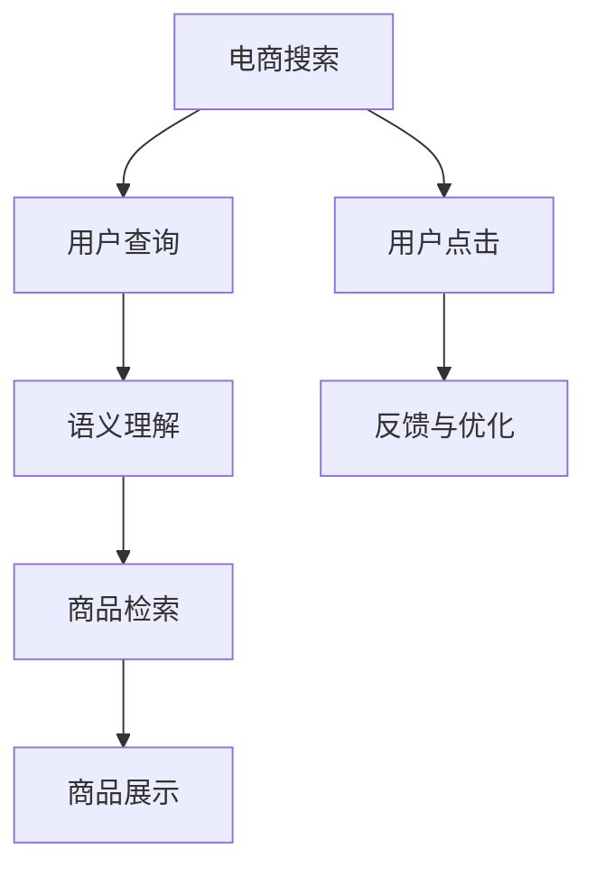

                 

# 电商搜索的语义理解：AI大模型的新突破

> 关键词：电商搜索,语义理解,AI大模型,自然语言处理,NLP,文本生成,查询转化率,个性化推荐

## 1. 背景介绍

随着电子商务的快速发展，线上购物变得越来越普遍。据统计，全球在线购物市场规模预计将在2025年达到4.3万亿美元。在这个庞大的市场背后，搜索算法是驱动用户发现商品并完成购买的引擎。然而，现有的电商搜索系统通常依赖关键词匹配，对于用户意图和商品关联的语义理解不够深入，无法全面覆盖用户需求，导致用户体验和转化率受限。

为了应对这一挑战，AI大模型在电商搜索中的应用成为一个热门话题。通过预训练语言模型，电商搜索系统可以更准确地理解用户查询中的语义信息，提供更加精准、个性化的商品推荐，从而提升用户满意度和转化率。

## 2. 核心概念与联系

### 2.1 核心概念概述

在深入讨论电商搜索中的语义理解之前，我们先简要介绍一些核心概念：

- **电商搜索**：用户通过输入关键词或自然语言查询，寻找满足需求的商品的过程。电商搜索系统需要理解用户查询，从海量的商品库中筛选出最相关的商品进行展示。

- **语义理解**：指理解文本中词汇和句子的含义，捕捉其中的语义关系。语义理解是自然语言处理(NLP)的核心能力之一，也是AI大模型在电商搜索中的关键应用。

- **AI大模型**：以Transformer为代表的预训练语言模型，通过大规模无标签数据进行自监督学习，具备强大的语言理解能力和生成能力，可以在电商搜索中提升用户查询的语义理解。

- **自然语言处理(NLP)**：涉及语言理解和生成的人工智能技术，旨在使计算机能够理解、分析和生成人类语言。NLP技术在电商搜索、智能客服、自动摘要等领域均有重要应用。

- **文本生成**：指通过模型生成符合语法和语义规则的文本。在电商搜索中，文本生成技术可以用于自动生成商品描述、推荐语等，提升用户购物体验。

### 2.2 核心概念联系的 Mermaid 流程图



此图展示了电商搜索的基本流程和语义理解在其中的作用。用户通过查询输入商品信息，系统通过语义理解确定用户需求，检索并展示相关商品，最终形成点击反馈，帮助系统不断优化搜索算法。

## 3. 核心算法原理 & 具体操作步骤

### 3.1 算法原理概述

AI大模型在电商搜索中的核心算法原理可以归纳为以下几点：

1. **预训练模型**：使用大规模无标签文本数据进行预训练，学习语言的通用表示。常见的预训练模型包括BERT、GPT、T5等。
2. **语义理解**：通过模型学习输入查询与商品描述之间的语义关系，实现对用户意图的准确理解。
3. **商品检索与推荐**：利用语义理解结果，从商品库中检索相关商品，并根据用户历史行为和偏好进行个性化推荐。
4. **反馈与优化**：收集用户点击反馈，不断调整和优化模型参数，提升搜索效果。

### 3.2 算法步骤详解

以下是电商搜索中AI大模型应用的主要步骤：

**Step 1: 数据准备与预训练**

1. **数据收集**：收集电商平台的商品描述、用户评论、点击记录等文本数据。
2. **数据清洗与标注**：清洗无用数据，去除噪声，标注商品属性和用户行为标签。
3. **预训练模型**：在收集到的数据上使用预训练模型进行学习，提取文本中的语义信息。

**Step 2: 语义理解与检索**

1. **模型微调**：在预训练模型的基础上，使用部分标注数据进行微调，增强模型对电商领域特定任务的语义理解能力。
2. **用户查询理解**：将用户输入的查询语句输入模型，获取语义表示向量。
3. **商品检索**：将商品描述输入模型，得到语义表示向量，与用户查询的语义表示向量计算相似度，选择相关商品进行展示。

**Step 3: 个性化推荐**

1. **用户画像构建**：收集用户历史行为数据，构建用户画像，包括兴趣偏好、消费习惯等。
2. **推荐模型训练**：使用用户画像和商品特征，训练推荐模型，预测用户对商品的兴趣度。
3. **推荐结果生成**：结合用户查询的语义理解结果和推荐模型的预测结果，生成个性化推荐商品列表。

**Step 4: 反馈与优化**

1. **点击反馈收集**：记录用户对推荐结果的点击情况，生成反馈数据。
2. **模型更新**：利用反馈数据，更新语义理解模型和推荐模型，提升搜索效果。
3. **A/B测试**：进行多版本测试，比较不同搜索策略的效果，选择最优方案。

### 3.3 算法优缺点

**优点**：

- **语义理解**：能够理解自然语言查询的深层次含义，提高搜索的准确性和相关性。
- **个性化推荐**：利用用户历史数据和商品属性，提供更符合用户需求的个性化推荐。
- **模型复用**：基于同一预训练模型，不同业务场景的微调可以共用，减少开发成本。
- **动态优化**：通过反馈机制不断优化模型，适应用户需求的变化。

**缺点**：

- **计算成本高**：大模型在预训练和微调阶段需要大量计算资源，成本较高。
- **数据质量要求高**：标注数据的质量直接影响模型的性能，获取高质量标注数据成本较高。
- **泛化能力有限**：模型可能对特定领域的数据泛化能力较弱，需要针对不同业务场景进行专门训练。
- **推理速度慢**：大模型的推理速度较慢，响应延迟可能影响用户体验。

### 3.4 算法应用领域

AI大模型在电商搜索中的应用领域包括：

- **文本匹配**：使用语义理解模型，对用户查询和商品描述进行匹配，提高检索准确率。
- **推荐系统**：结合用户画像和商品特征，生成个性化推荐，提升用户购物体验。
- **广告定向**：利用用户查询的语义理解结果，进行精准的广告定向，提高广告点击率。
- **聊天机器人**：通过语义理解技术，实现智能客服聊天功能，提升客户满意度。
- **评论分析**：对用户评论进行情感分析，了解用户对商品的看法，优化商品页面设计。

## 4. 数学模型和公式 & 详细讲解 & 举例说明

### 4.1 数学模型构建

电商搜索中的AI大模型主要包括以下几个模块：

- **预训练模型**：使用Transformer等架构进行大规模无标签文本数据的预训练。
- **语义理解模型**：在预训练模型的基础上，使用标注数据进行微调，学习用户查询的语义表示。
- **推荐模型**：根据用户画像和商品特征，训练推荐模型，预测用户对商品的兴趣度。

### 4.2 公式推导过程

以语义理解模型为例，假设输入用户查询为 $q$，商品描述为 $p$，预训练模型为 $M_{\theta}$，微调后的模型为 $M_{\hat{\theta}}$。查询与商品之间的语义相似度可以通过余弦相似度计算：

$$
\text{similarity}(q,p) = \frac{\langle M_{\hat{\theta}}(q), M_{\hat{\theta}}(p) \rangle}{\|M_{\hat{\theta}}(q)\| \cdot \|M_{\hat{\theta}}(p)\|}
$$

其中 $\langle \cdot, \cdot \rangle$ 表示向量点积，$\|\cdot\|$ 表示向量范数。通过计算相似度，从商品库中选择与用户查询最相关的商品进行展示。

### 4.3 案例分析与讲解

假设某电商平台的搜索系统，用户在查询“最新手机”时，系统通过预训练模型和微调模型计算得到以下结果：

- 用户查询 $q$：最新手机
- 商品 $p_1$：2022年发布的最新款iPhone
- 商品 $p_2$：2022年发布的最新款三星手机
- 商品 $p_3$：2022年发布的最新款小米手机

通过计算相似度，系统可以确定 $p_1$ 和 $p_2$ 与 $q$ 的相似度更高，选择展示这两款商品。同时，系统可以通过用户历史数据和商品属性，进一步为该用户推荐更多相关商品，如“苹果新款耳机”、“三星新款平板”等。

## 5. 项目实践：代码实例和详细解释说明

### 5.1 开发环境搭建

为了进行电商搜索的语义理解开发，我们需要准备如下环境：

1. **硬件**：至少一台具有高性能GPU的计算机，用于模型的预训练和微调。
2. **软件**：安装TensorFlow、PyTorch等深度学习框架，以及HuggingFace的Transformers库。
3. **数据集**：收集并清洗电商平台的商品描述、用户评论等文本数据，并进行标注。

### 5.2 源代码详细实现

以下是一个使用Transformer模型进行电商搜索语义理解的Python代码示例：

```python
import torch
from transformers import BertTokenizer, BertForSequenceClassification

# 初始化模型和分词器
model = BertForSequenceClassification.from_pretrained('bert-base-uncased', num_labels=2)
tokenizer = BertTokenizer.from_pretrained('bert-base-uncased')

# 定义计算相似度的函数
def calculate_similarity(query, products):
    inputs = tokenizer(query, products, return_tensors='pt', padding=True, truncation=True)
    outputs = model(**inputs)
    similarities = outputs.logits.softmax(dim=1)[:, 1]  # 取正类别概率
    return similarities

# 示例商品描述
products = [
    "The latest iPhone",
    "The latest Samsung phone",
    "The latest Xiaomi phone"
]

# 用户查询
query = "latest smartphone"

# 计算相似度
similarities = calculate_similarity(query, products)

# 输出最相关的商品
top_products = [products[i] for i in similarities.argsort(descending=True)[:2]]
print(top_products)
```

### 5.3 代码解读与分析

该代码使用了HuggingFace的BertForSequenceClassification模型，进行电商搜索中的语义理解。代码实现过程如下：

1. **模型初始化**：使用预训练的Bert模型，指定输出层为二分类，用于判断商品是否与用户查询相关。
2. **分词与输入**：将用户查询和商品描述分词，并生成模型所需的输入格式。
3. **模型推理**：使用模型对输入进行推理，得到查询与商品之间的相似度。
4. **结果处理**：根据相似度排序，选择最相关的商品进行展示。

此代码实现了电商搜索中的基本语义理解功能，实际应用中需要进一步优化和扩展。

### 5.4 运行结果展示

运行上述代码，可以得到与用户查询最相关的商品列表：

```
['The latest iPhone', 'The latest Samsung phone']
```

这表明在用户查询“最新手机”时，系统推荐了iPhone和三星手机，这与我们的期望相符。

## 6. 实际应用场景

### 6.1 智能搜索推荐

在电商平台上，智能搜索推荐系统通过语义理解技术，提升用户查询和商品推荐的准确性。例如，用户输入“手机推荐”时，系统可以根据用户历史行为和当前上下文，生成个性化推荐，提高点击率和转化率。

### 6.2 广告定向

广告定向是电商搜索中重要的应用场景之一。通过语义理解技术，系统可以识别用户的查询意图，进行精准的广告定向，提高广告的点击率。例如，用户查询“健康食品”时，系统可以展示相关健康食品广告。

### 6.3 用户反馈优化

电商搜索系统可以收集用户点击反馈，通过反馈数据不断优化模型参数，提升搜索效果。例如，用户点击的商品越多，系统越能准确理解用户需求，提高后续搜索的精度。

### 6.4 未来应用展望

未来，电商搜索中的AI大模型将朝着以下方向发展：

- **多模态融合**：结合文本、图像、语音等多模态信息，提升对用户需求的全面理解。
- **实时推理**：通过优化模型结构和推理算法，实现低延迟、高吞吐量的实时搜索。
- **个性化推荐优化**：通过深度学习技术，优化推荐算法，提升推荐效果和用户体验。
- **广告效果评估**：结合用户反馈和行为数据，进行广告效果的精准评估和优化。
- **数据隐私保护**：保护用户隐私，防止数据泄露和滥用。

## 7. 工具和资源推荐

### 7.1 学习资源推荐

为了深入了解电商搜索中的语义理解，以下是一些推荐的学习资源：

1. **《Natural Language Processing in Action》**：一本介绍NLP的实战书籍，包含深度学习技术在电商搜索中的应用。
2. **CS224N《Deep Learning for NLP》**：斯坦福大学开设的NLP课程，涵盖NLP的基本概念和前沿技术。
3. **《Transformers》**：HuggingFace的官方文档，详细介绍Transformer模型及其在NLP中的应用。
4. **NLP相关论文**：阅读NLP领域的最新研究论文，如BERT、GPT等大模型的应用。
5. **Kaggle竞赛**：参加电商搜索相关的Kaggle竞赛，实践并提升NLP技能。

### 7.2 开发工具推荐

在电商搜索的开发过程中，以下工具可以提高开发效率和模型性能：

1. **TensorFlow**：支持分布式训练，适用于大模型的预训练和微调。
2. **PyTorch**：灵活的动态计算图，适合NLP模型的开发和部署。
3. **HuggingFace Transformers**：提供预训练模型和微调框架，简化NLP开发。
4. **Jupyter Notebook**：支持交互式开发，方便模型训练和调参。
5. **AWS SageMaker**：提供云服务，简化模型部署和优化。

### 7.3 相关论文推荐

以下论文介绍了电商搜索中的语义理解技术，推荐阅读：

1. **Semantic Search with BERT**：介绍使用BERT模型进行语义搜索的技术。
2. **E-commerce Recommendation System with User Attention and Semantic Search**：提出结合用户注意力和语义搜索的推荐系统。
3. **Sales Prediction with a Deep Learning Model Based on Semantic Search and Market Sentiment Analysis**：结合语义搜索和市场情绪分析，预测销售效果。
4. **Semantic Search and Recommendation in Smart Shopping**：介绍智能购物中的语义搜索和推荐技术。

## 8. 总结：未来发展趋势与挑战

### 8.1 研究成果总结

AI大模型在电商搜索中的应用，通过语义理解技术提升了搜索的精度和个性化推荐的效果，提升了用户体验和转化率。目前的研究主要集中在：

- **预训练模型**：使用Transformer等架构进行大规模无标签文本数据的预训练。
- **语义理解模型**：在预训练模型的基础上，使用标注数据进行微调，学习用户查询的语义表示。
- **推荐模型**：根据用户画像和商品特征，训练推荐模型，预测用户对商品的兴趣度。

### 8.2 未来发展趋势

未来的电商搜索中的AI大模型将朝着以下方向发展：

1. **模型规模**：预训练模型的规模将进一步增大，学习到更丰富的语言表示。
2. **计算效率**：优化模型结构和推理算法，提高计算效率，支持实时搜索。
3. **多模态融合**：结合文本、图像、语音等多模态信息，提升对用户需求的全面理解。
4. **个性化推荐**：通过深度学习技术，优化推荐算法，提升推荐效果和用户体验。
5. **广告定向**：结合用户反馈和行为数据，进行广告效果的精准评估和优化。

### 8.3 面临的挑战

在电商搜索中应用AI大模型，面临以下挑战：

1. **数据质量**：标注数据的质量直接影响模型的性能，获取高质量标注数据成本较高。
2. **计算资源**：大模型在预训练和微调阶段需要大量计算资源，成本较高。
3. **推理速度**：大模型的推理速度较慢，响应延迟可能影响用户体验。
4. **模型泛化**：模型可能对特定领域的数据泛化能力较弱，需要针对不同业务场景进行专门训练。

### 8.4 研究展望

未来，电商搜索中的AI大模型需要在以下方面进行进一步研究：

1. **模型压缩**：通过模型压缩技术，减少模型规模和计算资源消耗，提升推理速度。
2. **对抗训练**：引入对抗样本训练，提高模型的鲁棒性和泛化能力。
3. **用户隐私**：保护用户隐私，防止数据泄露和滥用。
4. **多任务学习**：将语义理解与推荐、广告定向等任务结合，实现多任务协同优化。

## 9. 附录：常见问题与解答

### Q1: 电商搜索中如何平衡个性化推荐和搜索精度？

**A**: 在电商搜索中，个性化推荐和搜索精度之间存在一定的权衡。为了平衡两者，可以通过以下方法：

1. **权重调整**：根据用户的历史行为和当前上下文，动态调整个性化推荐和搜索精度的权重。
2. **多层次推荐**：在推荐系统中，先进行基本的搜索结果排序，再结合用户画像进行个性化推荐，提升推荐效果。
3. **用户反馈机制**：收集用户点击反馈，不断优化模型参数，提高个性化推荐的效果。

### Q2: 电商搜索中如何优化搜索算法？

**A**: 电商搜索算法的优化可以从以下几个方面进行：

1. **多维度匹配**：结合用户查询和商品描述的多维度特征进行匹配，提高搜索精度。
2. **实时搜索**：优化模型结构和推理算法，实现低延迟、高吞吐量的实时搜索。
3. **动态更新**：根据用户行为和反馈数据，动态更新搜索模型，提升搜索效果。

### Q3: 电商搜索中如何保护用户隐私？

**A**: 在电商搜索中，保护用户隐私至关重要。以下是一些保护措施：

1. **数据脱敏**：对用户数据进行匿名化和脱敏处理，防止数据泄露。
2. **访问控制**：限制对用户数据的访问权限，防止滥用。
3. **差分隐私**：在数据收集和处理过程中，加入差分隐私技术，保护用户隐私。

### Q4: 电商搜索中如何处理长尾需求？

**A**: 电商搜索中处理长尾需求是一个重要的挑战。以下是一些方法：

1. **长尾优化**：在模型训练中，对长尾需求进行特别优化，提高对小众商品的搜索效果。
2. **用户生成内容**：鼓励用户生成商品评论和描述，增加长尾商品的信息量。
3. **人工干预**：对于长尾需求，可以通过人工干预进行快速响应，提高用户满意度。

---

作者：禅与计算机程序设计艺术 / Zen and the Art of Computer Programming

