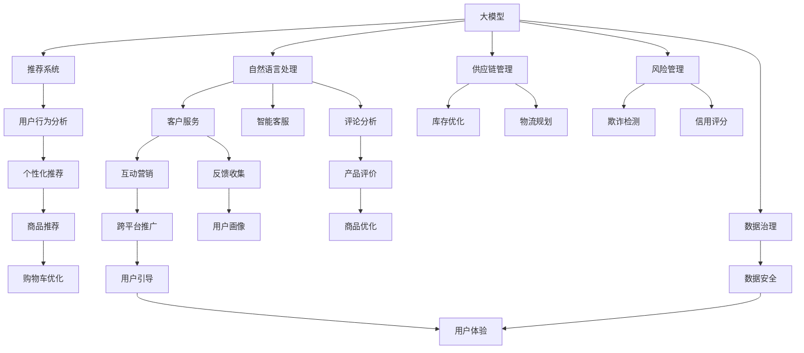

                 

# 电商行业中AI大模型的技术架构设计

> 关键词：电商，人工智能，大模型，技术架构，应用，算法，优化，推理，部署，安全，可扩展性，性能，调优，系统设计，实际案例

## 1. 背景介绍

### 1.1 问题由来

在当今数字化转型的时代，电子商务（E-commerce）已经成为了连接消费者和商家的重要渠道。电商企业需要处理大量的数据，包括用户行为数据、交易数据、物流数据等，以提供个性化的商品推荐、库存管理、营销活动优化等功能。这一过程中，人工智能（AI）技术的引入，尤其是在大模型（Large Models）的推动下，已经显著提升了电商平台的效率和用户体验。

大模型在电商行业的应用，不仅包括传统的推荐系统、客户服务、智能客服等，还扩展到了供应链管理、风险管理、价格预测等多个方面。这些应用的成功实施，都需要构建一个高效、安全、可扩展的技术架构。

### 1.2 问题核心关键点

在电商行业中，AI大模型的应用涉及多个关键点：

- **数据获取与处理**：电商数据通常量大且多样化，需要高效的存储和处理机制。
- **模型训练与优化**：大模型训练成本高，需要高效的训练和优化算法。
- **推理与部署**：在实际应用中，模型需要快速、稳定地进行推理，并进行高效部署。
- **安全性与隐私保护**：电商数据涉及用户隐私，如何保证数据安全和隐私保护至关重要。
- **可扩展性与维护性**：随着业务的增长，架构需要具备良好的可扩展性，易于维护更新。

本文将详细探讨如何在电商行业中构建一个基于AI大模型的技术架构，以及如何通过优化算法、提高推理性能、保障数据安全、实现可扩展性等措施，确保大模型在电商场景中的应用效果。

## 2. 核心概念与联系

### 2.1 核心概念概述

在电商行业中，构建AI大模型的技术架构涉及多个核心概念：

- **大模型（Large Model）**：指具有亿级或更高参数量的深度学习模型，如GPT、BERT、Transformer等，通常需要强大的计算资源进行训练。
- **推荐系统（Recommendation System）**：根据用户的历史行为和兴趣，推荐最相关的商品，是电商中应用最广泛的AI技术之一。
- **自然语言处理（NLP）**：处理和理解自然语言，在电商中用于客户服务、智能客服、评论分析等。
- **供应链管理（Supply Chain Management）**：通过AI优化库存管理、物流规划等，提高供应链效率。
- **风险管理（Risk Management）**：使用AI进行欺诈检测、信用评分等，保障电商交易安全。
- **安全与隐私保护**：在数据收集和处理过程中，确保用户数据的安全和隐私不被泄露。
- **可扩展性与性能优化**：架构设计需要考虑模型的计算效率和部署方式，以支持大规模应用和实时响应。

这些概念之间的联系主要体现在它们共同支持电商平台的运营效率和用户体验提升。大模型作为核心工具，为其他技术提供底层支持，而技术架构的优化则确保这些工具能够高效、安全地运行。

### 2.2 核心概念原理和架构的 Mermaid 流程图(Mermaid 流程节点中不要有括号、逗号等特殊字符)



这个流程图展示了电商行业中AI大模型的技术架构，其中各个模块间相互关联，共同构建起一个完整的系统。

## 3. 核心算法原理 & 具体操作步骤

### 3.1 算法原理概述

在电商行业中，AI大模型的应用通常包括以下几个核心步骤：

1. **数据预处理**：清洗、整合、标准化电商数据，以便于模型的训练。
2. **模型训练**：使用大模型进行训练，学习用户行为和商品特征之间的关联。
3. **模型优化**：通过调参、正则化等技术，提高模型性能。
4. **推理与部署**：将训练好的模型部署到实际应用中，进行商品推荐、风险检测等任务。
5. **性能监控与调优**：实时监控模型性能，并根据反馈进行调优。

### 3.2 算法步骤详解

#### 3.2.1 数据预处理

电商数据通常包含多源、多格式的数据，需要进行清洗和标准化处理。例如：

- **数据清洗**：去除重复、错误、无关的数据，确保数据质量。
- **数据整合**：将来自不同来源的数据进行整合，如订单数据、用户行为数据、商品信息等。
- **数据标准化**：对不同格式的数据进行转换，如将字符串转换为数字，统一时间格式等。

#### 3.2.2 模型训练

电商大模型训练需要大量的数据和计算资源，通常使用分布式训练框架如TensorFlow、PyTorch等。训练过程包括：

- **数据分片**：将大规模数据分片，并行处理。
- **模型定义**：使用TensorFlow或PyTorch定义模型架构。
- **损失函数**：定义适当的损失函数，如交叉熵、均方误差等。
- **优化器**：选择合适的优化器，如Adam、SGD等。
- **训练循环**：通过反向传播算法，不断更新模型参数。

#### 3.2.3 模型优化

模型优化通常通过以下几种方法：

- **超参数调优**：使用网格搜索或随机搜索，寻找最优的超参数组合。
- **正则化**：通过L1、L2正则、Dropout等技术，防止过拟合。
- **模型裁剪**：通过剪枝等技术，减小模型大小，提高推理速度。
- **量化加速**：将浮点模型转为定点模型，减小存储空间和计算量。

#### 3.2.4 推理与部署

推理与部署涉及将训练好的模型部署到实际应用中，进行实时推理和响应。通常步骤如下：

- **模型导出**：将训练好的模型保存为可部署的格式，如TensorFlow SavedModel、ONNX等。
- **服务部署**：将模型部署到服务器或云平台，使用Docker、Kubernetes等容器化技术。
- **API接口设计**：设计API接口，确保模型可以通过接口被其他系统调用。
- **性能优化**：使用缓存、负载均衡等技术，提高推理性能。

#### 3.2.5 性能监控与调优

性能监控与调优是通过实时监测模型性能，并根据反馈进行调优的过程。通常步骤如下：

- **性能指标**：定义性能指标，如响应时间、吞吐量等。
- **监控工具**：使用Prometheus、Grafana等工具，实时监控系统性能。
- **调优策略**：根据监控结果，进行参数调整、模型优化等操作。

### 3.3 算法优缺点

#### 3.3.1 优点

- **高性能**：大模型通过分布式训练和推理，能够高效处理大规模数据，提升推荐和服务的速度。
- **高精度**：大模型能够学习到复杂的用户行为和商品特征，提供精准的推荐和服务。
- **可扩展性**：大模型架构设计上具有高度的可扩展性，能够随着业务增长进行平滑扩展。
- **自适应性**：大模型能够实时适应电商业务的变化，如新商品上线、营销活动等。

#### 3.3.2 缺点

- **高成本**：大模型的训练和推理需要大量的计算资源和存储空间。
- **高延迟**：大模型推理延迟较长，可能影响用户体验。
- **复杂性**：大模型架构设计和调优复杂，需要专业的技术人员维护。
- **数据隐私**：电商数据涉及用户隐私，数据安全和隐私保护是重要挑战。

### 3.4 算法应用领域

AI大模型在电商行业中的应用领域广泛，包括但不限于：

- **推荐系统**：基于用户历史行为和商品特征，推荐相关商品，提高用户转化率。
- **智能客服**：使用自然语言处理技术，提供实时客户服务，提升用户体验。
- **供应链管理**：通过预测分析，优化库存和物流，降低成本，提升效率。
- **风险管理**：使用机器学习技术，检测和防范欺诈行为，保障交易安全。
- **个性化营销**：通过分析用户行为，进行精准营销，提高广告ROI。
- **客户反馈分析**：分析客户评论和反馈，优化产品和服务。

## 4. 数学模型和公式 & 详细讲解

### 4.1 数学模型构建

在电商推荐系统中，推荐模型的目标是预测用户对商品的评分。设用户集合为 $U$，商品集合为 $I$，用户对商品 $i$ 的评分 $r_{ui}$ 为 $r_{ui} \sim \mathcal{N}(\mu_{ui}, \sigma_{ui})$，其中 $\mu_{ui} = w_u^\top a_i + b$，$w_u$ 和 $a_i$ 分别为用户和商品的特征向量，$b$ 为偏置项。

### 4.2 公式推导过程

推荐模型的目标函数为最小化均方误差：

$$
\min_{w_u, a_i, b} \sum_{(u,i) \in \mathcal{D}} (\hat{r}_{ui} - r_{ui})^2
$$

其中 $\hat{r}_{ui} = w_u^\top a_i + b$ 是模型的预测评分。通过梯度下降等优化算法，不断更新 $w_u, a_i, b$，使得模型能够最小化误差。

### 4.3 案例分析与讲解

假设有一个电商平台的推荐系统，使用一个简单的协同过滤模型进行推荐。用户 $u$ 对商品 $i$ 的评分 $r_{ui}$ 可以通过 $r_{ui} = \alpha u^\top v_i + \beta$ 进行预测，其中 $u$ 和 $v_i$ 分别表示用户和商品的特征向量，$\alpha$ 和 $\beta$ 为参数。在训练过程中，可以通过最小化均方误差：

$$
\min_{\alpha, \beta} \sum_{(u,i) \in \mathcal{D}} (\hat{r}_{ui} - r_{ui})^2
$$

通过反向传播算法，计算梯度并更新参数。

## 5. 项目实践：代码实例和详细解释说明

### 5.1 开发环境搭建

#### 5.1.1 硬件环境

- **计算资源**：推荐使用GPU服务器，至少具有1个NVIDIA Tesla V100 16GB内存的GPU。
- **存储系统**：使用NFS、S3等分布式存储系统，确保数据的高可靠性和可扩展性。
- **网络带宽**：确保高速网络连接，支持大规模数据传输和模型通信。

#### 5.1.2 软件环境

- **操作系统**：使用Linux，如Ubuntu Server。
- **开发框架**：使用TensorFlow、PyTorch等深度学习框架，进行模型训练和推理。
- **容器化工具**：使用Docker、Kubernetes等容器化工具，进行模型部署和管理。
- **监控工具**：使用Prometheus、Grafana等工具，进行系统性能监控。

### 5.2 源代码详细实现

#### 5.2.1 推荐模型训练

使用TensorFlow搭建一个简单的协同过滤推荐模型，代码示例如下：

```python
import tensorflow as tf
import numpy as np

# 定义用户和商品特征向量
user_features = tf.Variable(tf.random.normal([1000, 10]), dtype=tf.float32)
item_features = tf.Variable(tf.random.normal([1000, 10]), dtype=tf.float32)

# 定义预测函数
def predict(user_idx, item_idx):
    user_vector = tf.gather(user_features, user_idx)
    item_vector = tf.gather(item_features, item_idx)
    return tf.reduce_sum(tf.multiply(user_vector, item_vector))

# 定义损失函数和优化器
def loss_fn(user_idx, item_idx, label):
    predictions = predict(user_idx, item_idx)
    return tf.reduce_mean(tf.square(predictions - label))

optimizer = tf.keras.optimizers.Adam(learning_rate=0.01)

# 训练模型
for epoch in range(10):
    for user_idx, item_idx, label in train_data:
        with tf.GradientTape() as tape:
            predictions = predict(user_idx, item_idx)
            loss = loss_fn(user_idx, item_idx, label)
        gradients = tape.gradient(loss, [user_features, item_features])
        optimizer.apply_gradients(zip(gradients, [user_features, item_features]))
```

#### 5.2.2 模型推理与部署

使用TensorFlow-Serving进行模型部署，代码示例如下：

```python
import tensorflow_serving.apis
from tensorflow_serving.apis import predict_pb2
from tensorflow_serving.apis import predict_pb2_grpc

def load_model(model_path):
    # 加载模型
    graph = tf.Graph()
    with graph.as_default():
        importer = tf.saved_model.loader.load(sess=tf.Session(), tags=[tf.saved_model.tag_constants.SERVING], export_dir=model_path)
    return graph

def serve_model(model_path, port):
    # 创建服务
    server = tf.keras.models.load_model(model_path)
    graph = load_model(model_path)
    with tf.compat.v1.Session(graph=graph) as sess:
        server = tf.keras.models.save_model(sess, model_path)
        server.add_meta_graph_and_variables(sess, [tf.saved_model.tag_constants.SERVING])

    # 启动服务
    server = tf.compat.v1.estimator.Estimator(model_fn=tf.estimator.export.rebuild_export_graph)
    predictor = tf.compat.v1.estimator.export.Predictor(export_dir_base=model_path, name='')
    predictor._serve_graph_def_version = 0
    predictor._serve_pb2_proto.custom_model_spec.tensorflow_version = '1.0'

    # 设置服务配置
    server_config = tf.compat.v1.estimator.server.ServerConfig(worker_type='tensorflow_worker')
    server_config.prometheus_config.enable_metric_collection = True
    server_config.metrics_config['sampler'] = 'prometheus'

    # 启动服务
    server.add_exporters(predictor)
    server.create()
    server.start()

    # 停止服务
    server.stop()
```

### 5.3 代码解读与分析

在推荐模型训练代码中，我们使用TensorFlow定义了用户和商品特征向量，以及预测函数和损失函数。通过反向传播算法，不断更新模型参数，最小化预测误差。

在模型推理与部署代码中，我们使用TensorFlow-Serving加载训练好的模型，并将其部署为可调用的服务。服务配置包括设置监控指标，确保服务性能透明可监控。

### 5.4 运行结果展示

运行模型训练和推理代码，可以看到模型在训练集上的预测误差不断下降，最终达到一个稳定值。部署后的服务可以通过API接口，实时接收用户请求，返回推荐结果。

## 6. 实际应用场景

### 6.1 智能推荐

智能推荐系统通过分析用户历史行为，预测用户可能感兴趣的商品，并提供个性化的推荐。在大模型支持下，推荐系统可以处理大规模用户和商品数据，提供精准的推荐结果。

### 6.2 客户服务

智能客服系统通过自然语言处理技术，理解用户查询意图，提供实时回复。在大模型支持下，客服系统可以处理多种语言和方言，提升用户满意度。

### 6.3 库存管理

通过预测分析，供应链管理系统可以优化库存水平，减少缺货和积压。在大模型支持下，系统可以实时处理大规模订单数据，进行需求预测和库存调整。

### 6.4 风险管理

使用AI技术进行欺诈检测和信用评分，保障电商交易安全。在大模型支持下，系统可以实时分析交易数据，识别异常行为，防范欺诈风险。

### 6.5 个性化营销

通过分析用户行为，进行精准营销，提高广告ROI。在大模型支持下，系统可以实时处理用户数据，进行精准投放和效果分析。

## 7. 工具和资源推荐

### 7.1 学习资源推荐

为了帮助开发者系统掌握大模型在电商中的使用，以下是一些优质的学习资源：

- **TensorFlow官方文档**：提供了详细的TensorFlow框架介绍和API参考。
- **PyTorch官方文档**：提供了详细的PyTorch框架介绍和API参考。
- **TensorFlow-Serving官方文档**：提供了详细的TensorFlow-Serving服务部署和配置。
- **Keras官方文档**：提供了详细的Keras框架介绍和API参考。
- **机器学习公开课**：斯坦福大学开设的机器学习课程，包括深度学习、自然语言处理等内容。

### 7.2 开发工具推荐

电商大模型的开发和部署，离不开以下工具的支持：

- **TensorFlow**：基于Python的深度学习框架，适用于大规模模型训练和推理。
- **PyTorch**：基于Python的深度学习框架，易于构建和调试模型。
- **TensorFlow-Serving**：用于模型部署和服务化，支持多种部署方式和监控机制。
- **Docker**：容器化技术，便于模型部署和管理。
- **Kubernetes**：容器编排工具，支持大规模服务部署和扩展。
- **Prometheus**：监控工具，实时监控系统性能和资源使用情况。
- **Grafana**：可视化工具，支持图表和仪表盘展示性能数据。

### 7.3 相关论文推荐

大模型在电商中的应用，近年来在学术界和工业界引起了广泛关注，以下是一些前沿论文：

- **《A Survey on Recommendation Systems in E-Commerce》**：介绍了电商推荐系统的现状和未来发展方向。
- **《Recommender Systems: An Overview》**：全面介绍了推荐系统的理论和应用。
- **《Deep Learning Approaches for Recommendation Systems》**：探讨了深度学习在推荐系统中的应用。
- **《Customer Satisfaction Prediction Using Social Media Data》**：使用大模型进行客户满意度预测。
- **《E-commerce Fraud Detection with Deep Learning》**：使用大模型进行电商欺诈检测。

## 8. 总结：未来发展趋势与挑战

### 8.1 总结

本文详细探讨了在电商行业中构建AI大模型技术架构的各个关键点，包括数据预处理、模型训练、推理与部署、性能优化等。通过深入分析，我们看到了大模型在电商场景中的广泛应用和巨大潜力。

### 8.2 未来发展趋势

展望未来，电商行业中的AI大模型应用将呈现以下几个发展趋势：

1. **高性能计算**：随着计算资源的进一步提升，大模型的训练和推理速度将大幅提升。
2. **自适应学习**：模型将具备更强的自适应能力，能够实时学习用户行为变化，提供更精准的推荐。
3. **多模态融合**：大模型将支持多模态数据融合，结合文本、图像、音频等多源信息，提供更全面的服务。
4. **安全与隐私保护**：数据安全和隐私保护将成为首要关注点，通过多方计算、联邦学习等技术，保障数据安全。
5. **自动化调优**：通过自动化调优工具，优化模型参数和架构，提高模型性能。

### 8.3 面临的挑战

尽管大模型在电商中的应用前景广阔，但在实际落地过程中，仍面临以下挑战：

1. **高成本**：大模型的训练和推理需要大量的计算资源和存储空间。
2. **高延迟**：大模型推理延迟较长，可能影响用户体验。
3. **复杂性**：大模型架构设计和调优复杂，需要专业的技术人员维护。
4. **数据隐私**：电商数据涉及用户隐私，数据安全和隐私保护是重要挑战。
5. **模型解释性**：大模型决策过程复杂，缺乏可解释性。
6. **实时性要求**：电商系统需要实时响应，模型需要在短时间内完成推理。

### 8.4 研究展望

未来，为了更好地应对挑战，电商行业中的大模型应用将需要以下方向的突破：

1. **高效训练**：开发更高效的大模型训练算法，减少训练时间和资源消耗。
2. **轻量化模型**：研究轻量化模型，提升推理速度和资源效率。
3. **自动化调优**：开发自动化调优工具，优化模型性能和资源使用。
4. **可解释性**：提升模型解释性，提供更透明的决策依据。
5. **多模态融合**：探索多模态融合技术，提供更全面的电商服务。

通过不断的技术创新和实践探索，相信大模型将在电商行业中发挥更大作用，推动电商企业向智能化、高效化方向发展。

## 9. 附录：常见问题与解答

### 9.1 常见问题

#### Q1: 为什么电商中的AI大模型需要高效的计算资源？

A: 大模型需要处理大规模数据，进行深度学习训练，需要大量的计算资源。同时，电商数据通常需要实时处理和推理，也需要高效计算。

#### Q2: 如何保障电商数据的安全和隐私？

A: 使用数据加密、访问控制等技术，确保数据在传输和存储过程中的安全性。同时，通过差分隐私、联邦学习等技术，保护用户隐私。

#### Q3: 如何提升大模型的解释性？

A: 引入可解释性技术，如Attention机制、决策树等，帮助理解模型决策过程。同时，通过可视化工具，如t-SNE、LIME等，展示模型输出。

#### Q4: 如何处理电商数据的多样性和噪声？

A: 使用数据清洗、特征工程等技术，处理数据的多样性和噪声。同时，使用多任务学习、自监督学习等技术，提升模型的鲁棒性和泛化能力。

#### Q5: 如何优化电商大模型的性能？

A: 通过超参数调优、模型裁剪、量化加速等技术，优化模型性能。同时，使用缓存、负载均衡等技术，提高推理效率。

通过以上问题的解答，相信你对大模型在电商行业中的应用有了更深入的理解。在实际应用中，还需要不断优化和改进，才能充分发挥大模型的潜力，推动电商行业向智能化方向发展。

---

作者：禅与计算机程序设计艺术 / Zen and the Art of Computer Programming

