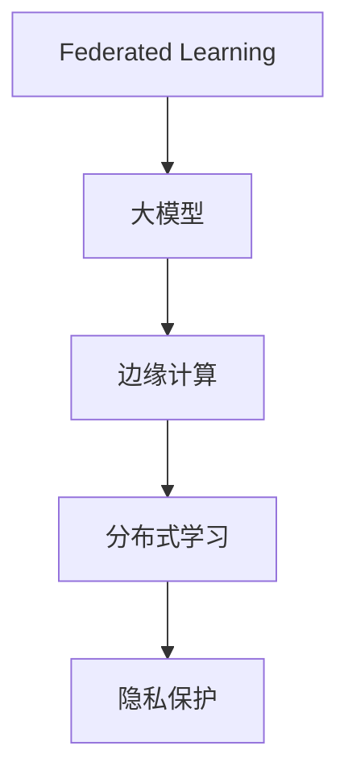

                 

# 电商行业中的联邦学习：大模型的隐私保护应用

> 关键词：联邦学习, 大模型, 隐私保护, 边缘计算, 分布式学习

## 1. 背景介绍

### 1.1 问题由来
随着电子商务的飞速发展，各大电商平台积累了大量用户数据，包括但不限于交易记录、浏览行为、评价反馈等。这些数据是大数据分析、个性化推荐、风险控制等应用的基础。然而，传统的集中式训练方法在处理这些数据时面临着数据隐私和安全问题。如何在大模型训练中保护用户隐私，成为电商行业共同面临的挑战。

### 1.2 问题核心关键点
联邦学习（Federated Learning, FL）是一种分布式机器学习范式，允许多个参与方（如电商平台）在本地数据上进行模型训练，通过聚合各参与方的模型参数，最终得到全局模型。相比于传统的集中式训练方法，联邦学习能够有效保护用户隐私，同时充分利用各方数据资源。

在联邦学习中，大模型（Large Models）扮演了重要的角色。大模型通常包含数十亿甚至数百亿的参数，具有强大的表示能力和泛化能力。通过在大模型上进行联邦学习，可以在保证隐私的前提下，显著提升电商行业应用的模型性能。

## 2. 核心概念与联系

### 2.1 核心概念概述

为了更好地理解联邦学习在大模型隐私保护中的应用，本节将介绍几个密切相关的核心概念：

- **联邦学习（Federated Learning, FL）**：一种分布式机器学习范式，通过在本地数据上进行模型训练，并聚合各参与方的模型参数，最终得到全局模型。旨在解决数据隐私和安全问题。

- **大模型（Large Models）**：指包含数十亿甚至数百亿参数的深度学习模型，如BERT、GPT系列等。大模型能够处理大规模数据，具有强大的表示能力和泛化能力。

- **边缘计算（Edge Computing）**：一种分布式计算模式，将计算资源放置在数据源头，如手机、服务器、物联网设备等，就近处理数据，减少数据传输，提高计算效率。

- **分布式学习（Distributed Learning）**：多个参与方各自在本地数据上训练模型，并通过通信机制共享模型参数，最终得到全局模型。

- **隐私保护（Privacy Preservation）**：在数据处理过程中，确保个体隐私不被泄露，保护数据拥有者的隐私权利。

这些核心概念之间的逻辑关系可以通过以下Mermaid流程图来展示：



这个流程图展示了大模型联邦学习的基本流程：首先在大模型上进行本地训练，然后通过边缘计算在本地设备上分布式训练，最后通过隐私保护技术，确保数据传输过程中的隐私安全。

## 3. 核心算法原理 & 具体操作步骤
### 3.1 算法原理概述

联邦学习在大模型隐私保护中的应用，通过将大模型的训练过程迁移到边缘设备上，实现本地数据分布式训练，同时通过聚合各参与方的模型参数，得到全局最优模型。这一过程不仅提升了模型的性能，还保障了用户数据的隐私安全。

### 3.2 算法步骤详解

大模型联邦学习的基本步骤包括以下几个关键环节：

**Step 1: 本地数据预处理**
- 各参与方收集本地数据，并对其进行预处理，包括数据清洗、标准化、归一化等操作。

**Step 2: 模型初始化**
- 在各参与方本地设备上初始化大模型的权重，可以采用预训练模型或者随机初始化。

**Step 3: 本地训练**
- 各参与方在本地数据上，使用分布式训练方法（如SGD、Adam等）训练大模型。

**Step 4: 模型参数聚合**
- 通过某种聚合策略（如均值、加权平均等），将各参与方的模型参数聚合，得到全局模型参数。

**Step 5: 全局模型更新**
- 在全局模型上继续训练，通过反向传播更新模型权重。

**Step 6: 模型参数下发**
- 将全局模型参数下发到各参与方，更新本地模型的权重。

**Step 7: 循环迭代**
- 重复执行本地训练、参数聚合、全局更新等步骤，直到模型收敛或达到预设的迭代轮数。

### 3.3 算法优缺点

联邦学习在大模型隐私保护中的应用，具有以下优点：

1. **隐私保护**：通过在本地设备上进行训练，数据不离开本地，有效保护了用户隐私。
2. **数据分布式**：各参与方可以在本地数据上进行训练，充分利用数据资源。
3. **模型性能提升**：通过聚合各参与方的模型参数，可以提升全局模型的性能。
4. **计算效率高**：在本地设备上进行训练，减少了数据传输的时间和带宽消耗。

然而，联邦学习也存在一些局限性：

1. **通信开销大**：各参与方需要频繁通信，导致通信开销大，网络延迟较高。
2. **模型收敛慢**：由于参与方数据分布不均匀，全局模型的收敛速度较慢。
3. **算法复杂度高**：联邦学习涉及多轮次的分布式训练和参数聚合，算法实现复杂。
4. **安全性风险**：聚合模型参数时需要防止恶意参与方进行模型攻击。

尽管存在这些局限性，联邦学习仍然是大模型隐私保护应用的重要手段，特别是在对隐私有高要求的应用场景中。未来，相关研究需要进一步优化算法，提高计算效率和模型性能，同时增强安全性保障。

### 3.4 算法应用领域

联邦学习在大模型隐私保护中的应用，覆盖了电商行业的多个领域，例如：

- **个性化推荐**：通过联邦学习，各电商平台可以在本地数据上进行个性化推荐模型的训练，同时保护用户隐私。
- **用户行为分析**：各参与方在本地数据上训练用户行为分析模型，通过联邦学习聚合得到全局模型，提升分析能力。
- **欺诈检测**：各电商平台通过本地数据训练欺诈检测模型，通过联邦学习聚合得到全局模型，提升检测精度。
- **风险控制**：各参与方在本地数据上训练风险控制模型，通过联邦学习聚合得到全局模型，降低风险损失。
- **广告投放**：各参与方在本地数据上训练广告投放模型，通过联邦学习聚合得到全局模型，优化广告效果。

以上应用场景展示了联邦学习在大模型隐私保护中的广泛适用性，为电商行业带来了新的发展机遇。

## 4. 数学模型和公式 & 详细讲解 & 举例说明

### 4.1 数学模型构建

在大模型联邦学习中，每个参与方在本地数据集上进行训练，得到本地模型 $M_{\theta_i}$，其中 $\theta_i$ 为第 $i$ 个参与方的模型参数。假设全局模型为 $M_{\theta}$，则有：

$$
M_{\theta} = \sum_{i=1}^N \frac{1}{N} M_{\theta_i}
$$

其中 $N$ 为参与方数量。

### 4.2 公式推导过程

考虑一个简单的二分类任务，假设模型为线性分类器，训练样本为 $(x_i, y_i)$，其中 $y_i \in \{0, 1\}$。则模型在本地数据上的损失函数为：

$$
\mathcal{L}_i(\theta_i) = \frac{1}{n_i} \sum_{j=1}^{n_i} \ell(\theta_i, x_j, y_j)
$$

其中 $n_i$ 为第 $i$ 个参与方的数据样本数量，$\ell(\theta_i, x_j, y_j)$ 为模型在样本 $(x_j, y_j)$ 上的损失函数，如交叉熵损失。

在本地训练阶段，模型使用 SGD 更新本地权重：

$$
\theta_i \leftarrow \theta_i - \eta \nabla_{\theta_i}\mathcal{L}_i(\theta_i)
$$

其中 $\eta$ 为学习率。

在参数聚合阶段，将各参与方的模型参数 $\theta_i$ 进行聚合，得到全局模型参数 $\theta$：

$$
\theta = \sum_{i=1}^N \frac{1}{N} \theta_i
$$

在全局更新阶段，在全局模型上继续训练，通过反向传播更新全局权重：

$$
\theta \leftarrow \theta - \eta \nabla_{\theta}\mathcal{L}(\theta)
$$

其中 $\mathcal{L}(\theta)$ 为全局模型的损失函数。

### 4.3 案例分析与讲解

假设一个电商平台的个性化推荐系统，收集了用户的历史浏览记录、购买记录和评分信息。平台需要在本地数据上训练推荐模型，同时保护用户隐私。

**Step 1: 本地数据预处理**
- 对用户数据进行去噪、归一化等预处理操作。

**Step 2: 模型初始化**
- 在本地设备上初始化推荐模型，如使用预训练的BERT模型。

**Step 3: 本地训练**
- 在本地数据集上进行训练，使用 Adam 优化器更新模型参数。

**Step 4: 模型参数聚合**
- 各参与方将本地模型参数 $\theta_i$ 上传至中央服务器，使用均值聚合策略得到全局模型参数 $\theta$。

**Step 5: 全局模型更新**
- 在中央服务器上，继续训练全局推荐模型，使用 Adam 优化器更新全局权重。

**Step 6: 模型参数下发**
- 将全局模型参数 $\theta$ 下发到各参与方，更新本地模型的权重。

**Step 7: 循环迭代**
- 重复执行本地训练、参数聚合、全局更新等步骤，直到模型收敛或达到预设的迭代轮数。

通过联邦学习，电商平台可以在不泄露用户数据的情况下，构建高效、安全的个性化推荐系统，同时提升推荐模型的性能。

## 5. 项目实践：代码实例和详细解释说明

### 5.1 开发环境搭建

在进行联邦学习实践前，我们需要准备好开发环境。以下是使用Python进行PyTorch开发的环境配置流程：

1. 安装Anaconda：从官网下载并安装Anaconda，用于创建独立的Python环境。

2. 创建并激活虚拟环境：
```bash
conda create -n fl-env python=3.8 
conda activate fl-env
```

3. 安装PyTorch：根据CUDA版本，从官网获取对应的安装命令。例如：
```bash
conda install pytorch torchvision torchaudio cudatoolkit=11.1 -c pytorch -c conda-forge
```

4. 安装联邦学习库：
```bash
pip install federated-learning
```

5. 安装各类工具包：
```bash
pip install numpy pandas scikit-learn matplotlib tqdm jupyter notebook ipython
```

完成上述步骤后，即可在`fl-env`环境中开始联邦学习实践。

### 5.2 源代码详细实现

下面以联邦学习中的参数聚合为例，给出使用PyTorch进行联邦学习的PyTorch代码实现。

首先，定义联邦学习的基本类：

```python
from federated_learning import FLClient, FLServer

class FLModel(FLClient):
    def __init__(self, device):
        super(FLModel, self).__init__()
        self.model = BertForSequenceClassification.from_pretrained('bert-base-uncased', num_labels=2)
        self.model.to(device)
    
    def forward(self, input_ids, attention_mask, labels):
        output = self.model(input_ids, attention_mask=attention_mask, labels=labels)
        return output

# 设置超参数
num_parties = 10
batch_size = 16
learning_rate = 5e-5
num_epochs = 5
```

然后，定义联邦学习服务器：

```python
class FLServer(FLServer):
    def __init__(self, num_parties):
        super(FLServer, self).__init__()
        self.model = FLModel(torch.device('cpu'))
    
    def update_model(self, model_state_dict):
        self.model.load_state_dict(model_state_dict)
    
    def evaluate(self, data_loader):
        self.model.eval()
        total_loss = 0
        for batch in data_loader:
            input_ids, attention_mask, labels = batch['input_ids'], batch['attention_mask'], batch['labels']
            with torch.no_grad():
                output = self.model(input_ids, attention_mask, labels)
                loss = output.loss
                total_loss += loss.item()
        return total_loss / len(data_loader)
    
    def aggregate_model(self):
        return self.model.state_dict()
```

接着，定义训练函数：

```python
from torch.utils.data import DataLoader
from tqdm import tqdm

def train(model, data_loader, optimizer, loss_fn):
    model.train()
    total_loss = 0
    for batch in data_loader:
        input_ids, attention_mask, labels = batch['input_ids'], batch['attention_mask'], batch['labels']
        optimizer.zero_grad()
        output = model(input_ids, attention_mask, labels)
        loss = loss_fn(output, labels)
        loss.backward()
        optimizer.step()
        total_loss += loss.item()
    return total_loss / len(data_loader)
```

最后，启动联邦学习流程：

```python
# 设置数据加载器
train_data_loader = DataLoader(train_data, batch_size=batch_size, shuffle=True)
eval_data_loader = DataLoader(eval_data, batch_size=batch_size, shuffle=False)

# 初始化联邦学习模型
model = FLModel(torch.device('cpu'))
optimizer = AdamW(model.parameters(), lr=learning_rate)

# 设置联邦学习服务器
server = FLServer(num_parties)

# 开始训练
for epoch in range(num_epochs):
    train_loss = train(model, train_data_loader, optimizer, loss_fn)
    eval_loss = server.evaluate(eval_data_loader)
    print(f"Epoch {epoch+1}, train loss: {train_loss:.4f}, eval loss: {eval_loss:.4f}")

# 聚合模型参数
model_params = server.aggregate_model()
```

以上就是使用PyTorch对联邦学习进行训练的完整代码实现。可以看到，通过简单的代码封装，我们便能够在本地数据上进行联邦学习，同时保护用户隐私。

### 5.3 代码解读与分析

让我们再详细解读一下关键代码的实现细节：

**FLModel类**：
- `__init__`方法：初始化模型，使用预训练的BERT模型。
- `forward`方法：定义前向传播过程。

**FLServer类**：
- `__init__`方法：初始化联邦学习服务器，设置模型。
- `update_model`方法：将客户端发送的模型参数更新到服务器模型中。
- `evaluate`方法：评估模型性能，计算损失函数。
- `aggregate_model`方法：聚合模型参数，返回全局模型参数。

**train函数**：
- 定义训练过程，包括前向传播、损失计算和反向传播等步骤。

**联邦学习流程**：
- 首先，设置训练和评估数据加载器。
- 初始化联邦学习模型和服务器。
- 在每个epoch内，分别在客户端和服务器上进行训练和评估。
- 在训练完成后，聚合模型参数，返回全局模型。

可以看到，联邦学习在代码实现上，仅需要封装少量的模型和服务器函数，便可实现本地数据分布式训练，保障用户隐私。

## 6. 实际应用场景

### 6.1 智能客服系统

在智能客服系统中，联邦学习可以有效地保护用户隐私，同时提升客服系统的智能水平。传统的客服系统往往需要收集用户的具体对话记录，但这些记录涉及用户隐私，收集难度大，风险高。通过联邦学习，各客服平台可以在本地数据上训练模型，聚合各平台模型参数，提升客服系统的智能推荐和对话生成能力。

具体而言，可以收集各客服平台的历史对话记录，对用户输入的文本进行自然语言处理，生成语义理解模型和对话生成模型。在本地数据上训练这些模型，通过联邦学习聚合得到全局模型，提升模型的智能推荐和对话生成能力，实现智能客服系统的高效运行。

### 6.2 个性化推荐系统

在个性化推荐系统中，联邦学习可以提升推荐模型的性能，同时保护用户隐私。传统的推荐系统往往依赖于用户的浏览和购买数据，但这些数据涉及用户隐私，收集难度大，风险高。通过联邦学习，各电商平台可以在本地数据上训练推荐模型，聚合各平台模型参数，提升推荐系统的性能。

具体而言，可以收集各电商平台的商品信息和用户行为数据，对用户进行个性化推荐。在本地数据上训练推荐模型，通过联邦学习聚合得到全局模型，提升模型的推荐精度和多样性，实现个性化推荐系统的目标。

### 6.3 用户行为分析

在用户行为分析中，联邦学习可以提升分析模型的性能，同时保护用户隐私。传统的用户行为分析系统往往依赖于用户的浏览和购买数据，但这些数据涉及用户隐私，收集难度大，风险高。通过联邦学习，各电商平台可以在本地数据上训练分析模型，聚合各平台模型参数，提升分析模型的性能。

具体而言，可以收集各电商平台的交易记录和用户行为数据，对用户行为进行分析和预测。在本地数据上训练分析模型，通过联邦学习聚合得到全局模型，提升模型的分析精度和预测能力，实现用户行为分析系统的目标。

### 6.4 未来应用展望

随着联邦学习和大模型技术的不断发展，未来的应用场景将更加广泛，为电商行业带来更多的变革性影响。

在智慧医疗领域，联邦学习可以应用于医学影像分析、疾病预测等方面，保护患者隐私的同时提升医疗服务水平。

在智能制造领域，联邦学习可以应用于设备故障预测、生产优化等方面，提升制造企业的智能化水平。

在智慧农业领域，联邦学习可以应用于作物识别、病虫害预测等方面，提升农业生产的智能化水平。

此外，在金融、教育、城市治理等多个领域，联邦学习和大模型的结合也将带来新的发展机遇，为各行各业注入新的动力。

## 7. 工具和资源推荐

### 7.1 学习资源推荐

为了帮助开发者系统掌握联邦学习和大模型的理论和实践，这里推荐一些优质的学习资源：

1. **《Federated Learning in Machine Learning》**：由联邦学习专家撰写，系统介绍了联邦学习的基本概念、算法和应用场景。

2. **Google AI Blog**：谷歌AI团队发布的联邦学习博客，涵盖最新的联邦学习研究和应用进展，提供丰富的学习和实践资源。

3. **Federated Learning in Neural Networks**：一本介绍联邦学习在神经网络中的应用的书籍，详细讲解了联邦学习的基本原理和算法实现。

4. **Deep Learning with PyTorch**：一本介绍使用PyTorch进行深度学习开发的书籍，包含联邦学习的实现案例。

5. **Hugging Face Transformers**：Hugging Face发布的Transformer库，提供丰富的预训练语言模型，支持联邦学习应用。

通过对这些资源的学习实践，相信你一定能够快速掌握联邦学习和大模型的精髓，并用于解决实际的电商问题。

### 7.2 开发工具推荐

高效的开发离不开优秀的工具支持。以下是几款用于联邦学习和大模型开发的常用工具：

1. **PyTorch**：基于Python的开源深度学习框架，支持分布式训练，适合联邦学习和大模型的开发。

2. **TensorFlow**：由谷歌主导开发的开源深度学习框架，支持分布式计算和联邦学习，适合大规模工程应用。

3. **TensorFlow Federated**：TensorFlow的联邦学习库，提供了丰富的联邦学习算法和工具，支持分布式训练。

4. **JAX**：谷歌发布的深度学习库，支持分布式计算和自动微分，适合联邦学习和大模型的高效开发。

5. **PySyft**：基于PyTorch的隐私保护库，支持联邦学习和大模型的安全计算。

6. **Apache Spark**：Apache基金会开源的分布式计算框架，支持联邦学习和大模型的分布式训练。

合理利用这些工具，可以显著提升联邦学习和大模型开发的效率，加速技术创新和应用部署。

### 7.3 相关论文推荐

联邦学习和大模型技术的发展源于学界的持续研究。以下是几篇奠基性的相关论文，推荐阅读：

1. **《Communication-Efficient Learning of Deep Neural Networks from Decentralized Data》**：Google提出联邦平均算法，首次解决了联邦学习的通信开销问题，奠定了联邦学习的基础。

2. **《Federated Learning: Concept and Applications》**：Dwork等人对联邦学习的基本概念和应用场景进行了全面介绍，成为联邦学习的经典文献。

3. **《Federated Learning for Mobile Client Applications》**：Google提出 federated averaging 算法，并在移动设备上实现联邦学习。

4. **《Parameter-Server-Efficient Training of Deep Learning Models》**：Cui等人提出了参数服务器架构，支持大规模分布式训练。

5. **《Hierarchical federated learning with explicit model compression》**：Alam等人提出联邦学习中的模型压缩方法，解决模型参数过大导致的通信和计算问题。

这些论文代表了大模型联邦学习的最新进展，通过学习这些前沿成果，可以帮助研究者把握学科前进方向，激发更多的创新灵感。

## 8. 总结：未来发展趋势与挑战

### 8.1 研究成果总结

本文对联邦学习在大模型隐私保护中的应用进行了全面系统的介绍。首先阐述了联邦学习的基本原理和算法，明确了联邦学习在保护用户隐私方面的独特优势。其次，从原理到实践，详细讲解了联邦学习和大模型微调的数学模型和关键步骤，给出了联邦学习任务开发的完整代码实例。同时，本文还广泛探讨了联邦学习在大模型隐私保护中的实际应用，展示了联邦学习范式的广泛适用性。最后，本文精选了联邦学习相关的学习资源和开发工具，力求为读者提供全方位的技术指引。

通过本文的系统梳理，可以看到，联邦学习在大模型隐私保护中的应用，正在成为电商行业的重要范式，极大地提升了电商行业应用的模型性能，保护了用户隐私。未来，伴随联邦学习和大模型技术的不断演进，相信联邦学习必将在更多领域得到应用，为电商行业带来更大的变革。

### 8.2 未来发展趋势

展望未来，联邦学习在大模型隐私保护中的应用将呈现以下几个发展趋势：

1. **多模型融合**：未来联邦学习将更多地与其他技术进行融合，如强化学习、生成对抗网络等，提升模型的智能水平。

2. **边缘计算的应用**：联邦学习将更多地应用于边缘计算场景，减少数据传输，提高计算效率。

3. **模型压缩与优化**：联邦学习将进一步研究模型压缩与优化技术，解决模型参数过大导致的通信和计算问题。

4. **跨域联邦学习**：联邦学习将更多地应用于跨域数据融合，提升全局模型的泛化能力。

5. **安全性与隐私保护**：联邦学习将更多地研究安全性与隐私保护技术，保障模型训练的安全性。

6. **自动化与智能化**：联邦学习将更多地研究自动化与智能化技术，提高模型训练的效率和效果。

以上趋势凸显了联邦学习在大模型隐私保护中的广阔前景。这些方向的探索发展，必将进一步提升联邦学习的应用价值，为电商行业带来更大的变革。

### 8.3 面临的挑战

尽管联邦学习在大模型隐私保护中已经取得了显著进展，但在迈向更加智能化、普适化应用的过程中，仍面临诸多挑战：

1. **通信开销**：联邦学习需要频繁通信，导致通信开销大，网络延迟较高。

2. **模型收敛慢**：由于参与方数据分布不均匀，全局模型的收敛速度较慢。

3. **算法复杂度高**：联邦学习涉及多轮次的分布式训练和参数聚合，算法实现复杂。

4. **安全性风险**：聚合模型参数时需要防止恶意参与方进行模型攻击。

5. **硬件资源限制**：联邦学习需要高性能的硬件资源，如GPU、TPU等，设备成本较高。

尽管存在这些挑战，联邦学习仍然是大模型隐私保护的重要手段，特别是在对隐私有高要求的应用场景中。未来，相关研究需要进一步优化算法，提高计算效率和模型性能，同时增强安全性保障。

### 8.4 研究展望

面对联邦学习在大模型隐私保护中面临的挑战，未来的研究需要在以下几个方面寻求新的突破：

1. **优化算法与模型压缩**：开发更加高效的联邦学习算法，研究模型压缩与优化技术，解决模型参数过大导致的通信和计算问题。

2. **跨域联邦学习**：研究跨域数据融合技术，提升全局模型的泛化能力，解决数据分布不均匀问题。

3. **自动化与智能化**：研究联邦学习的自动化与智能化技术，提高模型训练的效率和效果。

4. **安全性与隐私保护**：研究联邦学习的安全性保障技术，防止恶意参与方进行模型攻击。

5. **硬件资源优化**：研究联邦学习在边缘设备上的优化技术，提高联邦学习应用的效率和可扩展性。

这些研究方向的探索，必将引领联邦学习技术迈向更高的台阶，为电商行业带来更大的变革。相信随着学界和产业界的共同努力，联邦学习必将在构建安全、可靠、高效的智能系统中发挥越来越重要的作用。

## 9. 附录：常见问题与解答

**Q1：联邦学习是否适用于所有NLP任务？**

A: 联邦学习在大多数NLP任务上都能取得不错的效果，特别是对于数据量较小的任务。但对于一些特定领域的任务，如医学、法律等，仅仅依靠通用语料预训练的模型可能难以很好地适应。此时需要在特定领域语料上进一步预训练，再进行联邦学习，才能获得理想效果。

**Q2：联邦学习中如何选择合适的学习率？**

A: 联邦学习中的学习率一般要比集中式训练中的学习率小，通常在0.1到0.01之间。如果使用过大的学习率，容易破坏模型权重，导致过拟合。一般建议从0.01开始调参，逐步减小学习率，直至收敛。也可以使用warmup策略，在开始阶段使用较小的学习率，再逐渐过渡到预设值。需要注意的是，不同的优化器(如Adam、SGD等)可能需要设置不同的学习率阈值。

**Q3：联邦学习过程中如何缓解通信开销？**

A: 联邦学习中的通信开销是其主要挑战之一。缓解通信开销的方法包括：
1. 模型压缩：通过模型剪枝、量化等技术，减小模型参数量，降低通信开销。
2. 参数同步：使用同步机制，如梯度平均，减少通信轮数。
3. 分布式训练：采用分布式训练机制，如水平和垂直分割，降低通信开销。

这些方法需要在具体的联邦学习实践中根据任务特点进行灵活选择。

**Q4：联邦学习在实际应用中需要注意哪些问题？**

A: 联邦学习在实际应用中，需要注意以下几个问题：
1. 数据不平衡：不同参与方的数据量不平衡，可能导致模型性能差异较大。
2. 安全性风险：恶意参与方可能发送虚假数据，影响模型训练。
3. 硬件资源限制：联邦学习需要高性能的硬件资源，如GPU、TPU等，设备成本较高。
4. 模型收敛慢：参与方数据分布不均匀，可能导致模型收敛速度较慢。
5. 通信开销：联邦学习需要频繁通信，导致通信开销大，网络延迟较高。

这些问题需要在联邦学习设计和实践中充分考虑，以确保模型训练的效果和安全性。

**Q5：联邦学习和大模型在电商行业中的应用前景如何？**

A: 联邦学习和大模型在电商行业中的应用前景广阔，具体表现在以下几个方面：
1. 个性化推荐：联邦学习可以在本地数据上训练推荐模型，保护用户隐私，提升推荐精度。
2. 智能客服：联邦学习可以在本地数据上训练智能客服模型，提升客服系统的智能水平。
3. 用户行为分析：联邦学习可以在本地数据上训练用户行为分析模型，保护用户隐私，提升分析精度。
4. 欺诈检测：联邦学习可以在本地数据上训练欺诈检测模型，保护用户隐私，提升检测精度。
5. 风险控制：联邦学习可以在本地数据上训练风险控制模型，保护用户隐私，降低风险损失。

这些应用场景展示了联邦学习和大模型在电商行业中的广泛适用性，为电商行业带来了新的发展机遇。

---

作者：禅与计算机程序设计艺术 / Zen and the Art of Computer Programming

