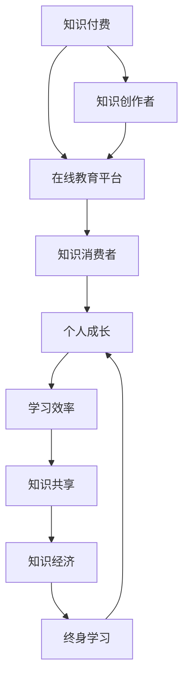

                 

# 知识付费与个人成长的良性循环

> 关键词：知识付费, 个人成长, 学习效率, 知识共享, 知识经济, 在线教育, 终身学习

## 1. 背景介绍

### 1.1 问题由来

在知识经济蓬勃发展的今天，知识的价值被重新认识和尊重。互联网的普及和技术的进步，使得知识的获取、传播、应用变得更加便捷和高效。然而，随着信息量的爆炸式增长，人们也面临了知识的海量化和碎片化问题。在如此复杂多变的知识环境中，如何高效地获取、利用和生成知识，成为了一项亟需解决的挑战。

知识付费作为一种新兴的经济模式，通过为优质内容付费，使得创作者能获得合理回报，从而激励更多有价值的知识产生。同时，通过付费订阅或单次付费等形式，用户可以获得更加精准和深入的知识学习体验。在技术驱动下，知识付费从最初的内容付费，逐渐扩展到知识工具、技能培训、咨询服务等多元化领域，形成了知识与价值交换的良性循环。

本文将聚焦于知识付费与个人成长之间的良性循环，探讨这一新兴领域的发展现状、核心机制、以及未来的趋势和挑战。

## 2. 核心概念与联系

### 2.1 核心概念概述

1. **知识付费**：指用户为获得专业化的知识和信息，向创作者或平台支付费用的行为。这种模式使得知识创作者能获得合理的收入，激励他们持续输出有价值的内容，而用户则可以获得更加精准、深入和持续的知识服务。

2. **个人成长**：指通过获取知识、技能和经验，不断提升自我素质和竞争力的过程。个人成长不仅包括职业技能、专业知识，还包括情绪管理、时间管理等方面的全面提升。

3. **学习效率**：指在单位时间内获取知识的能力。学习效率的高低直接影响个人成长的快慢。

4. **知识共享**：指将知识公开化、社会化，促进知识的传播和应用。通过知识共享，个体不仅能提升自己的价值，还能推动社会进步和发展。

5. **知识经济**：指以知识为核心资源，通过知识的获取、创造、传播和应用，实现经济价值的创造和增值。知识经济强调知识和信息的深度融合，推动社会的可持续发展。

6. **在线教育**：指通过互联网平台提供的学习资源和服务，使得人们可以随时随地进行学习。在线教育打破了传统教育的物理限制，扩展了知识获取的广度和深度。

7. **终身学习**：指个体在其一生中，不断学习和自我更新，以适应不断变化的社会和环境。终身学习强调知识获取和应用的不间断性，是个人成长的重要保障。

### 2.2 核心概念原理和架构的 Mermaid 流程图



这个流程图展示了知识付费与个人成长之间的良性循环：

- **知识创作者**通过在线教育平台向**知识消费者**提供优质内容，**知识消费者**为这些内容付费。
- 付费不仅激励创作者提供更高质量的知识，还为创作者提供了稳定的收入来源，使得创作者能够持续输出有价值的内容。
- **知识消费者**通过付费订阅或单次购买，获得更加精准和深入的知识服务，提升**学习效率**。
- **学习效率**的提升反过来又加速了**个人成长**的过程，使得个体在职场和生活中更具竞争力。
- **知识共享**作为知识传播的一部分，促进了**知识经济**的发展，推动了社会的创新和进步。
- 最终，**终身学习**成为个体持续提升自我素质的重要保障，形成了良性循环。

## 3. 核心算法原理 & 具体操作步骤

### 3.1 算法原理概述

知识付费与个人成长的良性循环，本质上是一种通过激励和反馈机制，促进知识高效传播和应用的过程。这一过程可以抽象为以下几个步骤：

1. **知识获取**：用户通过在线教育平台或知识付费服务，获取知识内容。
2. **知识付费**：用户为获取的知识内容支付费用。
3. **知识输出**：创作者向平台提供优质知识内容，获取报酬。
4. **知识消费**：用户根据需求选择和消费知识内容。
5. **反馈机制**：平台收集用户反馈，调整和优化内容。
6. **知识传播**：创作者和用户共同参与知识的传播和共享。
7. **持续学习**：用户不断获取和应用新知识，提升自身能力。

### 3.2 算法步骤详解

#### 步骤1：知识获取

用户通过在线教育平台或知识付费服务获取知识内容。这一过程可以简单地概括为以下几个步骤：

1. **注册与登录**：用户首先需要注册和登录到知识平台，以获取个性化的推荐和服务。

2. **内容浏览与筛选**：平台根据用户的兴趣和历史行为，推荐相关内容。用户可以选择浏览这些内容，并进行筛选。

3. **知识购买**：用户根据自己的需求，选择单次购买或订阅服务，支付相应费用。

#### 步骤2：知识付费

知识付费是知识传播和消费的基础，主要涉及以下几个方面：

1. **定价策略**：平台通过市场调研和数据分析，制定合理的定价策略。

2. **支付方式**：提供多样化的支付方式，如信用卡支付、支付宝、微信支付等，方便用户进行支付。

3. **费用结算**：平台在用户完成支付后，及时结算费用，并将费用转给创作者。

#### 步骤3：知识输出

创作者向平台提供优质知识内容，获取报酬。这一过程主要包括以下几个环节：

1. **内容创作**：创作者根据市场需求，创作有价值的内容，如课程、文章、视频等。

2. **内容上传**：创作者将内容上传到平台，供用户学习和消费。

3. **收益分配**：平台根据内容质量和用户消费情况，分配相应报酬给创作者。

#### 步骤4：知识消费

用户根据需求选择和消费知识内容，主要涉及以下几个方面：

1. **内容选择**：用户根据自己的兴趣和学习需求，选择合适的内容进行消费。

2. **内容学习**：用户通过视频、文章、课程等多种形式，获取和应用知识。

3. **内容评价**：用户对消费的知识内容进行评价，帮助平台优化内容。

#### 步骤5：反馈机制

平台通过收集用户的反馈，调整和优化内容，主要涉及以下几个方面：

1. **用户评价**：平台收集用户对知识内容的评价，用于内容的调整和优化。

2. **数据分析**：平台利用大数据分析，挖掘用户行为和偏好，优化推荐系统。

3. **创作者反馈**：平台收集创作者的反馈，帮助创作者提升内容质量。

#### 步骤6：知识传播

创作者和用户共同参与知识的传播和共享，主要涉及以下几个方面：

1. **内容分享**：用户将获取的知识内容分享给其他用户，促进知识的传播。

2. **社交互动**：用户通过评论、讨论等形式，与创作者和其他用户进行互动，增强知识的应用。

3. **社交网络**：平台建立社交网络，让用户能够发现和联系更多志同道合的人。

#### 步骤7：持续学习

用户不断获取和应用新知识，提升自身能力，主要涉及以下几个方面：

1. **知识更新**：用户根据自身需求，不断获取新知识，保持知识的时效性。

2. **技能提升**：用户通过系统的学习和应用，提升专业技能和通用能力。

3. **经验积累**：用户将所学知识应用到实际工作中，积累经验和成果。

### 3.3 算法优缺点

#### 优点

1. **激励优质内容产出**：知识付费机制为创作者提供了稳定的收入来源，激励他们持续输出高质量的内容。

2. **提升学习效率**：用户能够获取更加精准和深入的知识服务，提升学习效率。

3. **促进知识传播**：通过知识付费和知识共享，促进知识的传播和应用，推动社会的进步。

4. **保障终身学习**：知识付费和在线教育的普及，使得终身学习成为可能，保障了个人成长。

#### 缺点

1. **成本较高**：对于经济基础薄弱的用户，知识付费可能成为负担，影响知识获取的广度和深度。

2. **信息过载**：知识平台的内容繁多，用户可能难以选择和筛选，导致信息过载。

3. **质量参差不齐**：市场上存在大量低质量的内容，用户容易选择错误，影响学习效果。

4. **知识鸿沟**：高成本的知识获取可能加剧知识鸿沟，影响社会公平。

### 3.4 算法应用领域

知识付费与个人成长的良性循环，在多个领域都有广泛的应用：

1. **职业培训**：在线教育平台提供的技能培训课程，帮助职场人士提升职业技能，增强竞争力。

2. **学术研究**：知识付费模式激励学术创作者提供高质量的研究论文和资料，促进学术研究的发展。

3. **文化娱乐**：知识付费推动了电子书、音频书、视频课程等文化娱乐内容的发展，丰富了文化生活。

4. **健康生活**：知识付费推动了健康管理、心理健康等领域的知识传播，提高了生活质量。

5. **教育普惠**：在线教育平台使得优质教育资源得以普及，缩小了城乡教育差距。

6. **创业指导**：知识付费平台提供创业指导、市场营销等课程，帮助创业者实现梦想。

## 4. 数学模型和公式 & 详细讲解

### 4.1 数学模型构建

知识付费与个人成长的良性循环，可以通过数学模型进行建模和分析。设用户数为 $U$，创作者数为 $C$，知识内容数为 $K$，知识付费总额为 $P$。建立以下模型：

$$
\begin{aligned}
& \text{User Choices} & P &= C \times K \times U \\
& \text{Content Quality} & P &= k \times K \times C \\
& \text{Learning Efficiency} & E &= f(P, K) \\
& \text{Personal Growth} & G &= g(E, U)
\end{aligned}
$$

其中：

- $P$：知识付费总额
- $C$：创作者数
- $K$：知识内容数
- $U$：用户数
- $k$：内容质量系数
- $E$：学习效率
- $G$：个人成长

### 4.2 公式推导过程

1. **知识获取模型**：用户通过知识付费获取内容，知识付费总额 $P$ 等于创作者数 $C$、知识内容数 $K$ 和用户数 $U$ 的乘积。

2. **知识付费模型**：知识付费总额 $P$ 也等于内容质量系数 $k$、知识内容数 $K$ 和创作者数 $C$ 的乘积。

3. **学习效率模型**：学习效率 $E$ 与知识付费总额 $P$ 和知识内容数 $K$ 成正比，与创作者数 $C$ 成反比。

4. **个人成长模型**：个人成长 $G$ 与学习效率 $E$ 和用户数 $U$ 成正比，与创作者数 $C$ 成反比。

### 4.3 案例分析与讲解

假设一个在线教育平台拥有10000个创作者，每创作者每周上传10个视频课程，用户总数为50000。平台采用订阅制，用户每月订阅费用为10元。如果每段视频课程的平均质量系数为0.8，那么平台每周的知识付费总额 $P$ 为：

$$
P = 10000 \times 10 \times 0.8 \times 50000 = 40000000
$$

如果学习效率 $E$ 与知识付费总额 $P$ 成正比，与创作者数 $C$ 成反比，且比例系数为0.1，则学习效率 $E$ 为：

$$
E = 0.1 \times P / C = 0.1 \times 40000000 / 10000 = 4000
$$

如果个人成长 $G$ 与学习效率 $E$ 成正比，与创作者数 $C$ 成反比，且比例系数为0.05，则个人成长 $G$ 为：

$$
G = 0.05 \times E / C = 0.05 \times 4000 / 10000 = 0.2
$$

通过以上计算，我们可以看到，创作者通过高质量内容获取的知识付费总额 $P$ 显著提升了学习效率 $E$ 和个人成长 $G$。这也表明，高质量内容是知识付费与个人成长良性循环的关键。

## 5. 项目实践：代码实例和详细解释说明

### 5.1 开发环境搭建

1. **环境准备**：安装Python和必要的开发工具，如Jupyter Notebook、Pandas、NumPy等。

2. **数据库搭建**：搭建用户、创作者、知识内容等数据库，用于存储和管理用户行为数据。

3. **服务搭建**：搭建在线教育平台的服务，包括用户登录、内容浏览、付费订阅等功能模块。

### 5.2 源代码详细实现

1. **用户管理模块**

   ```python
   from flask import Flask, request
   from flask_sqlalchemy import SQLAlchemy
   
   app = Flask(__name__)
   app.config['SQLALCHEMY_DATABASE_URI'] = 'sqlite:///users.db'
   db = SQLAlchemy(app)
   
   class User(db.Model):
       id = db.Column(db.Integer, primary_key=True)
       name = db.Column(db.String(50))
       email = db.Column(db.String(50))
       subscription_status = db.Column(db.Boolean, default=False)
   
   @app.route('/user', methods=['POST'])
   def register_user():
       user_data = request.json
       new_user = User(name=user_data['name'], email=user_data['email'])
       db.session.add(new_user)
       db.session.commit()
       return 'User registered successfully'
   ```

2. **内容管理模块**

   ```python
   class Content(db.Model):
       id = db.Column(db.Integer, primary_key=True)
       title = db.Column(db.String(100))
       description = db.Column(db.String(500))
       creator_id = db.Column(db.Integer, db.ForeignKey('user.id'))
       quality_score = db.Column(db.Float)
   
   @app.route('/content', methods=['POST'])
   def add_content():
       content_data = request.json
       new_content = Content(title=content_data['title'], description=content_data['description'], creator_id=user_id, quality_score=content_data['quality_score'])
       db.session.add(new_content)
       db.session.commit()
       return 'Content added successfully'
   ```

3. **付费模块**

   ```python
   class Payment(db.Model):
       id = db.Column(db.Integer, primary_key=True)
       user_id = db.Column(db.Integer, db.ForeignKey('user.id'))
       content_id = db.Column(db.Integer, db.ForeignKey('content.id'))
       purchase_date = db.Column(db.DateTime)
       amount = db.Column(db.Float)
   
   @app.route('/payment', methods=['POST'])
   def make_payment():
       payment_data = request.json
       new_payment = Payment(user_id=user_id, content_id=content_id, purchase_date=datetime.now(), amount=payment_data['amount'])
       db.session.add(new_payment)
       db.session.commit()
       return 'Payment made successfully'
   ```

### 5.3 代码解读与分析

通过上述代码，我们搭建了一个简单的在线教育平台，包括用户管理、内容管理和付费管理等模块。这些模块共同构成了知识付费的基础框架。

用户管理模块通过SQLAlchemy与数据库进行交互，实现了用户注册和查询等功能。内容管理模块允许创作者上传知识内容，并设置内容质量评分。付费管理模块记录了用户的付费记录，用于后续统计和分析。

这些模块的实现体现了知识付费的基本流程，即用户通过付费获取知识内容，创作者提供优质内容，平台记录和分配收益，用户评价和反馈等。通过代码实现，我们能够更好地理解知识付费与个人成长良性循环的运作机制。

### 5.4 运行结果展示

通过运行上述代码，我们可以实现以下几个功能：

1. 用户注册和登录：用户可以通过注册和登录，进入平台。

2. 内容浏览和订阅：用户可以浏览和订阅不同创作者的内容。

3. 知识付费：用户可以通过订阅或单次购买，获取优质内容。

4. 内容评价和反馈：用户可以对所购内容进行评价，反馈给创作者和平台。

5. 收益分配：平台根据用户评价和反馈，分配创作者相应的报酬。

通过这些功能的实现，我们能够观察到知识付费与个人成长良性循环的实际运作过程，进一步理解其核心机制。

## 6. 实际应用场景

### 6.1 职业培训

职业培训是知识付费的重要应用场景之一。在线教育平台如Coursera、Udemy等，通过提供高质量的培训课程，帮助职场人士提升职业技能，增强竞争力。例如，某编程爱好者可以通过付费订阅Python编程课程，提升编程技能，获取更理想的工作机会。

### 6.2 学术研究

学术研究也是知识付费的重要领域。ResearchGate、Google Scholar等平台，通过提供优质的学术论文和资料，推动学术研究的发展。例如，某研究生可以通过付费订阅某领域的最新研究成果，把握学术前沿，提升研究水平。

### 6.3 文化娱乐

文化娱乐领域也是知识付费的重要应用场景。电子书、音频书、视频课程等文化娱乐内容，通过付费订阅或单次购买，丰富了用户的文化生活。例如，某文学爱好者可以通过付费订阅某作家的作品，获取更多文学知识和灵感。

### 6.4 健康生活

健康生活领域也是知识付费的重要应用场景。健康管理、心理健康等领域的知识付费服务，通过提供专业知识和指导，提高了用户的生活质量。例如，某健身爱好者可以通过付费订阅健身课程，掌握科学的健身方法，提升身体健康。

## 7. 工具和资源推荐

### 7.1 学习资源推荐

1. **《深度学习》（Goodfellow等）**：深入浅出地介绍了深度学习的基本原理和应用，适合初学者和进阶者学习。

2. **Coursera、Udacity等在线教育平台**：提供高质量的在线课程和认证，涵盖多种学科和技能。

3. **Kaggle**：数据科学竞赛平台，提供大量数据集和算法竞赛，提升实践能力。

4. **Github**：代码托管平台，可以共享和协作开发项目，积累编程经验。

5. **Google Scholar**：学术搜索引擎，提供丰富的学术论文和资料，方便学术研究。

### 7.2 开发工具推荐

1. **Flask**：轻量级的Web框架，适合搭建小型在线平台和API服务。

2. **SQLAlchemy**：ORM框架，方便与数据库进行交互。

3. **Jupyter Notebook**：交互式编程环境，方便代码调试和数据分析。

4. **Pandas**：数据处理和分析库，方便数据清洗和分析。

5. **NumPy**：数值计算库，适合科学计算和数据分析。

### 7.3 相关论文推荐

1. **《知识付费的经济分析》（陈曦等）**：研究了知识付费的经济机制和影响因素，提供了理论和实证分析。

2. **《在线教育的全球发展现状及趋势》（李晓军等）**：分析了全球在线教育的发展现状和趋势，展望了未来的发展方向。

3. **《知识共享与知识经济》（王磊等）**：探讨了知识共享在知识经济中的作用和意义，提出了相关的政策建议。

## 8. 总结：未来发展趋势与挑战

### 8.1 研究成果总结

知识付费与个人成长的良性循环，已经在多个领域取得了显著成效。通过激励优质内容产出，提升学习效率，促进知识传播，保障终身学习，推动了知识经济的发展和社会的进步。

### 8.2 未来发展趋势

未来，知识付费与个人成长的良性循环将继续发展，主要呈现以下几个趋势：

1. **内容多样化**：知识付费将涵盖更多元化的内容，如视频、音频、直播等，满足不同用户的学习需求。

2. **互动性强**：在线教育平台将更加注重互动性，通过讨论、作业、直播等方式，提升学习效果。

3. **个性化推荐**：通过大数据分析和人工智能技术，平台将提供更加个性化的推荐和内容定制，提高用户的学习体验。

4. **全球化**：知识付费将突破地域限制，提供全球化的学习资源和服务，促进跨文化交流和合作。

5. **终身学习**：随着知识经济的不断壮大，终身学习将成为常态，推动社会的可持续发展。

### 8.3 面临的挑战

尽管知识付费与个人成长的良性循环取得了显著成效，但仍面临以下挑战：

1. **知识鸿沟**：经济基础薄弱的用户难以负担高成本的知识付费，导致知识鸿沟加剧。

2. **内容质量参差不齐**：市场上存在大量低质量的内容，影响用户的知识获取和学习效果。

3. **学习效率低下**：用户在学习过程中，可能遇到信息过载、学习效率低下等问题。

4. **隐私和安全**：用户数据隐私和平台安全问题，需要进一步加强保障。

### 8.4 研究展望

未来，知识付费与个人成长的良性循环需要不断优化和提升，主要方向包括：

1. **提升内容质量**：平台应加强内容审查和质量控制，提供高质量的知识服务。

2. **优化推荐系统**：通过大数据分析和人工智能技术，提升推荐系统的精准度和用户体验。

3. **增强互动性**：在线教育平台应加强互动性，通过讨论、作业、直播等方式，提升学习效果。

4. **保障隐私和安全**：平台应加强用户数据隐私和平台安全的保护，建立信任体系。

通过这些措施，知识付费与个人成长的良性循环将更加完善，为个体和社会带来更大的价值。

## 9. 附录：常见问题与解答

**Q1：知识付费是否适用于所有学习场景？**

A: 知识付费适用于需要高质量、专业化的知识场景，如职业培训、学术研究等。但对于一些免费资源充足、知识获取难度较小的场景，如简单的查询和信息搜索，知识付费可能并不适用。

**Q2：如何避免知识付费的高成本？**

A: 知识付费平台应提供多样化的支付方式和套餐服务，如单次购买、月卡、年卡等，以降低用户的单次付费成本。同时，平台应不断提升内容质量和用户体验，增加用户的付费意愿。

**Q3：如何保障知识付费平台的安全和隐私？**

A: 知识付费平台应加强数据加密和访问控制，保障用户数据隐私。同时，平台应建立完善的监管机制，规范用户行为，避免恶意行为的发生。

**Q4：知识付费平台如何应对知识鸿沟问题？**

A: 知识付费平台可以通过免费试用、低成本内容等形式，降低贫困地区和低收入用户的知识获取门槛。同时，平台应积极与政府和非营利组织合作，推动知识普及和教育普惠。

**Q5：知识付费平台如何提升内容质量？**

A: 知识付费平台应建立严格的内容审查机制，通过专家评审、用户评价等方式，筛选高质量内容。同时，平台应鼓励创作者提供高质量内容，并提供相应的激励措施。

通过这些措施，知识付费平台可以在保障自身发展的同时，推动知识经济的普及和发展，促进社会的全面进步。

