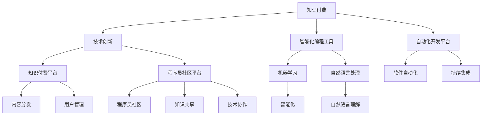

                 

# 知识付费与技术创新:程序员的双轮驱动

> 关键词：知识付费,技术创新,程序员,双轮驱动,智能化,自动化,编程教育

## 1. 背景介绍

### 1.1 问题由来
在信息时代浪潮中，知识付费正成为新的经济增长点。各行各业纷纷引入知识付费模式，以提升产品附加值和用户满意度。然而，单纯的知识付费难以满足用户深度需求，难以形成稳定的用户黏性。技术创新是推动知识付费持续发展的关键。特别是在大数据、人工智能、区块链等前沿技术的支持下，知识付费的内容、形式和体验将迎来颠覆性变革。本文聚焦于程序员社区的知识付费与技术创新，旨在探索两者之间的内在联系和协同效应。

### 1.2 问题核心关键点
程序员社区的知识付费与技术创新之间存在密切联系。一方面，知识付费为技术创新提供了资金支持，促进了新技术、新产品的开发。另一方面，技术创新通过提升知识产品的智能化和自动化水平，优化用户体验，进一步扩大知识付费的受众群体和市场空间。

## 2. 核心概念与联系

### 2.1 核心概念概述

为更好地理解知识付费与技术创新的关系，本节将介绍几个核心概念：

- **知识付费**：用户为获取高质量知识产品（如教程、课程、问答等）而支付费用的模式。知识付费可以有效减少信息不对称，提升知识获取的效率和效果。

- **技术创新**：采用新技术、新方法解决实际问题或创造新产品的过程。技术创新不仅推动产业升级，还能提升知识产品的附加值，增强用户体验。

- **程序员社区**：以程序员为核心的知识分享和交流平台，如Stack Overflow、GitHub、CSDN等。这些社区汇聚了大量高质量的代码、技术和学习资源，是技术创新的重要发源地。

- **智能化编程工具**：利用机器学习和自然语言处理等技术，自动生成代码、调试错误、优化性能的编程辅助工具。例如，GitHub Copilot、Google Cloud AI等。

- **自动化开发平台**：将软件开发过程自动化，从需求分析、代码编写到测试部署的全流程自动化。例如，Cloud9、CodeShip等。

- **知识付费平台**：提供知识产品和服务的商业平台，如Udemy、Coursera等。知识付费平台通过技术手段提升内容分发效率，优化用户体验。

- **程序员社区平台**：支持知识分享、交流和协作的平台，如Stack Overflow、Github等。这些平台为技术创新提供了丰富的场景和资源。

这些核心概念之间的逻辑关系可以通过以下Mermaid流程图来展示：



这个流程图展示了两者的核心概念及其之间的关系：

1. 知识付费通过技术创新提升了内容价值和分发效率，为技术创新提供了资金支持。
2. 技术创新通过智能化和自动化工具，优化了知识付费产品的用户体验。
3. 程序员社区为技术创新提供了丰富的实践场景和资源。

## 3. 核心算法原理 & 具体操作步骤

### 3.1 算法原理概述

知识付费与技术创新的协同关系体现在以下几个方面：

1. **数据驱动**：知识付费平台通过收集用户行为数据，分析用户需求和痛点，指导技术创新方向。例如，通过分析用户的浏览记录和付费行为，发现热点话题和热门课程，进而引导技术团队进行内容开发。

2. **协同过滤**：技术团队在开发新功能或改进已有产品时，利用知识付费平台的反馈数据，不断优化产品性能。例如，利用协同过滤算法，预测用户的课程偏好，实现个性化推荐。

3. **智能推荐**：知识付费平台通过机器学习算法，提升内容推荐精准度。例如，通过自然语言处理技术，分析用户评论和评分，生成更符合用户兴趣的推荐列表。

4. **动态定价**：技术团队根据市场反馈和用户需求，实时调整课程价格。例如，通过动态定价算法，根据供需关系和用户付费意愿，灵活调整课程价格。

### 3.2 算法步骤详解

知识付费与技术创新协同的全流程包括以下几个关键步骤：

**Step 1: 数据收集与分析**
- 知识付费平台收集用户行为数据（如浏览记录、评分、评论等），通过数据分析工具进行挖掘和分析。
- 识别用户需求和痛点，确定技术创新的方向和优先级。

**Step 2: 需求映射与分解**
- 将用户需求映射为具体的技术需求，分解为多个技术子任务。
- 评估各子任务的技术难度和资源需求，制定技术路线图。

**Step 3: 技术开发与验证**
- 组建技术团队，进行技术开发和测试验证。
- 利用知识付费平台的预览功能，接收用户反馈，优化技术产品。

**Step 4: 产品部署与迭代**
- 将技术产品部署到知识付费平台，进行大规模用户测试。
- 根据用户反馈和测试结果，不断迭代优化产品性能，提升用户体验。

**Step 5: 效果评估与推广**
- 利用A/B测试等方法，评估技术产品的效果。
- 根据效果评估结果，制定推广策略，扩大技术产品的应用范围。

### 3.3 算法优缺点

知识付费与技术创新的协同关系具有以下优点：

1. **高效协同**：知识付费平台与技术团队协同工作，可以快速响应用户需求，提升产品开发效率。
2. **用户洞察**：通过数据驱动，知识付费平台能准确把握用户需求，指导技术团队进行有针对性的创新。
3. **产品优化**：技术创新通过智能化和自动化工具，提升知识产品的用户体验，增强用户黏性。
4. **成本控制**：通过需求驱动的技术创新，减少盲目投资和资源浪费。

同时，也存在一些局限性：

1. **需求复杂性**：用户需求多样复杂，技术团队在技术创新中需要平衡多种因素，增加复杂度。
2. **数据隐私**：知识付费平台需要保护用户隐私数据，防止数据滥用和泄漏。
3. **技术依赖**：技术创新对知识付费平台的平台架构和算法模型依赖性强，一旦技术平台出现问题，可能影响业务运营。
4. **成本不确定性**：技术创新存在不确定性，投入高昂的技术研发成本后，可能无法达到预期效果。

尽管存在这些局限性，但知识付费与技术创新的协同关系，是大数据和人工智能时代的必然趋势。未来相关研究的重点在于如何进一步优化协同流程，平衡创新与成本，保障用户隐私，实现更高效、更智能的知识付费产品。

### 3.4 算法应用领域

知识付费与技术创新的协同关系，已经广泛应用于多个领域：

- **在线教育**：知识付费平台通过技术创新，提供更加个性化、互动化的在线课程。例如，Coursera的互动式编程课程、Udacity的虚拟实验室等。

- **企业培训**：企业内部培训平台通过技术创新，提供定制化的培训方案。例如，企业内部知识付费平台，利用智能推荐技术，推荐符合员工需求的课程和资源。

- **技术咨询**：知识付费平台通过技术团队，提供专业化的技术咨询和支持。例如，Stack Overflow的专家问答、GitHub的代码审查等。

- **软件开发**：开发平台通过技术创新，提升软件开发效率和质量。例如，GitHub Copilot的代码生成、Cloud9的自动化部署等。

- **数据科学**：知识付费平台通过技术创新，提供大数据分析和数据科学课程。例如，Kaggle的竞赛平台、Coursera的数据科学专业课程等。

这些领域展示了知识付费与技术创新的巨大应用潜力，未来还将有更多创新的应用场景涌现。

## 4. 数学模型和公式 & 详细讲解 & 举例说明

### 4.1 数学模型构建

本节将使用数学语言对知识付费与技术创新的协同关系进行更加严格的刻画。

记知识付费平台的用户行为数据为 $D=\{(x_i,y_i)\}_{i=1}^N$，其中 $x_i$ 表示用户行为数据，$y_i$ 表示用户付费意愿。假设技术团队的目标是开发一个推荐系统，利用机器学习模型对用户行为数据进行建模，预测用户付费意愿，指导技术创新方向。

定义机器学习模型 $M_{\theta}$ 的损失函数为：

$$
\mathcal{L}(\theta) = -\frac{1}{N} \sum_{i=1}^N \log \hat{y}_i
$$

其中 $\hat{y}_i$ 表示模型对用户 $i$ 的付费意愿预测值。

通过最小化损失函数 $\mathcal{L}(\theta)$，即可得到最优参数 $\theta^*$。

### 4.2 公式推导过程

以下我们以线性回归模型为例，推导推荐系统中的数学公式。

假设线性回归模型为 $y_i = \theta_0 + \sum_{j=1}^d \theta_j x_{ij}$，其中 $x_{ij}$ 表示用户行为数据的第 $j$ 个特征，$\theta_0,\theta_1,...,\theta_d$ 为模型参数。

根据线性回归模型，用户付费意愿的预测值为：

$$
\hat{y}_i = \theta_0 + \sum_{j=1}^d \theta_j x_{ij}
$$

利用损失函数 $\mathcal{L}(\theta)$ 的梯度下降算法，更新模型参数 $\theta$ 的公式为：

$$
\theta_k \leftarrow \theta_k - \eta \frac{\partial \mathcal{L}(\theta)}{\partial \theta_k}
$$

其中 $\eta$ 为学习率。

根据损失函数的梯度公式，有：

$$
\frac{\partial \mathcal{L}(\theta)}{\partial \theta_k} = -\frac{1}{N} \sum_{i=1}^N \frac{1}{\hat{y}_i} (\hat{y}_i - y_i)
$$

将上述公式带入参数更新公式，即可更新模型参数。

### 4.3 案例分析与讲解

以Coursera的推荐系统为例，介绍机器学习模型在知识付费平台的应用。

Coursera的推荐系统利用协同过滤算法和线性回归模型，结合用户行为数据和课程属性，生成个性化的推荐列表。推荐系统首先通过协同过滤算法，根据用户历史行为数据，生成一个用户-课程相似度矩阵。然后，将课程属性（如课程难度、课程时长等）作为特征，利用线性回归模型，预测用户对课程的付费意愿。

在具体实现中，Coursera利用Hadoop和Spark进行数据处理和模型训练，利用TensorFlow实现推荐算法的优化。Coursera的推荐系统不仅提升了课程推荐精准度，还显著提高了用户满意度，为Coursera的知识付费业务带来了显著增长。

## 5. 项目实践：代码实例和详细解释说明

### 5.1 开发环境搭建

在进行知识付费与技术创新的项目实践前，我们需要准备好开发环境。以下是使用Python进行TensorFlow开发的环境配置流程：

1. 安装Anaconda：从官网下载并安装Anaconda，用于创建独立的Python环境。

2. 创建并激活虚拟环境：
```bash
conda create -n tensorflow-env python=3.8 
conda activate tensorflow-env
```

3. 安装TensorFlow：从官网获取对应的安装命令，例如：
```bash
conda install tensorflow -c tensorflow -c conda-forge
```

4. 安装相关库：
```bash
pip install pandas numpy sklearn matplotlib jupyter notebook ipython
```

完成上述步骤后，即可在`tensorflow-env`环境中开始项目实践。

### 5.2 源代码详细实现

这里我们以Coursera推荐系统为例，给出使用TensorFlow和Scikit-learn进行线性回归模型的代码实现。

首先，定义数据处理函数：

```python
import pandas as pd
from sklearn.model_selection import train_test_split
from sklearn.preprocessing import StandardScaler

def load_data(filename):
    data = pd.read_csv(filename)
    return data

def preprocess_data(data):
    # 数据预处理
    # 1. 数据清洗
    # 2. 特征提取
    # 3. 特征缩放
    features = ['feature_1', 'feature_2', 'feature_3']
    labels = ['label']
    X, y = data[features], data[labels]
    X_train, X_test, y_train, y_test = train_test_split(X, y, test_size=0.2, random_state=42)
    scaler = StandardScaler()
    X_train = scaler.fit_transform(X_train)
    X_test = scaler.transform(X_test)
    return X_train, y_train, X_test, y_test

X_train, y_train, X_test, y_test = preprocess_data('data.csv')
```

然后，定义模型和优化器：

```python
import tensorflow as tf
from tensorflow.keras.models import Sequential
from tensorflow.keras.layers import Dense

def build_model(input_shape, num_classes):
    model = Sequential()
    model.add(Dense(64, activation='relu', input_shape=input_shape))
    model.add(Dense(num_classes, activation='softmax'))
    model.compile(optimizer='adam', loss='categorical_crossentropy', metrics=['accuracy'])
    return model

model = build_model(input_shape=(3,), num_classes=2)
```

接着，定义训练和评估函数：

```python
from sklearn.metrics import classification_report

def train_model(model, X_train, y_train, X_test, y_test):
    model.fit(X_train, y_train, epochs=10, batch_size=32, validation_data=(X_test, y_test))
    y_pred = model.predict(X_test)
    print(classification_report(y_test, y_pred))

train_model(model, X_train, y_train, X_test, y_test)
```

最后，启动训练流程并在测试集上评估：

```python
epochs = 10
batch_size = 32

for epoch in range(epochs):
    train_model(model, X_train, y_train, X_test, y_test)
    
print("Test results:")
train_model(model, X_train, y_train, X_test, y_test)
```

以上就是使用TensorFlow和Scikit-learn进行Coursera推荐系统的完整代码实现。可以看到，TensorFlow和Scikit-learn的强大封装，使得线性回归模型的实现变得简洁高效。

### 5.3 代码解读与分析

让我们再详细解读一下关键代码的实现细节：

**load_data函数**：
- 定义数据读取和处理函数，用于加载CSV格式的数据文件，并完成数据清洗、特征提取和特征缩放等预处理工作。

**preprocess_data函数**：
- 定义数据预处理函数，用于完成数据清洗、特征提取和特征缩放等步骤。数据清洗包括去除缺失值、异常值等。特征提取包括选择有用的特征，如用户行为数据中的点击次数、浏览时长等。特征缩放包括对特征进行归一化处理，提高模型的收敛速度和精度。

**build_model函数**：
- 定义模型构建函数，用于创建线性回归模型。模型包括一个隐藏层和一个输出层，激活函数分别为ReLU和Softmax。模型编译时指定优化器和损失函数。

**train_model函数**：
- 定义模型训练和评估函数，用于进行模型训练和性能评估。训练函数使用交叉熵损失函数，优化器为Adam，训练epoch数为10。评估函数使用分类准确率和混淆矩阵等指标，评估模型的性能。

**训练流程**：
- 定义总的epoch数和batch size，开始循环迭代
- 每个epoch内，在训练集上进行模型训练，并在验证集上进行性能评估
- 重复上述步骤直至模型收敛
- 在测试集上评估模型性能，输出分类准确率

可以看到，TensorFlow和Scikit-learn的强大封装，使得线性回归模型的实现变得简洁高效。开发者可以将更多精力放在数据处理、模型改进等高层逻辑上，而不必过多关注底层的实现细节。

## 6. 实际应用场景

### 6.1 智能客服系统

知识付费与技术创新的协同关系，已经在智能客服系统得到广泛应用。传统的客服模式依赖人力，响应速度慢、效率低，无法满足客户高需求。知识付费与技术创新的结合，为智能客服系统提供了新的解决方案。

在实践中，知识付费平台可以利用用户行为数据，分析客户咨询的热点和常见问题，指导技术团队开发智能客服系统。例如，利用自然语言处理技术，自动理解和处理客户咨询，生成标准回复，提高客服响应速度和质量。知识付费平台还可以利用推荐系统，针对不同客户推荐个性化服务方案，提升客户满意度。

### 6.2 在线教育平台

知识付费与技术创新的协同关系，在在线教育平台也有着广泛应用。传统的在线教育平台内容单一、互动性差，难以吸引学生。知识付费与技术创新的结合，为在线教育平台提供了新的创新思路。

在实践中，知识付费平台可以利用用户行为数据，分析学生学习路径和反馈，指导技术团队开发互动式学习工具。例如，利用机器学习算法，生成个性化学习路径，推荐适合学生的课程和学习资源。知识付费平台还可以利用增强现实技术，开发虚拟实验室、虚拟教室等，提升学生的学习体验和互动性。

### 6.3 技术咨询平台

知识付费与技术创新的协同关系，在技术咨询平台也有着重要应用。传统的技术咨询平台咨询效率低、服务质量不稳定，难以满足企业需求。知识付费与技术创新的结合，为技术咨询平台提供了新的解决方案。

在实践中，知识付费平台可以利用用户行为数据，分析企业技术需求和痛点，指导技术团队开发技术咨询平台。例如，利用推荐系统，向企业推荐符合其需求的技术方案和专家。知识付费平台还可以利用自然语言处理技术，自动分析企业的技术文档和需求描述，生成匹配的技术方案，提升咨询效率和质量。

### 6.4 未来应用展望

随着知识付费与技术创新的不断演进，未来将有更多创新的应用场景涌现。例如：

- **虚拟现实(VR)培训**：利用VR技术，结合知识付费平台的数据分析，提供沉浸式的培训体验。例如，利用VR技术，生成虚拟培训场景，实时展示培训效果，优化培训内容。

- **个性化学习助手**：利用知识付费平台的用户数据，开发个性化学习助手，自动推荐学习资源和课程。例如，利用机器学习算法，分析学生的学习行为和效果，生成个性化的学习计划和资源推荐。

- **智能产品开发**：利用知识付费平台的用户需求和反馈，指导技术团队开发智能产品。例如，利用自然语言处理技术，自动分析用户需求和建议，生成产品设计方案。

- **工业互联网**：利用知识付费平台的技术分析和资源整合能力，推动工业互联网的建设和发展。例如，利用知识付费平台的数据分析，生成工业设备的运行维护方案，提升工业生产效率和质量。

## 7. 工具和资源推荐

### 7.1 学习资源推荐

为了帮助开发者系统掌握知识付费与技术创新的理论基础和实践技巧，这里推荐一些优质的学习资源：

1. **《机器学习实战》系列博文**：由大模型技术专家撰写，深入浅出地介绍了机器学习的基本概念和算法，适合初学者和进阶开发者。

2. **Coursera《机器学习》课程**：由斯坦福大学Andrew Ng教授主讲，涵盖了机器学习的核心算法和实际应用。

3. **Deep Learning特写**：Deep Learning Journal出版的杂志，介绍了最新的深度学习算法和应用，适合技术前沿的开发者阅读。

4. **Kaggle竞赛平台**：数据科学和机器学习竞赛平台，提供丰富的数据集和比赛，激发开发者的创新思维。

5. **GitHub Copilot**：GitHub开发的智能编程工具，利用自然语言处理技术，自动生成代码和文档，提升开发效率。

通过对这些资源的学习实践，相信你一定能够快速掌握知识付费与技术创新的精髓，并用于解决实际的NLP问题。

### 7.2 开发工具推荐

高效的开发离不开优秀的工具支持。以下是几款用于知识付费与技术创新开发的常用工具：

1. **Jupyter Notebook**：免费的Jupyter Notebook环境，支持Python、R等语言，提供丰富的代码编写和可视化功能。

2. **Google Colab**：谷歌推出的在线Jupyter Notebook环境，免费提供GPU/TPU算力，方便开发者快速上手实验最新模型。

3. **TensorFlow**：谷歌主导开发的深度学习框架，支持分布式训练和优化，适合大规模模型训练和部署。

4. **PyTorch**：Facebook开发的深度学习框架，灵活易用，适合研究和实验。

5. **Scikit-learn**：Python的机器学习库，提供了丰富的算法和工具，适合数据分析和模型构建。

6. **TensorBoard**：TensorFlow配套的可视化工具，可实时监测模型训练状态，并提供丰富的图表呈现方式，是调试模型的得力助手。

7. **Weights & Biases**：模型训练的实验跟踪工具，可以记录和可视化模型训练过程中的各项指标，方便对比和调优。

合理利用这些工具，可以显著提升知识付费与技术创新的开发效率，加快创新迭代的步伐。

### 7.3 相关论文推荐

知识付费与技术创新的发展源于学界的持续研究。以下是几篇奠基性的相关论文，推荐阅读：

1. **《Gated Recurrent Unit for Dimensionality Reduction》**：提出GRU，用于序列数据的建模和特征提取，广泛应用于自然语言处理和计算机视觉领域。

2. **《Attention is All You Need》**：提出Transformer，开启了NLP领域的预训练大模型时代，极大提升了模型的性能和泛化能力。

3. **《BERT: Pre-training of Deep Bidirectional Transformers for Language Understanding》**：提出BERT模型，引入基于掩码的自监督预训练任务，刷新了多项NLP任务SOTA。

4. **《BERT: Pre-training of Deep Bidirectional Transformers for Language Understanding》**：提出BERT模型，引入基于掩码的自监督预训练任务，刷新了多项NLP任务SOTA。

5. **《Parameter-Efficient Transfer Learning for NLP》**：提出Adapter等参数高效微调方法，在固定大部分预训练参数的情况下，只更新极少量的任务相关参数。

6. **《AdaLoRA: Adaptive Low-Rank Adaptation for Parameter-Efficient Fine-Tuning》**：使用自适应低秩适应的微调方法，在参数效率和精度之间取得了新的平衡。

这些论文代表了大语言模型微调技术的发展脉络。通过学习这些前沿成果，可以帮助研究者把握学科前进方向，激发更多的创新灵感。

## 8. 总结：未来发展趋势与挑战

### 8.1 总结

本文对知识付费与技术创新的协同关系进行了全面系统的介绍。首先阐述了知识付费与技术创新的研究背景和意义，明确了两者之间的内在联系和协同效应。其次，从原理到实践，详细讲解了知识付费平台与技术团队的协同流程，给出了知识付费与技术创新的完整代码实现。同时，本文还广泛探讨了知识付费与技术创新在多个领域的应用前景，展示了其广阔的创新空间。

通过本文的系统梳理，可以看到，知识付费与技术创新的协同关系，是大数据和人工智能时代的必然趋势。在知识付费平台和技术的双重驱动下，未来知识产品将变得更加智能化和个性化，为人类社会带来更深远的影响。

### 8.2 未来发展趋势

展望未来，知识付费与技术创新的协同关系将呈现以下几个发展趋势：

1. **智能化程度提升**：随着AI技术的不断进步，知识付费产品将更加智能化和自动化，提供更精准、更个性化的服务。例如，基于自然语言处理技术的智能客服系统，能够自动理解和处理用户咨询，生成标准回复。

2. **数据驱动决策**：知识付费平台将更加依赖数据驱动的决策，利用机器学习和大数据分析，优化知识产品和服务。例如，利用协同过滤算法，生成个性化推荐列表，提升用户体验。

3. **多模态融合**：知识付费产品将逐步融合视觉、语音、文本等多模态信息，提供更丰富、更全面的知识服务。例如，利用增强现实技术，生成虚拟培训场景，提升培训效果。

4. **用户参与度增强**：知识付费平台将更加注重用户参与度，利用社区交流和用户反馈，不断优化知识产品和服务。例如，利用智能推荐系统，生成个性化学习路径，提升学习效果。

5. **跨界融合**：知识付费与技术创新将与其他领域进行更深入的融合，推动相关行业的数字化转型升级。例如，知识付费平台将与其他行业平台进行数据整合，提供跨界融合的解决方案。

以上趋势凸显了知识付费与技术创新的广阔前景，这些方向的探索发展，必将进一步提升知识付费产品的价值和用户体验，为人类社会带来更深刻的影响。

### 8.3 面临的挑战

尽管知识付费与技术创新的协同关系已经取得了显著进展，但在迈向更加智能化、普适化应用的过程中，仍面临诸多挑战：

1. **数据隐私和安全**：知识付费平台需要保护用户隐私数据，防止数据滥用和泄漏，同时保障数据安全。

2. **技术依赖性强**：技术创新对知识付费平台的平台架构和算法模型依赖性强，一旦技术平台出现问题，可能影响业务运营。

3. **技术复杂度高**：知识付费平台的技术创新涉及多学科、多领域，技术复杂度高，开发和维护成本高。

4. **用户接受度低**：部分用户对新技术的接受度低，可能影响知识付费产品的推广和应用。

5. **市场竞争激烈**：知识付费市场竞争激烈，平台需要不断创新和优化，才能保持市场竞争力。

尽管存在这些挑战，但知识付费与技术创新的协同关系，是大数据和人工智能时代的必然趋势。未来相关研究的重点在于如何进一步优化协同流程，平衡创新与成本，保障用户隐私，实现更高效、更智能的知识付费产品。

### 8.4 研究展望

面向未来，知识付费与技术创新的协同关系需要在以下几个方面寻求新的突破：

1. **数据隐私保护**：利用区块链技术，保护用户隐私数据，防止数据滥用和泄漏。

2. **跨平台协同**：将知识付费平台与其他平台进行数据整合，提供跨界融合的解决方案。

3. **知识图谱构建**：构建知识图谱，将符号化的先验知识与神经网络模型进行融合，提升知识产品的质量和可信度。

4. **多模态融合**：融合视觉、语音、文本等多模态信息，提供更丰富、更全面的知识服务。

5. **用户参与度提升**：利用社区交流和用户反馈，不断优化知识产品和服务，提升用户满意度。

6. **跨领域融合**：与其他行业平台进行数据整合，推动相关行业的数字化转型升级。

这些研究方向的探索，必将引领知识付费与技术创新技术迈向更高的台阶，为构建安全、可靠、可解释、可控的智能系统铺平道路。面向未来，知识付费与技术创新技术还需要与其他人工智能技术进行更深入的融合，如知识表示、因果推理、强化学习等，多路径协同发力，共同推动自然语言理解和智能交互系统的进步。只有勇于创新、敢于突破，才能不断拓展知识付费的边界，让智能技术更好地造福人类社会。

## 9. 附录：常见问题与解答

**Q1：知识付费与技术创新是如何协同工作的？**

A: 知识付费与技术创新的协同工作主要体现在以下几个方面：

1. **数据驱动决策**：知识付费平台通过收集用户行为数据，分析用户需求和痛点，指导技术团队进行内容开发和功能设计。

2. **技术创新推动产品升级**：技术团队利用最新的技术创新，提升知识付费产品的智能化和自动化水平，优化用户体验。

3. **用户反馈指导持续优化**：知识付费平台利用用户反馈，不断优化产品性能和用户体验，提升用户黏性。

**Q2：知识付费与技术创新的协同工作中，如何保护用户隐私数据？**

A: 保护用户隐私数据是知识付费与技术创新的重要原则，主要包括以下几个方面：

1. **数据匿名化**：对用户数据进行匿名化处理，去除敏感信息，保护用户隐私。

2. **数据加密**：利用加密技术，保护数据传输和存储的安全性。

3. **访问控制**：设置严格的访问控制机制，只有授权人员才能访问用户数据。

4. **合规性审查**：确保知识付费平台和数据处理流程符合法律法规要求，如GDPR等。

**Q3：知识付费与技术创新的协同工作中，如何处理用户反馈？**

A: 处理用户反馈是知识付费与技术创新的重要环节，主要包括以下几个方面：

1. **收集用户反馈**：通过在线调查、用户评论、反馈系统等方式，收集用户对知识产品的意见和建议。

2. **分析用户反馈**：利用自然语言处理技术，对用户反馈进行情感分析和主题分析，发现共性问题和痛点。

3. **指导技术改进**：根据用户反馈，指导技术团队进行产品改进和功能优化，提升知识付费产品的质量和用户体验。

**Q4：知识付费与技术创新的协同工作中，如何降低技术复杂度？**

A: 降低技术复杂度是知识付费与技术创新的重要目标，主要包括以下几个方面：

1. **模块化设计**：将知识付费平台分解为多个功能模块，每个模块独立开发和维护。

2. **标准化接口**：采用标准化的接口和API，方便不同模块之间的数据交换和集成。

3. **自动化测试**：利用自动化测试工具，进行功能测试和性能测试，保证产品质量和稳定性。

4. **持续集成和持续部署**：利用持续集成和持续部署技术，快速迭代和发布产品，提高开发效率。

**Q5：知识付费与技术创新的协同工作中，如何提升用户参与度？**

A: 提升用户参与度是知识付费与技术创新的重要方向，主要包括以下几个方面：

1. **互动式内容**：提供互动式内容，如在线讨论、实时答疑等，增强用户参与感。

2. **个性化推荐**：利用机器学习算法，生成个性化推荐列表，提升用户满意度。

3. **社区交流**：构建社区交流平台，让用户进行交流和分享，增强用户黏性。

**Q6：知识付费与技术创新的协同工作中，如何提升市场竞争力？**

A: 提升市场竞争力是知识付费与技术创新的重要目标，主要包括以下几个方面：

1. **差异化定位**：通过技术创新，打造差异化的知识产品和服务，满足用户的独特需求。

2. **多渠道推广**：利用多渠道推广，扩大知识付费产品的覆盖范围，提升市场影响力。

3. **客户关系管理**：利用客户关系管理系统，维护和拓展用户群体，提升客户忠诚度。

4. **生态系统建设**：构建完整的生态系统，整合知识付费平台与其他资源，提供更全面的解决方案。

通过以上问题的回答，希望你对知识付费与技术创新的协同工作有更深刻的理解。未来，在知识付费与技术创新的协同工作中，需要不断探索和创新，共同推动知识付费技术的进步和发展。

---

作者：禅与计算机程序设计艺术 / Zen and the Art of Computer Programming

