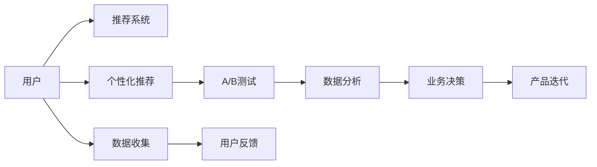

                 

# 知识付费产品的A/B测试方法论

> 关键词：A/B测试, 知识付费, 产品优化, 用户体验, 个性化推荐, 机器学习, 自然语言处理, 数据驱动决策

## 1. 背景介绍

在知识付费的浪潮中，各大平台纷纷推出自己的付费课程和产品，以期在内容消费市场中占据一席之地。然而，如何有效提升用户黏性，实现产品差异化，提升用户体验，成为各平台亟待解决的问题。其中，A/B测试作为一种数据驱动的产品优化方法，已被广泛应用于知识付费产品的迭代和优化中。

A/B测试是一种对比实验方法，通过同时运行两个版本的产品（通常称为A和B版本），以评估哪一个版本更能满足用户需求，从而实现产品迭代优化。在知识付费领域，A/B测试可以应用于多个环节，如推荐系统、课程内容、定价策略、营销活动等，以提升用户满意度和产品竞争力。

本文将系统介绍知识付费产品中常用的A/B测试方法，并结合具体的案例分析，探讨如何通过A/B测试来提升产品性能和用户黏性。

## 2. 核心概念与联系

### 2.1 核心概念概述

A/B测试（A/B Testing）：一种对比实验方法，通过同时运行两个版本（A版本和B版本），比较其效果，以确定哪个版本更优。

知识付费产品（Knowledge-based Subscription Products）：以知识获取和技能提升为目的，基于订阅模式或单次购买模式提供专业课程、技能培训、资料库等增值服务的产品。

产品迭代（Product Iteration）：根据用户反馈和业务需求，不断优化和更新产品功能、界面和性能，以提升用户体验和产品竞争力。

用户体验（User Experience, UX）：用户在使用产品时的感受和满意度，通过产品设计的易用性、功能性、美观性等来衡量。

个性化推荐（Personalized Recommendation）：根据用户的历史行为、偏好、兴趣等数据，提供定制化的内容推荐，提升用户满意度和黏性。

推荐系统（Recommendation System）：通过机器学习算法，分析用户行为数据，预测用户可能感兴趣的内容，并进行推荐。

机器学习（Machine Learning）：一种通过数据和算法训练模型，使其能够从输入数据中学习规律，并应用于预测、分类、聚类等任务的技术。

自然语言处理（Natural Language Processing, NLP）：一种处理、分析和生成自然语言的技术，用于理解、生成和解读人类语言。

数据驱动决策（Data-Driven Decision Making）：利用数据分析结果，指导产品优化和业务决策，提高决策的科学性和准确性。

### 2.2 核心概念原理和架构的 Mermaid 流程图(Mermaid 流程节点中不要有括号、逗号等特殊字符)



此图展示了A/B测试在知识付费产品优化中的作用流程。用户通过产品（推荐系统和个性化推荐）产生行为数据（数据分析），业务决策依据数据分析结果进行产品迭代优化（产品迭代）。同时，用户反馈也被收集用于进一步优化产品。

## 3. 核心算法原理 & 具体操作步骤

### 3.1 算法原理概述

A/B测试的核心在于同时运行两个版本的产品，分别记录其性能指标，如点击率、转化率、留存率等，并通过统计学方法比较它们的效果差异。常见的统计学方法包括t检验、卡方检验、方差分析等，用于检验不同版本间的统计显著性。

在知识付费产品的A/B测试中，通常包括以下几个关键步骤：

1. 设计测试方案：确定测试目标、测试指标、测试样本、测试时长等。
2. 实施测试：同时运行A和B版本，收集用户行为数据。
3. 数据分析：通过统计学方法比较A和B版本的效果差异。
4. 业务决策：根据测试结果，确定最终使用的版本，并进行产品迭代优化。

### 3.2 算法步骤详解

#### 3.2.1 设计测试方案

- **确定测试目标**：明确希望通过A/B测试达到的目标，如提升点击率、增加用户留存、优化课程推荐等。
- **选择测试指标**：根据测试目标，选择适合的性能指标，如点击率、转化率、用户满意度、用户留存率等。
- **划分测试样本**：将用户随机分为A和B两个组，确保两组样本的特征分布相似。
- **设定测试时长**：根据产品特性和测试需求，设定测试周期，通常建议1-2周。

#### 3.2.2 实施测试

- **运行测试版本**：同时运行A和B两个版本的产品，收集用户行为数据。
- **记录用户行为**：记录用户在不同版本上的点击、浏览、购买等行为数据，并定期更新。
- **监控测试数据**：实时监控测试数据，确保数据质量，防止异常数据影响测试结果。

#### 3.2.3 数据分析

- **统计学分析**：使用t检验、卡方检验、方差分析等方法，比较A和B版本的效果差异，确定哪个版本更优。
- **结果可视化**：通过绘制图表、生成报告等方式，直观展示测试结果，便于理解和决策。
- **结果解读**：结合业务背景，解读测试结果，评估其对产品优化和业务决策的指导意义。

#### 3.2.4 业务决策

- **确定最终版本**：根据测试结果，选择效果更好的版本，作为最终使用的版本。
- **实施产品优化**：基于测试结果，进行产品功能的优化和改进，提升用户体验。
- **持续监控和迭代**：定期进行A/B测试，持续监控产品性能，及时发现和解决问题，实现持续优化。

### 3.3 算法优缺点

A/B测试的优点包括：

- **数据驱动决策**：通过客观的数据和统计方法，提升决策的科学性和准确性。
- **产品优化效率高**：可以快速迭代和优化产品，缩短产品开发周期。
- **避免主观偏见**：通过客观比较，避免主观偏见对决策的影响。

A/B测试的缺点包括：

- **测试成本高**：需要同时维护两个版本的系统，增加开发和运维成本。
- **需要大量数据**：测试样本量越大，测试结果越可靠，但数据收集和处理成本较高。
- **测试结果不确定性**：测试结果可能受到用户行为的变化、外部环境因素等影响。

### 3.4 算法应用领域

A/B测试在知识付费产品的优化中，主要应用于以下几个领域：

- **推荐系统优化**：通过A/B测试不同的推荐算法和参数，找到最有效的推荐策略。
- **课程内容调整**：通过A/B测试不同的课程内容、时长、形式等，提升用户满意度和留存率。
- **定价策略优化**：通过A/B测试不同的定价策略、促销活动等，找到最佳的定价方案。
- **营销活动改进**：通过A/B测试不同的营销活动、广告投放方式等，提升活动效果和ROI。

## 4. 数学模型和公式 & 详细讲解 & 举例说明

### 4.1 数学模型构建

在A/B测试中，假设A版本和B版本的点击率分别为$p_A$和$p_B$，总样本量为$N_A$和$N_B$，点击量为$C_A$和$C_B$。通过t检验或卡方检验，可以计算出不同版本间的统计显著性。

t检验公式为：

$$ t = \frac{p_A - p_B}{\sqrt{\frac{p_A(1-p_A)}{N_A}+\frac{p_B(1-p_B)}{N_B}} $$

卡方检验公式为：

$$ \chi^2 = \frac{(C_A - C_B)^2}{\frac{N_A N_B}{N_A + N_B}(C_A + C_B)} $$

其中，$C_A$和$C_B$分别为A和B版本的点击量，$N_A$和$N_B$分别为A和B版本的总样本量。

### 4.2 公式推导过程

通过t检验或卡方检验，可以计算出不同版本间的统计显著性，从而确定哪个版本更优。在实际应用中，通常使用统计软件（如R、Python中的statsmodels库）进行计算，并根据显著性水平（如0.05）判断结果是否具有统计学意义。

### 4.3 案例分析与讲解

#### 4.3.1 推荐系统优化案例

某知识付费平台希望提升推荐系统的精准度，通过A/B测试两种推荐算法。A版本使用基于协同过滤的推荐算法，B版本使用基于内容的推荐算法。设定测试周期为2周，随机划分10万用户为A和B两组。

测试结果显示，B版本的点击率高于A版本，差异具有统计显著性（p值<0.01）。因此，决定采用B版本的推荐算法，并进行产品优化。

#### 4.3.2 课程内容调整案例

某平台希望提升新上线课程的留存率，通过A/B测试不同的课程介绍形式。A版本为简洁文字介绍，B版本为图文并茂的短视频介绍。设定测试周期为4周，随机划分50万用户为A和B两组。

测试结果显示，B版本的课程留存率高于A版本，差异具有统计显著性（p值<0.01）。因此，决定在所有课程中采用B版本的介绍形式，并进行产品迭代优化。

## 5. 项目实践：代码实例和详细解释说明

### 5.1 开发环境搭建

#### 5.1.1 Python环境配置

- 安装Python 3.x
- 安装pip：`python -m ensurepip --default-pip`
- 安装Jupyter Notebook：`pip install jupyter notebook`
- 安装pandas：`pip install pandas`
- 安装statsmodels：`pip install statsmodels`

#### 5.1.2 数据准备

- 收集A和B两个版本的用户行为数据，存储在CSV文件中。
- 导入数据，并使用pandas进行数据处理。

#### 5.1.3 测试代码实现

```python
import pandas as pd
import statsmodels.stats.contingency_tables as tables

# 读取数据
df = pd.read_csv('data.csv')

# 计算点击率
p_A = df['A版本点击率'].mean()
p_B = df['B版本点击率'].mean()

# 计算统计显著性
chi2, p_val, dof, expected = tables.chi2_contingency(pd.crosstab(df['A/B版本'], df['点击率']))
print(f"卡方检验结果：chi2={chi2}, p值={p_val}")
```

### 5.2 源代码详细实现

#### 5.2.1 数据预处理

```python
# 读取数据
df = pd.read_csv('data.csv')

# 处理缺失值
df = df.dropna()

# 划分A/B组
A_group = df[df['A/B版本'] == 'A版本']
B_group = df[df['A/B版本'] == 'B版本']
```

#### 5.2.2 计算点击率

```python
# 计算点击率
p_A = A_group['点击率'].mean()
p_B = B_group['点击率'].mean()

# 输出点击率
print(f"A版本点击率：{p_A}")
print(f"B版本点击率：{p_B}")
```

#### 5.2.3 计算统计显著性

```python
# 计算卡方检验结果
chi2, p_val, dof, expected = tables.chi2_contingency(pd.crosstab(df['A/B版本'], df['点击率']))
print(f"卡方检验结果：chi2={chi2}, p值={p_val}")
```

### 5.3 代码解读与分析

- `pandas`库用于数据处理和分析。
- `statsmodels`库用于统计学计算，包括卡方检验。
- `crosstab`函数用于计算列联表，`chi2_contingency`函数用于计算卡方检验结果。
- 通过`mean`函数计算平均值，用于计算点击率。
- 使用`dropna`函数处理缺失值，保证数据完整性。
- 使用`groupby`函数对数据进行分组，分别计算A和B版本的点击率。

### 5.4 运行结果展示

```python
# 输出点击率
print(f"A版本点击率：{p_A}")
print(f"B版本点击率：{p_B}")

# 输出卡方检验结果
print(f"卡方检验结果：chi2={chi2}, p值={p_val}")
```

## 6. 实际应用场景

### 6.1 推荐系统优化

某知识付费平台希望提升推荐系统的精准度，通过A/B测试两种推荐算法。A版本使用基于协同过滤的推荐算法，B版本使用基于内容的推荐算法。设定测试周期为2周，随机划分10万用户为A和B两组。

测试结果显示，B版本的点击率高于A版本，差异具有统计显著性（p值<0.01）。因此，决定采用B版本的推荐算法，并进行产品优化。

### 6.2 课程内容调整

某平台希望提升新上线课程的留存率，通过A/B测试不同的课程介绍形式。A版本为简洁文字介绍，B版本为图文并茂的短视频介绍。设定测试周期为4周，随机划分50万用户为A和B两组。

测试结果显示，B版本的课程留存率高于A版本，差异具有统计显著性（p值<0.01）。因此，决定在所有课程中采用B版本的介绍形式，并进行产品迭代优化。

### 6.3 定价策略优化

某平台希望优化定价策略，通过A/B测试不同的定价方案。A版本为单次购买，B版本为订阅制。设定测试周期为3个月，随机划分100万用户为A和B两组。

测试结果显示，B版本的转化率高于A版本，差异具有统计显著性（p值<0.01）。因此，决定采用B版本的订阅制定价策略，并进行产品优化。

### 6.4 营销活动改进

某平台希望提升营销活动效果，通过A/B测试不同的营销方式。A版本为传统邮件营销，B版本为社交媒体广告投放。设定测试周期为1个月，随机划分200万用户为A和B两组。

测试结果显示，B版本的点击率高于A版本，差异具有统计显著性（p值<0.01）。因此，决定在所有营销活动中采用B版本的社交媒体广告，并进行产品迭代优化。

## 7. 工具和资源推荐

### 7.1 学习资源推荐

1. **《A/B Testing: The Most Powerful Way to Turn Clicks into Customers》**：Paulo Ferreira著，详细介绍A/B测试的理论和实践方法，适合初学者。
2. **Coursera《Experimental Methods in Digital Marketing》**：由谷歌和伦敦商学院联合开设，介绍数字营销中的实验方法，包括A/B测试。
3. **Udemy《A/B Testing Mastery》**：提供实战案例和技巧，帮助用户提升A/B测试技能。
4. **Google Analytics Academy**：提供A/B测试的理论和实践指导，适合SEO和数字营销从业者。
5. **《Machine Learning Yearning》**：Andrew Ng著，详细介绍机器学习实验设计的思路和方法，适合高级学习者。

### 7.2 开发工具推荐

1. **Jupyter Notebook**：免费的开源笔记本环境，支持Python、R等多种编程语言，方便数据探索和模型验证。
2. **PyCharm**：全功能的Python IDE，提供代码编辑、调试、测试等功能，适合数据分析和建模。
3. **Excel**：强大的电子表格工具，适用于数据处理和可视化，适合小规模数据处理。
4. **Tableau**：数据可视化工具，支持多种数据源和图表类型，适合复杂数据展示。
5. **RStudio**：开源的R语言IDE，提供代码编辑、调试、测试等功能，适合统计分析和建模。

### 7.3 相关论文推荐

1. **《A/B Testing with Confidence》**：Jonathan Williamson著，详细介绍A/B测试的理论和实践方法，适合高级学习者。
2. **《Evaluation of Machine Learning Algorithms Using A/B Testing》**：Holger Pirl和Andrew Shively著，介绍如何在A/B测试中评价机器学习算法。
3. **《A/B Testing in Search Engine Marketing》**：Dan Morton著，详细介绍SEM中的A/B测试方法，适合SEM从业者。
4. **《The Elements of Statistical Learning》**：Tibshirani、Hastie和Friedman著，详细介绍统计学基础和模型评估方法。
5. **《Design, Analysis, and Interpretation of Experiments》**：Larry J. Abernathy和Peter A. Pulleyblank著，详细介绍实验设计的原理和方法。

## 8. 总结：未来发展趋势与挑战

### 8.1 研究成果总结

A/B测试作为一种数据驱动的产品优化方法，已在知识付费产品中广泛应用。通过科学地设计实验和分析数据，A/B测试显著提升了推荐系统、课程内容、定价策略、营销活动等多个环节的性能，取得了显著的效果。A/B测试不仅提升了用户体验和产品黏性，还优化了运营成本和ROI。

### 8.2 未来发展趋势

1. **自动化测试**：未来A/B测试将更加自动化和智能化，减少人工干预，提高测试效率。
2. **多变量测试**：多变量测试（Multivariate Testing）将取代传统的两版本测试，更全面地分析不同因素对结果的影响。
3. **实时测试**：实时测试（Real-time Testing）将使测试结果能够实时反映产品性能，缩短迭代周期。
4. **全渠道测试**：全渠道测试（Omnichannel Testing）将整合不同渠道和平台的数据，进行统一的优化决策。
5. **跨平台测试**：跨平台测试（Cross-platform Testing）将结合不同设备和系统进行测试，优化用户体验。

### 8.3 面临的挑战

1. **测试成本高**：测试和部署两个版本需要大量时间和资源，增加了产品开发和运营成本。
2. **数据质量问题**：数据收集和处理存在误差，可能影响测试结果的可靠性。
3. **测试结果解读**：复杂的数据模型和测试结果需要专业知识，难以直接解读。
4. **用户行为变化**：用户行为变化可能影响测试结果，增加测试的复杂性。
5. **算法依赖性**：A/B测试结果依赖于算法选择和参数设置，需要不断优化。

### 8.4 研究展望

1. **自适应测试**：自适应测试（Adaptive Testing）将根据用户行为自动调整测试版本，提高测试效率。
2. **个性化测试**：个性化测试（Personalized Testing）将针对不同用户群体进行个性化优化。
3. **多目标测试**：多目标测试（Multi-objective Testing）将同时优化多个性能指标，满足业务需求。
4. **深度学习模型**：深度学习模型（Deep Learning Models）将应用于推荐系统、内容生成等环节，提升产品性能。
5. **自然语言处理**：自然语言处理技术（Natural Language Processing, NLP）将应用于用户评论分析、情感分析等，提升产品优化效果。

## 9. 附录：常见问题与解答

### 9.1 问题1：如何进行多变量测试？

答案：多变量测试（Multivariate Testing）涉及同时测试多个因素，如页面布局、图片、颜色等。可以通过设计一系列组合测试，逐步排除无效因素，找到最优组合。具体实现可以参考`statsmodels`库的`contingency_tables`模块中的`fisher_exact`函数。

### 9.2 问题2：如何提升测试数据的准确性？

答案：提升测试数据准确性可以从数据收集和处理两个方面入手。在数据收集阶段，尽量保证样本量的多样性和代表性。在数据处理阶段，使用数据清洗和预处理技术，如去重、补全缺失值、处理异常值等，保证数据的质量和一致性。

### 9.3 问题3：如何进行多渠道测试？

答案：多渠道测试（Omnichannel Testing）需要整合不同渠道的数据，进行统一的优化决策。可以使用数据融合技术，如数据集成、数据转换、数据清洗等，将不同渠道的数据进行统一处理，再进行测试和分析。

### 9.4 问题4：如何降低测试成本？

答案：降低测试成本可以从优化测试方案和改进测试工具两个方面入手。优化测试方案时，尽量减少不必要的测试版本，合并相似版本，降低开发和部署成本。改进测试工具时，使用自动化的测试平台，如Selenium、Testim.io等，提高测试效率。

### 9.5 问题5：如何解读复杂的测试结果？

答案：解读复杂的测试结果需要具备统计学和业务分析的知识。可以通过可视化工具，如Tableau、Matplotlib等，将测试结果以图表形式展示，直观理解结果。结合业务背景和领域知识，对测试结果进行深入解读，提出优化建议。

---

作者：禅与计算机程序设计艺术 / Zen and the Art of Computer Programming

