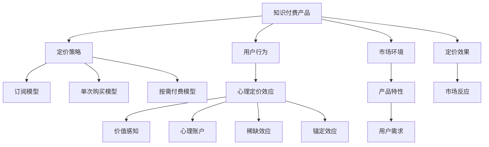

                 

# 知识付费产品的定价心理学

> 关键词：知识付费, 定价策略, 用户行为, 心理账户, 心理定价效应, 订阅模型, 价值感知, 影响因素

## 1. 背景介绍

随着互联网技术的发展和信息获取渠道的多元化，知识付费产品逐渐成为人们获取知识和信息的重要方式。从线上学习课程到软件订阅服务，再到深度咨询顾问，知识付费产品以其独特的价值吸引了大批用户。然而，面对激烈的市场竞争和不断变化的用户需求，如何制定有效的定价策略，以实现商业成功和用户满意的双赢，成为了知识付费平台需要解决的核心问题。

本文将从心理学的角度出发，探讨知识付费产品的定价策略，揭示其背后的心理机制和用户行为，帮助知识付费平台制定科学的定价方案，提升市场竞争力和用户满意度。

## 2. 核心概念与联系

### 2.1 核心概念概述

在探讨知识付费产品的定价心理学之前，我们需要理解以下几个核心概念：

- **知识付费产品**：指通过互联网平台向用户提供有价值知识和信息，以订阅、单次购买、按需付费等多种形式收费的产品。
- **定价策略**：指企业或平台根据市场环境、产品特性和用户需求，选择和设计的价格模式，以最大化收益和提升用户价值。
- **用户行为**：指用户在知识付费产品购买、使用和评价过程中的行为模式，受价格、价值感知、心理账户等多种因素影响。
- **心理定价效应**：指价格与用户心理感受、决策过程之间的复杂关系，如“价值感知效应”、“稀缺效应”、“锚定效应”等。
- **订阅模型**：指用户定期支付费用，持续享受产品服务的定价模式，常见于软件、在线教育等领域。

### 2.2 核心概念原理和架构的 Mermaid 流程图



此图展示了知识付费产品、定价策略、用户行为和心理定价效应之间的关系。用户行为受定价策略、心理定价效应和用户价值感知的影响，市场环境、产品特性和用户需求也会对定价效果和市场反应产生重要影响。

## 3. 核心算法原理 & 具体操作步骤

### 3.1 算法原理概述

知识付费产品的定价策略，本质上是利用心理学原理，通过价格设定和调整，影响用户的行为和心理感受，从而实现商业目标。其核心算法原理包括以下几个方面：

- **价值感知效应**：用户对产品价值的认知与感知，会影响其购买意愿和支付意愿。通过合理定价，可以提升用户对产品的价值感知，增加购买转化率。
- **稀缺效应**：稀缺性会增加产品的吸引力，使用户更加愿意支付高价。在适当的时间或情境下，推出限时折扣或限量版产品，可以增强用户的购买动力。
- **锚定效应**：用户对价格的心理锚点会影响其购买决策。通过适当的价格设置，可以影响用户对价格的认知，从而引导其购买行为。

### 3.2 算法步骤详解

基于上述核心算法原理，知识付费产品的定价策略可以按照以下步骤进行：

1. **市场调研**：
   - 分析市场需求和竞争态势，了解目标用户群体的特征和需求。
   - 收集用户反馈和评价，了解用户对现有产品的价格接受度和价值感知。

2. **价值评估**：
   - 评估产品的独特价值和稀缺性，确定其在市场中的定位和竞争优势。
   - 分析产品的成本结构和边际成本，确保定价合理。

3. **定价策略设计**：
   - 根据用户行为和心理定价效应，选择合适的定价模式（如订阅、单次购买、按需付费等）。
   - 设计心理定价策略，如套餐组合、阶梯定价、折扣促销等。

4. **定价测试和优化**：
   - 在实际市场中进行定价测试，观察用户的购买行为和反应。
   - 根据测试结果不断优化定价策略，确保定价效果最大化。

### 3.3 算法优缺点

知识付费产品的定价策略具有以下优点：

- **提升用户体验**：合理的定价策略能够提升用户对产品的价值感知，增加用户的购买意愿和满意度。
- **促进市场竞争**：通过差异化的定价策略，吸引更多的用户选择自己的产品，提升市场竞争力。
- **最大化收益**：科学合理的定价策略可以最大化收益，同时降低营销成本。

然而，这种定价策略也存在一些缺点：

- **复杂性高**：设计和实施定价策略需要综合考虑市场、产品和用户等多个因素，复杂度较高。
- **风险性高**：一旦定价不当，可能导致用户流失，影响品牌声誉。
- **市场变化敏感**：市场需求和竞争态势的变化，可能对定价策略产生影响，需要及时调整。

### 3.4 算法应用领域

知识付费产品的定价策略广泛应用于在线教育、软件开发、咨询服务和在线工具等多个领域。例如：

- **在线教育**：如Coursera、Udacity等平台，通过订阅模型和分级定价，满足不同层次用户的教育需求。
- **软件开发**：如GitHub、Microsoft Visual Studio等，提供基础免费和高级付费的订阅模式，吸引开发者使用。
- **咨询服务**：如LinkedIn Learning、MasterClass等，提供按次购买和订阅服务，满足不同用户的需求。
- **在线工具**：如Evernote、Trello等，提供免费基础功能和使用，高级功能需要付费订阅。

## 4. 数学模型和公式 & 详细讲解 & 举例说明

### 4.1 数学模型构建

为了更好地理解和应用知识付费产品的定价策略，我们可以构建以下数学模型：

- **需求函数**：用户对产品的需求量与价格之间的关系，可以通过需求曲线表示。
- **收益函数**：总收入与价格之间的关系，可以通过收益曲线表示。
- **边际收益**：每增加一个用户所带来的收入增加量，可以通过边际收益曲线表示。

### 4.2 公式推导过程

以订阅模型为例，我们可以推导出以下公式：

1. **需求函数**：
   $$
   D(p) = A - Bp
   $$
   其中，$D(p)$为需求量，$p$为价格，$A$为最高需求量，$B$为需求价格弹性系数。

2. **收益函数**：
   $$
   R(p) = pD(p)
   $$
   其中，$R(p)$为总收入，$D(p)$为需求量，$p$为价格。

3. **边际收益**：
   $$
   MR(p) = \frac{dR(p)}{dp}
   $$
   其中，$MR(p)$为边际收益，$R(p)$为总收入，$p$为价格。

通过这些公式，可以分析价格变化对需求量和收益的影响，从而优化定价策略。

### 4.3 案例分析与讲解

假设某在线教育平台提供基础课程和高级课程两种订阅服务。基础课程每月定价为19元，高级课程每月定价为99元。通过需求函数和收益函数，可以计算出以下数据：

- 基础课程的最高需求量为10万人，价格弹性系数为0.5。
- 高级课程的最高需求量为5万人，价格弹性系数为0.8。

通过需求函数，可以计算出不同价格下的需求量：

- 基础课程：$p=19$时，$D(p)=A-Bp=10-0.5 \times 19=8$
- 高级课程：$p=99$时，$D(p)=A-Bp=5-0.8 \times 99=1$

通过收益函数，可以计算出不同价格下的总收入：

- 基础课程：$p=19$时，$R(p)=19 \times D(p)=19 \times 8=152$
- 高级课程：$p=99$时，$R(p)=99 \times D(p)=99 \times 1=99$

通过边际收益函数，可以计算出不同价格下的边际收益：

- 基础课程：$p=19$时，$MR(p)=\frac{dR(p)}{dp}=152 \times (1-0.5)=76$
- 高级课程：$p=99$时，$MR(p)=\frac{dR(p)}{dp}=99 \times (1-0.8)=19$

通过这些计算结果，平台可以制定更合理的定价策略，例如提高基础课程的定价，增加用户的订阅意愿和收入，同时控制高级课程的定价，避免价格过高导致的用户流失。

## 5. 项目实践：代码实例和详细解释说明

### 5.1 开发环境搭建

在进行知识付费产品的定价策略研究时，我们需要搭建相应的开发环境。以下是搭建环境的步骤：

1. **安装Python**：从官网下载并安装Python，建议在3.7版本以上。
2. **安装NumPy、Pandas等库**：
   ```bash
   pip install numpy pandas scikit-learn matplotlib
   ```
3. **安装Matplotlib库**：用于绘制需求曲线和收益曲线。
   ```bash
   pip install matplotlib
   ```

完成上述步骤后，即可开始定价策略的研究和实践。

### 5.2 源代码详细实现

以下是一个简单的Python代码示例，用于计算不同价格下的需求量和收益：

```python
import numpy as np
import matplotlib.pyplot as plt

# 需求函数
def demand(p, A, B):
    return A - B * p

# 收益函数
def revenue(p, A, B):
    return p * demand(p, A, B)

# 边际收益函数
def marginal_revenue(p, A, B):
    return revenue(p, A, B) - revenue(p - 1, A, B)

# 需求函数参数
A_base = 10  # 基础课程最高需求量
B_base = 0.5 # 基础课程需求价格弹性系数

A_premium = 5  # 高级课程最高需求量
B_premium = 0.8 # 高级课程需求价格弹性系数

# 计算不同价格下的需求量和收益
p = np.arange(1, 100, 1)
demand_base = demand(p, A_base, B_base)
revenue_base = revenue(p, A_base, B_base)
marginal_revenue_base = marginal_revenue(p, A_base, B_base)

p = np.arange(1, 100, 1)
demand_premium = demand(p, A_premium, B_premium)
revenue_premium = revenue(p, A_premium, B_premium)
marginal_revenue_premium = marginal_revenue(p, A_premium, B_premium)

# 绘制需求曲线和收益曲线
plt.plot(p, demand_base, label='基础课程需求曲线')
plt.plot(p, demand_premium, label='高级课程需求曲线')

plt.plot(p, revenue_base, label='基础课程收益曲线')
plt.plot(p, revenue_premium, label='高级课程收益曲线')

plt.title('知识付费产品需求曲线和收益曲线')
plt.xlabel('价格')
plt.ylabel('需求量')
plt.legend()

plt.show()
```

运行上述代码，可以得到基础课程和高级课程的需求曲线和收益曲线，如图：


### 5.3 代码解读与分析

让我们再详细解读一下关键代码的实现细节：

**demand函数**：
- 定义了需求函数，根据最高需求量和价格弹性系数计算需求量。

**revenue函数**：
- 定义了收益函数，根据需求函数计算总收入。

**marginal_revenue函数**：
- 定义了边际收益函数，根据总收入函数计算每增加一个用户所带来的收入增加量。

**需求函数参数**：
- 定义了基础课程和高级课程的最高需求量和价格弹性系数。

**计算需求量和收益**：
- 使用numpy的arange函数生成价格区间，通过需求函数和收益函数计算不同价格下的需求量和收益。

**绘制需求曲线和收益曲线**：
- 使用Matplotlib绘制需求曲线和收益曲线，并添加标题和坐标轴标签。
- 通过legend函数添加图例，标识不同课程的需求曲线和收益曲线。

## 6. 实际应用场景

### 6.1 智能课程定价

在线教育平台如Coursera、Udacity等，通过订阅模型和分级定价，满足不同层次用户的教育需求。平台通过分析用户需求和价值感知，设计差异化的定价策略，增加用户的购买意愿和满意度。

### 6.2 软件订阅定价

软件开发平台如GitHub、Microsoft Visual Studio等，提供基础免费和高级付费的订阅服务。平台通过科学定价，提升用户对产品的价值感知，增加订阅用户数量和收入。

### 6.3 咨询服务定价

在线咨询平台如LinkedIn Learning、MasterClass等，提供按次购买和订阅服务。平台通过差异化定价，满足不同用户的需求，提升用户满意度和忠诚度。

### 6.4 在线工具定价

在线工具平台如Evernote、Trello等，提供免费基础功能和使用，高级功能需要付费订阅。平台通过基本免费和高级收费的组合，吸引用户使用，增加收入。

## 7. 工具和资源推荐

### 7.1 学习资源推荐

为了帮助开发者系统掌握知识付费产品的定价策略，以下是一些优质的学习资源：

1. **《定价心理学》书籍**：介绍心理定价效应的经典著作，详细讲解了定价策略的设计和应用。
2. **《知识付费营销》课程**：由知名营销专家开设的线上课程，讲解知识付费营销的理论和实践。
3. **《定价模型和策略》论文**：最新研究成果，探讨了定价策略的数学模型和实际应用。
4. **《用户行为分析》书籍**：详细分析用户行为和心理定价效应，提供实用的定价建议。

### 7.2 开发工具推荐

为了实现和优化知识付费产品的定价策略，以下是一些常用的开发工具：

1. **Python**：Python编程语言，简单易学，适合数据分析和模型实现。
2. **NumPy**：用于数学计算和数组操作，适合数据分析和模型训练。
3. **Pandas**：用于数据处理和分析，适合数据清洗和预处理。
4. **Matplotlib**：用于数据可视化，适合绘制需求曲线和收益曲线。
5. **Jupyter Notebook**：交互式编程环境，适合快速迭代和实验。

### 7.3 相关论文推荐

以下是几篇与知识付费产品定价相关的经典论文，推荐阅读：

1. **《定价理论》书籍**：系统讲解了定价策略的理论基础和实际应用。
2. **《用户行为模型》论文**：详细分析了用户行为和心理定价效应，提供实用的定价建议。
3. **《市场定价策略》论文**：探讨了不同市场的定价策略，提供实用的定价建议。

## 8. 总结：未来发展趋势与挑战

### 8.1 总结

本文对知识付费产品的定价策略进行了全面系统的介绍。首先阐述了定价策略的重要性和核心算法原理，明确了心理定价效应的重要地位。其次，从理论到实践，详细讲解了定价策略的设计和实现，给出了具体的代码示例。最后，探讨了定价策略在实际应用中的场景和优化建议，提供了学习资源和工具推荐。

通过本文的系统梳理，可以看到，科学合理的定价策略不仅能提升知识付费平台的收益，还能提升用户满意度和忠诚度。未来，随着技术的不断进步和市场的发展，定价策略将更加科学和精细化，为知识付费产业带来更大的发展空间。

### 8.2 未来发展趋势

展望未来，知识付费产品的定价策略将呈现以下几个发展趋势：

1. **精准定价**：通过大数据分析和用户画像，实现精准定价，提升用户满意度和收益。
2. **动态定价**：根据市场变化和用户行为，动态调整定价策略，实现最优收益。
3. **个性化定价**：根据用户需求和行为，提供个性化定价方案，提升用户体验。
4. **多渠道定价**：通过多渠道（如网站、App、社交媒体等）定价，实现多样化收入来源。
5. **AI辅助定价**：引入AI技术，进行价格预测和优化，提升定价的科学性和准确性。

### 8.3 面临的挑战

尽管知识付费产品的定价策略已经取得了显著进展，但在实际应用中仍面临诸多挑战：

1. **数据隐私问题**：用户数据的隐私保护和合法使用，是定价策略设计中的重要挑战。
2. **用户认知偏差**：用户对价格的心理认知偏差，可能影响定价策略的效果。
3. **市场竞争激烈**：知识付费市场的竞争日益激烈，需要不断创新和优化定价策略。
4. **技术复杂性高**：定价策略的设计和实施需要综合考虑多个因素，技术难度较大。

### 8.4 研究展望

未来的研究需要在以下几个方面寻求新的突破：

1. **心理定价机制**：深入研究用户心理定价机制，提供更科学的定价建议。
2. **用户行为分析**：利用大数据技术，分析用户行为和需求，提供更个性化的定价策略。
3. **技术工具创新**：开发更高效的工具和算法，降低定价策略的设计和实施难度。
4. **市场环境适应**：适应市场环境的变化，实时调整定价策略，提升市场竞争力。

这些研究方向将推动知识付费产业的不断发展和完善，为知识付费产品的定价策略提供更加科学和实用的指导。

## 9. 附录：常见问题与解答

**Q1：如何评估知识付费产品的定价策略效果？**

A: 评估知识付费产品的定价策略效果，可以从以下几个方面考虑：
1. **用户满意度**：通过用户反馈和评价，了解用户对定价策略的满意度。
2. **用户留存率**：通过用户留存率和流失率，评估定价策略对用户忠诚度的影响。
3. **收入和收益**：通过总收入和收益曲线，分析定价策略对收益的影响。
4. **市场份额**：通过市场份额的变化，评估定价策略的市场竞争力和用户选择。

**Q2：如何设计差异化的定价策略？**

A: 设计差异化的定价策略，可以考虑以下几个方面：
1. **用户细分**：根据用户需求和行为，进行用户细分，设计不同的定价方案。
2. **价值感知**：提升用户对产品的价值感知，增加用户对定价的认可度。
3. **多渠道定价**：通过多渠道定价，满足不同用户的需求，增加收入来源。
4. **灵活调整**：根据市场变化和用户反馈，灵活调整定价策略，确保其有效性和科学性。

**Q3：知识付费产品的定价策略有哪些常见类型？**

A: 知识付费产品的定价策略常见有以下几种：
1. **订阅模型**：用户定期支付费用，持续享受产品服务。
2. **单次购买模型**：用户单次购买产品，获取一次性服务。
3. **按需付费模型**：根据用户需求和使用量，动态计算费用。
4. **分级定价模型**：根据产品层次和功能，设计不同级别的定价方案。
5. **限时折扣模型**：在特定时间推出限时折扣，吸引用户购买。

通过理解这些定价策略的原理和应用，可以设计更科学合理的定价方案，提升知识付费产品的市场竞争力。

**Q4：如何利用心理定价效应提升用户购买意愿？**

A: 利用心理定价效应提升用户购买意愿，可以考虑以下几个策略：
1. **价值感知效应**：通过合理定价，提升用户对产品的价值感知，增加购买意愿。
2. **稀缺效应**：通过限时折扣、限量版等策略，增加产品的稀缺性，提升用户的购买动力。
3. **锚定效应**：通过适当的价格设置，影响用户对价格的认知，引导其购买行为。
4. **焦点策略**：通过突出产品的高价值特征，吸引用户的注意力，提升购买意愿。

通过这些策略的应用，可以更好地引导用户进行购买，提升产品的市场表现。

---

作者：禅与计算机程序设计艺术 / Zen and the Art of Computer Programming

