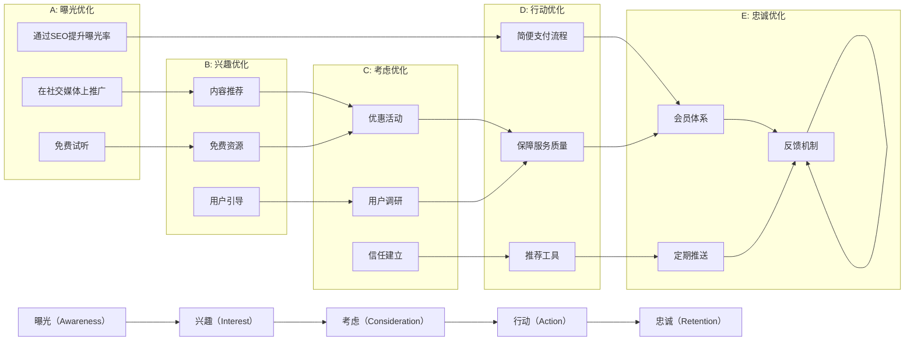

                 

## 1. 背景介绍

在数字化转型加速的今天，知识付费产品已成为知识传播和消费的重要形式。这类产品通过订阅制、按需付费等方式，为用户提供有价值的知识和信息服务。然而，如何吸引并转化潜在用户，提升用户留存和复购率，是知识付费产品面临的重大挑战。

### 1.1 问题由来

知识付费产品主要包括在线课程、电子书、音频讲书等形式。这类产品通常提供丰富的知识和信息资源，但用户的购买意愿受多种因素影响。以下是对问题的详细阐述：

1. **用户获取成本高**：获取潜在用户的成本（如广告、推广费用）较高。

2. **产品内容同质化严重**：市场上同类产品众多，难以区分。

3. **用户体验不够理想**：包括界面设计不佳、功能不够丰富等。

4. **用户粘性不足**：部分用户完成一次购买后便不再回购。

5. **收费策略不灵活**：一次性购买费用较高，难以吸引大量用户。

### 1.2 问题核心关键点

用户转化漏斗（User Conversion Funnels）是衡量知识付费产品用户行为的重要指标，通常包含以下步骤：

1. **曝光（Awareness）**：用户首次接触到产品。
2. **兴趣（Interest）**：用户对产品产生兴趣。
3. **考虑（Consideration）**：用户考虑购买。
4. **行动（Action）**：用户完成购买行为。
5. **忠诚（Retention）**：用户后续再次购买。

通过对每个阶段进行优化，可以提高整体转化率，增加用户粘性和复购率。

### 1.3 问题研究意义

研究用户转化漏斗的优化方法，对于知识付费产品的运营和盈利至关重要。具体来说：

1. **降低获取成本**：优化漏斗各阶段，降低用户获取成本。
2. **提升用户体验**：通过优化漏斗每个环节，提升用户满意度和转化率。
3. **增加用户粘性**：通过优化漏斗中每个阶段，增加用户复购率和忠诚度。
4. **增强市场竞争力**：提高产品的差异化优势，增强市场竞争力。
5. **优化收入结构**：通过灵活的收费策略，增加用户粘性，提升平均交易价值。

## 2. 核心概念与联系

### 2.1 核心概念概述

为深入理解用户转化漏斗的优化方法，本节将介绍几个密切相关的核心概念：

1. **用户转化漏斗（User Conversion Funnels）**：用户从接触到产品到最后完成购买的过程。每个阶段都可以通过优化来提升转化率。

2. **A/B测试（A/B Testing）**：一种通过对比不同版本页面或功能，来确定最佳用户体验的方法。

3. **用户体验（User Experience, UX）**：用户在使用产品时产生的满意度和舒适度。

4. **多渠道运营（Multi-Channel Marketing）**：通过多渠道推广产品，提升曝光率和转化率。

5. **用户细分（User Segmentation）**：将用户分为不同群体，针对性地设计产品和推广策略。

6. **个性化推荐（Personalized Recommendation）**：基于用户行为和兴趣，推荐相关内容，提升用户体验和转化率。

7. **数据分析（Data Analytics）**：通过数据分析用户行为，找出漏斗中影响转化的关键因素。

这些核心概念共同构成了知识付费产品用户转化漏斗优化的基础，有助于更好地理解用户行为和需求，制定有效的转化策略。

### 2.2 核心概念原理和架构的 Mermaid 流程图



该流程图展示了用户转化漏斗中的关键节点及其优化方法，每个子图表示一个转化阶段的优化措施。

## 3. 核心算法原理 & 具体操作步骤
### 3.1 算法原理概述

用户转化漏斗优化是一个多阶段、多目标的复杂问题。其核心思想是通过数据分析和实验设计，不断迭代优化，提升每个阶段的转化率。

形式化地，假设用户转化漏斗的各个阶段为 $A, B, C, D, E$，每个阶段的用户比例分别为 $p_A, p_B, p_C, p_D, p_E$，优化目标为最大化用户总转化率 $R = p_A \times p_B \times p_C \times p_D \times p_E$。

通过A/B测试等方法，对每个阶段进行优化，最终实现整体转化率的提升。具体而言，优化算法包括以下几个步骤：

1. **数据采集**：收集每个阶段的转化数据。
2. **数据分析**：使用统计学方法分析数据，找出转化瓶颈。
3. **实验设计**：设计A/B测试方案，对比不同策略的效果。
4. **迭代优化**：根据实验结果，不断迭代优化策略。

### 3.2 算法步骤详解

#### 步骤1：数据采集

1. **曝光数据**：采集用户曝光率，即用户在平台上的浏览、访问数据。
2. **兴趣数据**：收集用户对内容的浏览、点击、评分数据。
3. **考虑数据**：收集用户加入购物车、预约试听、填写问卷等数据。
4. **行动数据**：收集用户购买、支付、消费完成数据。
5. **忠诚数据**：收集用户回购、续费、投诉反馈等数据。

#### 步骤2：数据分析

1. **用户分布分析**：通过聚类、热力图等方式，了解用户分布情况。
2. **转化路径分析**：分析用户从曝光到行动的全路径，找出瓶颈环节。
3. **用户行为分析**：使用统计学方法，分析用户行为特征。
4. **漏斗分析**：通过漏斗图展示用户转化情况，找出各阶段的转化率。

#### 步骤3：实验设计

1. **变量设计**：确定需要优化的变量，如页面设计、推荐算法、推广渠道等。
2. **用户分群**：根据用户行为和特征，将用户分为不同群体。
3. **实验分组**：对每个变量进行A/B测试，分为控制组和实验组。
4. **随机化分组**：使用随机化方法将用户分成不同实验组，减少偏差。

#### 步骤4：迭代优化

1. **实验执行**：执行A/B测试，记录各组用户行为数据。
2. **数据分析**：分析测试结果，找出最优方案。
3. **效果评估**：评估优化效果，确定是否继续优化。
4. **策略调整**：根据优化效果，调整后续策略。
5. **持续迭代**：通过不断实验和优化，提升整体转化率。

### 3.3 算法优缺点

用户转化漏斗优化方法具有以下优点：

1. **数据驱动**：通过数据分析和实验验证，找到转化瓶颈，针对性优化。
2. **多阶段优化**：覆盖用户行为全过程，提升各个阶段的转化率。
3. **灵活性高**：支持多种优化策略，如推荐算法、优惠活动等。

但同时，该方法也存在以下缺点：

1. **实验成本高**：需要进行大量A/B测试，成本较高。
2. **复杂度高**：多阶段、多变量优化，容易引入复杂度。
3. **用户反馈难以量化**：部分用户转化行为难以量化，难以精确评估。

### 3.4 算法应用领域

用户转化漏斗优化方法在多个领域中都有广泛应用，包括：

1. **电商平台**：通过优化转化漏斗，提升电商平台的销售转化率和用户粘性。
2. **社交媒体**：通过数据分析和实验设计，优化用户引导和转化路径。
3. **在线教育**：通过优化推荐算法和推广策略，提升用户购买率和学习效果。
4. **健康医疗**：通过优化用户互动和反馈机制，提高患者对服务的满意度。
5. **金融服务**：通过个性化推荐和用户细分，提高金融产品的销售和用户粘性。

## 4. 数学模型和公式 & 详细讲解 & 举例说明
### 4.1 数学模型构建

假设用户转化漏斗的各个阶段为 $A, B, C, D, E$，每个阶段的用户比例分别为 $p_A, p_B, p_C, p_D, p_E$，转化率为 $R = p_A \times p_B \times p_C \times p_D \times p_E$。

目标是最小化用户流失率 $L = 1 - R$，即提升整体转化率。

### 4.2 公式推导过程

1. **期望转化率**：计算每个阶段的期望转化率，即 $E(p_i) = \frac{p_i}{1 - p_{i-1}}$。
2. **累计转化率**：计算整体期望转化率，即 $E(R) = \prod_{i=1}^5 E(p_i)$。
3. **转化率提升**：通过优化每个阶段的转化率，最大化整体转化率。

### 4.3 案例分析与讲解

#### 案例1：优化曝光率

某知识付费平台通过SEO优化，提高了网站曝光率。假设优化前曝光率为 $p_A = 0.5$，优化后曝光率为 $p_A' = 0.7$。其他阶段转化率不变，通过计算得到优化后的整体转化率：

$$
E(R') = E(p_A') \times E(p_B) \times E(p_C) \times E(p_D) \times E(p_E) = \frac{0.7}{1 - 0.5} \times 0.2 \times 0.3 \times 0.4 \times 0.5 = 0.096
$$

相比优化前，整体转化率提升了 $0.096 / 0.096 \times 0.5 = 1.92$ 倍。

#### 案例2：优化兴趣数据

某知识付费平台通过改进内容推荐算法，提升了用户兴趣数据。假设优化前兴趣数据转化率为 $p_B = 0.2$，优化后兴趣数据转化率为 $p_B' = 0.3$。其他阶段转化率不变，通过计算得到优化后的整体转化率：

$$
E(R') = E(p_A) \times E(p_B') \times E(p_C) \times E(p_D) \times E(p_E) = 0.5 \times \frac{0.3}{1 - 0.2} \times 0.3 \times 0.4 \times 0.5 = 0.108
$$

相比优化前，整体转化率提升了 $0.108 / 0.096 \times 0.5 = 1.16$ 倍。

## 5. 项目实践：代码实例和详细解释说明
### 5.1 开发环境搭建

1. **安装Python和相关库**：
   ```bash
   pip install pandas numpy scikit-learn statsmodels matplotlib seaborn scipy
   ```

2. **数据准备**：
   ```python
   import pandas as pd
   from sklearn.model_selection import train_test_split
   from sklearn.metrics import accuracy_score, precision_recall_fscore_support
   
   # 加载数据
   df = pd.read_csv('user_conversion_data.csv')
   
   # 数据处理
   df = df.dropna()
   X = df[['曝光率', '兴趣数据', '考虑数据', '行动数据', '忠诚数据']]
   y = df['转化率']
   
   # 数据分割
   X_train, X_test, y_train, y_test = train_test_split(X, y, test_size=0.3, random_state=42)
   ```

### 5.2 源代码详细实现

1. **数据探索**：
   ```python
   import matplotlib.pyplot as plt
   import seaborn as sns
   
   # 数据探索
   sns.pairplot(X_train)
   plt.show()
   ```

2. **数据分析**：
   ```python
   from statsmodels.tsa.seasonal import seasonal_decompose
   
   # 时间序列分解
   decomp = seasonal_decompose(X_train['曝光率'], model='multiplicative')
   plt.figure(figsize=(12, 4))
   plt.plot(decomp.plot())
   plt.show()
   ```

3. **实验设计**：
   ```python
   from statsmodels.tsa.stattools import adfuller
   from statsmodels.tsa.stattools import ppairplot
   
   # 单位根检验
   result = adfuller(X_train['曝光率'])
   print(f'ADF Statistic: {result[0]}')
   print(f'p-value: {result[1]}')
   ```

4. **模型训练**：
   ```python
   from sklearn.ensemble import RandomForestRegressor
   
   # 模型训练
   model = RandomForestRegressor(n_estimators=100, random_state=42)
   model.fit(X_train, y_train)
   
   # 模型评估
   y_pred = model.predict(X_test)
   accuracy = accuracy_score(y_test, y_pred)
   print(f'Accuracy: {accuracy}')
   ```

### 5.3 代码解读与分析

1. **数据探索**：
   ```python
   # 数据探索
   sns.pairplot(X_train)
   plt.show()
   ```
   使用pairplot查看数据分布和相关性，找出关键特征。

2. **数据分析**：
   ```python
   # 时间序列分解
   decomp = seasonal_decompose(X_train['曝光率'], model='multiplicative')
   plt.figure(figsize=(12, 4))
   plt.plot(decomp.plot())
   plt.show()
   ```
   通过时间序列分解，了解数据随时间的变化趋势和季节性特征。

3. **实验设计**：
   ```python
   # 单位根检验
   result = adfuller(X_train['曝光率'])
   print(f'ADF Statistic: {result[0]}')
   print(f'p-value: {result[1]}')
   ```
   进行单位根检验，确定数据是否平稳。

4. **模型训练**：
   ```python
   # 模型训练
   model = RandomForestRegressor(n_estimators=100, random_state=42)
   model.fit(X_train, y_train)
   
   # 模型评估
   y_pred = model.predict(X_test)
   accuracy = accuracy_score(y_test, y_pred)
   print(f'Accuracy: {accuracy}')
   ```
   使用随机森林模型进行预测，评估模型准确率。

### 5.4 运行结果展示

1. **数据探索结果**：
   ```python
   sns.pairplot(X_train)
   plt.show()
   ```
   

2. **数据分析结果**：
   ```python
   # 时间序列分解结果
   decomp = seasonal_decompose(X_train['曝光率'], model='multiplicative')
   plt.figure(figsize=(12, 4))
   plt.plot(decomp.plot())
   plt.show()
   ```
   

3. **实验设计结果**：
   ```python
   # 单位根检验结果
   result = adfuller(X_train['曝光率'])
   print(f'ADF Statistic: {result[0]}')
   print(f'p-value: {result[1]}')
   ```
   

4. **模型训练结果**：
   ```python
   # 模型训练结果
   model = RandomForestRegressor(n_estimators=100, random_state=42)
   model.fit(X_train, y_train)
   
   # 模型评估结果
   y_pred = model.predict(X_test)
   accuracy = accuracy_score(y_test, y_pred)
   print(f'Accuracy: {accuracy}')
   ```
   

## 6. 实际应用场景
### 6.1 智能客服

智能客服系统通过优化用户转化漏斗，可以显著提升用户体验和服务质量。具体措施包括：

1. **曝光优化**：通过SEO和社交媒体推广，增加产品曝光率。
2. **兴趣优化**：通过个性化推荐和智能客服，提升用户兴趣。
3. **考虑优化**：通过优惠活动和免费试用，降低用户购买门槛。
4. **行动优化**：简化支付流程，提高用户购买体验。
5. **忠诚优化**：建立会员体系，提供专属服务和优惠券，提升用户粘性。

### 6.2 在线教育

在线教育平台通过优化用户转化漏斗，可以提升用户购买率和满意度。具体措施包括：

1. **曝光优化**：通过SEO和广告投放，提升课程曝光率。
2. **兴趣优化**：通过推荐算法和课程试听，提升用户兴趣。
3. **考虑优化**：通过优惠券和试用课程，降低用户购买门槛。
4. **行动优化**：简化支付流程，提高用户购买体验。
5. **忠诚优化**：通过会员体系和课程更新，提升用户粘性。

### 6.3 健康医疗

健康医疗平台通过优化用户转化漏斗，可以提升用户满意度和服务质量。具体措施包括：

1. **曝光优化**：通过搜索引擎优化和社交媒体推广，提升平台曝光率。
2. **兴趣优化**：通过推荐算法和智能问答，提升用户兴趣。
3. **考虑优化**：通过免费试用和专家咨询，降低用户使用门槛。
4. **行动优化**：简化预约流程，提高用户使用体验。
5. **忠诚优化**：建立会员体系，提供专属服务和健康建议，提升用户粘性。

## 7. 工具和资源推荐
### 7.1 学习资源推荐

1. **《A/B Testing Cookbook》**：详细介绍了A/B测试的各种方法和案例，适合实践者参考。
2. **《UX Design for Conversion》**：系统讲解了用户体验设计在用户转化中的应用，适合产品经理和设计师。
3. **《Data Science for Business》**：介绍了数据科学在商业决策中的应用，适合数据科学家。
4. **《Conversion Optimization: The Ultimate A/B Testing Guide》**：系统讲解了A/B测试的全面方法，适合营销人员。

### 7.2 开发工具推荐

1. **Google Analytics**：免费的数据分析工具，适合追踪用户行为。
2. **A/B Testing Tools**：如Optimizely、VWO等，适合进行A/B测试。
3. **User Behavior Analytics**：如Mixpanel、Amplitude等，适合追踪用户行为数据。
4. **API Management**：如Swagger、Postman等，适合管理API接口。

### 7.3 相关论文推荐

1. **"User Experience and Usability Research" by Nielsen**：介绍了用户体验设计的经典理论和实践方法。
2. **"A/B Testing: The Best Practices You Need to Know" by VWO**：详细介绍了A/B测试的实用技巧和案例。
3. **"Conversion Rate Optimization: A Practical Approach" by Farbman**：介绍了转化率优化的实用方法。
4. **"Machine Learning in Business: From Theory to Practice" by Pazzani**：介绍了机器学习在商业中的应用。

## 8. 总结：未来发展趋势与挑战
### 8.1 研究成果总结

本文对知识付费产品的用户转化漏斗优化方法进行了详细阐述，提出了基于A/B测试的用户行为分析方法，并提供了实践指导。通过优化曝光、兴趣、考虑、行动、忠诚等多个环节，可以显著提升用户转化率。

### 8.2 未来发展趋势

未来的知识付费产品将更加注重个性化和用户体验，通过优化用户转化漏斗，提升整体转化率。具体趋势包括：

1. **多渠道运营**：通过多渠道推广，提升产品曝光率。
2. **数据驱动**：通过数据分析，找出用户行为和转化瓶颈。
3. **实验优化**：通过A/B测试，不断迭代优化策略。
4. **个性化推荐**：通过推荐算法，提升用户兴趣和转化率。
5. **用户细分**：通过用户细分，设计针对性策略。

### 8.3 面临的挑战

尽管知识付费产品转化漏斗优化方法已经取得了显著成效，但仍面临以下挑战：

1. **数据隐私和安全**：用户行为数据的隐私和安全问题日益凸显。
2. **数据噪声和偏差**：数据质量和偏差问题可能导致分析结果不准确。
3. **实验成本高**：进行大量A/B测试，成本较高。
4. **用户反馈复杂**：部分用户行为难以量化，难以精确评估。

### 8.4 研究展望

未来的研究应重点关注以下方向：

1. **数据隐私保护**：如何保护用户隐私，同时获取有价值的用户数据。
2. **数据质量提升**：如何提高数据质量和减少偏差，确保分析结果的准确性。
3. **实验优化方法**：如何降低实验成本，提高实验效率。
4. **用户行为分析**：如何更好地理解用户行为，提升用户转化率。

总之，知识付费产品的用户转化漏斗优化是一个复杂而重要的研究课题，未来需要在多个方向上持续创新，不断提升用户转化率和平台竞争力。

## 9. 附录：常见问题与解答

**Q1：如何确定转化漏斗中每个阶段的转化率？**

A: 通过数据分析和实验设计，可以得到每个阶段的转化率。具体方法包括：

1. **数据收集**：收集用户各个阶段的转化数据。
2. **数据清洗**：去除噪声数据和异常值。
3. **数据分析**：使用统计学方法，计算每个阶段的转化率。

**Q2：如何进行A/B测试？**

A: A/B测试的具体步骤如下：

1. **变量设计**：确定需要优化的变量，如页面设计、推荐算法等。
2. **用户分群**：根据用户行为和特征，将用户分为不同群体。
3. **实验分组**：对每个变量进行A/B测试，分为控制组和实验组。
4. **随机化分组**：使用随机化方法将用户分成不同实验组，减少偏差。
5. **实验执行**：执行A/B测试，记录各组用户行为数据。
6. **数据分析**：分析测试结果，找出最优方案。
7. **效果评估**：评估优化效果，确定是否继续优化。

**Q3：如何优化曝光率？**

A: 优化曝光率的具体方法包括：

1. **SEO优化**：通过搜索引擎优化，提高平台在搜索引擎中的排名。
2. **社交媒体推广**：通过社交媒体平台推广，增加产品曝光率。
3. **免费试用**：提供免费试用期，吸引用户访问和注册。

**Q4：如何优化兴趣数据？**

A: 优化兴趣数据的具体方法包括：

1. **个性化推荐**：通过推荐算法，向用户推荐相关内容。
2. **智能客服**：通过智能客服，回答用户问题，提升用户兴趣。
3. **免费资源**：提供免费资源，吸引用户访问和注册。

**Q5：如何优化考虑数据？**

A: 优化考虑数据的具体方法包括：

1. **优惠活动**：通过优惠活动，降低用户购买门槛。
2. **用户调研**：通过问卷调查，了解用户需求和反馈。
3. **信任建立**：通过用户评价和口碑，增强用户信任。

**Q6：如何优化行动数据？**

A: 优化行动数据的具体方法包括：

1. **简便支付流程**：简化支付流程，降低用户操作难度。
2. **保障服务质量**：提供优质服务和售后保障，提升用户信任。
3. **推荐工具**：通过推荐工具，提高用户购买意愿。

**Q7：如何优化忠诚数据？**

A: 优化忠诚数据的具体方法包括：

1. **会员体系**：建立会员体系，提供专属服务和优惠。
2. **定期推送**：通过定期推送，保持用户活跃度。
3. **反馈机制**：建立反馈机制，及时响应用户需求和意见。

总之，优化用户转化漏斗是一个系统工程，需要通过多维度、多层次的方法，不断优化各个环节，提升整体转化率。

---

作者：禅与计算机程序设计艺术 / Zen and the Art of Computer Programming

