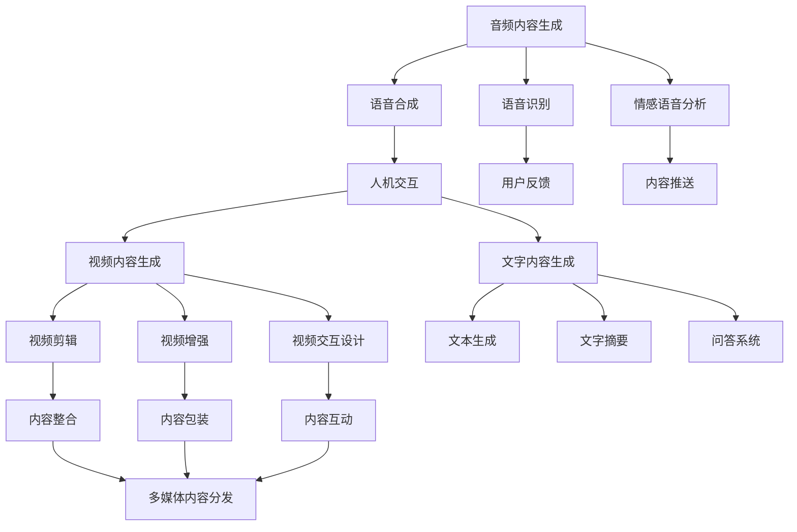

                 

## 1. 背景介绍

随着数字化时代的到来，知识付费行业迅速崛起，各种在线课程、播客、音频视频等内容形式异军突起。多媒体内容的兴起，不仅为用户提供了更多元的知识获取途径，也给内容生产者带来了新的机遇和挑战。如何利用多媒体呈现技巧，最大化内容价值，成为当前知识付费领域的重要课题。

本文将系统介绍知识付费内容的多媒体呈现技巧，涵盖音频、视频、文字等多种内容形态。通过介绍多媒体内容的生产、呈现、分发流程，展示如何利用技术手段提升用户的学习体验和内容质量，进而推动知识付费行业的创新发展。

## 2. 核心概念与联系

### 2.1 核心概念概述

多媒体内容呈现技术涉及到音频、视频、文字等多种内容形式的生成与呈现，旨在提升用户体验，增强学习效果。其主要技术包括：

- 音频内容生成：包括语音合成、语音识别、情感语音分析等。
- 视频内容生成：包括视频剪辑、视频增强、视频交互设计等。
- 文字内容生成：包括文本生成、文字摘要、问答系统等。

多媒体内容呈现技术的核心在于构建一个高效、智能、互动的多媒体内容生态，使用户能更直观地获取和理解知识。

### 2.2 核心概念原理和架构的 Mermaid 流程图



这个流程图展示了多媒体内容生成、呈现、分发的全过程，从原始音频、视频、文字数据的生成，到最终的多媒体内容的打包和分发，每一步都依赖于多种技术手段。

## 3. 核心算法原理 & 具体操作步骤

### 3.1 算法原理概述

多媒体内容呈现技术的关键在于高效、智能、互动。其中，语音合成、语音识别、情感语音分析等音频内容生成技术，使得音频内容的生产更加便捷高效；视频剪辑、视频增强、视频交互设计等视频内容生成技术，使得视频内容的互动性和用户体验大大提升；文本生成、文字摘要、问答系统等文字内容生成技术，使得文字内容的阅读和理解更加精准高效。

### 3.2 算法步骤详解

#### 3.2.1 音频内容生成

**步骤1: 语音合成**
语音合成技术可以将文本转化为自然流畅的语音，包括基于规则的合成和基于深度学习的合成。

**步骤2: 语音识别**
语音识别技术可以将语音转化为文本，包括传统声学模型和深度神经网络模型，如CTC、Attention-based model等。

**步骤3: 情感语音分析**
情感语音分析技术可以分析语音中的情感特征，包括情绪、语调、语速等，用于增强用户体验和内容互动。

#### 3.2.2 视频内容生成

**步骤1: 视频剪辑**
视频剪辑技术可以裁剪、合并视频片段，生成适合特定内容形态的视频内容。

**步骤2: 视频增强**
视频增强技术可以提升视频画质、音频质量，以及添加字幕、特效等，增强用户体验。

**步骤3: 视频交互设计**
视频交互设计技术可以添加交互元素，如时间轴、快进/快退、暂停/播放等，提升用户的互动性和沉浸感。

#### 3.2.3 文字内容生成

**步骤1: 文本生成**
文本生成技术可以自动生成文章的开头、结尾、段落等，用于快速生成大量内容。

**步骤2: 文字摘要**
文字摘要技术可以从大量文本中提取关键信息，生成简洁明了的文字摘要，帮助用户快速理解内容。

**步骤3: 问答系统**
问答系统可以解答用户问题，提升用户的学习体验和互动性。

### 3.3 算法优缺点

**音频内容生成的优点**
1. 提高生产效率：自动生成语音内容，减少了语音录制和编辑的工作量。
2. 增强用户体验：自然流畅的语音合成，提高了用户学习的沉浸感。
3. 降低成本：减少了对专业语音演员的需求。

**音频内容生成的缺点**
1. 语言风格单一：自动合成的语音可能缺乏人类语音的自然变化。
2. 情感表达不足：自动语音可能缺乏人类语音的情感变化，影响用户体验。
3. 对文本质量依赖：文本内容的质量直接影响语音合成的效果。

**视频内容生成的优点**
1. 提升互动性：视频剪辑和交互设计增强了用户与内容的互动。
2. 增强沉浸感：高质量的视频增强提升了用户的学习体验。
3. 多样化呈现：视频内容的多样化呈现方式，满足了不同用户的需求。

**视频内容生成的缺点**
1. 制作成本高：高质量的视频剪辑和增强需要较高的制作成本。
2. 存储空间大：视频数据存储空间大，增加了内容分发的难度。
3. 技术门槛高：视频内容的制作和编辑需要较高的技术水平。

**文字内容生成的优点**
1. 生成速度快：自动生成的文本可以快速生成大量内容。
2. 准确度高：高质量的文本生成和摘要系统可以准确提取关键信息。
3. 降低人工成本：减少了人工编写内容的工作量。

**文字内容生成的缺点**
1. 风格单一：自动生成的文本可能缺乏人类文风的丰富多样性。
2. 理解难度高：自动生成的文本可能难以理解复杂的概念和背景知识。
3. 对文本质量依赖：文本质量直接影响内容的准确性和可读性。

### 3.4 算法应用领域

多媒体内容呈现技术广泛应用于知识付费内容的生产、分发、呈现中，具体应用领域包括：

- **在线课程**：通过语音合成、视频剪辑、自动生成等技术，制作优质教学内容。
- **播客节目**：利用语音识别、情感语音分析等技术，提高节目互动性和用户参与度。
- **音频书籍**：通过语音合成技术，将文字内容转化为有声读物，方便用户随时随地学习。
- **电子书**：通过文本生成、文字摘要等技术，提升用户阅读体验。
- **知识问答**：通过问答系统，解答用户问题，提供个性化学习建议。

## 4. 数学模型和公式 & 详细讲解 & 举例说明

### 4.1 数学模型构建

#### 4.1.1 音频内容生成

**语音合成的数学模型**
语音合成模型通常包括声学模型、语言模型和解码器。声学模型用于将文本转化为音频特征，语言模型用于预测文本序列的概率，解码器用于将音频特征转化为语音信号。

**语音识别的数学模型**
语音识别模型包括声学模型和语言模型。声学模型用于将音频信号转化为文本序列，语言模型用于校正文本序列的概率。

**情感语音分析的数学模型**
情感语音分析模型通常使用情感分类模型，对语音信号进行特征提取和情感分类。

#### 4.1.2 视频内容生成

**视频剪辑的数学模型**
视频剪辑模型通常包括分割模型和排序模型。分割模型用于将视频内容分割为不同的片段，排序模型用于对片段进行排序和合并。

**视频增强的数学模型**
视频增强模型包括图像增强和音频增强。图像增强通常使用图像处理技术，如滤波、去噪等，音频增强通常使用音频处理技术，如降噪、均衡器等。

**视频交互设计的数学模型**
视频交互设计模型包括用户交互模型和内容推荐模型。用户交互模型用于设计用户的交互方式，内容推荐模型用于推荐用户感兴趣的内容。

#### 4.1.3 文字内容生成

**文本生成的数学模型**
文本生成模型通常包括自回归模型、自编码模型和变分自编码模型。自回归模型基于前后文预测下一个字符，自编码模型基于编码器-解码器结构生成文本，变分自编码模型通过生成对抗网络生成文本。

**文字摘要的数学模型**
文字摘要模型通常包括提取式摘要和生成式摘要。提取式摘要通过提取文本中的关键句子生成摘要，生成式摘要通过生成新的句子来生成摘要。

**问答系统的数学模型**
问答系统模型通常包括检索式问答和生成式问答。检索式问答通过检索数据库中的答案生成回答，生成式问答通过生成新的回答来回答用户问题。

### 4.2 公式推导过程

#### 4.2.1 语音合成

**基于深度学习的语音合成模型**
$$
P(y|x) = \prod_{t=1}^T P(y_t|x, y_{<t})
$$

其中 $y$ 为语音信号，$x$ 为文本序列，$P(y_t|x, y_{<t})$ 为在给定上下文条件下，第 $t$ 个语音信号的概率分布。

#### 4.2.2 语音识别

**基于深度学习的语音识别模型**
$$
P(x|y) = \prod_{t=1}^T P(x_t|y, x_{<t})
$$

其中 $x$ 为文本序列，$y$ 为语音信号，$P(x_t|y, x_{<t})$ 为在给定语音信号和上下文条件下，第 $t$ 个文本的概率分布。

#### 4.2.3 情感语音分析

**情感分类模型**
$$
P(e|y) = \frac{P(y|e)P(e)}{P(y)}
$$

其中 $e$ 为情感类别，$y$ 为语音信号，$P(y|e)$ 为在给定情感类别下语音信号的概率分布，$P(e)$ 为情感类别的先验概率，$P(y)$ 为语音信号的先验概率。

### 4.3 案例分析与讲解

#### 4.3.1 音频内容生成案例

以在线教育平台为例，平台通过语音合成技术将教师的讲解转换为语音，生成有声读物，用户可以随时随地收听。同时，利用语音识别技术将学生的提问转化为文字，进行自动回复，提高了互动效率。

#### 4.3.2 视频内容生成案例

以在线培训课程为例，课程制作团队通过视频剪辑技术将不同教学视频片段拼接成完整课程，通过视频增强技术提升视频画质和音质，通过视频交互设计技术增加用户互动元素，提高了用户的学习体验。

#### 4.3.3 文字内容生成案例

以电子书平台为例，平台通过文本生成技术自动生成文章的开头、结尾、段落等，提高了内容的生成速度。同时，利用文字摘要技术生成简洁明了的摘要，帮助用户快速理解内容。

## 5. 项目实践：代码实例和详细解释说明

### 5.1 开发环境搭建

开发多媒体内容呈现技术需要安装以下工具：

- **Python**：用于开发音频、视频、文字内容生成和呈现的代码。
- **PyTorch**：用于音频、视频、文字内容生成的深度学习框架。
- **OpenCV**：用于视频剪辑和增强的计算机视觉库。
- **NLTK**：用于自然语言处理的Python库。
- **Jupyter Notebook**：用于开发和测试多媒体内容呈现技术的交互式环境。

### 5.2 源代码详细实现

以下是一个简单的Python代码示例，展示如何利用PyTorch进行语音合成：

```python
import torch
from torchaudio import nn
from torchaudio.transforms import Spectrogram, MelSpectrogram, DynamicQuantize

# 定义语音合成模型
class VoiceSynthesis(nn.Module):
    def __init__(self):
        super(VoiceSynthesis, self).__init__()
        self.encoder = nn.Linear(512, 512)
        self.decoder = nn.Linear(512, 80)
        self.spectrogram = Spectrogram()

    def forward(self, x):
        x = self.encoder(x)
        x = self.decoder(x)
        spectrogram = self.spectrogram(x)
        return spectrogram

# 创建语音合成模型实例
model = VoiceSynthesis()

# 训练模型
criterion = nn.L1Loss()
optimizer = torch.optim.Adam(model.parameters(), lr=0.001)
for epoch in range(100):
    for batch in train_loader:
        input, target = batch
        output = model(input)
        loss = criterion(output, target)
        optimizer.zero_grad()
        loss.backward()
        optimizer.step()

# 生成语音信号
input = torch.randn(1, 512)
output = model(input)
wav = torch.fft.fft(output, 8000).numpy()
wav = DynamicQuantize(128).apply(wav)
```

### 5.3 代码解读与分析

以上代码展示了如何使用PyTorch构建一个简单的语音合成模型，并通过训练生成语音信号。其中，`VoiceSynthesis`类定义了语音合成的神经网络结构，包括编码器、解码器、频谱图转换等组件。训练过程中，使用均方误差损失函数和Adam优化器进行模型优化。生成语音信号时，输入随机噪声，通过神经网络生成频谱图，再通过快速傅里叶变换和量化生成语音信号。

## 6. 实际应用场景

### 6.1 在线教育

在线教育平台通过多媒体内容呈现技术，将传统的文本和视频教学内容转化为更具互动性和沉浸感的音频和视频内容，提升了用户的在线学习体验。例如，利用语音合成技术，将教师的讲解转换为有声读物，方便用户随时随地收听；利用情感语音分析技术，实时识别学生的学习状态，进行个性化辅导。

### 6.2 在线培训

在线培训平台通过多媒体内容呈现技术，将复杂的培训课程转换为更易于理解的音频和视频内容，提高了用户的培训效果。例如，利用视频剪辑技术，将不同培训视频片段拼接成完整课程；利用视频增强技术，提升视频画质和音质；利用视频交互设计技术，增加用户互动元素，提高用户参与度。

### 6.3 电子书平台

电子书平台通过多媒体内容呈现技术，将传统的文字内容转化为更丰富、更有趣的音频和视频内容，提升了用户的阅读体验。例如，利用文本生成技术自动生成文章的开头、结尾、段落等；利用文字摘要技术生成简洁明了的摘要，帮助用户快速理解内容；利用语音合成技术生成有声读物，方便用户随时随地收听。

## 7. 工具和资源推荐

### 7.1 学习资源推荐

- **在线课程**：Coursera、Udacity、edX等平台提供了许多多媒体内容呈现技术的课程，涵盖语音合成、情感语音分析、视频剪辑等多个方面。
- **书籍**：《深度学习与自然语言处理》、《计算机视觉：模型、学习和推理》、《自然语言处理综论》等书籍，介绍了多媒体内容呈现技术的理论和实践。
- **论文**：ACL、EMNLP、ICASSP等会议的论文，展示了最新的多媒体内容呈现技术的进展。

### 7.2 开发工具推荐

- **Python**：Python作为多媒体内容呈现技术开发的主流语言，易于上手，生态丰富。
- **PyTorch**：PyTorch提供了强大的深度学习框架，支持语音合成、情感语音分析、文本生成等多种多媒体内容呈现技术。
- **OpenCV**：OpenCV提供了丰富的计算机视觉库，支持视频剪辑、视频增强等多种多媒体内容呈现技术。
- **NLTK**：NLTK提供了自然语言处理库，支持文本生成、情感分析等多种多媒体内容呈现技术。

### 7.3 相关论文推荐

- **语音合成**：
  - "Tacotron 2: Better Text-to-Speech with a WaveNet Architecture"
  - "WaveNet: A Generative Model for Raw Audio"
- **语音识别**：
  - "Attention Is All You Need"
  - "Sequence to Sequence Learning with Neural Networks"
- **情感语音分析**：
  - "Towards Deep Speech Understanding: Attention-Based Speaker Classification"
  - "Emotion Classification Using Deep Neural Network: Approach and Comparative Analysis"
- **视频剪辑**：
  - "Nonnegative Matrix Factorization (NMF) for Video Clustering"
  - "Video Summarization using Deep Learning"
- **视频增强**：
  - "Image Denoising with Deep Convolutional Neural Networks"
  - "Real-Time Single Image and Video Deblurring Using a Deep Convolutional Neural Network"

## 8. 总结：未来发展趋势与挑战

### 8.1 研究成果总结

多媒体内容呈现技术在知识付费领域的应用，已经取得了显著的成效，显著提升了用户的学习体验和内容质量。未来，随着技术的不断进步，多媒体内容呈现技术将向更加智能化、个性化、互动化方向发展，进一步推动知识付费行业的创新。

### 8.2 未来发展趋势

1. **智能语音交互**：未来的语音合成和语音识别技术将更加智能，能够更好地理解用户的指令和情感变化，提高用户交互体验。
2. **多媒体融合**：未来的多媒体内容将更加丰富多样，音频、视频、文字等多种形态的融合将进一步提升用户体验。
3. **个性化推荐**：未来的推荐系统将更加个性化，利用多媒体内容生成和呈现技术，为用户提供更加精准的内容推荐。
4. **多模态学习**：未来的学习方式将更加多模态，结合音频、视频、文字等多种模态的信息，提升用户的学习效果。

### 8.3 面临的挑战

1. **技术复杂性**：多媒体内容呈现技术的开发和应用需要较高的技术水平，增加了内容生产者的技术门槛。
2. **成本问题**：高质量的多媒体内容制作成本较高，增加了内容分发的难度和成本。
3. **版权问题**：多媒体内容的制作和分发需要考虑版权问题，增加了内容生产的法律风险。
4. **用户习惯**：用户对多媒体内容的需求和习惯不同，需要内容生产者进行市场调研和用户引导。

### 8.4 研究展望

未来的多媒体内容呈现技术将继续朝着更加智能化、个性化、互动化的方向发展，结合人工智能、大数据、云计算等技术，进一步提升用户体验和内容质量。同时，技术开发者需要关注用户需求和技术挑战，不断创新和优化多媒体内容呈现技术，推动知识付费行业的持续发展和进步。

## 9. 附录：常见问题与解答

**Q1：如何选择合适的多媒体内容呈现技术？**

A: 选择多媒体内容呈现技术时，需要根据内容的性质、用户需求和平台特性进行综合考虑。例如，对于在线教育平台，语音合成和情感语音分析技术可以提升用户的学习体验；对于电子书平台，文本生成和文字摘要技术可以提升用户的阅读体验。

**Q2：如何提高多媒体内容的质量？**

A: 提高多媒体内容质量的关键在于内容制作的技术水平。可以使用先进的音频、视频、文字生成和增强技术，提升内容的画质、音质和准确性。同时，可以通过用户反馈和市场调研，不断优化和改进内容呈现方式。

**Q3：如何降低多媒体内容的制作成本？**

A: 降低多媒体内容制作成本的关键在于优化生产流程和技术选择。可以采用自动化生成技术和预制素材，减少人力成本和时间成本。同时，可以利用开源工具和技术，降低开发和部署成本。

**Q4：如何保护多媒体内容的版权？**

A: 保护多媒体内容版权的关键在于加强版权意识和技术手段。可以使用加密技术、水印技术等手段，保护内容的知识产权。同时，需要遵守相关法律法规，确保内容制作和分发的合法合规。

**Q5：如何提升用户对多媒体内容的接受度？**

A: 提升用户对多媒体内容接受度的关键在于了解用户需求和习惯。可以通过市场调研和用户测试，了解用户对不同内容形式的偏好。同时，可以通过多渠道推广和互动设计，提升用户对内容的兴趣和参与度。

---

作者：禅与计算机程序设计艺术 / Zen and the Art of Computer Programming

