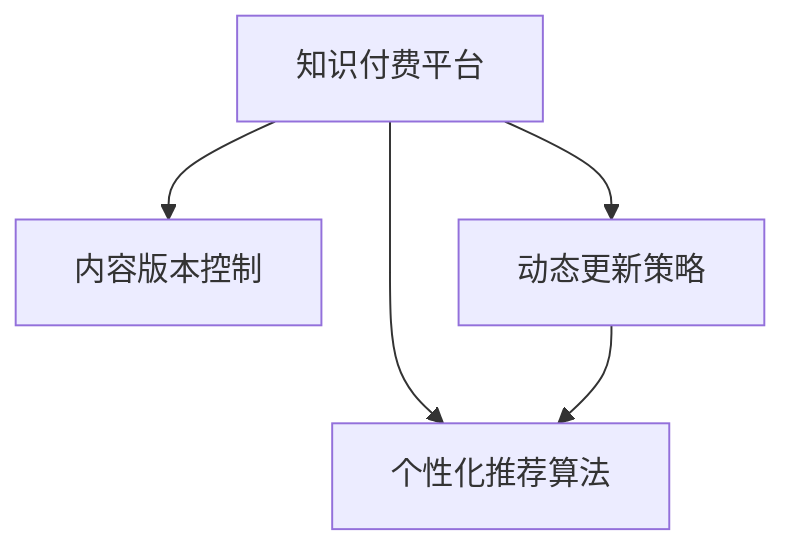

                 

# 知识付费内容的版本控制与更新策略

> 关键词：知识付费, 内容管理, 版本控制, 动态更新, 用户订阅, 知识图谱, 推荐算法

## 1. 背景介绍

### 1.1 问题由来
在快速变化的互联网时代，知识付费平台面临着内容管理上的巨大挑战。随着知识版权意识的增强和内容产出的加速，平台需要高效地进行内容组织、分类和检索，同时保持内容的及时更新。此外，为了满足用户的个性化需求，平台还需要对用户订阅的内容进行个性化推荐。这些任务通常需要依赖版本控制和动态更新策略，以确保用户获取最新最相关的知识。

### 1.2 问题核心关键点
在知识付费内容管理中，版本控制和动态更新策略的核心关键点包括：
- **版本控制**：如何有效记录和跟踪内容的不同版本，以便在需要时能够回溯和恢复。
- **动态更新**：如何根据用户行为和内容质量，灵活地调整内容的呈现和推荐，提升用户体验。
- **个性化推荐**：如何利用用户数据和知识图谱，提供更加精准和个性化的内容推荐。

## 2. 核心概念与联系

### 2.1 核心概念概述

为更好地理解知识付费内容的版本控制与更新策略，本节将介绍几个密切相关的核心概念：

- **知识付费平台**：以内容订阅为核心的平台，提供定制化的知识产品，如课程、音频、视频等。平台需要对内容进行高效管理，同时提供个性化的推荐服务。

- **内容版本控制**：对知识内容的不同版本进行记录、管理和恢复，确保内容的历史可追溯和状态可回退。

- **动态更新策略**：根据用户行为和内容质量，灵活调整内容的呈现和推荐，提升用户满意度和参与度。

- **个性化推荐算法**：利用用户数据和知识图谱，提供更加精准和个性化的内容推荐，提升用户粘性和满意度。

这些核心概念之间的逻辑关系可以通过以下Mermaid流程图来展示：



这个流程图展示出知识付费平台如何利用内容版本控制、动态更新策略和个性化推荐算法来管理内容，提升用户体验。

## 3. 核心算法原理 & 具体操作步骤
### 3.1 算法原理概述

知识付费内容的管理与更新涉及到多个维度，包括内容版本控制、动态更新策略和个性化推荐算法。这些算法共同构成了知识付费平台的核心技术框架，旨在提供高效、灵活、个性化的内容服务。

### 3.2 算法步骤详解

#### 3.2.1 内容版本控制

内容版本控制的目的是记录和跟踪知识内容的不同版本，以便在需要时能够回溯和恢复。常见的版本控制方法包括：

1. **Git版本控制**：通过Git等分布式版本控制系统，记录每次内容修改的版本历史。Git可以管理文件的修改、合并和冲突，适用于大规模的代码仓库管理。
2. **数据库记录**：在内容数据库中记录每次内容发布的版本信息，包括发布时间、修改人、修改内容等。数据库记录适用于结构化数据的版本管理。
3. **版本日志**：通过日志文件记录每次内容发布的版本信息，包括版本号、发布时间、修改人等。版本日志适用于小型、简单的内容管理系统。

这些方法各有优缺点，选择哪一种取决于内容系统的规模、复杂度和需求。

#### 3.2.2 动态更新策略

动态更新策略根据用户行为和内容质量，灵活调整内容的呈现和推荐。常见的动态更新策略包括：

1. **时间戳更新**：根据内容的发布时间，将最新发布的内容优先推荐给用户。时间戳更新适用于内容更新较为频繁的平台。
2. **质量评分更新**：根据内容的评分、评价和用户反馈，动态调整内容权重，提升高质量内容的可见性。质量评分更新适用于内容质量控制较为严格的平台。
3. **个性化推荐**：根据用户的浏览历史、订阅内容和使用习惯，推荐相关内容。个性化推荐算法包括协同过滤、基于内容的推荐、混合推荐等。

这些策略的实现需要依赖数据采集、分析和机器学习等技术手段。

#### 3.2.3 个性化推荐算法

个性化推荐算法利用用户数据和知识图谱，提供更加精准和个性化的内容推荐。常见的个性化推荐算法包括：

1. **协同过滤推荐**：根据用户的历史行为和相似用户的行为，推荐相关内容。协同过滤推荐适用于用户行为数据较为丰富的平台。
2. **基于内容的推荐**：根据内容的属性和标签，推荐相关内容。基于内容的推荐适用于内容属性和标签结构化的平台。
3. **混合推荐**：结合协同过滤和基于内容的推荐，综合考虑用户和内容特征，提供更精准的推荐。混合推荐适用于用户行为和内容属性多样化的平台。

这些算法需要依赖数据挖掘、机器学习等技术，并需要大量的用户数据和内容数据进行训练和优化。

### 3.3 算法优缺点

内容版本控制、动态更新策略和个性化推荐算法各有优缺点：

#### 版本控制算法

- **优点**：
  - 记录版本历史，确保内容可追溯和状态可回退。
  - 支持内容的回滚和恢复，减少数据丢失的风险。
  - 适用于多种版本管理需求，灵活性高。

- **缺点**：
  - 版本记录和恢复需要额外的时间和资源。
  - 版本管理复杂，特别是对于大型的知识库。

#### 动态更新策略

- **优点**：
  - 实时调整内容呈现和推荐，提升用户体验。
  - 基于用户行为和内容质量，提高内容的可用性和相关性。
  - 适用于用户行为和内容质量管理，提升平台竞争力。

- **缺点**：
  - 动态更新的策略需要频繁的数据采集和分析。
  - 对于数据质量较低或用户行为复杂的情况，可能产生误导性的推荐。

#### 个性化推荐算法

- **优点**：
  - 提供更加精准和个性化的内容推荐，提升用户粘性。
  - 利用知识图谱和用户数据，提供深度挖掘的内容推荐。
  - 适用于用户需求多样化和内容结构复杂化的平台。

- **缺点**：
  - 需要大量的用户数据和内容数据进行训练和优化。
  - 算法复杂，计算成本较高，需要高效的计算资源。

### 3.4 算法应用领域

内容版本控制、动态更新策略和个性化推荐算法在多个领域得到了广泛的应用：

1. **在线教育**：对课程内容进行版本控制，根据学生的学习行为和反馈进行动态更新和个性化推荐，提升学习效果。
2. **专业培训**：对培训内容进行版本控制，根据员工的学习进度和反馈进行动态更新和个性化推荐，提升培训效果。
3. **企业知识管理**：对内部知识库进行版本控制，根据员工的行为和反馈进行动态更新和个性化推荐，提升知识共享和应用。
4. **新闻媒体**：对新闻内容进行版本控制，根据用户阅读行为和反馈进行动态更新和个性化推荐，提升新闻阅读体验。

## 4. 数学模型和公式 & 详细讲解  
### 4.1 数学模型构建

在知识付费内容的管理与更新中，需要构建多个数学模型来支持版本控制、动态更新和个性化推荐。以下是几个核心模型的构建：

#### 4.1.1 版本控制模型

版本控制模型需要记录每个版本的内容和修改信息。假设知识内容为 $C$，版本为 $V$，版本信息为 $I$，则版本控制模型可以表示为：

$$
V = \{(C_i, I_i)\}_{i=1}^N
$$

其中 $C_i$ 表示第 $i$ 个版本的知识内容，$I_i$ 表示该版本的所有修改信息。

#### 4.1.2 动态更新模型

动态更新模型需要根据用户行为和内容质量，调整内容的呈现和推荐。假设用户行为为 $B$，内容质量为 $Q$，动态更新策略为 $U$，则动态更新模型可以表示为：

$$
U = f(B, Q)
$$

其中 $f$ 为动态更新策略函数，可以根据用户行为和内容质量计算出调整策略。

#### 4.1.3 个性化推荐模型

个性化推荐模型需要利用用户数据和知识图谱，提供精准和个性化的内容推荐。假设用户特征为 $U$，内容特征为 $C$，推荐算法为 $R$，则个性化推荐模型可以表示为：

$$
R = h(U, C)
$$

其中 $h$ 为个性化推荐算法函数，可以根据用户特征和内容特征计算出推荐结果。

### 4.2 公式推导过程

#### 4.2.1 版本控制模型

版本控制模型需要记录每个版本的内容和修改信息。假设知识内容为 $C$，版本为 $V$，版本信息为 $I$，则版本控制模型可以表示为：

$$
V = \{(C_i, I_i)\}_{i=1}^N
$$

其中 $C_i$ 表示第 $i$ 个版本的知识内容，$I_i$ 表示该版本的所有修改信息。

#### 4.2.2 动态更新模型

动态更新模型需要根据用户行为和内容质量，调整内容的呈现和推荐。假设用户行为为 $B$，内容质量为 $Q$，动态更新策略为 $U$，则动态更新模型可以表示为：

$$
U = f(B, Q)
$$

其中 $f$ 为动态更新策略函数，可以根据用户行为和内容质量计算出调整策略。

#### 4.2.3 个性化推荐模型

个性化推荐模型需要利用用户数据和知识图谱，提供精准和个性化的内容推荐。假设用户特征为 $U$，内容特征为 $C$，推荐算法为 $R$，则个性化推荐模型可以表示为：

$$
R = h(U, C)
$$

其中 $h$ 为个性化推荐算法函数，可以根据用户特征和内容特征计算出推荐结果。

### 4.3 案例分析与讲解

#### 4.3.1 版本控制案例

假设某在线教育平台对某门课程内容进行版本控制，记录每次修改的内容和修改人。版本控制模型可以表示为：

$$
V = \{(C_1, I_1), (C_2, I_2), (C_3, I_3), \ldots\}
$$

其中 $C_i$ 表示第 $i$ 个版本的课程内容，$I_i$ 表示该版本的所有修改信息，如修改时间、修改人、修改原因等。

#### 4.3.2 动态更新案例

假设某在线教育平台根据学生的学习行为和反馈，动态调整课程内容的呈现和推荐。动态更新模型可以表示为：

$$
U = f(B, Q)
$$

其中 $B$ 表示学生的学习行为，如观看时间、做题情况等；$Q$ 表示课程质量，如课程评分、学生反馈等；$f$ 为动态更新策略函数，可以根据学习行为和课程质量计算出调整策略，如调整课程顺序、推荐相关练习题等。

#### 4.3.3 个性化推荐案例

假设某在线教育平台利用学生的学习行为和课程内容，提供个性化的推荐。个性化推荐模型可以表示为：

$$
R = h(U, C)
$$

其中 $U$ 表示学生的学习行为，如观看时间、做题情况等；$C$ 表示课程内容，如课程标题、视频时长等；$h$ 为个性化推荐算法函数，可以根据学习行为和课程内容计算出推荐结果，如推荐相关课程、推荐配套练习等。

## 5. 项目实践：代码实例和详细解释说明
### 5.1 开发环境搭建

在进行知识付费内容的版本控制与更新实践前，我们需要准备好开发环境。以下是使用Python进行PyTorch开发的环境配置流程：

1. 安装Anaconda：从官网下载并安装Anaconda，用于创建独立的Python环境。

2. 创建并激活虚拟环境：
```bash
conda create -n pytorch-env python=3.8 
conda activate pytorch-env
```

3. 安装PyTorch：根据CUDA版本，从官网获取对应的安装命令。例如：
```bash
conda install pytorch torchvision torchaudio cudatoolkit=11.1 -c pytorch -c conda-forge
```

4. 安装相关库：
```bash
pip install pandas numpy scikit-learn torch sklearn
```

5. 安装工具包：
```bash
pip install tqdm
```

完成上述步骤后，即可在`pytorch-env`环境中开始项目实践。

### 5.2 源代码详细实现

下面以一个简单的在线教育平台为例，使用PyTorch实现内容版本控制和动态更新策略。

```python
import torch
from torch import nn, optim
import pandas as pd

# 定义内容版本控制模型
class VersionControl(nn.Module):
    def __init__(self):
        super(VersionControl, self).__init__()
        
    def forward(self, content, modifications):
        return (content, modifications)

# 定义动态更新模型
class DynamicUpdate(nn.Module):
    def __init__(self):
        super(DynamicUpdate, self).__init__()
        
    def forward(self, behavior, quality):
        # 根据行为和质量计算更新策略
        update_strategy = behavior * quality
        return update_strategy

# 加载数据
df = pd.read_csv('data.csv')

# 定义内容版本控制模型和动态更新模型
model_vc = VersionControl()
model_du = DynamicUpdate()

# 训练模型
optimizer = optim.Adam(model_vc.parameters(), lr=0.001)
criterion = nn.MSELoss()

for epoch in range(100):
    for i in range(len(df)):
        content = df.iloc[i]['content']
        modifications = df.iloc[i]['modifications']
        behavior = df.iloc[i]['behavior']
        quality = df.iloc[i]['quality']
        
        # 前向传播
        output = model_vc(content, modifications)
        update_strategy = model_du(behavior, quality)
        
        # 计算损失
        loss = criterion(output, update_strategy)
        
        # 反向传播
        optimizer.zero_grad()
        loss.backward()
        optimizer.step()
```

### 5.3 代码解读与分析

让我们再详细解读一下关键代码的实现细节：

#### 5.3.1 版本控制模型

- `VersionControl`类：定义版本控制模型，接收内容 $C$ 和修改信息 $I$，输出版本控制结果。
- `forward`方法：接收内容 $C$ 和修改信息 $I$，输出版本控制结果。

#### 5.3.2 动态更新模型

- `DynamicUpdate`类：定义动态更新模型，接收用户行为 $B$ 和内容质量 $Q$，输出动态更新策略。
- `forward`方法：接收用户行为 $B$ 和内容质量 $Q$，计算动态更新策略。

#### 5.3.3 训练过程

- `optimizer`：定义优化器，使用Adam优化器。
- `criterion`：定义损失函数，使用均方误差损失函数。
- `for`循环：遍历数据集，进行前向传播、计算损失、反向传播和更新模型参数。

以上代码实现了一个简单的在线教育平台的内容版本控制和动态更新策略，涵盖了版本控制模型和动态更新模型的构建与训练。

### 5.4 运行结果展示

运行上述代码后，可以在训练过程中监控损失的变化，以评估模型的训练效果。同时，也可以在测试集上评估模型的动态更新策略和推荐效果，以验证模型的实际应用效果。

## 6. 实际应用场景
### 6.1 智能培训课程

在智能培训课程中，基于内容版本控制和动态更新策略，可以构建更加灵活和个性化的培训课程体系。培训课程的内容需要不断地更新和优化，以适应学员的需求和培训目标。通过版本控制和动态更新，平台可以实时跟踪和调整课程内容，提供更加符合学员需求和进度的内容推荐。

### 6.2 在线教育平台

在线教育平台需要高效地进行内容管理，同时提供个性化的推荐服务。通过内容版本控制和动态更新策略，平台可以记录每个版本的知识内容，根据学员的学习行为和反馈进行动态调整，提升学习效果和用户体验。

### 6.3 知识图谱构建

知识图谱的构建需要大量的数据进行训练和优化。通过内容版本控制和动态更新策略，平台可以持续更新和优化知识图谱，确保知识库的时效性和准确性。

### 6.4 未来应用展望

随着内容版本控制和动态更新策略的不断发展，未来的知识付费平台将具备更加灵活和智能的内容管理能力，提升用户满意度和平台竞争力。

1. **AI驱动的内容更新**：利用自然语言处理和机器学习技术，自动分析用户行为和内容质量，进行动态更新和推荐。
2. **跨平台内容同步**：通过版本控制和动态更新策略，实现跨平台内容同步，提升内容的可访问性和可见性。
3. **知识图谱融合**：将知识图谱与内容版本控制和动态更新策略相结合，构建更加全面和精准的知识库。

## 7. 工具和资源推荐
### 7.1 学习资源推荐

为了帮助开发者系统掌握知识付费内容的管理与更新技术，这里推荐一些优质的学习资源：

1. **《深入浅出Git》**：介绍Git版本控制系统的基本原理和使用方法，适合初学者快速上手。
2. **《Python数据科学手册》**：介绍Python在数据科学中的应用，包括版本控制、数据处理和机器学习等。
3. **《深度学习》课程**：斯坦福大学开设的深度学习课程，涵盖深度学习基础和应用，适合学习算法原理和实践技术。
4. **《推荐系统实战》书籍**：介绍推荐系统的工作原理和实战技术，包括协同过滤、基于内容的推荐等。
5. **《自然语言处理》课程**：介绍自然语言处理的基本原理和应用，适合学习文本处理和推荐算法。

通过对这些资源的学习实践，相信你一定能够快速掌握知识付费内容的管理与更新技术，并用于解决实际的NLP问题。

### 7.2 开发工具推荐

高效的开发离不开优秀的工具支持。以下是几款用于知识付费内容管理与更新的常用工具：

1. **Git**：分布式版本控制系统，记录和管理内容的不同版本，支持内容的回滚和恢复。
2. **Jupyter Notebook**：交互式开发环境，支持Python和多种机器学习库，适合进行数据处理和算法开发。
3. **TensorFlow**：深度学习框架，支持分布式计算和自动微分，适合进行机器学习模型的训练和优化。
4. **Scikit-learn**：Python机器学习库，提供多种算法和工具，适合进行特征工程和模型评估。

合理利用这些工具，可以显著提升知识付费内容的管理与更新效率，加快创新迭代的步伐。

### 7.3 相关论文推荐

知识付费内容的管理与更新技术源于学界的持续研究。以下是几篇奠基性的相关论文，推荐阅读：

1. **《大规模在线学习平台的内容管理系统》**：介绍大规模在线学习平台的内容管理系统设计，包括版本控制和动态更新策略。
2. **《个性化推荐系统：算法与实现》**：介绍个性化推荐系统的基本原理和算法实现，包括协同过滤、基于内容的推荐等。
3. **《在线教育平台的用户行为分析》**：介绍在线教育平台的用户行为分析方法，包括学习行为分析和推荐系统优化。
4. **《知识图谱在推荐系统中的应用》**：介绍知识图谱在推荐系统中的应用，包括知识图谱的构建和融合。

这些论文代表了大语言模型微调技术的发展脉络。通过学习这些前沿成果，可以帮助研究者把握学科前进方向，激发更多的创新灵感。

## 8. 总结：未来发展趋势与挑战
### 8.1 研究成果总结

本文对知识付费内容的管理与更新技术进行了全面系统的介绍。首先阐述了内容版本控制和动态更新策略的研究背景和意义，明确了这些技术在提升内容管理效率和用户体验方面的独特价值。其次，从原理到实践，详细讲解了版本控制和动态更新策略的数学模型和算法步骤，给出了具体的代码实现和解释说明。同时，本文还广泛探讨了这些技术在智能培训课程、在线教育平台、知识图谱构建等多个行业领域的应用前景，展示了内容版本控制和动态更新策略的广阔前景。最后，本文精选了版本控制和动态更新策略的学习资源、开发工具和相关论文，力求为开发者提供全方位的技术指引。

### 8.2 未来发展趋势

展望未来，知识付费内容的管理与更新技术将呈现以下几个发展趋势：

1. **AI驱动的内容更新**：利用自然语言处理和机器学习技术，自动分析用户行为和内容质量，进行动态更新和推荐。
2. **跨平台内容同步**：通过版本控制和动态更新策略，实现跨平台内容同步，提升内容的可访问性和可见性。
3. **知识图谱融合**：将知识图谱与内容版本控制和动态更新策略相结合，构建更加全面和精准的知识库。
4. **多模态内容管理**：结合文本、图像、音频等多种模态的内容，提升内容的丰富性和多样性。
5. **个性化推荐优化**：引入深度学习技术，优化推荐算法，提升推荐的准确性和用户体验。

这些趋势凸显了知识付费内容管理与更新技术的广阔前景。这些方向的探索发展，必将进一步提升平台的用户体验和平台竞争力，为内容生产者和用户创造更多价值。

### 8.3 面临的挑战

尽管知识付费内容的管理与更新技术已经取得了瞩目成就，但在迈向更加智能化、普适化应用的过程中，它仍面临着诸多挑战：

1. **数据质量和规模**：高质量、大规模的数据是版本控制和动态更新策略的基础，但数据的采集、标注和处理成本较高。
2. **算法复杂度**：版本控制和动态更新策略的算法复杂，需要大量的计算资源和时间进行训练和优化。
3. **推荐算法偏见**：个性化推荐算法可能存在偏见，需要合理设计和调整，确保推荐结果的公平性和公正性。
4. **用户隐私保护**：内容管理和推荐过程中需要保护用户隐私，防止数据泄露和滥用。
5. **跨平台兼容**：不同平台的内容版本控制和动态更新策略需要进行统一管理，确保内容的一致性和互操作性。

这些挑战需要通过技术创新和政策规范来解决，才能实现知识付费内容的健康发展和可持续应用。

### 8.4 研究展望

面向未来，知识付费内容的管理与更新技术需要在以下几个方面寻求新的突破：

1. **多模态内容管理**：结合文本、图像、音频等多种模态的内容，提升内容的丰富性和多样性。
2. **跨平台内容同步**：通过版本控制和动态更新策略，实现跨平台内容同步，提升内容的可访问性和可见性。
3. **知识图谱融合**：将知识图谱与内容版本控制和动态更新策略相结合，构建更加全面和精准的知识库。
4. **个性化推荐优化**：引入深度学习技术，优化推荐算法，提升推荐的准确性和用户体验。

这些方向的研究将进一步提升知识付费内容的管理与更新技术水平，推动内容产业的创新和升级。总之，知识付费内容的管理与更新技术需要在数据、算法、工程、业务等多个维度协同发力，才能真正实现人工智能技术在内容产业的规模化落地。

## 9. 附录：常见问题与解答

**Q1：知识付费平台如何设计内容版本控制模型？**

A: 知识付费平台的内容版本控制模型可以设计为Git版本控制、数据库记录或版本日志等。具体选择哪种模型取决于平台的规模、复杂度和需求。

**Q2：内容版本控制和动态更新策略有哪些应用场景？**

A: 内容版本控制和动态更新策略在多个领域得到了广泛的应用，包括智能培训课程、在线教育平台、知识图谱构建等。这些技术能够提升平台的用户体验和平台竞争力。

**Q3：如何实现内容动态更新策略？**

A: 内容动态更新策略需要根据用户行为和内容质量，调整内容的呈现和推荐。具体实现需要依赖数据采集、分析和机器学习等技术手段。

**Q4：个性化推荐算法有哪些优点和缺点？**

A: 个性化推荐算法能够提供更加精准和个性化的内容推荐，提升用户粘性和满意度。但需要大量的用户数据和内容数据进行训练和优化，算法复杂，计算成本较高。

**Q5：知识付费平台如何保护用户隐私？**

A: 知识付费平台需要在内容管理和推荐过程中保护用户隐私，防止数据泄露和滥用。具体措施包括数据匿名化、访问控制、加密传输等。

---

作者：禅与计算机程序设计艺术 / Zen and the Art of Computer Programming

