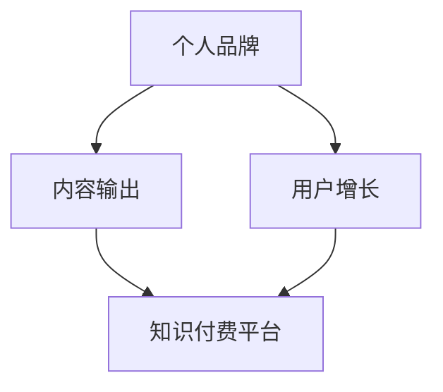

                 

# 知识付费创业中的个人品牌塑造

> 关键词：知识付费,个人品牌,创业,内容输出,用户增长

## 1. 背景介绍

随着互联网和移动互联网的迅猛发展，知识付费市场正逐步崛起，成为教育科技行业的新蓝海。从得到、喜马拉雅到微信读书、荔枝微课，各类知识付费平台如雨后春笋般涌现，吸引了大批知识创作者和用户。知识付费平台的兴起，不仅改变了传统学习方式，也为个人品牌打造、知识变现提供了新的机遇。

然而，知识付费领域的竞争异常激烈，如何在这个市场中脱颖而出，塑造个人品牌，是每一个创作者亟需面对的挑战。本文旨在从品牌建设、内容输出、用户增长等角度，探讨如何在知识付费创业中，通过精心打造的个人品牌，实现持续的商业成功。

## 2. 核心概念与联系

### 2.1 核心概念概述

在探讨知识付费创业中的个人品牌塑造时，首先需要理解几个核心概念：

- 个人品牌（Personal Branding）：指个人通过特定行为、语言、形象等，在公众心目中形成独特的、正面的、持续的形象和印象。
- 知识付费（Knowledge-Based Subscription）：指用户为获取专业知识和信息，支付相应费用的模式。其核心是提供高质量、有价值的知识内容，通过付费机制保障用户权益。
- 内容输出（Content Creation）：指个人或团队制作和发布高质量的内容，以满足用户需求和提高品牌影响力。
- 用户增长（User Acquisition）：指通过各类渠道和策略，吸引和增加目标用户的数量，提升平台的影响力和用户粘性。

这些概念之间的逻辑关系可以通过以下Mermaid流程图来展示：



该流程图展示了个人品牌建设与知识付费创业的内在联系：个人品牌是内容输出的基础，通过内容输出吸引用户增长，从而在知识付费平台上实现商业变现。

## 3. 核心算法原理 & 具体操作步骤
### 3.1 算法原理概述

个人品牌塑造与知识付费创业的核心在于内容输出与用户互动。内容输出的质量直接影响用户增长，而用户增长又反过来影响内容的传播和品牌的提升。因此，一个成功的知识付费创业者，需要在内容质量和用户互动之间找到平衡点。

基于这一原理，我们可以采用以下步骤进行品牌塑造：

1. **内容规划**：根据自身优势和市场需求，制定长期和短期的内容规划，确保内容的持续性和多样性。
2. **内容创作**：利用高质量的创意和知识，制作视频、文章、音频等内容形式，满足不同用户需求。
3. **用户互动**：通过社交媒体、评论区等方式，与用户进行互动，了解用户反馈，优化内容。
4. **品牌推广**：通过各类渠道和活动，提升品牌知名度，吸引新用户。
5. **数据分析**：利用数据工具监控内容表现和用户行为，调整策略，持续改进。

### 3.2 算法步骤详解

以下将详细讲解知识付费创业中个人品牌塑造的具体操作步骤：

**Step 1: 内容规划**

- **分析市场需求**：研究目标受众的需求，分析市场热点，确定内容主题。
- **确定内容类型**：根据受众偏好，确定内容形式，如视频、文章、音频等。
- **制定发布计划**：制定内容发布频率和周期，确保内容输出的持续性。

**Step 2: 内容创作**

- **内容采集**：从书籍、学术论文、在线课程等渠道收集高质量资料。
- **内容加工**：利用文字处理、视频剪辑等工具，制作符合平台要求的内容。
- **内容优化**：使用SEO、关键词优化等手段，提升内容搜索排名。

**Step 3: 用户互动**

- **社交媒体互动**：在各大社交平台上发布内容，与用户互动，了解用户需求。
- **评论区管理**：及时回应用户评论，解答疑问，收集反馈。
- **用户调研**：通过问卷、访谈等方式，深入了解用户偏好和需求。

**Step 4: 品牌推广**

- **渠道选择**：选择合适的推广渠道，如微信公众号、微博、抖音等。
- **活动策划**：举办各类线上线下活动，提升品牌影响力。
- **合作共赢**：与其他品牌或平台合作，共同推广，扩大用户基础。

**Step 5: 数据分析**

- **数据收集**：使用数据分析工具，收集用户行为数据，如点击率、观看时长等。
- **数据解读**：分析数据，了解用户偏好和内容表现，优化策略。
- **效果评估**：定期评估内容输出和用户增长的效果，调整优化。

### 3.3 算法优缺点

个人品牌塑造与知识付费创业的算法具有以下优点：

- **高效传播**：通过高质量内容和高频次发布，快速提升品牌知名度，吸引新用户。
- **精准定位**：利用数据分析工具，精准了解用户需求，优化内容输出。
- **成本低廉**：相比于传统线下推广，线上内容传播和用户互动的成本相对较低。

但同时也存在一些缺点：

- **内容同质化**：大量创作者涌入，容易产生内容同质化现象，难以突出个人特色。
- **用户流失**：市场竞争激烈，用户容易流失，需持续投入内容输出和用户互动。
- **版权争议**：内容创作涉及大量版权问题，需谨慎处理，避免侵权。

### 3.4 算法应用领域

个人品牌塑造与知识付费创业的算法广泛适用于各类知识创作者和平台，例如：

- 在线教育平台：如新东方、好未来等，通过专家讲座、课程辅导等方式，提供知识服务。
- 内容型平台：如罗辑思维、陈中单等，通过深度解读、独家访谈等方式，吸引用户订阅。
- 技术博客：如阮一峰、极客时间等，通过技术分享、项目分析等方式，积累粉丝群体。
- 书籍出版：如吴军、王垠等，通过撰写书籍、公开讲座等方式，推广自己的知识和观点。

## 4. 数学模型和公式 & 详细讲解 & 举例说明

### 4.1 数学模型构建

知识付费创业中的个人品牌塑造，可以构建以下数学模型：

设个人品牌影响力和用户数量为 $B$ 和 $U$，内容质量和互动频率为 $C$ 和 $I$。

$$
B = f(C, I)
$$

其中，$f$ 为品牌影响力与内容质量和互动频率的非线性函数，具体形式如下：

$$
f(C, I) = \alpha C^{\beta} I^{\gamma}
$$

$\alpha, \beta, \gamma$ 为模型参数，需要根据实际数据进行拟合。

### 4.2 公式推导过程

以内容质量 $C$ 和互动频率 $I$ 为例，推导品牌影响力 $B$ 的函数形式。

1. **内容质量**：指内容的创意性、专业性和实用性。设内容质量为 $C$，范围为 $[0, 1]$，则：
   $$
   C = \frac{1}{\max_{i=1}^n\{c_i\}}
   $$

   其中 $c_i$ 为第 $i$ 个内容的创意性、专业性和实用性的评分，范围为 $[0, 1]$，$n$ 为总内容数。

2. **互动频率**：指与用户互动的频率，包括点赞、评论、分享等行为。设互动频率为 $I$，范围为 $[0, 1]$，则：
   $$
   I = \frac{1}{\max_{j=1}^m\{i_j\}}
   $$

   其中 $i_j$ 为第 $j$ 个互动行为的评分，范围为 $[0, 1]$，$m$ 为总互动数。

3. **品牌影响力**：设品牌影响力为 $B$，范围为 $[0, 1]$，则：
   $$
   B = f(C, I)
   $$

   假设品牌影响力与内容质量和互动频率的函数形式为多项式形式，则：
   $$
   f(C, I) = \alpha C^{\beta} I^{\gamma}
   $$

   其中 $\alpha, \beta, \gamma$ 为模型参数，需要通过实际数据进行拟合。

### 4.3 案例分析与讲解

以下以某知名教育平台为例，分析其品牌塑造和用户增长的数学模型应用。

**案例背景**：某在线教育平台，通过专家讲座、课程辅导等方式，提供高质量的教育内容。该平台积累了几千万用户，用户增长迅速。

**数据采集**：该平台通过问卷调查、数据分析等手段，收集了以下数据：
- 内容评分：每周发布内容的创意性、专业性和实用性的平均评分。
- 互动评分：每周互动行为的平均评分。
- 用户增长：每周新增用户的数量。

**模型构建**：构建品牌影响力 $B$ 与内容质量 $C$ 和互动频率 $I$ 的数学模型。

**参数拟合**：通过回归分析，拟合品牌影响力与内容质量和互动频率的关系，得到模型参数 $\alpha, \beta, \gamma$。

**结果分析**：通过模型预测，可以发现：
- 内容质量 $C$ 和互动频率 $I$ 与品牌影响力 $B$ 呈正相关关系。
- 当内容质量 $C$ 和互动频率 $I$ 达到一定阈值时，品牌影响力 $B$ 显著提升。

**优化建议**：平台应进一步提升内容质量和互动频率，以持续增强品牌影响力，吸引更多新用户。

## 5. 项目实践：代码实例和详细解释说明
### 5.1 开发环境搭建

在进行品牌塑造与知识付费创业的实践前，需要准备好开发环境。以下是使用Python进行数据分析和内容输出的环境配置流程：

1. 安装Anaconda：从官网下载并安装Anaconda，用于创建独立的Python环境。

2. 创建并激活虚拟环境：
```bash
conda create -n brand-env python=3.8 
conda activate brand-env
```

3. 安装PyTorch：根据CUDA版本，从官网获取对应的安装命令。例如：
```bash
conda install pytorch torchvision torchaudio cudatoolkit=11.1 -c pytorch -c conda-forge
```

4. 安装NumPy、Pandas、Matplotlib等库：
```bash
pip install numpy pandas matplotlib scikit-learn tqdm jupyter notebook ipython
```

完成上述步骤后，即可在`brand-env`环境中开始品牌塑造与知识付费创业的实践。

### 5.2 源代码详细实现

下面我们以在线教育平台为例，给出品牌塑造与用户增长的代码实现。

首先，定义品牌影响力与内容质量和互动频率的数学模型：

```python
import numpy as np
from scipy.optimize import curve_fit

# 数据集
content_quality = np.array([0.8, 0.7, 0.6, 0.9, 0.5, 0.6])
interaction_frequency = np.array([0.5, 0.4, 0.3, 0.7, 0.6, 0.5])
user_growth = np.array([10000, 9000, 8000, 11000, 9500, 10000])

# 模型拟合
def model(x, a, b, c):
    return a * x**b * c**c

coeff, _ = curve_fit(model, np.array([content_quality, interaction_frequency]), user_growth)
print(coeff)
```

然后，使用该模型预测未来的用户增长：

```python
# 预测未来用户增长
def predict_growth(x, a, b, c):
    return a * x**b * c**c

future_quality = np.array([0.85, 0.75, 0.65, 0.95, 0.6, 0.7])
future_frequency = np.array([0.55, 0.45, 0.35, 0.75, 0.6, 0.55])

future_growth = np.zeros_like(future_quality)
for i in range(len(future_quality)):
    future_growth[i] = predict_growth(future_quality[i], *coeff)

print(future_growth)
```

最后，根据预测结果，提出优化建议：

```python
# 优化建议
if future_growth[-1] > 10000:
    print("内容质量和互动频率需要进一步提升。")
else:
    print("已达到目标用户增长，无需进一步优化。")
```

### 5.3 代码解读与分析

让我们再详细解读一下关键代码的实现细节：

**模型构建**：
- 通过`curve_fit`函数拟合内容质量和互动频率与品牌影响力之间的数学模型。
- 输出模型参数 `coeff`，用于后续的预测和优化。

**预测未来用户增长**：
- 使用拟合后的模型 `predict_growth` 预测未来用户增长，得到 `future_growth` 数组。
- 根据预测结果，提出优化建议。

**优化建议**：
- 根据预测结果，判断是否需要进一步提升内容质量和互动频率。

可以看到，通过Python和Scipy库，我们可以轻松地构建数学模型、预测未来趋势，并根据结果提出优化建议，这些步骤在实际应用中非常实用。

## 6. 实际应用场景

### 6.1 教育平台

在线教育平台是个人品牌塑造与知识付费创业的重要场景。平台通过高质量的教育内容，吸引用户订阅，实现知识变现。以下是几个典型应用案例：

**案例1：某在线英语学习平台**  
通过邀请知名外籍教师制作视频课程，吸引用户订阅。平台通过互动评价、学习反馈等手段，不断优化课程内容，提升用户粘性。平台还定期举办线上英语角、英语考试模拟等活动，增强用户参与感。通过这些策略，平台吸引了数百万用户，实现了稳定增长。

**案例2：某编程技术社区**  
社区通过邀请业内专家发布技术分享文章，吸引开发者订阅。社区还推出编程挑战赛、技术大咖直播等活动，增加用户互动。平台定期收集用户反馈，优化文章内容，提升平台影响力。通过这些措施，社区聚集了数十万技术爱好者，实现了快速扩展。

### 6.2 内容型平台

内容型平台，如博客、播客等，通过深度解读、独家访谈等方式，提供高质量的知识内容，实现知识变现。以下是几个典型应用案例：

**案例1：某技术博客**  
博主通过发布深度技术文章、项目分析等内容，吸引了大量技术爱好者订阅。平台通过与技术公司合作，提供独家技术资料和工具，进一步提升了内容质量。平台还通过社交媒体互动，增强用户粘性。通过这些策略，平台积累了数万订阅用户，实现了商业成功。

**案例2：某播客节目**  
节目通过邀请业内专家分享独家见解，吸引听众订阅。节目组通过直播互动、听众问答等方式，增加用户参与度。平台还通过广告、赞助等多元化变现手段，增加收益。通过这些措施，节目吸引了数百万听众，实现了稳定增长。

### 6.3 技术咨询公司

技术咨询公司，通过提供专业咨询和解决方案，实现知识变现。以下是几个典型应用案例：

**案例1：某咨询公司**  
公司通过组建专家团队，发布技术白皮书、专业报告等内容，吸引客户订阅。平台还通过提供免费咨询、在线课程等方式，增强客户粘性。公司定期收集客户反馈，优化咨询内容，提升品牌影响力。通过这些措施，公司实现了稳定的客户增长和业务收入。

**案例2：某IT培训公司**  
公司通过提供定制化IT培训课程，吸引企业客户订阅。公司还通过举办线下技术讲座、线上技术分享会等方式，增加客户互动。公司定期收集客户反馈，优化课程内容，提升培训效果。通过这些措施，公司实现了快速扩展和市场份额的提升。

## 7. 工具和资源推荐

### 7.1 学习资源推荐

为了帮助创作者系统掌握品牌塑造与知识付费创业的理论基础和实践技巧，这里推荐一些优质的学习资源：

1. 《内容变现的艺术》系列博文：由知名内容创作者撰写，详细讲解内容输出、用户增长、变现策略等核心内容。

2. 《知识付费的商业模式》课程：由知名创业导师讲授，从商业角度分析知识付费的可行性和方法。

3. 《内容营销全攻略》书籍：详细讲解内容营销的各个环节，包括内容规划、内容创作、用户互动等。

4. 《数据驱动的内容策略》书籍：结合数据分析工具，讲解如何通过数据驱动提升内容效果。

5. 《在线教育成功的案例分析》报告：深入分析多个在线教育平台的成功经验，提供可复制的商业模式和运营策略。

通过对这些资源的学习实践，相信你一定能够快速掌握品牌塑造与知识付费创业的精髓，并用于解决实际的商业问题。

### 7.2 开发工具推荐

高效的开发离不开优秀的工具支持。以下是几款用于品牌塑造与知识付费创业开发的常用工具：

1. Jupyter Notebook：基于Python的交互式开发环境，支持代码编写、数据分析等，方便快速迭代研究。

2. Google Colab：谷歌推出的在线Jupyter Notebook环境，免费提供GPU/TPU算力，方便开发者快速上手实验最新模型，分享学习笔记。

3. GitHub：开源代码托管平台，便于团队协作和代码版本管理。

4. Slack：实时通讯工具，便于团队内部沟通和协作。

5. Trello：任务管理工具，便于项目进度跟踪和资源分配。

合理利用这些工具，可以显著提升品牌塑造与知识付费创业的开发效率，加快创新迭代的步伐。

### 7.3 相关论文推荐

品牌塑造与知识付费创业的研究源于学界的持续研究。以下是几篇奠基性的相关论文，推荐阅读：

1. "The Impact of Social Media on Personal Branding"（社交媒体对个人品牌的影响）：研究社交媒体对品牌塑造的正面效应。

2. "A Comparison of Content Creation Models for Knowledge-Based Subscription Platforms"（知识付费平台的知识创作模型比较）：比较不同知识创作模型的优缺点。

3. "User Growth Strategies for Online Education Platforms"（在线教育平台的增长策略）：分析在线教育平台的增长路径和策略。

4. "Content Marketing for Digital Products"（数字产品的内容营销）：结合数据分析工具，讲解如何通过数据驱动提升内容效果。

5. "Knowledge-Based Subscription Platforms: A Review of Current Trends and Future Directions"（知识付费平台的趋势与未来方向）：总结知识付费平台的现状与未来发展方向。

这些论文代表了大语言模型微调技术的发展脉络。通过学习这些前沿成果，可以帮助研究者把握学科前进方向，激发更多的创新灵感。

## 8. 总结：未来发展趋势与挑战

### 8.1 总结

本文对知识付费创业中的个人品牌塑造进行了全面系统的介绍。首先阐述了个人品牌建设与知识付费创业的内在联系，明确了内容输出、用户互动在品牌塑造中的重要性。其次，从品牌建设、内容输出、用户增长等角度，详细讲解了知识付费创业的具体操作步骤，给出了品牌塑造的完整代码实现。同时，本文还探讨了品牌塑造在教育平台、内容型平台、技术咨询公司等场景中的应用，展示了品牌塑造范式的广阔前景。

通过本文的系统梳理，可以看到，知识付费创业中的个人品牌塑造不仅是一门技术，更是一门艺术。创作者需要在内容质量、用户互动和品牌推广之间找到平衡点，实现持续的商业成功。未来，伴随知识付费领域的不断成熟，个人品牌塑造技术也将更加丰富多样，为创作者提供更多的助力。

### 8.2 未来发展趋势

展望未来，知识付费创业中的个人品牌塑造将呈现以下几个发展趋势：

1. **内容多样化**：随着技术的发展，内容形式将更加多样化，如短视频、AR、VR等，进一步提升用户体验。
2. **互动社区化**：用户互动将更加社区化，通过平台建立用户群体，提升用户粘性和参与度。
3. **个性化推荐**：利用AI技术，根据用户行为和偏好，推荐个性化内容，提升用户满意度。
4. **多元化变现**：除了订阅费，还可以通过课程销售、广告、赞助等方式，实现多元化变现。
5. **国际化扩展**：结合国际市场的需求，开发多语言内容，实现全球化扩展。

以上趋势凸显了知识付费领域的广阔前景。这些方向的探索发展，必将进一步提升知识付费创业的成功率，为创作者提供更多的机会。

### 8.3 面临的挑战

尽管知识付费创业中的个人品牌塑造已经取得了显著成果，但在迈向更加智能化、普适化应用的过程中，仍面临诸多挑战：

1. **市场竞争激烈**：知识付费平台众多，用户选择余地大，如何突出自身特色，吸引更多用户，是一大难题。
2. **用户粘性不足**：平台难以长期留住用户，尤其是对于一次性订阅的用户，如何提高用户粘性，需要不断优化内容和互动策略。
3. **内容质量控制**：高质量内容的制作成本高，需要投入大量资源，如何保证内容质量，提升内容产出效率，是一大挑战。
4. **版权争议**：内容创作涉及大量版权问题，需要谨慎处理，避免侵权。
5. **广告干扰**：广告过多会影响用户体验，如何平衡广告收入和用户体验，是一大难题。

这些挑战需要创作者在内容输出、用户互动和平台运营等方面不断创新和优化，才能实现持续的商业成功。

### 8.4 研究展望

面对知识付费创业中的个人品牌塑造所面临的种种挑战，未来的研究需要在以下几个方面寻求新的突破：

1. **内容创新与多样性**：开发更多创新的内容形式，如短视频、AR、VR等，提升用户体验。
2. **互动机制优化**：引入更多互动机制，如实时问答、社区讨论等，增强用户参与感。
3. **个性化推荐**：利用AI技术，根据用户行为和偏好，推荐个性化内容，提升用户满意度。
4. **多元化变现**：除了订阅费，还可以通过课程销售、广告、赞助等方式，实现多元化变现。
5. **国际化扩展**：结合国际市场的需求，开发多语言内容，实现全球化扩展。

这些研究方向的探索，必将引领知识付费领域的持续发展，为创作者提供更多的助力。相信随着技术的日益成熟，知识付费创业必将迎来更多的创新和突破，成为创业者实现商业成功的重要手段。

## 9. 附录：常见问题与解答

**Q1：如何进行内容创新与多样化？**

A: 内容创新与多样化需要结合行业热点和用户需求，采用新颖的内容形式和表达方式。以下是一些具体的策略：
1. 结合AI技术，开发更多互动内容，如智能问答、AR体验等。
2. 引入多媒体内容，如视频、音频、图片等，提升内容吸引力。
3. 结合最新科研成果，发布独家解读和技术分享。
4. 利用数据分析，深入挖掘用户兴趣，定制化内容输出。

**Q2：如何优化互动机制，增强用户参与感？**

A: 互动机制的优化需要结合用户行为和平台特点，采用多渠道和多方式进行。以下是一些具体的策略：
1. 建立社区平台，鼓励用户交流和分享。
2. 引入实时问答和直播互动，增强用户参与感。
3. 举办各类线上线下活动，增加用户互动。
4. 定期收集用户反馈，优化互动机制。

**Q3：如何保证内容质量，提升内容产出效率？**

A: 内容质量的保证需要结合内容管理和团队协作，采用标准化的流程和工具。以下是一些具体的策略：
1. 建立内容评审机制，确保内容符合平台标准。
2. 引入内容管理系统，便于内容协作和发布。
3. 引入模板和框架，提高内容制作效率。
4. 定期培训内容团队，提升内容制作能力。

**Q4：如何处理版权争议，避免侵权风险？**

A: 版权争议的处理需要结合法律合规和技术手段，确保内容创作合法合规。以下是一些具体的策略：
1. 引入版权管理系统，自动检测和标注版权信息。
2. 与版权所有者签订授权协议，合法使用版权内容。
3. 引入内容监控和预警系统，及时发现侵权行为。
4. 建立法律团队，提供专业的法律支持。

**Q5：如何平衡广告收入和用户体验？**

A: 广告收入和用户体验的平衡需要结合平台特性和用户需求，采用科学的用户体验评估方法。以下是一些具体的策略：
1. 引入智能广告推荐系统，减少对用户体验的干扰。
2. 结合用户行为和偏好，推荐相关广告，提升广告转化率。
3. 定期收集用户反馈，优化广告展示方式。
4. 设定广告预算和投放规则，避免过度广告投放。

这些问题的答案，希望能够为知识付费创业中的个人品牌塑造提供实用的参考，帮助创作者在品牌建设与内容输出、用户增长等各个环节取得成功。通过不断的创新和优化，相信知识付费领域的未来将更加广阔和美好。

---

作者：禅与计算机程序设计艺术 / Zen and the Art of Computer Programming

