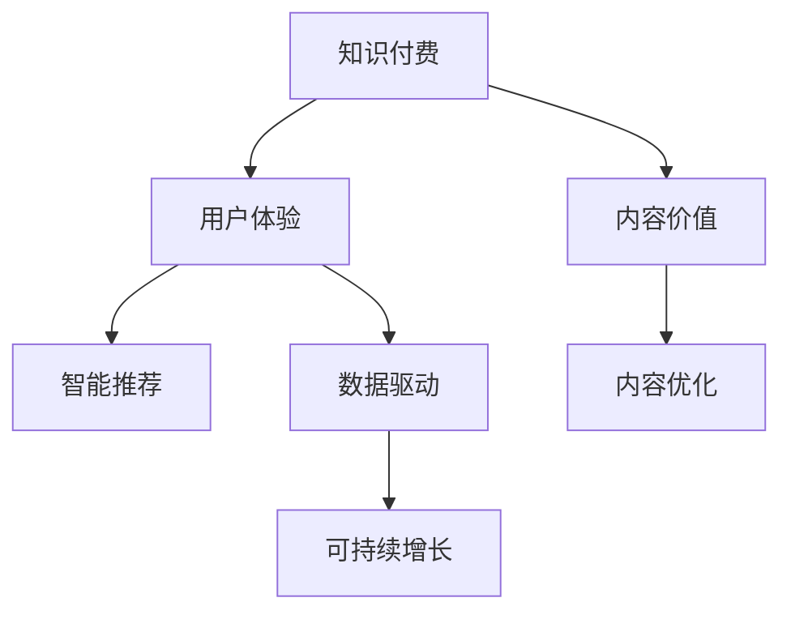

                 

# 知识付费创业中的内容价值提升

> 关键词：知识付费,内容价值,用户体验,智能推荐,数据驱动,内容优化,可持续增长

## 1. 背景介绍

### 1.1 问题由来

在互联网时代，知识付费成为新经济增长点，伴随大量知识型内容涌现，用户对内容的质量和个性化需求日益提升。知识付费平台通过内容订阅、单次付费等方式获取用户，而如何提升内容价值、提高用户粘性，是知识付费创业中的核心问题。

### 1.2 问题核心关键点

用户选择知识付费内容的核心驱动力是：
- 内容的相关性和实用性。用户希望在短时间内获得有价值的信息，解决实际问题。
- 内容的可操作性和易于理解性。高质量、易于操作的内容更容易被用户采纳。
- 内容的更新频率和时效性。知识更新速度加快，用户需要持续的优质内容支持。
- 内容的个性化推荐。基于用户偏好提供定制化的内容推荐，提升用户体验。
- 内容的社交互动性。鼓励用户讨论、分享、点赞，形成内容社区氛围。
- 内容的多样性。丰富的内容形式如视频、图文、音频等，满足不同用户的接收习惯。

这些关键点共同决定了知识付费内容的价值和用户满意度。而提升内容价值，提升用户体验，正是知识付费创业成功的关键。

### 1.3 问题研究意义

提升知识付费内容价值，不仅能够吸引和留存更多用户，还能够在市场中建立起独特的品牌优势。同时，高质量的内容还能够提升用户支付意愿，促进平台可持续增长。因此，在知识付费创业中，如何有效提升内容价值，成为一个亟需解决的重要问题。

## 2. 核心概念与联系

### 2.1 核心概念概述

为更好地理解知识付费内容价值提升的路径，本节将介绍几个密切相关的核心概念：

- 知识付费：基于在线订阅、按需支付等模式提供专业知识、经验、技能、情感等知识内容的商业行为。

- 内容价值：用户对知识内容相关性、实用性、可操作性、更新性、个性化、社交性等维度的综合评价。

- 用户体验：用户在使用产品时感受到的情感体验和操作便利性。

- 智能推荐：基于用户行为、兴趣、历史等数据，通过算法自动推荐相关内容的系统。

- 数据驱动：利用大数据分析、数据挖掘等技术，优化内容推荐、运营策略等业务环节。

- 内容优化：通过持续的A/B测试、用户反馈等手段，对内容形式、结构、质量进行迭代改进。

- 可持续增长：通过合理的定价策略、良好的用户体验、有效的用户管理等手段，促进平台长期健康发展。

这些核心概念之间的逻辑关系可以通过以下Mermaid流程图来展示：



这个流程图展示了几者之间的关联：

1. 知识付费平台的内容价值直接影响用户体验。
2. 智能推荐和数据驱动技术提升内容价值。
3. 内容优化和用户体验相辅相成。
4. 持续的用户体验和内容优化推动平台可持续增长。

## 3. 核心算法原理 & 具体操作步骤

### 3.1 算法原理概述

知识付费平台的内容价值提升，本质上是一个以数据为驱动，通过智能推荐和内容优化提升用户体验的迭代过程。其核心思想是：

1. 收集用户行为数据，如浏览时间、点击次数、付费记录等，通过数据分析确定用户的兴趣和需求。
2. 根据用户的兴趣和需求，使用智能推荐算法，向用户推荐相关内容，提升用户粘性和满意度。
3. 对推荐内容和用户反馈进行持续的A/B测试和优化，提升内容的实际价值。
4. 通过定期更新内容，保持内容的最新性和时效性，提升用户对平台的信任和依赖。
5. 通过用户互动、内容分享等行为，不断丰富内容形式和结构，提升平台的社交互动性。
6. 通过合理定价和优化运营策略，促进平台可持续增长。

### 3.2 算法步骤详解

基于以上核心思想，以下是具体的算法步骤：

**Step 1: 用户行为数据收集**
- 使用数据分析工具，如Google Analytics、Mixpanel等，收集用户在平台上的行为数据。
- 收集的内容包括但不限于页面浏览量、停留时间、点击率、付费记录、内容评分、评论互动等。

**Step 2: 用户兴趣模型建立**
- 使用机器学习算法，如协同过滤、深度学习、逻辑回归等，建立用户兴趣模型，预测用户对不同内容的兴趣。
- 模型输入为历史行为数据，输出为对各内容的相关性评分。

**Step 3: 智能推荐系统构建**
- 根据用户兴趣模型，构建推荐算法系统，将用户感兴趣的个性化内容推荐给用户。
- 推荐算法可以使用基于协同过滤、内容基于的推荐算法、基于深度学习的推荐算法等。

**Step 4: 内容价值评估**
- 根据用户行为数据，评估内容的相关性、实用性、更新性、个性化、社交性等维度。
- 可以使用基于用户反馈的评分系统、A/B测试结果、用户停留时间等指标综合评估内容价值。

**Step 5: 内容优化与迭代**
- 通过A/B测试，对不同内容形式、结构、质量进行迭代优化。
- 结合用户反馈和行为数据，动态调整内容推荐策略。
- 定期更新内容，保持内容的最新性和时效性。

**Step 6: 可持续增长策略制定**
- 根据平台的用户数据和内容价值，制定合理的定价策略和运营策略。
- 优化用户界面，提升用户体验。
- 通过社交互动、内容分享等手段，提升平台的社交性和用户粘性。
- 定期评估平台发展情况，调整内容和运营策略，推动平台的可持续增长。

### 3.3 算法优缺点

提升知识付费内容价值的算法具有以下优点：
1. 提升用户体验。通过个性化推荐和内容优化，满足用户需求，提升用户体验。
2. 增加用户粘性。良好的用户体验和个性化推荐，使平台具备持续吸引和留存用户的能力。
3. 提升内容价值。通过对用户兴趣的精准分析，确保推荐的内容符合用户需求，提升内容相关性和实用性。
4. 推动平台增长。持续的内容优化和合理定价策略，能够带来更多付费用户，推动平台增长。

同时，该算法也存在以下局限性：
1. 数据质量依赖度高。用户行为数据的质量直接影响推荐结果的准确性。
2. 用户数据隐私问题。平台需要在数据采集和处理过程中，注意用户隐私保护。
3. 算法复杂度高。个性化推荐算法通常较为复杂，需耗费大量计算资源。
4. 用户行为多样性。不同用户的行为模式和兴趣偏好差异较大，难以统一建模。
5. 动态内容更新挑战。频繁更新内容对平台运维提出较高要求，且可能影响用户体验。

尽管存在这些局限性，但就目前而言，基于数据驱动和智能推荐的算法仍是最主流的内容价值提升范式。未来相关研究的重点在于如何进一步提升数据质量，降低算法复杂度，同时兼顾用户隐私和数据安全等因素。

### 3.4 算法应用领域

基于智能推荐和数据驱动的内容价值提升方法，已经在知识付费领域得到了广泛的应用，覆盖了几乎所有常见功能，例如：

- 个性化内容推荐：根据用户行为数据，推荐用户感兴趣的内容。
- 专题和课程设计：结合热门趋势和用户兴趣，设计适合的内容专题和课程。
- 内容质量评估：通过用户评分、反馈等数据，评估内容质量，并指导内容优化。
- 用户行为分析：利用数据分析工具，了解用户行为模式，优化内容和运营策略。
- 内容付费机制：根据内容价值和用户需求，设计合理的价格策略，提升用户支付意愿。
- 平台增长策略：通过内容优化和用户互动，推动平台长期健康发展。

除了上述这些核心功能外，平台还会不断引入新的功能，如内容排行榜、热门话题、专题直播等，进一步丰富用户体验和内容形式。

## 4. 数学模型和公式 & 详细讲解 & 举例说明（备注：数学公式请使用latex格式，latex嵌入文中独立段落使用 $$，段落内使用 $)
### 4.1 数学模型构建

本节将使用数学语言对知识付费平台的内容价值提升方法进行更加严格的刻画。

记用户为 $U=\{u_1,u_2,...,u_N\}$，内容为 $C=\{c_1,c_2,...,c_M\}$，行为数据为 $D=\{(x_i,y_i)\}_{i=1}^N$，其中 $x_i$ 为行为特征向量， $y_i$ 为行为标签。

定义内容 $c_j$ 对用户 $u_i$ 的相关性评分为 $s_{i,j}$，则内容价值函数 $V(c_j)$ 可以表示为：

$$
V(c_j) = \sum_{i=1}^N s_{i,j}
$$

其中 $s_{i,j}$ 为内容 $c_j$ 对用户 $u_i$ 的相关性评分，可通过以下用户兴趣模型计算：

$$
s_{i,j} = f(\boldsymbol{x_i},\boldsymbol{c_j})
$$

$f(\boldsymbol{x_i},\boldsymbol{c_j})$ 为用户行为特征 $\boldsymbol{x_i}$ 和内容特征 $\boldsymbol{c_j}$ 的函数，可以使用协同过滤、内容基于的推荐算法、深度学习等方法。

### 4.2 公式推导过程

以下我们以协同过滤算法为例，推导内容相关性评分的计算公式。

假设用户 $u_i$ 对内容 $c_j$ 的兴趣由其他用户 $u_k$ 对内容 $c_j$ 的评分 $r_{k,j}$ 决定，则协同过滤算法下的用户-内容相关性评分 $s_{i,j}$ 可以表示为：

$$
s_{i,j} = \sum_{k=1}^K \alpha_k r_{k,j} \cdot \sigma\left(\boldsymbol{x_i}\cdot\boldsymbol{c_k}\right)
$$

其中：
- $K$ 为用户数，$K$ 为用户对内容 $c_j$ 的评分数量。
- $\alpha_k$ 为加权因子，保证用户权重和评分权重一致。
- $\sigma(\cdot)$ 为sigmoid激活函数，控制模型输出的范围在 $(0,1)$。

通过用户兴趣模型计算出的 $s_{i,j}$ 即为内容 $c_j$ 对用户 $u_i$ 的相关性评分。

将相关性评分代入内容价值函数，得到：

$$
V(c_j) = \sum_{i=1}^N \sum_{k=1}^K \alpha_k r_{k,j} \cdot \sigma\left(\boldsymbol{x_i}\cdot\boldsymbol{c_k}\right)
$$

即为知识付费平台的内容价值评估公式。

## 5. 项目实践：代码实例和详细解释说明
### 5.1 开发环境搭建

在进行内容价值提升实践前，我们需要准备好开发环境。以下是使用Python进行Flask开发的环境配置流程：

1. 安装Anaconda：从官网下载并安装Anaconda，用于创建独立的Python环境。

2. 创建并激活虚拟环境：
```bash
conda create -n flask-env python=3.8 
conda activate flask-env
```

3. 安装Flask：
```bash
pip install flask
```

4. 安装SQLAlchemy：用于数据库交互，支持SQLite、MySQL等多种数据库。
```bash
pip install sqlalchemy
```

5. 安装Flask-SQLAlchemy：用于Flask框架的数据库扩展，方便数据交互。
```bash
pip install flask-sqlalchemy
```

6. 安装Flask-Login：用于用户登录和权限控制。
```bash
pip install flask-login
```

7. 安装Flask-Mail：用于邮件通知，方便用户注册和激活。
```bash
pip install flask-mail
```

完成上述步骤后，即可在`flask-env`环境中开始内容价值提升实践。

### 5.2 源代码详细实现

这里我们以个性化推荐系统为例，给出使用Flask框架实现的内容价值提升的代码实现。

首先，定义数据模型：

```python
from flask_sqlalchemy import SQLAlchemy

db = SQLAlchemy()

class User(db.Model):
    id = db.Column(db.Integer, primary_key=True)
    username = db.Column(db.String(80), unique=True, nullable=False)
    email = db.Column(db.String(120), unique=True, nullable=False)
    password_hash = db.Column(db.String(120), nullable=False)
    is_admin = db.Column(db.Boolean, default=False, nullable=False)
    ...

class Content(db.Model):
    id = db.Column(db.Integer, primary_key=True)
    title = db.Column(db.String(200), nullable=False)
    description = db.Column(db.Text, nullable=False)
    category = db.Column(db.String(50), nullable=False)
    user_id = db.Column(db.Integer, db.ForeignKey('user.id'), nullable=False)
    ...
```

然后，定义推荐算法：

```python
from sklearn.neighbors import NearestNeighbors
import numpy as np

class RecommendationSystem:
    def __init__(self, user_data, content_data, user_similarity='cosine'):
        self.user_data = user_data
        self.content_data = content_data
        self.neighbors = NearestNeighbors(metric=user_similarity).fit(user_data)
        self.model = self.calculate_content_score(user_data)

    def calculate_content_score(self, user_data):
        user_content_scores = {}
        for user in user_data:
            user_content_scores[user] = {}
            for content in user_data[user]:
                user_content_scores[user][content] = self.calculate_content_similarity(user_data, content)
        return user_content_scores

    def calculate_content_similarity(self, user_data, content):
        user_similarities = self.neighbors.kneighbors(content)
        user_content_similarities = [user_similarities[1][idx] for idx in user_data.keys()]
        return np.mean(user_content_similarities)
```

接着，定义内容推荐接口：

```python
from flask import Flask, request, jsonify
from flask_login import LoginManager, login_user, logout_user, login_required, current_user
from flask_mail import Mail, Message
from app.models import User, Content
from app.recommendation import RecommendationSystem

app = Flask(__name__)
app.config['SECRET_KEY'] = 'super-secret'
app.config['SQLALCHEMY_DATABASE_URI'] = 'sqlite:///database.db'
app.config['MAIL_SERVER'] = 'smtp.gmail.com'
app.config['MAIL_PORT'] = 465
app.config['MAIL_USERNAME'] = 'your-email@gmail.com'
app.config['MAIL_PASSWORD'] = 'your-password'
app.config['MAIL_USE_TLS'] = False
app.config['MAIL_USE_SSL'] = True
mail = Mail(app)
login_manager = LoginManager()
login_manager.init_app(app)

@login_manager.user_loader
def load_user(user_id):
    return User.query.get(int(user_id))

@app.route('/login', methods=['POST'])
def login():
    data = request.get_json()
    user = User.query.filter_by(username=data['username']).first()
    if user and user.password == data['password']:
        login_user(user, remember=True)
        return jsonify({'message': 'Logged in successfully'})
    else:
        return jsonify({'message': 'Invalid username or password'}), 401

@app.route('/logout')
@login_required
def logout():
    logout_user()
    return jsonify({'message': 'Logged out successfully'})

@app.route('/recommendations', methods=['POST'])
@login_required
def get_recommendations():
    user_id = current_user.id
    user_data = User.query.filter_by(id=user_id).first()
    recommendation_system = RecommendationSystem(user_data, Content.query.all(), 'cosine')
    recommendations = recommendation_system.calculate_content_score(user_data)
    return jsonify(recommendations)
```

最后，启动服务：

```bash
if __name__ == '__main__':
    app.run(debug=True)
```

完成上述步骤后，即可通过访问`/recommendations`接口，获取当前登录用户的个性化推荐列表。

### 5.3 代码解读与分析

让我们再详细解读一下关键代码的实现细节：

**User模型**：
- `id`：用户ID，自增长整数类型。
- `username`：用户名，字符串类型，唯一且不可为空。
- `email`：邮箱，字符串类型，唯一且不可为空。
- `password_hash`：哈希加密后的密码，字符串类型，不可为空。
- `is_admin`：是否为管理员，布尔类型，默认False。

**Content模型**：
- `id`：内容ID，自增长整数类型。
- `title`：标题，字符串类型，不可为空。
- `description`：描述，文本类型，不可为空。
- `category`：类别，字符串类型，不可为空。
- `user_id`：创建内容的用户ID，外键类型，关联到User模型。

**RecommendationSystem类**：
- `__init__`方法：初始化用户数据、内容数据、相似度计算方法。
- `calculate_content_score`方法：计算每个用户对每个内容的评分，存储在字典中。
- `calculate_content_similarity`方法：根据用户对内容的评分，计算相似度。

**Flask框架**：
- 使用Flask创建Web应用，定义路由、控制器等组件。
- 使用SQLAlchemy进行数据库交互，定义模型、建立关联等操作。
- 使用Flask-Login实现用户登录和权限控制。
- 使用Flask-Mail实现邮件通知功能。
- 实现`/login`、`/logout`、`/get_recommendations`等接口，返回推荐内容列表。

可以看出，Flask框架提供了丰富的工具库，极大地简化了Web应用开发过程。通过与SQLAlchemy、Flask-Login等扩展模块结合，Flask能够方便地实现用户管理、数据库交互等功能，使得内容价值提升项目开发更加高效。

## 6. 实际应用场景
### 6.1 个性化内容推荐系统

个性化推荐系统是知识付费平台的核心功能，通过为用户推荐其感兴趣的内容，提升用户粘性和满意度。推荐系统通常使用协同过滤、内容基于的推荐算法等方法，根据用户行为数据和内容特征，计算用户-内容的相关性评分，生成推荐列表。

在实际应用中，推荐系统通常会实时计算用户对内容的评分，根据评分动态调整推荐列表。同时，系统还会结合用户反馈、行为数据等，不断优化推荐策略，提升推荐效果。

### 6.2 用户行为分析系统

用户行为分析系统通过对用户在平台上的浏览、点击、购买等行为数据进行分析，了解用户的兴趣偏好，优化内容推荐策略。通过数据分析，平台可以发现用户对某类内容的兴趣上升趋势，及时调整相关内容的推广策略。

在实际应用中，系统通常使用机器学习算法，如协同过滤、内容基于的推荐算法、深度学习等，对用户行为数据进行建模，预测用户对不同内容的兴趣。同时，系统还会定期更新模型参数，保持模型的时效性和准确性。

### 6.3 用户互动和社区建设

用户互动和社区建设是提升平台粘性和用户体验的重要手段。平台可以通过互动评论、点赞、分享等功能，鼓励用户对内容进行互动，形成社区氛围。同时，平台还可以通过专题讨论、专家讲座等活动，促进用户之间的交流和分享。

在实际应用中，系统通常使用A/B测试、用户反馈等手段，不断优化内容推荐和互动机制，提升用户体验。平台还可以通过奖励机制，如积分、优惠券等，激励用户积极参与互动。

### 6.4 未来应用展望

随着技术的不断发展，知识付费平台的内容价值提升将迎来更多新的应用方向：

- 多模态推荐：结合文本、图片、视频等多模态数据，提升推荐系统的多样性和效果。
- 语音识别推荐：结合语音识别技术，提升用户交互体验，让用户通过语音获取个性化推荐。
- 自然语言生成推荐：通过自然语言生成技术，提升推荐内容的质量和可读性。
- 实时互动推荐：结合实时通信技术，实现用户在互动中获取推荐内容，增强用户的沉浸感。
- 跨平台推荐：实现跨平台数据共享和内容推荐，提升推荐系统的覆盖范围和效果。
- 联邦学习推荐：利用联邦学习技术，保护用户隐私，同时提升推荐系统的准确性和安全性。

这些新的应用方向，将为知识付费平台带来更多创新和机会，进一步提升用户体验和平台价值。

## 7. 工具和资源推荐
### 7.1 学习资源推荐

为了帮助开发者系统掌握知识付费内容价值提升的理论基础和实践技巧，这里推荐一些优质的学习资源：

1. 《推荐系统实战》书籍：由知名推荐系统专家撰写，系统介绍了推荐系统的发展历史、原理和实现方法，适合深入学习。

2. 《人工智能》课程：斯坦福大学开设的AI课程，涵盖了机器学习、深度学习、自然语言处理等多个领域的核心内容，适合入门学习。

3. 《深度学习》书籍：Ian Goodfellow等著作的深度学习经典教材，详细介绍了深度学习原理和应用，适合进阶学习。

4. 《数据科学导论》书籍：由MIT教授撰写，介绍了数据科学的基础概念和工具，适合了解数据驱动决策的核心思想。

5. 《Python Web开发实战》书籍：由知名Web开发专家撰写，介绍了Flask、SQLAlchemy等Web开发工具的使用方法，适合快速上手开发。

通过这些资源的学习实践，相信你一定能够全面掌握知识付费内容价值提升的方法和技巧，并应用于实际项目中。

### 7.2 开发工具推荐

高效的开发离不开优秀的工具支持。以下是几款用于知识付费内容价值提升开发的常用工具：

1. Python：简洁高效的语言，拥有丰富的数据科学和机器学习库，适合数据驱动开发。

2. SQLAlchemy：强大的ORM框架，支持多种数据库，方便数据交互和管理。

3. Flask：轻量级Web框架，易于上手，灵活性高，适合快速迭代开发。

4. TensorFlow：强大的深度学习框架，支持多种深度学习算法，适合复杂模型训练。

5. scikit-learn：数据科学库，支持多种机器学习算法，方便快速实验和调参。

6. Jupyter Notebook：交互式开发环境，支持多种编程语言，适合数据探索和实验。

合理利用这些工具，可以显著提升知识付费内容价值提升项目的开发效率，加快创新迭代的步伐。

### 7.3 相关论文推荐

知识付费内容价值提升的研究涉及多个领域，以下是几篇奠基性的相关论文，推荐阅读：

1. "The Recommender Systems Handbook"书籍：由Bengio、Healy等专家主编，详细介绍了推荐系统的理论基础和实现方法，适合深入研究。

2. "A Survey of Machine Learning Techniques for Recommender Systems"论文：由Han等专家撰写，总结了机器学习在推荐系统中的应用，适合了解主流算法。

3. "Knowledge-Graph-Based Recommendation Systems"论文：由He等专家撰写，介绍了基于知识图谱的推荐系统，适合了解多模态推荐方法。

4. "Deep Learning for Recommender Systems: A Survey and Outlook"论文：由Zhang等专家撰写，总结了深度学习在推荐系统中的应用，适合了解深度学习推荐方法。

5. "Federated Learning for Recommender Systems"论文：由Kim等专家撰写，介绍了联邦学习在推荐系统中的应用，适合了解联邦学习推荐方法。

这些论文代表了大数据推荐系统领域的研究前沿，通过学习这些论文，可以帮助研究者把握学科前进方向，激发更多的创新灵感。

## 8. 总结：未来发展趋势与挑战

### 8.1 总结

本文对知识付费平台的内容价值提升进行了全面系统的介绍。首先阐述了知识付费平台的内容价值提升的重要性和核心关键点，明确了个性化推荐和用户行为分析在提升用户体验中的重要作用。其次，从原理到实践，详细讲解了推荐算法和内容优化的方法，给出了代码实例和详细解释说明。同时，本文还探讨了知识付费平台在实际应用中的各种场景和应用前景，展示了内容价值提升的广阔前景。最后，本文精选了学习资源、开发工具和相关论文，力求为读者提供全方位的技术指引。

通过本文的系统梳理，可以看到，知识付费平台的内容价值提升不仅需要依赖数据驱动和智能推荐算法，还需要在用户体验、运营策略等方面进行全面优化。只有在数据、算法、用户、内容等多维度协同发力，才能真正提升平台的竞争力和用户满意度。

### 8.2 未来发展趋势

知识付费平台的内容价值提升将呈现以下几个发展趋势：

1. 算法多样性增加。推荐算法从传统的协同过滤、内容基于的推荐算法，逐步引入深度学习、神经网络等先进方法，提升推荐准确性。

2. 多模态推荐兴起。结合文本、图片、视频等多模态数据，提升推荐系统的多样性和效果。

3. 实时推荐系统普及。利用实时数据流处理技术，实现动态实时推荐，提升推荐的时效性和个性化。

4. 联邦学习推荐发展。通过联邦学习技术，保护用户隐私，同时提升推荐系统的准确性和安全性。

5. 数据驱动的运营策略。利用用户行为数据，不断优化运营策略，提升平台的用户粘性和满意度。

6. 智能化的用户互动。结合自然语言处理、语音识别等技术，提升用户互动体验，增强平台的社交性和用户粘性。

这些趋势将进一步推动知识付费平台的内容价值提升，为平台带来更多创新和机会，提升用户体验和平台价值。

### 8.3 面临的挑战

尽管知识付费平台的内容价值提升取得了显著成效，但在迈向更加智能化、普适化应用的过程中，仍面临诸多挑战：

1. 数据质量瓶颈。推荐系统的效果很大程度上依赖数据质量，不完整、不准确的数据会导致推荐结果偏差。如何获取高质量、多维度的数据，是一大挑战。

2. 算法复杂性增加。深度学习等先进算法虽然效果显著，但计算复杂度高，训练时间长。如何优化算法，降低计算成本，是一大难题。

3. 用户隐私问题。推荐系统通常需要收集大量用户行为数据，如何在保护用户隐私的同时，获取有价值的用户信息，是一大挑战。

4. 用户多样性挑战。不同用户的行为模式和兴趣偏好差异较大，难以统一建模。如何对不同用户进行个性化推荐，是一大挑战。

5. 动态内容更新难度。频繁更新内容对平台运维提出较高要求，且可能影响用户体验。如何实现高效的内容更新机制，是一大挑战。

6. 模型解释性不足。推荐系统通常被视为"黑盒"系统，难以解释其内部工作机制。如何赋予推荐系统更强的可解释性，是一大挑战。

正视知识付费内容价值提升面临的这些挑战，积极应对并寻求突破，将使平台内容价值提升走向成熟。相信随着学界和产业界的共同努力，这些挑战终将一一被克服，知识付费平台的内容价值提升必将在提升用户体验、推动平台发展等方面发挥更大的作用。

### 8.4 研究展望

面向未来，知识付费平台的内容价值提升需要在以下几个方面寻求新的突破：

1. 探索无监督和半监督推荐方法。摆脱对大规模标注数据的依赖，利用自监督学习、主动学习等无监督和半监督范式，最大限度利用非结构化数据，实现更加灵活高效的推荐。

2. 研究参数高效和计算高效的推荐算法。开发更加参数高效的推荐方法，在固定大部分推荐参数的同时，只更新极少量的任务相关参数。同时优化推荐模型的计算图，减少前向传播和反向传播的资源消耗，实现更加轻量级、实时性的部署。

3. 引入因果推断和强化学习思想。通过引入因果推断和强化学习思想，增强推荐系统建立稳定因果关系的能力，学习更加普适、鲁棒的语言表征，从而提升推荐泛化性和抗干扰能力。

4. 结合更多先验知识。将符号化的先验知识，如知识图谱、逻辑规则等，与推荐算法进行巧妙融合，引导推荐过程学习更准确、合理的推荐模式。同时加强不同模态数据的整合，实现视觉、语音等多模态信息与文本信息的协同建模。

5. 优化推荐系统的可解释性。通过因果分析方法，识别出推荐系统决策的关键特征，增强推荐过程的因果性和逻辑性。借助博弈论工具刻画人机交互过程，主动探索并规避推荐系统的脆弱点，提高系统稳定性。

6. 引入伦理道德约束。在推荐目标中引入伦理导向的评估指标，过滤和惩罚有偏见、有害的推荐结果，确保推荐系统符合人类价值观和伦理道德。

这些研究方向的探索，必将引领知识付费平台的内容价值提升技术迈向更高的台阶，为平台带来更多的创新和机会。相信随着技术的持续演进，知识付费平台的内容价值提升将不断突破瓶颈，推动平台持续健康发展。

## 9. 附录：常见问题与解答

**Q1：知识付费平台推荐系统的效果如何评估？**

A: 推荐系统的效果评估通常从以下几个维度进行：
1. 准确性：如精确率、召回率、F1值等，衡量推荐的准确程度。
2. 多样性：如熵、负熵等，衡量推荐的覆盖面。
3. 新颖性：如推荐项与历史行为的差异性，衡量推荐的新颖程度。
4. 满意度：通过A/B测试、问卷调查等手段，衡量用户对推荐结果的满意度。

通过这些维度的综合评估，可以全面了解推荐系统的性能和改进方向。

**Q2：推荐系统在实际应用中需要注意哪些问题？**

A: 推荐系统在实际应用中需要注意以下问题：
1. 数据质量：推荐系统的效果依赖于数据质量，需要定期清洗和更新数据。
2. 数据隐私：推荐系统通常需要收集大量用户行为数据，需要在保护用户隐私的前提下获取数据。
3. 模型泛化性：推荐模型需要具备良好的泛化能力，避免过拟合和灾难性遗忘。
4. 实时性：推荐系统需要具备实时推荐能力，以应对用户动态变化的需求。
5. 用户满意度：推荐系统需要满足用户的多样化需求，提升用户体验。
6. 动态更新：推荐系统需要具备动态更新能力，保持内容的时效性和相关性。

这些问题是推荐系统在实际应用中必须考虑的，只有在数据、模型、用户、内容等多维度进行全面优化，才能真正提升推荐系统的效果和用户体验。

**Q3：推荐系统如何优化推荐算法？**

A: 推荐算法优化可以从以下几个方面进行：
1. 引入深度学习：使用深度学习模型，提升推荐准确性。
2. 使用联邦学习：保护用户隐私，同时提升推荐系统的准确性和安全性。
3. 引入多模态数据：结合文本、图片、视频等多模态数据，提升推荐系统的多样性和效果。
4. 优化推荐目标函数：设计更加合理的推荐目标函数，提升推荐效果。
5. 引入因果推断：通过因果推断技术，提升推荐系统的稳定性和抗干扰能力。
6. 优化推荐机制：引入强化学习、自适应学习等机制，提升推荐系统的动态适应能力。

这些优化方法可以在不同场景中应用，提升推荐系统的效果和用户满意度。

**Q4：推荐系统如何处理数据稀疏性问题？**

A: 推荐系统通常面临数据稀疏性问题，即用户对某些内容没有交互历史。解决数据稀疏性的方法包括：
1. 协同过滤算法：利用用户对内容的评分，推断用户对其他内容的兴趣。
2. 内容基于的推荐算法：利用内容特征，推断用户对其他内容的兴趣。
3. 混合推荐算法：结合协同过滤和内容基于的推荐算法，提升推荐效果。
4. 数据增强：通过用户行为预测、用户画像构建等手段，丰富用户行为数据，提升推荐系统的数据质量。

这些方法可以在不同场景中应用，提升推荐系统的数据质量和推荐效果。

**Q5：推荐系统如何处理冷启动问题？**

A: 冷启动问题指新用户没有历史行为数据，无法进行推荐。解决冷启动问题的方法包括：
1. 利用内容特征：通过内容特征，推断新用户对内容的兴趣。
2. 利用用户画像：通过用户画像，推断新用户对内容的兴趣。
3. 利用用户生成内容：通过用户生成的内容，推断新用户对内容的兴趣。
4. 引入推荐算法：通过推荐算法，对新用户进行个性化推荐。

这些方法可以在不同场景中应用，提升推荐系统的冷启动效果和用户满意度。

---

作者：禅与计算机程序设计艺术 / Zen and the Art of Computer Programming

