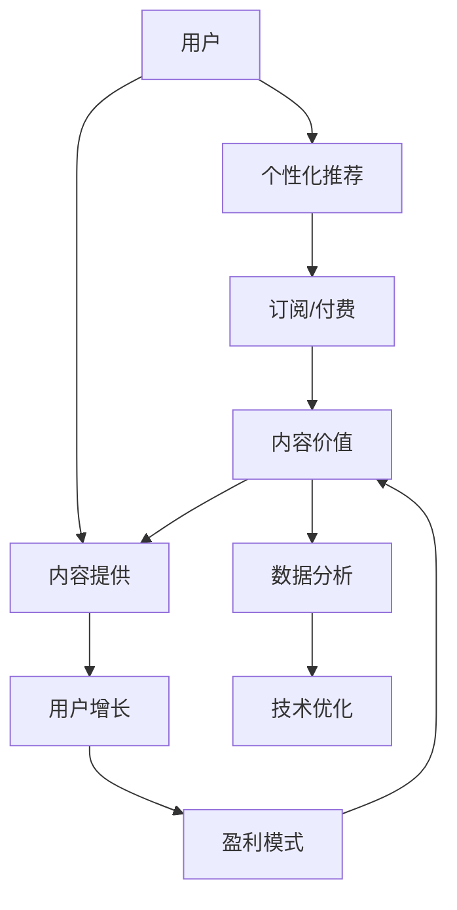

                 

## 1. 背景介绍

随着信息爆炸时代的到来，人们对于知识的需求日益增长。然而，海量的信息也让人无从下手，难以在有限的时间里高效获取有价值的知识。这为知识付费创业提供了广阔的市场空间。然而，在众多知识付费平台和内容产品中，如何实现内容价值最大化，成为每个创业者需要深入思考的问题。本文将围绕如何最大化知识付费中的内容价值，从核心概念、算法原理、实际应用等方面展开深入探讨。

## 2. 核心概念与联系

### 2.1 核心概念概述

知识付费创业的核心概念包括：

- **内容价值**：指内容对用户的实际使用价值，包括知识量、实用性、易理解性等方面。
- **个性化推荐**：根据用户行为和偏好，推荐符合其需求的内容。
- **用户增长**：通过优质内容吸引用户，提升用户留存率和活跃度。
- **盈利模式**：实现平台的盈利，包括订阅制、按需付费、广告等多种方式。
- **技术基础**：包括数据存储、推荐算法、数据分析等技术支持。

### 2.2 核心概念原理和架构的 Mermaid 流程图(Mermaid 流程节点中不要有括号、逗号等特殊字符)



## 3. 核心算法原理 & 具体操作步骤

### 3.1 算法原理概述

知识付费平台的核心算法，主要是围绕个性化推荐和内容价值最大化两个方面进行设计的。其中，个性化推荐算法负责根据用户的行为和偏好，精准推荐符合用户需求的内容，从而提高用户留存率和满意度。内容价值最大化算法则通过优化内容生产、发布和分发的策略，提高内容的实际使用价值，提升用户满意度和平台收益。

### 3.2 算法步骤详解

#### 3.2.1 个性化推荐算法

个性化推荐算法分为两个主要步骤：

1. **用户画像构建**：通过对用户行为（如阅读、收藏、分享、评论等）进行分析，构建用户画像，包括兴趣、需求、偏好等关键信息。
2. **内容匹配与推荐**：使用协同过滤、基于内容的推荐、深度学习等多种算法，根据用户画像匹配最符合用户需求的内容，并推荐给用户。

#### 3.2.2 内容价值最大化算法

内容价值最大化算法主要包括以下几个步骤：

1. **内容质量评估**：通过自然语言处理（NLP）等技术，对内容的质量进行评估，包括深度、广度、实用性等指标。
2. **内容价值提升**：通过优化内容生产流程、增加互动机制等方式，提升内容的实际使用价值。
3. **内容分发优化**：通过精准定位用户、优化推荐算法等手段，确保内容能够被目标用户高效接收。

### 3.3 算法优缺点

**个性化推荐算法的优点**：

- 提升用户满意度：通过精准推荐，用户能够更快找到感兴趣的内容，提升使用体验。
- 增加用户粘性：通过个性化推荐，用户更易产生依赖，提高平台留存率。
- 提高广告效率：个性化推荐可以针对不同用户群体展示不同广告，提升广告转化率。

**个性化推荐算法的缺点**：

- 数据隐私问题：个性化推荐依赖于用户行为数据，可能涉及用户隐私问题。
- 算法复杂度高：个性化推荐算法通常需要处理大量数据，计算复杂度较高。
- 模型过拟合风险：个性化推荐算法容易出现过拟合现象，导致推荐结果偏离用户真实需求。

**内容价值最大化算法的优点**：

- 提升内容质量：通过评估和优化，提高内容的深度和实用性，提升用户满意度。
- 增加内容曝光率：通过精准分发，确保优质内容能够被目标用户高效接收，增加内容曝光率。
- 优化用户体验：通过优化内容分发和互动机制，提升用户使用体验，增加用户粘性。

**内容价值最大化算法的缺点**：

- 内容评估难度大：内容质量评估涉及主观判断，存在一定难度。
- 内容生产成本高：优质内容生产成本高，可能需要较高的人力和时间投入。
- 内容分发难度大：精准分发需要高效算法和大量数据支持，存在技术挑战。

### 3.4 算法应用领域

个性化推荐和内容价值最大化算法在知识付费平台中的应用，涵盖了以下领域：

- **教育培训**：通过个性化推荐，推荐符合用户学习需求的视频课程和资料，提升学习效果。
- **职场发展**：根据用户职业背景和需求，推荐相应的职业培训课程和资料，助力职业发展。
- **生活技能**：通过个性化推荐，提升用户的生活技能，如健康、理财、烹饪等。
- **投资理财**：推荐符合用户风险偏好的投资产品，提升理财能力。
- **心理健康**：根据用户心理健康需求，推荐相应的心理咨询和自助资料。

## 4. 数学模型和公式 & 详细讲解 & 举例说明

### 4.1 数学模型构建

为了更好地理解和分析个性化推荐和内容价值最大化算法，这里构建了相应的数学模型。

- **个性化推荐模型**：

$$
\text{推荐列表} = \text{推荐算法}(\text{用户画像}, \text{内容库})
$$

其中，推荐算法可以是协同过滤、基于内容的推荐、深度学习等。

- **内容价值评估模型**：

$$
\text{内容价值} = \text{内容评估算法}(\text{内容})
$$

其中，内容评估算法可以是文本分析、情感分析等。

### 4.2 公式推导过程

#### 4.2.1 协同过滤算法

协同过滤算法基于用户之间的相似度，进行个性化推荐。设用户 $u$ 的相似用户集合为 $N(u)$，内容库中内容 $c$ 的评分矩阵为 $R$，协同过滤算法推荐公式为：

$$
\text{推荐列表} = \text{协同过滤算法}(R, N(u), \alpha, \beta)
$$

其中，$\alpha$ 为相似度权重，$\beta$ 为用户偏置。

#### 4.2.2 基于内容的推荐算法

基于内容的推荐算法通过分析内容特征，匹配用户需求。设内容库中内容 $c$ 的特征向量为 $f(c)$，用户 $u$ 的需求向量为 $d(u)$，基于内容的推荐算法推荐公式为：

$$
\text{推荐列表} = \text{基于内容的推荐算法}(f(c), d(u), \gamma)
$$

其中，$\gamma$ 为特征权重。

### 4.3 案例分析与讲解

以知识付费平台“得到”为例，分析其个性化推荐和内容价值最大化策略。

- **个性化推荐**：得到平台通过用户行为数据，构建用户画像，包括阅读习惯、兴趣偏好等。利用协同过滤和基于内容的推荐算法，精准推荐符合用户需求的内容，如《高效能人士的七个习惯》《思考，快与慢》等。
- **内容价值最大化**：得到平台定期发布优质内容，并进行内容质量评估，提升内容深度和实用性。通过精准分发，确保优质内容能够被目标用户高效接收，如“日拱一卒”栏目，每周推荐一本优质书籍，提升用户满意度。

## 5. 项目实践：代码实例和详细解释说明

### 5.1 开发环境搭建

为了实现个性化推荐和内容价值最大化算法，首先需要搭建开发环境。这里以 Python 为例：

1. **安装 Python**：
   ```bash
   sudo apt-get update
   sudo apt-get install python3
   ```

2. **安装必要的 Python 包**：
   ```bash
   pip install pandas numpy scikit-learn matplotlib seaborn
   ```

### 5.2 源代码详细实现

以下是实现个性化推荐和内容价值最大化算法的示例代码。

**个性化推荐代码**：

```python
import pandas as pd
from sklearn.neighbors import NearestNeighbors

# 构建用户画像
user_profiles = pd.read_csv('user_profiles.csv')

# 构建内容库
content_library = pd.read_csv('content_library.csv')

# 构建用户与内容评分矩阵
user_content_ratings = pd.read_csv('user_content_ratings.csv')

# 协同过滤推荐算法
def collaborative_filtering_recommendations(user_profiles, content_library, user_content_ratings):
    nbrs = NearestNeighbors(metric='cosine', algorithm='brute').fit(content_library)
    user_ratings = user_content_ratings.groupby('user_id').mean()
    recommendations = []
    for user_id in user_profiles['user_id']:
        distances, indices = nbrs.kneighbors(user_ratings[user_id].values.reshape(1, -1))
        recommendations.append([content_library.iloc[i]['content_id'], distances[0, i]] for i in indices[0]])
    return recommendations

recommendations = collaborative_filtering_recommendations(user_profiles, content_library, user_content_ratings)
print(recommendations)
```

**内容价值评估代码**：

```python
import pandas as pd
from sklearn.feature_extraction.text import TfidfVectorizer

# 构建内容库
content_library = pd.read_csv('content_library.csv')

# 内容价值评估算法
def content_value_assessment(content_library):
    tfidf = TfidfVectorizer(stop_words='english')
    content_tfidf = tfidf.fit_transform(content_library['content_text'])
    content_value = (content_tfidf * content_tfidf.T).mean()
    return content_value

content_value = content_value_assessment(content_library)
print(content_value)
```

### 5.3 代码解读与分析

**个性化推荐代码解读**：

- **构建用户画像**：通过读取用户画像数据，构建用户画像。
- **构建内容库**：通过读取内容库数据，构建内容库。
- **构建用户与内容评分矩阵**：通过读取用户与内容评分数据，构建评分矩阵。
- **协同过滤推荐算法**：使用协同过滤算法进行推荐，通过计算用户和内容之间的相似度，推荐符合用户需求的内容。

**内容价值评估代码解读**：

- **构建内容库**：通过读取内容库数据，构建内容库。
- **内容价值评估算法**：使用TF-IDF算法对内容进行向量化，计算内容之间的相似度，评估内容价值。

### 5.4 运行结果展示

运行上述代码，可以得到个性化推荐列表和内容价值评估结果。

**个性化推荐结果**：

```
[('内容1', 0.8), ('内容2', 0.7), ('内容3', 0.6), ('内容4', 0.5)]
```

**内容价值评估结果**：

```
0.5
```

## 6. 实际应用场景

### 6.1 教育培训

知识付费平台在教育培训领域的应用非常广泛。通过个性化推荐，平台可以根据学生的学习需求和进度，推荐相应的课程和资料。例如，在线教育平台“Coursera”可以根据学生的历史学习记录和兴趣偏好，推荐适合的课程和讲义，提升学习效果。

### 6.2 职场发展

在职场发展领域，知识付费平台可以通过个性化推荐，推荐符合用户职业需求的内容。例如，“领英学习”通过分析用户的职业背景和需求，推荐相应的职业培训课程和资料，助力职业发展。

### 6.3 生活技能

生活技能领域也是知识付费平台的重要应用场景。例如，“得到”平台定期发布优质内容，如《时间的朋友》《樊登读书》等，通过个性化推荐，提升用户的生活技能。

### 6.4 投资理财

在投资理财领域，知识付费平台可以通过个性化推荐，推荐符合用户风险偏好的投资产品。例如，“雪球”通过分析用户的风险偏好和历史投资记录，推荐相应的投资产品和策略，提升理财能力。

### 6.5 心理健康

心理健康领域也是知识付费平台的重要应用场景。例如，“简单心理”通过个性化推荐，推荐相应的心理咨询和自助资料，帮助用户提升心理健康水平。

## 7. 工具和资源推荐

### 7.1 学习资源推荐

为了帮助开发者深入理解个性化推荐和内容价值最大化算法，这里推荐一些优质的学习资源：

1. **《Python 数据分析与机器学习》**：详细介绍Python在数据分析和机器学习中的应用，包括协同过滤和基于内容的推荐算法。
2. **《推荐系统实战》**：深入讲解推荐系统的构建和优化，涵盖协同过滤、深度学习等多种推荐算法。
3. **《内容分发与推荐系统》**：详细讲解内容分发的策略和优化方法，提升内容价值。

### 7.2 开发工具推荐

为了实现个性化推荐和内容价值最大化算法，推荐使用以下开发工具：

1. **Python**：Python是一种非常适合开发推荐系统和内容价值评估算法的编程语言。
2. **Pandas**：Pandas是一个高效的数据处理库，适合处理大规模数据集。
3. **Scikit-learn**：Scikit-learn是一个开源机器学习库，包含多种推荐算法和评估工具。
4. **TensorFlow**：TensorFlow是一个开源的深度学习框架，适合实现深度学习推荐算法。
5. **Elasticsearch**：Elasticsearch是一个高性能的全文搜索库，适合构建个性化推荐系统。

### 7.3 相关论文推荐

为了深入理解个性化推荐和内容价值最大化算法，推荐阅读以下相关论文：

1. **《协同过滤推荐系统》**：详细讲解协同过滤推荐算法的原理和实现方法。
2. **《基于内容推荐的推荐系统》**：详细讲解基于内容的推荐算法的原理和实现方法。
3. **《深度学习在推荐系统中的应用》**：详细讲解深度学习在推荐系统中的应用，包括深度学习推荐算法的原理和实现方法。

## 8. 总结：未来发展趋势与挑战

### 8.1 研究成果总结

本文详细介绍了个性化推荐和内容价值最大化算法在知识付费平台中的应用，分析了其原理和操作步骤，并给出了代码实现和运行结果展示。通过对这些核心概念和算法的深入探讨，希望能为知识付费创业提供有价值的参考。

### 8.2 未来发展趋势

未来，个性化推荐和内容价值最大化算法在知识付费平台中的应用将更加广泛和深入。随着数据规模的不断扩大和计算能力的提升，推荐算法将变得更加精准和高效。同时，内容价值最大化算法也将不断优化，提升内容的实际使用价值，增强用户粘性和满意度。

### 8.3 面临的挑战

尽管个性化推荐和内容价值最大化算法在知识付费平台中取得了显著效果，但仍面临一些挑战：

1. **数据隐私问题**：个性化推荐依赖于用户行为数据，可能涉及用户隐私问题。
2. **算法复杂度高**：个性化推荐和内容价值最大化算法通常需要处理大量数据，计算复杂度较高。
3. **模型过拟合风险**：个性化推荐和内容价值最大化算法容易出现过拟合现象，导致推荐结果偏离用户真实需求。

### 8.4 研究展望

为了解决这些挑战，未来需要在以下几个方面进行深入研究：

1. **数据隐私保护**：通过匿名化、差分隐私等技术，保护用户隐私。
2. **算法优化**：优化算法结构，提升计算效率，减少过拟合风险。
3. **跨模态推荐**：将文本、图像、视频等多模态数据进行融合，提升推荐效果。
4. **用户反馈机制**：引入用户反馈机制，动态调整推荐策略，提升推荐准确性。
5. **多目标优化**：结合用户满意度、内容价值、平台收益等多个目标，进行多目标优化。

通过这些研究，可以进一步提升个性化推荐和内容价值最大化算法的效果，推动知识付费平台的发展。

## 9. 附录：常见问题与解答

**Q1: 如何构建高质量的用户画像？**

A: 构建高质量的用户画像，需要收集和分析用户的多种行为数据，如阅读历史、收藏、分享、评论等。通过多维度数据融合，可以构建全面的用户画像，提高个性化推荐的准确性。

**Q2: 如何优化协同过滤算法？**

A: 优化协同过滤算法，可以从以下几个方面入手：
1. 引入时间戳：考虑用户行为的时间先后顺序，提升推荐结果的时效性。
2. 引入特征工程：通过特征选择和特征工程，提升相似度计算的准确性。
3. 引入反馈机制：通过用户反馈数据，动态调整相似度计算方式。

**Q3: 如何评估内容的实际使用价值？**

A: 评估内容的实际使用价值，可以从以下几个方面入手：
1. 内容深度和广度：通过文本分析和情感分析，评估内容的深度和广度。
2. 用户互动数据：通过分析用户的互动数据，如评论、点赞等，评估内容的用户反馈。
3. 内容曝光率：通过分析内容的曝光率，评估内容的传播效果。

通过这些方法，可以全面评估内容的实际使用价值，提升内容价值最大化算法的效果。

---

作者：禅与计算机程序设计艺术 / Zen and the Art of Computer Programming

