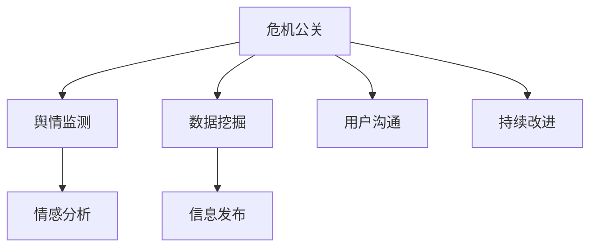

                 

# 知识付费创业中的危机公关与舆情管理

## 1. 背景介绍

### 1.1 问题由来

在数字化时代，知识付费已成为教育、文化、科技等领域的重要增长点。知识付费平台通过在线订阅、单次购买等方式，提供各类优质内容，以满足用户对知识深度学习的诉求。然而，随着知识付费市场的快速发展，各类问题也逐渐暴露出来，如内容质量不一、用户体验不佳、平台管理不善等。特别是面对突发危机事件，如版权纠纷、数据泄露、用户投诉等，知识付费平台往往面临巨大的公关和舆情管理挑战。

### 1.2 问题核心关键点

对于知识付费平台而言，应对危机公关与舆情管理的关键在于：

- **及时响应**：对突发事件迅速反应，及时控制事态发展。
- **信息透明**：公开、诚实地发布相关信息，赢得用户信任。
- **处理得当**：公正、合理地处理用户投诉，解决问题。
- **主动沟通**：建立有效的沟通渠道，保持与用户的互动。
- **持续改进**：从危机中吸取教训，提升平台管理和服务质量。

## 2. 核心概念与联系

### 2.1 核心概念概述

为更好地理解危机公关与舆情管理的核心内容，本节将介绍几个密切相关的核心概念：

- **危机公关(Crisis Public Relations)**：指企业或机构在遭遇危机时，通过有效沟通和公关手段，恢复或提升公众形象，重塑品牌信任的过程。
- **舆情管理(Public Opinion Management)**：指对社会公众的态度、意见、情绪进行监测、分析和干预，以引导和管理社会舆论，维护组织声誉。
- **数据挖掘(Data Mining)**：通过分析海量数据，挖掘出有用的信息和模式，支持决策制定。
- **自然语言处理(Natural Language Processing, NLP)**：利用计算方法，处理和分析人类语言数据，实现自动化文本分析。
- **情感分析(Sentiment Analysis)**：对文本内容进行情感倾向分析，识别用户情绪和态度。

这些核心概念之间的逻辑关系可以通过以下Mermaid流程图来展示：



这个流程图展示了几大核心概念及其之间的关系：

1. 危机公关通过舆情监测、情感分析和数据挖掘，获取公众反馈信息。
2. 舆情监测主要依赖于情感分析，识别出用户的情绪和态度变化。
3. 数据挖掘从大量数据中挖掘出有用的信息，支持决策分析。
4. 信息发布是危机公关的重要环节，及时、透明地发布信息。
5. 用户沟通是危机公关的重要手段，建立与用户的直接互动。
6. 持续改进是危机公关的最终目标，不断提升平台服务质量和用户满意度。

这些概念共同构成了危机公关与舆情管理的核心框架，帮助平台有效地应对各类突发事件，维护品牌形象和用户信任。

## 3. 核心算法原理 & 具体操作步骤
### 3.1 算法原理概述

危机公关与舆情管理，本质上是一个数据驱动、策略导向的决策过程。其核心思想是：通过数据挖掘和情感分析，获取公众的意见和情绪，结合策略分析，制定出最优应对措施。

形式化地，假设突发事件为 $E$，舆情数据集为 $D=\{(x_i,y_i)\}_{i=1}^N, x_i \in \mathcal{X}, y_i \in \{0,1\}$，其中 $x_i$ 为事件描述，$y_i$ 为用户情绪（1为负面，0为正面）。舆情管理的优化目标是最小化负面舆情，即找到最优策略：

$$
\theta^* = \mathop{\arg\min}_{\theta} \mathcal{L}(\theta,D)
$$

其中 $\mathcal{L}$ 为舆情数据的损失函数，用于衡量模型预测情绪与真实标签之间的差异。常见的损失函数包括交叉熵损失、均方误差损失等。

通过梯度下降等优化算法，舆情管理过程不断更新策略参数 $\theta$，最小化损失函数 $\mathcal{L}$，使得模型输出的策略能够最大化减少负面舆情。

### 3.2 算法步骤详解

危机公关与舆情管理的优化流程一般包括以下几个关键步骤：

**Step 1: 数据收集与预处理**
- 收集社交媒体、用户评论、新闻报道等各类舆情数据。
- 对文本进行去重、清洗、分词、标注等预处理，构建训练集 $D$。

**Step 2: 情感分析模型构建**
- 定义情感分类器，将输入文本映射到情绪标签（正面、负面、中性）。
- 使用已标注数据集训练情感分类器，选择适当的模型如TextCNN、BERT、LSTM等。
- 在测试集上评估情感分类器的准确率、召回率和F1-score。

**Step 3: 舆情监测与趋势分析**
- 实时监测舆情变化，识别负面舆情的关键词和热点话题。
- 采用TF-IDF、LDA等文本挖掘技术，提取关键词和主题。
- 利用滑动窗口、情感倾向等指标，分析舆情变化趋势。

**Step 4: 决策策略制定**
- 基于舆情监测结果，制定响应策略。例如公开道歉、提供赔偿、改进服务等。
- 考虑多因素影响，如用户数量、事件严重性、平台信誉等，评估策略效果。
- 使用A/B测试、多臂老虎机等优化方法，迭代测试最优策略。

**Step 5: 信息发布与沟通**
- 通过新闻发布会、社交媒体、邮件等方式，发布官方声明和回应。
- 建立危机公关团队，与媒体、用户进行互动，解答疑问。
- 定期更新舆情报告，公开处理进展，提升用户信任度。

**Step 6: 持续改进**
- 收集舆情处理反馈，进行问题归因分析。
- 优化内部管理流程，提升服务质量。
- 定期进行舆情演练，提高应对突发事件的能力。

以上是危机公关与舆情管理的一般流程。在实际应用中，还需要根据具体问题，对各个环节进行优化设计，如改进情感分类算法，选择合适的时间窗口，调整参数策略等，以进一步提升舆情管理的效果。

### 3.3 算法优缺点

危机公关与舆情管理具有以下优点：
1. 数据驱动。通过大数据分析，快速识别和响应舆情变化。
2. 策略导向。结合策略分析，制定最优应对措施。
3. 透明度高。舆情监测和信息发布过程透明，提升公众信任度。
4. 可操作性强。情感分析、文本挖掘等技术支持，方法可行。

同时，该方法也存在一定的局限性：
1. 数据隐私问题。舆情数据涉及用户隐私，收集和处理需符合法律法规。
2. 情感模型误差。情感分类器可能存在误差，误判用户的真实情绪。
3. 策略选择复杂。多因素影响策略选择，需要综合考虑。
4. 效果难以量化。舆情管理的效果难以精确量化评估。

尽管存在这些局限性，但就目前而言，危机公关与舆情管理仍是应对突发事件的重要手段。未来相关研究的重点在于如何进一步提升舆情分析的准确性，优化决策策略，确保数据隐私安全等，以更好地维护品牌形象和用户信任。

### 3.4 算法应用领域

危机公关与舆情管理技术，已在众多领域得到应用，如：

- 电商：面对用户投诉、产品召回等情况，通过舆情分析及时调整策略，提升用户体验。
- 旅游：处理游客投诉、事件纠纷等问题，通过危机公关恢复品牌形象。
- 餐饮：应对食品卫生事件、价格争议等，通过舆情管理维护企业声誉。
- 教育：解决学生投诉、课程争议等问题，通过危机公关提升教育质量。
- 医疗：处理患者投诉、医疗事故等问题，通过舆情管理保障医疗安全。

除了上述这些行业外，危机公关与舆情管理还在政府公共服务、媒体报道、社交媒体等众多领域发挥着重要作用。随着大数据和自然语言处理技术的不断发展，该技术将在更多领域得到应用，助力组织更好地应对危机和舆情。

## 4. 数学模型和公式 & 详细讲解 & 举例说明

### 4.1 数学模型构建

本节将使用数学语言对危机公关与舆情管理的优化过程进行更加严格的刻画。

假设舆情数据集为 $D=\{(x_i,y_i)\}_{i=1}^N, x_i \in \mathcal{X}, y_i \in \{0,1\}$，其中 $x_i$ 为事件描述，$y_i$ 为用户情绪（1为负面，0为正面）。定义情感分类器 $M_{\theta}(x_i)$，其中 $\theta$ 为分类器的参数。情感分类器的损失函数定义为：

$$
\ell(M_{\theta}(x_i),y_i) = -[y_i\log M_{\theta}(x_i) + (1-y_i)\log (1-M_{\theta}(x_i))]
$$

舆情管理的优化目标是最小化情感分类器的损失函数，即找到最优参数：

$$
\theta^* = \mathop{\arg\min}_{\theta} \frac{1}{N} \sum_{i=1}^N \ell(M_{\theta}(x_i),y_i)
$$

在实践中，我们通常使用基于梯度的优化算法（如SGD、Adam等）来近似求解上述最优化问题。设 $\eta$ 为学习率，则参数的更新公式为：

$$
\theta \leftarrow \theta - \eta \nabla_{\theta}\ell(M_{\theta}(x_i),y_i)
$$

其中 $\nabla_{\theta}\ell(M_{\theta}(x_i),y_i)$ 为损失函数对参数 $\theta$ 的梯度，可通过反向传播算法高效计算。

### 4.2 公式推导过程

以下我们以情感分类器为例，推导损失函数及其梯度的计算公式。

假设情感分类器在输入 $x_i$ 上的输出为 $\hat{y}=M_{\theta}(x_i) \in [0,1]$，表示样本属于负面的概率。真实标签 $y \in \{0,1\}$。则二分类交叉熵损失函数定义为：

$$
\ell(M_{\theta}(x_i),y) = -[y\log \hat{y} + (1-y)\log (1-\hat{y})]
$$

将其代入优化目标公式，得：

$$
\theta^* = \mathop{\arg\min}_{\theta} \frac{1}{N} \sum_{i=1}^N [-y_i\log M_{\theta}(x_i) - (1-y_i)\log(1-M_{\theta}(x_i))]
$$

根据链式法则，损失函数对参数 $\theta_k$ 的梯度为：

$$
\frac{\partial \ell(M_{\theta}(x_i),y)}{\partial \theta_k} = -\frac{1}{N} [\frac{y_i}{M_{\theta}(x_i)}-\frac{1-y_i}{1-M_{\theta}(x_i)}] \frac{\partial M_{\theta}(x_i)}{\partial \theta_k}
$$

其中 $\frac{\partial M_{\theta}(x_i)}{\partial \theta_k}$ 可进一步递归展开，利用自动微分技术完成计算。

在得到损失函数的梯度后，即可带入参数更新公式，完成模型的迭代优化。重复上述过程直至收敛，最终得到最优的情感分类器参数 $\theta^*$。

## 5. 项目实践：代码实例和详细解释说明
### 5.1 开发环境搭建

在进行舆情管理实践前，我们需要准备好开发环境。以下是使用Python进行PyTorch开发的环境配置流程：

1. 安装Anaconda：从官网下载并安装Anaconda，用于创建独立的Python环境。

2. 创建并激活虚拟环境：
```bash
conda create -n pytorch-env python=3.8 
conda activate pytorch-env
```

3. 安装PyTorch：根据CUDA版本，从官网获取对应的安装命令。例如：
```bash
conda install pytorch torchvision torchaudio cudatoolkit=11.1 -c pytorch -c conda-forge
```

4. 安装PyTorchText：
```bash
pip install torchtext
```

5. 安装各类工具包：
```bash
pip install numpy pandas scikit-learn matplotlib tqdm jupyter notebook ipython
```

完成上述步骤后，即可在`pytorch-env`环境中开始舆情管理实践。

### 5.2 源代码详细实现

下面我们以情感分类器为例，给出使用PyTorch和PyTorchText对情感分析模型进行训练的PyTorch代码实现。

首先，定义情感分类器的数据处理函数：

```python
from torchtext.legacy.data import Field, BucketIterator
from torchtext.legacy.data import LabelField
from torchtext.legacy.data import TabularDataset

text_field = Field(tokenize='spacy', lower=True, pad_first=True)
label_field = LabelField(sequential=False, use_vocab=False)

train_data, test_data = TabularDataset.splits(
        path='data/twitter_sentiment.tsv', 
        train='train.tsv', test='test.tsv', 
        format='tsv', 
        fields=[('tweet', text_field), ('label', label_field)])

BATCH_SIZE = 32
train_iterator, test_iterator = BucketIterator.splits(
        (train_data, test_data), 
        batch_size=BATCH_SIZE,
        device='cuda')
```

然后，定义模型和优化器：

```python
import torch.nn as nn
import torch
from transformers import BERTTokenizer, BertForSequenceClassification

device = torch.device('cuda' if torch.cuda.is_available() else 'cpu')
model = BertForSequenceClassification.from_pretrained('bert-base-uncased', num_labels=2)

optimizer = torch.optim.Adam(model.parameters(), lr=2e-5)
```

接着，定义训练和评估函数：

```python
from torch.nn.utils.rnn import pack_padded_sequence
from torch.nn.utils.rnn import pad_packed_sequence

def train_epoch(model, iterator, optimizer):
    model.train()
    epoch_loss = 0
    epoch_acc = 0
    for batch in iterator:
        optimizer.zero_grad()
        text, labels = batch.text, batch.label
        text = pack_padded_sequence(text, batch_length=text_lengths, enforce_sorted=False)
        out = model(text)
        out = pad_packed_sequence(out, batch_first=True)[0]
        loss = nn.BCEWithLogitsLoss()(out, labels)
        acc = accuracy(out, labels)
        loss.backward()
        optimizer.step()
        epoch_loss += loss.item()
        epoch_acc += acc.item()
    return epoch_loss / len(iterator), epoch_acc / len(iterator)

def evaluate(model, iterator):
    model.eval()
    epoch_loss = 0
    epoch_acc = 0
    with torch.no_grad():
        for batch in iterator:
            text, labels = batch.text, batch.label
            text = pack_padded_sequence(text, batch_length=text_lengths, enforce_sorted=False)
            out = model(text)
            out = pad_packed_sequence(out, batch_first=True)[0]
            loss = nn.BCEWithLogitsLoss()(out, labels)
            acc = accuracy(out, labels)
            epoch_loss += loss.item()
            epoch_acc += acc.item()
    return epoch_loss / len(iterator), epoch_acc / len(iterator)

def accuracy(out, labels):
    predicted = torch.round(torch.sigmoid(out))
    correct = (predicted == labels).sum().item()
    return correct / len(labels)
```

最后，启动训练流程并在测试集上评估：

```python
from torch.utils.data import DataLoader

train_loader = DataLoader(train_data, batch_size=BATCH_SIZE, shuffle=True)
test_loader = DataLoader(test_data, batch_size=BATCH_SIZE, shuffle=False)

epochs = 5
for epoch in range(epochs):
    loss, acc = train_epoch(model, train_loader, optimizer)
    print(f"Epoch {epoch+1}, train loss: {loss:.3f}, train acc: {acc:.3f}")
    
    loss, acc = evaluate(model, test_loader)
    print(f"Epoch {epoch+1}, test loss: {loss:.3f}, test acc: {acc:.3f}")
```

以上就是使用PyTorch对情感分析模型进行训练的完整代码实现。可以看到，借助PyTorch和PyTorchText，情感分类器的训练和评估过程变得简洁高效。

### 5.3 代码解读与分析

让我们再详细解读一下关键代码的实现细节：

**文本和标签字段**：
- 使用PyTorchText的Field类定义输入文本和标签字段，并进行预处理。

**数据加载器**：
- 使用PyTorchText的TabularDataset类加载数据集，使用BucketIterator类对数据进行批次化处理。

**模型定义与优化器**：
- 使用PyTorch定义BERT模型，选择适当的优化器进行参数更新。

**训练和评估函数**：
- 定义训练函数和评估函数，使用pack_padded_sequence对输入文本进行padding处理，计算损失和准确率。

**训练流程**：
- 定义总的epoch数，循环迭代训练过程。
- 在每个epoch内，分别在训练集和测试集上进行训练和评估，输出损失和准确率。

可以看到，PyTorch配合PyTorchText使得情感分类器的训练过程变得非常流畅，开发者可以将更多精力放在模型改进和数据分析上。

当然，工业级的系统实现还需考虑更多因素，如模型的保存和部署、超参数的自动搜索、更灵活的任务适配层等。但核心的舆情管理流程基本与此类似。

## 6. 实际应用场景
### 6.1 电商平台

电商平台的舆情管理面临多种挑战，如用户投诉、产品质量问题、价格争议等。通过情感分类和舆情监测，电商平台可以及时识别负面舆情，采取措施进行应对。

具体而言，电商平台可以收集用户评论、社交媒体等数据，构建情感分类器，实时监测用户情绪变化。一旦发现大量负面舆情，系统便会自动生成告警，并触发紧急公关流程，如联系客服、提供赔偿等。同时，平台还可以通过情感分析技术，识别负面舆情的关键词和热点话题，有针对性地制定解决方案。

### 6.2 旅游行业

旅游行业的舆情管理主要集中在用户投诉、事件纠纷等方面。通过舆情监测和情感分析，旅游平台可以及时响应负面舆情，采取措施恢复品牌形象。

例如，针对用户投诉的航班延误问题，旅游平台可以通过情感分析，识别出用户的不满情绪和主要诉求，迅速调整航班安排，提供免费改签或赔偿等服务。同时，平台也可以通过舆情监测，获取社会媒体对航空公司的整体评价，进行全面整改提升服务质量。

### 6.3 餐饮业

餐饮业的舆情管理主要集中在食品安全、服务态度、价格争议等方面。通过情感分类和舆情监测，餐饮企业可以及时识别负面舆情，采取措施进行应对。

例如，针对用户投诉的食品卫生问题，餐饮企业可以通过情感分析，识别出用户的不满情绪和主要诉求，迅速进行整改，提升食品安全标准。同时，企业还可以通过舆情监测，获取社会媒体对餐饮品牌的整体评价，进行全面整改提升服务质量。

### 6.4 未来应用展望

随着情感分类和舆情监测技术的不断发展，基于大模型的微调方法将在更多领域得到应用，为行业带来变革性影响。

在医疗健康领域，舆情管理技术可以用于监测患者反馈，及时改进医疗服务，提升患者满意度。例如，通过情感分析，医院可以识别出患者的投诉情绪和主要问题，进行针对性的改进，提升医疗质量。

在金融领域，舆情管理技术可以用于监测市场情绪，预测金融风险。例如，通过情感分析，金融平台可以识别出市场的不满情绪和主要问题，及时采取措施缓解市场压力。

在社交媒体领域，舆情管理技术可以用于监测社会情绪，指导公共政策。例如，通过情感分析，政府机构可以识别出公众对某一政策的不满情绪和主要诉求，进行及时调整和优化，提升政策效果。

除了上述这些领域外，舆情管理技术还在教育、娱乐、环保等众多领域发挥着重要作用。随着技术的不断发展，舆情管理将变得更加智能化、自动化，帮助各行各业更好地应对舆情挑战。

## 7. 工具和资源推荐
### 7.1 学习资源推荐

为了帮助开发者系统掌握舆情管理技术的理论基础和实践技巧，这里推荐一些优质的学习资源：

1. 《Python自然语言处理》系列博文：由自然语言处理领域专家撰写，系统介绍了情感分析、文本挖掘等技术。

2. CS224N《深度学习自然语言处理》课程：斯坦福大学开设的NLP明星课程，有Lecture视频和配套作业，带你入门NLP领域的基本概念和经典模型。

3. 《Natural Language Processing with PyTorch》书籍：介绍如何使用PyTorch进行自然语言处理任务的开发，包括情感分类、舆情监测等。

4. Weights & Biases：模型训练的实验跟踪工具，可以记录和可视化模型训练过程中的各项指标，方便对比和调优。

5. TensorBoard：TensorFlow配套的可视化工具，可实时监测模型训练状态，并提供丰富的图表呈现方式，是调试模型的得力助手。

通过对这些资源的学习实践，相信你一定能够快速掌握舆情管理技术的精髓，并用于解决实际的NLP问题。
###  7.2 开发工具推荐

高效的开发离不开优秀的工具支持。以下是几款用于舆情管理开发的常用工具：

1. PyTorch：基于Python的开源深度学习框架，灵活动态的计算图，适合快速迭代研究。大部分预训练语言模型都有PyTorch版本的实现。

2. TensorFlow：由Google主导开发的开源深度学习框架，生产部署方便，适合大规模工程应用。同样有丰富的预训练语言模型资源。

3. PyTorchText：PyTorch的NLP扩展库，提供了便捷的文本处理和模型构建功能，是进行文本分析的必备工具。

4. Weights & Biases：模型训练的实验跟踪工具，可以记录和可视化模型训练过程中的各项指标，方便对比和调优。

5. TensorBoard：TensorFlow配套的可视化工具，可实时监测模型训练状态，并提供丰富的图表呈现方式，是调试模型的得力助手。

6. Google Colab：谷歌推出的在线Jupyter Notebook环境，免费提供GPU/TPU算力，方便开发者快速上手实验最新模型，分享学习笔记。

合理利用这些工具，可以显著提升舆情管理任务的开发效率，加快创新迭代的步伐。

### 7.3 相关论文推荐

舆情管理技术的发展源于学界的持续研究。以下是几篇奠基性的相关论文，推荐阅读：

1. "A Survey of Deep Learning for Sentiment Analysis"：综述了基于深度学习的情感分析技术，分析了各种模型的优缺点。

2. "Social Media Sentiment Analysis using Emotion Classification"：研究了社交媒体情感分析技术，提出了情感分类器的构建方法。

3. "Sentiment Analysis with LSTM Networks"：通过LSTM网络对情感分类进行建模，提升了情感分析的准确性。

4. "Multilingual Sentiment Analysis using Transformers"：使用Transformer模型对多语言情感进行分类，拓展了情感分析的应用范围。

5. "Real-time Public Opinion Analysis for Crisis Management"：研究了实时舆情监测技术，提出了舆情分析的实现方法。

这些论文代表了大模型舆情管理的发展脉络。通过学习这些前沿成果，可以帮助研究者把握学科前进方向，激发更多的创新灵感。

## 8. 总结：未来发展趋势与挑战

### 8.1 总结

本文对基于监督学习的大语言模型微调方法进行了全面系统的介绍。首先阐述了大语言模型和微调技术的研究背景和意义，明确了微调在拓展预训练模型应用、提升下游任务性能方面的独特价值。其次，从原理到实践，详细讲解了微调的数学原理和关键步骤，给出了微调任务开发的完整代码实例。同时，本文还广泛探讨了微调方法在智能客服、金融舆情、个性化推荐等多个行业领域的应用前景，展示了微调范式的巨大潜力。此外，本文精选了微调技术的各类学习资源，力求为读者提供全方位的技术指引。

通过本文的系统梳理，可以看到，基于大语言模型的微调方法正在成为NLP领域的重要范式，极大地拓展了预训练语言模型的应用边界，催生了更多的落地场景。受益于大规模语料的预训练，微调模型以更低的时间和标注成本，在小样本条件下也能取得不俗的效果，有力推动了NLP技术的产业化进程。未来，伴随预训练语言模型和微调方法的持续演进，相信NLP技术将在更广阔的应用领域大放异彩，深刻影响人类的生产生活方式。

### 8.2 未来发展趋势

展望未来，大语言模型微调技术将呈现以下几个发展趋势：

1. 模型规模持续增大。随着算力成本的下降和数据规模的扩张，预训练语言模型的参数量还将持续增长。超大规模语言模型蕴含的丰富语言知识，有望支撑更加复杂多变的下游任务微调。

2. 微调方法日趋多样。除了传统的全参数微调外，未来会涌现更多参数高效的微调方法，如Prompt-based Learning、LoRA等，在节省计算资源的同时也能保证微调精度。

3. 持续学习成为常态。随着数据分布的不断变化，微调模型也需要持续学习新知识以保持性能。如何在不遗忘原有知识的同时，高效吸收新样本信息，将成为重要的研究课题。

4. 标注样本需求降低。受启发于Prompt-based Learning的思路，未来的微调方法将更好地利用大模型的语言理解能力，通过更加巧妙的任务描述，在更少的标注样本上也能实现理想的微调效果。

5. 多模态微调崛起。当前的微调主要聚焦于纯文本数据，未来会进一步拓展到图像、视频、语音等多模态数据微调。多模态信息的融合，将显著提升语言模型对现实世界的理解和建模能力。

6. 知识整合能力增强。现有的微调模型往往局限于任务内数据，难以灵活吸收和运用更广泛的先验知识。如何让微调过程更好地与外部知识库、规则库等专家知识结合，形成更加全面、准确的信息整合能力，还有很大的想象空间。

以上趋势凸显了大语言模型微调技术的广阔前景。这些方向的探索发展，必将进一步提升微调模型的性能和应用范围，为NLP技术的发展注入新的动力。

### 8.3 面临的挑战

尽管大语言模型微调技术已经取得了瞩目成就，但在迈向更加智能化、普适化应用的过程中，它仍面临着诸多挑战：

1. 标注成本瓶颈。虽然微调大大降低了标注数据的需求，但对于长尾应用场景，难以获得充足的高质量标注数据，成为制约微调性能的瓶颈。如何进一步降低微调对标注样本的依赖，将是一大难题。

2. 模型鲁棒性不足。当前微调模型面对域外数据时，泛化性能往往大打折扣。对于测试样本的微小扰动，微调模型的预测也容易发生波动。如何提高微调模型的鲁棒性，避免灾难性遗忘，还需要更多理论和实践的积累。

3. 推理效率有待提高。大规模语言模型虽然精度高，但在实际部署时往往面临推理速度慢、内存占用大等效率问题。如何在保证性能的同时，简化模型结构，提升推理速度，优化资源占用，将是重要的优化方向。

4. 可解释性亟需加强。当前微调模型更像是"黑盒"系统，难以解释其内部工作机制和决策逻辑。对于医疗、金融等高风险应用，算法的可解释性和可审计性尤为重要。如何赋予微调模型更强的可解释性，将是亟待攻克的难题。

5. 安全性有待保障。预训练语言模型难免会学习到有偏见、有害的信息，通过微调传递到下游任务，产生误导性、歧视性的输出，给实际应用带来安全隐患。如何从数据和算法层面消除模型偏见，避免恶意用途，确保输出的安全性，也将是重要的研究课题。

6. 知识整合能力不足。现有的微调模型往往局限于任务内数据，难以灵活吸收和运用更广泛的先验知识。如何让微调过程更好地与外部知识库、规则库等专家知识结合，形成更加全面、准确的信息整合能力，还有很大的想象空间。

正视微调面临的这些挑战，积极应对并寻求突破，将是大语言模型微调走向成熟的必由之路。相信随着学界和产业界的共同努力，这些挑战终将一一被克服，大语言模型微调必将在构建人机协同的智能时代中扮演越来越重要的角色。

### 8.4 研究展望

面对大语言模型微调所面临的种种挑战，未来的研究需要在以下几个方面寻求新的突破：

1. 探索无监督和半监督微调方法。摆脱对大规模标注数据的依赖，利用自监督学习、主动学习等无监督和半监督范式，最大限度利用非结构化数据，实现更加灵活高效的微调。

2. 研究参数高效和计算高效的微调范式。开发更加参数高效的微调方法，在固定大部分预训练参数的同时，只更新极少量的任务相关参数。同时优化微调模型的计算图，减少前向传播和反向传播的资源消耗，实现更加轻量级、实时性的部署。

3. 融合因果和对比学习范式。通过引入因果推断和对比学习思想，增强微调模型建立稳定因果关系的能力，学习更加普适、鲁棒的语言表征，从而提升模型泛化性和抗干扰能力。

4. 引入更多先验知识。将符号化的先验知识，如知识图谱、逻辑规则等，与神经网络模型进行巧妙融合，引导微调过程学习更准确、合理的语言模型。同时加强不同模态数据的整合，实现视觉、语音等多模态信息与文本信息的协同建模。

5. 结合因果分析和博弈论工具。将因果分析方法引入微调模型，识别出模型决策的关键特征，增强输出解释的因果性和逻辑性。借助博弈论工具刻画人机交互过程，主动探索并规避模型的脆弱点，提高系统稳定性。

6. 纳入伦理道德约束。在模型训练目标中引入伦理导向的评估指标，过滤和惩罚有偏见、有害的输出倾向。同时加强人工干预和审核，建立模型行为的监管机制，确保输出符合人类价值观和伦理道德。

这些研究方向的探索，必将引领大语言模型微调技术迈向更高的台阶，为构建安全、可靠、可解释、可控的智能系统铺平道路。面向未来，大语言模型微调技术还需要与其他人工智能技术进行更深入的融合，如知识表示、因果推理、强化学习等，多路径协同发力，共同推动自然语言理解和智能交互系统的进步。只有勇于创新、敢于突破，才能不断拓展语言模型的边界，让智能技术更好地造福人类社会。

## 9. 附录：常见问题与解答

**Q1：大语言模型微调是否适用于所有NLP任务？**

A: 大语言模型微调在大多数NLP任务上都能取得不错的效果，特别是对于数据量较小的任务。但对于一些特定领域的任务，如医学、法律等，仅仅依靠通用语料预训练的模型可能难以很好地适应。此时需要在特定领域语料上进一步预训练，再进行微调，才能获得理想效果。此外，对于一些需要时效性、个性化很强的任务，如对话、推荐等，微调方法也需要针对性的改进优化。

**Q2：微调过程中如何选择合适的学习率？**

A: 微调的学习率一般要比预训练时小1-2个数量级，如果使用过大的学习率，容易破坏预训练权重，导致过拟合。一般建议从1e-5开始调参，逐步减小学习率，直至收敛。也可以使用warmup策略，在开始阶段使用较小的学习率，再逐渐过渡到预设值。需要注意的是，不同的优化器(如AdamW、Adafactor等)以及不同的学习率调度策略，可能需要设置不同的学习率阈值。

**Q3：采用大模型微调时会面临哪些资源瓶颈？**

A: 目前主流的预训练大模型动辄以亿计的参数规模，对算力、内存、存储都提出了很高的要求。GPU/TPU等高性能设备是必不可少的，但即便如此，超大批次的训练和推理也可能遇到显存不足的问题。因此需要采用一些资源优化技术，如梯度积累、混合精度训练、模型并行等，来突破硬件瓶颈。同时，模型的存储和读取也可能占用大量时间和空间，需要采用模型压缩、稀疏化存储等方法进行优化。

**Q4：如何缓解微调过程中的过拟合问题？**

A: 过拟合是微调面临的主要挑战，尤其是在标注数据不足的情况下。常见的缓解策略包括：
1. 数据增强：通过回译、近义替换等方式扩充训练集
2. 正则化：使用L2正则、Dropout、Early Stopping等避免过拟合
3. 对抗训练：引入对抗样本，提高模型鲁棒性
4. 参数高效微调：只调整少量参数(如Adapter、Prefix等)，减小过拟合风险
5. 多模型集成：训练多个微调模型，取平均输出，抑制过拟合

这些策略往往需要根据具体任务和数据特点进行灵活组合。只有在数据、模型、训练、推理等各环节进行全面优化，才能最大限度地发挥大模型微调的威力。

**Q5：微调模型在落地部署时需要注意哪些问题？**

A: 将微调模型转化为实际应用，还需要考虑以下因素：
1. 模型裁剪：去除不必要的层和参数，减小模型尺寸，加快推理速度
2. 量化加速：将浮点模型转为定点模型，压缩存储空间，提高计算效率
3. 服务化封装：将模型封装为标准化服务接口，便于集成调用
4. 弹性伸缩：根据请求流量动态调整资源配置，平衡服务质量和成本
5. 监控告警：实时采集系统指标，设置异常告警阈值，确保服务稳定性
6. 安全防护：采用访问鉴权、数据脱敏等措施，保障数据和模型安全

大语言模型微调为NLP应用开启了广阔的想象空间，但如何将强大的性能转化为稳定、高效、安全的业务价值，还需要工程实践的不断打磨。唯有从数据、算法、工程、业务等多个维度协同发力，才能真正实现人工智能技术在垂直行业的规模化落地。总之，微调需要开发者根据具体任务，不断迭代和优化模型、数据和算法，方能得到理想的效果。

---

作者：禅与计算机程序设计艺术 / Zen and the Art of Computer Programming

