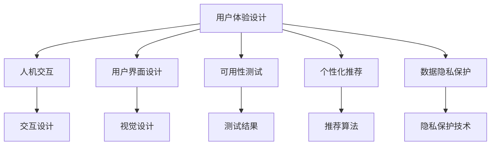

                 

# 知识付费创业中的用户体验设计

## 1. 背景介绍

### 1.1 问题由来

随着知识付费市场的快速发展，越来越多的用户开始愿意为高质量内容付费。然而，知识付费平台的用户体验设计常常被认为是制约平台发展的重要因素之一。良好的用户体验不仅能够提升用户满意度，还能增加用户黏性，提高平台的留存率和转化率。因此，如何在知识付费创业中设计出优秀的用户体验，成为各大平台关注的焦点。

### 1.2 问题核心关键点

用户体验设计的核心在于从用户角度出发，设计出符合用户心理和行为习惯的界面和流程，使用户能够轻松、愉悦地获取和消费内容。在知识付费领域，用户体验设计需要特别关注以下关键点：

- **内容呈现**：如何高效、美观地展示内容，使用户能够快速找到感兴趣的内容。
- **交互设计**：如何设计简洁、直观的交互方式，使用户能够方便地进行内容选择、购买、学习等操作。
- **个性化推荐**：如何利用算法推荐系统，精准推送用户感兴趣的内容。
- **用户反馈**：如何收集和分析用户反馈，不断优化用户体验。
- **界面适配**：如何确保平台界面在不同设备和系统上均能良好展示。
- **数据隐私**：如何在保证用户数据隐私的前提下，收集和使用数据优化推荐和体验。

### 1.3 问题研究意义

优秀的用户体验设计不仅能提升用户满意度和忠诚度，还能增加平台收益。通过良好的用户体验设计，知识付费平台可以吸引更多用户付费，增加平台收入，同时还能提高用户的学习效率和平台内容的利用率。良好的用户体验设计还能促进内容的创新和丰富，吸引更多优质内容创作者入驻，形成良性循环。

## 2. 核心概念与联系

### 2.1 核心概念概述

为了更好地理解知识付费创业中的用户体验设计，本节将介绍几个密切相关的核心概念：

- **用户体验设计（User Experience Design, UX）**：以用户为中心，通过综合考虑用户需求、心理、行为等因素，设计出满足用户期望的交互和视觉体验。
- **人机交互（Human-Computer Interaction, HCI）**：研究如何让计算机更好地理解、响应用户的输入，以提升用户体验。
- **用户界面设计（User Interface Design, UI）**：关注界面的视觉和交互设计，以直观、美观的方式呈现信息，提升用户的视觉体验。
- **可用性测试（Usability Testing）**：通过测试用户对界面的操作过程和感受，评估界面设计的可用性，并提出改进建议。
- **个性化推荐**：基于用户的历史行为和偏好，推荐用户感兴趣的内容，提升用户满意度。
- **数据隐私保护**：确保用户在数据收集和使用过程中的隐私权益，建立用户信任。

这些概念之间的逻辑关系可以通过以下Mermaid流程图来展示：



这个流程图展示了几大核心概念及其之间的关系：

1. **用户体验设计**是整个设计过程的中心，关注用户需求和心理。
2. **人机交互**专注于用户与计算机的交互方式，提高交互效率。
3. **用户界面设计**关注界面的视觉和交互设计，提升视觉体验。
4. **可用性测试**通过测试评估界面设计的可用性，不断优化设计。
5. **个性化推荐**基于用户行为，推荐感兴趣内容，提升用户满意度。
6. **数据隐私保护**确保用户数据隐私，建立用户信任。

这些概念共同构成了知识付费创业中用户体验设计的框架，指导平台设计和优化用户体验。

## 3. 核心算法原理 & 具体操作步骤
### 3.1 算法原理概述

在知识付费平台中，用户体验设计通常依赖于以下几个核心算法和流程：

- **内容推荐算法**：基于用户历史行为和内容属性，推荐用户感兴趣的内容。
- **搜索算法**：帮助用户快速找到所需内容。
- **个性化设置**：根据用户偏好，调整内容呈现方式和界面设计。
- **反馈收集与分析**：通过用户反馈，持续优化平台功能和界面设计。

这些算法和流程共同作用，使用户能够便捷、高效地获取和消费知识内容，提升用户体验。

### 3.2 算法步骤详解

以下是一个典型的知识付费平台用户体验设计流程：

1. **需求分析**：通过用户调研和数据收集，分析用户需求和行为模式，确定平台功能和设计目标。
2. **原型设计**：设计平台原型，包括界面布局、交互方式等，确保设计符合用户期望。
3. **用户测试**：通过可用性测试和用户反馈，评估原型设计的可用性和易用性，提出改进建议。
4. **开发实现**：根据原型设计和用户测试反馈，开发实现平台功能。
5. **A/B测试**：对不同设计方案进行A/B测试，选择最优方案。
6. **持续优化**：根据用户反馈和平台数据，不断优化界面设计和算法模型。

### 3.3 算法优缺点

知识付费平台的用户体验设计主要优点包括：

- **提高用户满意度**：通过个性化推荐和直观的界面设计，使用户能够快速找到感兴趣的内容，提升用户满意度。
- **增加用户黏性**：良好的用户体验设计能够吸引用户长期使用平台，增加用户黏性。
- **提高平台收益**：优秀的用户体验设计能够提高用户转化率和留存率，增加平台收益。

缺点主要在于：

- **数据隐私问题**：在个性化推荐和数据收集过程中，可能会涉及用户隐私问题，需要谨慎处理。
- **设计和开发成本高**：用户体验设计涉及大量用户调研和设计工作，开发实现也需要耗费大量时间和资源。
- **持续优化困难**：用户需求和行为模式随时间变化，持续优化设计是一个长期且复杂的过程。

### 3.4 算法应用领域

知识付费平台的用户体验设计主要应用于以下几个领域：

- **课程推荐系统**：基于用户历史学习行为，推荐感兴趣课程。
- **学习路径设计**：根据用户需求和学习进度，设计个性化学习路径。
- **界面适配**：确保平台界面在不同设备和系统上均能良好展示。
- **在线客服系统**：提供实时客服支持，解答用户问题，提升用户体验。

## 4. 数学模型和公式 & 详细讲解 & 举例说明

### 4.1 数学模型构建

在知识付费平台中，用户体验设计通常依赖于以下几个数学模型：

- **协同过滤推荐模型**：通过分析用户和内容之间的交互历史，推荐用户感兴趣的内容。
- **基于内容的推荐模型**：根据内容的属性特征，推荐相关内容。
- **聚类算法**：将用户划分为不同群体，根据群体特征进行推荐。
- **强化学习模型**：通过与用户交互，不断优化推荐算法。

这些模型通过数学公式计算，实现用户与内容的匹配。

### 4.2 公式推导过程

以协同过滤推荐模型为例，推导推荐算法的基本公式：

$$
\hat{y}_{i,j} = \frac{e^{\left(\theta_0 + \theta_j^T \phi_i\right)}}{1 + \sum_{k=1}^{n} e^{\left(\theta_0 + \theta_k^T \phi_i\right)}}
$$

其中，$\hat{y}_{i,j}$表示用户$i$对内容$j$的评分预测，$\theta$为模型参数，$\phi_i$为用户$i$的特征向量，$e$为自然对数。

通过公式，协同过滤推荐模型计算用户对每个内容的评分预测，选择预测值最高的内容作为推荐内容。

### 4.3 案例分析与讲解

以下是一个具体的推荐案例：

1. **用户画像建立**：通过用户历史行为和属性数据，建立用户画像，描述用户兴趣和偏好。
2. **相似度计算**：计算用户$i$与内容$j$的相似度，选择相似度高的内容进行推荐。
3. **评分预测**：根据用户画像和相似度计算结果，预测用户对内容的评分。
4. **推荐排序**：选择评分预测值最高的内容，进行排序推荐。

通过协同过滤推荐算法，知识付费平台能够精准推荐用户感兴趣的内容，提升用户体验。

## 5. 项目实践：代码实例和详细解释说明

### 5.1 开发环境搭建

以下是知识付费平台用户体验设计的开发环境搭建流程：

1. **安装开发工具**：安装Python、Node.js、MySQL等开发工具。
2. **创建项目目录**：创建项目目录，包含前端和后端代码。
3. **设置开发环境**：配置开发环境，包括数据库、缓存、日志等。
4. **版本控制**：使用Git进行版本控制，记录开发进程。
5. **环境部署**：在本地测试通过后，将代码部署到生产环境。

### 5.2 源代码详细实现

以下是一个基于Python的协同过滤推荐系统的代码实现：

```python
import numpy as np
from sklearn.metrics.pairwise import cosine_similarity

class CollaborativeFiltering:
    def __init__(self, data, users, items):
        self.data = data
        self.users = users
        self.items = items
        self.similarity_matrix = None

    def fit(self):
        # 计算用户和内容之间的相似度
        self.similarity_matrix = cosine_similarity(self.users, self.items)

    def predict(self, user, item):
        # 获取用户和内容之间的相似度
        user_index = self.users.index(user)
        item_index = self.items.index(item)
        similarity = self.similarity_matrix[user_index][item_index]
        # 获取用户历史行为
        user_behaviors = self.data[user]
        # 计算预测评分
        prediction = np.average(user_behaviors)
        # 计算预测评分的权重
        weight = similarity * prediction
        return weight
```

### 5.3 代码解读与分析

以下是代码中几个关键部分的详细解读：

- **类定义**：定义了一个协同过滤推荐系统类，包含初始化方法、拟合方法和预测方法。
- **拟合方法**：计算用户和内容之间的相似度矩阵。
- **预测方法**：根据用户和内容的相似度，预测用户对内容的评分。

### 5.4 运行结果展示

以下是协同过滤推荐系统的运行结果展示：

1. **数据准备**：准备用户和内容的数据，例如用户ID、内容ID、用户对内容的评分等。
2. **拟合模型**：对用户和内容数据进行拟合，计算相似度矩阵。
3. **预测评分**：使用预测方法计算用户对内容的评分。
4. **推荐内容**：选择预测评分最高的内容进行推荐。

通过协同过滤推荐算法，知识付费平台能够精准推荐用户感兴趣的内容，提升用户体验。

## 6. 实际应用场景

### 6.1 智能问答系统

在智能问答系统中，用户体验设计需要考虑以下几个方面：

- **问题分类**：将用户问题分类，选择合适的回答模板。
- **答案排序**：根据回答的匹配度，对答案进行排序。
- **互动设计**：设计简洁的互动方式，让用户能够方便地提问和反馈。

通过这些设计，智能问答系统能够更好地满足用户需求，提高用户满意度。

### 6.2 在线学习平台

在线学习平台的用户体验设计需要考虑以下几个方面：

- **课程推荐**：基于用户学习历史和偏好，推荐相关课程。
- **学习路径设计**：根据用户学习进度，设计个性化学习路径。
- **学习效果评估**：通过测试和反馈，评估用户学习效果，提供个性化建议。

通过这些设计，在线学习平台能够提高用户学习效率，提升用户满意度。

### 6.3 在线阅读平台

在线阅读平台的用户体验设计需要考虑以下几个方面：

- **内容推荐**：根据用户阅读历史，推荐相关文章和书籍。
- **阅读体验优化**：优化文章排版和阅读界面，提升阅读体验。
- **用户互动**：设计简洁的互动方式，让用户能够方便地评论和分享。

通过这些设计，在线阅读平台能够更好地满足用户阅读需求，提升用户满意度。

### 6.4 未来应用展望

随着人工智能技术的发展，知识付费平台的用户体验设计将呈现以下几个趋势：

1. **智能推荐**：利用深度学习和大数据技术，提升推荐算法精度，精准推送用户感兴趣的内容。
2. **个性化设置**：根据用户需求和行为，个性化调整界面和功能。
3. **多模态交互**：融合文本、图像、音频等多种模态，提升用户体验。
4. **社交功能**：增加社交功能，让用户能够分享和互动，增强平台黏性。
5. **跨平台适配**：确保平台界面和功能在不同设备和系统上均能良好展示。
6. **数据隐私保护**：加强数据隐私保护，建立用户信任。

## 7. 工具和资源推荐

### 7.1 学习资源推荐

为了帮助开发者系统掌握知识付费平台的用户体验设计，这里推荐一些优质的学习资源：

1. **《用户体验设计实战》书籍**：系统介绍了用户体验设计的原理和实践方法，结合大量案例，帮助开发者提升设计能力。
2. **《人机交互基础》课程**：介绍了人机交互的基本理论和设计原则，帮助开发者设计高效的用户界面。
3. **《数据科学导论》课程**：介绍了数据收集、分析和可视化的基本方法，帮助开发者更好地利用数据优化用户体验。
4. **《个性化推荐系统》课程**：介绍了个性化推荐算法的基本原理和实现方法，帮助开发者构建精准的推荐系统。
5. **《数据隐私保护》课程**：介绍了数据隐私保护的基本理论和实践方法，帮助开发者保护用户隐私。

通过对这些资源的学习实践，相信你一定能够快速掌握知识付费平台的用户体验设计技巧，提升设计能力。

### 7.2 开发工具推荐

高效的开发离不开优秀的工具支持。以下是几款用于知识付费平台开发的常用工具：

1. **Adobe XD**：一款强大的设计工具，支持界面设计和原型制作，适合用户体验设计。
2. **Sketch**：另一款流行的界面设计工具，支持快速原型设计和协作。
3. **Axure**：一款专业的原型设计工具，支持交互设计和动画效果。
4. **Prototyping.io**：在线原型设计工具，支持云端协作和实时预览。
5. **JIRA**：项目管理工具，支持需求跟踪和任务管理。
6. **Slack**：团队协作工具，支持即时通信和任务分配。

合理利用这些工具，可以显著提升知识付费平台的用户体验设计效率，加快创新迭代的步伐。

### 7.3 相关论文推荐

知识付费平台的用户体验设计涉及大量技术和理论研究，以下是几篇奠基性的相关论文，推荐阅读：

1. **《设计心理学》书籍**：系统介绍了设计心理学的基本理论和实践方法，帮助开发者理解用户行为。
2. **《人机交互设计基础》论文**：介绍了人机交互的基本理论和设计原则，帮助开发者设计高效的用户界面。
3. **《推荐系统基础》论文**：介绍了推荐系统基本原理和实现方法，帮助开发者构建精准的推荐系统。
4. **《个性化推荐系统》书籍**：介绍了个性化推荐算法的基本原理和实现方法，帮助开发者构建精准的推荐系统。
5. **《数据隐私保护》论文**：介绍了数据隐私保护的基本理论和实践方法，帮助开发者保护用户隐私。

这些论文代表了大数据和人工智能技术在知识付费平台中的应用，通过学习这些前沿成果，可以帮助开发者深入理解用户体验设计的方法和实践。

## 8. 总结：未来发展趋势与挑战

### 8.1 总结

本文对知识付费创业中的用户体验设计进行了全面系统的介绍。首先阐述了用户体验设计的背景和意义，明确了用户体验设计在知识付费创业中的重要地位。其次，从原理到实践，详细讲解了用户体验设计的数学模型和实现流程，给出了用户体验设计的完整代码实例。同时，本文还广泛探讨了用户体验设计在智能问答、在线学习、在线阅读等多个领域的应用前景，展示了用户体验设计在知识付费领域的巨大潜力。

通过本文的系统梳理，可以看到，用户体验设计在知识付费创业中发挥了至关重要的作用，极大地提升了平台的商业价值和用户满意度。未来，伴随人工智能技术和设计的不断进步，用户体验设计必将在知识付费领域发挥更大的作用，推动知识付费产业的持续创新和进步。

### 8.2 未来发展趋势

展望未来，知识付费平台的用户体验设计将呈现以下几个发展趋势：

1. **智能化设计**：通过人工智能技术，实现智能推荐和个性化设置，提升用户体验。
2. **多模态设计**：融合文本、图像、音频等多种模态，提升用户体验。
3. **社交化设计**：增加社交功能，增强用户互动和平台黏性。
4. **跨平台设计**：确保平台界面和功能在不同设备和系统上均能良好展示。
5. **数据隐私设计**：加强数据隐私保护，建立用户信任。

这些趋势凸显了用户体验设计的广阔前景。这些方向的探索发展，必将进一步提升用户体验设计的精准性和多样性，为知识付费平台带来更多的商业价值和用户满意度。

### 8.3 面临的挑战

尽管知识付费平台的用户体验设计已经取得了一定的成果，但在迈向更加智能化、普适化应用的过程中，它仍面临着诸多挑战：

1. **数据隐私问题**：在个性化推荐和数据收集过程中，可能会涉及用户隐私问题，需要谨慎处理。
2. **设计和开发成本高**：用户体验设计涉及大量用户调研和设计工作，开发实现也需要耗费大量时间和资源。
3. **持续优化困难**：用户需求和行为模式随时间变化，持续优化设计是一个长期且复杂的过程。
4. **界面适配复杂**：不同设备和系统上的界面适配需要复杂的实现和测试。
5. **用户反馈收集困难**：在多用户、多平台的环境中，收集和分析用户反馈存在挑战。

### 8.4 研究展望

面对用户体验设计面临的挑战，未来的研究需要在以下几个方面寻求新的突破：

1. **无监督和半监督设计**：摆脱对大量标注数据的依赖，利用自监督学习、主动学习等无监督和半监督范式，最大限度利用非结构化数据，实现更加灵活高效的用户体验设计。
2. **多模态设计**：融合文本、图像、音频等多种模态，提升用户体验。
3. **智能设计**：利用深度学习和大数据技术，实现智能推荐和个性化设置，提升用户体验。
4. **跨平台设计**：确保平台界面和功能在不同设备和系统上均能良好展示。
5. **数据隐私保护**：加强数据隐私保护，建立用户信任。

这些研究方向的探索，必将引领用户体验设计技术迈向更高的台阶，为知识付费平台带来更多的商业价值和用户满意度。面向未来，用户体验设计需要与其他人工智能技术进行更深入的融合，如知识表示、因果推理、强化学习等，多路径协同发力，共同推动知识付费平台的用户体验设计进步。

## 9. 附录：常见问题与解答

**Q1：用户体验设计在知识付费平台中扮演什么角色？**

A: 用户体验设计在知识付费平台中扮演着至关重要的角色。良好的用户体验设计不仅能提升用户满意度，还能增加用户黏性，提高平台的留存率和转化率。通过良好的用户体验设计，知识付费平台可以吸引更多用户付费，增加平台收益，同时还能提高用户的学习效率和平台内容的利用率。

**Q2：如何设计知识付费平台的个性化推荐系统？**

A: 设计知识付费平台的个性化推荐系统主要包括以下步骤：

1. 数据收集：收集用户的历史行为和内容属性数据。
2. 数据预处理：对数据进行清洗、特征提取等预处理操作。
3. 推荐算法选择：选择适合的推荐算法，如协同过滤、基于内容的推荐、深度学习等。
4. 模型训练：使用历史数据训练推荐模型。
5. 模型评估：使用测试数据评估推荐模型效果。
6. 模型优化：根据评估结果优化推荐模型。
7. 推荐实现：将训练好的推荐模型部署到平台中，实现个性化推荐功能。

**Q3：如何进行知识付费平台的用户体验测试？**

A: 知识付费平台的用户体验测试主要包括以下步骤：

1. 设计测试方案：根据用户体验设计目标，设计测试方案，包括测试场景、测试指标等。
2. 招募测试用户：招募具有代表性的用户进行测试。
3. 进行可用性测试：让用户使用平台，观察和记录其使用过程和反馈。
4. 收集测试结果：记录用户的反馈和操作行为。
5. 分析测试结果：分析测试结果，找出用户体验中的问题。
6. 提出改进建议：根据测试结果，提出改进用户体验的方案。
7. 实施改进措施：将改进方案落实到平台中，进行效果评估。

**Q4：如何保护用户数据隐私？**

A: 保护用户数据隐私主要包括以下几个方面：

1. 数据收集：明确告知用户数据收集目的和使用范围，得到用户同意。
2. 数据存储：采用加密技术，保护数据在存储过程中的安全。
3. 数据传输：使用安全传输协议，防止数据在传输过程中被截获或篡改。
4. 数据使用：仅在必要情况下使用用户数据，不滥用数据。
5. 用户权利：提供用户数据删除、修改等权利，保护用户隐私。
6. 安全审计：定期进行安全审计，发现并修复潜在的安全漏洞。

通过这些措施，可以有效保护用户数据隐私，建立用户信任。

---

作者：禅与计算机程序设计艺术 / Zen and the Art of Computer Programming

