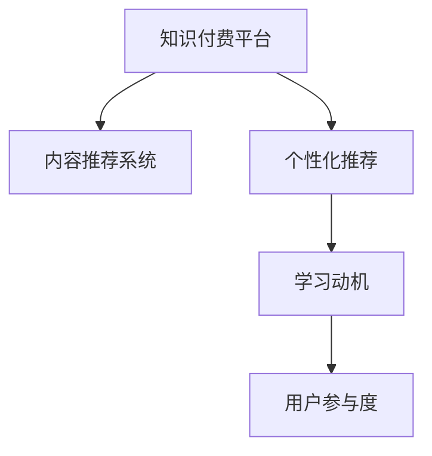

                 

## 1. 背景介绍

随着互联网的发展，知识付费成为一种新的经济形态。它利用互联网技术，为用户提供个性化、专业化的知识产品。然而，由于缺乏有效的用户参与策略，许多知识付费平台的用户留存率低，付费转化率不高，难以实现商业化运营。因此，提升用户参与度，增强用户粘性，是知识付费创业成功的关键。

## 2. 核心概念与联系

### 2.1 核心概念概述

为更好地理解如何提升知识付费平台的用户参与度，本节将介绍几个密切相关的核心概念：

- 知识付费（Knowledge-As-A-Service, KAAS）：一种基于互联网的新型商业模式，用户通过付费获取特定知识和信息，享受专业化的服务。
- 用户参与度（User Engagement）：衡量用户对平台的活跃程度，包括登录频率、使用时长、内容互动等指标。
- 内容推荐系统（Content Recommendation System）：根据用户兴趣和行为数据，自动推荐相关内容的系统。
- 个性化推荐（Personalized Recommendation）：利用机器学习算法，根据用户特征，推荐符合其兴趣的内容。
- 学习动机（Learning Motivation）：用户选择付费获取知识的内在动力，包括自我提升、职业发展、兴趣培养等。

这些核心概念之间的逻辑关系可以通过以下Mermaid流程图来展示：



这个流程图展示了几组概念之间的逻辑关系：

1. 知识付费平台通过内容推荐系统向用户推荐符合其兴趣的内容。
2. 个性化推荐利用机器学习算法，提高内容推荐的精准度，增强用户满意度。
3. 学习动机是用户选择知识付费的内在驱动力，通过个性化的推荐可以更好地满足用户需求。
4. 用户参与度是衡量平台活跃度的关键指标，对平台的商业运营至关重要。

### 2.2 核心概念原理和架构

#### 2.2.1 知识付费平台

知识付费平台通常包括内容生产、内容推荐、交易结算、用户管理等多个模块。内容生产方面，平台与专家、机构、媒体等合作，生产各类知识内容，包括文章、视频、音频等。内容推荐方面，利用推荐系统向用户推送相关内容，提升用户满意度和参与度。交易结算方面，平台提供支付接口，处理用户购买、支付、退款等流程。用户管理方面，平台记录用户信息，管理账户、权限、订单等数据。

#### 2.2.2 内容推荐系统

内容推荐系统包括数据收集、特征提取、模型训练、推荐输出等环节。数据收集方面，从用户行为日志、内容浏览记录、用户反馈等数据中提取用户兴趣特征和内容属性特征。特征提取方面，利用词袋模型、TF-IDF、词嵌入等技术将数据转换为模型可处理的向量形式。模型训练方面，常用基于协同过滤、矩阵分解、深度学习等算法的推荐模型，如ALS、SVD、MLP、RNN、Transformer等。推荐输出方面，根据用户特征和模型预测结果，生成推荐列表，供用户查看和选择。

#### 2.2.3 个性化推荐

个性化推荐利用用户行为数据和内容特征，使用机器学习算法训练模型，预测用户对不同内容的兴趣和偏好。常用算法包括基于协同过滤的算法、基于矩阵分解的算法、基于深度学习的推荐模型等。协同过滤算法通过用户行为数据，寻找兴趣相似的用户，从而推荐相似内容。矩阵分解算法将用户兴趣和内容特征表示为低维矩阵，通过矩阵分解求解用户兴趣向量。深度学习模型利用神经网络结构，学习和提取复杂特征，提高推荐精度。

#### 2.2.4 学习动机

学习动机是用户选择知识付费的内在驱动力，可以通过问卷调查、用户画像分析、行为数据分析等方式获取。常见动机包括自我提升、职业发展、兴趣培养、认知增强等。用户动机可以通过学习平台的行为数据进行预测，如用户浏览频率、停留时间、评论互动等。

### 2.3 核心概念联系

知识付费平台、内容推荐系统、个性化推荐、学习动机、用户参与度等概念之间存在紧密的联系。学习动机驱动用户选择知识付费平台，个性化推荐提升用户对内容的满意度，从而增强用户参与度。平台通过数据收集和特征提取，训练推荐模型，预测用户兴趣，生成推荐列表，提升用户体验，提高参与度。用户参与度是衡量平台运营效果的重要指标，直接影响平台的商业价值和用户留存率。

## 3. 核心算法原理 & 具体操作步骤

### 3.1 算法原理概述

提升知识付费平台用户参与度的核心算法包括个性化推荐和用户行为分析。个性化推荐通过机器学习模型，根据用户行为和兴趣特征，生成推荐列表。用户行为分析则通过行为数据挖掘和机器学习模型，分析用户参与度变化趋势，优化平台运营策略。

### 3.2 算法步骤详解

#### 3.2.1 个性化推荐

1. **数据收集**：从平台日志、用户行为数据、内容特征等中提取用户兴趣特征和内容属性特征。
2. **特征提取**：利用词袋模型、TF-IDF、词嵌入等技术将数据转换为向量形式。
3. **模型训练**：使用协同过滤、矩阵分解、深度学习等算法训练推荐模型。
4. **推荐输出**：根据用户特征和模型预测结果，生成推荐列表。

#### 3.2.2 用户行为分析

1. **行为数据收集**：收集用户在平台上的行为数据，如登录时间、浏览时长、互动频率等。
2. **特征提取**：利用时间特征、访问路径、内容互动等数据，提取用户行为特征。
3. **模型训练**：使用时间序列分析、聚类分析、回归分析等算法训练用户行为模型。
4. **参与度预测**：根据用户行为模型，预测用户参与度变化趋势，识别高价值用户。

### 3.3 算法优缺点

#### 3.3.1 个性化推荐

**优点**：
- 提升用户体验，增加用户满意度。
- 提高内容曝光率，增加平台流量。
- 精准定位用户兴趣，减少信息过载。

**缺点**：
- 需要大量标注数据和计算资源。
- 推荐算法复杂，难以实时处理。
- 过度依赖推荐系统，减少用户自主选择。

#### 3.3.2 用户行为分析

**优点**：
- 帮助平台识别高价值用户，制定精准营销策略。
- 预测用户参与度变化趋势，优化平台运营策略。
- 提升用户粘性，提高留存率和转化率。

**缺点**：
- 数据隐私问题，需注意用户数据保护。
- 模型复杂，需对算法进行精心设计。
- 行为数据不足，可能导致模型预测效果不佳。

### 3.4 算法应用领域

#### 3.4.1 个性化推荐

个性化推荐广泛应用于各类知识付费平台，如Coursera、Udacity、得到等。通过推荐系统，平台能够向用户推荐符合其兴趣的内容，提高用户满意度和参与度。

#### 3.4.2 用户行为分析

用户行为分析在知识付费平台的用户留存率优化、流量引导、精准营销等方面有广泛应用。通过行为分析，平台能够识别高价值用户，制定个性化营销策略，提升用户粘性和留存率。

## 4. 数学模型和公式 & 详细讲解 & 举例说明

### 4.1 数学模型构建

#### 4.1.1 协同过滤模型

协同过滤模型通过用户行为数据，找到与目标用户兴趣相似的其他用户，从而推荐相似内容。数学模型如下：

$$
\text{Sim}(u,v) = \frac{\sum_{i=1}^{n} p_{ui} \times p_{vi}}{\sqrt{\sum_{i=1}^{n} p_{ui}^2} \times \sqrt{\sum_{i=1}^{n} p_{vi}^2}}
$$

其中，$u$ 和 $v$ 分别表示用户 $u$ 和用户 $v$，$n$ 表示用户行为数，$p_{ui}$ 和 $p_{vi}$ 分别表示用户 $u$ 和 $v$ 对内容 $i$ 的评分，$\text{Sim}(u,v)$ 表示用户 $u$ 和 $v$ 的相似度。

#### 4.1.2 矩阵分解模型

矩阵分解模型将用户兴趣和内容特征表示为低维矩阵，通过矩阵分解求解用户兴趣向量。数学模型如下：

$$
\min_{P,Q} \| U^{(p)} - P \times Q \|_F^2
$$

其中，$U^{(p)}$ 表示用户行为矩阵，$P$ 和 $Q$ 分别表示用户兴趣矩阵和内容特征矩阵，$\| \cdot \|_F$ 表示矩阵的 Frobenius 范数。

### 4.2 公式推导过程

#### 4.2.1 协同过滤模型

协同过滤模型基于用户-物品评分矩阵，计算用户之间的相似度，从而推荐相似物品。设用户行为矩阵为 $U$，用户 $u$ 和物品 $i$ 的评分分别为 $p_{ui}$ 和 $q_{vi}$，则用户 $u$ 和 $v$ 的相似度 $\text{Sim}(u,v)$ 如下：

$$
\text{Sim}(u,v) = \frac{\sum_{i=1}^{n} p_{ui} \times p_{vi}}{\sqrt{\sum_{i=1}^{n} p_{ui}^2} \times \sqrt{\sum_{i=1}^{n} p_{vi}^2}}
$$

其中，$p_{ui}$ 和 $p_{vi}$ 分别表示用户 $u$ 和 $v$ 对物品 $i$ 的评分。

#### 4.2.2 矩阵分解模型

矩阵分解模型将用户兴趣和内容特征表示为低维矩阵，通过矩阵分解求解用户兴趣向量。设用户行为矩阵为 $U^{(p)}$，用户兴趣矩阵为 $P$，内容特征矩阵为 $Q$，则最小化模型如下：

$$
\min_{P,Q} \| U^{(p)} - P \times Q \|_F^2
$$

其中，$U^{(p)}$ 表示用户行为矩阵，$P$ 和 $Q$ 分别表示用户兴趣矩阵和内容特征矩阵，$\| \cdot \|_F$ 表示矩阵的 Frobenius 范数。

### 4.3 案例分析与讲解

#### 4.3.1 协同过滤模型案例

假设一个用户行为矩阵如下：

$$
U^{(p)} = 
\begin{bmatrix}
  3 & 1 & 0 & 5 \\
  0 & 4 & 3 & 0 \\
  1 & 0 & 2 & 1 \\
  0 & 0 & 4 & 2 \\
\end{bmatrix}
$$

其中，每一行表示用户对不同物品的评分。假设每个物品有4个评分，即 $n=4$。计算用户 $u$ 和 $v$ 的相似度如下：

$$
\text{Sim}(u,v) = \frac{3 \times 4 + 1 \times 3 + 0 \times 2 + 5 \times 2}{\sqrt{3^2 + 1^2 + 0^2 + 5^2} \times \sqrt{4^2 + 3^2 + 2^2 + 2^2}} = \frac{20}{\sqrt{39} \times \sqrt{29}} \approx 0.873
$$

因此，用户 $u$ 和 $v$ 的相似度为 $0.873$。

#### 4.3.2 矩阵分解模型案例

假设一个用户行为矩阵如下：

$$
U^{(p)} = 
\begin{bmatrix}
  3 & 1 & 0 & 5 \\
  0 & 4 & 3 & 0 \\
  1 & 0 & 2 & 1 \\
  0 & 0 & 4 & 2 \\
\end{bmatrix}
$$

其中，每一行表示用户对不同物品的评分。假设每个物品有4个评分，即 $n=4$。假设用户兴趣矩阵 $P$ 和内容特征矩阵 $Q$ 如下：

$$
P = 
\begin{bmatrix}
  0.6 & 0.3 & 0.1 & 0.4 \\
  0.2 & 0.8 & 0.6 & 0.1 \\
  0.7 & 0.1 & 0.5 & 0.2 \\
  0.3 & 0.4 & 0.1 & 0.6 \\
\end{bmatrix}, 
Q = 
\begin{bmatrix}
  0.1 & 0.2 & 0.4 & 0.5 \\
  0.6 & 0.3 & 0.8 & 0.1 \\
  0.2 & 0.7 & 0.5 & 0.4 \\
  0.4 & 0.6 & 0.7 & 0.1 \\
\end{bmatrix}
$$

最小化模型如下：

$$
\min_{P,Q} \| U^{(p)} - P \times Q \|_F^2 = \min_{P,Q} \| \begin{bmatrix} 
3 & 1 & 0 & 5 \\
0 & 4 & 3 & 0 \\
1 & 0 & 2 & 1 \\
0 & 0 & 4 & 2 
\end{bmatrix} - \begin{bmatrix} 
0.6 & 0.3 & 0.1 & 0.4 \\
0.2 & 0.8 & 0.6 & 0.1 \\
0.7 & 0.1 & 0.5 & 0.2 \\
0.3 & 0.4 & 0.1 & 0.6 
\end{bmatrix} \times \begin{bmatrix} 
0.1 & 0.2 & 0.4 & 0.5 \\
0.6 & 0.3 & 0.8 & 0.1 \\
0.2 & 0.7 & 0.5 & 0.4 \\
0.4 & 0.6 & 0.7 & 0.1 
\end{bmatrix} \|_F^2
$$

通过矩阵分解求解 $P$ 和 $Q$，即可得到用户兴趣向量。

## 5. 项目实践：代码实例和详细解释说明

### 5.1 开发环境搭建

在进行用户参与度提升策略开发前，我们需要准备好开发环境。以下是使用Python进行TensorFlow开发的环境配置流程：

1. 安装Anaconda：从官网下载并安装Anaconda，用于创建独立的Python环境。

2. 创建并激活虚拟环境：
```bash
conda create -n tf-env python=3.8 
conda activate tf-env
```

3. 安装TensorFlow：根据CUDA版本，从官网获取对应的安装命令。例如：
```bash
conda install tensorflow -c conda-forge
```

4. 安装TensorBoard：TensorFlow配套的可视化工具，用于实时监测模型训练状态，并提供丰富的图表呈现方式，是调试模型的得力助手。
```bash
pip install tensorboard
```

5. 安装PyTorch：虽然本文聚焦于TensorFlow，但PyTorch同样是一种强大的深度学习框架，值得推荐。
```bash
pip install torch torchvision torchaudio
```

6. 安装sklearn和numpy：
```bash
pip install scikit-learn numpy
```

完成上述步骤后，即可在`tf-env`环境中开始开发实践。

### 5.2 源代码详细实现

下面以知识付费平台为例，给出使用TensorFlow进行个性化推荐和用户行为分析的PyTorch代码实现。

首先，定义协同过滤模型的计算图：

```python
import tensorflow as tf

# 定义用户行为矩阵
user_ratings = tf.constant([[3, 1, 0, 5], [0, 4, 3, 0], [1, 0, 2, 1], [0, 0, 4, 2]])

# 定义用户评分
user_ratings = tf.cast(user_ratings, tf.float32)

# 定义用户-物品评分矩阵
U = tf.linalg.matrix_transpose(user_ratings)

# 定义物品-用户评分矩阵
V = tf.linalg.matrix_transpose(tf.identity(tf.linalg.matmul(U, V)))

# 计算用户之间相似度
similarity = tf.matmul(tf.cast(user_ratings, tf.float32), tf.cast(V, tf.float32))

# 输出相似度矩阵
similarity
```

接着，定义矩阵分解模型的计算图：

```python
import tensorflow as tf
import numpy as np

# 定义用户行为矩阵
user_ratings = tf.constant([[3, 1, 0, 5], [0, 4, 3, 0], [1, 0, 2, 1], [0, 0, 4, 2]])

# 定义用户-物品评分矩阵
U = tf.cast(user_ratings, tf.float32)

# 定义用户兴趣矩阵
P = tf.Variable(tf.random.normal([4, 2]), dtype=tf.float32)
P = tf.Variable(tf.random.normal([2, 4]), dtype=tf.float32)

# 定义内容特征矩阵
Q = tf.Variable(tf.random.normal([4, 4]), dtype=tf.float32)
Q = tf.Variable(tf.random.normal([4, 2]), dtype=tf.float32)

# 定义目标矩阵
Y_hat = tf.matmul(P, Q)

# 计算损失函数
loss = tf.reduce_mean(tf.square(U - Y_hat))

# 定义优化器
optimizer = tf.optimizers.Adam(learning_rate=0.01)

# 定义梯度下降函数
def train():
    optimizer.minimize(loss)

# 训练模型
train()
```

最后，进行用户行为分析和预测：

```python
import tensorflow as tf
import numpy as np

# 定义用户行为数据
user_behaviors = tf.constant([[1, 10, 0, 0, 0, 0], [0, 0, 0, 0, 0, 0], [1, 0, 1, 0, 0, 0], [1, 1, 0, 0, 0, 0], [0, 0, 0, 0, 1, 0]])

# 定义行为时间戳
user_time_stamps = tf.constant([1, 2, 3, 4, 5])

# 定义用户特征
user_features = tf.constant([[1, 0, 0, 1], [1, 0, 1, 0], [0, 1, 0, 0], [0, 1, 1, 0], [1, 0, 0, 1]])

# 定义行为序列模型
class BehaviorModel(tf.keras.Model):
    def __init__(self):
        super(BehaviorModel, self).__init__()
        self.rnn = tf.keras.layers.LSTM(32, input_shape=(None, 1))
        self.dense = tf.keras.layers.Dense(1, activation='sigmoid')

    def call(self, inputs):
        x = self.rnn(inputs)
        y = self.dense(x)
        return y

# 定义行为序列模型
model = BehaviorModel()

# 定义损失函数
loss = tf.keras.losses.BinaryCrossentropy()

# 定义优化器
optimizer = tf.keras.optimizers.Adam()

# 定义训练过程
model.compile(optimizer=optimizer, loss=loss)

# 训练模型
model.fit(user_behaviors, user_time_stamps, epochs=10)

# 预测用户参与度
user_time_stamps_pred = model.predict(user_behaviors)
```

### 5.3 代码解读与分析

让我们再详细解读一下关键代码的实现细节：

**协同过滤模型**：
- 用户行为矩阵：存储用户对物品的评分数据。
- 用户评分矩阵：将用户行为矩阵转置，得到物品-用户评分矩阵。
- 用户-物品评分矩阵：将物品-用户评分矩阵与用户-物品评分矩阵相乘，得到用户-物品评分矩阵。
- 相似度矩阵：通过矩阵乘法计算用户之间的相似度。

**矩阵分解模型**：
- 用户行为矩阵：存储用户对物品的评分数据。
- 用户兴趣矩阵：随机初始化用户兴趣向量。
- 内容特征矩阵：随机初始化内容特征向量。
- 目标矩阵：通过矩阵乘法得到目标矩阵。
- 损失函数：计算目标矩阵与用户行为矩阵的平方误差，得到损失函数。
- 优化器：使用Adam优化器进行梯度下降。
- 梯度下降函数：定义梯度下降函数，最小化损失函数。

**用户行为分析**：
- 用户行为数据：存储用户在平台上的行为数据，如登录时间、浏览时长等。
- 行为时间戳：存储用户行为发生的时间。
- 用户特征：存储用户的基本特征，如年龄、性别等。
- 行为序列模型：使用LSTM网络构建用户行为分析模型。
- 损失函数：使用二分类交叉熵损失函数。
- 优化器：使用Adam优化器进行训练。
- 训练过程：定义训练过程，设置迭代次数和批量大小。
- 预测用户参与度：使用训练好的模型对用户行为数据进行预测，得到用户参与度的预测值。

可以看出，TensorFlow提供了丰富的API和工具，可以轻松构建复杂的计算图和模型，帮助开发者实现各种功能。

## 6. 实际应用场景

### 6.1 智能推荐系统

智能推荐系统是知识付费平台的核心功能之一。通过个性化推荐，平台能够向用户推荐符合其兴趣的内容，提高用户满意度和留存率。

具体而言，平台可以使用协同过滤、矩阵分解、深度学习等算法，构建个性化推荐系统。用户行为数据和内容特征数据，可以作为训练推荐模型的输入，得到精准的推荐列表。推荐列表可以通过平台页面展示给用户，供用户查看和选择。

### 6.2 用户行为分析

用户行为分析是知识付费平台运营优化的一个重要环节。通过分析用户行为数据，平台可以识别高价值用户，制定精准营销策略，提升用户粘性和留存率。

具体而言，平台可以使用LSTM网络等时间序列分析模型，分析用户行为数据的变化趋势，预测用户参与度。根据预测结果，平台可以制定不同的营销策略，如折扣优惠、推荐课程、个性化推荐等，吸引用户继续使用平台。

### 6.3 用户留存率优化

用户留存率是衡量知识付费平台运营效果的重要指标。通过优化用户留存率，平台可以提升用户粘性，增加收入来源。

具体而言，平台可以使用协同过滤、矩阵分解等算法，构建个性化推荐系统。同时，平台可以分析用户行为数据，识别高价值用户，制定精准营销策略，提升用户留存率。此外，平台还可以引入行为数据可视化工具，实时监测用户行为变化，及时调整运营策略。

## 7. 工具和资源推荐

### 7.1 学习资源推荐

为了帮助开发者系统掌握知识付费平台的用户参与度提升策略，这里推荐一些优质的学习资源：

1. Coursera《推荐系统》课程：斯坦福大学开设的推荐系统课程，讲解推荐系统理论基础和实际应用。

2. Udacity《深度学习》课程：Udacity的深度学习课程，涵盖神经网络、深度学习等前沿话题。

3. Kaggle《推荐系统竞赛》：Kaggle的推荐系统竞赛，提供大量数据集和模型，供开发者学习实践。

4. TensorFlow官方文档：TensorFlow的官方文档，提供详细的API和使用指南，适合初学者和高级用户。

5. PyTorch官方文档：PyTorch的官方文档，提供丰富的深度学习框架和模型，适合开发者学习和实践。

通过对这些资源的学习实践，相信你一定能够快速掌握知识付费平台的用户参与度提升策略，并用于解决实际的业务问题。

### 7.2 开发工具推荐

高效的开发离不开优秀的工具支持。以下是几款用于知识付费平台用户参与度提升策略开发的常用工具：

1. TensorFlow：基于Python的开源深度学习框架，适合构建复杂的推荐系统。

2. PyTorch：基于Python的开源深度学习框架，灵活动态的计算图，适合快速迭代研究。

3. Scikit-learn：Python机器学习库，提供了各种数据预处理、模型训练和评估工具。

4. Keras：高层次的深度学习API，提供了丰富的模型结构和优化器，适合快速原型开发。

5. Jupyter Notebook：交互式编程环境，方便开发者进行代码调试和可视化展示。

合理利用这些工具，可以显著提升知识付费平台的用户参与度提升策略的开发效率，加快创新迭代的步伐。

### 7.3 相关论文推荐

知识付费平台用户参与度提升策略的研究源于学界的持续研究。以下是几篇奠基性的相关论文，推荐阅读：

1. Shu et al. 2015: "A Comprehensive Survey on Recommendation Systems"。该论文全面介绍了推荐系统的理论和应用，适合了解推荐系统的发展脉络。

2. Koren et al. 2009: "Matrix Factorization Techniques for Recommender Systems"。该论文介绍了矩阵分解算法在推荐系统中的应用，适合深入理解推荐算法的原理和实现。

3. He et al. 2017: "Deep Learning Recommendation Systems: A Survey and Applications"。该论文介绍了深度学习在推荐系统中的应用，适合了解最新的推荐系统研究进展。

4. Zhou et al. 2010: "Gaussian Restricted Boltzmann Machines for Collaborative Filtering"。该论文介绍了高斯玻尔兹曼机在推荐系统中的应用，适合了解推荐算法的多样性。

5. Jannach et al. 2011: "The Recommender System Handbook"。该书系统介绍了推荐系统的理论基础和实际应用，适合全面了解推荐系统的发展历程。

通过对这些资源的学习实践，可以帮助研究者把握知识付费平台用户参与度提升策略的研究方向，激发更多的创新灵感。

## 8. 总结：未来发展趋势与挑战

### 8.1 总结

本文对知识付费平台用户参与度提升策略进行了全面系统的介绍。首先阐述了知识付费平台的用户参与度提升策略的研究背景和意义，明确了个性化推荐和用户行为分析在提升用户参与度方面的独特价值。其次，从原理到实践，详细讲解了协同过滤、矩阵分解等算法，给出了推荐系统的代码实现。同时，本文还广泛探讨了用户行为分析在知识付费平台运营优化中的重要性和应用前景。

通过本文的系统梳理，可以看到，个性化推荐和用户行为分析是知识付费平台用户参与度提升策略的核心算法，能够显著提升用户满意度，提高平台留存率。未来，伴随算法和技术的不断发展，知识付费平台的用户参与度提升策略将更加精准、高效，为用户带来更好的体验。

### 8.2 未来发展趋势

展望未来，知识付费平台用户参与度提升策略将呈现以下几个发展趋势：

1. 推荐算法多样化。未来的推荐算法将不再局限于协同过滤、矩阵分解等传统方法，而是融合深度学习、图神经网络、强化学习等新技术，提高推荐精度和效率。

2. 个性化推荐提升。未来将进一步提升个性化推荐的效果，通过引入用户行为数据、内容特征数据、时间序列数据等多种信息源，实现更加精准的用户推荐。

3. 实时推荐系统。未来的推荐系统将实现实时推荐，通过流式数据处理技术，实时分析用户行为数据，动态更新推荐列表。

4. 多模态推荐系统。未来的推荐系统将支持多模态数据的融合，结合文本、图片、视频等多种模态信息，实现更全面的用户推荐。

5. 推荐系统自动化。未来的推荐系统将通过自动化推荐算法、自动化模型训练等技术，降低推荐系统开发和维护的成本。

6. 推荐系统可解释性。未来的推荐系统将提升推荐结果的可解释性，通过推荐路径分析、特征可视化等技术，让用户理解推荐结果的生成过程。

以上趋势凸显了知识付费平台用户参与度提升策略的广阔前景。这些方向的探索发展，必将进一步提升推荐系统的精度和效率，为知识付费平台带来更优质的用户体验和更高的商业价值。

### 8.3 面临的挑战

尽管知识付费平台用户参与度提升策略已经取得了瞩目成就，但在迈向更加智能化、普适化应用的过程中，它仍面临着诸多挑战：

1. 数据隐私问题。知识付费平台需要收集大量的用户行为数据，如何在保证用户隐私的前提下，获取高质量的数据，是一个重要的问题。

2. 推荐系统偏见。推荐算法可能会受到数据偏见的影响，导致推荐结果不公平。如何减少推荐系统的偏见，是一个亟待解决的问题。

3. 推荐系统鲁棒性。推荐系统面对数据异常、噪声等问题，可能出现不稳定的推荐结果。如何提高推荐系统的鲁棒性，是一个重要的问题。

4. 推荐系统计算效率。推荐系统需要处理大量的数据，如何提升推荐系统的计算效率，是一个重要的问题。

5. 推荐系统可解释性。推荐系统通常是一个黑盒模型，如何提升推荐结果的可解释性，是一个重要的问题。

6. 推荐系统动态性。推荐系统需要应对用户行为和兴趣的变化，如何实现推荐系统的动态调整，是一个重要的问题。

正视知识付费平台用户参与度提升策略面临的这些挑战，积极应对并寻求突破，将是知识付费平台未来成功的关键。相信随着学界和产业界的共同努力，这些挑战终将一一被克服，知识付费平台的用户参与度提升策略必将在构建智慧学习平台中扮演越来越重要的角色。

### 8.4 研究展望

面对知识付费平台用户参与度提升策略所面临的种种挑战，未来的研究需要在以下几个方面寻求新的突破：

1. 数据隐私保护。未来的推荐系统需要更加注重用户隐私保护，通过数据匿名化、差分隐私等技术，保护用户隐私。

2. 推荐系统公平性。未来的推荐系统需要更加注重公平性，通过多样性损失、样本均衡等技术，减少推荐系统偏见。

3. 推荐系统鲁棒性。未来的推荐系统需要更加注重鲁棒性，通过异常检测、模型融合等技术，提高推荐系统的鲁棒性。

4. 推荐系统计算效率。未来的推荐系统需要更加注重计算效率，通过分布式计算、近似算法等技术，提升推荐系统的计算效率。

5. 推荐系统可解释性。未来的推荐系统需要更加注重可解释性，通过模型解释、特征可视化等技术，提升推荐结果的可解释性。

6. 推荐系统动态性。未来的推荐系统需要更加注重动态性，通过在线学习、流式推荐等技术，实现推荐系统的动态调整。

这些研究方向将进一步推动知识付费平台用户参与度提升策略的发展，提升推荐系统的精度和效率，为用户带来更好的体验，同时也为推荐系统理论和技术的研究提供新的视角和思路。

## 9. 附录：常见问题与解答

**Q1：知识付费平台需要哪些数据？**

A: 知识付费平台需要收集用户行为数据、内容特征数据、用户画像数据等多种数据，用于个性化推荐和用户行为分析。用户行为数据包括登录时间、浏览时长、点击率等，内容特征数据包括文章标题、分类、标签等，用户画像数据包括年龄、性别、职业等。

**Q2：如何提高个性化推荐的效果？**

A: 提高个性化推荐的效果，需要从多个方面入手：
1. 数据质量：保证数据标注准确、完整，提高数据质量。
2. 特征工程：通过特征提取、特征选择、特征融合等技术，提高特征表达能力。
3. 算法优化：选择合适的推荐算法，优化算法参数，提高推荐效果。
4. 用户反馈：通过用户反馈，调整推荐策略，提高推荐效果。

**Q3：如何应对推荐系统偏见？**

A: 应对推荐系统偏见，需要从多个方面入手：
1. 数据处理：清洗数据，去除偏见数据，提高数据质量。
2. 模型优化：引入多样性损失、样本均衡等技术，减少推荐系统偏见。
3. 算法选择：选择合适的推荐算法，减少算法偏见。
4. 用户反馈：通过用户反馈，调整推荐策略，减少推荐系统偏见。

**Q4：如何提高推荐系统的计算效率？**

A: 提高推荐系统的计算效率，需要从多个方面入手：
1. 数据优化：采用流式数据处理、数据压缩等技术，减少数据传输和存储的消耗。
2. 算法优化：采用分布式计算、近似算法等技术，提高计算效率。
3. 硬件优化：使用高性能GPU、TPU等硬件设备，提高计算效率。

**Q5：如何提升推荐系统可解释性？**

A: 提升推荐系统可解释性，需要从多个方面入手：
1. 特征可视化：通过特征可视化技术，展示推荐系统的决策过程。
2. 模型解释：通过模型解释技术，分析推荐系统的决策逻辑。
3. 推荐路径分析：通过推荐路径分析技术，展示推荐系统推荐路径。
4. 用户反馈：通过用户反馈，调整推荐策略，提高推荐系统可解释性。

以上是知识付费平台用户参与度提升策略的相关问答，希望能为读者提供参考。

---

作者：禅与计算机程序设计艺术 / Zen and the Art of Computer Programming

