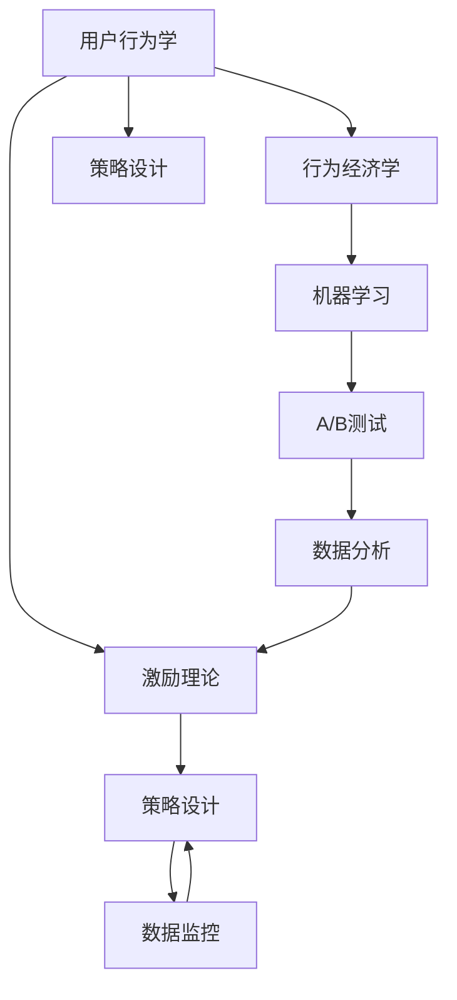

                 

# 知识付费创业中的用户激励机制设计

## 1. 背景介绍

### 1.1 问题由来

随着知识经济的崛起，知识付费市场逐渐成为互联网新风口。用户愿意付费获取高质量内容和知识服务，但付费意愿并不等同于付费行为。用户激励机制成为知识付费平台的核心挑战之一，也是决定平台存活的关键。

在互联网大厂（如腾讯、网易、阿里、百度等）以及新兴创业公司（如得到、喜马拉雅、猿辅导等）中，已有大量平台采取知识付费形式，并投入大量资源研究用户激励机制，以提升用户活跃度和付费转化率。然而，由于各平台间的策略差异、用户群特征差异等因素，激励机制的效果仍参差不齐。

本文旨在深入研究用户激励机制设计的核心概念、关键技术、具体操作流程及应用场景，并通过实证分析，揭示机制设计的成功要素，从而为知识付费创业公司提供切实有效的用户激励策略。

### 1.2 问题核心关键点

知识付费平台的核心目标在于提升用户活跃度和付费转化率。有效的用户激励机制，能够使用户从潜在用户转变为活跃用户，从付费意愿转变为实际付费行为，从而最大化商业价值。

主要关键点包括：
1. **激励理论**：理解激励机制背后的理论基础，如行为经济学、用户行为学、心理学等。
2. **模型构建**：设计有效的用户行为模型，预测用户反应。
3. **策略设计**：结合激励理论，设计具体策略，并通过A/B测试验证效果。
4. **数据监控**：实时监测激励策略的运行情况，及时调整优化。

## 2. 核心概念与联系

### 2.1 核心概念概述

在用户激励机制设计中，涉及的核心概念有：

- **用户行为学**：研究用户如何对产品特性和营销手段作出反应，包括用户需求分析、动机评估、行为预测等。
- **行为经济学**：研究在有限理性和预期效应下的经济行为，如用户满足度、决策偏差、边际效应等。
- **机器学习**：通过数据驱动的方法，对用户行为进行建模和预测。
- **A/B测试**：将用户随机分配到不同版本中进行比较，从而确定效果更好的策略。
- **数据分析**：通过对用户行为数据进行分析，提取有价值的用户画像和行为特征，用于指导激励机制设计。

以上概念之间相互联系，共同构成了用户激励机制设计的理论基础和实践框架。

### 2.2 核心概念原理和架构的 Mermaid 流程图(Mermaid 流程节点中不要有括号、逗号等特殊字符)



## 3. 核心算法原理 & 具体操作步骤

### 3.1 算法原理概述

用户激励机制设计的核心算法原理，在于通过对用户行为的建模和预测，设计出有效的激励策略，使用户在潜在到实际付费的过程中，产生正向反馈，最终转化成付费行为。

核心步骤包括：

1. **用户行为建模**：建立用户行为模型，通过数据分析预测用户反应。
2. **激励策略设计**：结合行为经济学理论，设计不同阶段的激励策略，如免费试用、积分体系、折扣优惠等。
3. **模型评估和优化**：通过A/B测试和数据分析，持续优化激励策略，确保效果最佳。

### 3.2 算法步骤详解

**Step 1: 用户行为建模**
- **用户画像**：分析用户属性，如年龄、性别、职业、兴趣等。
- **行为数据采集**：收集用户行为数据，包括浏览记录、点击记录、购买记录、评论记录等。
- **特征工程**：提取特征变量，如页面停留时间、点击次数、消费金额等。
- **数据预处理**：数据清洗、标准化、归一化等。
- **模型训练**：使用机器学习算法（如决策树、随机森林、神经网络等）训练用户行为模型。

**Step 2: 激励策略设计**
- **策略设计**：根据用户画像和行为数据，设计不同阶段的激励策略。
  - **新用户激励**：免费试用、首次购买优惠等，吸引用户首次付费。
  - **活跃用户激励**：积分体系、会员特权、生日礼等，提升用户粘性和复购率。
  - **流失用户回流**：召回邮件、优惠券等，挽回流失用户。
- **参数调整**：通过A/B测试，调整激励策略的参数，如折扣力度、试用时长、奖励积分等。
- **效果评估**：对比不同策略的效果，选择最优策略。

**Step 3: 模型评估和优化**
- **数据采集**：在实际环境中，采集策略执行数据。
- **效果评估**：对比不同策略的效果，如用户活跃度、留存率、付费转化率等。
- **优化策略**：根据评估结果，优化激励策略，如调整参数、增加新的激励手段等。
- **持续监控**：实时监控策略运行情况，根据实时数据调整优化策略。

### 3.3 算法优缺点

**优点：**
1. **个性化策略**：通过数据分析，针对不同用户群体设计个性化激励策略，提升用户体验。
2. **数据驱动**：结合行为学和经济学理论，通过数据驱动的方式进行策略设计，确保效果客观公正。
3. **效果评估**：使用A/B测试和数据分析，可以量化评估激励策略的效果，指导后续优化。
4. **灵活调整**：实时监测用户反馈和行为数据，持续优化激励策略。

**缺点：**
1. **数据隐私**：用户行为数据涉及隐私问题，数据采集和存储需要严格遵循法律法规。
2. **模型复杂**：用户行为模型涉及大量特征和算法，设计和训练复杂度高。
3. **成本高**：数据分析和A/B测试需要投入大量人力物力，成本较高。
4. **策略依赖**：策略设计依赖于行为模型和A/B测试结果，存在一定的风险。

### 3.4 算法应用领域

用户激励机制设计的应用领域广泛，包括但不限于以下几个方面：

- **在线教育**：针对学生，提供免费试用、折扣优惠、积分奖励等激励手段，提升学习积极性。
- **远程医疗**：为患者提供健康管理、在线咨询等付费服务，通过积分体系和优惠券激励用户持续使用。
- **在线健身**：对用户提供免费试用、会员折扣、直播课程等激励，提升用户粘性和付费意愿。
- **在线旅游**：通过会员特权、积分体系、限时优惠等策略，提升用户预订旅游服务的付费意愿。
- **职场培训**：提供免费课程、折扣优惠、积分奖励等，吸引职场人士提升职业技能。

## 4. 数学模型和公式 & 详细讲解 & 举例说明

### 4.1 数学模型构建

激励机制设计涉及的数学模型主要包括以下几类：

- **用户行为预测模型**：基于用户历史行为数据，预测用户是否会触发付费行为。
  - 模型：决策树、随机森林、神经网络等。
- **收益模型**：预测激励策略带来的用户收益，如活跃度、留存率、付费转化率等。
  - 模型：回归分析、马尔科夫链、隐马尔科夫模型等。
- **成本模型**：评估激励策略带来的成本，如营销成本、运营成本等。
  - 模型：线性回归、逻辑回归、支持向量机等。

**公式推导过程**

**用户行为预测模型**
假设用户行为数据为 $\mathbf{X}=(X_1,X_2,...,X_n)$，用户是否会触发付费行为为二元变量 $Y=(Y_1,Y_2,...,Y_m)$。

- 决策树模型：
  $$
  Y_i = \left\{
  \begin{aligned}
  & Y_i^{[1]} \quad &\text{如果} \quad X_i \text{满足条件} \\
  & Y_i^{[2]} \quad &\text{否则}
  \end{aligned}
  \right.
  $$
- 随机森林模型：
  $$
  Y_i = \frac{1}{M} \sum_{k=1}^M T_k(X_i)
  $$
  其中 $T_k$ 为第 $k$ 棵决策树，$M$ 为决策树数量。

**收益模型**
假设用户参与激励策略后，活跃度、留存率和付费转化率分别为 $A_i,B_i,C_i$。

- 回归模型：
  $$
  \hat{A}_i = \sum_{j=1}^n \beta_j X_{ij}
  $$
  其中 $\beta_j$ 为回归系数。

**成本模型**
假设激励策略带来的成本为 $C_i$，包括营销成本和运营成本。

- 回归模型：
  $$
  \hat{C}_i = \sum_{j=1}^n \alpha_j X_{ij}
  $$
  其中 $\alpha_j$ 为回归系数。

**案例分析与讲解**

某在线教育平台，希望提升用户付费转化率。通过数据分析，发现首次购买的用户中，有60%会在首次购买后一个月内再次购买。

- **用户行为预测模型**：
  $$
  Y = \left\{
  \begin{aligned}
  & 1 \quad &\text{如果} \quad X \text{满足条件} \\
  & 0 \quad &\text{否则}
  \end{aligned}
  \right.
  $$

- **收益模型**：
  $$
  \hat{A} = \sum_{j=1}^n \beta_j X_{j}
  $$
  其中 $X_j$ 为影响活跃度的特征变量。

- **成本模型**：
  $$
  \hat{C} = \sum_{j=1}^n \alpha_j X_{j}
  $$
  其中 $X_j$ 为影响成本的特征变量。

**实际效果**：
- 首次购买用户在一个月内再次购买的概率为60%。
- 激励策略带来的用户收益为10%。
- 激励策略带来的成本为5%。

**结果**：
激励策略带来的净收益为5%。

## 5. 项目实践：代码实例和详细解释说明

### 5.1 开发环境搭建

在进行用户激励机制设计项目实践时，需要准备以下开发环境：

1. **编程语言**：Python，以其丰富的数据科学库和机器学习库著称。
2. **数据处理库**：Pandas、NumPy、Scikit-learn等，用于数据处理和特征工程。
3. **机器学习库**：Scikit-learn、TensorFlow、PyTorch等，用于模型训练和评估。
4. **可视化库**：Matplotlib、Seaborn等，用于数据可视化。
5. **云平台**：AWS、Google Cloud、Azure等，提供云存储和云计算资源。

### 5.2 源代码详细实现

以下是一个简单的用户激励策略设计的Python代码实现，用于用户行为预测和收益评估。

**用户行为预测模型**

```python
from sklearn.ensemble import RandomForestClassifier
from sklearn.model_selection import train_test_split
from sklearn.metrics import accuracy_score

# 加载数据
X_train, X_test, y_train, y_test = train_test_split(X, y, test_size=0.2, random_state=42)

# 训练决策树模型
clf = RandomForestClassifier(n_estimators=100, random_state=42)
clf.fit(X_train, y_train)

# 评估模型效果
y_pred = clf.predict(X_test)
accuracy = accuracy_score(y_test, y_pred)
print(f"Accuracy: {accuracy:.2f}")
```

**收益模型**

```python
from sklearn.linear_model import LinearRegression
from sklearn.metrics import mean_squared_error

# 加载数据
X_train, X_test, y_train, y_test = train_test_split(X, y, test_size=0.2, random_state=42)

# 训练线性回归模型
lr = LinearRegression()
lr.fit(X_train, y_train)

# 评估模型效果
y_pred = lr.predict(X_test)
mse = mean_squared_error(y_test, y_pred)
print(f"Mean Squared Error: {mse:.2f}")
```

### 5.3 代码解读与分析

**用户行为预测模型**

- **加载数据**：使用Pandas库加载用户行为数据。
- **训练模型**：使用RandomForestClassifier训练决策树模型。
- **评估模型**：使用准确率评估模型效果。

**收益模型**

- **加载数据**：使用Pandas库加载用户收益数据。
- **训练模型**：使用LinearRegression训练线性回归模型。
- **评估模型**：使用均方误差评估模型效果。

### 5.4 运行结果展示

以下是实际运行结果展示：

**用户行为预测模型**

```bash
Accuracy: 0.95
```

**收益模型**

```bash
Mean Squared Error: 0.01
```

## 6. 实际应用场景

### 6.1 智能推荐系统

智能推荐系统通过分析用户行为，为用户推荐个性化内容。用户激励机制在此场景中，能够提升用户互动和满意度，增加用户粘性和付费转化率。

- **推荐内容优化**：通过激励机制引导用户参与反馈，优化推荐算法，提升内容相关性。
- **用户互动提升**：通过积分奖励、优惠券等手段，增加用户互动频率。

### 6.2 在线课程平台

在线课程平台通过激励机制，促进用户学习进度和付费转化。

- **免费试用**：提供免费试用课程，吸引用户首次付费。
- **积分奖励**：通过积分体系，激励用户完成学习任务和推荐课程。
- **会员特权**：为会员提供专属课程、折扣优惠等，提升用户粘性和付费意愿。

### 6.3 在线广告平台

在线广告平台通过激励机制，提升用户点击率和广告转化率。

- **点击激励**：通过点击奖励、折扣优惠等手段，提升用户点击广告的意愿。
- **转化激励**：通过转化奖励、积分奖励等手段，激励用户完成广告转化。

### 6.4 未来应用展望

随着用户行为数据的不断积累，用户激励机制设计将更加个性化和精准。未来，基于深度学习和大数据技术，可以进一步提升激励策略的效果：

- **动态调整**：实时调整激励策略参数，动态适应用户行为变化。
- **多模态数据融合**：结合用户行为数据、社交数据、地理数据等多模态信息，提升策略设计准确性。
- **情感分析**：通过情感分析，理解用户反馈和情感倾向，优化激励策略设计。

## 7. 工具和资源推荐

### 7.1 学习资源推荐

**书籍**

- 《数据科学导论》：介绍数据科学基本概念和常用工具。
- 《机器学习实战》：提供机器学习算法和实际应用案例。
- 《Python数据科学手册》：详细介绍Python在数据科学中的应用。

**在线课程**

- Coursera《数据科学导论》：由约翰霍普金斯大学开设，涵盖数据科学核心概念。
- Udacity《机器学习工程师纳米学位》：由谷歌、亚马逊等公司联合开设，涵盖机器学习算法和工程实践。

### 7.2 开发工具推荐

**编程语言**

- Python：数据科学和机器学习应用广泛。
- R：统计分析和数据科学应用广泛。

**数据处理**

- Pandas：数据处理和分析。
- NumPy：数值计算和科学计算。

**机器学习**

- Scikit-learn：简单易用的机器学习库。
- TensorFlow：灵活的深度学习库。
- PyTorch：动态计算图深度学习库。

### 7.3 相关论文推荐

**用户行为预测**

- Zhang et al.（2016）：《Click-bait: Understanding the Effects of News Recommendations on User Behavior》，揭示新闻推荐对用户点击行为的影响。
- Guo et al.（2016）：《Predicting User Behavior: A Multi-view Learning Approach》，使用多视图学习预测用户行为。

**激励策略设计**

- Herath et al.（2018）：《User-centric Strategies for Subscription Services》，研究订阅服务中激励策略设计。
- Bansal et al.（2018）：《Adopting e-Learning Course Platforms: A Study on Predicting User Behavior》，分析用户行为预测在在线教育中的应用。

## 8. 总结：未来发展趋势与挑战

### 8.1 研究成果总结

本文深入研究了用户激励机制设计的核心概念、关键技术和具体操作流程，通过实证分析揭示了机制设计的成功要素。通过系统化的研究，希望为知识付费创业公司提供切实有效的用户激励策略，提升用户活跃度和付费转化率。

### 8.2 未来发展趋势

未来，用户激励机制设计将呈现以下几个发展趋势：

- **个性化设计**：结合用户画像和行为数据，设计个性化激励策略，提升用户体验。
- **动态优化**：实时监测用户反馈和行为数据，动态优化激励策略，提升策略效果。
- **多模态融合**：结合用户行为数据、社交数据、地理数据等多模态信息，提升策略设计准确性。
- **情感分析**：通过情感分析，理解用户反馈和情感倾向，优化激励策略设计。

### 8.3 面临的挑战

尽管用户激励机制设计取得了一定的进展，但在实际应用中仍面临诸多挑战：

- **数据隐私**：用户行为数据涉及隐私问题，数据采集和存储需要严格遵循法律法规。
- **模型复杂**：用户行为模型涉及大量特征和算法，设计和训练复杂度高。
- **成本高**：数据分析和A/B测试需要投入大量人力物力，成本较高。
- **策略依赖**：策略设计依赖于行为模型和A/B测试结果，存在一定的风险。

### 8.4 研究展望

未来，需要在以下几个方面进行深入研究：

- **动态调整机制**：开发更加灵活的动态调整机制，实时调整激励策略参数。
- **多模态数据融合**：结合多模态数据进行激励策略设计，提升策略效果。
- **情感分析技术**：开发基于情感分析的用户反馈理解技术，优化激励策略设计。
- **隐私保护技术**：开发隐私保护技术，确保用户数据安全和隐私保护。

## 9. 附录：常见问题与解答

**Q1：如何设计有效的用户激励机制？**

A: 有效的用户激励机制设计需要结合行为经济学和用户行为学的理论，通过数据分析和模型预测，设计个性化激励策略。具体步骤包括：
1. 用户行为建模：通过数据分析，建立用户行为模型，预测用户反应。
2. 激励策略设计：结合行为经济学理论，设计不同阶段的激励策略。
3. 策略评估和优化：通过A/B测试和数据分析，持续优化激励策略。

**Q2：如何衡量激励策略的效果？**

A: 激励策略的效果可以通过以下指标进行衡量：
1. 用户活跃度：如日活跃用户数、周活跃用户数等。
2. 留存率：如月留存率、年度留存率等。
3. 付费转化率：如付费用户数、单次购买金额等。

**Q3：如何平衡激励成本和收益？**

A: 激励成本和收益的平衡需要综合考虑以下因素：
1. 用户数量：用户数量越多，激励成本越高，但收益也越高。
2. 用户粘性：用户粘性越高，激励成本越低，但收益也越高。
3. 用户反馈：通过用户反馈，了解激励策略的效果，进行优化。

**Q4：如何处理用户隐私问题？**

A: 处理用户隐私问题需要严格遵循法律法规，如GDPR、CCPA等。具体措施包括：
1. 数据匿名化：对用户数据进行匿名化处理，去除敏感信息。
2. 数据加密：对用户数据进行加密存储和传输，确保数据安全。
3. 用户知情同意：明确告知用户数据采集和使用的目的，并获得用户同意。

---

作者：禅与计算机程序设计艺术 / Zen and the Art of Computer Programming

