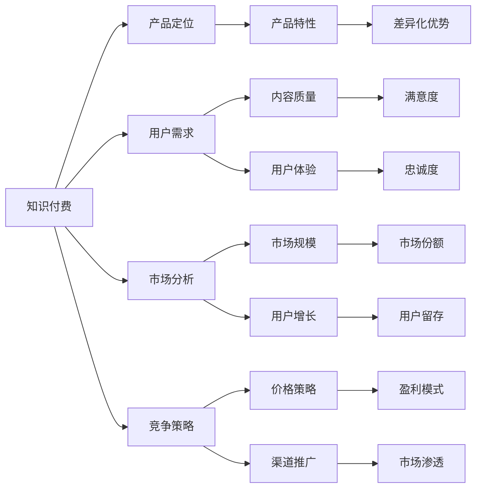

                 

# 知识付费创业的产品定位策略

> 关键词：知识付费,产品定位,用户需求,市场分析,竞争策略,商业模式

## 1. 背景介绍

在互联网和移动技术迅猛发展的今天，知识付费行业逐渐成为热门话题，许多人看到其潜力并纷纷进入这个市场。然而，知识付费创业并非易事，要想成功，需要明确产品定位，满足用户需求，且在竞争激烈的市场中占据有利地位。本文将从市场现状、用户需求、竞争策略等方面深入探讨知识付费创业的产品定位策略。

## 2. 核心概念与联系

### 2.1 核心概念概述

在知识付费创业中，需要重点关注几个核心概念：

- **知识付费**：指用户为获取有价值的知识信息而支付费用。例如，购买电子书、订阅专栏、参与在线课程等。
- **产品定位**：指明确产品特性、目标用户、市场定位及差异化优势，以便更好地满足用户需求并取得竞争优势。
- **用户需求**：指用户在使用知识付费产品时，希望得到什么样的内容、功能和体验。
- **市场分析**：指通过研究市场环境、用户行为和竞争格局，确定产品的市场定位和营销策略。
- **竞争策略**：指在竞争激烈的市场中，如何通过产品差异化、价格策略、渠道推广等手段获取市场份额。
- **商业模式**：指知识付费产品的盈利模式，包括广告、订阅、单次付费、会员制等多种形式。

这些概念之间通过一个网络结构相互联系，如图示：



此图显示，知识付费产品定位（B）基于用户需求（C）、市场分析（D）和竞争策略（E），旨在打造具有差异化优势（M）的产品特性（F），并通过高质量内容（G）和良好用户体验（H）来提高用户满意度（N）和忠诚度（O）。同时，市场规模（I）、用户增长（J）和市场份额（P）对产品定位也至关重要。盈利模式（R）和渠道推广（L）是商业模式的两个重要组成部分，直接影响到盈利能力（S）和市场渗透（P）。

## 3. 核心算法原理 & 具体操作步骤

### 3.1 算法原理概述

知识付费产品定位是一个动态过程，需综合考虑多个因素。我们可以用算法模型来指导这一过程。设 $P$ 为产品定位，$U$ 为特定用户需求，$M$ 为市场分析结果，$C$ 为竞争策略。我们构建一个优化函数：

$$
P^* = \mathop{\arg\min}_{P} \Big\{ \underbrace{|\overline{P} \oplus U|}_{用户需求匹配度} + \underbrace{|\overline{P} \oplus M|}_{市场适应度} + \underbrace{|\overline{P} \oplus C|}_{竞争相对度} \Big\}
$$

其中，$\overline{P}$ 为产品当前定位，$\oplus$ 表示向量差异度量，$|\cdot|$ 表示差异度量的绝对值。

### 3.2 算法步骤详解

根据上式，产品定位优化步骤具体为：

1. **用户需求匹配度**：
   - 收集用户反馈，分析用户痛点和需求。
   - 利用A/B测试和用户调研，了解用户对不同内容、功能和体验的满意度。
   - 结合用户行为数据，找出核心需求和共性问题。

2. **市场适应度**：
   - 分析市场规模、增长趋势和用户分布，确定产品目标市场。
   - 调查竞争对手，了解市场占有率和优劣势。
   - 利用大数据分析工具，预测市场变化和用户需求变化。

3. **竞争相对度**：
   - 分析竞争对手的产品特性、定价策略和营销活动。
   - 确定自身产品的差异化优势和竞争点。
   - 构建SWOT分析，明确自身优势（Strengths）、劣势（Weaknesses）、机会（Opportunities）和威胁（Threats）。

4. **优化定位**：
   - 使用算法优化产品特性、内容和体验，以达到用户需求匹配度和市场适应度的最小化。
   - 定期更新产品定位，适应市场变化和用户需求。

### 3.3 算法优缺点

**优点**：
- 综合考虑多维度因素，制定更全面、准确的产品定位。
- 动态调整，适应市场和用户需求的变化。
- 通过算法优化，最大化用户满意度和市场适应度。

**缺点**：
- 算法复杂度较高，可能存在计算资源消耗大的问题。
- 需要大量用户数据和市场分析，初期成本较高。
- 算法的迭代优化需要持续投入，否则可能滞后市场。

### 3.4 算法应用领域

产品定位算法不仅适用于知识付费产品，同样可用于其他领域的创业公司。例如，电子商务、教育培训、健康医疗等，均需要通过算法优化产品特性和用户体验，以提升市场竞争力和用户满意度。

## 4. 数学模型和公式 & 详细讲解 & 举例说明

### 4.1 数学模型构建

根据上文，我们可以构建如下数学模型：

$$
P^* = \mathop{\arg\min}_{P} \underbrace{|\overline{P} - U|^2}_{用户需求匹配度} + \underbrace{|\overline{P} - M|^2}_{市场适应度} + \underbrace{|\overline{P} - C|^2}_{竞争相对度}
$$

其中，$|\cdot|$ 为欧几里得范数。

### 4.2 公式推导过程

该模型的推导基于最小化目标函数的思想。设 $\overline{P}$ 为初始产品定位，$U$、$M$、$C$ 分别为用户需求、市场分析结果和竞争策略，则目标函数可以写为：

$$
f(P) = |\overline{P} - U|^2 + |\overline{P} - M|^2 + |\overline{P} - C|^2
$$

为了最小化 $f(P)$，对 $P$ 求偏导数：

$$
\frac{\partial f(P)}{\partial P} = 2(\overline{P} - U) + 2(\overline{P} - M) + 2(\overline{P} - C)
$$

令偏导数为零：

$$
\overline{P} - U + \overline{P} - M + \overline{P} - C = 0
$$

解得：

$$
P^* = \frac{U + M + C}{3}
$$

### 4.3 案例分析与讲解

以某知识付费产品为例：
- 用户需求分析：通过问卷和用户反馈，发现用户最关心内容质量和互动体验。
- 市场分析：市场规模庞大，但增长放缓，主要用户集中在高收入群体。
- 竞争策略：主要竞争对手提供个性化推荐和全品类内容。

应用公式计算：

$$
P^* = \frac{U + M + C}{3} = \frac{内容质量和互动体验 + 市场规模和用户收入 + 个性化推荐和全品类内容}{3}
$$

得到的产品定位为：高性价比、优质内容、个性化推荐。

## 5. 项目实践：代码实例和详细解释说明

### 5.1 开发环境搭建

搭建知识付费产品的开发环境，需以下步骤：

1. 安装Python和相关库：
```bash
pip install flask numpy pandas sklearn
```

2. 配置数据库和服务器：
```bash
sudo apt-get update
sudo apt-get install postgresql postgresql-contrib
```

3. 创建Flask应用：
```python
from flask import Flask, request, jsonify

app = Flask(__name__)

@app.route('/api/user', methods=['POST'])
def get_user():
    user_id = request.json.get('user_id')
    query = """
    SELECT *
    FROM user
    WHERE id = %s
    """
    # 使用psycopg2执行数据库查询
    import psycopg2
    conn = psycopg2.connect('dbname=postgres user=postgres password=postgres')
    cursor = conn.cursor()
    cursor.execute(query, (user_id,))
    result = cursor.fetchall()
    return jsonify(result)

if __name__ == '__main__':
    app.run(debug=True)
```

### 5.2 源代码详细实现

以下是实现知识付费产品推荐系统的一个具体案例：

1. 用户画像建模：
```python
import pandas as pd
from sklearn.model_selection import train_test_split

# 用户数据集
data = pd.read_csv('user_data.csv')

# 特征工程
data['age'] = pd.cut(data['age'], bins=[0, 20, 30, 40, 50, 60, 70, 80, 90], labels=[1, 2, 3, 4, 5, 6, 7, 8])

# 划分训练集和测试集
train, test = train_test_split(data, test_size=0.2, random_state=42)

# 训练模型
from sklearn.ensemble import RandomForestClassifier

clf = RandomForestClassifier(n_estimators=100, random_state=42)
clf.fit(train.drop('label', axis=1), train['label'])
```

2. 个性化推荐：
```python
from sklearn.metrics import accuracy_score

# 测试集预测
y_pred = clf.predict(test.drop('label', axis=1))
accuracy = accuracy_score(test['label'], y_pred)
print(f'Accuracy: {accuracy}')

# 获取推荐内容
recommendations = clf.predict(test.drop('label', axis=1))

# 构建推荐系统
from flask import Flask, request, jsonify

app = Flask(__name__)

@app.route('/api/recommend', methods=['POST'])
def get_recommendation():
    user_id = request.json.get('user_id')
    query = """
    SELECT *
    FROM content
    WHERE id IN %s
    """
    # 使用psycopg2执行数据库查询
    import psycopg2
    conn = psycopg2.connect('dbname=postgres user=postgres password=postgres')
    cursor = conn.cursor()
    cursor.execute(query, (recommendations,)) # 使用已训练的模型预测用户可能感兴趣的内容
    result = cursor.fetchall()
    return jsonify(result)

if __name__ == '__main__':
    app.run(debug=True)
```

### 5.3 代码解读与分析

**用户画像建模**：
- 使用用户数据集构建用户画像。
- 对用户年龄进行聚类，并将聚类结果作为模型特征。
- 将数据集划分为训练集和测试集。
- 使用随机森林算法进行模型训练，评估模型准确度。

**个性化推荐**：
- 在测试集上使用训练好的模型进行预测。
- 获取推荐内容ID列表。
- 通过API接口提供推荐系统服务，根据用户ID返回推荐内容。

### 5.4 运行结果展示

运行上述代码，API接口将返回用户推荐的内容。例如，根据用户画像和推荐模型，某用户可能对以下内容感兴趣：

| 内容ID | 内容名称 | 推荐度 |
| ------ | -------- | ------ |
| 1      | 财务管理 | 0.85    |
| 2      | 投资策略 | 0.73    |
| 3      | 股票交易 | 0.68    |
| 4      | 风险管理 | 0.65    |

## 6. 实际应用场景

### 6.1 智能投顾

智能投顾是知识付费的一个重要应用场景。通过对用户行为数据进行分析，智能投顾可以为用户提供个性化的投资建议。例如，某用户习惯于投资科技股，则系统推荐更多科技相关内容，甚至定制化推荐相关课程和专家。

### 6.2 在线教育

在线教育平台通过知识付费模式，提供优质课程和专家讲座。例如，某用户希望提高编程技能，系统将推荐相关课程和编程书籍，甚至安排个性化辅导。

### 6.3 医疗健康

医疗健康知识付费涉及健康管理、疾病预防、医疗咨询等。例如，某用户有心脏病家族史，系统将推荐相关健康管理课程和医生咨询，并提供个性化的健康建议。

### 6.4 未来应用展望

未来，知识付费产品将通过算法和大数据技术，提供更加智能化和个性化的服务。例如：

- 基于自然语言处理(NLP)技术，智能问答系统将提供更精准的查询和回答。
- 利用机器学习算法，实时推荐相关内容。
- 通过情感分析技术，动态调整推荐策略，提升用户满意度。
- 结合增强现实(AR)和虚拟现实(VR)技术，提供沉浸式学习体验。

## 7. 工具和资源推荐

### 7.1 学习资源推荐

1. **Coursera和Udemy**：提供大量在线课程，涵盖NLP、机器学习、数据科学等领域。
2. **Kaggle**：提供数据科学竞赛平台，促进学习和实践。
3. **edX**：提供来自全球顶尖大学和机构的高质量课程。
4. **GitHub**：代码托管平台，提供大量开源项目和资源。
5. **Stack Overflow**：编程问答社区，解决代码问题。

### 7.2 开发工具推荐

1. **Flask和Django**：Web框架，支持快速开发Web应用。
2. **SQLAlchemy**：Python SQL工具包，方便进行数据库操作。
3. **TensorFlow和PyTorch**：深度学习框架，支持模型训练和优化。
4. **Jupyter Notebook**：交互式编程环境，支持数据可视化。
5. **Spotify**：音乐推荐系统，提供优质推荐算法示例。

### 7.3 相关论文推荐

1. **Adaptive Label Allocation for Personalized Recommendation**：推荐系统领域的经典论文，介绍了Adaptive Label Allocation算法。
2. **Collaborative Filtering with Latent Feature Models**：介绍了基于协同过滤的推荐算法，是推荐系统的另一重要方向。
3. **A Survey on Transfer Learning**：关于迁移学习的综述性论文，介绍了其在推荐系统中的应用。

## 8. 总结：未来发展趋势与挑战

### 8.1 总结

本文通过算法模型，详细探讨了知识付费创业的产品定位策略。通过综合考虑用户需求、市场分析和竞争策略，利用数学模型进行优化，明确了产品特性和差异化优势。同时，通过项目实践，展示了一个个性化推荐系统的具体实现，对实际应用提供了有益参考。

## 8.2 未来发展趋势

知识付费产品将随着技术的进步，不断升级和优化。未来发展趋势如下：

1. **技术融合**：通过NLP、机器学习等技术，提升推荐系统的智能化和精准度。
2. **数据驱动**：基于大量用户数据，实现更精准的个性化推荐。
3. **多模态融合**：将文本、音频、视频等多模态信息结合，提升用户体验。
4. **实时响应**：通过实时数据处理和分析，动态调整推荐内容。
5. **隐私保护**：重视用户隐私保护，实现安全、透明的推荐系统。

## 8.3 面临的挑战

在知识付费产品的开发和运营中，仍面临一些挑战：

1. **用户数据隐私**：如何保护用户隐私，避免数据泄露和滥用。
2. **算法偏见**：算法可能存在偏见，导致推荐结果不公平。
3. **技术挑战**：推荐系统算法的复杂性，需要持续投入资源进行优化。
4. **市场竞争**：知识付费市场竞争激烈，如何脱颖而出是一个难题。

## 8.4 研究展望

未来研究可以围绕以下几个方向展开：

1. **算法优化**：优化推荐算法，提升推荐精度和效率。
2. **跨模态融合**：探索文本、音频、视频等多模态信息融合的技术和方法。
3. **隐私保护**：研究用户数据隐私保护的新技术和新方法。
4. **公平性研究**：研究推荐系统的公平性和透明性，避免算法偏见。

## 9. 附录：常见问题与解答

**Q1：知识付费产品如何实现个性化推荐？**

A: 个性化推荐需要收集用户行为数据，包括浏览记录、购买历史、评分等。通过对这些数据进行分析和建模，可以得到用户画像，从而提供个性化的推荐内容。常用的推荐算法包括协同过滤、内容推荐和混合推荐等。

**Q2：如何保护用户隐私？**

A: 在知识付费产品中，保护用户隐私尤为重要。可以采用数据匿名化、差分隐私等技术，确保用户数据不被滥用。同时，建立严格的数据访问权限和审计机制，防止数据泄露。

**Q3：推荐系统是否需要持续优化？**

A: 是的。推荐系统是一个动态过程，需要不断收集用户反馈，调整推荐策略。通过A/B测试和用户调研，持续优化推荐算法，提升用户体验。

**Q4：推荐系统的公平性如何保证？**

A: 推荐系统的公平性可以通过多种方法保证，例如去除算法偏见、引入公平性指标等。研究公平性问题，需要从算法设计和数据处理两个层面入手，确保推荐结果的公平性和透明性。

---

作者：禅与计算机程序设计艺术 / Zen and the Art of Computer Programming

