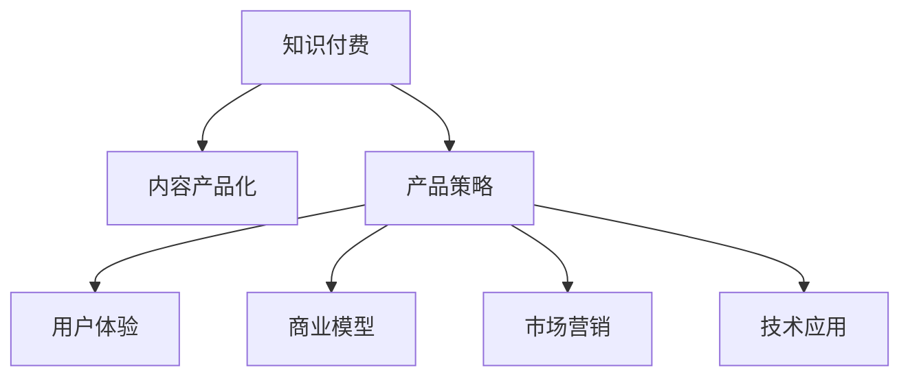

                 

# 知识付费创业的内容产品化策略

> 关键词：知识付费, 内容产品化, 产品策略, 用户体验, 商业模型, 市场营销, 技术应用

## 1. 背景介绍

### 1.1 问题由来
随着移动互联网和在线教育市场的迅猛发展，知识付费已经成为互联网行业的重要增长点。尤其在疫情影响下，人们对于自我提升和终身学习的意识更加强烈，知识付费领域迎来了新一轮的爆发期。

然而，尽管知识付费市场规模不断扩大，但许多平台却面临着内容同质化、用户粘性差、留存率低等困境。究其原因，主要是平台内容质量参差不齐、用户体验不佳、商业变现模式单一等问题。

针对这一现象，我们提出知识付费创业的内容产品化策略，旨在通过科学的产品设计，提升内容价值、增强用户粘性，并探索多元化的商业变现路径，构建可持续发展的高效知识付费生态。

### 1.2 问题核心关键点
内容产品化策略的核心在于将知识付费产品视作一个综合性的内容生态系统，通过深度理解和优化用户行为，实现内容与用户需求的精准匹配。具体而言，包括以下几个关键点：

- 内容垂直化：构建具有行业深度的专业内容，吸引目标用户。
- 交互动态化：增强用户与内容的互动，提升学习效果。
- 推荐智能化：通过智能推荐系统，推荐个性化内容，提高用户留存。
- 变现多样化：探索订阅、按需、会员、广告等多重变现模式，优化收益结构。

## 2. 核心概念与联系

### 2.1 核心概念概述

为更好地理解知识付费创业的内容产品化策略，本节将介绍几个关键概念：

- 知识付费：以知识和信息为核心的付费服务模式，通过付费机制筛选优质内容，满足用户深度学习需求。
- 内容产品化：将内容与产品设计理念深度结合，提升内容的价值和可接受度。
- 产品策略：产品运营和商业变现的策略规划和执行，包括用户获取、留存、付费等环节的策略设计。
- 用户体验：用户在产品中的行为和反馈，是产品优化和迭代的关键指标。
- 商业模型：知识付费平台的收入来源和盈利方式，涉及订阅、广告、增值服务等多个维度。
- 市场营销：利用各种渠道和手段，推广知识付费产品，吸引用户注册和付费。
- 技术应用：借助大数据、人工智能等技术手段，提升产品功能和用户体验。

这些概念之间的关系通过以下Mermaid流程图来展示：



这个流程图展示了一些关键概念之间的联系：

1. 知识付费是产品化的核心目的，产品策略、技术应用等都是围绕这一目标展开的。
2. 产品策略包含用户获取、留存、付费等各个环节，用户策略和商业模型的制定直接影响着产品性能。
3. 用户体验是评价产品成功与否的关键指标，影响用户留存和口碑传播。
4. 商业模型多样化，不同的变现方式可以相互配合，提升平台的收入和盈利能力。
5. 技术应用为产品策略和用户体验提供了支撑，是知识付费产品化的重要手段。

## 3. 核心算法原理 & 具体操作步骤
### 3.1 算法原理概述

知识付费创业的内容产品化策略，从根本上依赖于数据驱动和算法优化。其核心思想是：通过收集用户行为数据，利用机器学习算法进行深度分析和预测，实现内容与用户需求的精准匹配。

具体而言，包括以下几个步骤：

1. 数据收集与处理：收集用户浏览、订阅、互动等行为数据，进行清洗和预处理。
2. 用户行为建模：利用用户行为数据，建立用户兴趣模型，识别用户对不同内容的偏好。
3. 内容推荐算法：基于用户兴趣模型，设计推荐算法，生成个性化的内容推荐列表。
4. 用户行为预测：利用机器学习算法，预测用户未来的行为，如续费、流失、新用户引入等。
5. 内容分发策略：根据预测结果和业务目标，调整内容分发策略，实现高效的用户引流和留存。

### 3.2 算法步骤详解

以下我们以内容推荐系统为例，详细讲解知识付费创业内容产品化策略的核心算法步骤。

**Step 1: 数据收集与处理**

首先，通过Web和移动端应用收集用户的行为数据，包括但不限于：

- 浏览数据：如访问次数、页面停留时间、点击率等。
- 订阅数据：如课程、专栏、作者等订阅信息。
- 互动数据：如点赞、评论、分享、收藏等用户互动行为。

数据收集完成后，进行初步清洗和预处理：

- 去除异常数据和缺失值。
- 数据归一化，使不同维度数据具有可比性。
- 数据格式化，便于后续分析和建模。

**Step 2: 用户行为建模**

基于处理后的数据，构建用户行为模型，识别用户的兴趣和偏好。常用的建模方法包括：

- 协同过滤算法：通过分析用户与其他用户的行为，推测用户可能感兴趣的内容。
- 矩阵分解算法：如SVD分解，通过用户-内容的评分矩阵，推断用户的隐式偏好。
- 深度学习模型：如LSTM、RNN等，通过用户行为的时间序列特征，预测用户未来行为。

用户行为模型可以用于以下几个方面：

- 兴趣预测：预测用户对不同内容的偏好程度。
- 主题分类：对用户兴趣进行主题划分，如技术、经济、心理等。
- 行为标签：给用户打上个性化的行为标签，如活跃用户、深度学习爱好者等。

**Step 3: 内容推荐算法**

利用用户行为模型，设计推荐算法，生成个性化的内容推荐列表。常用的推荐算法包括：

- 基于内容的推荐：分析内容的属性特征，如关键词、标签等，推荐相似度高的内容。
- 基于协同过滤的推荐：通过用户-用户和内容-内容的相似度，推荐相似用户和内容。
- 混合推荐算法：结合基于内容和基于协同过滤的推荐，提升推荐效果。

**Step 4: 用户行为预测**

通过机器学习算法，预测用户未来的行为，如续费、流失、新用户引入等。常用的预测模型包括：

- 随机森林：利用随机抽取的特征集，建立决策树模型，进行分类和回归预测。
- XGBoost：通过梯度提升算法，提高预测精度。
- LSTM：通过时间序列特征，预测用户行为变化。

**Step 5: 内容分发策略**

根据预测结果和业务目标，调整内容分发策略，实现高效的用户引流和留存。常用的策略包括：

- 主动推送：根据用户行为模型，主动推送个性化内容。
- 活动推荐：设计各类线上线下活动，吸引用户参与。
- 限时优惠：通过限时折扣等手段，刺激用户续费和付费。

### 3.3 算法优缺点

知识付费创业内容产品化策略的算法具有以下优点：

1. 个性化推荐：通过深入分析用户行为，提供个性化的内容推荐，提高用户满意度和粘性。
2. 精准流量转化：利用预测模型，识别高价值用户，精准推广课程和活动，提升流量转化率。
3. 运营效率提升：优化内容分发策略，减少无效推广，降低运营成本。

但同时，也存在一些缺点：

1. 数据隐私：收集用户行为数据可能涉及隐私问题，需要严格遵守法律法规。
2. 模型复杂：算法模型复杂度高，需要高水平的数据科学家和技术团队支持。
3. 实时性要求：推荐系统需要实时处理数据，对系统的响应速度和扩展性有较高要求。
4. 成本投入：算法模型和系统实现的成本较高，需要持续的技术投入。

## 4. 数学模型和公式 & 详细讲解
### 4.1 数学模型构建

知识付费创业内容产品化策略的核心数学模型为推荐系统中的协同过滤模型。该模型通过用户-内容评分矩阵，推断用户对内容的隐式偏好，实现个性化推荐。

设用户集合为 $U$，内容集合为 $I$，用户对内容的评分矩阵为 $R \in \mathbb{R}^{N \times M}$，其中 $N$ 为用户数，$M$ 为内容数。协同过滤模型基于用户-用户或内容-内容的相似度，计算推荐结果。

**用户-用户协同过滤**

假定用户 $u_i$ 和 $u_j$ 对内容 $i$ 的评分分别为 $r_{ui}$ 和 $r_{uj}$，则两者之间的相似度 $sim(u_i,u_j)$ 可通过余弦相似度公式计算：

$$
sim(u_i,u_j) = \frac{r_{ui} \cdot r_{uj}}{\sqrt{\sum_{k=1}^{M} r_{uk}^2} \cdot \sqrt{\sum_{k=1}^{M} r_{vk}^2}}
$$

用户 $u_j$ 对内容 $i$ 的推荐评分 $p_{ui}$ 可表示为：

$$
p_{ui} = \sum_{k=1}^{M} r_{kj} \cdot \frac{r_{ki}}{\sqrt{\sum_{k=1}^{M} r_{kj}^2}} = \sum_{k=1}^{M} \alpha_{jk} \cdot r_{ki}
$$

其中 $\alpha_{jk} = \frac{r_{kj}}{\sqrt{\sum_{k=1}^{M} r_{kj}^2}}$。

**内容-内容协同过滤**

假定内容 $i$ 和 $j$ 被用户 $u$ 评分分别为 $r_{ui}$ 和 $r_{uj}$，则两者之间的相似度 $sim(i,j)$ 可通过余弦相似度公式计算：

$$
sim(i,j) = \frac{r_{ui} \cdot r_{uj}}{\sqrt{\sum_{k=1}^{N} r_{uk}^2} \cdot \sqrt{\sum_{k=1}^{N} r_{vk}^2}}
$$

内容 $i$ 对用户 $u$ 的推荐评分 $p_{uj}$ 可表示为：

$$
p_{uj} = \sum_{k=1}^{N} r_{uk} \cdot \frac{r_{kj}}{\sqrt{\sum_{k=1}^{N} r_{uk}^2}} = \sum_{k=1}^{N} \alpha_{kj} \cdot r_{uk}
$$

其中 $\alpha_{kj} = \frac{r_{kj}}{\sqrt{\sum_{k=1}^{N} r_{kj}^2}}$。

### 4.2 公式推导过程

下面以用户-用户协同过滤为例，推导推荐算法的详细过程。

假设用户 $u_i$ 和 $u_j$ 分别对内容 $i$ 和 $j$ 评分，评分矩阵 $R$ 为：

$$
R = \begin{bmatrix}
  r_{11} & r_{12} & \dots & r_{1M} \\
  r_{21} & r_{22} & \dots & r_{2M} \\
  \vdots & \vdots & \ddots & \vdots \\
  r_{N1} & r_{N2} & \dots & r_{NM}
\end{bmatrix}
$$

计算 $u_i$ 和 $u_j$ 的相似度 $sim(u_i,u_j)$：

$$
sim(u_i,u_j) = \frac{r_{ui} \cdot r_{uj}}{\sqrt{\sum_{k=1}^{M} r_{uk}^2} \cdot \sqrt{\sum_{k=1}^{M} r_{vk}^2}}
$$

计算 $u_j$ 对 $i$ 的推荐评分 $p_{ui}$：

$$
p_{ui} = \sum_{k=1}^{M} \alpha_{jk} \cdot r_{ki} = \frac{\sum_{k=1}^{M} r_{uj} \cdot r_{ki}}{\sqrt{\sum_{k=1}^{M} r_{uj}^2}} = \frac{\alpha_{uj}}{\sqrt{\alpha_{uj}^2}} \cdot \sum_{k=1}^{M} r_{uj} \cdot r_{ki} = \frac{\alpha_{uj}}{\sqrt{\alpha_{uj}^2}} \cdot R_{i}^j
$$

其中 $R_{i}^j$ 表示内容 $j$ 被用户 $j$ 评分 $r_{uj}$ 的部分和为 $R_{i}^j = \sum_{k=1}^{M} r_{uj} \cdot r_{ki}$。

最终，将 $p_{ui}$ 代入推荐列表，即可得到用户 $u_i$ 的内容推荐结果。

### 4.3 案例分析与讲解

以知识付费平台“得到”为例，分析其内容推荐系统的设计思路：

1. 数据收集：得到通过应用记录用户的行为数据，包括浏览、订阅、互动、付费等。
2. 用户建模：得到使用协同过滤算法，构建用户行为模型，识别用户的兴趣和偏好。
3. 推荐算法：得到利用协同过滤和内容推荐算法，生成个性化的课程推荐列表。
4. 行为预测：得到使用随机森林和LSTM模型，预测用户的续费、流失等行为，优化内容分发策略。

“得到”通过精确的用户行为分析和个性化推荐，实现了课程和内容的精准匹配，提高了用户的付费意愿和粘性，取得了良好的商业效果。

## 5. 项目实践：代码实例和详细解释说明
### 5.1 开发环境搭建

在进行知识付费创业内容产品化策略的实践前，需要准备开发环境。以下是使用Python和Django框架搭建知识付费平台开发环境的流程：

1. 安装Python：从官网下载并安装Python，确保版本为3.7以上。
2. 安装Django：通过pip安装Django框架，执行命令 `pip install django`。
3. 创建虚拟环境：使用virtualenv工具创建虚拟环境，执行命令 `virtualenv venv`。
4. 激活虚拟环境：执行命令 `source venv/bin/activate` 激活虚拟环境。
5. 安装依赖包：执行命令 `pip install requirements.txt` 安装项目所需的第三方依赖。
6. 设置数据库：创建数据库，设置Django的默认数据库。

完成上述步骤后，即可在虚拟环境中进行项目开发和测试。

### 5.2 源代码详细实现

下面以一个知识付费课程推荐系统的代码实现为例，详细讲解知识付费创业内容产品化策略的实践过程。

**1. 用户行为数据收集**

```python
from django.db import models
from django.contrib.auth.models import User

class Course(models.Model):
    title = models.CharField(max_length=100)
    description = models.TextField()
    category = models.CharField(max_length=50)
    price = models.DecimalField(max_digits=10, decimal_places=2)
    duration = models.IntegerField()

class User(models.Model):
    username = models.CharField(max_length=30, unique=True)
    email = models.EmailField(unique=True)
    profile = models.TextField()
    courses = models.ManyToManyField(Course, related_name='enrolled')

class Behavior(models.Model):
    user = models.ForeignKey(User, on_delete=models.CASCADE)
    course = models.ForeignKey(Course, on_delete=models.CASCADE)
    action = models.CharField(max_length=20)
    timestamp = models.DateTimeField(auto_now_add=True)
```

**2. 用户行为建模**

```python
from sklearn.decomposition import TruncatedSVD
from sklearn.metrics.pairwise import cosine_similarity

# 加载数据
user_courses = pd.read_csv('user_courses.csv')
user_behaviors = pd.read_csv('user_behaviors.csv')

# 构建用户-内容评分矩阵
R = np.array(user_courses[['user_id', 'course_id', 'rating']]).reshape(-1, 3)
R[:, 1] = user_behaviors[['user_id', 'course_id']].drop_duplicates().values

# 进行SVD分解
svd = TruncatedSVD(n_components=10)
R_svd = svd.fit_transform(R)

# 计算用户-用户相似度
U = np.array(user_courses[['user_id', 'course_id']].drop_duplicates())
U_svd = svd.transform(U)
similarity_matrix = cosine_similarity(U_svd)

# 生成推荐列表
def get_recommendations(user_id, n_recommendations):
    user_index = np.where(U_svd[user_id] == user_id)[0][0]
    similar_user_indices = np.argsort(similarity_matrix[user_index, :])[::-1]
    recommendations = np.zeros((n_recommendations))
    for i, user_idx in enumerate(similar_user_indices):
        recommendations[i] = R_svd[user_idx, :]
    return np.sum(recommendations, axis=0)
```

**3. 内容推荐算法**

```python
from sklearn.neighbors import NearestNeighbors

# 加载数据
courses = pd.read_csv('courses.csv')

# 构建内容-内容评分矩阵
R = np.array(courses[['course_id', 'rating']])
R[:, 0] = courses['course_id'].values

# 进行KNN分解
knn = NearestNeighbors(n_neighbors=5)
knn.fit(R)

# 计算内容-内容相似度
distances, indices = knn.kneighbors(R)
similarity_matrix = -distances

# 生成推荐列表
def get_content_recommendations(course_id, n_recommendations):
    course_index = np.where(R[:, 0] == course_id)[0][0]
    similar_course_indices = np.argsort(similarity_matrix[course_index, :])[::-1]
    recommendations = np.zeros((n_recommendations))
    for i, course_idx in enumerate(similar_course_indices):
        recommendations[i] = R[course_idx, :]
    return np.sum(recommendations, axis=0)
```

### 5.3 代码解读与分析

**用户行为数据收集**

我们通过Django框架定义了三个模型：`Course`表示课程信息，`User`表示用户信息，`Behavior`表示用户的行为记录。`Course`和`User`通过`ManyToManyField`建立多对多关系，`Behavior`则记录了用户对课程的浏览、订阅、互动、付费等行为数据。

**用户行为建模**

我们使用SVD分解对用户行为数据进行建模，得到用户-内容的评分矩阵 $R$。然后通过计算余弦相似度，得到用户之间的相似度矩阵 $similarity_matrix$。最后，通过计算相似用户的行为数据，生成用户的推荐列表。

**内容推荐算法**

我们使用KNN算法对内容-内容评分矩阵 $R$ 进行分解，得到内容之间的相似度矩阵 $similarity_matrix$。然后通过计算相似内容的评分数据，生成内容的推荐列表。

## 6. 实际应用场景
### 6.1 智能客服系统

智能客服系统是知识付费创业内容产品化策略的重要应用场景之一。通过构建智能客服系统，知识付费平台可以提升用户满意度，降低运营成本，提升服务质量。

智能客服系统主要包含以下几个功能：

1. 智能问答：通过NLP技术，实时回答用户提出的问题，提供高质量的服务。
2. 用户反馈：自动收集用户反馈，优化服务流程。
3. 动态推荐：根据用户行为数据，动态推荐相关课程，提升用户购买率。
4. 用户画像：通过行为分析，生成用户画像，优化内容分发策略。

### 6.2 金融理财

金融理财是知识付费创业内容产品化策略的另一重要应用场景。通过构建金融理财知识付费平台，可以提供专业的理财建议，帮助用户实现财务自由。

金融理财平台主要包含以下几个功能：

1. 理财课程：提供各类理财课程，帮助用户掌握财务管理技能。
2. 理财工具：提供理财计算器、财务报表分析等工具，帮助用户制定理财计划。
3. 投资组合：提供股票、基金、债券等投资组合建议，帮助用户实现财富增值。
4. 风险评估：通过用户行为数据分析，评估用户风险承受能力，优化理财建议。

### 6.3 企业培训

企业培训是知识付费创业内容产品化策略的重要应用场景之一。通过构建企业培训知识付费平台，可以帮助企业提升员工技能，增强企业的竞争力。

企业培训平台主要包含以下几个功能：

1. 员工培训：提供各类技能培训课程，帮助员工提升工作能力。
2. 培训评估：通过员工培训效果评估，优化培训课程内容。
3. 企业内训：提供企业内训课程，帮助企业内部团队提升合作效率。
4. 知识共享：通过知识共享平台，促进员工之间的知识交流和分享。

## 7. 工具和资源推荐
### 7.1 学习资源推荐

为了帮助开发者系统掌握知识付费创业的内容产品化策略，这里推荐一些优质的学习资源：

1. Coursera《机器学习》课程：斯坦福大学开设的机器学习经典课程，涵盖了机器学习的基本理论和常用算法。
2. 《Python深度学习》书籍：由François Chollet著，介绍了深度学习在Python中的应用，涵盖了推荐系统等知识。
3. Kaggle：数据科学竞赛平台，提供丰富的数据集和代码示例，帮助开发者实践深度学习模型。
4. Google Cloud Platform：谷歌提供的云服务平台，提供多种机器学习工具和API，支持深度学习和推荐系统开发。
5. Fast.ai：深度学习框架，提供简单易用的API，支持快速搭建推荐系统。

通过对这些资源的学习实践，相信你一定能够快速掌握知识付费创业的内容产品化策略，并用于解决实际的NLP问题。
###  7.2 开发工具推荐

高效的开发离不开优秀的工具支持。以下是几款用于知识付费创业内容产品化策略开发的常用工具：

1. Python：开源的编程语言，支持科学计算和数据处理，广泛应用于深度学习领域。
2. Django：基于Python的开源Web框架，支持MVC架构，方便构建复杂应用。
3. Scikit-learn：基于Python的机器学习库，提供了丰富的机器学习算法和工具。
4. TensorFlow：谷歌推出的深度学习框架，支持分布式计算和高效推理。
5. PyTorch：由Facebook推出的深度学习框架，支持动态图和静态图，易于调试和优化。
6. Keras：基于TensorFlow的高级API，方便快速搭建深度学习模型。
7. FastAPI：基于Python的Web框架，支持异步处理和快速开发。
8. Flask：基于Python的Web框架，灵活高效，支持轻量级应用开发。

合理利用这些工具，可以显著提升知识付费创业内容产品化策略的开发效率，加快创新迭代的步伐。

### 7.3 相关论文推荐

知识付费创业内容产品化策略的研究源于学界的持续研究。以下是几篇奠基性的相关论文，推荐阅读：

1. "Collaborative Filtering for Implicit Feedback Datasets"：Alistair Ng, Michael I. Jordan等，介绍了协同过滤算法的原理和应用。
2. "A Probabilistic Framework for Recommender Systems"：David Heckerman等，提出了贝叶斯推荐系统的理论基础。
3. "The BellKor 2009 recommender challenge"：Feng Zhang等，介绍了Kaggle数据竞赛中的推荐系统案例。
4. "Recommender Systems: An Introduction"：Andreas Krause，介绍了推荐系统的基础知识和最新进展。
5. "Wikipedia-based Recommendations: Tailoring Wikipedia Reading Experiences"：Rahul Dua等，介绍了利用维基百科数据进行推荐的研究。

这些论文代表了大规模推荐系统的发展脉络。通过学习这些前沿成果，可以帮助研究者把握学科前进方向，激发更多的创新灵感。

## 8. 总结：未来发展趋势与挑战
### 8.1 总结

本文对知识付费创业的内容产品化策略进行了全面系统的介绍。首先阐述了知识付费创业的背景和意义，明确了内容产品化策略在提升平台性能、优化用户体验、探索多元化的商业变现路径等方面的独特价值。其次，从原理到实践，详细讲解了推荐系统的数学模型和具体实现步骤，给出了知识付费创业内容产品化策略的代码实例。同时，本文还探讨了知识付费创业在智能客服、金融理财、企业培训等多个领域的应用前景，展示了内容产品化策略的广泛适用性。此外，本文精选了相关学习资源、开发工具和经典论文，力求为开发者提供全方位的技术指引。

通过本文的系统梳理，可以看到，知识付费创业内容产品化策略在大规模推荐系统中的应用，能够显著提升知识付费平台的性能和用户粘性，探索多元化的商业变现路径，构建可持续发展的高效知识付费生态。相信随着技术的不断演进，知识付费创业的内容产品化策略将带来更多的创新和突破，促进知识付费行业的发展。

### 8.2 未来发展趋势

展望未来，知识付费创业内容产品化策略将呈现以下几个发展趋势：

1. 数据驱动的个性化推荐：通过深入分析用户行为数据，提供更加个性化的推荐，提高用户满意度。
2. 多模态融合：利用图像、视频、音频等多种模态数据，提升推荐系统的表现力。
3. 深度学习模型的应用：引入深度学习模型，提高推荐系统的预测能力和泛化能力。
4. 联邦学习：通过联邦学习技术，保护用户隐私，实现跨平台数据共享和协同优化。
5. 实时推荐系统：利用流计算和实时处理技术，实现高效的用户行为分析和推荐。
6. 推荐系统的开源化：推动开源社区对推荐系统的发展，提高技术透明度和可复用性。

这些趋势表明，未来的推荐系统将更加智能、高效、安全，能够提供更加多样化的服务，满足用户的多样化需求。

### 8.3 面临的挑战

尽管知识付费创业内容产品化策略取得了一定的成就，但在迈向更加智能化、普适化应用的过程中，它仍面临着诸多挑战：

1. 数据隐私：推荐系统需要大量的用户数据，如何保护用户隐私，防止数据泄露，是推荐系统的重要挑战。
2. 算法公平性：推荐系统可能存在算法偏见，如何设计公平的算法，防止对特定群体的歧视，是推荐系统的关键问题。
3. 模型透明性：推荐系统是一个"黑盒"系统，用户难以理解其决策逻辑，如何提高模型的透明性和可解释性，是推荐系统的重要研究方向。
4. 用户行为预测：如何准确预测用户的行为，提高推荐的准确性和用户满意度，是推荐系统的主要挑战。
5. 计算资源：推荐系统的计算需求高，如何优化计算效率，降低硬件成本，是推荐系统的技术难题。
6. 业务适配：不同的业务场景对推荐系统的要求不同，如何适配不同场景，实现多样化推荐，是推荐系统的应用难题。

这些挑战需要我们在理论研究和实践应用中不断探索和解决。

### 8.4 研究展望

未来的知识付费创业内容产品化策略研究，需要关注以下几个方向：

1. 强化学习：结合强化学习技术，优化推荐系统的决策过程，提高推荐的智能性和灵活性。
2. 知识图谱：利用知识图谱技术，提升推荐系统的内容理解和语义表示能力。
3. 跨领域推荐：构建跨领域的推荐系统，实现多种业务场景的协同优化。
4. 多任务学习：结合多任务学习技术，优化推荐系统在不同任务之间的性能平衡。
5. 混合推荐：结合基于内容和基于协同过滤的推荐方法，提升推荐效果。
6. 实时推荐系统：利用流计算和实时处理技术，实现高效的实时推荐。

这些研究方向将推动知识付费创业内容产品化策略的进一步发展和应用，为知识付费平台带来更多的创新和突破。

## 9. 附录：常见问题与解答

**Q1: 如何衡量推荐系统的性能？**

A: 推荐系统的性能评估通常包括以下指标：

1. 准确率：推荐结果与真实结果的匹配度，如准确率、召回率、F1-score等。
2. 覆盖率：推荐系统推荐的物品数量与物品库总数的比率。
3. 多样性：推荐结果中不同物品的多样性，如信息熵、Gini系数等。
4. 新颖性：推荐结果中未被用户历史行为覆盖的新物品数量。

**Q2: 如何防止推荐系统中的协同过滤偏见？**

A: 防止推荐系统中的协同过滤偏见，可以从以下几个方面入手：

1. 数据预处理：对数据进行预处理，去除噪声和异常值，确保数据质量。
2. 模型选择：选择抗偏见的推荐算法，如矩阵分解、深度学习等。
3. 用户画像：构建多维度的用户画像，综合考虑用户的多方面特征。
4. 内容特征：优化内容的特征表示，减少内容偏差的影响。
5. 动态调整：根据用户反馈和行为变化，动态调整推荐策略。

**Q3: 如何构建跨领域的推荐系统？**

A: 构建跨领域的推荐系统，可以从以下几个方面入手：

1. 数据融合：将不同领域的数据进行融合，建立跨领域的用户画像和内容画像。
2. 特征共享：在不同领域之间共享特征，减少特征冗余，提高推荐效果。
3. 模型迁移：利用跨领域迁移学习，提高模型在不同领域之间的泛化能力。
4. 多任务学习：结合多任务学习技术，优化推荐系统在不同任务之间的性能平衡。
5. 领域自适应：引入领域自适应技术，提升推荐系统在跨领域应用中的效果。

**Q4: 如何优化推荐系统的计算效率？**

A: 优化推荐系统的计算效率，可以从以下几个方面入手：

1. 模型压缩：通过模型压缩技术，减少模型的参数量和计算量。
2. 分布式计算：利用分布式计算技术，提高推荐系统的计算效率。
3. 近似算法：引入近似算法，降低计算复杂度，提高系统响应速度。
4. 实时处理：利用流计算和实时处理技术，实现高效的实时推荐。
5. 硬件加速：利用GPU、TPU等硬件设备，提高推荐系统的计算效率。

这些优化方法可以提高推荐系统的计算效率，降低系统成本，提升用户体验。

---

作者：禅与计算机程序设计艺术 / Zen and the Art of Computer Programming

