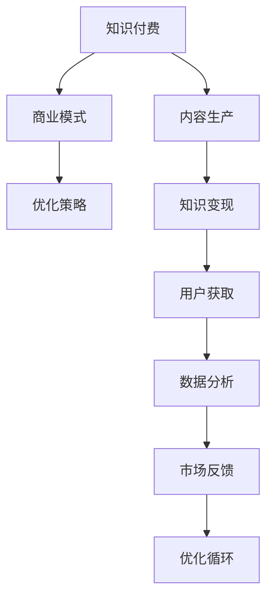

                 

# 知识付费创业的商业模式优化策略

> 关键词：知识付费, 商业模式, 优化策略, 技术驱动, 盈利模式

## 1. 背景介绍

随着移动互联网的迅猛发展和知识爆炸时代的到来，知识付费领域迎来了蓬勃发展。用户对于高质量、有价值知识内容的需求愈发强烈，内容创作者和平台运营商寻求利润空间的需求也在不断上升。因此，知识付费行业成为了连接创作者和消费者，实现知识变现的重要渠道。然而，如何在激烈的市场竞争中生存和发展，实现可持续的商业模式，是知识付费创业公司面临的重要挑战。本文旨在探讨知识付费创业的商业模式优化策略，帮助行业从业者更好地实现盈利和价值。

## 2. 核心概念与联系

### 2.1 核心概念概述

知识付费商业模式优化策略主要涉及以下几个核心概念：

- **知识付费（Knowledge-based Subscription）**：通过在线课程、音频、视频等形式，为用户提供有价值、有深度的知识内容，用户通过订阅、付费购买等方式获取信息。
- **商业模式（Business Model）**：企业创造价值和获取价值的方式，包括价值主张、盈利渠道、成本结构等。
- **优化策略（Optimization Strategy）**：通过技术手段、市场策略等改进现有商业模式，提高效率、增加收益的过程。

这些核心概念之间的关系紧密相连。知识付费作为商业模式的一种形式，需要通过优化策略来提升其市场竞争力和用户价值。优化策略的实施依赖于对市场需求的深入理解、技术应用的精确把握以及对成本结构的精细管理。

### 2.2 核心概念原理和架构的 Mermaid 流程图



在这个流程图表示中，知识付费从内容生产开始，通过知识变现、用户获取等步骤，达到最终的目标——实现盈利。而整个过程在数据分析和市场反馈的基础上，通过优化策略不断优化和改进，形成了一个闭环的优化循环。

## 3. 核心算法原理 & 具体操作步骤

### 3.1 算法原理概述

知识付费商业模式的优化策略主要基于以下算法原理：

- **个性化推荐算法**：通过用户行为数据分析，为用户推荐最感兴趣的内容，提高用户粘性和留存率。
- **流量获取算法**：利用SEO、社交媒体、广告投放等手段，获取更多的用户流量，扩大用户基数。
- **定价策略**：通过动态定价、套餐销售等策略，优化课程定价，提升用户购买意愿。
- **用户体验优化**：通过界面设计、交互优化等手段，提升用户体验，增加用户满意度和转化率。
- **内容更新和迭代**：根据用户反馈和市场变化，不断更新和迭代内容，保持内容的时效性和相关性。

### 3.2 算法步骤详解

知识付费商业模式优化策略的实施步骤主要包括：

1. **市场调研和用户分析**：
   - 通过问卷调查、用户访谈等方式，收集用户需求和行为数据。
   - 分析用户群体的特征、兴趣和消费习惯，制定针对性的内容策略。

2. **内容生产与优化**：
   - 根据市场调研结果，设计有价值的内容，如深度文章、专业课程、音频节目等。
   - 利用数据分析工具监控用户反馈，不断优化内容质量和呈现形式。

3. **流量获取与推广**：
   - 在SEO、社交媒体、广告平台等渠道进行精准投放，吸引潜在用户。
   - 利用优惠活动、免费试用、内容预告等方式，提升内容曝光率和用户参与度。

4. **定价与销售策略**：
   - 根据市场需求和成本结构，设定合理的价格区间。
   - 推出组合套餐、限时折扣等策略，增加用户粘性。

5. **用户获取与留存**：
   - 通过个性化推荐算法，提高用户匹配度和内容满意度。
   - 利用社区建设、互动活动等方式，增强用户归属感和参与感。

6. **数据分析与优化**：
   - 利用数据监控工具，实时追踪用户行为和内容互动情况。
   - 根据数据分析结果，调整内容策略、流量获取和定价策略，形成持续优化的闭环。

### 3.3 算法优缺点

知识付费商业模式优化策略的优点主要包括：

- **精准定位用户需求**：通过数据分析，精准识别用户需求，提供定制化内容。
- **提升用户留存率**：通过个性化推荐和社区建设，增强用户粘性，提升留存率。
- **优化成本结构**：通过流量获取和定价策略，降低获客成本，提高运营效率。

同时，该策略也存在以下缺点：

- **数据依赖性高**：需要依赖大量的用户数据，数据隐私和安全问题不容忽视。
- **市场竞争激烈**：行业竞争日趋激烈，需要不断创新和差异化。
- **内容质量要求高**：高质量内容制作成本高，需要持续投入。
- **技术应用复杂**：需要整合多种技术手段，实施难度大。

### 3.4 算法应用领域

知识付费商业模式优化策略在多个领域具有广泛的应用，包括：

- **教育培训**：在线教育平台的课程设计和推广。
- **职业发展**：职业技能培训和认证课程的销售与推广。
- **健康管理**：健康知识科普和个性化健康计划的推广。
- **财经资讯**：金融市场分析、投资策略等财经内容的销售。
- **艺术文化**：艺术欣赏、文化解读等内容的付费订阅。

这些领域内的知识付费创业公司，通过应用优化策略，可以提高内容质量和用户满意度，降低获客成本，实现可持续盈利。

## 4. 数学模型和公式 & 详细讲解 & 举例说明

### 4.1 数学模型构建

知识付费商业模式的优化策略可以构建为以下数学模型：

$$
\text{Revenue} = \sum_{i}^{N}(\text{C}_i \times \text{U}_i \times \text{P}_i)
$$

其中，$\text{Revenue}$ 为总收益，$\text{C}_i$ 为第 $i$ 内容的用户点击率，$\text{U}_i$ 为第 $i$ 内容的单价，$\text{P}_i$ 为第 $i$ 内容的购买转化率。

### 4.2 公式推导过程

推导上述模型的关键在于理解和量化以下几个因素：

- **内容点击率（$\text{C}_i$）**：用户点击内容的概率，与内容的标题、摘要、推荐位置等有关。
- **单价（$\text{U}_i$）**：课程的价格，根据市场定位和成本结构设定。
- **购买转化率（$\text{P}_i$）**：用户点击内容后，最终购买的概率，受用户粘性、内容质量和促销策略影响。

通过这些因素的优化，可以显著提升平台的整体收益。

### 4.3 案例分析与讲解

以某在线教育平台为例，平台通过个性化推荐算法提升了内容点击率，通过流量获取策略扩大了用户基数，通过动态定价策略优化了单价设置，最终实现了收益的大幅增长。具体实施步骤如下：

1. **内容生产与优化**：平台邀请多位教育专家设计了一系列专业课程，并利用用户行为数据进行内容迭代和优化。
2. **流量获取与推广**：平台在社交媒体、搜索引擎等渠道进行精准投放，并通过免费试用、内容预告等手段吸引用户注册和参与。
3. **定价与销售策略**：平台根据市场需求，设定了合理的课程单价，并推出了限时折扣和组合套餐等策略。
4. **数据分析与优化**：平台利用数据监控工具，实时追踪用户行为，根据数据分析结果，不断调整内容和营销策略。

通过这些步骤，平台不仅吸引了大量新用户，还提升了用户的留存率和转化率，实现了收益的大幅提升。

## 5. 项目实践：代码实例和详细解释说明

### 5.1 开发环境搭建

知识付费平台的开发环境主要包括以下几个关键组件：

- **开发语言**：Python，主要使用Flask或Django等框架进行Web开发。
- **数据库**：MySQL或MongoDB，用于存储用户数据、课程信息等。
- **推荐引擎**：使用Elasticsearch或TensorFlow等工具，实现个性化推荐算法。
- **流量获取工具**：如Google Ads、Facebook Ads等，用于广告投放。
- **数据分析工具**：如Google Analytics、Mixpanel等，用于用户行为追踪和分析。

在搭建环境时，需要注意安全性和可扩展性，采用合适的防火墙和负载均衡策略，确保系统的稳定性和可靠性。

### 5.2 源代码详细实现

以下是一个基于Flask框架的知识付费平台示例代码：

```python
from flask import Flask, render_template, request
from flask_sqlalchemy import SQLAlchemy
from flask_login import LoginManager

app = Flask(__name__)
app.config['SECRET_KEY'] = 'your_secret_key'
app.config['SQLALCHEMY_DATABASE_URI'] = 'sqlite:///dataset.db'
db = SQLAlchemy(app)
login_manager = LoginManager()
login_manager.init_app(app)

# 用户模型
class User(db.Model):
    id = db.Column(db.Integer, primary_key=True)
    username = db.Column(db.String(100), unique=True, nullable=False)
    email = db.Column(db.String(100), unique=True, nullable=False)
    password = db.Column(db.String(100), nullable=False)

# 课程模型
class Course(db.Model):
    id = db.Column(db.Integer, primary_key=True)
    title = db.Column(db.String(100), nullable=False)
    description = db.Column(db.Text, nullable=False)
    price = db.Column(db.Float, nullable=False)
    user_id = db.Column(db.Integer, db.ForeignKey('user.id'), nullable=False)

# 登录相关
@login_manager.user_loader
def load_user(user_id):
    return User.query.get(int(user_id))

@app.route('/')
def index():
    courses = Course.query.all()
    return render_template('index.html', courses=courses)

@app.route('/login', methods=['GET', 'POST'])
def login():
    if request.method == 'POST':
        user = User.query.filter_by(username=request.form['username']).first()
        if user and user.password == request.form['password']:
            login_manager.login_user(user)
            return redirect('/')
    return render_template('login.html')

@app.route('/logout')
@login_required
def logout():
    login_manager.logout_user()
    return redirect('/')

if __name__ == '__main__':
    app.run(debug=True)
```

这段代码实现了基本的用户注册、登录和课程浏览功能。通过扩展，可以加入个性化推荐、课程购买、支付集成等更多功能。

### 5.3 代码解读与分析

上述代码的核心在于以下几个部分：

- **用户模型和课程模型**：用于存储和管理用户和课程信息，是知识付费平台的基础。
- **登录模块**：使用Flask-Login进行用户身份验证，确保用户的登录和退出操作。
- **路由配置**：定义了首页、登录、登出等基本路径，并实现了前后端数据交互。

在实际开发中，需要进一步优化和完善这些模块，例如添加权限控制、加入缓存机制、优化页面加载速度等。

### 5.4 运行结果展示

运行上述代码，可以访问本地服务器的 `localhost:5000`，进入知识付费平台的前端页面。用户可以注册、登录，浏览和购买课程，体验个性化的推荐服务。

## 6. 实际应用场景

### 6.1 在线教育平台

在线教育平台是知识付费的主要应用场景之一。通过优化推荐算法、定价策略和流量获取渠道，平台可以大幅提升课程的点击率、购买率和用户留存率。例如，Coursera、Udacity等平台，通过优化用户体验和个性化推荐，取得了显著的商业成功。

### 6.2 职业培训平台

职业培训平台在知识付费领域也有广泛应用。平台利用专业课程和认证体系，满足企业员工的技能提升需求，提高企业的整体竞争力。例如，LinkedIn Learning通过高质量的课程内容和个性化的学习路径设计，实现了用户的高粘性和高转化率。

### 6.3 健康管理应用

健康管理应用是知识付费的另一重要领域。通过提供科学的健康知识、个性化的健康计划和健康咨询，应用可以显著提高用户的生活质量和健康水平。例如，Fitbit应用通过个性化推荐和行为追踪，帮助用户实现健康目标。

### 6.4 财经资讯平台

财经资讯平台主要面向投资者提供市场分析和投资策略等专业知识。通过精准推荐和实时更新，平台可以吸引大量专业投资者，提升平台的市场价值。例如，Bloomberg通过深度分析和市场洞察，为用户提供高质量的财经资讯服务。

## 7. 工具和资源推荐

### 7.1 学习资源推荐

1. **《知识付费盈利模式详解》**：详细剖析了知识付费行业的盈利模式，包括内容生产、流量获取、用户转化等关键环节，适合从业者参考。
2. **Coursera知识付费模式报告**：分析了Coursera等平台在知识付费领域的成功经验，提供了宝贵的行业洞察。
3. **Udacity个性化推荐算法**：介绍了Udacity如何利用推荐算法提升用户体验和留存率。
4. **LinkedIn Learning的用户行为分析**：展示了LinkedIn Learning如何通过数据驱动决策，优化平台的用户体验。

### 7.2 开发工具推荐

1. **Flask和Django**：Python开发框架，简单易用，适合Web应用开发。
2. **MySQL和MongoDB**：关系型和文档型数据库，用于存储和管理用户和课程数据。
3. **Elasticsearch**：搜索和推荐引擎，用于个性化推荐和用户行为追踪。
4. **Google Ads和Facebook Ads**：广告投放平台，用于流量获取和推广。
5. **Google Analytics和Mixpanel**：数据分析工具，用于用户行为追踪和分析。

### 7.3 相关论文推荐

1. **《知识付费商业模式的优化策略》**：研究了知识付费平台的内容生产、流量获取和用户留存策略，提出了多维度优化方法。
2. **《基于推荐算法的知识付费平台用户留存分析》**：分析了推荐算法对知识付费平台用户留存率的影响，提出了优化策略。
3. **《知识付费平台的动态定价模型》**：研究了动态定价策略在知识付费平台中的应用，提出了多因素定价模型。
4. **《社交媒体在知识付费平台中的应用》**：探讨了社交媒体如何帮助知识付费平台获取用户流量，提升平台曝光率。

## 8. 总结：未来发展趋势与挑战

### 8.1 总结

知识付费商业模式优化策略在知识付费行业中发挥了重要作用。通过个性化推荐、流量获取、定价策略和用户体验优化等手段，平台可以有效提升内容质量和用户粘性，实现盈利和价值。然而，知识付费行业仍面临诸多挑战，如数据隐私、市场竞争、内容质量和技术应用等问题。未来的发展需要从多个维度进行持续创新和优化。

### 8.2 未来发展趋势

知识付费行业的未来发展趋势包括：

- **技术驱动**：大数据、AI等技术将进一步推动知识付费平台的智能化和个性化，提升用户体验。
- **内容多样化**：除了传统的课程和文章，视频、音频、互动直播等形式的内容将更受欢迎。
- **用户互动增强**：通过社区建设、直播互动等方式，增强用户参与感和粘性。
- **多元化变现**：除了课程销售，衍生品、会员服务、广告等多元化变现方式将逐步普及。

### 8.3 面临的挑战

尽管知识付费商业模式优化策略取得了一定的成效，但仍面临以下挑战：

- **数据隐私和安全**：用户数据隐私和安全问题不容忽视，需加强数据保护和隐私管理。
- **市场竞争激烈**：行业内竞争日趋激烈，需不断创新和差异化。
- **内容质量和制作成本**：高质量内容制作成本高，需持续投入。
- **技术应用复杂**：需整合多种技术手段，实施难度大。

### 8.4 研究展望

未来研究需要在以下几个方向上寻求新的突破：

- **数据驱动的用户行为分析**：利用大数据和机器学习技术，深入挖掘用户行为和需求，实现更精准的内容推荐和定价策略。
- **跨平台内容共享**：打破平台之间的数据壁垒，实现内容的跨平台共享和推荐，提升用户粘性和平台竞争力。
- **多元化推荐算法**：结合深度学习、协同过滤等推荐算法，实现更高效的用户匹配和内容推荐。
- **隐私保护技术**：研究隐私保护技术，确保用户数据安全和隐私保护。

## 9. 附录：常见问题与解答

### Q1: 知识付费平台如何提升用户粘性？

A: 知识付费平台提升用户粘性主要通过以下策略：
1. **个性化推荐**：通过用户行为数据分析，为用户推荐最感兴趣的内容，提高用户匹配度和内容满意度。
2. **社区建设**：利用社区讨论、互动问答等方式，增强用户归属感和参与感。
3. **用户激励**：通过积分系统、优惠券等激励机制，鼓励用户参与和学习。

### Q2: 知识付费平台如何降低获客成本？

A: 知识付费平台降低获客成本主要通过以下策略：
1. **精准广告投放**：在搜索引擎、社交媒体等渠道进行精准投放，吸引潜在用户。
2. **免费试用**：提供免费试用课程或章节，吸引用户注册和参与。
3. **内容预告**：通过预告活动、专家讲座等方式，提升内容曝光率和用户参与度。

### Q3: 知识付费平台的课程定价策略有哪些？

A: 知识付费平台的课程定价策略主要包括以下几种：
1. **动态定价**：根据市场需求和课程价值动态调整价格，提高收益。
2. **套餐销售**：推出组合套餐和订阅计划，增加用户粘性和留存率。
3. **限时折扣**：通过限时折扣和促销活动，吸引用户购买。

### Q4: 知识付费平台如何提升内容质量？

A: 知识付费平台提升内容质量主要通过以下策略：
1. **专业合作**：与教育专家和行业领袖合作，设计和制作高质量内容。
2. **用户反馈**：利用用户反馈和评论，不断优化和迭代内容。
3. **数据监控**：利用数据监控工具，实时追踪用户行为和内容互动情况，根据数据分析结果，调整内容策略。

### Q5: 知识付费平台如何处理数据隐私和安全问题？

A: 知识付费平台处理数据隐私和安全问题主要通过以下策略：
1. **数据加密**：对用户数据进行加密存储和传输，确保数据安全。
2. **权限控制**：设置严格的权限控制，确保只有授权用户才能访问数据。
3. **合规检查**：定期进行合规检查，确保符合相关法律法规和行业标准。

---

作者：禅与计算机程序设计艺术 / Zen and the Art of Computer Programming

