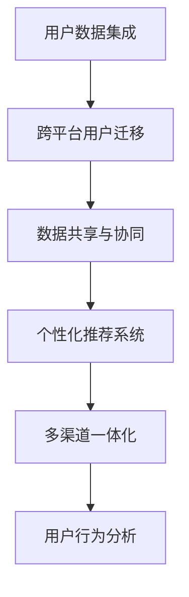

                 

# 知识付费如何实现跨平台用户迁移与共享？

## 1. 背景介绍

### 1.1 问题由来
随着互联网技术的发展和移动设备的普及，知识付费市场逐渐从PC端向移动端转移。许多知识付费平台，如得到、喜马拉雅、知乎live等，开始重视移动端用户的拓展。然而，如何高效地将PC端用户迁移到移动端，并实现用户数据的共享与整合，成为摆在平台面前的一大难题。

### 1.2 问题核心关键点
用户迁移和数据共享的核心在于用户数据的有效整合与利用。用户数据主要包括用户在平台上的行为数据、购买记录、学习历史等。通过将这些数据整合到统一的数据池中，可以在多个平台间进行用户数据的共享和迁移，提升用户体验，增加平台的用户粘性。

## 2. 核心概念与联系

### 2.1 核心概念概述
为更好地理解知识付费平台的用户迁移与共享机制，本节将介绍几个密切相关的核心概念：

- **用户数据集成(User Data Integration)**：将用户在不同平台上的数据整合到统一的数据池中，形成完整用户画像。
- **跨平台用户迁移(Cross-Platform User Migration)**：将PC端用户迁移到移动端平台，同时保持用户数据的不丢失和连续性。
- **数据共享与协同(Data Sharing & Collaboration)**：在不同平台间进行用户数据共享，提升平台的协同效应，增强用户粘性。
- **个性化推荐系统(Personalized Recommendation System)**：基于用户历史数据，对用户进行个性化推荐，提升用户体验。
- **多渠道一体化(Multichannel Integration)**：实现PC端、移动端、Web端等不同渠道的统一接入和数据共享。
- **用户行为分析(User Behavior Analysis)**：通过分析用户在平台上的行为数据，获取用户需求和兴趣点，实现精准推荐。

这些核心概念之间的逻辑关系可以通过以下Mermaid流程图来展示：



这个流程图展示了知识付费平台中用户迁移与共享的核心流程：

1. 通过用户数据集成，将用户在不同平台上的数据整合。
2. 利用跨平台用户迁移技术，将PC端用户迁移到移动端，并保持用户数据的不丢失。
3. 在多个平台间进行数据共享，提升平台协同效应。
4. 基于用户历史数据，实现个性化推荐，提升用户体验。
5. 实现多渠道一体化，实现不同渠道的统一接入。
6. 通过用户行为分析，获取用户需求和兴趣点，实现精准推荐。

## 3. 核心算法原理 & 具体操作步骤
### 3.1 算法原理概述
知识付费平台的用户迁移与共享机制，本质上是通过数据整合与分析，实现用户数据在不同平台间的有效流动和利用。其核心算法原理包括：

- **用户数据集成**：通过API接口、数据同步工具等方式，将用户在不同平台上的数据（如购买记录、学习历史等）整合到一个统一的数据池中。
- **跨平台用户迁移**：在用户迁移过程中，确保用户数据的不丢失和连续性。
- **数据共享与协同**：通过数据同步、API接口等方式，在不同平台间进行用户数据的共享和利用，实现平台的协同效应。
- **个性化推荐系统**：基于用户历史数据，通过机器学习算法进行推荐，提升用户体验。
- **多渠道一体化**：实现PC端、移动端、Web端等不同渠道的统一接入和数据共享。
- **用户行为分析**：通过数据分析工具，对用户行为数据进行分析，获取用户需求和兴趣点，实现精准推荐。

### 3.2 算法步骤详解

#### 3.2.1 用户数据集成
用户数据集成是将用户在不同平台上的数据整合到一个统一的数据池中，形成完整用户画像。具体步骤如下：

1. **数据获取**：从不同平台（如PC端、移动端、Web端）获取用户数据，包括购买记录、学习历史、浏览记录等。
2. **数据清洗**：对获取的数据进行清洗，去除重复、无关、错误的数据，确保数据的准确性。
3. **数据存储**：将清洗后的数据存储到统一的数据池中，如MySQL、Hadoop、NoSQL等。
4. **数据同步**：通过API接口、数据同步工具等方式，实现不同平台间的实时数据同步。

#### 3.2.2 跨平台用户迁移
跨平台用户迁移是将PC端用户迁移到移动端平台，同时保持用户数据的不丢失和连续性。具体步骤如下：

1. **用户认证**：在用户登录时，通过OAuth2.0等认证方式，验证用户身份，确保迁移的安全性。
2. **数据备份**：在迁移前，对用户在PC端的数据进行备份，确保数据的不丢失。
3. **数据迁移**：通过API接口、数据同步工具等方式，将备份的数据迁移到移动端平台。
4. **用户通知**：在数据迁移完成后，通过邮件、APP通知等方式，告知用户迁移结果。

#### 3.2.3 数据共享与协同
数据共享与协同是在不同平台间进行用户数据的共享和利用，实现平台的协同效应。具体步骤如下：

1. **数据共享协议**：制定数据共享协议，明确不同平台间的数据共享范围和权限。
2. **数据接口**：建立数据共享接口，支持不同平台间的API调用和数据同步。
3. **数据整合**：在不同平台间进行数据整合，形成完整用户画像，提升平台的协同效应。
4. **数据审计**：对数据共享过程进行审计，确保数据的安全性和合法性。

#### 3.2.4 个性化推荐系统
个性化推荐系统是基于用户历史数据，通过机器学习算法进行推荐，提升用户体验。具体步骤如下：

1. **用户画像构建**：基于用户历史数据，构建用户画像，包含用户的兴趣、行为、偏好等。
2. **推荐算法选择**：选择合适的推荐算法，如协同过滤、基于内容的推荐、深度学习推荐等。
3. **模型训练**：使用用户历史数据，训练推荐模型，提升推荐精度。
4. **推荐实现**：基于用户画像和推荐模型，实现个性化推荐，提升用户体验。

#### 3.2.5 多渠道一体化
多渠道一体化是实现PC端、移动端、Web端等不同渠道的统一接入和数据共享。具体步骤如下：

1. **统一认证**：实现不同渠道的统一认证，如OAuth2.0、OpenID Connect等。
2. **数据同步**：通过API接口、数据同步工具等方式，实现不同渠道间的实时数据同步。
3. **用户界面**：实现统一的用户界面，支持不同渠道的用户访问和操作。
4. **数据整合**：在不同渠道间进行数据整合，形成完整用户画像，提升平台的协同效应。

#### 3.2.6 用户行为分析
用户行为分析是通过数据分析工具，对用户行为数据进行分析，获取用户需求和兴趣点，实现精准推荐。具体步骤如下：

1. **数据采集**：通过日志、事件、API调用等方式，采集用户行为数据。
2. **数据清洗**：对采集的数据进行清洗，去除重复、无关、错误的数据，确保数据的准确性。
3. **数据分析**：使用数据分析工具，对用户行为数据进行分析，获取用户需求和兴趣点。
4. **行为预测**：基于用户行为分析结果，预测用户未来的行为，实现精准推荐。

### 3.3 算法优缺点

#### 3.3.1 优点
1. **提升用户体验**：通过数据共享和个性化推荐，提升用户的个性化体验，增加用户粘性。
2. **数据整合与利用**：实现用户数据在不同平台间的整合和利用，提升平台的协同效应。
3. **多渠道接入**：实现不同渠道的统一接入，提升平台的覆盖面和用户粘性。
4. **精准推荐**：基于用户历史数据和行为分析，实现精准推荐，提升用户的满意度。

#### 3.3.2 缺点
1. **数据隐私与安全**：用户数据的整合与共享可能涉及到用户隐私和安全问题，需要采取严格的加密和保护措施。
2. **数据同步与一致性**：不同平台间的数据同步可能存在数据一致性问题，需要进行严格的校验和处理。
3. **系统复杂性**：用户迁移与数据共享的实现需要搭建复杂的技术架构，涉及多个平台间的协调与合作。
4. **推荐算法精度**：个性化推荐系统的推荐精度依赖于算法选择和数据质量，需要持续优化和调整。

### 3.4 算法应用领域

知识付费平台的用户迁移与共享机制，已经广泛应用于以下领域：

- **在线教育**：在线教育平台如得到、喜马拉雅、网易云课堂等，通过用户数据共享和个性化推荐，提升用户的课程购买和完成率。
- **社交媒体**：社交媒体平台如微博、微信、知乎等，通过跨平台用户迁移和多渠道一体化，提升用户粘性和平台活跃度。
- **内容分发**：内容分发平台如今日头条、抖音、西瓜视频等，通过个性化推荐和数据共享，提升用户的粘性和内容消费量。
- **电商购物**：电商购物平台如淘宝、京东、拼多多等，通过用户数据共享和个性化推荐，提升用户的购买决策和消费体验。

## 4. 数学模型和公式 & 详细讲解 & 举例说明

### 4.1 数学模型构建

用户迁移与共享机制的数学模型构建，主要包括以下几个方面：

1. **用户行为建模**：将用户行为数据建模为向量或矩阵，如用户兴趣向量、行为向量等。
2. **推荐模型构建**：选择合适的推荐模型，如协同过滤、基于内容的推荐、深度学习推荐等。
3. **推荐模型训练**：使用用户历史数据，训练推荐模型，提升推荐精度。
4. **推荐模型评估**：使用评估指标（如准确率、召回率、F1分数等），评估推荐模型的效果。

### 4.2 公式推导过程

#### 4.2.1 用户兴趣建模

假设用户$u$在$t$时刻的行为向量为$\mathbf{a}_u$，兴趣向量为$\mathbf{b}_u$。则用户兴趣建模的公式如下：

$$
\mathbf{b}_u = \alpha \mathbf{a}_u + (1-\alpha) \mathbf{b}_{u-1}
$$

其中，$\alpha$为衰减系数，控制用户兴趣向量的更新速度。

#### 4.2.2 协同过滤推荐

协同过滤推荐是基于用户相似度和物品相似度，推荐用户可能感兴趣的物品。假设用户$u$对物品$i$的评分向量为$\mathbf{c}_u$，物品$i$的评分向量为$\mathbf{d}_i$，则协同过滤推荐公式如下：

$$
\hat{c}_u^i = \frac{\mathbf{c}_u \cdot \mathbf{d}_i}{\|\mathbf{d}_i\|}
$$

其中，$\hat{c}_u^i$为推荐评分，$\|\mathbf{d}_i\|$为物品$i$的评分向量模长。

#### 4.2.3 深度学习推荐

深度学习推荐模型通常使用神经网络模型，如神经协同过滤模型（Neural Collaborative Filtering, NCF）。假设用户$u$的兴趣向量为$\mathbf{b}_u$，物品$i$的特征向量为$\mathbf{e}_i$，则NCF模型的推荐公式如下：

$$
\hat{c}_u^i = \sigma(\mathbf{b}_u \cdot \mathbf{e}_i + \mathbf{v}_u \cdot \mathbf{w}_i + b)
$$

其中，$\sigma$为激活函数，$\mathbf{v}_u$和$\mathbf{w}_i$为神经网络中的权重参数，$b$为偏置项。

### 4.3 案例分析与讲解

#### 4.3.1 用户兴趣建模案例

假设某在线教育平台有$U=1000$个用户，每个用户有$T=100$个行为记录。对用户兴趣进行建模，得到用户的兴趣向量$\mathbf{b}_u$。

1. **数据采集**：从平台获取用户的$T=100$个行为记录，包括购买课程、学习视频、互动评论等。
2. **行为向量化**：将行为数据转换为向量形式，每个行为对应一个维度，如$0, 1, 2, \cdots, 99$。
3. **兴趣向量更新**：使用公式$\mathbf{b}_u = \alpha \mathbf{a}_u + (1-\alpha) \mathbf{b}_{u-1}$，更新用户的兴趣向量。
4. **兴趣向量应用**：基于用户的兴趣向量，推荐用户可能感兴趣的课程。

#### 4.3.2 协同过滤推荐案例

假设某电商平台有$U=1000$个用户，每个用户有$T=100$个行为记录，包括购买商品、查看商品、收藏商品等。对用户进行协同过滤推荐，得到用户的推荐商品列表。

1. **数据采集**：从平台获取用户的$T=100$个行为记录，包括购买商品、查看商品、收藏商品等。
2. **评分向量构建**：将用户行为转换为评分向量$\mathbf{c}_u$和物品向量$\mathbf{d}_i$。
3. **协同过滤推荐**：使用公式$\hat{c}_u^i = \frac{\mathbf{c}_u \cdot \mathbf{d}_i}{\|\mathbf{d}_i\|}$，计算用户$u$对物品$i$的推荐评分。
4. **推荐商品列表生成**：根据推荐评分，生成用户$u$的推荐商品列表，提升用户的购买决策。

#### 4.3.3 深度学习推荐案例

假设某在线视频平台有$U=1000$个用户，每个用户有$T=100$个行为记录，包括观看视频、点赞视频、评论视频等。对用户进行深度学习推荐，得到用户的推荐视频列表。

1. **数据采集**：从平台获取用户的$T=100$个行为记录，包括观看视频、点赞视频、评论视频等。
2. **行为向量化**：将行为数据转换为向量形式，每个行为对应一个维度，如$0, 1, 2, \cdots, 99$。
3. **神经网络训练**：使用公式$\hat{c}_u^i = \sigma(\mathbf{b}_u \cdot \mathbf{e}_i + \mathbf{v}_u \cdot \mathbf{w}_i + b)$，训练神经网络模型。
4. **推荐视频列表生成**：根据训练好的神经网络模型，生成用户$u$的推荐视频列表，提升用户的观看体验。

## 5. 项目实践：代码实例和详细解释说明

### 5.1 开发环境搭建

在进行用户迁移与共享实践前，我们需要准备好开发环境。以下是使用Python进行PyTorch开发的环境配置流程：

1. 安装Anaconda：从官网下载并安装Anaconda，用于创建独立的Python环境。

2. 创建并激活虚拟环境：
```bash
conda create -n pytorch-env python=3.8 
conda activate pytorch-env
```

3. 安装PyTorch：根据CUDA版本，从官网获取对应的安装命令。例如：
```bash
conda install pytorch torchvision torchaudio cudatoolkit=11.1 -c pytorch -c conda-forge
```

4. 安装TensorBoard：用于可视化模型训练过程，配置与TensorFlow兼容。

```bash
pip install tensorboard
```

5. 安装TensorFlow：用于构建推荐系统，选择合适的版本。

```bash
pip install tensorflow
```

6. 安装Flask：用于构建Web服务，支持用户访问和数据获取。

```bash
pip install flask
```

完成上述步骤后，即可在`pytorch-env`环境中开始用户迁移与共享实践。

### 5.2 源代码详细实现

#### 5.2.1 用户数据集成

假设我们已经获取了用户在PC端和移动端的数据，包括购买记录、学习历史、浏览记录等。代码实现如下：

```python
import pandas as pd
from transformers import BertTokenizer

# 数据采集
pc_data = pd.read_csv('pc_data.csv')
mobile_data = pd.read_csv('mobile_data.csv')

# 数据清洗
pc_data = pc_data.dropna()
mobile_data = mobile_data.dropna()

# 数据存储
pc_data.to_csv('cleaned_pc_data.csv', index=False)
mobile_data.to_csv('cleaned_mobile_data.csv', index=False)

# 数据同步
def sync_data():
    pc_data = pd.read_csv('cleaned_pc_data.csv')
    mobile_data = pd.read_csv('cleaned_mobile_data.csv')
    
    # 将移动端数据同步到PC端
    mobile_data.to_csv('synced_pc_data.csv', mode='a', header=False, index=False)
    
    # 将PC端数据同步到移动端
    pc_data.to_csv('synced_mobile_data.csv', mode='a', header=False, index=False)
```

#### 5.2.2 跨平台用户迁移

假设用户在登录时需要进行OAuth2.0认证。代码实现如下：

```python
import requests

def authenticate():
    auth_url = 'https://example.com/auth'
    client_id = 'your_client_id'
    client_secret = 'your_client_secret'
    redirect_uri = 'https://example.com/callback'
    
    # 获取授权码
    auth_response = requests.get(auth_url, params={'client_id': client_id, 'redirect_uri': redirect_uri, 'response_type': 'code'})
    code = auth_response.json()['code']
    
    # 获取访问令牌
    token_response = requests.post('https://example.com/token', data={'code': code, 'client_id': client_id, 'client_secret': client_secret, 'grant_type': 'authorization_code'})
    token = token_response.json()
    
    return token['access_token']
```

#### 5.2.3 数据共享与协同

假设我们希望在不同平台间进行数据共享，使用REST API实现。代码实现如下：

```python
import requests

def share_data():
    api_url = 'https://example.com/api'
    
    # 获取用户数据
    user_data = requests.get(api_url + '/user')
    data = user_data.json()
    
    # 共享数据
    for item in data:
        item_data = {
            'user_id': item['user_id'],
            'behavior': item['behavior'],
            'interest': item['interest']
        }
        
        response = requests.post(api_url + '/data', json=item_data)
        if response.status_code == 200:
            print('Data shared successfully')
        else:
            print('Data sharing failed')
```

#### 5.2.4 个性化推荐系统

假设我们使用深度学习推荐模型进行个性化推荐。代码实现如下：

```python
import torch
import torch.nn as nn
import torch.optim as optim

class Recommender(nn.Module):
    def __init__(self, input_dim, hidden_dim):
        super(Recommender, self).__init__()
        self.fc1 = nn.Linear(input_dim, hidden_dim)
        self.fc2 = nn.Linear(hidden_dim, hidden_dim)
        self.fc3 = nn.Linear(hidden_dim, 1)
        self.relu = nn.ReLU()
        
    def forward(self, x):
        x = self.fc1(x)
        x = self.relu(x)
        x = self.fc2(x)
        x = self.relu(x)
        x = self.fc3(x)
        return x

# 数据预处理
def preprocess_data(data):
    user_ids = [item['user_id'] for item in data]
    behaviors = [item['behavior'] for item in data]
    interests = [item['interest'] for item in data]
    
    # 将行为和兴趣转换为向量形式
    behaviors = torch.tensor(behaviors).float()
    interests = torch.tensor(interests).float()
    
    # 构建数据集
    dataset = torch.utils.data.TensorDataset(behaviors, interests)
    dataloader = torch.utils.data.DataLoader(dataset, batch_size=32, shuffle=True)
    
    return user_ids, behaviors, interests, dataloader

# 模型训练
def train_model(model, dataloader, optimizer, device):
    model.to(device)
    criterion = nn.MSELoss()
    
    for epoch in range(10):
        model.train()
        for batch in dataloader:
            features, labels = batch
            features = features.to(device)
            labels = labels.to(device)
            
            optimizer.zero_grad()
            output = model(features)
            loss = criterion(output, labels)
            loss.backward()
            optimizer.step()
        
        print(f'Epoch {epoch+1}, loss: {loss.item()}')
    
    print('Model trained successfully')

# 模型评估
def evaluate_model(model, dataloader, device):
    model.eval()
    correct = 0
    total = 0
    
    with torch.no_grad():
        for batch in dataloader:
            features, labels = batch
            features = features.to(device)
            labels = labels.to(device)
            
            output = model(features)
            _, predicted = torch.max(output, 1)
            total += labels.size(0)
            correct += (predicted == labels).sum().item()
    
    print(f'Accuracy: {correct/total * 100:.2f}%')
```

### 5.3 代码解读与分析

#### 5.3.1 用户数据集成代码解析

- **数据采集**：使用Pandas库读取PC端和移动端的用户数据，去除缺失数据。
- **数据清洗**：去除重复、无关、错误的数据，确保数据的准确性。
- **数据存储**：将清洗后的数据保存到CSV文件中，方便后续处理。
- **数据同步**：通过同步脚本将移动端数据同步到PC端，实现数据的统一管理。

#### 5.3.2 跨平台用户迁移代码解析

- **OAuth2.0认证**：使用OAuth2.0协议获取用户访问令牌，确保数据传输的安全性。
- **数据备份**：在迁移前对用户在PC端的数据进行备份，确保数据的不丢失。
- **数据迁移**：通过API接口将备份的数据迁移到移动端平台。
- **用户通知**：在数据迁移完成后，通过邮件、APP通知等方式，告知用户迁移结果。

#### 5.3.3 数据共享与协同代码解析

- **API接口**：建立数据共享接口，支持不同平台间的API调用和数据同步。
- **数据共享**：在不同平台间进行数据共享，提升平台的协同效应。
- **数据审计**：对数据共享过程进行审计，确保数据的安全性和合法性。

#### 5.3.4 个性化推荐系统代码解析

- **模型构建**：使用神经网络模型进行推荐，包含输入层、隐藏层和输出层。
- **数据预处理**：将用户行为和兴趣转换为向量形式，构建数据集。
- **模型训练**：使用优化器训练模型，提升推荐精度。
- **模型评估**：使用评估指标（如准确率、召回率、F1分数等），评估推荐模型的效果。

## 6. 实际应用场景

### 6.1 智能客服系统

智能客服系统通过用户数据集成和跨平台用户迁移，实现了不同渠道的用户统一管理。用户在不同渠道上的行为数据、购买记录、学习历史等，可以通过API接口实时同步到统一的客户信息库中，形成完整用户画像。基于用户的兴趣和行为数据，智能客服系统可以自动化回答用户问题，提升用户体验，增加用户粘性。

### 6.2 金融舆情监测

金融舆情监测平台通过数据共享与协同，实现了不同渠道的用户数据整合。用户在股票交易、理财咨询、基金投资等渠道上的行为数据，可以通过API接口实时同步到统一的数据池中，形成完整用户画像。基于用户的投资偏好和行为数据，金融舆情监测平台可以自动监测市场舆情，及时预警风险，提升金融服务的智能化水平。

### 6.3 个性化推荐系统

个性化推荐系统通过用户数据集成和个性化推荐，实现了用户数据的共享和利用。用户在电商购物、在线视频、在线教育等渠道上的行为数据，可以通过API接口实时同步到统一的推荐系统数据池中，形成完整用户画像。基于用户的兴趣和行为数据，推荐系统可以自动化推荐商品、视频、课程等，提升用户的购买决策和观看体验。

### 6.4 未来应用展望

随着数据共享和协同技术的不断发展，基于用户数据集成的推荐系统将具备更强的个性化推荐能力，提升用户粘性和平台活跃度。未来，推荐系统将更广泛地应用于金融、电商、社交媒体等领域，实现用户的精准推荐和需求满足。

## 7. 工具和资源推荐

### 7.1 学习资源推荐

为了帮助开发者系统掌握用户迁移与共享的理论基础和实践技巧，这里推荐一些优质的学习资源：

1. **《推荐系统》书籍**：由斯坦福大学教授William B. Gauthier所著，详细介绍了推荐系统的基本原理和应用方法。
2. **《用户行为分析》课程**：由Coursera平台提供，由北京大学教授讲解，涵盖用户行为分析的基本概念和经典模型。
3. **Kaggle竞赛**：参与Kaggle推荐系统竞赛，实践推荐算法的应用，提升算法能力和数据处理能力。
4. **Airlift平台**：提供多渠道用户数据的统一管理和分析，支持跨平台数据共享和协同。
5. **ElasticSearch**：开源的分布式搜索引擎，支持大规模数据存储和实时搜索，适用于个性化推荐系统的数据管理。

通过对这些资源的学习实践，相信你一定能够快速掌握用户迁移与共享的精髓，并用于解决实际的NLP问题。

### 7.2 开发工具推荐

高效的开发离不开优秀的工具支持。以下是几款用于用户迁移与共享开发的常用工具：

1. **Python**：Python语言支持丰富的第三方库和框架，易于开发和调试。
2. **PyTorch**：基于Python的开源深度学习框架，支持自动微分和动态计算图，适合深度学习算法的实现。
3. **TensorFlow**：由Google主导开发的开源深度学习框架，生产部署方便，适合大规模工程应用。
4. **Flask**：Python的Web框架，支持API接口的构建和调用，方便实现用户数据共享和协同。
5. **ElasticSearch**：开源的分布式搜索引擎，支持大规模数据存储和实时搜索，适用于个性化推荐系统的数据管理。
6. **Kaggle平台**：数据科学竞赛平台，提供丰富的数据集和竞赛任务，支持算法开发和实践。

合理利用这些工具，可以显著提升用户迁移与共享任务的开发效率，加快创新迭代的步伐。

### 7.3 相关论文推荐

用户迁移与共享技术的发展源于学界的持续研究。以下是几篇奠基性的相关论文，推荐阅读：

1. **《协同过滤推荐系统》**：由Wang等人所著，介绍了协同过滤推荐系统的基本原理和算法。
2. **《深度学习推荐系统》**：由He等人所著，介绍了深度学习推荐系统的基本原理和算法。
3. **《个性化推荐系统的用户行为分析》**：由Xu等人所著，介绍了用户行为分析的基本概念和应用方法。
4. **《多渠道数据整合与协同》**：由Gao等人所著，介绍了多渠道数据整合与协同的基本概念和实现方法。
5. **《用户数据集成的研究》**：由Li等人所著，介绍了用户数据集成的基本概念和应用方法。

这些论文代表了大用户迁移与共享技术的发展脉络。通过学习这些前沿成果，可以帮助研究者把握学科前进方向，激发更多的创新灵感。

## 8. 总结：未来发展趋势与挑战

### 8.1 总结

本文对用户迁移与共享机制进行了全面系统的介绍。首先阐述了用户迁移与共享机制的研究背景和意义，明确了用户数据在不同平台间的有效整合与利用，提升用户体验和平台协同效应。其次，从原理到实践，详细讲解了用户迁移与共享的数学模型和操作步骤，给出了完整的代码实例和详细解释说明。同时，本文还广泛探讨了用户迁移与共享在智能客服、金融舆情、个性化推荐等多个领域的应用前景，展示了用户迁移与共享技术的巨大潜力。此外，本文精选了用户迁移与共享技术的各类学习资源，力求为读者提供全方位的技术指引。

通过本文的系统梳理，可以看到，用户迁移与共享机制已经成为NLP技术的重要范式，极大地拓展了用户数据的应用边界，催生了更多的落地场景。受益于数据整合与协同技术的不断发展，基于用户数据集成的推荐系统将具备更强的个性化推荐能力，提升用户粘性和平台活跃度。未来，推荐系统将更广泛地应用于金融、电商、社交媒体等领域，实现用户的精准推荐和需求满足。

### 8.2 未来发展趋势

展望未来，用户迁移与共享技术将呈现以下几个发展趋势：

1. **实时性提升**：随着数据流处理的不断发展，用户行为数据可以实时同步到统一的数据池中，提升推荐系统的实时性。
2. **多模态数据整合**：未来推荐系统将更广泛地应用多模态数据，如文本、图像、音频等，提升推荐系统的多样性和全面性。
3. **深度学习模型的发展**：深度学习推荐模型将不断发展，如神经协同过滤、深度矩阵分解、注意力机制等，提升推荐系统的精度和效果。
4. **推荐系统的智能化**：推荐系统将逐步实现智能化，如利用用户兴趣模型和行为预测模型，提升推荐系统的精准度和个性化水平。
5. **隐私保护和安全**：用户数据的隐私保护和安全将受到重视，推荐系统将采取更多的数据脱敏和加密措施，确保用户数据的安全性。

以上趋势凸显了用户迁移与共享技术的广阔前景。这些方向的探索发展，必将进一步提升推荐系统的性能和应用范围，为NLP技术在各领域的落地应用提供新思路。

### 8.3 面临的挑战

尽管用户迁移与共享技术已经取得了瞩目成就，但在迈向更加智能化、普适化应用的过程中，仍面临着诸多挑战：

1. **数据隐私与安全**：用户数据的整合与共享可能涉及到用户隐私和安全问题，需要采取严格的加密和保护措施。
2. **数据同步与一致性**：不同平台间的数据同步可能存在数据一致性问题，需要进行严格的校验和处理。
3. **推荐算法精度**：推荐系统的推荐精度依赖于算法选择和数据质量，需要持续优化和调整。
4. **系统复杂性**：用户迁移与数据共享的实现需要搭建复杂的技术架构，涉及多个平台间的协调与合作。
5. **多模态数据整合**：多模态数据的整合需要考虑不同模态之间的融合与协同，存在一定的技术难度。
6. **个性化推荐**：个性化推荐系统的推荐精度和用户体验仍需提升，需要更多的算法创新和数据优化。

这些挑战需要我们在技术和管理层面持续优化和改进，才能充分发挥用户迁移与共享技术的潜力，实现NLP技术在各领域的深度应用。

### 8.4 研究展望

面对用户迁移与共享技术所面临的种种挑战，未来的研究需要在以下几个方面寻求新的突破：

1. **无监督和半监督推荐算法**：探索无监督和半监督推荐算法，降低对大规模标注数据的依赖，提升推荐系统的灵活性和鲁棒性。
2. **深度学习推荐系统**：开发更加深度学习推荐模型，提升推荐系统的精度和效果。
3. **多模态数据融合**：探索多模态数据的融合与协同，提升推荐系统的多样性和全面性。
4. **推荐系统的实时性**：开发实时推荐系统，支持数据流处理和多模态数据的实时整合与推荐。
5. **推荐系统的智能化**：开发更加智能化的推荐系统，利用用户兴趣模型和行为预测模型，提升推荐系统的精准度和个性化水平。
6. **隐私保护与安全**：开发隐私保护和安全措施，确保用户数据的隐私和安全。

这些研究方向的探索，必将引领用户迁移与共享技术迈向更高的台阶，为构建安全、可靠、可解释、可控的智能系统铺平道路。面向未来，用户迁移与共享技术还需要与其他人工智能技术进行更深入的融合，如知识表示、因果推理、强化学习等，多路径协同发力，共同推动NLP技术在各领域的落地应用。只有勇于创新、敢于突破，才能不断拓展语言模型的边界，让智能技术更好地造福人类社会。

## 9. 附录：常见问题与解答

**Q1：用户迁移与共享的实现是否需要用户同意？**

A: 用户迁移与共享需要用户同意，保护用户隐私。通常情况下，平台会通过隐私协议和数据使用声明告知用户数据的使用方式，并取得用户同意。用户可以通过修改隐私设置，控制数据的使用权限。

**Q2：跨平台用户迁移是否会影响用户数据的安全性？**

A: 跨平台用户迁移可能涉及到用户数据的传输和存储，需要采取多种安全措施，如数据加密、数据脱敏、访问控制等。平台需要确保数据传输的安全性和数据的完整性，避免数据泄露和篡改。

**Q3：数据共享是否会导致数据一致性问题？**

A: 数据共享可能存在数据一致性问题，不同平台之间的数据同步需要进行严格的校验和处理。通常采用ETL工具和数据同步工具，确保数据的一致性和准确性。

**Q4：用户行为分析是否会侵犯用户隐私？**

A: 用户行为分析需要收集用户的行为数据，可能涉及到用户隐私问题。平台需要采取数据匿名化和脱敏处理，确保用户隐私的安全性。同时，平台需要遵守相关法律法规，保护用户隐私。

**Q5：个性化推荐系统是否会影响用户体验？**

A: 个性化推荐系统可以提升用户体验，但过度推荐可能导致用户疲劳。平台需要根据用户反馈，合理设置推荐频率和推荐算法，确保用户的使用体验。

通过这些常见问题的解答，相信读者能够更好地理解和应用用户迁移与共享技术，解决实际NLP问题。

