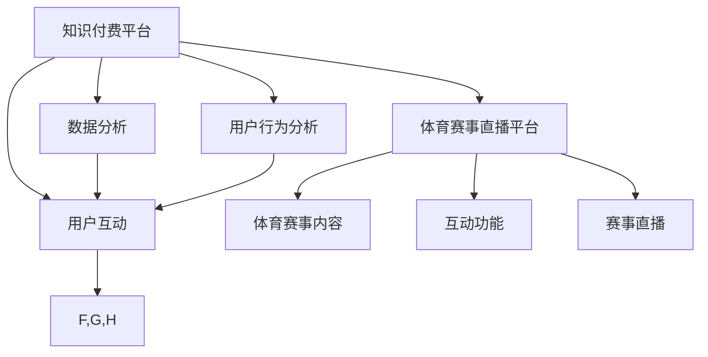

                 

# 知识付费如何实现跨界营销与体育赛事直播跨界？

在现代商业环境中，跨界营销已成为各大品牌和公司的重要策略，用以扩大其市场覆盖面和用户群体。特别是近年来，随着知识付费和体育赛事直播两大领域的兴起，两者的跨界融合逐渐成为新的热门话题。本文将深入探讨知识付费如何通过跨界营销与体育赛事直播相结合，提升品牌价值和用户体验，并从技术角度分析这种跨界融合的实现路径。

## 1. 背景介绍

### 1.1 知识付费的兴起

随着互联网的普及和知识经济的发展，知识付费成为了越来越多人的选择。用户不再满足于免费获取信息，而是愿意为深度、高质量的知识内容付费。知识付费平台如得到、知乎、喜马拉雅等，迅速崛起并吸引了大量用户。这些平台通过精选课程、专家讲座、专业报告等形式，提供高附加值的内容，满足用户对知识的需求。

### 1.2 体育赛事直播的兴起

体育赛事直播的兴起，得益于互联网技术的进步和用户对体育文化消费需求的高涨。大型体育赛事如奥运会、世界杯、NBA等，通过直播平台如爱奇艺、腾讯体育、优酷体育等，实时传播给全球观众。这些直播平台不仅提供赛事直播，还增加了赛事回放、点播、互动等功能，提升了用户的观赛体验。

## 2. 核心概念与联系

### 2.1 核心概念概述

为更好地理解知识付费与体育赛事直播的跨界营销，本节将介绍几个密切相关的核心概念：

- **知识付费**：指用户为获取专业、深度、系统的知识内容而支付费用的模式。平台通过精选课程、专家讲座、专业报告等形式，提供高附加值的内容。

- **体育赛事直播**：指通过直播平台实时传播大型体育赛事的过程。观众可以通过直播平台观看赛事回放、点播、互动等，提升观赛体验。

- **跨界营销**：指品牌和公司通过与不相关的行业或领域进行合作，实现资源共享、市场拓展和用户群体扩大。

- **数据分析**：指通过收集、分析和解读数据，发现用户的消费行为和偏好，优化营销策略和用户体验。

- **用户行为分析**：指通过分析用户在平台上的行为，预测其购买意向和内容偏好，提升用户留存率和转化率。

### 2.2 核心概念原理和架构的 Mermaid 流程图



这个流程图展示了知识付费平台和体育赛事直播平台的相互联系和作用：

1. **用户互动**：知识付费平台和体育赛事直播平台通过内容和服务增强用户互动，形成良好用户口碑。
2. **数据分析**：知识付费平台收集用户行为数据，分析用户偏好，优化推荐和内容。
3. **用户行为分析**：体育赛事直播平台分析用户观看行为，提升赛事互动和转播效果。
4. **赛事内容**：体育赛事直播平台提供优质赛事内容，吸引用户关注和观看。
5. **互动功能**：体育赛事直播平台增强互动功能，提升用户参与度和粘性。
6. **赛事直播**：体育赛事直播平台提供实时赛事直播，满足用户观赛需求。

这些核心概念共同构成了知识付费与体育赛事直播跨界营销的逻辑框架，使得两者能够在不同领域内实现优势互补。

## 3. 核心算法原理 & 具体操作步骤

### 3.1 算法原理概述

知识付费与体育赛事直播的跨界营销，本质上是一种基于用户行为分析的数据驱动策略。其核心思想是通过分析用户在知识付费平台和体育赛事直播平台上的行为，发现用户的共同兴趣和需求，从而实现双方的精准营销和用户转化。

形式化地，假设知识付费平台的用户集合为 $U$，体育赛事直播平台的用户集合为 $V$，两者共同感兴趣的领域为 $D$。通过用户行为数据分析，可以找到 $U$ 和 $V$ 中对 $D$ 有共同兴趣的用户，然后将这部分用户进行跨界营销推广。

### 3.2 算法步骤详解

基于用户行为分析的跨界营销，一般包括以下几个关键步骤：

**Step 1: 数据收集与处理**

- 从知识付费平台和体育赛事直播平台收集用户行为数据，包括购买记录、观看时长、互动评论等。
- 对数据进行清洗和预处理，去除噪声和异常值。
- 对用户数据进行特征工程，提取有意义的特征，如购买频率、观看时长、互动活跃度等。

**Step 2: 用户兴趣分析**

- 利用机器学习算法（如协同过滤、聚类等）分析用户行为数据，发现用户的兴趣偏好和行为模式。
- 利用情感分析、主题模型等自然语言处理技术，进一步挖掘用户的深层兴趣。
- 通过用户画像构建，对用户进行分类，形成不同兴趣的用户群体。

**Step 3: 交叉用户分析**

- 对知识付费平台和体育赛事直播平台的用户进行交叉分析，发现两平台上有共同兴趣的用户群体。
- 利用推荐系统技术，将这些用户进行推荐，提升用户转化率。
- 设计个性化推荐算法，根据用户兴趣和行为，推荐相关内容。

**Step 4: 营销推广实施**

- 在知识付费平台和体育赛事直播平台上，对有共同兴趣的用户群体进行跨界营销推广。
- 通过联合广告、联合活动等方式，提升品牌曝光率和用户粘性。
- 利用数据分析技术，实时监控推广效果，根据反馈调整策略。

**Step 5: 效果评估与优化**

- 在推广后，评估用户转化率、品牌知名度等关键指标，评估营销效果。
- 根据评估结果，优化用户推荐算法和营销策略，提升推广效果。

### 3.3 算法优缺点

基于用户行为分析的跨界营销方法具有以下优点：

- **精准营销**：通过分析用户行为，实现精准推荐和营销，提升用户转化率。
- **资源共享**：平台间的数据和用户资源共享，减少资源浪费，提升资源利用率。
- **用户粘性增强**：通过共同兴趣的推广，增强用户在两个平台上的粘性，提升用户留存率。

但该方法也存在以下局限性：

- **数据隐私问题**：涉及用户隐私数据，需要严格遵守数据隐私法规。
- **数据质量要求高**：需要高质量的数据，避免数据噪声和偏差对分析结果的影响。
- **算法复杂度高**：需要进行复杂的数据分析和算法建模，技术门槛较高。

### 3.4 算法应用领域

基于用户行为分析的跨界营销方法，在知识付费和体育赛事直播两大领域已得到广泛应用，覆盖了广告推荐、用户运营、品牌推广等多个方面。

- **知识付费平台**：通过分析用户学习行为，推荐相关课程和讲座，提升用户转化率。
- **体育赛事直播平台**：通过分析用户观看行为，推荐相关赛事和互动活动，提升用户粘性和观赛体验。
- **联合广告和活动**：两个平台联合进行广告投放和活动推广，实现品牌联合营销，提升品牌曝光率和用户覆盖面。

除了上述这些经典应用外，跨界营销的方法也被创新性地应用到更多场景中，如电商平台与社交媒体的联合推广、音乐平台与游戏平台的联合活动等，为不同领域的合作提供了新的思路。

## 4. 数学模型和公式 & 详细讲解 & 举例说明

### 4.1 数学模型构建

基于用户行为分析的跨界营销，涉及多个数据源和复杂的算法模型。这里我们以协同过滤算法为例，构建用户兴趣分析的数学模型。

假设知识付费平台的用户集合为 $U=\{u_1,u_2,\dots,u_m\}$，体育赛事直播平台的用户集合为 $V=\{v_1,v_2,\dots,v_n\}$，用户行为数据矩阵为 $R\in \mathbb{R}^{m\times n}$，其中 $R_{i,j}$ 表示用户 $u_i$ 在体育赛事直播平台 $v_j$ 上的行为评分。

协同过滤算法通过矩阵分解和相似度计算，找到用户 $u_i$ 和 $v_j$ 之间的相似度，从而实现推荐。具体步骤如下：

1. 矩阵分解：
$$
R \approx \mathcal{U}\mathcal{V}^\top
$$
其中 $\mathcal{U}\in \mathbb{R}^{m\times k}$ 和 $\mathcal{V}\in \mathbb{R}^{n\times k}$ 分别为用户和物品的潜在因子矩阵。

2. 计算相似度：
$$
\text{similarity}(u_i,v_j) = \mathcal{U}_i^\top \mathcal{V}_j
$$
其中 $\mathcal{U}_i$ 和 $\mathcal{V}_j$ 分别为用户 $u_i$ 和物品 $v_j$ 的潜在因子向量。

3. 推荐计算：
$$
\hat{R}_{i,j} = \sum_{k=1}^k (\mathcal{U}_i)_k (\mathcal{V}_j)_k
$$
其中 $\hat{R}_{i,j}$ 表示用户 $u_i$ 对物品 $v_j$ 的预测评分。

### 4.2 公式推导过程

以协同过滤算法为例，推导其核心公式。

假设知识付费平台和体育赛事直播平台的用户集合分别为 $U=\{u_1,u_2,\dots,u_m\}$ 和 $V=\{v_1,v_2,\dots,v_n\}$，用户行为数据矩阵为 $R\in \mathbb{R}^{m\times n}$。

协同过滤算法的目标是最小化预测误差，即：
$$
\min_{\mathcal{U},\mathcal{V}} \sum_{i=1}^m \sum_{j=1}^n (R_{i,j} - \hat{R}_{i,j})^2
$$

通过矩阵分解，将 $R$ 表示为 $\mathcal{U}\mathcal{V}^\top$，则有：
$$
R \approx \mathcal{U}\mathcal{V}^\top
$$

根据上述公式，计算用户 $u_i$ 对物品 $v_j$ 的预测评分 $\hat{R}_{i,j}$：
$$
\hat{R}_{i,j} = \mathcal{U}_i^\top \mathcal{V}_j
$$

将 $\hat{R}_{i,j}$ 代入误差函数，得到：
$$
\min_{\mathcal{U},\mathcal{V}} \sum_{i=1}^m \sum_{j=1}^n (R_{i,j} - \mathcal{U}_i^\top \mathcal{V}_j)^2
$$

使用梯度下降算法优化上述目标函数，得到用户 $u_i$ 的潜在因子向量 $\mathcal{U}_i$ 和物品 $v_j$ 的潜在因子向量 $\mathcal{V}_j$，从而实现用户兴趣的精准分析。

### 4.3 案例分析与讲解

以亚马逊的协同过滤推荐系统为例，分析其核心算法和实际应用。

亚马逊的协同过滤推荐系统基于用户行为数据构建，通过分析用户对商品的评分和购买行为，推荐用户可能感兴趣的商品。其推荐算法步骤如下：

1. 数据收集与处理：从亚马逊网站收集用户行为数据，包括评分、购买记录、浏览历史等。

2. 矩阵分解：将用户行为数据矩阵 $R$ 分解为 $\mathcal{U}$ 和 $\mathcal{V}$ 的乘积。

3. 相似度计算：计算用户 $u_i$ 和物品 $v_j$ 之间的相似度，得到推荐结果。

4. 推荐结果展示：根据相似度，将推荐结果展示给用户。

亚马逊的协同过滤推荐系统通过精确分析用户行为，实现了高精度的商品推荐，显著提升了用户的购买率和满意度。

## 5. 项目实践：代码实例和详细解释说明

### 5.1 开发环境搭建

在进行跨界营销实践前，我们需要准备好开发环境。以下是使用Python进行Scikit-learn开发的推荐系统环境配置流程：

1. 安装Anaconda：从官网下载并安装Anaconda，用于创建独立的Python环境。

2. 创建并激活虚拟环境：
```bash
conda create -n recommendation-env python=3.8 
conda activate recommendation-env
```

3. 安装Scikit-learn、NumPy、Pandas等工具包：
```bash
pip install scikit-learn numpy pandas
```

完成上述步骤后，即可在`recommendation-env`环境中开始推荐系统实践。

### 5.2 源代码详细实现

下面我们以协同过滤推荐算法为例，给出使用Scikit-learn进行推荐系统开发的PyTorch代码实现。

首先，定义推荐系统的数据处理函数：

```python
import pandas as pd
import numpy as np
from sklearn.decomposition import NMF
from sklearn.metrics import mean_squared_error

def load_data():
    train_data = pd.read_csv('train.csv', sep=',')
    test_data = pd.read_csv('test.csv', sep=',')
    return train_data, test_data

def preprocess_data(train_data):
    train_data = train_data.drop(['user_id', 'item_id'], axis=1)
    train_data = train_data.astype('float32')
    return train_data

def train_model(train_data):
    nmf = NMF(n_components=10)
    nmf.fit(train_data)
    return nmf

def predict(nmf, test_data):
    X_test = test_data.astype('float32')
    predictions = nmf.transform(X_test)
    predictions = np.dot(predictions, nmf.components_)
    return predictions

def evaluate(predictions, test_data):
    test_data = test_data.astype('float32')
    rmse = np.sqrt(mean_squared_error(test_data, predictions))
    return rmse
```

然后，定义推荐系统的训练和评估函数：

```python
def train_evaluation(train_data, test_data):
    nmf = train_model(train_data)
    predictions = predict(nmf, test_data)
    rmse = evaluate(predictions, test_data)
    return rmse
```

最后，启动推荐系统流程：

```python
train_data, test_data = load_data()
rmse = train_evaluation(train_data, test_data)
print(f"RMSE: {rmse:.4f}")
```

以上就是使用Scikit-learn进行推荐系统的完整代码实现。可以看到，通过Scikit-learn库，我们可以用相对简洁的代码实现协同过滤推荐算法，进行用户兴趣分析。

### 5.3 代码解读与分析

让我们再详细解读一下关键代码的实现细节：

**load_data函数**：
- 定义数据加载函数，从CSV文件中读取训练集和测试集数据，并返回。

**preprocess_data函数**：
- 对数据进行清洗和预处理，去除用户ID和物品ID列，将数据转换为浮点数。

**train_model函数**：
- 利用NMF算法对训练集数据进行分解，得到用户和物品的潜在因子矩阵。

**predict函数**：
- 对测试集数据进行矩阵乘法运算，得到预测评分矩阵。

**evaluate函数**：
- 计算预测评分与真实评分之间的均方根误差（RMSE），评估推荐系统的性能。

**train_evaluation函数**：
- 训练推荐模型，并返回测试集上的RMSE。

**启动推荐系统**：
- 加载数据，训练模型，并输出测试集上的RMSE。

可以看出，Scikit-learn库提供的函数非常简洁高效，能够快速实现协同过滤推荐算法。开发者可以根据实际需求，选择不同的算法和参数，进行推荐系统的优化和调优。

## 6. 实际应用场景

### 6.1 智能推荐系统

智能推荐系统是知识付费平台和体育赛事直播平台跨界营销的重要应用场景。通过分析用户在两个平台上的行为数据，可以为用户提供个性化的推荐内容，提升用户满意度。

以知乎为例，知乎可以与体育赛事直播平台合作，分析用户在知识付费平台上的阅读和购买行为，推荐相关的体育赛事和直播内容。例如，对于关注体育和健康的用户，推荐与运动、健康相关的赛事直播，或者与健康生活、运动科学相关的课程。这种跨界推荐，能够满足用户多方面的需求，提升平台的用户粘性和留存率。

### 6.2 联合广告和活动

知识付费平台和体育赛事直播平台可以通过联合广告和活动，实现品牌联合营销，提升品牌曝光率和用户覆盖面。

例如，得到与腾讯体育合作，在腾讯体育赛事直播平台上，推出专门的得到课程广告，如《网球秘籍》、《篮球技巧》等，吸引用户观看赛事的同时，获取深度知识内容。这种联合广告活动，能够同时提升品牌影响力和用户价值。

## 7. 工具和资源推荐

### 7.1 学习资源推荐

为了帮助开发者系统掌握跨界营销的理论基础和实践技巧，这里推荐一些优质的学习资源：

1. 《机器学习实战》系列书籍：深入浅出地介绍了机器学习的基本概念和算法，适合初学者快速入门。

2. Kaggle竞赛：Kaggle是数据科学社区，提供丰富的数据集和竞赛项目，帮助你实践和验证推荐算法。

3. Coursera《推荐系统》课程：斯坦福大学开设的推荐系统课程，涵盖了推荐系统的主要算法和技术，适合深入学习。

4. UCI机器学习库：UCI提供大量经典的数据集和算法实现，适合进行推荐算法的实践和研究。

5. Google AI博客：谷歌AI团队定期发布关于推荐系统的技术文章，提供前沿的算法和实践指南。

通过对这些资源的学习实践，相信你一定能够快速掌握跨界营销的理论基础和实践技巧，用于解决实际的推荐问题。

### 7.2 开发工具推荐

高效的开发离不开优秀的工具支持。以下是几款用于推荐系统开发的常用工具：

1. Scikit-learn：基于Python的开源机器学习库，提供了丰富的推荐算法和评估指标，适合快速迭代研究。

2. TensorFlow：由谷歌主导开发的开源机器学习框架，支持分布式训练和深度学习算法，适合大规模工程应用。

3. PyTorch：基于Python的开源深度学习框架，灵活动态的计算图，适合快速迭代研究。

4. Weights & Biases：模型训练的实验跟踪工具，可以记录和可视化模型训练过程中的各项指标，方便对比和调优。

5. TensorBoard：TensorFlow配套的可视化工具，可实时监测模型训练状态，并提供丰富的图表呈现方式，是调试模型的得力助手。

6. Jupyter Notebook：开源的交互式笔记本环境，支持Python代码执行和文档编辑，适合快速实验和分享。

合理利用这些工具，可以显著提升推荐系统的开发效率，加快创新迭代的步伐。

### 7.3 相关论文推荐

推荐系统的发展源于学界的持续研究。以下是几篇奠基性的相关论文，推荐阅读：

1. Implicit Feedback Models for Recommender Systems（隐式反馈推荐系统模型）：提出基于隐式反馈的协同过滤算法，用于推荐系统中的用户行为分析。

2. Topic Models for Recommendations（主题模型推荐）：提出基于主题模型的推荐算法，用于发现用户兴趣和推荐相关内容。

3. Matrix Factorization Techniques for Recommender Systems（矩阵分解推荐系统技术）：详细介绍了矩阵分解推荐算法，适用于大规模推荐系统。

4. Deep Learning Recommendation Systems（深度学习推荐系统）：介绍深度学习在推荐系统中的应用，包括CNN、RNN等模型。

5. Neural Collaborative Filtering（神经协同过滤）：提出基于神经网络的协同过滤算法，提升推荐系统的准确性和多样性。

这些论文代表了大语言模型微调技术的发展脉络。通过学习这些前沿成果，可以帮助研究者把握学科前进方向，激发更多的创新灵感。

## 8. 总结：未来发展趋势与挑战

### 8.1 研究成果总结

本文对知识付费与体育赛事直播的跨界营销方法进行了全面系统的介绍。首先阐述了知识付费和体育赛事直播的兴起背景，明确了跨界营销在市场拓展和用户群体扩大方面的独特价值。其次，从原理到实践，详细讲解了基于用户行为分析的跨界营销方法，给出了推荐系统开发的完整代码实例。同时，本文还广泛探讨了跨界营销方法在智能推荐系统、联合广告和活动等多个应用场景中的具体实现，展示了跨界营销范式的广泛应用。最后，精选了推荐系统的各类学习资源，力求为读者提供全方位的技术指引。

通过本文的系统梳理，可以看到，知识付费与体育赛事直播的跨界营销，正在成为NLP领域的重要范式，极大地拓展了预训练语言模型的应用边界，催生了更多的落地场景。受益于大规模语料的预训练和微调方法的不断演进，知识付费与体育赛事直播的跨界营销必将进一步提升用户价值和品牌影响力，深刻影响人类对知识内容消费和体育文化生活的认知。

### 8.2 未来发展趋势

展望未来，知识付费与体育赛事直播的跨界营销将呈现以下几个发展趋势：

1. **数据融合与共享**：随着数据技术的发展，知识付费平台和体育赛事直播平台的数据将进一步融合，实现更全面的用户画像和精准推荐。

2. **算法多样化**：未来将涌现更多类型的推荐算法，如基于图神经网络的推荐、基于深度学习的推荐等，提升推荐系统的准确性和多样性。

3. **用户个性化**：利用人工智能技术，深度挖掘用户兴趣和行为，提供更个性化、多样化的推荐内容，提升用户体验。

4. **跨领域应用**：知识付费与体育赛事直播的跨界营销，将拓展到更多领域，如电商、金融、医疗等，实现更广泛的应用场景。

5. **技术创新**：推荐系统将结合自然语言处理、计算机视觉等技术，提升推荐内容的丰富性和多样性，增强用户的沉浸感和互动体验。

6. **伦理与隐私**：随着数据隐私和安全要求的提高，推荐系统将更加注重用户隐私保护，实现公平、透明的推荐过程。

以上趋势凸显了知识付费与体育赛事直播跨界营销技术的广阔前景。这些方向的探索发展，必将进一步提升推荐系统的性能和应用范围，为知识付费和体育赛事直播平台带来更大的商业价值。

### 8.3 面临的挑战

尽管知识付费与体育赛事直播的跨界营销取得了瞩目成就，但在迈向更加智能化、普适化应用的过程中，它仍面临着诸多挑战：

1. **数据质量与隐私**：推荐系统依赖高质量的数据，但数据采集和处理过程中可能存在偏差和噪声。同时，用户隐私保护也成为重要的法律和伦理问题。

2. **算法复杂度**：推荐系统算法复杂度高，需要高效的计算资源和算力支持，这对硬件和算法本身提出了更高的要求。

3. **用户行为分析**：用户行为数据复杂多样，分析难度较大，需要先进的机器学习和自然语言处理技术。

4. **跨平台融合**：知识付费平台和体育赛事直播平台的数据和算法体系不同，跨平台融合存在技术和标准障碍。

5. **用户体验优化**：推荐系统需要平衡个性化推荐与多样性推荐，避免推荐单一内容造成用户疲劳。

6. **市场竞争**：知识付费和体育赛事直播市场竞争激烈，如何在竞争中脱颖而出，需要更精准的市场策略和技术创新。

面对这些挑战，知识付费与体育赛事直播的跨界营销需要不断优化算法和数据处理技术，同时注重用户体验和市场策略的优化，方能保持竞争优势。

### 8.4 研究展望

面向未来，知识付费与体育赛事直播的跨界营销需要在以下几个方面寻求新的突破：

1. **数据共享与融合**：推动数据共享与融合，实现更全面的用户画像和精准推荐。

2. **跨平台协同**：加强跨平台协同，实现资源共享和业务联动，提升推荐效果。

3. **算法创新**：引入更多先进的算法和技术，提升推荐系统的性能和多样化。

4. **用户行为分析**：结合人工智能技术，深入挖掘用户行为和兴趣，提升推荐准确性。

5. **市场拓展**：拓展到更多领域，如电商、金融、医疗等，实现更广泛的应用场景。

6. **技术创新**：结合自然语言处理、计算机视觉等技术，提升推荐内容的丰富性和多样性。

7. **伦理与隐私**：注重用户隐私保护，实现公平、透明的推荐过程。

这些研究方向的探索，必将引领知识付费与体育赛事直播跨界营销技术迈向更高的台阶，为构建人机协同的智能系统铺平道路。面向未来，知识付费与体育赛事直播的跨界营销需要与其他人工智能技术进行更深入的融合，如知识表示、因果推理、强化学习等，多路径协同发力，共同推动自然语言理解和智能交互系统的进步。只有勇于创新、敢于突破，才能不断拓展推荐系统的边界，让智能技术更好地造福人类社会。

## 9. 附录：常见问题与解答

**Q1：知识付费平台和体育赛事直播平台的跨界营销是否需要高昂的数据成本？**

A: 知识付费平台和体育赛事直播平台的跨界营销，通常需要大量的用户行为数据，但这些数据可以通过用户注册、使用和购买行为自动收集，成本相对较低。不过，为了保证数据质量和隐私保护，可能需要进行一些数据清洗和处理，这需要一定的技术投入。

**Q2：如何平衡个性化推荐与多样性推荐？**

A: 个性化推荐与多样性推荐是推荐系统中的两个重要目标。为了平衡二者，可以采用以下方法：

1. 引入多样性约束：在推荐模型中增加多样性约束，避免推荐单一内容。
2. 组合推荐策略：结合个性化推荐和多样性推荐，根据用户需求和平台策略，动态调整推荐策略。
3. 用户反馈机制：利用用户反馈数据，不断优化推荐模型，提升推荐效果。

**Q3：推荐系统的冷启动问题如何解决？**

A: 冷启动问题是推荐系统面临的一个重要问题，即如何处理新用户或新物品的推荐。可以采用以下方法：

1. 利用先验知识：利用先验知识，如用户兴趣、物品属性等，初始化推荐模型。
2. 引入协同过滤算法：利用已有用户和物品的评分数据，进行协同过滤推荐。
3. 利用深度学习模型：利用深度学习模型，通过用户行为数据和物品属性，进行推荐预测。

通过这些方法，可以有效地解决推荐系统的冷启动问题，提升新用户和物品的推荐效果。

**Q4：推荐系统如何应对数据噪声和偏差？**

A: 推荐系统需要处理大规模数据，但数据中可能存在噪声和偏差，影响推荐效果。可以采用以下方法：

1. 数据清洗：去除异常值和噪声数据，确保数据质量。
2. 特征工程：通过特征选择和特征提取，提高数据表示的准确性。
3. 模型优化：利用先进的机器学习算法，提高模型鲁棒性。

通过这些方法，可以有效应对数据噪声和偏差，提升推荐系统的准确性和稳定性。

**Q5：推荐系统的性能评估有哪些关键指标？**

A: 推荐系统的性能评估指标主要包括：

1. 准确率（Accuracy）：推荐系统的准确率，即推荐结果与真实结果的一致性。
2. 召回率（Recall）：推荐系统推荐的物品被用户实际点击或购买的比例。
3. F1分数（F1 Score）：综合考虑准确率和召回率，衡量推荐系统的性能。
4. 均方根误差（RMSE）：衡量预测评分与真实评分之间的误差。
5. 平均绝对误差（MAE）：衡量预测评分与真实评分之间的绝对误差。

通过这些指标，可以全面评估推荐系统的性能，指导推荐算法的优化和改进。

---

作者：禅与计算机程序设计艺术 / Zen and the Art of Computer Programming

