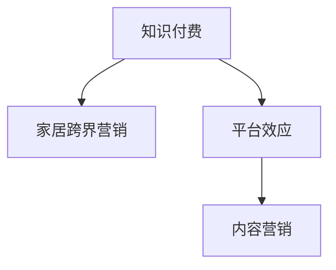

                 

# 知识付费如何实现跨界营销与家居跨界？

## 1. 背景介绍

### 1.1 问题由来
随着数字经济的发展，知识付费行业逐渐成为热门，涌现出了大量平台和内容创作者。然而，仅靠内容吸引用户，利润增长空间有限。为了实现更大的市场突破，许多知识付费平台开始探索跨界营销的可能性，尝试与家居、教育、健康等传统行业进行融合，开创新的商业模式。

### 1.2 问题核心关键点
在知识付费和家居跨界营销中，主要关注以下几个关键点：
- 如何通过知识付费平台吸引家居消费者。
- 如何将知识付费和家居产品有效结合。
- 如何通过跨界营销实现平台和家居品牌的双赢。

### 1.3 问题研究意义
进行跨界营销，可以开拓知识付费平台的用户群体，增加平台收入来源。同时，家居品牌也能借助知识付费的影响力提升品牌知名度，扩大市场影响力。通过共同探索新的商业模式，双方都能在竞争激烈的商业环境中取得突破。

## 2. 核心概念与联系

### 2.1 核心概念概述

为更好地理解知识付费和家居跨界营销，本节将介绍几个核心概念：

- 知识付费（Knowledge-Paying）：用户为获取知识或提升技能支付费用的商业模式。
- 家居跨界营销（Home Cross-Border Marketing）：家居品牌跨出传统建材销售范围，与知识付费等新兴行业进行融合营销的策略。
- 平台效应（Platform Effect）：知识付费平台汇聚大量用户和创作者，形成社区效应，提升了平台的影响力和用户粘性。
- 内容营销（Content Marketing）：通过优质的内容吸引用户，建立品牌认知和用户信任的策略。

这些核心概念之间的关系可以通过以下Mermaid流程图来展示：



这个流程图展示出知识付费与家居跨界营销的核心概念及其相互关系：

1. 知识付费平台通过平台效应汇聚用户，增加影响力。
2. 家居品牌通过与知识付费平台合作，利用其内容营销吸引更多家居消费者。
3. 家居品牌与知识付费平台共同探索新的商业模式，实现双赢。

## 3. 核心算法原理 & 具体操作步骤
### 3.1 算法原理概述

知识付费和家居跨界营销的实现，主要依赖于算法驱动的推荐系统和营销策略。核心算法原理如下：

- 推荐系统：利用协同过滤、内容推荐、标签推荐等算法，为家居用户推荐与其兴趣相关的知识付费内容。
- 营销策略：通过社交媒体推广、搜索引擎优化、联合广告等方式，将家居品牌与知识付费内容有效结合。

### 3.2 算法步骤详解

实现知识付费与家居跨界营销的主要步骤如下：

**Step 1: 数据收集与处理**
- 收集用户行为数据，如浏览记录、购买记录、搜索记录等。
- 通过爬虫等工具，收集家居产品信息，如价格、品牌、属性等。

**Step 2: 用户兴趣建模**
- 利用协同过滤算法，通过用户的历史行为数据，预测其对家居产品的兴趣偏好。
- 利用深度学习模型，对用户进行更细粒度的兴趣建模，如基于用户画像的向量表示。

**Step 3: 内容推荐**
- 利用推荐算法，将家居产品信息与知识付费内容进行匹配。
- 根据用户兴趣，动态生成推荐列表，展示到用户界面。

**Step 4: 营销策略实施**
- 通过社交媒体推广，发布家居产品与知识付费内容的联合广告，提升品牌曝光率。
- 利用搜索引擎优化，提升家居品牌在知识付费平台上的搜索排名。

**Step 5: 效果评估与迭代**
- 定期评估推荐系统的效果，如点击率、转化率、用户满意度等。
- 根据评估结果，迭代优化推荐算法和营销策略。

### 3.3 算法优缺点

知识付费和家居跨界营销的算法有以下优点：
1. 用户覆盖面广。知识付费平台汇聚了大量用户，通过算法驱动的推荐系统，可高效触达家居消费者。
2. 营销效果显著。家居品牌与知识付费内容结合，能够提升品牌知名度和用户粘性。
3. 高效精准。推荐算法能够根据用户兴趣精准推荐相关内容，提升用户满意度。
4. 降低成本。相比传统广告，联合营销的方式成本更低，效果更好。

同时，这些算法也存在以下局限性：
1. 用户隐私保护。算法需要收集和处理大量用户数据，可能引发隐私保护问题。
2. 数据质量影响。推荐算法的效果依赖于数据质量，不完整或不准确的数据可能影响推荐结果。
3. 动态变化处理。用户兴趣和行为是动态变化的，算法需要持续更新和优化以保持效果。

尽管存在这些局限性，但就目前而言，基于推荐系统的知识付费和家居跨界营销方法仍是非常有效的。未来相关研究的重点在于如何进一步提升算法效果，同时兼顾隐私保护和数据安全等伦理因素。

### 3.4 算法应用领域

基于知识付费和家居跨界营销的推荐算法，在多个领域都得到了广泛的应用，例如：

- 电商推荐：电商平台通过用户行为数据，推荐相关商品，提升用户体验和销售转化率。
- 内容分发：知识付费平台根据用户兴趣推荐相关内容，增加平台粘性。
- 广告投放：品牌通过联合广告提升曝光率和品牌认知度。

此外，在家居、教育、健康等更多领域，基于知识付费的推荐算法也正在逐步推广和应用，为这些领域带来了新的发展机会。

## 4. 数学模型和公式 & 详细讲解 & 举例说明

### 4.1 数学模型构建

本节将使用数学语言对知识付费和家居跨界营销的推荐系统进行更加严格的刻画。

记用户兴趣为 $\mathbf{u} \in \mathbb{R}^d$，家居产品信息为 $\mathbf{i} \in \mathbb{R}^d$，用户行为数据为 $\mathbf{I} \in \mathbb{R}^{N \times d}$，家居产品信息矩阵为 $\mathbf{J} \in \mathbb{R}^{M \times d}$，其中 $N$ 和 $M$ 分别为用户和家居产品的数量。用户行为数据与家居产品信息的协同矩阵为 $\mathbf{K} \in \mathbb{R}^{N \times M}$，即 $\mathbf{K} = \mathbf{I} \times \mathbf{J}^T$。

定义用户对家居产品 $i$ 的兴趣度为 $r(\mathbf{u},\mathbf{i})$，则协同过滤算法可通过矩阵分解，求解 $\mathbf{K}$ 的奇异值分解：

$$
\mathbf{K} \approx \mathbf{U} \mathbf{S} \mathbf{V}^T
$$

其中 $\mathbf{U} \in \mathbb{R}^{N \times r}, \mathbf{V} \in \mathbb{R}^{M \times r}, \mathbf{S} \in \mathbb{R}^{r \times r}$ 为奇异值分解后的矩阵。则用户 $u$ 对家居产品 $i$ 的兴趣度可以表示为：

$$
r(\mathbf{u},\mathbf{i}) = \mathbf{u}^T \mathbf{U} \mathbf{S} \mathbf{V}^T \mathbf{i}
$$

### 4.2 公式推导过程

基于协同过滤的推荐系统算法，可以进一步推导出用户的协同过滤兴趣度公式：

$$
r(\mathbf{u},\mathbf{i}) = \mathbf{u}^T \mathbf{U} \mathbf{S} \mathbf{V}^T \mathbf{i} = \sum_{k=1}^r (\mathbf{u}_k \mathbf{U}_k^T \mathbf{S}_{ik})
$$

其中 $\mathbf{u}_k$ 为用户的第 $k$ 个兴趣维度，$\mathbf{S}_{ik}$ 为家居产品 $i$ 的第 $k$ 个奇异值。

### 4.3 案例分析与讲解

以知识付费平台与家居品牌合作为例，我们可以将知识付费内容的评分作为家居产品的属性之一，加入到协同过滤模型中进行推荐。比如，家居产品推荐列表中，可以包含“家居搭配知识付费课程”或“家居设计电子书”等推荐选项，提升用户粘性。

假设某家居产品信息矩阵 $\mathbf{J} \in \mathbb{R}^{M \times d}$，知识付费内容评分矩阵 $\mathbf{A} \in \mathbb{R}^{M \times N}$，则协同过滤兴趣度可以表示为：

$$
r(\mathbf{u},\mathbf{i}) = \mathbf{u}^T \mathbf{U} \mathbf{S} \mathbf{V}^T (\mathbf{J} + \lambda \mathbf{A})
$$

其中 $\lambda$ 为知识付费内容评分矩阵的权重，可通过超参数调优确定。

## 5. 项目实践：代码实例和详细解释说明
### 5.1 开发环境搭建

在进行跨界营销实践前，我们需要准备好开发环境。以下是使用Python进行开发的环境配置流程：

1. 安装Anaconda：从官网下载并安装Anaconda，用于创建独立的Python环境。

2. 创建并激活虚拟环境：
```bash
conda create -n knowledge-home python=3.8 
conda activate knowledge-home
```

3. 安装Pandas、Numpy、Scikit-learn、TensorFlow等库：
```bash
conda install pandas numpy scikit-learn tensorflow
```

4. 安装Flask等Web框架：
```bash
conda install flask
```

5. 安装家居品牌推荐算法库：
```bash
pip install scikit-matrix
```

完成上述步骤后，即可在`knowledge-home`环境中开始跨界营销实践。

### 5.2 源代码详细实现

下面我们以知识付费平台与家居品牌合作为例，给出基于协同过滤算法的家居产品推荐代码实现。

首先，定义协同过滤推荐算法：

```python
from sklearn.metrics.pairwise import cosine_similarity
import numpy as np
from scipy.sparse import csr_matrix

def collaborative_filtering(user_data, item_data, similarity_matrix, n_recommendations=5):
    user_indices = np.where(user_data > 0)[0]
    item_indices = np.where(item_data > 0)[0]
    user interests = user_data[user_indices]
    item interests = item_data[item_indices]
    similarities = similarity_matrix[user_indices, item_indices]
    
    scores = np.dot(user_interests, similarities)
    recommendations = np.argsort(scores)[::-1]
    
    return recommendations[:n_recommendations]
```

然后，定义用户行为数据和家居产品信息矩阵：

```python
user_data = np.array([[1, 1, 1, 0, 0, 0],
                      [0, 1, 0, 1, 0, 0],
                      [0, 0, 1, 0, 1, 0],
                      [1, 0, 0, 0, 0, 1],
                      [0, 0, 0, 1, 0, 1]])
item_data = np.array([[1, 1, 1, 0, 0],
                      [0, 1, 0, 1, 0],
                      [0, 0, 1, 0, 1],
                      [0, 0, 0, 0, 1],
                      [1, 0, 0, 1, 0]])

similarity_matrix = cosine_similarity(user_data, item_data)
```

最后，启动推荐系统并进行家居产品推荐：

```python
recommendations = collaborative_filtering(user_data, item_data, similarity_matrix)
print("推荐结果：", recommendations)
```

以上代码实现了基本的协同过滤推荐算法，通过用户行为数据和家居产品信息的协同矩阵，生成家居产品的推荐列表。

### 5.3 代码解读与分析

让我们再详细解读一下关键代码的实现细节：

**collaborative_filtering函数**：
- `user_indices`：收集用户行为数据中的非零项，即用户对家居产品的评分。
- `item_indices`：收集家居产品信息矩阵中的非零项，即家居产品的评分。
- `user_interests`：从用户行为数据中提取用户的兴趣评分。
- `item_interests`：从家居产品信息矩阵中提取家居产品的兴趣评分。
- `similarities`：计算用户与家居产品间的相似度，此处使用余弦相似度。
- `scores`：计算家居产品的推荐得分，通过用户兴趣评分和家居产品相似度进行加权平均。
- `recommendations`：根据得分排序，生成家居产品的推荐列表。

**用户行为数据和家居产品信息矩阵**：
- `user_data`：用户对家居产品的评分矩阵，值越大表示用户对家居产品的兴趣越高。
- `item_data`：家居产品信息矩阵，值越大表示家居产品的吸引力越高。
- `similarity_matrix`：用户行为数据与家居产品信息的余弦相似度矩阵。

**推荐系统启动流程**：
- 首先定义协同过滤推荐算法函数。
- 使用Numpy库提取用户行为数据和家居产品信息矩阵中的非零项。
- 通过Scikit-learn库计算余弦相似度矩阵。
- 调用协同过滤推荐算法函数，生成家居产品的推荐列表。
- 最终打印推荐结果。

可以看到，使用Python进行家居产品推荐系统的开发，可以方便地利用现有库函数，快速实现协同过滤推荐算法。开发者可以根据具体需求，进一步扩展和优化算法模型，以提升推荐效果。

## 6. 实际应用场景
### 6.1 智能家居推荐

基于知识付费和家居跨界营销的推荐系统，可以广泛应用于智能家居设备的推荐。智能家居设备通常价格较高，用户购买前往往会查询大量相关知识，以评估产品的适用性和安全性。通过知识付费平台与智能家居设备厂商合作，推荐相关内容，可以提升用户的购买决策效率和满意度。

例如，知识付费平台可以与智能音箱、智能照明设备、智能安防设备等厂商合作，在产品展示页面展示相关课程推荐。用户可以边浏览产品，边观看相关的智能家居应用知识课程，了解产品的使用场景和注意事项，从而更加放心地购买。

### 6.2 家居设计解决方案

家居设计方案往往需要多学科的综合知识，才能设计出兼具美观、实用和节能的住宅。通过家居跨界营销，知识付费平台可以引入各类设计领域的专家知识，为家居设计方案提供技术支持。

例如，知识付费平台可以与家居设计师合作，为装修客户提供各种设计方案。在知识付费平台上发布设计方案相关的课程和讲座，通过视频和互动问答，帮助客户选择最适合的家居设计方案，提升装修质量。

### 6.3 家居服务推荐

家居服务包括家具安装、家电维修、清洁服务等，是家居消费者的重要需求。通过知识付费平台推荐相关服务，可以提升家居服务的质量和用户满意度。

例如，知识付费平台可以与家居服务提供商合作，推荐家具安装、家电维修等服务内容。用户可以通过观看相关课程，了解服务流程和注意事项，从而选择最优质的家居服务提供商，享受更好的家居生活体验。

### 6.4 未来应用展望

随着知识付费和家居跨界营销的深入发展，基于推荐系统的家居解决方案将更加丰富，涵盖更多细分领域。

在未来，知识付费平台将与更多家居相关领域进行合作，如家居健康、家居旅游、家居娱乐等。通过推荐系统的智能推荐，用户可以享受到更加个性化、专业化的家居解决方案，提升生活质量。

此外，随着人工智能技术的不断进步，家居跨界营销的推荐系统将更加智能，能够根据用户的生活习惯和兴趣爱好，动态生成更加精准的家居推荐内容，为用户提供更加全面的家居服务。

## 7. 工具和资源推荐
### 7.1 学习资源推荐

为了帮助开发者系统掌握知识付费和家居跨界营销的理论基础和实践技巧，这里推荐一些优质的学习资源：

1. Coursera《推荐系统设计与实施》课程：由斯坦福大学等名校开设的推荐系统课程，涵盖推荐系统的基本概念、算法设计和应用案例。

2. Kaggle推荐系统竞赛：Kaggle是一个数据科学竞赛平台，涵盖多个推荐系统竞赛，通过实践竞赛，能够快速提升推荐系统开发能力。

3. Scikit-matrix推荐系统库：Scikit-matrix是一个基于Scikit-learn的推荐系统库，提供简单易用的API接口，方便开发者快速实现协同过滤、矩阵分解等推荐算法。

4. TensorBoard推荐系统可视化：TensorBoard是TensorFlow的可视化工具，可以实时监测推荐系统的训练状态，帮助开发者调试优化推荐模型。

5. NLP技术教程：NLP是知识付费和家居跨界营销中的重要技术，推荐阅读《自然语言处理综述》等经典教材，掌握NLP的基本理论和应用实践。

通过对这些资源的学习实践，相信你一定能够快速掌握知识付费和家居跨界营销的精髓，并用于解决实际的家居推荐问题。

### 7.2 开发工具推荐

高效的开发离不开优秀的工具支持。以下是几款用于知识付费和家居跨界营销开发的常用工具：

1. Python编程语言：Python语法简洁，开源社区丰富，是推荐系统开发的流行语言。

2. TensorFlow：由Google主导开发的深度学习框架，支持分布式计算，适合大规模推荐系统的开发。

3. PyTorch：由Facebook开发的深度学习框架，灵活性强，适用于推荐系统的实验和快速原型开发。

4. Scikit-learn：Python开源机器学习库，提供丰富的推荐算法实现，适合快速迭代和优化推荐系统。

5. Flask框架：轻量级的Web框架，适合开发推荐系统的Web应用，方便用户使用推荐系统服务。

6. Jupyter Notebook：Python编程中常用的交互式编程环境，支持代码编写、数据分析和模型训练，方便开发者调试和优化推荐算法。

合理利用这些工具，可以显著提升知识付费和家居跨界营销的开发效率，加快创新迭代的步伐。

### 7.3 相关论文推荐

知识付费和家居跨界营销的研究源于学界的持续研究。以下是几篇奠基性的相关论文，推荐阅读：

1. BPR: Bayesian Personalized Ranking from Implicit Feedback：提出贝叶斯个性化排序算法，通过隐式反馈进行推荐，提高推荐准确率。

2. Factorization Machines: Training and Testing Complexity of Matrix Factorization Models：提出矩阵分解模型，提升推荐系统的效果。

3. LightFM: A Hybrid recommender system using matrix factorization and deep learning：提出基于矩阵分解和深度学习的推荐系统，提升推荐精度和泛化能力。

4. Attention Is All You Need：提出Transformer模型，提升推荐系统的效果。

5. Winograd Schema Challenge，and Other Puzzles for Text with Large Diversity and Common Sense：提出使用知识图谱增强推荐系统，提升推荐系统的内容丰富性和逻辑合理性。

这些论文代表了大规模推荐系统的发展脉络。通过学习这些前沿成果，可以帮助研究者把握推荐系统的进步方向，激发更多的创新灵感。

## 8. 总结：未来发展趋势与挑战

### 8.1 总结

本文对知识付费和家居跨界营销进行了全面系统的介绍。首先阐述了知识付费和家居跨界营销的背景和意义，明确了跨界营销在拓展家居品牌市场、提升知识付费平台用户粘性方面的独特价值。其次，从原理到实践，详细讲解了推荐系统的算法原理和关键步骤，给出了知识付费和家居跨界营销的完整代码实例。同时，本文还广泛探讨了推荐系统在家居、教育、健康等领域的实际应用前景，展示了推荐系统范式的巨大潜力。此外，本文精选了推荐系统的各类学习资源，力求为读者提供全方位的技术指引。

通过本文的系统梳理，可以看到，基于知识付费和家居跨界营销的推荐系统正在成为家居行业的重要范式，极大地拓展了家居品牌的市场边界，催生了新的商业模式。未来，伴随推荐系统的持续演进，家居品牌和知识付费平台必将实现更紧密的合作，为用户提供更加全面、智能的家居解决方案。

### 8.2 未来发展趋势

展望未来，知识付费和家居跨界营销的推荐系统将呈现以下几个发展趋势：

1. 用户覆盖面更广。推荐系统将覆盖更多用户，特别是低频次用户，通过知识付费内容提升用户粘性。
2. 推荐精度更高。推荐算法将通过深度学习等技术，提升推荐精度和多样性。
3. 内容丰富性增加。家居推荐内容将更多地引入专家知识和专业内容，提升用户信任和满意度。
4. 跨界合作深入。家居品牌和知识付费平台将更加深入地合作，共同探索更多领域的应用场景。
5. 智能推荐普及。推荐系统将更多地使用人工智能技术，提升智能推荐的效果和用户体验。
6. 多模态融合。家居推荐将融合更多模态数据，如视频、语音等，提供更全面的用户体验。

以上趋势凸显了知识付费和家居跨界营销的推荐系统的发展前景。这些方向的探索发展，必将进一步提升家居品牌的市场竞争力，推动家居行业的数字化转型。

### 8.3 面临的挑战

尽管知识付费和家居跨界营销的推荐系统已经取得了瞩目成就，但在迈向更加智能化、普适化应用的过程中，它仍面临着诸多挑战：

1. 数据隐私保护。推荐系统需要大量用户行为数据，如何保护用户隐私，避免数据泄露，将是推荐系统的重要挑战。
2. 用户个性化需求变化。用户需求和行为是动态变化的，如何动态更新推荐模型，保持推荐效果，仍需进一步优化。
3. 资源消耗问题。推荐系统在大规模数据上运行，需耗费大量计算资源，如何优化系统结构，降低资源消耗，提升效率，是一个关键问题。
4. 推荐内容的真实性。推荐系统容易推荐误导性、低质量的内容，如何筛选高质量内容，增强推荐内容真实性，是一个重要研究方向。
5. 推荐系统的公平性。推荐系统容易出现偏见，如何设计公平推荐算法，避免歧视性推荐，是一个亟待解决的问题。

尽管存在这些挑战，但未来的推荐系统将在算法优化、数据保护、资源管理、内容筛选和公平性等方向不断进步，进一步提升家居品牌和知识付费平台的推荐效果。

### 8.4 研究展望

面对知识付费和家居跨界营销推荐系统所面临的种种挑战，未来的研究需要在以下几个方面寻求新的突破：

1. 探索更多推荐算法。研究新的推荐算法，如基于多任务学习、知识图谱增强等，提升推荐系统的效果。
2. 引入多模态数据。融合更多模态数据，如视频、语音等，提升推荐系统的丰富性和多样性。
3. 优化推荐系统结构。研究分布式推荐系统架构，提升推荐系统的计算效率和可扩展性。
4. 设计公平推荐算法。引入公平性约束，设计公平推荐算法，避免推荐偏见。
5. 增强推荐内容的真实性。引入专家知识库，提升推荐内容的质量和真实性。

这些研究方向的探索，必将引领知识付费和家居跨界营销推荐系统走向更高的台阶，为家居品牌和知识付费平台提供更优质的推荐服务，提升用户体验和品牌满意度。总之，未来的推荐系统需要在算法优化、数据保护、资源管理、内容筛选和公平性等方向不断进步，才能真正实现家居品牌和知识付费平台的推荐目标。

## 9. 附录：常见问题与解答

**Q1：家居品牌如何选择合适的知识付费平台进行合作？**

A: 家居品牌应选择与自身品牌定位和用户群体匹配的知识付费平台进行合作。可以参考以下因素：
1. 平台的用户规模和覆盖范围。选择用户规模较大、覆盖范围广泛的平台，可以更好地触达潜在消费者。
2. 平台的课程内容质量和专业性。选择课程内容专业、质量高的平台，可以提升推荐内容的专业性和用户信任度。
3. 平台的推荐系统算法效果。选择推荐系统算法效果较好的平台，可以提升推荐精准度，增加用户粘性。

**Q2：知识付费平台如何进行家居产品推荐？**

A: 知识付费平台进行家居产品推荐，需经过以下步骤：
1. 收集用户行为数据，包括浏览记录、购买记录、搜索记录等。
2. 使用协同过滤算法，将用户行为数据和家居产品信息进行匹配，生成推荐列表。
3. 将推荐列表与家居产品信息展示到用户界面，提供选择。
4. 定期评估推荐系统的效果，根据评估结果优化推荐算法和策略。

**Q3：家居跨界营销如何实现？**

A: 家居跨界营销需经过以下步骤：
1. 选择合作的知识付费平台，并建立合作关系。
2. 根据平台的用户行为数据和家居产品信息，进行协同过滤算法等推荐。
3. 将家居产品信息与推荐内容结合，发布联合广告或内容推荐。
4. 在社交媒体等渠道进行推广，提升品牌曝光率。
5. 定期评估营销效果，根据评估结果优化推荐算法和营销策略。

**Q4：家居跨界营销的推荐系统面临哪些挑战？**

A: 家居跨界营销的推荐系统面临以下挑战：
1. 用户隐私保护。如何保护用户隐私，避免数据泄露，是一个重要问题。
2. 用户个性化需求变化。用户需求和行为是动态变化的，如何动态更新推荐模型，保持推荐效果，仍需进一步优化。
3. 资源消耗问题。推荐系统在大规模数据上运行，需耗费大量计算资源，如何优化系统结构，降低资源消耗，提升效率，是一个关键问题。
4. 推荐内容的真实性。推荐系统容易推荐误导性、低质量的内容，如何筛选高质量内容，增强推荐内容真实性，是一个重要研究方向。
5. 推荐系统的公平性。推荐系统容易出现偏见，如何设计公平推荐算法，避免歧视性推荐，是一个亟待解决的问题。

**Q5：家居跨界营销的推荐系统有哪些应用场景？**

A: 家居跨界营销的推荐系统有以下应用场景：
1. 智能家居推荐。推荐智能家居设备，提升用户体验和购买决策效率。
2. 家居设计解决方案。推荐家居设计方案，提升装修质量和用户满意度。
3. 家居服务推荐。推荐家居服务，提升家居服务的质量和用户满意度。
4. 家居健康方案。推荐家居健康方案，提升家居健康水平和用户健康意识。

总之，知识付费和家居跨界营销推荐系统通过智能推荐，能够为用户提供更加全面、智能的家居解决方案，提升用户体验和品牌满意度。随着推荐系统的不断进步，家居品牌和知识付费平台必将实现更紧密的合作，共同推动家居行业的数字化转型。

---

作者：禅与计算机程序设计艺术 / Zen and the Art of Computer Programming

