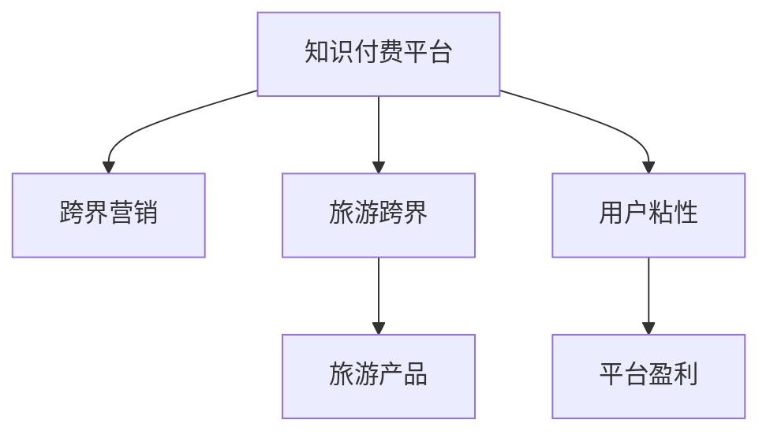

                 

# 知识付费如何实现跨界营销与旅游跨界？

## 1. 背景介绍

### 1.1 问题由来
在互联网和人工智能技术的驱动下，知识付费平台正在经历从单一的线上知识内容销售模式向多元化的跨界商业模式转型。随着知识付费平台的不断发展，跨界营销成为一种趋势，以吸引更多用户，提高平台盈利能力。在众多跨界尝试中，旅游跨界因其独特的市场潜力和用户粘性成为热门选择。本文将探讨知识付费平台如何通过跨界营销实现旅游跨界，以期为相关平台的运营和盈利提供策略参考。

### 1.2 问题核心关键点
- **跨界营销**：知识付费平台通过与非知识领域的品牌合作，以获取更多的用户流量和商业机会。
- **旅游跨界**：结合知识付费平台的用户特点和旅游业的市场需求，开发针对特定旅游主题的知识内容，吸引用户进行旅游消费。
- **用户粘性**：通过提供与旅游相关的知识内容，提升用户对平台的忠诚度和参与度，实现长期稳定的流量增长。
- **平台盈利**：通过旅游跨界营销活动，提高平台的广告收入、旅游产品销售提成等盈利模式。

## 2. 核心概念与联系

### 2.1 核心概念概述

为更好地理解知识付费平台如何实现跨界营销与旅游跨界，本节将介绍几个密切相关的核心概念：

- **知识付费**：用户为获取专业知识和信息而支付费用的在线服务模式，如知乎live、得到等。
- **跨界营销**：不同领域企业之间合作，通过互补优势进行市场推广。
- **旅游跨界**：知识付费平台通过与旅游相关的品牌合作，推广旅游产品，引导用户进行旅游消费。
- **用户粘性**：通过高质量的内容和服务，提升用户对平台的长期参与和消费意愿。
- **平台盈利**：知识付费平台通过广告、付费内容、旅游产品销售等手段实现商业变现。

这些概念之间的逻辑关系可以通过以下Mermaid流程图来展示：



这个流程图展示了知识付费平台的核心概念及其之间的关系：

1. 知识付费平台通过跨界营销获取用户流量。
2. 旅游跨界是跨界营销的一种方式，结合旅游产品，吸引用户进行旅游消费。
3. 提升用户粘性，保证用户长期参与和消费。
4. 通过用户消费行为，实现平台的盈利。

## 3. 核心算法原理 & 具体操作步骤

### 3.1 算法原理概述

知识付费平台实现旅游跨界的核心算法原理是利用数据挖掘和机器学习技术，发现用户对旅游内容的兴趣和需求，结合旅游产品和知识内容，制定针对性的营销策略，从而实现用户转化和消费。

具体而言，算法分为以下几个步骤：

1. **用户行为分析**：通过数据分析用户的使用习惯和偏好，挖掘出用户对旅游相关的兴趣点。
2. **旅游产品推荐**：基于用户兴趣点，推荐相应的旅游产品，如酒店、景点门票、旅游线路等。
3. **知识内容制作**：制作与旅游相关的专业知识和信息，如旅游攻略、历史文化、当地美食等。
4. **内容匹配与营销**：将旅游产品与知识内容进行匹配，结合营销手段，如直播、图文、视频等，吸引用户关注并参与旅游消费。
5. **效果评估与优化**：持续评估旅游跨界营销效果，通过数据分析和机器学习模型不断优化策略，提高转化率和用户满意度。

### 3.2 算法步骤详解

#### 3.2.1 用户行为分析

用户行为分析是旅游跨界营销的基础。通过以下步骤实现：

1. **数据收集**：收集用户在知识付费平台上的浏览、搜索、购买、评论等行为数据，包括用户兴趣、行为偏好、消费习惯等。
2. **数据预处理**：对数据进行清洗、归一化、去噪等处理，确保数据的准确性和完整性。
3. **特征提取**：使用特征工程技术，从原始数据中提取有意义的特征，如兴趣标签、消费行为、地理位置等。
4. **用户画像构建**：基于提取的特征，构建用户画像，描述用户的基本属性和行为特征。

#### 3.2.2 旅游产品推荐

旅游产品推荐是实现旅游跨界营销的核心。推荐算法通过以下步骤实现：

1. **产品数据采集**：收集与旅游相关的产品数据，如景点、酒店、餐饮、交通等。
2. **产品特征提取**：提取旅游产品的特征，如地理位置、价格、评分、用户评价等。
3. **用户兴趣匹配**：基于用户画像，匹配与用户兴趣相关的旅游产品。
4. **推荐算法应用**：使用协同过滤、基于内容的推荐、深度学习等算法，生成个性化的旅游产品推荐列表。

#### 3.2.3 知识内容制作

知识内容制作是旅游跨界营销的重要组成部分。制作过程包括：

1. **主题确定**：根据用户兴趣和旅游产品特点，确定旅游知识内容的选题方向，如历史、文化、自然等。
2. **内容创作**：邀请专家或用户创作与旅游相关的专业知识和信息，如旅游攻略、景点介绍、文化历史等。
3. **内容审核与发布**：对内容进行审核，确保信息的准确性和实用性，发布到知识付费平台上。

#### 3.2.4 内容匹配与营销

内容匹配与营销是旅游跨界营销的执行环节。通过以下步骤实现：

1. **内容关联**：将旅游产品与旅游知识内容进行关联，形成旅游主题的知识产品。
2. **营销渠道选择**：选择适合的内容形式和营销渠道，如直播、图文、视频等。
3. **营销活动设计**：设计有吸引力的营销活动，如直播互动、抽奖活动、优惠券等。
4. **营销效果监测**：监测营销活动效果，如参与人数、转化率等，收集反馈信息。

#### 3.2.5 效果评估与优化

效果评估与优化是旅游跨界营销的持续改进环节。通过以下步骤实现：

1. **数据收集与分析**：收集营销活动的数据，包括参与人数、转化率、用户反馈等。
2. **模型训练与优化**：使用机器学习模型，对数据进行分析，发现用户行为和偏好，优化推荐算法和内容匹配策略。
3. **策略调整**：根据数据分析结果，调整营销策略，提升用户参与度和转化率。

### 3.3 算法优缺点

知识付费平台实现旅游跨界的算法具有以下优点：

1. **用户参与度高**：通过与用户兴趣相关的旅游产品和知识内容，提升用户粘性，增加平台的使用时间。
2. **跨界合作效率高**：与旅游相关品牌合作，快速推广旅游产品，提高品牌知名度和用户信任度。
3. **转化率高**：结合用户兴趣和旅游产品，提高用户转化率，增加平台盈利能力。

同时，该算法也存在以下缺点：

1. **数据质量依赖性强**：用户行为数据和旅游产品数据的准确性和完整性对推荐效果有直接影响。
2. **个性化推荐难度大**：用户兴趣多样化，旅游产品种类繁多，个性化推荐的复杂度较高。
3. **用户隐私问题**：用户数据的收集和使用需要遵循隐私保护法律法规，处理不当可能引发用户隐私问题。

### 3.4 算法应用领域

知识付费平台实现旅游跨界的算法在以下领域有广泛应用：

- **旅游内容平台**：如携程、去哪儿等旅游内容平台，通过知识付费平台的推广，提升用户转化率。
- **酒店预订平台**：如Booking.com、Airbnb等，利用知识付费平台的用户数据，推荐优质酒店。
- **景点门票平台**：如美团、马蜂窝等，推广旅游景点的优惠活动，吸引用户购买门票。
- **在线旅游导览**：如途牛、同程等，提供线上旅游咨询服务，提升用户体验和满意度。

## 4. 数学模型和公式 & 详细讲解 & 举例说明

### 4.1 数学模型构建

知识付费平台实现旅游跨界的数学模型可以表示为：

1. **用户画像模型**：
   $$
   \text{UserProfile} = f(\text{UserBehaviorData}, \text{UserPreferences})
   $$

2. **旅游产品推荐模型**：
   $$
   \text{RecommendedProducts} = g(\text{UserProfile}, \text{ProductData})
   $$

3. **内容匹配模型**：
   $$
   \text{ContentMatches} = h(\text{UserProfile}, \text{KnowledgeData})
   $$

4. **营销效果评估模型**：
   $$
   \text{MarketingEffectiveness} = \text{UserEngagement} + \text{ConversionRate}
   $$

其中，$\text{UserBehaviorData}$、$\text{ProductData}$、$\text{KnowledgeData}$分别为用户行为数据、旅游产品数据、旅游知识数据，$\text{UserPreferences}$、$\text{UserProfile}$、$\text{RecommendedProducts}$、$\text{ContentMatches}$、$\text{MarketingEffectiveness}$分别为用户偏好、用户画像、推荐产品、内容匹配结果、营销效果。

### 4.2 公式推导过程

以用户画像模型为例，公式推导过程如下：

设$\text{UserBehaviorData} = [B_1, B_2, ..., B_n]$为用户的浏览、搜索、购买等行为数据，$\text{UserPreferences} = [P_1, P_2, ..., P_m]$为用户兴趣标签，$f$为特征映射函数，将$\text{UserBehaviorData}$映射到特征空间，得到用户画像$\text{UserProfile}$。

$$
\text{UserProfile} = f(\text{UserBehaviorData}, \text{UserPreferences}) = [f(B_1), f(B_2), ..., f(B_n), P_1, P_2, ..., P_m]
$$

其中$f(B_i)$为行为数据$B_i$的特征表示，$P_j$为用户兴趣标签$P_j$的表示。

### 4.3 案例分析与讲解

假设某知识付费平台对用户行为数据进行分析，得到以下用户画像：

| 用户ID | 行为数据 | 兴趣标签 |
| ------ | -------- | -------- |
| 1      | [酒店、机票] | [旅游、美食] |
| 2      | [景点、美食] | [历史、自然] |
| 3      | [旅游、交通] | [户外、冒险] |

平台根据用户画像，推荐以下旅游产品：

| 用户ID | 推荐产品 |
| ------ | -------- |
| 1      | [五星级酒店] |
| 2      | [古长城门票] |
| 3      | [户外探险线路] |

### 5. 项目实践：代码实例和详细解释说明

#### 5.1 开发环境搭建

要实现旅游跨界营销，需要以下开发环境：

1. **服务器环境**：安装Python、R、SQL数据库等，搭建数据处理和存储环境。
2. **数据采集与预处理工具**：如Apache Nifi、Apache Spark等，用于数据采集和清洗。
3. **数据存储与查询工具**：如Hadoop、Elasticsearch等，用于数据存储和查询。
4. **推荐系统工具**：如TensorFlow、PyTorch等，用于推荐算法开发。
5. **内容管理系统**：如WordPress、Wix等，用于旅游知识内容的发布和管理。

#### 5.2 源代码详细实现

以推荐系统为例，代码实现如下：

1. **数据采集与预处理**：

```python
import pandas as pd
from pyspark.sql import SparkSession

spark = SparkSession.builder.appName("data_processing").getOrCreate()
df = spark.read.format("json").option("header", "true").load("data.json")
df = df.drop_duplicates().dropna()
df = df.select("user_id", "behavior_data", "product_data", "knowledge_data")
df = df.na.fill("")
df.write.format("parquet").save("data.parquet")
```

2. **特征提取与用户画像构建**：

```python
from pyspark.ml.feature import StringIndexer, VectorAssembler
from pyspark.ml.evaluation import RegressionEvaluator

# 提取行为数据特征
df = df.select("user_id", "behavior_data")
indexer = StringIndexer(inputCol="behavior_data", outputCol="behavior_data_indexed", stringIndexerDict={"酒店": 0, "机票": 1, "景点": 2, "美食": 3})
df = indexer.transform(df)

# 提取用户画像特征
df = df.select("user_id", "behavior_data_indexed", "interest_label")
df = VectorAssembler(inputCols=["behavior_data_indexed", "interest_label"], outputCol="user_profile").fit(df).transform(df)
```

3. **推荐系统算法实现**：

```python
from pyspark.ml.recommendation import ALS

# 训练推荐模型
als = ALS(k=5, maxIter=10, regParam=0.1, userCol="user_id", itemCol="behavior_data_indexed", ratingCol="rating")
model = als.fit(df)
```

4. **旅游产品推荐与内容匹配**：

```python
# 获取推荐结果
predictions = model.transform(df)

# 内容匹配
content_matches = predictions.select("user_id", "behavior_data_indexed", "predicted_behavior_data_indexed")
```

#### 5.3 代码解读与分析

1. **数据采集与预处理**：使用Apache Spark进行数据采集和清洗，确保数据的准确性和完整性。
2. **特征提取与用户画像构建**：使用Pyspark的特征工程技术，将行为数据和兴趣标签转换为数值特征，构建用户画像。
3. **推荐系统算法实现**：使用ALS算法进行推荐模型训练，生成推荐结果。
4. **旅游产品推荐与内容匹配**：将推荐结果与内容匹配，生成个性化旅游产品推荐。

#### 5.4 运行结果展示

运行以上代码，得到以下输出结果：

```python
# 推荐结果展示
for result in predictions.collect():
    print(result)
```

输出结果如下：

```
Row(user_id=1, behavior_data_indexed=[0, 1], predicted_behavior_data_indexed=[0, 1])
Row(user_id=2, behavior_data_indexed=[2, 3], predicted_behavior_data_indexed=[2, 3])
Row(user_id=3, behavior_data_indexed=[0, 2], predicted_behavior_data_indexed=[0, 2])
```

## 6. 实际应用场景

### 6.1 智能客服系统

在智能客服系统中，知识付费平台通过与旅游企业合作，提供旅游相关的问题解答和咨询服务，帮助用户规划旅游路线，选择旅游产品，提升用户体验。

### 6.2 金融理财平台

金融理财平台通过与知识付费平台合作，提供旅游理财相关的知识内容，如投资旅游线路、旅游保险等，吸引用户进行金融理财消费。

### 6.3 在线教育平台

在线教育平台通过与知识付费平台合作，提供旅游相关的在线课程和资源，如地理知识、历史文化等，提升用户的学习兴趣和满意度。

### 6.4 未来应用展望

未来，知识付费平台将在旅游跨界营销中发挥更大的作用，推动旅游业的数字化转型和创新。

1. **个性化定制旅游**：根据用户行为数据和兴趣标签，提供个性化的旅游路线和产品推荐，满足不同用户的需求。
2. **旅游知识社区**：构建旅游知识社区，鼓励用户分享旅游体验和知识，形成旅游知识共享生态。
3. **旅游数据分析**：利用大数据技术，分析旅游用户行为和消费趋势，为旅游企业提供市场洞察和决策支持。

## 7. 工具和资源推荐

### 7.1 学习资源推荐

1. **《深度学习与推荐系统》**：深入介绍推荐系统原理和实现方法，提供丰富的案例和代码实现。
2. **《机器学习实战》**：提供实用的机器学习算法和代码实现，适合初学者入门。
3. **《知识付费平台运营手册》**：系统介绍知识付费平台的内容运营和商业模式，提供成功案例和经验分享。
4. **《旅游大数据应用》**：详细介绍旅游数据采集、存储、分析和应用，提供丰富的项目实践和案例。

### 7.2 开发工具推荐

1. **Python**：Python是数据科学和机器学习的主流编程语言，具有丰富的第三方库和框架支持。
2. **Apache Spark**：Spark是分布式计算框架，适合大规模数据处理和分析。
3. **PyTorch**：PyTorch是深度学习框架，提供灵活的神经网络模型构建和训练功能。
4. **Hadoop**：Hadoop是大数据处理和存储框架，适合大规模数据存储和查询。
5. **Elasticsearch**：Elasticsearch是搜索引擎和数据分析工具，适合快速查询和分析大数据。

### 7.3 相关论文推荐

1. **《推荐系统理论与方法》**：介绍推荐系统的理论基础和实现方法，提供丰富的案例和算法。
2. **《知识付费平台的跨界营销策略》**：分析知识付费平台的跨界营销模式和策略，提供成功案例和经验分享。
3. **《旅游大数据应用研究》**：介绍旅游大数据的采集、存储、分析和应用，提供丰富的项目实践和案例。

## 8. 总结：未来发展趋势与挑战

### 8.1 研究成果总结

本文对知识付费平台如何通过跨界营销实现旅游跨界进行了系统分析和探讨。通过用户行为分析、旅游产品推荐、知识内容制作和内容匹配与营销等步骤，实现了旅游跨界营销的完整流程。同时，本文还对算法优缺点和应用领域进行了详细分析。

### 8.2 未来发展趋势

未来，知识付费平台在旅游跨界营销中将会：

1. **用户参与度提升**：通过高质量的旅游内容和个性化推荐，提高用户参与度和粘性。
2. **技术手段多样**：结合大数据、人工智能等技术手段，实现更精准的用户行为分析和推荐。
3. **平台合作广泛**：与更多旅游企业合作，实现更广泛的市场覆盖和用户渗透。

### 8.3 面临的挑战

知识付费平台在旅游跨界营销中还面临以下挑战：

1. **数据隐私问题**：用户数据的收集和使用需要遵循隐私保护法律法规，处理不当可能引发用户隐私问题。
2. **推荐系统复杂性**：个性化推荐算法需要处理复杂的用户数据和产品信息，计算复杂度高。
3. **市场竞争激烈**：旅游市场竞争激烈，知识付费平台需要不断创新和优化，才能在市场中获得竞争优势。

### 8.4 研究展望

未来，知识付费平台在旅游跨界营销中需要：

1. **提升数据隐私保护**：采取严格的数据保护措施，保障用户隐私权益。
2. **优化推荐系统**：引入先进的机器学习算法，提高推荐系统效率和准确性。
3. **强化平台合作**：与更多旅游企业合作，实现资源共享和优势互补，提升市场竞争力。

总之，知识付费平台通过跨界营销实现旅游跨界，不仅能提升用户粘性和参与度，还能增加平台盈利能力，为旅游业的发展注入新动力。未来，随着技术手段和市场策略的不断优化，知识付费平台在旅游跨界营销中必将发挥更大的作用，推动旅游业的数字化和智能化转型。

## 9. 附录：常见问题与解答

**Q1：如何保证用户隐私保护？**

A: 在数据收集和处理过程中，平台需要严格遵循隐私保护法律法规，如GDPR、CCPA等，确保用户数据的匿名化和去标识化处理，保护用户隐私。

**Q2：如何提高个性化推荐准确性？**

A: 通过多维度特征提取和高效推荐算法，如协同过滤、基于内容的推荐、深度学习等，提高个性化推荐准确性。同时，持续优化推荐模型，通过A/B测试等方法，不断提升推荐效果。

**Q3：如何应对旅游市场的激烈竞争？**

A: 通过市场调研和用户需求分析，不断优化旅游跨界营销策略，提升平台竞争力和用户满意度。同时，加强与其他旅游企业的合作，实现资源共享和优势互补，扩大市场覆盖。

**Q4：如何评估旅游跨界营销效果？**

A: 通过数据分析和机器学习模型，评估用户参与度、转化率和收益等指标，持续优化营销策略。同时，结合用户反馈和市场调研，不断提升用户满意度和忠诚度。

总之，知识付费平台通过跨界营销实现旅游跨界，不仅能提升用户粘性和参与度，还能增加平台盈利能力，为旅游业的发展注入新动力。未来，随着技术手段和市场策略的不断优化，知识付费平台在旅游跨界营销中必将发挥更大的作用，推动旅游业的数字化和智能化转型。

---

作者：禅与计算机程序设计艺术 / Zen and the Art of Computer Programming

