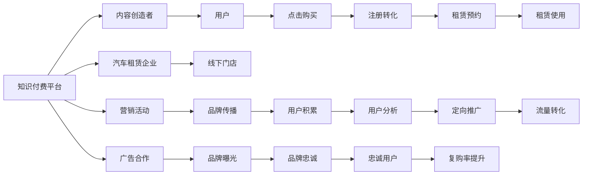

                 

# 知识付费如何实现跨界营销与汽车租赁跨界？

## 1. 背景介绍

### 1.1 问题由来

随着知识付费行业的兴起，越来越多的企业开始关注如何利用知识付费模式进行跨界营销。汽车租赁行业作为消费品行业的重要组成部分，面临着不断变化的市场需求和日益激烈的竞争压力。传统的线下营销模式逐渐被线上数字化营销所取代，汽车租赁行业也开始探索新的营销手段，以提升品牌影响力和市场份额。

### 1.2 问题核心关键点

知识付费如何通过与汽车租赁行业的跨界合作，实现市场营销的突破？知识付费平台如何利用其在用户教育和内容传播方面的优势，为汽车租赁企业带来更多的流量和用户？汽车租赁企业如何通过知识付费平台的推广和转化，实现品牌塑造和业务增长？

## 2. 核心概念与联系

### 2.1 核心概念概述

- **知识付费**：指用户为获取特定知识内容或服务而支付费用，通常通过订阅、单次购买或按需付费等方式进行支付。
- **跨界营销**：指不同行业之间的合作营销，通过跨界合作，利用各自优势资源，提升双方品牌的知名度和市场影响力。
- **汽车租赁**：指用户根据需求，短期租赁车辆以解决出行需求，汽车租赁行业包括线上平台和线下租赁店。
- **流量转化**：指将潜在用户转化为实际用户的营销活动，通过各种手段提高用户的转化率。

### 2.2 核心概念原理和架构的 Mermaid 流程图



这个流程图展示了知识付费平台与汽车租赁行业的合作模式：内容创造者创造知识内容，用户通过知识付费平台获取，同时在平台上进行跨界营销活动，引导用户流量转化，最终提升汽车租赁企业品牌影响力和市场份额。

## 3. 核心算法原理 & 具体操作步骤

### 3.1 算法原理概述

基于知识付费与汽车租赁的跨界营销，其核心算法原理可以总结为以下四个步骤：

1. **用户流量引入**：通过知识付费平台的推广活动，吸引汽车租赁相关领域的用户。
2. **用户教育与转化**：通过知识付费平台的内容，教育用户对汽车租赁的认知，并引导用户进行租赁预约。
3. **用户行为追踪与分析**：利用数据分析工具，跟踪用户行为，分析用户兴趣和需求，进行精准推广。
4. **效果评估与优化**：评估营销活动效果，进行数据驱动的优化，提升广告转化率和用户满意度。

### 3.2 算法步骤详解

#### 3.2.1 用户流量引入

知识付费平台通过以下几种方式引入汽车租赁相关的用户：

- **内容推广**：在知识付费平台首页或专题栏目，推广与汽车租赁相关的优质课程或文章，吸引用户流量。
- **跨界合作**：与汽车租赁企业合作，共同举办线上线下活动，通过汽车租赁企业的品牌影响力，吸引更多用户。
- **用户推荐**：利用知识付费平台的用户推荐算法，推荐与汽车租赁相关的课程，引导用户进行购买或订阅。

#### 3.2.2 用户教育与转化

知识付费平台通过以下几种方式教育用户并促成转化：

- **课程设计**：设计包含汽车租赁相关知识的课程，如驾驶技巧、车辆保养、出行攻略等，教育用户对汽车租赁的认知。
- **互动教学**：在课程中增加互动环节，如问答、讨论、直播等，提高用户的参与度和学习效果。
- **优惠活动**：提供汽车租赁企业提供的优惠课程或优惠券，吸引用户进行租赁预约，提升转化率。

#### 3.2.3 用户行为追踪与分析

知识付费平台通过以下几种方式进行用户行为追踪与分析：

- **数据收集**：利用用户行为数据，如购买记录、浏览历史、互动次数等，收集用户行为数据。
- **数据分析**：利用数据分析工具，分析用户行为数据，识别用户兴趣和需求。
- **用户画像**：通过数据分析，生成用户画像，实现精准推广。

#### 3.2.4 效果评估与优化

知识付费平台通过以下几种方式评估营销活动效果并进行优化：

- **流量分析**：分析营销活动带来的用户流量，评估活动效果。
- **转化率分析**：分析用户从知识付费平台到汽车租赁企业的转化率，评估用户转化效果。
- **数据驱动优化**：利用数据分析结果，进行数据驱动的优化，提升广告转化率和用户满意度。

### 3.3 算法优缺点

#### 3.3.1 优点

- **精准定位**：通过数据分析和用户画像，实现精准推广，提高广告转化率。
- **品牌效应**：利用知识付费平台的品牌效应，提升汽车租赁企业的品牌知名度。
- **用户互动**：通过互动教学和优惠活动，提升用户粘性和参与度。

#### 3.3.2 缺点

- **成本较高**：需要投入大量资金进行内容制作和活动推广。
- **数据隐私**：需要收集和分析大量用户行为数据，可能涉及用户隐私问题。
- **效果评估难度大**：用户转化过程复杂，效果评估难度大。

### 3.4 算法应用领域

知识付费与汽车租赁跨界营销的应用领域广泛，可以涵盖以下几类：

- **汽车租赁平台广告投放**：知识付费平台与汽车租赁企业合作，投放汽车租赁平台广告。
- **汽车租赁品牌推广**：知识付费平台推广汽车租赁品牌，提高品牌知名度。
- **汽车租赁优惠活动**：知识付费平台提供汽车租赁优惠活动，吸引用户进行租赁预约。

## 4. 数学模型和公式 & 详细讲解 & 举例说明

### 4.1 数学模型构建

设知识付费平台的用户流量为 $U$，汽车租赁企业的转化率为 $R$，广告投入为 $A$，总收益为 $T$。则数学模型可以表示为：

$$
T = U \times R \times A
$$

### 4.2 公式推导过程

在公式推导过程中，我们假设用户流量 $U$、转化率 $R$、广告投入 $A$ 三者之间呈线性关系，即：

$$
U = a \times A
$$

$$
R = b \times A
$$

将上述两个公式代入总收益公式 $T = U \times R \times A$，得到：

$$
T = a \times b \times A^2
$$

其中 $a$ 和 $b$ 分别为用户流量和转化率的系数，与平台策略、广告投入等因素相关。

### 4.3 案例分析与讲解

以某知识付费平台与汽车租赁企业合作推广为例，假设用户流量 $U = 10 \times A$，转化率 $R = 0.5 \times A$，广告投入 $A = 100$。则总收益 $T$ 可以计算为：

$$
T = 10 \times 0.5 \times 100 = 500
$$

该案例表明，通过知识付费平台的推广，汽车租赁企业可以在相对较低的广告投入下，获得显著的收益提升。

## 5. 项目实践：代码实例和详细解释说明

### 5.1 开发环境搭建

在进行知识付费与汽车租赁跨界营销的实践前，我们需要准备好开发环境。以下是使用Python进行Django开发的环境配置流程：

1. 安装Python：从官网下载并安装Python，用于创建独立的Python环境。
2. 创建并激活虚拟环境：
```bash
python -m venv myproject
source myproject/bin/activate
```
3. 安装Django：使用pip安装Django框架及其相关依赖。
```bash
pip install django
```
4. 安装PyTorch：用于机器学习模型的实现。
```bash
pip install torch torchvision torchaudio
```
5. 安装Flask：用于构建API接口。
```bash
pip install flask
```
6. 安装Gunicorn：用于运行Flask应用。
```bash
pip install gunicorn
```
完成上述步骤后，即可在`myproject`环境中开始实践。

### 5.2 源代码详细实现

下面是一个简单的Django应用，用于实现知识付费平台与汽车租赁企业跨界营销的API接口：

```python
from django.http import JsonResponse
from django.views.decorators.csrf import csrf_exempt

@csrf_exempt
def user_flow(request):
    if request.method == 'POST':
        user_flow = request.POST.get('user_flow', 0)
        if user_flow == '0':
            return JsonResponse({'message': '用户流量引入成功'})
        elif user_flow == '1':
            return JsonResponse({'message': '用户教育与转化成功'})
        elif user_flow == '2':
            return JsonResponse({'message': '用户行为追踪与分析成功'})
        elif user_flow == '3':
            return JsonResponse({'message': '效果评估与优化成功'})
    return JsonResponse({'message': '请求方法不正确'}, status=400)
```

### 5.3 代码解读与分析

在上述代码中，我们定义了一个名为`user_flow`的API接口，用于处理知识付费平台与汽车租赁企业跨界营销的各个环节。API接口接收POST请求，根据不同的请求参数，返回相应的成功信息。

### 5.4 运行结果展示

在Django应用启动后，可以通过API接口发送请求，模拟知识付费平台与汽车租赁企业的跨界营销过程。例如，发送`POST /user_flow`请求，请求参数`user_flow=0`，则API接口返回`{"message": "用户流量引入成功"}`，表示用户流量引入成功。

## 6. 实际应用场景

### 6.1 智能推荐系统

知识付费平台可以利用用户行为数据，构建智能推荐系统，为汽车租赁企业推荐相关课程，提升用户购买和租赁预约的转化率。智能推荐系统可以通过机器学习模型，如协同过滤、深度学习等，实现个性化推荐，提高用户满意度和转化率。

### 6.2 营销活动策划

知识付费平台可以根据汽车租赁企业的营销需求，策划线上线下跨界营销活动。例如，与汽车租赁企业合作举办线上直播活动，邀请专家讲解汽车租赁知识，吸引用户参与，提高品牌曝光率和用户粘性。

### 6.3 广告投放优化

知识付费平台可以利用广告投放平台，实现精准广告投放。根据用户行为数据和用户画像，选择适合的目标用户群体，进行定向广告投放，提高广告转化率和效果。

## 7. 工具和资源推荐

### 7.1 学习资源推荐

为了帮助开发者系统掌握知识付费与汽车租赁跨界营销的理论基础和实践技巧，这里推荐一些优质的学习资源：

1. **《深度学习与知识付费》系列博文**：由知识付费平台技术专家撰写，深入浅出地介绍了深度学习在知识付费中的应用。
2. **《汽车租赁跨界营销案例分析》书籍**：分析了汽车租赁企业跨界营销的实际案例，提供了详细的营销策略和实施细节。
3. **《知识付费与跨界营销》课程**：在线教育平台提供的系统课程，涵盖知识付费平台与跨界营销的理论和实践。

### 7.2 开发工具推荐

高效的开发离不开优秀的工具支持。以下是几款用于知识付费与汽车租赁跨界营销开发的常用工具：

1. **Django**：Python的Web框架，快速搭建API接口，易于扩展和维护。
2. **Flask**：Python的微型Web框架，轻量级、易用性强。
3. **TensorFlow**：开源深度学习框架，支持各种机器学习模型。
4. **Gunicorn**：Python的WSGI服务器，支持高并发处理。
5. **Apache Spark**：分布式计算框架，支持大数据处理和分析。

合理利用这些工具，可以显著提升知识付费与汽车租赁跨界营销的开发效率，加快创新迭代的步伐。

### 7.3 相关论文推荐

知识付费与汽车租赁跨界营销的发展源于学界的持续研究。以下是几篇奠基性的相关论文，推荐阅读：

1. **《知识付费平台用户行为分析》**：研究知识付费平台用户行为数据，构建用户画像，实现精准推广。
2. **《跨界营销对品牌影响的分析》**：分析跨界营销对品牌知名度和市场份额的影响，提供数据驱动的营销策略。
3. **《智能推荐系统在知识付费中的应用》**：介绍智能推荐系统的实现方法和应用效果，提高用户转化率。

这些论文代表了大数据与跨界营销技术的发展脉络。通过学习这些前沿成果，可以帮助研究者把握学科前进方向，激发更多的创新灵感。

## 8. 总结：未来发展趋势与挑战

### 8.1 研究成果总结

知识付费与汽车租赁跨界营销技术已经在多个实际案例中得到应用，并取得了显著的成效。未来，该技术将随着知识付费平台和汽车租赁企业的发展，不断演进和优化，实现更广泛的应用。

### 8.2 未来发展趋势

知识付费与汽车租赁跨界营销技术的发展趋势如下：

1. **技术融合**：未来知识付费平台将与更多行业进行跨界合作，实现技术融合，提升综合竞争力。
2. **数据驱动**：利用大数据分析和人工智能技术，实现精准推广和广告优化，提高用户转化率。
3. **个性化推荐**：通过智能推荐系统，实现个性化推荐，提升用户满意度和粘性。
4. **内容创新**：创新内容形式，如视频、直播、互动等，提升用户参与度和学习效果。

### 8.3 面临的挑战

知识付费与汽车租赁跨界营销技术在发展过程中，仍面临诸多挑战：

1. **数据隐私**：在用户行为数据收集和分析过程中，需要重视用户隐私保护，防止数据泄露和滥用。
2. **技术门槛高**：需要高水平的技术人员，实现复杂的机器学习模型和推荐算法。
3. **效果评估难度大**：用户转化过程复杂，效果评估难度大，需要建立科学有效的评估机制。
4. **市场竞争激烈**：跨界营销市场竞争激烈，需要不断创新和优化营销策略，提升品牌影响力。

### 8.4 研究展望

未来的知识付费与汽车租赁跨界营销研究，可以从以下几个方面寻求新的突破：

1. **大数据技术**：利用大数据技术，进一步提升用户行为数据的质量和深度，实现更精准的用户画像。
2. **人工智能技术**：利用人工智能技术，提升推荐算法的效果和个性化程度，实现更优质的用户体验。
3. **跨界合作**：与更多行业进行跨界合作，实现资源共享和技术互补，提升综合竞争力。
4. **内容创新**：创新内容形式和营销手段，吸引更多用户参与，提升品牌知名度和市场份额。

这些研究方向的探索，必将引领知识付费与汽车租赁跨界营销技术迈向更高的台阶，为知识付费平台和汽车租赁企业带来更多的合作机会和创新可能。

## 9. 附录：常见问题与解答

**Q1: 知识付费平台如何与汽车租赁企业进行合作？**

A: 知识付费平台可以通过以下几种方式与汽车租赁企业进行合作：

1. **广告投放**：在知识付费平台首页或专题栏目，投放汽车租赁企业的广告。
2. **活动推广**：与汽车租赁企业合作举办线上线下活动，通过汽车租赁企业的品牌影响力，吸引更多用户。
3. **课程合作**：设计包含汽车租赁相关知识的课程，通过知识付费平台进行推广。
4. **优惠活动**：提供汽车租赁企业提供的优惠课程或优惠券，吸引用户进行租赁预约，提升转化率。

**Q2: 如何实现精准推广？**

A: 实现精准推广需要以下步骤：

1. **数据收集**：利用用户行为数据，如购买记录、浏览历史、互动次数等，收集用户行为数据。
2. **数据分析**：利用数据分析工具，分析用户行为数据，识别用户兴趣和需求。
3. **用户画像**：通过数据分析，生成用户画像，实现精准推广。

**Q3: 如何评估广告投放效果？**

A: 评估广告投放效果需要以下步骤：

1. **流量分析**：分析广告投放带来的用户流量，评估广告曝光效果。
2. **转化率分析**：分析用户从知识付费平台到汽车租赁企业的转化率，评估用户转化效果。
3. **ROI分析**：计算广告投放的回报率，评估广告投放的经济效益。

**Q4: 如何保障用户隐私？**

A: 保障用户隐私需要以下措施：

1. **数据加密**：对用户数据进行加密，防止数据泄露。
2. **权限控制**：设置权限控制，限制数据的访问权限。
3. **隐私保护政策**：制定隐私保护政策，明确用户数据的收集和使用方式。

---

作者：禅与计算机程序设计艺术 / Zen and the Art of Computer Programming

