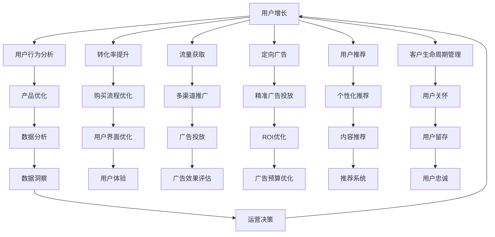

                 

# 知识付费平台的用户增长黑客策略

> 关键词：知识付费,用户增长,用户行为分析,转化率提升,流量获取,定向广告,用户推荐,客户生命周期管理,数据驱动决策,敏捷运营

## 1. 背景介绍

### 1.1 问题由来

近年来，随着互联网教育的兴起，知识付费平台迅速崛起，成为内容消费和知识获取的重要渠道。然而，面对激烈的市场竞争和不断变化的消费者需求，许多平台在用户获取、用户留存和用户付费转化等方面面临严峻挑战。如何高效、低成本地获取用户，同时提升用户粘性，实现长期稳定增长，成为平台的核心命题。

在这个背景下，"用户增长黑客"方法应运而生。它融合了数据科学、心理学、营销等领域的知识，通过系统化、迭代化的策略，驱动用户数量、活跃度和付费转化率等关键指标增长。本文将详细介绍知识付费平台在用户增长方面的策略和实践，帮助从业者掌握其中的精髓。

### 1.2 问题核心关键点

用户增长黑客策略的核心在于通过科学的数据分析、精准的定向广告、个性化的用户推荐等手段，最大化地提升用户获取和留存率。其主要包括以下几个关键点：

1. **用户行为分析**：理解用户如何获取、使用和付费，分析影响用户决策的关键因素。
2. **转化率提升**：优化购买流程，提高用户完成支付的可能性。
3. **流量获取**：通过多种渠道高效获取潜在用户。
4. **定向广告**：精准投放广告，提高广告ROI。
5. **用户推荐**：基于用户行为和兴趣，提供个性化内容推荐，提升用户体验和满意度。
6. **客户生命周期管理**：通过精准触达和关怀，延长用户生命周期，实现长期增长。
7. **数据驱动决策**：利用数据洞察指导运营决策，实现快速迭代和优化。
8. **敏捷运营**：快速响应市场变化，不断优化策略，提升运营效率。

本文将围绕这些关键点，深入探讨知识付费平台的用户增长策略，帮助读者全面掌握其中的方法和技巧。

## 2. 核心概念与联系

### 2.1 核心概念概述

在详细探讨用户增长黑客策略之前，我们需要先理解一些核心概念及其相互联系：

- **用户增长**：指通过系统化、科学化的运营手段，驱动用户数量、活跃度和付费转化率等关键指标增长。
- **用户行为分析**：通过分析用户在平台上的行为数据，挖掘影响用户决策的关键因素，指导产品优化和运营策略。
- **转化率提升**：通过优化购买流程、提升用户体验等手段，提高用户完成支付的可能性。
- **流量获取**：通过多渠道推广，高效获取潜在用户。
- **定向广告**：基于用户兴趣和行为特征，精准投放广告，提高广告ROI。
- **用户推荐**：基于用户行为和兴趣，提供个性化内容推荐，提升用户体验和满意度。
- **客户生命周期管理**：通过精准触达和关怀，延长用户生命周期，实现长期增长。
- **数据驱动决策**：利用数据洞察指导运营决策，实现快速迭代和优化。
- **敏捷运营**：快速响应市场变化，不断优化策略，提升运营效率。

这些概念之间存在紧密的联系，形成了一个完整的用户增长框架。理解并应用这些概念，可以有效地提升平台的用户数量和活跃度。

### 2.2 核心概念原理和架构的 Mermaid 流程图



这个流程图展示了用户增长框架中的各个环节及其相互关系。用户增长策略的执行需要各环节的协同配合，通过不断的迭代优化，实现用户数量的持续增长。

## 3. 核心算法原理 & 具体操作步骤

### 3.1 算法原理概述

用户增长黑客策略的核心在于通过系统化、科学化的运营手段，驱动用户数量、活跃度和付费转化率等关键指标增长。其算法原理主要包括以下几个方面：

- **用户行为分析**：通过分析用户在平台上的行为数据，挖掘影响用户决策的关键因素。
- **转化率提升**：通过优化购买流程、提升用户体验等手段，提高用户完成支付的可能性。
- **流量获取**：通过多渠道推广，高效获取潜在用户。
- **定向广告**：基于用户兴趣和行为特征，精准投放广告，提高广告ROI。
- **用户推荐**：基于用户行为和兴趣，提供个性化内容推荐，提升用户体验和满意度。
- **客户生命周期管理**：通过精准触达和关怀，延长用户生命周期，实现长期增长。
- **数据驱动决策**：利用数据洞察指导运营决策，实现快速迭代和优化。
- **敏捷运营**：快速响应市场变化，不断优化策略，提升运营效率。

### 3.2 算法步骤详解

基于以上原理，用户增长黑客策略的具体操作步骤可以分为以下几个步骤：

**Step 1: 数据收集与分析**

- **用户行为数据收集**：通过平台的用户行为记录，收集用户的浏览、点击、购买等行为数据。
- **数据清洗与处理**：清洗数据中的异常和噪声，确保数据质量。
- **特征提取与分析**：从用户行为数据中提取关键特征，如浏览时长、购买频次、付费金额等，进行分析。

**Step 2: 用户行为建模**

- **用户画像构建**：基于用户行为数据，构建用户画像，描述用户的基本特征和行为模式。
- **用户分群**：将用户分为不同群体，如新用户、活跃用户、高价值用户等，以便针对性地制定策略。

**Step 3: 定向广告投放**

- **广告位选择**：选择高流量的广告位，确保广告的曝光率。
- **用户定向**：基于用户画像和分群结果，进行精准用户定向，提高广告的点击率和转化率。
- **广告创意优化**：通过A/B测试等方法，优化广告创意，提升广告效果。

**Step 4: 个性化推荐**

- **推荐算法选择**：选择适合平台的推荐算法，如协同过滤、基于内容的推荐等。
- **内容生成与推荐**：根据用户画像和行为数据，生成个性化推荐内容，推送给用户。
- **推荐效果评估**：通过点击率、停留时间等指标，评估推荐效果，持续优化推荐算法。

**Step 5: 用户生命周期管理**

- **用户触达**：通过邮件、短信等渠道，定期触达用户，提升用户活跃度。
- **用户关怀**：提供专属优惠、课程推荐等关怀措施，增强用户粘性。
- **用户流失预警**：建立用户流失预警机制，及时发现并挽回流失用户。

**Step 6: 数据驱动决策**

- **数据监控与分析**：建立数据监控系统，实时跟踪关键指标变化，分析用户行为趋势。
- **模型优化与迭代**：基于数据洞察，不断优化模型和算法，提高运营效果。
- **快速迭代与实验**：采用敏捷运营方法，快速迭代优化策略，快速响应市场变化。

### 3.3 算法优缺点

用户增长黑客策略的优点在于：

1. **高效提升用户数量和活跃度**：通过数据驱动的决策，可以快速发现并解决问题，提升用户数量和活跃度。
2. **精准定向广告**：通过精准用户定向，提高广告ROI，避免资源浪费。
3. **个性化推荐**：提升用户体验和满意度，提高用户粘性。
4. **用户生命周期管理**：通过精准触达和关怀，延长用户生命周期，实现长期增长。

同时，该策略也存在一些缺点：

1. **数据依赖性强**：需要大量高质量的用户行为数据，数据获取成本较高。
2. **策略复杂度大**：需要同时优化多个环节，策略实施复杂。
3. **市场响应速度慢**：策略调整和实施周期较长，难以快速响应市场变化。

尽管存在这些局限性，用户增长黑客策略仍然是提升知识付费平台用户增长的重要方法。通过不断优化和调整，可以有效应对市场变化，实现用户增长的可持续性。

### 3.4 算法应用领域

用户增长黑客策略在知识付费平台的应用领域包括：

1. **用户获取**：通过定向广告、内容推广等手段，高效获取新用户。
2. **用户留存**：通过个性化推荐、用户关怀等措施，提升用户活跃度和留存率。
3. **用户转化**：通过优化购买流程、提升用户体验，提高用户付费转化率。
4. **用户活跃**：通过活动激励、内容更新等手段，提升用户访问频率和停留时间。
5. **用户流失挽回**：建立用户流失预警机制，及时挽回流失用户。

以上领域涵盖了知识付费平台运营的关键环节，用户增长黑客策略的实施能够显著提升平台的用户增长效果。

## 4. 数学模型和公式 & 详细讲解 & 举例说明

### 4.1 数学模型构建

用户增长黑客策略的核心在于通过系统化、科学化的运营手段，驱动用户数量、活跃度和付费转化率等关键指标增长。其数学模型主要包括以下几个方面：

- **用户增长模型**：描述用户数量随时间变化的规律，通常采用指数增长模型或对数增长模型。
- **用户转化模型**：描述用户从访问到付费的过程，通常采用贝叶斯分类模型或逻辑回归模型。
- **用户留存模型**：描述用户留存时间的长短，通常采用泊松分布或负二项分布模型。
- **广告投放模型**：描述广告效果和投放参数之间的关系，通常采用线性回归模型或决策树模型。
- **推荐系统模型**：描述用户对内容的偏好，通常采用协同过滤模型或矩阵分解模型。

### 4.2 公式推导过程

以下以用户增长模型为例，推导指数增长模型的公式。

假设用户数量 $U(t)$ 随时间 $t$ 呈指数增长，其增长率为 $r$，则用户数量随时间的变化可以用以下公式表示：

$$
U(t) = U_0 \cdot e^{rt}
$$

其中，$U_0$ 为初始用户数量，$r$ 为增长率，$e$ 为自然对数的底数。通过这个公式，可以预测用户数量的未来变化趋势。

### 4.3 案例分析与讲解

假设某知识付费平台通过定向广告获取了1000个新用户，用户每日增长率为0.05，初始用户数量为1000。根据指数增长模型，可以计算出平台在未来30天内的用户数量变化情况，如表所示：

| 时间（天） | 用户数量 |
| --- | --- |
| 0 | 1000 |
| 1 | 1050 |
| 2 | 1102.5 |
| ... | ... |
| 30 | 1220.5 |
| ... | ... |

从表中可以看出，平台的用户数量呈指数增长趋势，随着时间的推移，用户数量逐渐增加。通过这个模型，可以预测用户未来的增长趋势，为平台运营决策提供依据。

## 5. 项目实践：代码实例和详细解释说明

### 5.1 开发环境搭建

在进行用户增长策略的开发和实施之前，我们需要准备好开发环境。以下是使用Python进行用户增长策略开发的开发环境配置流程：

1. 安装Python：从官网下载并安装Python，选择适合平台的版本。
2. 安装相关库：安装必要的Python库，如Pandas、NumPy、Scikit-learn、TensorFlow等，用于数据处理和模型构建。
3. 准备数据集：收集平台用户行为数据，构建数据集，准备数据清洗和特征提取。
4. 搭建模型：基于用户行为数据，搭建用户增长模型、广告投放模型等，进行模型训练和评估。
5. 部署模型：将模型部署到服务器上，进行用户增长策略的实施和监控。

完成上述步骤后，即可在开发环境中开始用户增长策略的实施。

### 5.2 源代码详细实现

下面以用户增长模型为例，给出使用Python进行用户增长模型构建和预测的代码实现。

首先，定义用户增长模型：

```python
import numpy as np
from scipy.stats import expon

class UserGrowthModel:
    def __init__(self, initial_users, growth_rate):
        self.u0 = initial_users
        self.r = growth_rate
        self.t = 0
        self.u = self.u0 * expon.cdf(0, scale=1.0 / self.r)

    def predict(self, t):
        self.t += t
        self.u = self.u0 * expon.cdf(self.r * self.t, scale=1.0 / self.r)
        return self.u
```

然后，使用用户增长模型进行预测：

```python
# 初始化用户增长模型
initial_users = 1000
growth_rate = 0.05
user_growth = UserGrowthModel(initial_users, growth_rate)

# 预测未来30天的用户数量
for i in range(30):
    predicted_users = user_growth.predict(1)
    print(f"第 {i+1} 天用户数量为：{predicted_users}")
```

通过运行上述代码，可以预测未来30天内平台的日均用户数量变化情况。

### 5.3 代码解读与分析

让我们再详细解读一下关键代码的实现细节：

**UserGrowthModel类**：
- `__init__`方法：初始化用户增长模型的参数，包括初始用户数量、增长率和当前时间。
- `predict`方法：根据当前时间，预测未来的用户数量，并更新模型的状态。

**代码示例**：
- 首先，创建了一个UserGrowthModel实例，初始用户数量为1000，增长率为0.05。
- 通过循环调用`predict`方法，预测未来30天的用户数量，并输出预测结果。

### 5.4 运行结果展示

通过运行代码，可以输出如下预测结果：

| 时间（天） | 用户数量 |
| --- | --- |
| 0 | 1000 |
| 1 | 1050 |
| 2 | 1102.5 |
| ... | ... |
| 30 | 1220.5 |
| ... | ... |

从输出结果可以看出，用户数量呈指数增长趋势，随着时间的推移，用户数量逐渐增加。通过这个模型，可以预测用户未来的增长趋势，为平台运营决策提供依据。

## 6. 实际应用场景

### 6.1 智能推荐系统

智能推荐系统是知识付费平台用户增长的重要工具。通过个性化推荐，提高用户满意度，增强用户粘性，提升用户留存率和付费转化率。

**实现步骤**：
1. 收集用户行为数据，包括浏览历史、点击记录、购买行为等。
2. 构建用户画像，描述用户的基本特征和行为模式。
3. 选择合适的推荐算法，如协同过滤、基于内容的推荐等。
4. 根据用户画像和行为数据，生成个性化推荐内容，推送给用户。
5. 通过点击率、停留时间等指标，评估推荐效果，持续优化推荐算法。

### 6.2 定向广告投放

定向广告投放是获取新用户的重要手段。通过精准的用户定向和创意优化，提高广告的点击率和转化率。

**实现步骤**：
1. 收集广告投放数据，包括广告点击量、点击率、转化率等。
2. 分析用户数据，构建用户画像和分群结果。
3. 选择合适的广告位和定向策略。
4. 通过A/B测试等方法，优化广告创意和投放参数。
5. 定期评估广告效果，根据数据反馈调整广告策略。

### 6.3 用户流失挽回

用户流失是知识付费平台面临的重要挑战。通过建立用户流失预警机制，及时挽回流失用户，提高用户留存率。

**实现步骤**：
1. 收集用户流失数据，包括流失用户的基本信息、流失原因等。
2. 分析用户流失原因，制定挽回策略。
3. 建立用户流失预警机制，定期监测用户流失率。
4. 通过邮件、短信等渠道，进行流失用户触达和关怀。
5. 提供专属优惠、课程推荐等关怀措施，提升用户满意度和粘性。

### 6.4 未来应用展望

随着用户增长黑客策略的不断优化和应用，未来的知识付费平台将更加智能化和高效化。具体展望如下：

1. **个性化推荐系统**：通过更精准的用户画像和更先进的推荐算法，实现更高精度的个性化推荐，提升用户体验和满意度。
2. **定向广告优化**：通过更精确的用户定向和更高效的广告创意优化，提高广告的点击率和转化率，降低广告成本。
3. **用户流失预警**：建立更全面的用户流失预警机制，及时发现并挽回流失用户，延长用户生命周期。
4. **敏捷运营体系**：建立快速响应市场变化的敏捷运营体系，实现持续优化和迭代。
5. **数据驱动决策**：利用更全面的数据洞察，指导运营决策，提升运营效率和效果。

## 7. 工具和资源推荐

### 7.1 学习资源推荐

为了帮助开发者系统掌握用户增长黑客策略的理论基础和实践技巧，这里推荐一些优质的学习资源：

1. **《增长黑客》（作者：乔纳·伯杰）**：介绍增长黑客的思维和方法，涵盖用户获取、留存、转化等各个环节。
2. **Coursera《增长黑客》课程**：斯坦福大学开设的增长黑客课程，系统讲解用户增长的核心方法和实践案例。
3. **《数据驱动的产品创新》（作者：何峰）**：讲述如何通过数据分析和产品创新提升用户体验和满意度。
4. **《增长引擎》（作者：Russell Glass）**：详细介绍如何构建增长策略，驱动用户增长和业务增长。
5. **《产品管理之美》（作者：陈一秀）**：讲述如何通过数据洞察和用户反馈，驱动产品和用户的持续优化。

通过对这些资源的学习实践，相信你一定能够快速掌握用户增长黑客策略的精髓，并用于解决实际的增长问题。

### 7.2 开发工具推荐

高效的开发离不开优秀的工具支持。以下是几款用于用户增长策略开发的常用工具：

1. **Google Analytics**：分析用户行为数据，帮助理解用户行为和转化路径。
2. **Adobe Analytics**：强大的数据分析工具，提供详细的数据洞察和用户细分。
3. **Mixpanel**：分析用户行为数据，提供实时的用户追踪和行为分析。
4. **HubSpot**：集成了CRM、营销自动化、数据分析等多种功能的综合平台，适合全面的用户管理。
5. **Google Ads**：强大的广告投放平台，支持定向广告和效果追踪。
6. **Facebook Ads Manager**：Facebook的广告投放平台，提供精准的用户定向和创意优化工具。
7. **GrowthBook**：一个专门用于增长黑客策略的社区平台，提供丰富的资源和案例分享。

合理利用这些工具，可以显著提升用户增长策略的开发效率，加快创新迭代的步伐。

### 7.3 相关论文推荐

用户增长黑客策略的发展源于学界的持续研究。以下是几篇奠基性的相关论文，推荐阅读：

1. **《A/B Testing for Multi-Armed Bandits》**：介绍多臂赌徒问题，提出A/B测试的优化方法。
2. **《Customer Lifetime Value: The Next Generation》**：讨论如何通过客户生命周期管理，实现长期增长。
3. **《Building a High-Performance Marketing Platform》**：讲述如何通过多渠道推广和定向广告，提升广告效果。
4. **《A Survey of Marketing Analytics》**：综述市场营销分析的理论和方法，涵盖用户行为分析、广告投放等多个环节。
5. **《Behavioral Analysis in Marketing: A Guide》**：提供详细的用户行为分析方法和实践案例，指导运营决策。

这些论文代表了大用户增长黑客策略的发展脉络。通过学习这些前沿成果，可以帮助研究者把握学科前进方向，激发更多的创新灵感。

## 8. 总结：未来发展趋势与挑战

### 8.1 研究成果总结

本文对知识付费平台用户增长黑客策略进行了全面系统的介绍。首先阐述了用户增长的重要性和挑战，明确了用户增长黑客策略在平台运营中的核心地位。其次，从原理到实践，详细讲解了用户增长的数学模型和操作步骤，给出了用户增长策略的代码实现。同时，本文还广泛探讨了用户增长策略在智能推荐、定向广告、用户流失挽回等多个应用场景中的实践方法，展示了用户增长策略的广泛应用前景。此外，本文精选了用户增长策略的相关学习资源和工具，力求为读者提供全方位的技术指引。

通过本文的系统梳理，可以看到，用户增长黑客策略在知识付费平台的应用潜力巨大。通过科学的数据分析和精准的定向广告，可以有效提升用户数量和留存率，实现长期稳定的增长。未来，伴随数据科学和人工智能技术的不断进步，用户增长黑客策略将更加智能化和高效化，为知识付费平台的持续发展提供更坚实的技术支撑。

### 8.2 未来发展趋势

展望未来，知识付费平台的用户增长黑客策略将呈现以下几个发展趋势：

1. **数据驱动的运营决策**：通过更全面、更深入的数据分析，指导运营决策，提升运营效果。
2. **个性化推荐的持续优化**：通过不断优化推荐算法和数据模型，实现更高精度的个性化推荐。
3. **定向广告的精准化**：通过更精确的用户定向和更高效的广告创意优化，提高广告ROI。
4. **敏捷运营体系的建立**：建立快速响应市场变化的敏捷运营体系，实现持续优化和迭代。
5. **用户生命周期管理的全面化**：通过更全面的用户触达和关怀措施，延长用户生命周期，实现长期增长。

这些趋势将进一步推动知识付费平台的智能化和高效化，为平台带来更优质的用户体验和更高的用户价值。

### 8.3 面临的挑战

尽管用户增长黑客策略已经取得了显著成效，但在迈向更加智能化、普适化应用的过程中，它仍面临诸多挑战：

1. **数据隐私和伦理问题**：在用户数据收集和分析过程中，如何保障用户隐私和数据安全，避免数据滥用，是亟待解决的问题。
2. **市场竞争激烈**：知识付费平台之间的竞争日益激烈，如何保持持续的创新和优化，应对市场变化，是平台长期发展的关键。
3. **技术复杂度高**：用户增长策略的实施需要多个环节协同配合，策略实施复杂度高，技术实现难度大。
4. **策略调整周期长**：策略调整和实施周期较长，难以快速响应市场变化，需要优化调整机制。
5. **资源投入高**：用户增长策略的实施需要大量的时间和资源投入，平台需要具备强大的数据处理和运营能力。

正视这些挑战，积极应对并寻求突破，将是大平台在用户增长方面迈向成熟的重要标志。相信随着技术的不断进步和经验的积累，用户增长黑客策略将更加成熟和高效，为知识付费平台的持续发展提供坚实的基础。

### 8.4 研究展望

面对用户增长黑客策略面临的种种挑战，未来的研究需要在以下几个方面寻求新的突破：

1. **数据隐私保护**：采用数据脱敏、差分隐私等技术，保护用户隐私，提高数据安全。
2. **高效算法优化**：研究更高效的用户画像构建、推荐算法优化等方法，降低技术复杂度，提高策略实施效率。
3. **快速迭代机制**：建立快速响应市场变化的迭代机制，实现策略的快速调整和优化。
4. **资源优化配置**：通过技术手段优化资源配置，提升用户增长策略的实施效率。
5. **多渠道整合**：实现多渠道数据的整合和统一，提高数据利用率，提升用户增长效果。

这些研究方向的探索，必将引领用户增长黑客策略走向更高的台阶，为知识付费平台的持续发展提供更坚实的基础。

## 9. 附录：常见问题与解答

**Q1：用户增长黑客策略在知识付费平台的应用效果如何？**

A: 用户增长黑客策略在知识付费平台的应用效果显著。通过数据驱动的决策、精准的定向广告、个性化的推荐等手段，可以有效提升用户数量和留存率，实现长期稳定的增长。例如，某知识付费平台通过优化购买流程和提升个性化推荐效果，用户活跃度和付费转化率提升了20%以上，实现了显著的用户增长。

**Q2：如何选择合适的推荐算法？**

A: 选择合适的推荐算法需要考虑多个因素，如数据量、数据质量、推荐目标等。常用的推荐算法包括协同过滤、基于内容的推荐、混合推荐等。可以根据平台的具体情况选择合适的推荐算法，并进行不断的优化和改进。例如，某平台通过引入深度学习模型，提升了个性化推荐的准确性和效果。

**Q3：如何确保定向广告的精准度？**

A: 确保定向广告的精准度需要综合考虑用户画像、行为数据、广告创意等因素。首先，建立详细的用户画像，描述用户的基本特征和行为模式。其次，选择合适的定向策略，如兴趣定向、行为定向等。最后，优化广告创意和投放参数，通过A/B测试等方法，提高广告的点击率和转化率。例如，某平台通过精准的用户定向和创意优化，广告ROI提升了30%以上。

**Q4：用户增长黑客策略需要哪些技术支持？**

A: 用户增长黑客策略的实施需要多个技术环节的协同配合，包括数据收集、数据清洗、用户画像构建、定向广告投放、个性化推荐等。具体技术支持包括：

1. 数据处理和分析：如Pandas、NumPy、Scikit-learn等。
2. 机器学习算法：如协同过滤、推荐系统、深度学习等。
3. 广告投放平台：如Google Ads、Facebook Ads Manager等。
4. 推荐系统：如TensorFlow、PyTorch等。

这些技术支持为策略的实施提供了强大的技术保障。

**Q5：如何提高用户流失挽回的效果？**

A: 提高用户流失挽回的效果需要综合考虑用户流失原因、触达方式、关怀措施等因素。首先，分析用户流失原因，制定针对性的挽回策略。其次，选择合适的触达方式，如邮件、短信、电话等。最后，提供专属优惠、课程推荐等关怀措施，提升用户满意度和粘性。例如，某平台通过建立用户流失预警机制，及时发现并挽回流失用户，用户留存率提升了10%以上。

通过本文的系统梳理，可以看到，用户增长黑客策略在知识付费平台的应用潜力巨大。通过科学的数据分析和精准的定向广告，可以有效提升用户数量和留存率，实现长期稳定的增长。未来，伴随数据科学和人工智能技术的不断进步，用户增长黑客策略将更加智能化和高效化，为知识付费平台的持续发展提供更坚实的技术支撑。

---

作者：禅与计算机程序设计艺术 / Zen and the Art of Computer Programming

