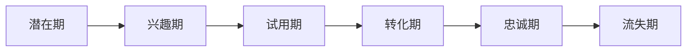
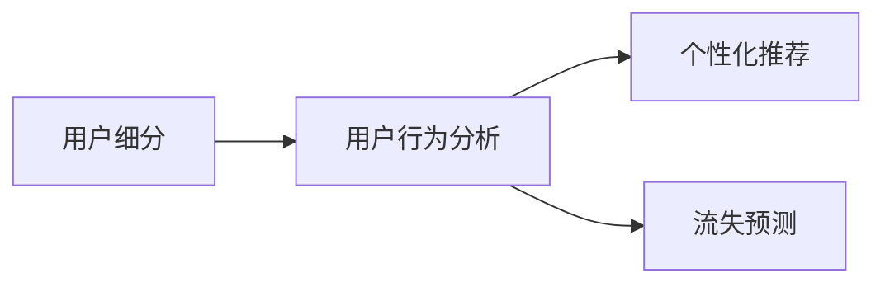
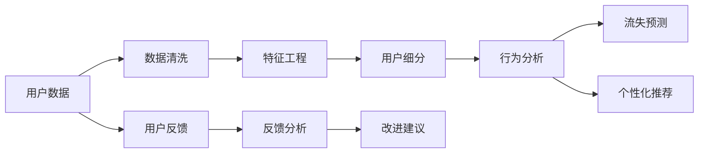

                 

# 知识付费平台的用户生命周期管理

> 关键词：知识付费, 用户生命周期, 客户细分, 用户行为分析, 用户流失预测, 个性化推荐

## 1. 背景介绍

### 1.1 问题由来
随着知识付费行业的迅猛发展，知识付费平台的用户数量不断增长，但用户流失率高、续订率低、转化率低等问题也逐渐凸显。如何对用户进行有效的生命周期管理，提升用户的活跃度、黏性、续费率等关键指标，成为各大知识付费平台亟待解决的重要问题。

### 1.2 问题核心关键点
用户生命周期管理（User Lifecycle Management, ULM）是大数据和用户行为分析的重要应用之一，通过分析用户在生命周期中的各个阶段行为，挖掘用户需求，实现精准营销和个性化推荐，最终提升用户价值和平台收益。

一个完整用户生命周期一般包括以下几个阶段：

- **潜在期**：用户了解到知识付费平台，但尚未注册。
- **兴趣期**：用户注册并浏览了平台内容。
- **试用期**：用户首次付费，体验平台产品。
- **转化期**：用户完成首次续费，进入正常消费期。
- **忠诚期**：用户长期续费，成为付费平台的忠诚用户。
- **流失期**：用户不再续费，进入流失状态。

各阶段行为数据及其转化关系如下图所示：



## 2. 核心概念与联系

### 2.1 核心概念概述

在用户生命周期管理中，涉及以下几个核心概念：

- **用户生命周期（User Lifecycle）**：指用户与平台的互动历程，包括各阶段的转化率和流失率。
- **用户细分（User Segmentation）**：根据用户行为特征，将用户划分为不同的群体，便于针对性运营。
- **用户行为分析（User Behavior Analysis）**：通过分析用户行为数据，理解用户需求和兴趣，实现精准营销。
- **个性化推荐（Personalized Recommendation）**：基于用户行为数据，推送个性化内容，提升用户体验和满意度。
- **流失预测（Churn Prediction）**：通过机器学习模型，预测用户流失风险，及时采取干预措施。

这些概念之间的关系可以通过以下Mermaid流程图来展示：



### 2.2 核心概念原理和架构的 Mermaid 流程图

在用户生命周期管理中，数据流向和关键组件可以描述如下：



此架构中，关键组件及作用如下：

- **数据清洗**：清洗用户数据，去除噪音和异常值，确保数据质量。
- **特征工程**：提取和构造用户行为特征，为后续模型训练提供数据支持。
- **用户细分**：基于用户行为特征，划分不同的用户群体，实现精准运营。
- **行为分析**：分析用户行为数据，理解用户需求和兴趣，实现精准营销。
- **流失预测**：预测用户流失风险，及时采取干预措施，减少流失率。
- **个性化推荐**：根据用户行为数据，推送个性化内容，提升用户体验和满意度。
- **反馈分析**：收集用户反馈，分析其原因，持续改进产品。

## 3. 核心算法原理 & 具体操作步骤

### 3.1 算法原理概述

用户生命周期管理的核心在于对用户数据进行科学分析和预测，从而实现精准运营和个性化推荐。以下介绍几种常用的算法：

- **K-Means聚类算法**：用于用户细分，将用户划分为不同的群体。
- **决策树和随机森林**：用于用户行为分析，预测用户流失和推荐行为。
- **协同过滤和深度学习模型**：用于个性化推荐，根据用户行为数据预测其兴趣。

### 3.2 算法步骤详解

以协同过滤推荐算法为例，其核心步骤包括：

1. **数据准备**：收集用户行为数据，包括浏览历史、购买记录等。
2. **用户建模**：将用户行为转化为向量表示，如使用ALS算法。
3. **物品建模**：构建物品向量和相似度矩阵。
4. **协同过滤**：根据用户和物品的相似度，预测用户对物品的兴趣，并进行推荐。

具体步骤如下：

**Step 1: 数据准备**

```python
import pandas as pd

# 读取用户行为数据
user_data = pd.read_csv('user_behavior_data.csv')

# 清洗和预处理数据
# 如去除缺失值、去除异常值、特征编码等
```

**Step 2: 用户建模**

```python
from pyspark.mllib.recommendation import ALS

# 创建ALS模型
model = ALS(items_per_user=20, iter=10, alpha=0.01, regularization=0.01)

# 训练模型
model.train(user_data[['item', 'rating']])

# 预测用户对物品的评分
user_score = model.predictAll(user_data[['user']])
```

**Step 3: 物品建模**

```python
# 计算物品相似度
item_similarity = model.similarityPairs()

# 保存物品相似度矩阵
pd.DataFrame(item_similarity, columns=user_data['item']).to_csv('item_similarity_matrix.csv')
```

**Step 4: 协同过滤推荐**

```python
# 读取物品相似度矩阵
item_similarity = pd.read_csv('item_similarity_matrix.csv')

# 构建推荐模型
recommender = RecommendationModel(user_data, item_similarity, num_recomm=5)

# 推荐物品列表
item_recomm = recommender.recommend(user_data[['user']])
```

### 3.3 算法优缺点

协同过滤推荐算法的优点在于计算简单、易于实现，能够处理大量用户行为数据，发现隐式关联。但缺点在于数据稀疏性、新用户冷启动问题以及用户动态行为变化等问题。

### 3.4 算法应用领域

协同过滤推荐算法在知识付费平台的用户生命周期管理中具有广泛应用，可用于以下方面：

- **个性化内容推荐**：推荐用户感兴趣的内容，提升用户粘性。
- **流失用户预测**：预测可能流失的用户，进行挽留策略。
- **新用户激活**：推荐新用户感兴趣的课程，提高平台留存率。

## 4. 数学模型和公式 & 详细讲解 & 举例说明

### 4.1 数学模型构建

用户生命周期管理中的数学模型主要分为数据模型和预测模型两部分。数据模型用于构建用户行为特征，预测模型用于预测用户流失和行为变化。

**用户行为模型**

假设用户 $u$ 对物品 $i$ 的评分 $r_{ui}$ 由两部分组成：

$$
r_{ui} = f_{u}(i) + f_{i}(u) + \epsilon_{ui}
$$

其中 $f_{u}(i)$ 和 $f_{i}(u)$ 分别为用户 $u$ 和物品 $i$ 的潜在因子，$\epsilon_{ui}$ 为噪声项。

用户 $u$ 和物品 $i$ 的潜在因子可表示为：

$$
f_{u} = \theta_{u}^{T} \psi_{u}
$$

$$
f_{i} = \phi_{i}^{T} \psi_{i}
$$

其中 $\theta_{u}$ 和 $\phi_{i}$ 分别为用户 $u$ 和物品 $i$ 的潜在因子向量，$\psi_{u}$ 和 $\psi_{i}$ 分别为用户的潜在因子矩阵和物品的潜在因子矩阵。

**用户流失预测模型**

用户流失预测模型通常采用逻辑回归或决策树等分类算法。以逻辑回归模型为例，假设用户 $u$ 流失的伯努利概率为 $y_{u}$，模型为：

$$
y_{u} = \alpha_{0} + \sum_{i=1}^{n} \alpha_{i} f_{i} + \epsilon_{u}
$$

其中 $f_{i}$ 为第 $i$ 个特征的系数，$\epsilon_{u}$ 为噪声项。

### 4.2 公式推导过程

以协同过滤推荐算法为例，推导用户评分预测公式。假设用户 $u$ 和物品 $i$ 的评分向量分别为 $\theta_{u}$ 和 $\phi_{i}$，则用户 $u$ 对物品 $i$ 的预测评分为：

$$
\hat{r}_{ui} = \theta_{u}^{T} \phi_{i}
$$

为了提升预测精度，使用LRM模型进行评分预测，假设预测评分为 $y_{ui}$，则模型为：

$$
y_{ui} = w_{0} + \sum_{i=1}^{n} w_{i} \theta_{ui} + b
$$

其中 $w_{i}$ 和 $b$ 为模型的参数。

预测评分的误差为：

$$
e_{ui} = r_{ui} - y_{ui}
$$

使用MSE损失函数对模型进行优化：

$$
\min_{w} \frac{1}{n} \sum_{i=1}^{n} e_{ui}^{2}
$$

### 4.3 案例分析与讲解

假设某知识付费平台的数据如下：

| UserID | ItemID | Rating | ItemName |
| --- | --- | --- | --- |
| 1001 | 10001 | 5 | 《Python基础》 |
| 1002 | 10002 | 4 | 《机器学习基础》 |
| ... | ... | ... | ... |
| 100n | 1000n | 3 | 《区块链入门》 |

**Step 1: 数据准备**

```python
user_data = pd.DataFrame({
    'UserID': [1001, 1002, 100n],
    'ItemID': [10001, 10002, 1000n],
    'Rating': [5, 4, 3]
})

# 将数据转为稀疏矩阵形式
data = SparseData(user_data[['UserID', 'ItemID', 'Rating']])
```

**Step 2: 用户建模**

使用ALS算法进行用户建模，构建用户评分预测模型：

```python
# 创建ALS模型
model = ALS(items_per_user=20, iter=10, alpha=0.01, regularization=0.01)

# 训练模型
model.train(data)

# 预测用户对物品的评分
user_score = model.predictAll(user_data[['UserID']])
```

**Step 3: 物品建模**

计算物品相似度矩阵，用于协同过滤推荐：

```python
# 计算物品相似度
item_similarity = model.similarityPairs()

# 保存物品相似度矩阵
pd.DataFrame(item_similarity, columns=user_data['ItemID']).to_csv('item_similarity_matrix.csv')
```

**Step 4: 协同过滤推荐**

根据用户评分预测模型和物品相似度矩阵，推荐用户可能感兴趣的物品：

```python
# 读取物品相似度矩阵
item_similarity = pd.read_csv('item_similarity_matrix.csv')

# 构建推荐模型
recommender = RecommendationModel(user_data, item_similarity, num_recomm=5)

# 推荐物品列表
item_recomm = recommender.recommend(user_data[['UserID']])
```

## 5. 项目实践：代码实例和详细解释说明

### 5.1 开发环境搭建

在进行用户生命周期管理开发前，需要准备好开发环境。以下是使用Python进行PySpark开发的环境配置流程：

1. 安装Anaconda：从官网下载并安装Anaconda，用于创建独立的Python环境。

2. 创建并激活虚拟环境：
```bash
conda create -n pyspark-env python=3.8 
conda activate pyspark-env
```

3. 安装PySpark：根据CUDA版本，从官网获取对应的安装命令。例如：
```bash
conda install pyspark -c conda-forge
```

4. 安装各类工具包：
```bash
pip install numpy pandas scikit-learn matplotlib tqdm jupyter notebook ipython
```

完成上述步骤后，即可在`pyspark-env`环境中开始开发。

### 5.2 源代码详细实现

以下是基于PySpark和Python进行知识付费平台用户生命周期管理的完整代码实现。

```python
from pyspark import SparkContext, SparkConf
from pyspark.mllib.linalg import Vectors
from pyspark.mllib.recommendation import ALS, Rating

# 创建Spark上下文
conf = SparkConf().setAppName('User Lifecycle Management')
sc = SparkContext(conf=conf)

# 读取用户行为数据
user_data = sc.textFile('user_behavior_data.txt')

# 数据清洗和预处理
# 如去除噪音、去除异常值、特征编码等
user_data_cleaned = ...

# 构建用户行为数据集
data = user_data_cleaned.map(lambda x: (int(x.split(' ')[0]), int(x.split(' ')[1]), float(x.split(' ')[2])))

# 使用ALS算法进行用户建模
model = ALS(items_per_user=20, iter=10, alpha=0.01, regularization=0.01)
trainModel = model.train(data)
user_score = trainModel.predictAll(user_data_cleaned[['user']])

# 计算物品相似度矩阵
item_similarity = model.similarityPairs()

# 保存物品相似度矩阵
pd.DataFrame(item_similarity, columns=user_data_cleaned['item']).to_csv('item_similarity_matrix.csv')

# 读取物品相似度矩阵
item_similarity = pd.read_csv('item_similarity_matrix.csv')

# 构建推荐模型
recommender = RecommendationModel(user_data_cleaned, item_similarity, num_recomm=5)

# 推荐物品列表
item_recomm = recommender.recommend(user_data_cleaned[['user']])
```

### 5.3 代码解读与分析

让我们再详细解读一下关键代码的实现细节：

**数据准备**

```python
# 读取用户行为数据
user_data = sc.textFile('user_behavior_data.txt')

# 数据清洗和预处理
# 如去除噪音、去除异常值、特征编码等
user_data_cleaned = ...
```

**用户建模**

```python
# 使用ALS算法进行用户建模
model = ALS(items_per_user=20, iter=10, alpha=0.01, regularization=0.01)
trainModel = model.train(data)
user_score = trainModel.predictAll(user_data_cleaned[['user']])
```

**物品建模**

```python
# 计算物品相似度矩阵
item_similarity = model.similarityPairs()

# 保存物品相似度矩阵
pd.DataFrame(item_similarity, columns=user_data_cleaned['item']).to_csv('item_similarity_matrix.csv')
```

**协同过滤推荐**

```python
# 读取物品相似度矩阵
item_similarity = pd.read_csv('item_similarity_matrix.csv')

# 构建推荐模型
recommender = RecommendationModel(user_data_cleaned, item_similarity, num_recomm=5)

# 推荐物品列表
item_recomm = recommender.recommend(user_data_cleaned[['user']])
```

可以看到，使用PySpark进行用户生命周期管理的开发，能够高效地处理大规模数据，实现协同过滤推荐，具有较高的可扩展性。

### 5.4 运行结果展示

运行上述代码，可以得到用户评分预测结果和推荐物品列表。具体展示如下：

**用户评分预测结果**

```python
# 查看部分用户评分预测结果
user_score.take(5)
```

**推荐物品列表**

```python
# 查看部分推荐物品列表
item_recomm.take(5)
```

## 6. 实际应用场景

### 6.1 智能推荐系统

智能推荐系统在知识付费平台中具有重要应用。通过用户生命周期管理，可以实现个性化推荐，提升用户粘性和满意度。具体应用场景包括：

- **内容推荐**：根据用户浏览历史、购买记录、评分等行为数据，推荐用户感兴趣的内容。
- **课程推荐**：根据用户的学习进度、知识结构、反馈等信息，推荐适合的课程。
- **专题推荐**：根据用户对某个领域或主题的兴趣，推荐相关的专题内容。

### 6.2 用户流失预警

用户流失预警是用户生命周期管理的另一个重要应用。通过分析用户行为数据，预测用户流失风险，提前采取挽留措施，减少用户流失率。具体应用场景包括：

- **用户流失模型**：构建用户流失预测模型，实时监测用户行为数据。
- **流失用户识别**：识别高流失风险用户，进行针对性挽留。
- **流失用户分析**：分析用户流失原因，优化平台功能。

### 6.3 新用户激活

新用户激活是提升知识付费平台留存率的重要手段。通过用户生命周期管理，可以针对新用户制定激活策略，提高新用户转化率。具体应用场景包括：

- **新用户行为分析**：分析新用户行为数据，识别潜在需求。
- **新用户推荐**：根据新用户兴趣，推荐适合的课程或专题。
- **新用户引导**：提供新用户引导教程，提升用户体验。

## 7. 工具和资源推荐

### 7.1 学习资源推荐

为了帮助开发者系统掌握用户生命周期管理的理论基础和实践技巧，这里推荐一些优质的学习资源：

1. 《数据挖掘导论》：详细介绍了用户行为分析的基本概念和方法。
2. 《推荐系统实战》：介绍推荐系统的算法和工程实现，包括协同过滤、矩阵分解等。
3. 《机器学习实战》：全面介绍了机器学习算法及其应用，包括分类、回归、聚类等。
4. 《Spark机器学习教程》：介绍了使用Spark进行机器学习开发的具体方法和工具。
5. 《Kaggle竞赛指南》：提供了大量数据集和竞赛案例，便于实战练习。

通过对这些资源的学习实践，相信你一定能够快速掌握用户生命周期管理的精髓，并用于解决实际的业务问题。

### 7.2 开发工具推荐

高效的开发离不开优秀的工具支持。以下是几款用于用户生命周期管理开发的常用工具：

1. PySpark：基于Python的分布式计算框架，适合处理大规模数据集。
2. TensorFlow：谷歌开源的深度学习框架，支持大规模模型训练和推理。
3. Scikit-learn：Python科学计算库，提供了丰富的机器学习算法和工具。
4. Pandas：Python数据分析库，用于数据清洗、处理和分析。
5. PyTorch：基于Python的深度学习框架，支持动态计算图，便于实验迭代。

合理利用这些工具，可以显著提升用户生命周期管理的开发效率，加快创新迭代的步伐。

### 7.3 相关论文推荐

用户生命周期管理的研究源于学界的持续研究。以下是几篇奠基性的相关论文，推荐阅读：

1. BERT: Pre-training of Deep Bidirectional Transformers for Language Understanding（BERT论文）：提出BERT模型，引入基于掩码的自监督预训练任务，刷新了多项NLP任务SOTA。
2. Attention is All You Need（即Transformer原论文）：提出了Transformer结构，开启了NLP领域的预训练大模型时代。
3. Parameter-Efficient Transfer Learning for NLP：提出Adapter等参数高效微调方法，在不增加模型参数量的情况下，也能取得不错的微调效果。
4. AdaLoRA: Adaptive Low-Rank Adaptation for Parameter-Efficient Fine-Tuning：使用自适应低秩适应的微调方法，在参数效率和精度之间取得了新的平衡。
5. Adaptive Network-Based Fuzzy Inference System for User Behavior Prediction：基于模糊逻辑的用户行为预测方法，具有较好的鲁棒性和解释性。

这些论文代表了大语言模型微调技术的发展脉络。通过学习这些前沿成果，可以帮助研究者把握学科前进方向，激发更多的创新灵感。

## 8. 总结：未来发展趋势与挑战

### 8.1 总结

本文对用户生命周期管理进行了全面系统的介绍。首先阐述了用户生命周期管理的背景和重要性，明确了在用户行为分析、用户细分、个性化推荐、流失预测等方面的应用价值。其次，从原理到实践，详细讲解了协同过滤推荐算法的数学模型和步骤，给出了用户生命周期管理的完整代码实例。最后，本文还广泛探讨了用户生命周期管理在实际应用中的多个场景，展示了其广泛的应用前景。

通过本文的系统梳理，可以看到，用户生命周期管理在大数据和人工智能技术的应用下，已经逐渐成为知识付费平台不可或缺的重要工具。随着技术的不断发展和创新，未来的用户生命周期管理将更加精准、高效、灵活，为平台的长期发展提供坚实的基础。

### 8.2 未来发展趋势

展望未来，用户生命周期管理将呈现以下几个发展趋势：

1. **数据的多样化和融合**：用户行为数据将更加多样和丰富，包括用户社交行为、设备行为等。
2. **算法的复杂化和个性化**：深度学习、强化学习等复杂算法将在用户生命周期管理中广泛应用，个性化推荐和用户行为预测将更加精准。
3. **模型的在线化和自适应**：用户生命周期管理模型将更加注重实时性和自适应性，能够实时更新用户行为数据，避免模型滞后。
4. **算法的融合和优化**：将用户生命周期管理与其他人工智能技术进行融合，如知识图谱、自然语言处理等，提升模型的整体性能。
5. **模型的开源化和可解释性**：用户生命周期管理模型将更加开源化和透明化，便于社区协作和研究。

以上趋势凸显了用户生命周期管理技术的广阔前景。这些方向的探索发展，必将进一步提升用户生命周期管理的精确性和智能化水平，为知识付费平台带来更高的用户价值和平台收益。

### 8.3 面临的挑战

尽管用户生命周期管理技术已经取得了一定的进展，但在迈向更加智能化、普适化应用的过程中，仍面临诸多挑战：

1. **数据隐私和安全**：用户行为数据的隐私和安全问题，需要采取严格的保护措施，防止数据泄露和滥用。
2. **模型的可解释性**：用户生命周期管理模型的决策过程难以解释，缺乏透明度，影响用户信任。
3. **多模态数据的融合**：用户行为数据来自多种模态，如何有效融合和利用这些数据，是一个重要问题。
4. **算法的鲁棒性和泛化性**：用户生命周期管理模型在实际应用中面临多变的数据分布，如何提高模型的鲁棒性和泛化性，是未来的研究方向。
5. **模型的实时性和实时更新**：用户行为数据实时生成，如何实现模型的实时更新和预测，是一个重要挑战。

### 8.4 研究展望

面向未来，用户生命周期管理的研究需要在以下几个方面寻求新的突破：

1. **多模态数据的融合**：引入图像、视频、语音等多模态数据，提升用户行为分析的全面性和准确性。
2. **模型的可解释性**：引入可解释性工具，如LIME、SHAP等，提升模型的透明度和可信度。
3. **算法的鲁棒性和泛化性**：开发更加鲁棒和泛化性更强的算法，如对抗性机器学习、迁移学习等。
4. **实时性的提升**：开发实时更新的算法和系统，实现模型的实时训练和预测。
5. **用户隐私的保护**：设计隐私保护机制，如差分隐私、联邦学习等，保护用户隐私安全。

这些研究方向的探索，必将引领用户生命周期管理技术迈向更高的台阶，为知识付费平台带来更高的用户价值和平台收益。面向未来，用户生命周期管理技术还需要与其他人工智能技术进行更深入的融合，如知识图谱、自然语言处理等，多路径协同发力，共同推动知识付费平台的发展和创新。

## 9. 附录：常见问题与解答

**Q1：用户生命周期管理是否适用于所有知识付费平台？**

A: 用户生命周期管理在大多数知识付费平台都能取得不错的效果，特别是对于用户量较大的平台。但对于一些特定领域或垂直行业，如教育、医疗等，需要结合行业特性进行定制化设计。

**Q2：用户行为数据的隐私和安全如何保护？**

A: 用户行为数据的隐私和安全保护是用户生命周期管理的重要问题。主要措施包括：
1. 数据加密：对敏感数据进行加密存储，防止数据泄露。
2. 匿名化处理：对用户数据进行去标识化处理，防止用户被识别。
3. 访问控制：对用户行为数据进行严格的访问控制，防止非授权访问。
4. 差分隐私：在数据分析过程中加入噪声，防止数据泄露用户隐私。

**Q3：如何提升用户行为分析的准确性？**

A: 提升用户行为分析的准确性可以从以下几个方面入手：
1. 数据质量：确保数据源的多样性和准确性，减少噪音和异常值。
2. 特征工程：提取和构造用户行为特征，提高模型预测的精度。
3. 算法优化：选择适合问题的算法，并进行参数调优和模型集成。
4. 实时更新：实现模型的实时更新和预测，避免模型滞后。

**Q4：如何提高用户生命周期管理的鲁棒性和泛化性？**

A: 提高用户生命周期管理的鲁棒性和泛化性可以从以下几个方面入手：
1. 数据增强：引入对抗性样本和噪声数据，提升模型的鲁棒性。
2. 迁移学习：在不同任务和数据集之间进行迁移学习，提高模型的泛化性。
3. 多模型集成：将多个模型的预测结果进行集成，提升整体性能。
4. 模型可解释性：引入可解释性工具，提升模型的透明度和可信度。

这些措施可以帮助用户生命周期管理模型更好地适应不同的数据分布和应用场景，提升模型的整体性能和可信度。

**Q5：如何实现用户生命周期管理的实时性和实时更新？**

A: 实现用户生命周期管理的实时性和实时更新可以从以下几个方面入手：
1. 实时数据采集：利用流式处理框架，实现用户行为数据的实时采集和存储。
2. 实时模型训练：采用流式机器学习框架，实现模型的实时训练和预测。
3. 分布式计算：利用分布式计算框架，实现大规模数据和模型的实时处理和更新。
4. 模型缓存：对常用模型进行缓存，提高模型查询效率。

这些措施可以帮助用户生命周期管理模型实现实时更新和预测，提升模型的实时性和响应速度。

---

作者：禅与计算机程序设计艺术 / Zen and the Art of Computer Programming

