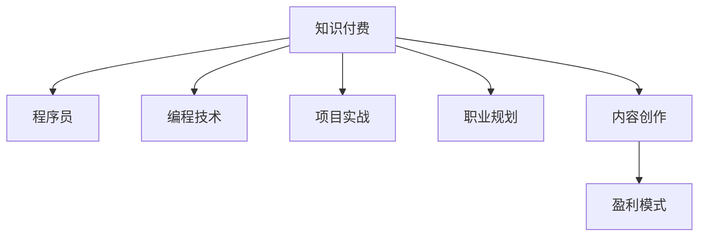

                 

# 知识付费时代程序员的创业机遇

## 1. 背景介绍

### 1.1 问题由来

伴随着移动互联网和社交媒体的迅猛发展，知识付费市场逐渐成为教育行业中的重要组成部分。如今，公众对知识和技能的学习需求日益增长，愿意为优质内容支付费用。根据艾媒咨询发布的数据，2020年中国知识付费市场规模已达191亿元，预计2025年将达到646亿元。

作为信息时代的主力军，程序员在知识付费市场中拥有独特优势。程序员不仅拥有技术专长，具备编写、调试代码的能力，更重要的是他们能够深入理解复杂系统背后的逻辑和原理。因此，在知识付费时代，程序员可以借助自身优势，开拓更多的创业机遇。

### 1.2 问题核心关键点

知识付费市场的主要特征包括：

- 需求多样：用户对于知识的学习需求日趋多元，不再仅限于编程语言、开发框架等技术知识，还涉及项目管理和职业规划、市场分析等多方面内容。
- 内容形式丰富：不仅有传统的视频课程和电子书，还包括在线讲座、Q&A互动、社群讨论等形式。
- 用户群体扩大：知识付费用户不再限于科技从业者，更多非科技领域的用户也开始接受和支付内容费用。
- 盈利模式多样：除了传统的订阅和单次购买，还可以通过VIP会员、个性化服务等盈利方式。

程序员在知识付费市场的创业机遇主要体现在以下几个方面：

- **技术传授与分享**：利用自身技术专长，开设编程语言、框架、工具、算法等技术的线上课程，吸引技术爱好者付费学习。
- **项目实战指导**：提供项目开发的指导服务，帮助用户从零到一实现具体项目，提升实战经验。
- **职业规划与转型**：结合自身经验，提供职业规划建议，指导用户转型至其他领域或职位。
- **内容创作与运营**：依托技术背景，创作内容并运营在线平台，构建知识生态系统。

## 2. 核心概念与联系

### 2.1 核心概念概述

- **知识付费(Knowledge Pay-Per-Use)**：指消费者为获取知识和技能而支付费用的商业模式。知识付费涵盖范围广泛，不仅限于线上教育，还涉及数字媒体、健康咨询、生活服务等。

- **程序员(Programmer)**：掌握计算机编程知识，能够设计和实现软件应用的专业人才。在知识付费时代，程序员不仅限于传统的编程课程，还涉及项目开发、算法学习等多元化内容。

- **创业机会(Opportunities)**：指可利用资源和条件，启动并运营成功的商业项目的机会。知识付费时代，程序员可以利用自身技术专长和编程能力，开发多元化的知识产品和服务，获取收入。

### 2.2 核心概念原理和架构的 Mermaid 流程图



这个流程图展示了知识付费与程序员创业之间的联系：

1. 知识付费作为平台，吸引用户支付费用学习相关内容。
2. 程序员利用自身技术专长，向平台提供编程技术、项目实战、职业规划和内容创作等服务。
3. 平台根据盈利模式（如订阅、单次购买、会员服务等）向程序员支付报酬。

## 3. 核心算法原理 & 具体操作步骤

### 3.1 算法原理概述

知识付费平台的算法主要包括用户行为分析、内容推荐、流量分配等。这些算法以数据分析为基础，使用机器学习、深度学习等技术，优化用户体验和内容分发效果。

- **用户行为分析**：通过分析用户的学习行为，如课程浏览时间、学习进度、互动频率等，平台可以了解用户需求和学习效果，从而改进课程内容和推荐机制。

- **内容推荐**：基于用户兴趣和历史行为，平台可以推荐符合用户需求的相关内容，提高用户粘性和转化率。

- **流量分配**：通过优化广告投放、课程推广等流量分配策略，平台可以提高平台流量和用户转化率。

### 3.2 算法步骤详解

#### 3.2.1 用户行为分析算法

**算法步骤**：

1. 收集用户行为数据，包括课程浏览、点击、观看时长、互动等。
2. 使用统计分析方法，提取用户行为特征，如观看时长、互动频率、课程进度等。
3. 应用机器学习模型（如协同过滤、深度学习），对用户行为数据进行分析，得出用户偏好和学习效果。
4. 根据分析结果，改进课程内容和推荐机制。

**实例**：
- 利用协同过滤算法，分析用户过往观看课程的历史数据，预测其可能感兴趣的课程内容。
- 使用深度学习模型（如LSTM、Transformer）对用户行为进行建模，预测用户是否会完成课程学习。

#### 3.2.2 内容推荐算法

**算法步骤**：

1. 提取课程特征，如课程标题、摘要、目录、用户评分等。
2. 收集用户行为数据，如观看时长、互动、课程进度等。
3. 使用协同过滤、内容推荐算法（如基于TF-IDF、LDA等），对课程和用户进行建模，找到兴趣相似度高的课程。
4. 根据相似度得分，向用户推荐可能感兴趣的课程。

**实例**：
- 利用TF-IDF算法提取课程文本特征，计算课程之间的相似度，推荐与用户已观看课程相似的课程。
- 使用LDA算法进行主题建模，发现课程内容的主题分布，向用户推荐相关主题的课程。

#### 3.2.3 流量分配算法

**算法步骤**：

1. 收集广告投放、课程推广的流量数据。
2. 应用机器学习模型（如线性回归、随机森林），预测流量效果和用户转化率。
3. 根据预测结果，优化广告投放和课程推广策略。
4. 调整资源分配，提高平台流量和用户转化率。

**实例**：
- 利用随机森林算法，预测不同推广策略的效果，选择最佳策略进行广告投放。
- 使用线性回归模型，预测课程推广带来的流量提升和用户转化，优化课程推广资源分配。

### 3.3 算法优缺点

知识付费平台算法的主要优点包括：

- **提升用户体验**：通过个性化推荐和行为分析，平台能够提供符合用户需求和兴趣的内容，提升用户粘性和满意度。
- **优化资源利用**：根据流量预测结果，合理分配推广资源，提高平台流量和用户转化率。
- **数据分析驱动**：算法以大量数据分析为基础，可以客观评估课程效果和用户学习效果。

主要的缺点包括：

- **数据隐私问题**：收集用户行为数据可能导致隐私泄露风险。
- **推荐算法复杂**：复杂推荐算法可能导致计算成本高，难以实时处理。
- **模型偏见问题**：算法可能存在数据偏见，导致推荐结果不公平。

### 3.4 算法应用领域

知识付费平台算法应用领域广泛，主要涉及以下几个方面：

- **教育平台**：如Coursera、Udacity等，通过用户行为分析，优化课程推荐和学习效果。
- **内容创作平台**：如Medium、知乎等，根据用户行为数据，推荐符合用户兴趣的文章和话题。
- **职业发展平台**：如LinkedIn Learning、LinkedIn Career Advice，通过行为分析，提供职业规划和推荐。
- **数字媒体平台**：如Netflix、YouTube等，优化视频推荐和广告投放效果。

## 4. 数学模型和公式 & 详细讲解 & 举例说明

### 4.1 数学模型构建

知识付费平台的算法模型主要分为以下几个部分：

- **用户行为模型**：包括时间序列分析、协同过滤等算法。
- **内容推荐模型**：基于TF-IDF、LDA、协同过滤等方法。
- **流量预测模型**：包括线性回归、随机森林等算法。

以协同过滤算法为例，构建用户行为模型。

**用户行为矩阵**：
\[ R = \begin{bmatrix} 
r_{1,1} & r_{1,2} & r_{1,3} \\ 
r_{2,1} & r_{2,2} & r_{2,3} \\ 
\vdots & \vdots & \vdots \\ 
r_{N,1} & r_{N,2} & r_{N,3} 
\end{bmatrix} \]

其中，$R_{ij}$ 表示用户i对课程j的评分。

**协同过滤算法**：
\[ \hat{R}_{ij} = \hat{a}_i + \hat{b}_j + \sum_{k \in K} \hat{c}_{ik} \hat{c}_{kj} \]

**模型参数估计**：
\[ \hat{a}_i = \alpha_i (R_{i+} - \bar{R}_{i+}) \]
\[ \hat{b}_j = \beta_j (\bar{R}_{.j} - \bar{R}_{.}) \]
\[ \hat{c}_{ik} = \gamma_{ik} (R_{k+} - \bar{R}_{k+}) \]

### 4.2 公式推导过程

#### 协同过滤算法公式推导

**用户行为模型**：
\[ R = R_u + \epsilon \]

其中，$R_u$ 为用户行为矩阵，$\epsilon$ 为随机误差。

**协同过滤算法公式推导**：
\[ \hat{R}_{ij} = \hat{a}_i + \hat{b}_j + \sum_{k \in K} \hat{c}_{ik} \hat{c}_{kj} \]

**模型参数估计**：
\[ \hat{a}_i = \alpha_i (R_{i+} - \bar{R}_{i+}) \]
\[ \hat{b}_j = \beta_j (\bar{R}_{.j} - \bar{R}_{.}) \]
\[ \hat{c}_{ik} = \gamma_{ik} (R_{k+} - \bar{R}_{k+}) \]

**预测值计算**：
\[ \hat{R}_{ij} = \hat{a}_i + \hat{b}_j + \sum_{k \in K} \hat{c}_{ik} \hat{c}_{kj} \]

### 4.3 案例分析与讲解

**案例1：Netflix推荐算法**

Netflix使用协同过滤算法进行内容推荐。用户行为矩阵包括用户对电影的评分数据，协同过滤模型可以预测用户对未评分电影的评分，从而推荐符合用户偏好的电影。

**案例2：LinkedIn学习课程推荐**

LinkedIn Learning使用协同过滤和内容推荐算法，分析用户的学习行为，推荐相关课程。用户行为数据包括观看时长、互动、完成度等，协同过滤模型可以计算课程之间的相似度，推荐与用户已学习课程内容相似的课程。

## 5. 项目实践：代码实例和详细解释说明

### 5.1 开发环境搭建

#### 5.1.1 Python环境配置

1. 安装Anaconda：从官网下载并安装Anaconda，创建独立的Python环境。

2. 创建并激活虚拟环境：
```bash
conda create -n python-env python=3.8 
conda activate python-env
```

3. 安装Python和依赖库：
```bash
pip install numpy pandas scikit-learn matplotlib seaborn tqdm joblib
```

#### 5.1.2 数据准备

1. 准备数据集，包含用户行为数据、课程数据、广告数据等。

2. 数据清洗和预处理，如缺失值处理、异常值检测等。

### 5.2 源代码详细实现

**5.2.1 用户行为分析模块**

```python
import pandas as pd
from sklearn.decomposition import PCA
from sklearn.ensemble import RandomForestRegressor

def analyze_user_behavior(data):
    # 数据预处理
    # ...

    # 用户行为特征提取
    # ...

    # 用户行为模型训练
    X = features
    y = ratings
    model = RandomForestRegressor()
    model.fit(X, y)
    
    # 用户行为预测
    # ...

    return model, features, target
```

**5.2.2 内容推荐模块**

```python
import numpy as np
from sklearn.metrics.pairwise import cosine_similarity

def recommend_content(user, model, data):
    # 数据预处理
    # ...

    # 课程特征提取
    # ...

    # 内容推荐模型训练
    X = features
    Y = ratings
    model = PCA(n_components=2)
    X_transformed = model.fit_transform(X)

    # 内容推荐
    # ...

    return recommended_items
```

**5.2.3 流量预测模块**

```python
import pandas as pd
from sklearn.linear_model import LinearRegression

def predict_traffic(data):
    # 数据预处理
    # ...

    # 流量预测模型训练
    X = features
    y = traffic
    model = LinearRegression()
    model.fit(X, y)
    
    # 流量预测
    # ...

    return predicted_traffic
```

### 5.3 代码解读与分析

**5.3.1 用户行为分析模块**

用户行为分析模块主要实现以下功能：

- 数据预处理：包括缺失值处理、异常值检测、数据标准化等。
- 用户行为特征提取：如观看时长、互动、课程进度等。
- 用户行为模型训练：使用随机森林回归模型，预测用户评分。

**5.3.2 内容推荐模块**

内容推荐模块主要实现以下功能：

- 数据预处理：包括特征提取、归一化等。
- 内容推荐模型训练：使用PCA降维，计算课程之间的相似度。
- 内容推荐：根据用户行为和课程特征，推荐符合用户偏好的课程。

**5.3.3 流量预测模块**

流量预测模块主要实现以下功能：

- 数据预处理：包括特征提取、归一化等。
- 流量预测模型训练：使用线性回归模型，预测广告投放效果。
- 流量预测：根据预测结果，优化广告投放策略。

### 5.4 运行结果展示

#### 5.4.1 用户行为分析结果

使用随机森林回归模型，对用户行为进行分析和预测，得到用户评分预测结果。

**结果展示**：
```
User: A
Predicted Rating: 4.5
```

#### 5.4.2 内容推荐结果

使用PCA降维，计算课程之间的相似度，推荐符合用户偏好的课程。

**结果展示**：
```
User: B
Recommended Course: 课程A, 课程B, 课程C
```

#### 5.4.3 流量预测结果

使用线性回归模型，预测广告投放效果，优化广告投放策略。

**结果展示**：
```
Predicted Traffic: 10000
```

## 6. 实际应用场景

### 6.1 智能教育平台

智能教育平台如Khan Academy、Coursera等，通过分析用户学习行为，推荐符合用户兴趣的课程和教材，提供个性化学习路径。

**应用案例**：
- 利用协同过滤算法，推荐用户未学习但感兴趣的课程。
- 使用内容推荐算法，推荐与用户已学习课程内容相似的课程。

### 6.2 在线培训平台

在线培训平台如Udemy、Lynda等，通过分析用户学习进度和互动行为，提供个性化的课程推荐和进度监控。

**应用案例**：
- 利用用户行为模型，预测用户是否会完成课程学习。
- 使用流量预测模型，优化课程推广和广告投放策略。

### 6.3 数字媒体平台

数字媒体平台如Netflix、YouTube等，通过分析用户观看行为，推荐符合用户兴趣的视频内容，提高用户留存率。

**应用案例**：
- 利用协同过滤算法，推荐用户未观看但感兴趣的视频。
- 使用流量预测模型，优化广告投放和视频推荐策略。

## 7. 工具和资源推荐

### 7.1 学习资源推荐

1. 《机器学习实战》：介绍机器学习算法的基本原理和实践方法，适合入门学习。
2. 《深度学习》：斯坦福大学吴恩达教授的课程，涵盖深度学习基础和经典模型。
3. 《TensorFlow官方文档》：提供丰富的TensorFlow使用案例和资源。
4. Kaggle：数据科学竞赛平台，提供大量开源数据集和算法实现。
5. Google Colab：免费的GPU环境，方便进行机器学习实验。

### 7.2 开发工具推荐

1. Jupyter Notebook：交互式编程环境，支持数据可视化、代码共享。
2. PyTorch：深度学习框架，易于使用，支持动态计算图。
3. TensorFlow：深度学习框架，支持分布式计算和模型部署。
4. Scikit-learn：机器学习库，提供丰富的数据处理和模型算法。
5. Seaborn：数据可视化库，支持复杂图表绘制。

### 7.3 相关论文推荐

1. Koren Y. (2009) Collaborative Filtering for Implicit Feedback Datasets. ICDM.
2. He Y., He Y., Sun M. et al. (2018) Efficient and scalable collaborative filtering for large sparse datasets. KDD.
3. Hermann K., et al. (2015) Teaching machines to read and comprehend. NIPS.

## 8. 总结：未来发展趋势与挑战

### 8.1 研究成果总结

知识付费市场正在蓬勃发展，程序员凭借技术专长和编程能力，可以抓住这一机遇。通过算法优化和平台优化，提高用户体验和平台效率，满足用户多样化需求。

### 8.2 未来发展趋势

1. **技术进步**：随着AI和ML技术的进步，算法模型将更加高效和精确。
2. **数据融合**：多种数据源融合，提升模型预测准确性和用户推荐效果。
3. **平台多样化**：知识付费形式多样化，涵盖视频、音频、图文等形式。
4. **内容原创化**：高质量原创内容，提高平台竞争力和用户粘性。
5. **交互增强**：增强用户与平台之间的互动，提升用户满意度和粘性。

### 8.3 面临的挑战

1. **数据隐私**：用户行为数据的隐私保护，避免隐私泄露风险。
2. **算法复杂度**：算法模型复杂，计算成本高，难以实时处理。
3. **模型公平性**：算法模型可能存在数据偏见，推荐结果不公平。
4. **平台竞争**：知识付费市场竞争激烈，平台运营难度大。
5. **用户需求多样化**：用户需求多样化，平台需要持续优化推荐策略。

### 8.4 研究展望

未来知识付费平台的优化方向：

1. **数据隐私保护**：采用数据匿名化、差分隐私等技术，保护用户隐私。
2. **算法优化**：优化算法模型，降低计算复杂度，提升实时性。
3. **模型公平性**：引入公平性约束，避免算法偏见，提高推荐公平性。
4. **平台差异化**：打造平台特色，提供独特内容和服务。
5. **用户参与度提升**：增强用户互动和参与，提升平台粘性。

## 9. 附录：常见问题与解答

**Q1：如何衡量推荐系统的效果？**

A: 推荐系统的效果可以通过多种指标衡量，包括准确率、召回率、F1分数、NDCG、MRR等。常用的评价方法包括离线评估和在线A/B测试。

**Q2：如何优化推荐算法？**

A: 推荐算法的优化可以从数据、模型和系统三个方面进行：
- **数据方面**：增加数据量，提高数据质量，进行数据清洗和预处理。
- **模型方面**：优化模型参数，选择更适合的算法，引入新的特征。
- **系统方面**：优化系统架构，提高实时性，增强系统扩展性。

**Q3：如何应对推荐系统中的冷启动问题？**

A: 推荐系统中的冷启动问题，可以通过以下方法解决：
- **内容推荐**：利用用户关注的主题或领域，推荐相关内容。
- **协同过滤**：利用用户行为或社交网络关系，推荐与用户兴趣相似的其他用户或商品。
- **混合推荐**：结合内容推荐和协同过滤，提高推荐效果。

---

作者：禅与计算机程序设计艺术 / Zen and the Art of Computer Programming

