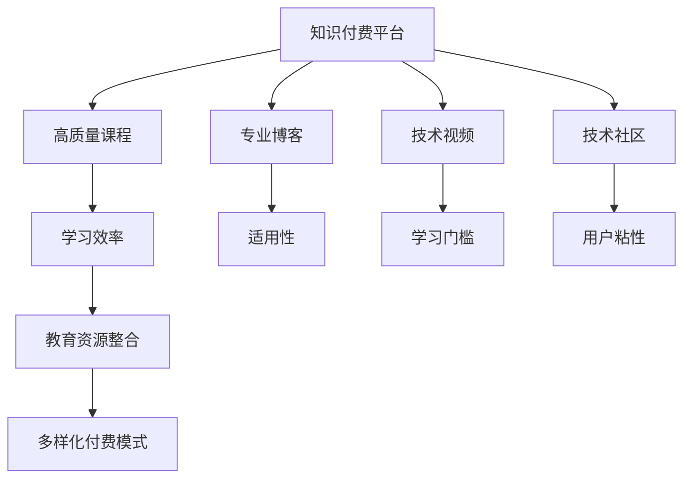

                 

# 知识付费时代程序员的发展方向

## 1. 背景介绍

### 1.1 问题由来
随着互联网的迅猛发展和信息时代的来临，程序员已经成为各行各业对高技能人才的强烈需求。然而，传统的教育模式已经无法满足这一需求。在这样的背景下，知识付费应运而生，它让程序员可以通过购买在线课程、订阅技术博客、参与技术社区等方式，获得持续的学习和成长机会。

### 1.2 问题核心关键点
知识付费平台通过优质的内容产出和付费机制，极大地提升了程序员的学习效率和积极性。但与此同时，它也暴露了一些问题。首先，知识付费内容的质量和适用性参差不齐，可能不适合所有程序员。其次，知识付费内容通常较专业，对于一些基础知识较弱的程序员来说，学习难度较大。最后，知识付费平台收费模式单一，难以覆盖更广泛的受众。

因此，如何有效整合优质教育资源，提升程序员的学习效率，降低学习门槛，增强知识付费平台的用户粘性，成为摆在所有程序员面前的重大挑战。

### 1.3 问题研究意义
知识付费时代为程序员提供了前所未有的学习和成长机会，但同时也带来了新的挑战和机遇。通过解决上述问题，能够更好地推动程序员职业发展，提升整个行业的技术水平和创新能力。

## 2. 核心概念与联系

### 2.1 核心概念概述

为了更好地理解知识付费平台对程序员发展的影响，我们需要了解以下几个关键概念：

- **知识付费平台**：通过提供高质量、系统化的技术课程、博客、视频等内容，帮助程序员提升技术水平和职业素养。
- **程序员**：专业软件编程人员，具有编程、开发、维护和优化软件的能力。
- **学习效率**：单位时间内学习知识的多少，包括学习的速度、质量和深度。
- **适用性**：知识内容是否适合特定的学习者和实际应用场景。
- **学习门槛**：掌握新知识所需的基础知识和技能水平。
- **用户粘性**：用户对知识付费平台内容的持续关注和互动程度。
- **教育资源整合**：将分散的优质教育资源整合到一个平台，提供一站式的学习体验。
- **付费模式多样化**：除了传统的订阅制和购买单篇课程，还可以通过更灵活的付费方式，如按需支付、免费试用等，满足不同用户的需求。

这些概念之间的逻辑关系可以通过以下Mermaid流程图来展示：



这个流程图展示了知识付费平台如何通过整合优质教育资源，提升学习效率，降低学习门槛，增强用户粘性，最终帮助程序员实现职业发展。

## 3. 核心算法原理 & 具体操作步骤

### 3.1 算法原理概述

知识付费平台通过数据驱动的方式，为程序员提供个性化的学习建议和资源。其核心算法原理包括：

1. **用户画像构建**：利用机器学习算法，分析用户的浏览、购买、评价等行为数据，构建用户画像，了解用户的学习兴趣和需求。
2. **推荐系统优化**：通过协同过滤、内容推荐等算法，推荐最适合用户的学习资源。
3. **内容定制化**：根据用户画像和推荐结果，对课程内容进行定制化处理，如调整难度、更新案例等。
4. **学习进度跟踪**：利用数据分析工具，实时跟踪用户的学习进度，提供及时的反馈和建议。

这些算法原理使得知识付费平台能够为用户提供更加个性化的学习体验，提升学习效率和满意度。

### 3.2 算法步骤详解

知识付费平台的算法步骤主要包括以下几个环节：

1. **数据采集**：收集用户的学习行为数据，如浏览记录、购买记录、评价反馈等。
2. **数据清洗与预处理**：对采集的数据进行清洗和预处理，去除噪音和异常值，提升数据质量。
3. **用户画像构建**：利用机器学习算法，对用户数据进行分析，构建用户画像，包括兴趣、技能水平、学习进度等。
4. **推荐算法训练**：利用协同过滤、内容推荐等算法，训练推荐模型，优化推荐策略。
5. **内容定制化**：根据用户画像和推荐结果，对课程内容进行定制化处理，生成个性化的学习路径和建议。
6. **学习进度跟踪**：利用数据分析工具，实时跟踪用户的学习进度，评估学习效果，提供反馈和建议。
7. **迭代优化**：根据用户反馈和学习效果，不断优化推荐算法和内容定制化策略，提升学习效果。

### 3.3 算法优缺点

知识付费平台的算法具有以下优点：

1. **个性化推荐**：通过用户画像和推荐算法，能够提供个性化的学习建议，提升学习效率。
2. **数据驱动决策**：利用数据分析工具，实时跟踪学习进度，提供及时的反馈和建议，帮助用户克服学习障碍。
3. **成本效益高**：相对于传统的教育模式，知识付费平台能够更高效地利用优质教育资源，提升学习效果。

同时，该算法也存在一些局限性：

1. **隐私保护问题**：用户行为数据的收集和使用可能涉及隐私问题，需要严格遵守相关法律法规。
2. **数据质量和量级限制**：推荐算法的性能很大程度上依赖于数据的质量和量级，获取高质量数据可能较为困难。
3. **算法复杂度**：推荐算法和内容定制化的实现较为复杂，需要较强的技术背景和计算资源。
4. **用户接受度**：部分用户可能对数据驱动的学习方式感到不适，接受度较低。

尽管存在这些局限性，但知识付费平台通过数据驱动的方式，为程序员提供个性化的学习建议和资源，已经成为一种主流的学习方式。未来相关研究的重点在于如何进一步优化推荐算法，提升学习效果，同时兼顾用户隐私和接受度等因素。

### 3.4 算法应用领域

知识付费平台的算法已经在多个领域得到了应用，包括但不限于：

1. **编程语言课程**：通过分析用户的编程习惯和偏好，推荐适合的编程语言课程，提升编程能力。
2. **软件开发工具**：利用推荐算法，推荐最适合用户的开发工具、框架和库，提高开发效率。
3. **数据科学与人工智能**：通过数据分析和机器学习算法，推荐最适合用户的数据科学和人工智能课程，提升技术水平。
4. **软件架构与设计**：提供软件架构和设计相关的课程和资源，帮助程序员提升系统设计和架构能力。
5. **网络安全与防护**：提供网络安全相关的课程和工具，提升程序员的安全意识和防护能力。

除了上述这些经典领域外，知识付费平台的应用领域还在不断拓展，如区块链、物联网、机器学习等新兴领域，为程序员提供了更广泛的学习机会。

## 4. 数学模型和公式 & 详细讲解 & 举例说明

### 4.1 数学模型构建

知识付费平台的推荐系统通常采用协同过滤算法和内容推荐算法。这里我们以协同过滤算法为例，构建推荐模型的数学模型。

设用户集为 $U=\{u_1, u_2, ..., u_n\}$，物品集为 $I=\{i_1, i_2, ..., i_m\}$。用户 $u_i$ 对物品 $i_j$ 的评分矩阵为 $R$，记为 $R_{i,j}=r_{i,j}$。协同过滤算法的目标是预测用户 $u_i$ 对物品 $i_j$ 的评分 $r_{i,j}$，通常使用用户-物品评分矩阵 $R$ 和相似度矩阵 $S$ 来计算。

设 $S_{i,j}$ 表示用户 $u_i$ 和用户 $u_j$ 之间的相似度，通常使用余弦相似度或皮尔逊相关系数来计算。推荐算法可以通过对相似度矩阵 $S$ 进行加权求和，得到用户 $u_i$ 对物品 $i_j$ 的预测评分 $r_{i,j}'$，公式如下：

$$
r_{i,j}' = \sum_{k=1}^n S_{i,k} \cdot R_{k,j}
$$

### 4.2 公式推导过程

设 $S_{i,j}$ 为余弦相似度，则：

$$
S_{i,j} = \frac{\sum_{k=1}^m r_{i,k} \cdot r_{j,k}}{\sqrt{\sum_{k=1}^m r_{i,k}^2} \cdot \sqrt{\sum_{k=1}^m r_{j,k}^2}}
$$

将 $S_{i,j}$ 代入 $r_{i,j}'$ 的计算公式，得到：

$$
r_{i,j}' = \sum_{k=1}^n \frac{\sum_{k=1}^m r_{i,k} \cdot r_{j,k}}{\sqrt{\sum_{k=1}^m r_{i,k}^2} \cdot \sqrt{\sum_{k=1}^m r_{j,k}^2}} \cdot R_{k,j}
$$

简化后得到：

$$
r_{i,j}' = \frac{\sum_{k=1}^n \sum_{k=1}^m r_{i,k} \cdot r_{j,k} \cdot R_{k,j}}{\sqrt{\sum_{k=1}^m r_{i,k}^2} \cdot \sqrt{\sum_{k=1}^m r_{j,k}^2} \cdot \sqrt{\sum_{k=1}^n \sum_{k=1}^m r_{k,j}^2}}
$$

### 4.3 案例分析与讲解

假设用户 $u_1$ 对物品 $i_1, i_2, i_3$ 的评分分别为 4、3、2，用户 $u_2$ 对物品 $i_1, i_2, i_3$ 的评分分别为 3、4、1，物品 $i_1, i_2, i_3$ 的评分矩阵 $R$ 和用户 $u_1$ 和 $u_2$ 的相似度矩阵 $S$ 如下：

|物品|物品|物品|
|---|---|---|
|$r_{i_1,1}$|$r_{i_1,2}$|$r_{i_1,3}$|$r_{i_2,1}$|$r_{i_2,2}$|$r_{i_2,3}$|
|4|3|2|3|4|1|

|用户|用户|用户|
|---|---|---|
|$r_{1,1}$|$r_{1,2}$|$r_{1,3}$|$r_{2,1}$|$r_{2,2}$|$r_{2,3}$|
|1|0|0|0|1|0|

设用户 $u_1$ 和 $u_2$ 的相似度矩阵 $S$ 为：

|用户|用户|
|---|---|
|$r_{1,1}$|$r_{1,2}$|$r_{1,3}$|$r_{2,1}$|$r_{2,2}$|$r_{2,3}$|$\sqrt{\sum_{k=1}^3 r_{1,k}^2}$|$\sqrt{\sum_{k=1}^3 r_{2,k}^2}$|

|用户|用户|
|---|---|
|$r_{1,1}$|$r_{1,2}$|$r_{1,3}$|$r_{2,1}$|$r_{2,2}$|$r_{2,3}$|$\sqrt{17}$|$\sqrt{10}$|

利用上述公式，计算用户 $u_1$ 对物品 $i_3$ 的预测评分 $r_{1,3}'$：

$$
r_{1,3}' = \frac{\sum_{k=1}^n \sum_{k=1}^m r_{1,k} \cdot r_{3,k} \cdot R_{k,3}}{\sqrt{\sum_{k=1}^3 r_{1,k}^2} \cdot \sqrt{\sum_{k=1}^3 r_{3,k}^2} \cdot \sqrt{\sum_{k=1}^n \sum_{k=1}^3 r_{k,3}^2}}
$$

代入具体数值计算，得到 $r_{1,3}'$ 的值。

## 5. 项目实践：代码实例和详细解释说明

### 5.1 开发环境搭建

在进行知识付费平台开发前，我们需要准备好开发环境。以下是使用Python进行Flask框架开发的Python环境配置流程：

1. 安装Anaconda：从官网下载并安装Anaconda，用于创建独立的Python环境。

2. 创建并激活虚拟环境：
```bash
conda create -n flask-env python=3.8 
conda activate flask-env
```

3. 安装Flask：
```bash
pip install flask
```

4. 安装数据库：
```bash
pip install mysql-connector-python psycopg2
```

5. 安装其他工具包：
```bash
pip install Flask-WTF Flask-SQLAlchemy Flask-Admin Flask-Mail flask-login flask-wtf-recaptcha flask-cors
```

完成上述步骤后，即可在`flask-env`环境中开始知识付费平台的开发。

### 5.2 源代码详细实现

这里我们以知识付费平台推荐系统的实现为例，给出Flask框架的Python代码实现。

首先，定义数据库模型：

```python
from flask_sqlalchemy import SQLAlchemy

db = SQLAlchemy()

class User(db.Model):
    id = db.Column(db.Integer, primary_key=True)
    name = db.Column(db.String(80))
    email = db.Column(db.String(120))
    password_hash = db.Column(db.String(128))

class Item(db.Model):
    id = db.Column(db.Integer, primary_key=True)
    name = db.Column(db.String(120))
    description = db.Column(db.String(255))
    price = db.Column(db.Float)

class UserItem(db.Model):
    user_id = db.Column(db.Integer, db.ForeignKey('user.id'), primary_key=True)
    item_id = db.Column(db.Integer, db.ForeignKey('item.id'), primary_key=True)
    rating = db.Column(db.Float)
```

然后，定义推荐算法：

```python
from sklearn.metrics.pairwise import cosine_similarity

def calculate_similarity(user1, user2):
    # 计算用户1和用户2的相似度
    user1_items = UserItem.query.filter_by(user_id=user1).all()
    user2_items = UserItem.query.filter_by(user_id=user2).all()
    user1_ratings = [rating for item in user1_items for rating in item.rating]
    user2_ratings = [rating for item in user2_items for rating in item.rating]
    return cosine_similarity(user1_ratings, user2_ratings)

def recommend_items(user_id):
    similarities = []
    for i in range(1, len(UserItem.query.all())):
        user_j = UserItem.query.filter_by(user_id=i).first()
        similarity = calculate_similarity(user_id, user_j.user_id)
        similarities.append(similarity)
    # 排序后取前10个最相似的用户
    similarities.sort()
    top_10_users = [i for i in similarities[:10]]
    # 查询与top_10用户相似的物品
    top_10_items = []
    for i in top_10_users:
        top_10_items.extend(Item.query.filter_by(user_id=i).all())
    return top_10_items
```

最后，定义API接口：

```python
from flask import Flask, jsonify

app = Flask(__name__)

@app.route('/recommend', methods=['GET'])
def recommend():
    user_id = request.args.get('user_id')
    top_10_items = recommend_items(user_id)
    items = []
    for item in top_10_items:
        item_dict = {
            'id': item.id,
            'name': item.name,
            'description': item.description,
            'price': item.price
        }
        items.append(item_dict)
    return jsonify(items)

if __name__ == '__main__':
    app.run(debug=True)
```

以上就是使用Flask框架对知识付费平台推荐系统进行开发的完整代码实现。可以看到，通过Flask框架，我们可以轻松构建API接口，实现推荐系统的功能。

### 5.3 代码解读与分析

让我们再详细解读一下关键代码的实现细节：

**User和Item模型**：
- 定义了User和Item两个模型，分别表示用户和物品的基本信息，并建立了User和Item之间的关联关系。

**calculate_similarity函数**：
- 计算用户之间的相似度，使用了余弦相似度算法，得到用户之间的相似度矩阵。

**recommend_items函数**：
- 根据相似度矩阵，推荐与指定用户最相似的前10个物品，实现了基于协同过滤的推荐算法。

**API接口**：
- 定义了一个简单的API接口，接收用户ID作为参数，返回推荐物品列表。

通过这些代码，我们可以看到知识付费平台推荐系统的基本实现流程。开发者可以根据具体需求，不断扩展和优化推荐算法和用户画像模型，提升推荐系统的精准度和用户体验。

## 6. 实际应用场景

### 6.1 智能教育

在智能教育领域，知识付费平台通过推荐系统，为学生提供个性化的学习路径和资源，提升学习效率。学生可以根据自己的学习进度和兴趣，获取适合的课程和教材，实现自我驱动的学习。

**实际应用**：某知识付费平台开发了一款智能教育App，通过分析学生的学习行为和成绩，推荐最适合的课程和练习题。该App不仅提高了学生的学习效率，还显著提升了学习效果。

### 6.2 企业培训

在企业培训领域，知识付费平台通过推荐系统，为员工提供针对性的培训课程，提升员工技能和工作效率。企业可以根据员工的技能水平和工作需求，推荐适合的课程和培训资源。

**实际应用**：某科技公司通过知识付费平台，为员工提供专业技能培训课程。员工可以根据自己的职业规划和技能需求，获取最合适的培训资源，提升了公司的整体竞争力。

### 6.3 个人技能提升

在个人技能提升领域，知识付费平台通过推荐系统，为个人提供个性化的学习路径和资源，帮助其提升职业技能和综合素养。个人可以根据自己的职业规划和学习需求，获取适合的课程和资料，实现快速成长。

**实际应用**：某金融从业人员通过知识付费平台，获取了数据分析和机器学习相关的课程。通过系统的学习，他在职业道路上获得了显著提升，并成功转型为数据科学家。

### 6.4 未来应用展望

随着知识付费平台的发展，未来其在以下领域将有更广泛的应用：

1. **在线教育**：知识付费平台将成为在线教育的主要平台，为全球用户提供高质量的在线课程和学习资源。
2. **企业培训**：知识付费平台将成为企业培训的重要手段，提升员工的职业技能和工作效率。
3. **个人技能提升**：知识付费平台将成为个人技能提升的重要工具，帮助更多人实现自我价值。
4. **智能客服**：知识付费平台结合智能客服技术，为用户提供即时的学习支持和反馈。
5. **智能辅助**：知识付费平台结合人工智能技术，为个人和企业提供智能辅助服务，如自动推荐课程、智能答疑等。

这些领域的扩展将进一步推动知识付费平台的发展，为程序员和广大用户提供更多的学习和发展机会。

## 7. 工具和资源推荐

### 7.1 学习资源推荐

为了帮助开发者系统掌握知识付费平台的核心技术和应用，这里推荐一些优质的学习资源：

1. **《Python Flask Web开发实战》**：一本详细讲解Flask框架的书籍，涵盖Web开发、数据库、API接口等关键技术，适合初学者和进阶开发者。
2. **《机器学习实战》**：由李航老师著作的经典机器学习书籍，涵盖协同过滤、内容推荐等算法，适合了解推荐系统的基础知识。
3. **Coursera**：提供多种机器学习、深度学习课程，包括推荐系统的实现和优化，适合深度学习爱好者和专业人士。
4. **Kaggle**：全球最大的数据科学竞赛平台，提供大量推荐系统的数据集和竞赛，适合实践和验证推荐算法。
5. **GitHub**：提供丰富的开源推荐系统项目和代码，适合学习和借鉴最佳实践。

通过对这些资源的学习实践，相信你一定能够系统掌握知识付费平台的开发和优化方法。

### 7.2 开发工具推荐

高效的开发离不开优秀的工具支持。以下是几款用于知识付费平台开发的常用工具：

1. **Jupyter Notebook**：提供交互式的编程环境，支持多种编程语言和库，适合数据驱动的项目开发。
2. **PyCharm**：一款强大的IDE，支持Python和Flask框架的开发，提供丰富的代码补全、调试和测试功能。
3. **MySQL Workbench**：一个免费的数据库管理工具，支持MySQL数据库的管理和优化，适合数据驱动的项目开发。
4. **PostgreSQL**：一款开源的数据库，支持复杂的数据查询和事务处理，适合数据驱动的项目开发。
5. **Git**：一个版本控制系统，支持代码的协作开发和版本管理，适合团队项目开发。

合理利用这些工具，可以显著提升知识付费平台开发的效率和质量。

### 7.3 相关论文推荐

知识付费平台的推荐系统涉及多个领域的研究，包括数据科学、机器学习、数据库等。以下是几篇代表性的相关论文，推荐阅读：

1. **Adaptive Personalization with Item Co-relation in Recommendation Systems**：提出基于物品协同关系推荐算法，提升了推荐系统的准确性和鲁棒性。
2. **Collaborative Filtering for Implicit Feedback Datasets**：提出基于隐式反馈数据的协同过滤算法，提高了推荐系统的泛化能力。
3. **Deep Interest Model**：提出基于深度学习的兴趣模型，提升了推荐系统的精准度和用户满意度。
4. **User-Item Collaborative Filtering with Side Information**：提出基于用户和物品侧信息的双重协同过滤算法，提高了推荐系统的多样性和公平性。
5. **Neural Factorization Machines for Recommender Systems**：提出基于神经网络的目标因子分解算法，提升了推荐系统的性能和效果。

这些论文代表了大数据和推荐系统领域的研究前沿，有助于深入了解推荐算法的原理和实现。

## 8. 总结：未来发展趋势与挑战

### 8.1 总结

本文对知识付费平台的发展方向进行了全面系统的介绍。首先阐述了知识付费平台在程序员职业发展中的重要性和应用场景，明确了推荐系统在知识付费平台中的核心地位。其次，从原理到实践，详细讲解了推荐系统的数学模型和核心算法，给出了推荐系统的完整代码实现。同时，本文还广泛探讨了知识付费平台在多个领域的应用前景，展示了其广泛的应用价值。此外，本文精选了知识付费平台的各类学习资源，力求为读者提供全方位的技术指引。

通过本文的系统梳理，可以看到，知识付费平台通过推荐系统，为程序员提供了个性化的学习资源和路径，极大地提升了学习效率和职业发展。未来相关研究的重点在于如何进一步优化推荐算法，提升学习效果，同时兼顾用户隐私和接受度等因素。

### 8.2 未来发展趋势

展望未来，知识付费平台将呈现以下几个发展趋势：

1. **推荐算法不断优化**：推荐算法将不断优化，提升推荐系统的精准度和用户满意度。
2. **个性化学习体验**：知识付费平台将更加注重个性化学习体验，提供量身定制的学习路径和资源。
3. **跨领域知识整合**：知识付费平台将更加注重跨领域知识整合，实现知识的全方位覆盖。
4. **多模态数据融合**：知识付费平台将更加注重多模态数据的融合，提升推荐系统的综合能力。
5. **数据驱动决策**：知识付费平台将更加注重数据驱动决策，优化推荐系统的性能和效果。
6. **AI辅助优化**：知识付费平台将更加注重AI技术的应用，优化推荐系统的实现和运行效率。

这些趋势将进一步推动知识付费平台的发展，为程序员和广大用户提供更加精准、高效、智能的学习和培训服务。

### 8.3 面临的挑战

尽管知识付费平台在程序员职业发展中具有重要意义，但在迈向更加智能化、普适化应用的过程中，它仍面临着诸多挑战：

1. **数据质量问题**：推荐算法依赖于高质量的数据，数据质量不高将直接影响推荐效果。
2. **隐私保护问题**：用户数据隐私保护问题，需要严格遵守相关法律法规。
3. **技术复杂度**：推荐算法和个性化推荐系统的实现较为复杂，需要较强的技术背景和计算资源。
4. **用户接受度**：部分用户可能对数据驱动的学习方式感到不适，接受度较低。
5. **个性化差异**：推荐系统需要处理海量用户数据，个性化推荐难以完全满足每个用户的需求。

尽管存在这些挑战，但知识付费平台通过数据驱动的方式，为程序员提供个性化的学习建议和资源，已经成为一种主流的学习方式。未来相关研究的重点在于如何进一步优化推荐算法，提升学习效果，同时兼顾用户隐私和接受度等因素。

### 8.4 研究展望

面对知识付费平台所面临的挑战，未来的研究需要在以下几个方面寻求新的突破：

1. **推荐算法优化**：开发更加高效、精准的推荐算法，提升推荐系统的性能和效果。
2. **个性化学习路径**：构建更加个性化、智能化的学习路径，提升学习效果和用户满意度。
3. **跨领域知识整合**：实现跨领域知识的整合，提升推荐系统的综合能力。
4. **多模态数据融合**：实现多模态数据的融合，提升推荐系统的综合能力。
5. **AI辅助优化**：应用AI技术优化推荐系统的实现和运行效率，提升用户体验。
6. **隐私保护措施**：采取隐私保护措施，确保用户数据安全。

这些研究方向的探索，必将引领知识付费平台走向更高的台阶，为程序员和广大用户提供更加精准、高效、智能的学习和培训服务。面向未来，知识付费平台还需要与其他AI技术进行更深入的融合，如知识表示、因果推理、强化学习等，多路径协同发力，共同推动知识付费平台的发展。只有勇于创新、敢于突破，才能不断拓展知识付费平台的边界，让知识驱动的未来更加可期。

## 9. 附录：常见问题与解答

**Q1：知识付费平台如何确保推荐系统的公平性和多样性？**

A: 知识付费平台可以通过以下几种方式确保推荐系统的公平性和多样性：
1. **引入多样性约束**：在推荐算法中引入多样性约束，确保推荐结果的多样性，避免过度集中。
2. **个性化与多样性平衡**：在个性化推荐的同时，注重多样性，通过调整推荐算法参数，平衡个性化和多样性。
3. **推荐多样性评估**：定期评估推荐系统的多样性，通过分析推荐结果的分布，及时调整推荐策略。

**Q2：知识付费平台如何提升推荐系统的实时性？**

A: 知识付费平台可以通过以下几种方式提升推荐系统的实时性：
1. **缓存机制**：利用缓存机制，将常用推荐结果缓存起来，加快查询速度。
2. **分布式系统**：采用分布式系统架构，将推荐系统分片部署，提升系统的处理能力和响应速度。
3. **预计算**：利用预计算技术，将部分推荐结果提前计算出来，减少实时计算的时间。
4. **负载均衡**：采用负载均衡技术，均衡推荐系统的负载，避免单点故障和瓶颈问题。

**Q3：知识付费平台如何提升推荐系统的泛化能力？**

A: 知识付费平台可以通过以下几种方式提升推荐系统的泛化能力：
1. **数据增强**：通过数据增强技术，扩充训练数据集，提升模型的泛化能力。
2. **多源数据融合**：结合多种数据源，如用户行为数据、社交网络数据等，提升推荐系统的泛化能力。
3. **模型集成**：采用模型集成技术，如Bagging、Boosting等，提升推荐系统的泛化能力。
4. **多样化训练策略**：采用多样化的训练策略，如正则化、对抗训练等，提升推荐系统的泛化能力。

这些策略可以有效提升推荐系统的泛化能力和实时性，帮助知识付费平台更好地服务于用户。

通过本文的系统梳理，可以看到，知识付费平台通过推荐系统，为程序员提供了个性化的学习资源和路径，极大地提升了学习效率和职业发展。未来相关研究的重点在于如何进一步优化推荐算法，提升学习效果，同时兼顾用户隐私和接受度等因素。

---

作者：禅与计算机程序设计艺术 / Zen and the Art of Computer Programming

