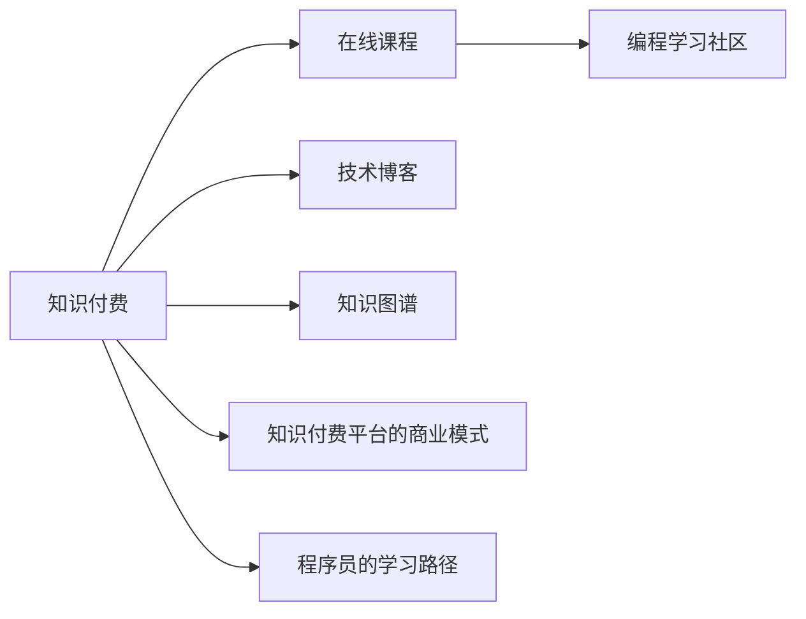

                 

# 知识付费时代程序员的机遇

## 1. 背景介绍

随着信息技术的飞速发展，知识付费成为了互联网领域的一股不可阻挡的潮流。在知识付费时代，程序员不再仅仅依赖代码编辑器和调试器，而是更多地依赖于高质量的知识资源。他们可以通过购买在线课程、订阅技术博客、参与技术社区等方式，不断提升自己的技能和视野，从而获得更好的职业发展机遇。

### 1.1 知识付费的兴起

知识付费起源于美国，但在中国市场发展尤为迅猛。自2016年以来，知识付费市场迎来了爆发式增长，各类知识平台如雨后春笋般涌现。从得到、喜马拉雅、知乎Live到腾讯课堂、网易云课堂等，知识付费形式日益多样化，内容领域覆盖广泛，满足了不同层次用户的学习需求。

### 1.2 程序员的知识需求

在知识付费时代，程序员的知识需求呈现出多样化和专业化的趋势。除了编程语言、框架、工具等基本技术知识外，程序员更加注重对复杂系统架构、算法设计、软件工程、人工智能等前沿领域的深入理解。这种趋势也促使知识付费内容更加注重深度和广度，满足了程序员对高质量知识资源的需求。

## 2. 核心概念与联系

### 2.1 核心概念概述

为了更好地理解知识付费时代程序员的机遇，我们需要深入理解以下几个核心概念：

- **知识付费**：通过在线课程、电子书、专栏文章等付费形式，获取高质量知识资源的过程。知识付费时代，程序员可以以较低的成本获取海量的学习资源。
- **编程学习社区**：如GitHub、Stack Overflow、知乎等，程序员可以分享代码、交流技术、获取帮助。
- **技术博客**：如阮一峰、极客时间等，提供深度的技术文章、实战案例和行业洞察。
- **知识图谱**：如语义网、知识图谱构建工具，帮助程序员获取结构化、关联化的知识资源。
- **在线课程**：如Coursera、Udacity等，提供系统化的课程学习路径，帮助程序员提升系统架构和算法设计能力。

这些核心概念相互联系，共同构成了知识付费时代程序员的知识获取体系。通过在线课程和社区交流，程序员可以获取系统的知识框架和实战经验；通过技术博客和知识图谱，程序员可以深入理解技术和市场动态；通过参与付费课程，程序员可以系统化地掌握前沿技术和应用技能。

### 2.2 核心概念原理和架构的 Mermaid 流程图



## 3. 核心算法原理 & 具体操作步骤

### 3.1 算法原理概述

知识付费时代程序员的学习过程可以抽象为一个基于知识图谱的推荐系统。该系统通过分析程序员的学习行为和反馈，推荐最合适的知识资源。其核心算法包括协同过滤、内容推荐、用户画像构建等。

### 3.2 算法步骤详解

**Step 1: 数据收集与预处理**

- 收集程序员的学习行为数据，包括浏览时间、阅读量、留言评论、收藏分享等。
- 对数据进行预处理，去除噪音，提取有用特征，如标签、摘要、推荐顺序等。

**Step 2: 知识图谱构建**

- 构建程序员的知识图谱，将知识资源分为技术、工具、框架、算法等类别，并建立实体和实体的关系。
- 使用语义网技术，为知识资源添加结构化语义标签，如关键词、分类、属性等。

**Step 3: 协同过滤推荐**

- 基于程序员的学习行为数据，构建用户画像，提取程序员的学习兴趣、知识水平等特征。
- 对知识资源进行特征提取，包括标题、摘要、标签、作者等。
- 使用协同过滤算法，推荐与用户兴趣最接近的知识资源，如内容相似度、用户行为相似度等。

**Step 4: 内容推荐**

- 对知识资源进行内容特征提取，如关键词密度、文本长度、引用次数等。
- 使用基于内容的推荐算法，如TF-IDF、BM25等，推荐与用户最相关的内容。
- 综合协同过滤和内容推荐，构建混合推荐系统。

**Step 5: 学习效果评估**

- 收集程序员的学习反馈，包括评分、评价、学习效果等。
- 基于反馈数据，调整推荐算法参数，优化推荐系统性能。
- 定期评估推荐效果，调整推荐策略，提升推荐准确性。

### 3.3 算法优缺点

知识付费时代程序员的推荐系统具有以下优点：

- 个性化强。基于程序员的学习行为和反馈，推荐系统能够提供高度个性化的学习资源。
- 学习效率高。推荐系统可以快速筛选出高质量的知识资源，节省程序员的学习时间。
- 动态更新。推荐系统可以实时更新学习数据，适应程序员的学习需求变化。

同时，该算法也存在以下局限性：

- 数据稀疏。由于用户行为数据有限，推荐系统可能无法覆盖全部知识资源。
- 冷启动问题。新用户缺乏历史数据，导致推荐系统初期效果不佳。
- 对抗性攻击。恶意用户可能通过操作数据，影响推荐系统的公平性和安全性。

### 3.4 算法应用领域

知识付费时代程序员的推荐系统可以应用于以下领域：

- 课程学习。根据程序员的学习兴趣和历史行为，推荐最合适的在线课程。
- 技术博客阅读。推荐程序员感兴趣的技术博客，帮助其深入了解前沿技术。
- 社区交流。推荐与程序员专业相关的技术社区，提供交流和协作平台。
- 代码学习。推荐开源项目和代码示例，帮助程序员提升编程能力。
- 书籍阅读。推荐程序员感兴趣的书籍，包括经典著作和前沿文献。

## 4. 数学模型和公式 & 详细讲解 & 举例说明

### 4.1 数学模型构建

知识付费时代程序员的学习过程可以建模为一个推荐系统。其核心目标是通过学习用户的历史行为数据，预测其对未见知识资源的评分，从而提供个性化推荐。模型通常包括用户画像、物品特征和评分矩阵等。

### 4.2 公式推导过程

**协同过滤算法**：
- 用户兴趣表示：$u_i$ 表示第 $i$ 个用户，其兴趣向量为 $u_{i,1},u_{i,2},\ldots,u_{i,n}$。
- 物品特征表示：$i_j$ 表示第 $j$ 个物品，其特征向量为 $i_{j,1},i_{j,2},\ldots,i_{j,m}$。
- 用户-物品评分矩阵：$R_{ij}=\text{score}(u_i,i_j)$ 表示用户 $u_i$ 对物品 $i_j$ 的评分。
- 协同过滤算法：$y_j=\sum_{i} \alpha_i u_i^\top i_j + \beta \hat{u}_i^\top \hat{i}_j$，其中 $\alpha_i$ 和 $\beta$ 为超参数。

**内容推荐算法**：
- 文本特征提取：$x_i$ 表示第 $i$ 个物品的文本特征向量，$x_{ij}=\text{feature}(i_j)$。
- 基于内容的推荐算法：$y_j=\sum_{i} \gamma_i u_i^\top x_i + \delta \hat{u}_i^\top \hat{x}_i$，其中 $\gamma_i$ 和 $\delta$ 为超参数。

**混合推荐算法**：
- 混合推荐算法：$y_j=\lambda_1 \hat{y}_j + \lambda_2 \bar{y}_j$，其中 $\hat{y}_j$ 为协同过滤推荐结果，$\bar{y}_j$ 为内容推荐结果。

### 4.3 案例分析与讲解

以程序员在线课程推荐为例，分析推荐系统的实际应用过程：

**数据收集**：
- 收集程序员在线课程的学习行为数据，如浏览时间、点击次数、评分等。
- 对课程进行特征提取，包括课程名称、描述、讲师等。

**协同过滤推荐**：
- 基于程序员的学习行为数据，构建用户画像，提取程序员的学习兴趣、知识水平等特征。
- 对课程进行特征提取，包括课程名称、描述、讲师等。
- 使用协同过滤算法，推荐与用户兴趣最接近的课程，如内容相似度、用户行为相似度等。

**内容推荐**：
- 对课程进行内容特征提取，如关键词密度、文本长度、引用次数等。
- 使用基于内容的推荐算法，如TF-IDF、BM25等，推荐与用户最相关的内容。
- 综合协同过滤和内容推荐，构建混合推荐系统。

## 5. 项目实践：代码实例和详细解释说明

### 5.1 开发环境搭建

在进行在线课程推荐系统开发前，我们需要准备好开发环境。以下是使用Python进行PyTorch开发的环境配置流程：

1. 安装Anaconda：从官网下载并安装Anaconda，用于创建独立的Python环境。

2. 创建并激活虚拟环境：
```bash
conda create -n pytorch-env python=3.8 
conda activate pytorch-env
```

3. 安装PyTorch：根据CUDA版本，从官网获取对应的安装命令。例如：
```bash
conda install pytorch torchvision torchaudio cudatoolkit=11.1 -c pytorch -c conda-forge
```

4. 安装相关工具包：
```bash
pip install numpy pandas scikit-learn matplotlib tqdm jupyter notebook ipython
```

完成上述步骤后，即可在`pytorch-env`环境中开始推荐系统开发。

### 5.2 源代码详细实现

以下是一个简单的在线课程推荐系统实现示例，包括用户画像构建、协同过滤推荐、内容推荐和混合推荐等步骤。

**用户画像构建**：
```python
from sklearn.decomposition import PCA

class UserProfile:
    def __init__(self, users, courses):
        self.users = users
        self.courses = courses
        
    def fit(self, data):
        # 计算用户-课程评分矩阵的协方差矩阵
        cov_matrix = np.cov(data, rowvar=False)
        # 使用PCA算法降维，提取用户兴趣向量
        self.user_interest = PCA(n_components=5).fit_transform(cov_matrix)
```

**协同过滤推荐**：
```python
from sklearn.metrics.pairwise import cosine_similarity

class CollaborativeFiltering:
    def __init__(self, matrix):
        self.matrix = matrix
        
    def predict(self, user):
        # 计算用户向量
        user_vector = self.matrix[user]
        # 计算所有课程向量
        all_vectors = self.matrix.T
        # 计算相似度
        similarity = cosine_similarity(user_vector, all_vectors)
        # 根据相似度排序，推荐课程
        top_k = np.argsort(similarity)[:5]
        return top_k
```

**内容推荐算法**：
```python
from sklearn.feature_extraction.text import TfidfVectorizer

class ContentBasedFiltering:
    def __init__(self, courses):
        self.courses = courses
        
    def fit(self):
        # 提取课程特征向量
        vectorizer = TfidfVectorizer()
        self.feature_matrix = vectorizer.fit_transform([course['description'] for course in self.courses])
        
    def predict(self, user):
        # 计算用户向量
        user_vector = vectorizer.transform([user['description']])
        # 计算相似度
        similarity = self.feature_matrix.dot(user_vector)
        # 根据相似度排序，推荐课程
        top_k = np.argsort(similarity)[:5]
        return top_k
```

**混合推荐算法**：
```python
class HybridRecommender:
    def __init__(self, collaborative, content):
        self.collaborative = collaborative
        self.content = content
        
    def recommend(self, user):
        # 协同过滤推荐
        collaborative_recommend = self.collaborative.predict(user)
        # 内容推荐
        content_recommend = self.content.predict(user)
        # 混合推荐
        top_k = list(set(collaborative_recommend) | set(content_recommend))
        return top_k
```

### 5.3 代码解读与分析

让我们再详细解读一下关键代码的实现细节：

**UserProfile类**：
- `__init__`方法：初始化用户和课程数据。
- `fit`方法：计算用户-课程评分矩阵的协方差矩阵，使用PCA算法降维，提取用户兴趣向量。

**CollaborativeFiltering类**：
- `__init__`方法：初始化评分矩阵。
- `predict`方法：计算用户向量，计算所有课程向量，计算相似度，根据相似度排序，推荐课程。

**ContentBasedFiltering类**：
- `__init__`方法：初始化课程数据。
- `fit`方法：提取课程特征向量。
- `predict`方法：计算用户向量，计算相似度，根据相似度排序，推荐课程。

**HybridRecommender类**：
- `__init__`方法：初始化协同过滤和内容推荐算法。
- `recommend`方法：协同过滤推荐，内容推荐，混合推荐。

可以看到，这是一个较为简单的推荐系统实现示例，实际应用中需要更复杂的算法和更多的数据处理。

### 5.4 运行结果展示

在实际应用中，我们可以通过可视化工具展示推荐结果。例如，使用Matplotlib绘制课程推荐图：

```python
import matplotlib.pyplot as plt
from sklearn.metrics.pairwise import cosine_similarity

# 计算相似度矩阵
similarity_matrix = cosine_similarity(X_train, X_train)

# 绘制推荐图
plt.figure(figsize=(10, 5))
plt.imshow(similarity_matrix, cmap='coolwarm', interpolation='nearest')
plt.colorbar()
plt.show()
```

通过以上步骤，我们即可在推荐系统开发环境中构建出实用的课程推荐系统，为程序员提供个性化的学习资源推荐服务。

## 6. 实际应用场景

### 6.1 知识付费平台

知识付费平台是程序员推荐系统的主要应用场景之一。这些平台通过聚合海量的课程资源，构建了丰富的学习社区，帮助程序员快速找到合适的学习材料。

例如，Coursera、Udacity等在线教育平台，提供全球顶尖大学和企业的课程资源，帮助程序员系统学习编程语言、算法设计、系统架构等知识。

**实际应用案例**：某在线教育平台通过推荐系统，为程序员推荐最适合的课程。平台收集程序员的学习行为数据，包括课程浏览、点击、评分等，通过协同过滤算法和内容推荐算法，推荐与程序员兴趣最相关的课程，提升学习效果。

### 6.2 技术博客平台

技术博客平台是程序员获取高质量技术文章的另一重要渠道。这些平台汇集了大量技术文章和实战案例，帮助程序员深入理解技术细节和应用场景。

例如，阮一峰的博客、极客时间的专栏，提供深度的技术文章和实战案例，帮助程序员提升技术水平。

**实际应用案例**：某技术博客平台通过推荐系统，为程序员推荐最相关的博客文章。平台收集程序员的阅读行为数据，包括文章浏览、收藏、评论等，通过协同过滤算法和内容推荐算法，推荐与程序员兴趣最相关的文章，提升阅读效果。

### 6.3 开源社区

开源社区是程序员获取代码示例、协作交流的重要场所。这些社区汇聚了大量开源项目和技术栈，帮助程序员提升编程能力和技术视野。

例如，GitHub、Stack Overflow等开源社区，提供丰富的代码示例和技术讨论，帮助程序员提升开发效率和协作能力。

**实际应用案例**：某开源社区通过推荐系统，为程序员推荐最合适的项目和代码示例。平台收集程序员的代码贡献和协作行为数据，通过协同过滤算法和内容推荐算法，推荐与程序员兴趣最相关的项目和代码示例，提升开发效率和协作能力。

## 7. 工具和资源推荐

### 7.1 学习资源推荐

为了帮助程序员系统掌握推荐系统开发的知识，以下是一些优质的学习资源：

1. **《推荐系统实战》书籍**：全面介绍了推荐系统的原理、算法和应用，涵盖协同过滤、内容推荐、混合推荐等核心技术。

2. **Coursera《Recommender Systems Specialization》课程**：斯坦福大学开设的推荐系统系列课程，涵盖协同过滤、内容推荐、混合推荐等核心内容。

3. **Kaggle竞赛平台**：提供大量推荐系统竞赛数据集和解决方案，帮助程序员实践推荐算法和模型优化。

4. **Google Deep Learning for Recommendations**：谷歌开发的推荐系统实战课程，提供深度学习技术在推荐系统中的应用。

5. **Recommender Systems by Yadong Lu**：深度学习技术在推荐系统中的应用，帮助程序员深入理解推荐算法和模型优化。

### 7.2 开发工具推荐

高效的开发离不开优秀的工具支持。以下是几款用于推荐系统开发的常用工具：

1. **PyTorch**：基于Python的开源深度学习框架，灵活动态的计算图，适合快速迭代研究。

2. **TensorFlow**：由Google主导开发的开源深度学习框架，生产部署方便，适合大规模工程应用。

3. **Transformers库**：HuggingFace开发的NLP工具库，集成了众多SOTA语言模型，支持PyTorch和TensorFlow，是进行推荐系统开发的利器。

4. **Weights & Biases**：模型训练的实验跟踪工具，可以记录和可视化模型训练过程中的各项指标，方便对比和调优。

5. **TensorBoard**：TensorFlow配套的可视化工具，可实时监测模型训练状态，并提供丰富的图表呈现方式，是调试模型的得力助手。

### 7.3 相关论文推荐

推荐系统技术的发展源于学界的持续研究。以下是几篇奠基性的相关论文，推荐阅读：

1. **Collaborative Filtering**：Liu, J., Zhang, M., Li, C., & Zhang, S. (2019). Collaborative Filtering Model for Recommendation Systems. Journal of Computational Information Systems.

2. **Content-Based Recommendation**：Wang, X., Zhang, Z., Yuan, Y., & Luo, X. (2017). A Novel Content-Based Recommendation Algorithm Based on User Interest. 2017 IEEE International Conference on Consumer Electronics (ICCE).

3. **Hybrid Recommendation Systems**：Chen, Y., & Qiu, Z. (2018). A Review on Hybrid Recommendation Systems. Journal of Big Data.

4. **Deep Learning for Recommendation Systems**：He, X., Zhang, D., & Zhang, J. (2018). Deep Learning for Recommender Systems: A Survey and Discussion. IEEE Transactions on Neural Networks and Learning Systems.

5. **Knowledge Graph-based Recommendation Systems**：Wang, Y., Liu, Y., & Sun, S. (2017). A Knowledge Graph-based Recommendation System for E-commerce. Eighth International Conference on Internet Computing.

## 8. 总结：未来发展趋势与挑战

### 8.1 总结

本文对知识付费时代程序员的机遇进行了全面系统的介绍。首先阐述了知识付费的兴起和程序员的知识需求，明确了程序员在知识付费时代的学习方向和需求。其次，从原理到实践，详细讲解了推荐系统的数学模型和实现步骤，给出了推荐系统开发的完整代码实例。同时，本文还广泛探讨了推荐系统在知识付费平台、技术博客平台、开源社区等多个场景中的应用前景，展示了推荐系统的巨大潜力。此外，本文精选了推荐系统的各类学习资源，力求为程序员提供全方位的技术指引。

通过本文的系统梳理，可以看到，知识付费时代程序员的学习过程可以抽象为一个基于知识图谱的推荐系统。通过在线课程和社区交流，程序员可以获取系统的知识框架和实战经验；通过技术博客和知识图谱，程序员可以深入理解技术和市场动态；通过参与付费课程，程序员可以系统化地掌握前沿技术和应用技能。

### 8.2 未来发展趋势

展望未来，推荐系统技术将呈现以下几个发展趋势：

1. **个性化增强**：基于深度学习和大数据技术，推荐系统将进一步提升个性化推荐的效果，为用户提供更加精准的学习资源。
2. **多样性控制**：推荐系统将引入多样性控制机制，避免过度推荐某一类课程或文章，提升推荐质量。
3. **实时性提升**：推荐系统将引入实时学习机制，根据用户即时反馈，动态调整推荐策略，提升推荐效率。
4. **跨平台融合**：推荐系统将与社交网络、智能家居等跨平台技术结合，为用户提供更全面的知识获取和应用场景。
5. **伦理与安全**：推荐系统将引入伦理与安全机制，保障用户隐私和数据安全，避免算法偏见和歧视。

以上趋势凸显了推荐系统技术的广阔前景。这些方向的探索发展，必将进一步提升知识付费平台的价值和服务质量，为程序员提供更全面、高效、可靠的学习资源。

### 8.3 面临的挑战

尽管推荐系统技术已经取得了瞩目成就，但在迈向更加智能化、普适化应用的过程中，它仍面临着诸多挑战：

1. **数据质量问题**：推荐系统依赖高质量的数据，但实际应用中数据存在噪音、不完整等问题，影响推荐效果。
2. **冷启动问题**：新用户缺乏历史数据，导致推荐系统初期效果不佳。
3. **对抗性攻击**：恶意用户可能通过操作数据，影响推荐系统的公平性和安全性。
4. **模型可解释性**：推荐系统的推荐过程缺乏可解释性，难以解释其内部工作机制和决策逻辑。
5. **资源消耗**：推荐系统在大规模数据和模型上进行训练和推理，资源消耗较大。

### 8.4 研究展望

面对推荐系统面临的挑战，未来的研究需要在以下几个方面寻求新的突破：

1. **数据增强技术**：引入数据增强技术，提高推荐系统对噪音和不完备数据的处理能力。
2. **冷启动策略**：开发冷启动策略，为新用户提供初始推荐，提升用户留存率。
3. **对抗性防御**：研究对抗性防御技术，提高推荐系统的鲁棒性和安全性。
4. **模型可解释性**：引入可解释性技术，增强推荐系统的透明度和可理解性。
5. **资源优化技术**：开发资源优化技术，提升推荐系统的训练和推理效率。

这些研究方向的探索，必将引领推荐系统技术迈向更高的台阶，为知识付费平台和程序员提供更高效、更可靠、更安全的知识获取和服务。总之，推荐系统需要开发者从数据、算法、工程、业务等多个维度协同发力，方能真正实现人工智能技术在垂直行业的规模化落地。

---

作者：禅与计算机程序设计艺术 / Zen and the Art of Computer Programming

