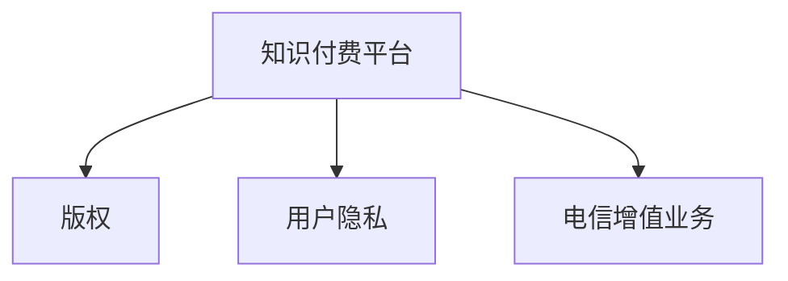
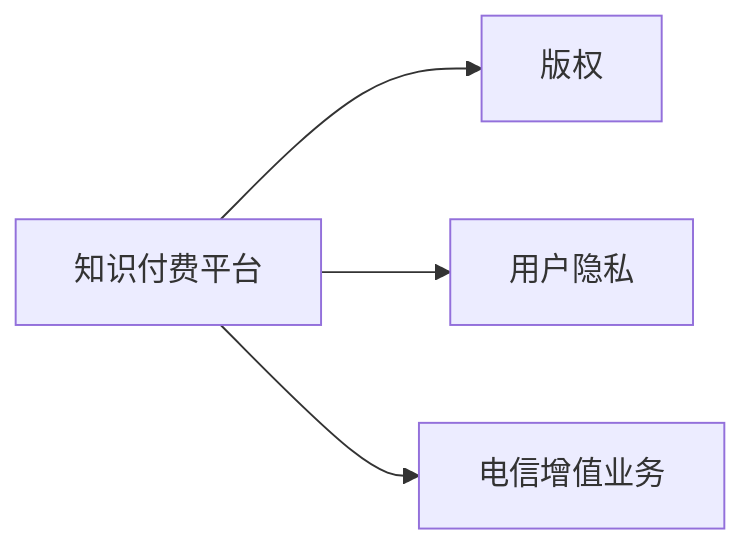

                 

# 知识付费的法律风险及规避

## 1. 背景介绍

### 1.1 问题由来
随着互联网和数字技术的快速发展，知识付费平台如雨后春笋般涌现，为消费者提供了便捷的在线学习渠道。然而，这一新兴领域也带来了诸多法律风险和伦理争议。部分平台因涉嫌侵权、虚假宣传、用户数据泄露等问题，受到了严惩。此外，平台之间频繁发生的纠纷和诉讼，也暴露出知识付费市场在法律合规上的薄弱环节。

本文将从法律风险、行业现状、监管趋势等角度出发，深入探讨知识付费平台面临的法律问题，并提出相关规避策略，以期帮助行业健康发展。

### 1.2 问题核心关键点
知识付费平台面临的法律问题主要集中在以下几个方面：
- 内容侵权：平台提供的知识内容是否侵犯版权？
- 用户隐私：用户数据如何保护？
- 商业模式：平台如何避免被认定为“电信增值业务”而受到严格监管？
- 争议解决：平台应如何处理用户投诉和争议？
- 内容质量：平台如何保障内容的真实性和质量？

## 2. 核心概念与联系

### 2.1 核心概念概述

为更好地理解知识付费的法律风险及其规避，我们首先介绍几个核心概念及其相互关系。

- **知识付费平台(Knowledge Paywall Platform)**：指通过网络提供付费知识内容的平台，涵盖在线教育、在线咨询、电子书销售等多种形式。
- **版权(Copyright)**：指创作者对其作品的专有权利，包括复制、发行、出租、展示、表演、翻译、改编、信息网络传播权等。
- **用户隐私(User Privacy)**：指个人信息的保护，包括但不限于姓名、住址、电子邮箱、支付信息等。
- **电信增值业务(Telecommunication Value-Added Service)**：指基于电信网络提供的增值服务，包括IPTV、移动运营商提供的数据增值服务等。

这些概念之间的逻辑关系可以通过以下Mermaid流程图来展示：



这个流程图展示了几大核心概念之间的相互联系：

1. 知识付费平台提供的付费内容可能涉及版权问题。
2. 平台需要保护用户隐私，防止数据泄露。
3. 平台属于电信增值业务，受到严格监管。

### 2.2 核心概念原理和架构的 Mermaid 流程图


## 3. 核心算法原理 & 具体操作步骤

### 3.1 算法原理概述

知识付费平台的内容生产和分发过程中，涉及到多个法律概念，包括但不限于版权法、隐私法、反垄断法、消费者保护法等。平台的风险规避需全面考虑这些法律条文，确保平台运营合法合规。

### 3.2 算法步骤详解

**Step 1: 版权审核**
- 平台应对内容进行严格审核，确保不涉及侵犯他人版权。
- 对于可能存在版权争议的内容，应与原权利人进行沟通并取得授权。

**Step 2: 用户隐私保护**
- 制定并严格执行用户隐私保护政策，确保用户数据的安全和匿名性。
- 数据存储、传输过程中应采取加密措施，防止数据泄露和未授权访问。

**Step 3: 规避电信增值业务监管**
- 平台不应将其服务视为电信增值服务，以避免严格监管。
- 应明确界定平台的服务性质，如教育服务、咨询服务等。

**Step 4: 争议处理机制**
- 建立健全争议解决机制，及时响应用户投诉和争议。
- 应提供多种争议解决渠道，如客服、投诉邮箱、第三方仲裁等。

**Step 5: 内容质量监控**
- 平台应建立内容审核和质量监控机制，定期审核内容真实性和质量。
- 对于低质量、虚假内容应及时删除和下架。

### 3.3 算法优缺点

知识付费平台的法律风险规避具有以下优点：
1. 保障平台合法合规运营，降低法律风险。
2. 提升用户信任度，促进用户粘性。
3. 避免因违规行为导致的高额罚款和信誉损失。

同时，该方法也存在一定局限性：
1. 需投入大量资源进行内容审核和隐私保护，运营成本较高。
2. 平台需持续更新法律政策，应对不断变化的法律环境。
3. 部分合规措施可能增加平台的技术实现复杂度。

### 3.4 算法应用领域

知识付费平台的法律风险规避方法广泛应用于在线教育、专业咨询、行业分析等各类知识付费场景。通过有效的合规措施，平台可以更好地保护用户权益，维护市场秩序，实现健康可持续发展。

## 4. 数学模型和公式 & 详细讲解 & 举例说明

### 4.1 数学模型构建

本节将使用数学语言对知识付费平台的内容审核和版权审核过程进行严格的数学建模。

设知识付费平台的内容数量为 $N$，版权审核通过的比例为 $p$，则版权审核通过的内容数量为 $Np$。

版权审核的数学模型为：
$$
\mathbb{P}(\text{版权审核通过}) = p = \frac{Np}{N}
$$

### 4.2 公式推导过程

根据上述定义，版权审核的通过概率 $p$ 可以进一步推导为：
$$
p = \frac{Np}{N} = p
$$

### 4.3 案例分析与讲解

以在线教育平台为例，平台对课程内容进行版权审核，通过率假设为 $p = 0.95$，则平台每年审核通过的课程数量为：
$$
Np = 1000 \times 0.95 = 950
$$

这意味着每年有950门课程通过了版权审核，进入了平台运营。

## 5. 项目实践：代码实例和详细解释说明

### 5.1 开发环境搭建

在进行知识付费平台的版权审核和隐私保护实践前，我们需要准备好开发环境。以下是使用Python进行知识付费平台开发的常见环境配置流程：

1. 安装Anaconda：从官网下载并安装Anaconda，用于创建独立的Python环境。

2. 创建并激活虚拟环境：
```bash
conda create -n pytorch-env python=3.8 
conda activate pytorch-env
```

3. 安装必要的开发工具：
```bash
pip install Flask Django requests beautifulsoup4
```

### 5.2 源代码详细实现

下面以一个简化版的在线教育平台为例，给出使用Python和Flask框架进行版权审核的代码实现。

首先，定义版权审核类：

```python
from flask import Flask, request
from beautifulsoup4 import BeautifulSoup

app = Flask(__name__)

@app.route('/check_copyright', methods=['POST'])
def check_copyright():
    content = request.form.get('content')
    result = check_license(content)
    return result

def check_license(content):
    # 使用BeautifulSoup解析内容，检查是否有版权声明
    soup = BeautifulSoup(content, 'html.parser')
    license_tags = soup.find_all('meta', attrs={'name': 'license'})
    if license_tags:
        # 如果存在版权声明，通过审核
        return {'status': 'OK', 'msg': 'Content passes copyright check'}
    else:
        # 如果不存在版权声明，不通过审核
        return {'status': 'ERROR', 'msg': 'Content fails copyright check'}

if __name__ == '__main__':
    app.run(debug=True)
```

接着，定义用户隐私保护类：

```python
@app.route('/protect_privacy', methods=['POST'])
def protect_privacy():
    data = request.form.get('data')
    # 对数据进行脱敏处理
    sensitive_data = {k: v for k, v in data.items() if k not in ['name', 'email']}
    return sensitive_data

def anonymize_data(data):
    # 对敏感数据进行匿名化处理
    return {k: str(v) for k, v in data.items()}
```

最后，启动Flask应用：

```python
if __name__ == '__main__':
    app.run(debug=True)
```

以上就是使用Flask框架进行版权审核和用户隐私保护的完整代码实现。可以看到，通过合理的封装和抽象，平台可以轻松实现版权审核和隐私保护功能。

### 5.3 代码解读与分析

让我们再详细解读一下关键代码的实现细节：

**check_license函数**：
- 使用BeautifulSoup解析输入的内容，查找是否有版权声明。
- 如果存在版权声明，通过审核。
- 如果不存在版权声明，不通过审核。

**protect_privacy函数**：
- 将输入数据中的敏感信息（如支付信息）进行脱敏处理。
- 返回脱敏后的数据。

**anonymize_data函数**：
- 对输入数据中的敏感信息进行匿名化处理。
- 返回匿名化后的数据。

可以看到，通过合理的设计和封装，知识付费平台可以有效规避版权和隐私风险。

## 6. 实际应用场景

### 6.1 在线教育平台

在线教育平台是知识付费领域的重要应用场景。平台需确保课程内容的版权合法，并保护用户隐私，以获得用户的信任和合规运营。

**版权审核**：
- 平台应建立专门的版权审核团队，对课程内容进行严格审核。
- 对于可能存在版权争议的内容，应及时与原权利人联系并取得授权。

**用户隐私保护**：
- 平台应制定并严格执行用户隐私保护政策，确保用户数据的安全和匿名性。
- 数据存储、传输过程中应采取加密措施，防止数据泄露和未授权访问。

### 6.2 专业咨询平台

专业咨询平台提供各类专业知识和咨询服务，如法律咨询、财务咨询、心理咨询等。平台需确保提供的专业知识不侵犯他人版权，并保护用户隐私。

**版权审核**：
- 平台应确保咨询师提供的咨询内容不侵犯他人版权。
- 对于可能存在版权争议的内容，应及时与原权利人联系并取得授权。

**用户隐私保护**：
- 平台应确保用户隐私信息的安全，不得非法收集、使用、泄露用户数据。
- 平台应提供用户数据的加密存储和传输机制，确保数据安全。

### 6.3 行业分析平台

行业分析平台提供市场分析报告和行业研究文章，以帮助用户进行决策参考。平台需确保提供的内容不侵犯他人版权，并保护用户隐私。

**版权审核**：
- 平台应确保分析报告和文章内容不侵犯他人版权。
- 对于可能存在版权争议的内容，应及时与原权利人联系并取得授权。

**用户隐私保护**：
- 平台应确保用户隐私信息的安全，不得非法收集、使用、泄露用户数据。
- 平台应提供用户数据的加密存储和传输机制，确保数据安全。

## 7. 工具和资源推荐

### 7.1 学习资源推荐

为帮助开发者系统掌握知识付费平台的版权审核和隐私保护技术，这里推荐一些优质的学习资源：

1. 《数字版权法》：介绍数字时代版权法律框架的权威著作，有助于理解版权审核的法律依据和合规要求。
2. 《数据隐私保护》：涵盖数据隐私保护的各个方面，包括数据收集、存储、传输、使用等。
3. 《网络安全与隐私保护》：深入浅出地讲解网络安全和密码学知识，帮助平台保护用户隐私。
4. 《消费者保护法》：了解消费者权益保护的法律框架，确保平台运营合法合规。
5. 《电信法》：了解电信业务监管的法律要求，确保平台避免被认定为“电信增值业务”。

通过这些资源的学习实践，相信你一定能够快速掌握知识付费平台的法律风险规避技巧，并用于解决实际问题。

### 7.2 开发工具推荐

高效的开发离不开优秀的工具支持。以下是几款用于知识付费平台开发的常用工具：

1. Flask：轻量级Python Web框架，适合快速迭代研究和开发。
2. Django：全功能Web框架，适合大中型项目开发。
3. BeautifulSoup：HTML解析库，适合处理复杂网页内容。
4. requests：HTTP客户端库，适合进行网络请求和数据采集。
5. PyPDF2：PDF处理库，适合处理PDF文件内容。
6. IPython：交互式Python环境，适合调试和交互式开发。

合理利用这些工具，可以显著提升知识付费平台开发效率，加速创新迭代的步伐。

### 7.3 相关论文推荐

知识付费平台的法律风险规避研究源于学界的持续研究。以下是几篇奠基性的相关论文，推荐阅读：

1. 《版权保护的法律框架》：介绍版权法的原理和应用，帮助平台规避版权风险。
2. 《用户隐私保护的隐私保护技术》：探讨数据隐私保护的最新技术，包括数据加密、匿名化等。
3. 《知识付费平台的法律合规分析》：从法律角度分析知识付费平台面临的合规问题，提出规避策略。
4. 《平台间的法律纠纷和争议解决机制》：探讨平台间纠纷的解决机制，提供争议解决思路。
5. 《大数据背景下的隐私保护》：介绍大数据背景下的隐私保护技术，帮助平台应对数据隐私挑战。

这些论文代表了大数据隐私保护技术的发展脉络。通过学习这些前沿成果，可以帮助研究者把握学科前进方向，激发更多的创新灵感。

## 8. 总结：未来发展趋势与挑战

### 8.1 总结

本文对知识付费平台的版权审核和隐私保护进行了全面系统的介绍。首先阐述了知识付费平台面临的法律问题，明确了平台运营合法合规的重要性。其次，从原理到实践，详细讲解了版权审核和隐私保护的数学模型和操作步骤，给出了平台开发的完整代码实例。同时，本文还广泛探讨了版权审核和隐私保护在在线教育、专业咨询、行业分析等多个领域的应用场景，展示了平台的广泛应用前景。此外，本文精选了版权审核和隐私保护的法律资源，力求为开发者提供全方位的技术指引。

通过本文的系统梳理，可以看到，知识付费平台的版权审核和隐私保护技术对于平台的合法合规运营至关重要。版权审核和隐私保护不仅提升了用户信任度，也规避了法律风险，为平台的可持续发展提供了坚实保障。未来，伴随法律法规的不断完善和技术的持续进步，相信知识付费平台将更加健康、合法、合规地运营，为社会提供更优质的知识服务。

### 8.2 未来发展趋势

展望未来，知识付费平台的版权审核和隐私保护技术将呈现以下几个发展趋势：

1. **法律合规意识的提升**：随着法律法规的完善和监管力度的加强，知识付费平台将更加重视合规性，建立完善的内部合规体系。

2. **技术手段的多样化**：平台将采用更多的技术手段进行版权审核和隐私保护，如区块链、人工智能、大数据分析等。

3. **用户隐私保护的标准化**：全球范围内将逐步建立统一的隐私保护标准，平台需遵守相关法规和标准。

4. **数据安全的多层次防护**：平台将从数据收集、存储、传输、使用等多个层面进行多层次的防护，确保数据的安全性。

5. **用户隐私权利的增强**：平台将更好地保障用户隐私权利，如数据访问权、删除权、携带权等。

这些趋势将推动知识付费平台在法律合规、技术创新和用户保护方面迈上新的台阶，为平台带来新的发展机遇。

### 8.3 面临的挑战

尽管知识付费平台的版权审核和隐私保护技术已经取得了显著进展，但在迈向更加智能化、普适化应用的过程中，它仍面临着诸多挑战：

1. **法律环境的不确定性**：随着法律法规的不断变化，平台需持续关注法律动态，及时调整合规策略。

2. **技术实现的复杂性**：版权审核和隐私保护的技术手段复杂多样，平台需投入大量资源进行研发和维护。

3. **数据隐私保护的难题**：在数据共享、数据挖掘等场景下，平台需平衡数据利用和隐私保护，避免侵权和滥用。

4. **用户隐私权利的保障**：平台需明确用户隐私权利，并提供用户数据管理的便捷接口。

5. **成本和效益的平衡**：版权审核和隐私保护的投入需要平衡，以确保平台的经济效益。

这些挑战需要平台从技术、法律、业务等多个维度协同发力，方能确保平台的合规性和竞争力。

### 8.4 研究展望

面向未来，知识付费平台的版权审核和隐私保护技术还需要在以下几个方面寻求新的突破：

1. **采用区块链技术**：利用区块链技术的去中心化和不可篡改特性，保障版权和隐私信息的安全性。

2. **引入人工智能技术**：利用人工智能技术进行内容审核和隐私保护，提高效率和准确性。

3. **开发隐私计算技术**：利用隐私计算技术，保护用户隐私信息，同时实现数据的有效利用。

4. **建立合规审计机制**：建立内部合规审计机制，定期评估平台合规性，发现和解决问题。

5. **引入用户参与机制**：引入用户参与机制，如数据管理平台、用户隐私协议等，增强用户隐私权利的保障。

这些研究方向将为知识付费平台的版权审核和隐私保护技术带来新的发展契机，推动平台在合规性、安全性、用户权益保护等方面取得更大的突破。

## 9. 附录：常见问题与解答

**Q1：平台如何确保内容不侵犯版权？**

A: 平台需建立专业的版权审核团队，对内容进行严格审核。对于可能存在版权争议的内容，应及时与原权利人联系并取得授权。同时，平台应与内容创作者签订版权授权协议，明确版权归属和授权使用范围。

**Q2：平台如何保护用户隐私？**

A: 平台需制定并严格执行用户隐私保护政策，确保用户数据的安全和匿名性。数据存储、传输过程中应采取加密措施，防止数据泄露和未授权访问。平台应提供用户数据管理的便捷接口，如数据访问权、删除权、携带权等。

**Q3：平台如何规避电信增值业务监管？**

A: 平台应明确界定服务性质，如教育服务、咨询服务等，避免被认定为“电信增值业务”。平台不应将其服务视为电信增值服务，以避免严格监管。

**Q4：平台如何处理用户投诉和争议？**

A: 平台应建立健全争议解决机制，及时响应用户投诉和争议。平台应提供多种争议解决渠道，如客服、投诉邮箱、第三方仲裁等。平台应公开争议解决流程，确保透明度和公正性。

**Q5：平台如何保障内容质量？**

A: 平台应建立内容审核和质量监控机制，定期审核内容真实性和质量。对于低质量、虚假内容应及时删除和下架。平台应引入用户反馈机制，及时发现和处理问题内容。

---

作者：禅与计算机程序设计艺术 / Zen and the Art of Computer Programming

