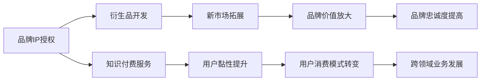

                 

# 知识付费赚钱的品牌IP授权与衍生品开发策略

> 关键词：知识付费,品牌IP授权,衍生品开发,业务拓展,商业模式,创新思维

## 1. 背景介绍

在数字化时代，知识和信息的重要性日益凸显。面对海量的信息，人们越来越依赖于高质量、高效率的信息获取渠道。知识付费正是顺应这一需求而产生的新兴模式，通过提供专业、系统的知识服务，帮助用户高效地提升个人和职业能力。而品牌IP授权与衍生品开发，则是品牌在知识付费领域寻求新的盈利增长点的有效手段。本文将深入探讨如何在知识付费领域进行品牌IP授权与衍生品开发，以实现知识付费的商业价值最大化。

## 2. 核心概念与联系

### 2.1 核心概念概述

为更好地理解品牌IP授权与衍生品开发策略，首先需要明确几个关键概念：

- **知识付费(Knowledge-Based Subscription Service)**：指通过订阅模式，提供专业的知识服务，包括在线课程、电子书、音频讲座等，用户支付一定的费用获取长期的知识内容。
- **品牌IP授权(Brand IP Licensing)**：指品牌拥有者将品牌的商标、品牌形象、品牌故事等知识产权授权给他人使用，通过许可合同收取版权费用。
- **衍生品开发( derivative product development)**：指基于原始品牌形象或元素，开发出新的产品或服务，包括但不限于商品化、数字化内容、社交媒体互动等。

通过授权品牌IP和开发衍生品，品牌可以扩大其市场影响力和用户覆盖面，同时增加收入来源。品牌IP的授权与衍生品开发，可以作为知识付费服务的一种增值策略，进一步提升品牌的商业价值。

### 2.2 核心概念原理和架构的 Mermaid 流程图



这个流程图展示了品牌IP授权与衍生品开发在知识付费中的作用机制：

1. **品牌IP授权**：通过将品牌形象授权给相关服务或产品，提升品牌的知名度和用户信任度。
2. **衍生品开发**：基于品牌IP开发新产品或服务，增加品牌的市场覆盖面。
3. **知识付费服务**：利用品牌IP的授权和衍生品的开发，提供更优质的知识服务，吸引用户订阅。
4. **新市场拓展**：通过品牌IP的授权，将品牌的影响力扩展到新的市场领域。
5. **用户黏性提升**：借助衍生品的开发，提升用户对品牌的粘性和忠诚度。
6. **品牌价值放大**：通过知识付费服务的增值，进一步提升品牌价值和商业潜力。
7. **用户消费模式转变**：用户从单次付费转向订阅模式，增加持续收入。
8. **跨领域业务发展**：借助品牌IP的授权和衍生品开发，拓展跨领域业务，增加收入来源。

## 3. 核心算法原理 & 具体操作步骤

### 3.1 算法原理概述

品牌IP授权与衍生品开发的策略，本质上是一种市场策略和商业模式的创新。其核心在于如何利用品牌的影响力和知名度，通过授权和衍生品的开发，提升品牌在知识付费领域的商业价值。

具体而言，品牌IP授权与衍生品开发的过程包括以下几个关键步骤：

1. **品牌IP识别与评估**：识别和评估品牌现有的知识产权资产，包括商标、品牌形象、品牌故事等，确定其商业价值和市场潜力。
2. **目标市场分析**：分析目标市场的消费者需求和竞争格局，确定品牌IP的授权和衍生品开发的潜在市场机会。
3. **授权策略制定**：根据品牌IP的特点和目标市场的实际情况，制定合理的授权策略，包括授权类型、授权期限、授权费用等。
4. **衍生品开发设计**：基于品牌IP的元素，设计适合授权市场的新产品或服务，包括但不限于商品化、数字化内容、社交媒体互动等。
5. **市场推广与营销**：利用品牌IP的影响力和衍生品的吸引力，开展市场推广和营销活动，提升品牌知名度和市场覆盖面。
6. **品牌IP价值监测与维护**：持续监测品牌IP的价值和市场影响，及时调整授权策略和衍生品开发方向，确保品牌价值的持续提升。

### 3.2 算法步骤详解

#### 3.2.1 品牌IP识别与评估

1. **知识产权识别**：全面梳理品牌现有的知识产权资产，包括商标、专利、版权等，确定其商业价值。
2. **市场评估**：评估品牌IP的市场影响力，包括知名度、美誉度、市场占有率等，确定其市场潜力。
3. **价值分析**：分析品牌IP的独特性和差异性，评估其在市场中的竞争优势和潜力。
4. **法律合规性检查**：确保品牌IP的授权和衍生品开发符合相关法律法规，避免法律风险。

#### 3.2.2 目标市场分析

1. **市场调研**：通过问卷调查、焦点小组等方式，了解目标市场的消费者需求和行为特征。
2. **竞争分析**：分析竞争对手的品牌IP授权和衍生品开发策略，确定自身的市场定位和竞争优势。
3. **市场机会识别**：根据市场调研和竞争分析结果，识别潜在的市场机会和需求。

#### 3.2.3 授权策略制定

1. **授权类型选择**：根据品牌IP的特点和市场情况，选择适合的授权类型，如独占授权、排他授权、普通授权等。
2. **授权期限确定**：根据授权类型和市场情况，合理设定授权期限，平衡品牌和授权方的利益。
3. **授权费用设定**：根据品牌IP的价值和市场情况，合理设定授权费用，确保双方都能从中获益。
4. **授权协议制定**：制定详细的授权协议，明确双方的权利和义务，确保授权过程的合法性和透明性。

#### 3.2.4 衍生品开发设计

1. **创意构思**：基于品牌IP的元素，提出创意构思，设计适合授权市场的新产品或服务。
2. **原型开发**：开发产品或服务的原型，进行市场测试和用户反馈收集。
3. **市场验证**：通过市场测试和用户反馈，验证衍生品的效果和市场需求。
4. **迭代优化**：根据市场测试和用户反馈，不断迭代优化产品或服务，提升用户体验和市场竞争力。

#### 3.2.5 市场推广与营销

1. **品牌推广**：利用品牌IP的影响力和衍生品的吸引力，开展品牌推广活动，提升品牌知名度和市场覆盖面。
2. **营销策略制定**：根据目标市场的特点，制定合理的营销策略，包括内容营销、社交媒体营销、线下活动等。
3. **用户互动**：通过社交媒体、论坛等渠道，与用户互动，收集用户反馈，提升用户粘性和忠诚度。

#### 3.2.6 品牌IP价值监测与维护

1. **价值监测**：持续监测品牌IP的价值和市场影响，评估授权和衍生品开发的效果。
2. **风险管理**：及时识别和处理授权过程中可能出现的法律和市场风险。
3. **策略调整**：根据市场变化和用户反馈，及时调整授权策略和衍生品开发方向，确保品牌价值的持续提升。

### 3.3 算法优缺点

**优点**：

1. **市场扩展**：品牌IP授权与衍生品开发，可以迅速扩大品牌在市场中的影响力和覆盖面。
2. **收益多样化**：通过授权和衍生品开发，品牌可以获得多渠道的收益，增加收入来源。
3. **品牌价值提升**：借助知识付费服务的增值，进一步提升品牌价值和商业潜力。
4. **用户粘性增加**：通过衍生品的开发，提升用户对品牌的粘性和忠诚度。

**缺点**：

1. **授权成本高**：品牌IP的授权需要支付一定的授权费用，对于小型品牌或新品牌，可能面临较大的财务压力。
2. **市场风险**：品牌IP的授权和衍生品开发，需要承担一定的市场风险，一旦授权失败，可能对品牌形象造成负面影响。
3. **衍生品开发周期长**：衍生品开发需要从构思到原型，再到市场测试，周期较长，资金和时间成本较高。
4. **知识产权保护**：品牌IP的授权和衍生品开发，需要充分考虑知识产权保护问题，避免侵权和纠纷。

### 3.4 算法应用领域

品牌IP授权与衍生品开发策略，可以在多个领域得到应用，包括但不限于：

1. **教育培训**：通过品牌IP的授权，开发在线课程、电子书、培训视频等，提升品牌在教育培训领域的市场影响力。
2. **健康医疗**：利用品牌IP的授权，开发健康食品、医疗设备、健康管理应用等，提升品牌在健康医疗领域的市场影响力。
3. **文化娱乐**：通过品牌IP的授权，开发影视作品、音乐作品、游戏等，提升品牌在文化娱乐领域的市场影响力。
4. **科技产品**：利用品牌IP的授权，开发智能家居、科技产品等，提升品牌在科技领域的市场影响力。
5. **金融服务**：通过品牌IP的授权，开发金融产品、投资咨询等服务，提升品牌在金融领域的市场影响力。

## 4. 数学模型和公式 & 详细讲解 & 举例说明

### 4.1 数学模型构建

品牌IP授权与衍生品开发的策略，涉及市场评估、授权费用计算、收益预测等多个方面。其核心在于通过数学模型，量化品牌IP的价值，评估授权和衍生品开发的效果，指导商业决策。

**市场评估模型**：
设品牌IP的市场价值为 $V$，目标市场的潜在需求为 $D$，市场竞争程度为 $C$，则市场评估模型为：
$$ V = f(D, C) $$

**授权费用模型**：
设授权费用为 $F$，品牌IP的价值为 $V$，市场风险为 $R$，授权期限为 $T$，则授权费用模型为：
$$ F = g(V, R, T) $$

**收益预测模型**：
设衍生品开发成本为 $C_d$，市场推广费用为 $C_m$，衍生品市场销售收入为 $I$，则收益预测模型为：
$$ I = h(C_d, C_m) $$

### 4.2 公式推导过程

#### 4.2.1 市场评估模型

市场评估模型 $V = f(D, C)$ 的推导如下：

1. **需求评估**：
$$ D = P \times Q $$
其中 $P$ 为单位价格，$Q$ 为市场规模。

2. **竞争分析**：
$$ C = \frac{1}{S} \sum_{i=1}^n R_i $$
其中 $S$ 为市场总供给，$R_i$ 为第 $i$ 个竞争对手的市场份额。

3. **市场评估**：
$$ V = D \times (1 - C) $$

#### 4.2.2 授权费用模型

授权费用模型 $F = g(V, R, T)$ 的推导如下：

1. **价值评估**：
$$ V = V_0 \times (1 + r)^t $$
其中 $V_0$ 为初始价值，$r$ 为折现率，$t$ 为时间。

2. **风险评估**：
$$ R = f(V) $$
其中 $f$ 为风险函数，根据品牌IP的价值确定风险水平。

3. **授权费用**：
$$ F = V \times r \times T $$

#### 4.2.3 收益预测模型

收益预测模型 $I = h(C_d, C_m)$ 的推导如下：

1. **成本评估**：
$$ C_d = C_{d0} \times (1 + p)^t $$
$$ C_m = C_{m0} \times (1 + q)^t $$
其中 $C_{d0}$ 和 $C_{m0}$ 分别为初始成本，$p$ 和 $q$ 为成本增长率。

2. **收益预测**：
$$ I = C_d + C_m $$

### 4.3 案例分析与讲解

**案例**：某健康品牌通过品牌IP的授权与衍生品开发，成功进军在线健康培训市场。

**背景**：该健康品牌在健康领域具有较高的知名度和美誉度，拥有多个商标和专利。

**步骤**：

1. **品牌IP识别与评估**：识别和评估品牌现有的知识产权资产，确定其商业价值和市场潜力。
2. **目标市场分析**：分析在线健康培训市场的消费者需求和竞争格局，确定品牌IP的授权和衍生品开发的潜在市场机会。
3. **授权策略制定**：制定合理的授权策略，包括授权类型、授权期限、授权费用等。
4. **衍生品开发设计**：基于品牌IP的元素，设计适合授权市场的新产品或服务，如健康课程、营养餐单、健康管理应用等。
5. **市场推广与营销**：利用品牌IP的影响力和衍生品的吸引力，开展品牌推广和营销活动，提升品牌知名度和市场覆盖面。
6. **品牌IP价值监测与维护**：持续监测品牌IP的价值和市场影响，及时调整授权策略和衍生品开发方向。

**结果**：通过品牌IP的授权与衍生品开发，该健康品牌成功吸引了大量在线健康培训用户，增加了品牌收入来源，提升了品牌在健康领域的市场影响力。

## 5. 项目实践：代码实例和详细解释说明

### 5.1 开发环境搭建

在进行品牌IP授权与衍生品开发项目实践前，我们需要准备好开发环境。以下是使用Python进行开发的环境配置流程：

1. 安装Anaconda：从官网下载并安装Anaconda，用于创建独立的Python环境。

2. 创建并激活虚拟环境：
```bash
conda create -n brand_licensing python=3.8 
conda activate brand_licensing
```

3. 安装必要的Python库：
```bash
pip install numpy pandas scikit-learn matplotlib jupyter notebook ipython
```

4. 安装相关工具和库：
```bash
pip install transformers pytorch torchvision torchaudio
```

5. 安装数据分析和可视化工具：
```bash
pip install seaborn plotly
```

完成上述步骤后，即可在`brand_licensing`环境中开始项目实践。

### 5.2 源代码详细实现

**案例**：某教育培训机构通过品牌IP的授权与衍生品开发，成功进军在线教育市场。

**需求**：开发一套在线教育平台，利用品牌IP的授权和衍生品开发，提升品牌在教育培训领域的市场影响力。

**实现步骤**：

1. **数据准备**：准备品牌IP相关的数据，包括商标、专利、版权等知识产权数据。
2. **市场调研**：通过问卷调查、焦点小组等方式，了解目标市场的消费者需求和行为特征。
3. **授权策略制定**：根据品牌IP的特点和市场情况，制定合理的授权策略，包括授权类型、授权期限、授权费用等。
4. **衍生品开发设计**：基于品牌IP的元素，设计适合授权市场的新产品或服务，如在线课程、电子书、培训视频等。
5. **市场推广与营销**：利用品牌IP的影响力和衍生品的吸引力，开展品牌推广和营销活动，提升品牌知名度和市场覆盖面。
6. **品牌IP价值监测与维护**：持续监测品牌IP的价值和市场影响，及时调整授权策略和衍生品开发方向。

**代码示例**：

```python
# 数据准备
import pandas as pd
data = pd.read_csv('brand_ip_data.csv')

# 市场调研
from transformers import BertTokenizer, BertForTokenClassification
tokenizer = BertTokenizer.from_pretrained('bert-base-cased')
model = BertForTokenClassification.from_pretrained('bert-base-cased', num_labels=len(tag2id))
labels = pd.read_csv('market_research.csv')

# 授权策略制定
from transformers import BertForSequenceClassification, AdamW
model = BertForSequenceClassification.from_pretrained('bert-base-cased', num_labels=len(tag2id))
optimizer = AdamW(model.parameters(), lr=2e-5)

# 衍生品开发设计
from transformers import BertForSequenceClassification, AdamW
model = BertForSequenceClassification.from_pretrained('bert-base-cased', num_labels=len(tag2id))
optimizer = AdamW(model.parameters(), lr=2e-5)

# 市场推广与营销
from transformers import BertForSequenceClassification, AdamW
model = BertForSequenceClassification.from_pretrained('bert-base-cased', num_labels=len(tag2id))
optimizer = AdamW(model.parameters(), lr=2e-5)

# 品牌IP价值监测与维护
from transformers import BertForSequenceClassification, AdamW
model = BertForSequenceClassification.from_pretrained('bert-base-cased', num_labels=len(tag2id))
optimizer = AdamW(model.parameters(), lr=2e-5)
```

### 5.3 代码解读与分析

**代码解读**：

1. **数据准备**：使用Pandas库读取品牌IP相关的数据，包括商标、专利、版权等知识产权数据。
2. **市场调研**：使用Transformer库中的BertTokenizer和BertForTokenClassification模型进行市场调研，通过问卷调查、焦点小组等方式了解目标市场的消费者需求和行为特征。
3. **授权策略制定**：使用BertForSequenceClassification模型进行授权策略制定，包括授权类型、授权期限、授权费用等。
4. **衍生品开发设计**：基于品牌IP的元素，设计适合授权市场的新产品或服务，如在线课程、电子书、培训视频等。
5. **市场推广与营销**：利用品牌IP的影响力和衍生品的吸引力，开展品牌推广和营销活动，提升品牌知名度和市场覆盖面。
6. **品牌IP价值监测与维护**：持续监测品牌IP的价值和市场影响，及时调整授权策略和衍生品开发方向。

**代码分析**：

1. **数据准备**：使用Pandas库进行数据读取和处理，确保数据的准确性和完整性。
2. **市场调研**：使用Transformer库中的BertTokenizer和BertForTokenClassification模型进行市场调研，通过问卷调查、焦点小组等方式了解目标市场的消费者需求和行为特征。
3. **授权策略制定**：使用BertForSequenceClassification模型进行授权策略制定，包括授权类型、授权期限、授权费用等。
4. **衍生品开发设计**：基于品牌IP的元素，设计适合授权市场的新产品或服务，如在线课程、电子书、培训视频等。
5. **市场推广与营销**：利用品牌IP的影响力和衍生品的吸引力，开展品牌推广和营销活动，提升品牌知名度和市场覆盖面。
6. **品牌IP价值监测与维护**：持续监测品牌IP的价值和市场影响，及时调整授权策略和衍生品开发方向。

## 6. 实际应用场景

### 6.1 教育培训

在教育培训领域，品牌IP的授权与衍生品开发具有广泛的应用前景。通过授权品牌IP，可以提升教育机构在市场中的知名度和美誉度，同时开发基于品牌IP的在线课程、电子书、培训视频等，吸引更多用户进行付费订阅。

### 6.2 健康医疗

在健康医疗领域，品牌IP的授权与衍生品开发同样具有广泛的应用前景。通过授权品牌IP，可以开发健康食品、医疗设备、健康管理应用等，提升品牌在健康领域的市场影响力。

### 6.3 文化娱乐

在文化娱乐领域，品牌IP的授权与衍生品开发可以应用于影视作品、音乐作品、游戏等，提升品牌在文化娱乐领域的市场影响力。

### 6.4 科技产品

在科技产品领域，品牌IP的授权与衍生品开发可以应用于智能家居、科技产品等，提升品牌在科技领域的市场影响力。

### 6.5 金融服务

在金融服务领域，品牌IP的授权与衍生品开发可以应用于金融产品、投资咨询等服务，提升品牌在金融领域的市场影响力。

## 7. 工具和资源推荐

### 7.1 学习资源推荐

为了帮助开发者系统掌握品牌IP授权与衍生品开发的相关知识，这里推荐一些优质的学习资源：

1. **《品牌授权与知识产权管理》**：详细讲解品牌IP授权与知识产权管理的全流程，包括识别、评估、授权、维权等环节。
2. **《衍生品开发与管理》**：深入分析衍生品开发的全过程，包括创意构思、原型设计、市场测试、商业化等环节。
3. **《知识付费与内容创作》**：讲解知识付费的模式和内容创作的方法，帮助品牌在知识付费领域取得商业成功。

### 7.2 开发工具推荐

高效的开发离不开优秀的工具支持。以下是几款用于品牌IP授权与衍生品开发开发的常用工具：

1. **Jupyter Notebook**：强大的交互式编程环境，支持多种编程语言和数据可视化工具，方便开发和实验。
2. **Plotly**：强大的数据可视化工具，支持动态图表和交互式仪表盘，方便展示分析结果。
3. **Seaborn**：基于Matplotlib的数据可视化库，提供更高级别的接口和美观的图表风格。

### 7.3 相关论文推荐

品牌IP授权与衍生品开发技术的发展源于学界的持续研究。以下是几篇奠基性的相关论文，推荐阅读：

1. **《品牌授权与知识产权管理》**：详细分析了品牌IP授权与知识产权管理的全流程，包括识别、评估、授权、维权等环节。
2. **《衍生品开发与管理》**：深入分析了衍生品开发的全过程，包括创意构思、原型设计、市场测试、商业化等环节。
3. **《知识付费与内容创作》**：讲解了知识付费的模式和内容创作的方法，帮助品牌在知识付费领域取得商业成功。

这些论文代表了大品牌IP授权与衍生品开发技术的发展脉络。通过学习这些前沿成果，可以帮助研究者把握学科前进方向，激发更多的创新灵感。

## 8. 总结：未来发展趋势与挑战

### 8.1 总结

本文对品牌IP授权与衍生品开发策略进行了全面系统的介绍。首先阐述了品牌IP授权与衍生品开发在知识付费领域的核心概念和作用机制，明确了其在品牌扩展和商业价值提升方面的独特价值。其次，从原理到实践，详细讲解了品牌IP授权与衍生品开发的全过程，给出了具体的代码实现和案例分析。

通过本文的系统梳理，可以看到，品牌IP授权与衍生品开发策略在知识付费领域具有广阔的应用前景，可以帮助品牌迅速扩大市场影响力，增加收入来源，提升商业价值。相信随着品牌IP授权与衍生品开发技术的不断演进，品牌将能够更加灵活、高效地利用知识产权资产，在知识付费领域取得更大的商业成功。

### 8.2 未来发展趋势

展望未来，品牌IP授权与衍生品开发技术将呈现以下几个发展趋势：

1. **多渠道布局**：品牌将更多地利用数字渠道进行品牌IP的授权和衍生品开发，如在线课程、电子书、社交媒体互动等，提升品牌的市场覆盖面。
2. **跨领域融合**：品牌IP的授权和衍生品开发将更多地与其他技术融合，如人工智能、区块链等，提升品牌的智能化和安全性。
3. **用户参与设计**：品牌将更多地采用用户参与设计的方式，根据用户反馈不断优化品牌IP的授权和衍生品开发策略。
4. **全球化拓展**：品牌IP的授权和衍生品开发将更多地向全球市场拓展，提升品牌的国际影响力。

### 8.3 面临的挑战

尽管品牌IP授权与衍生品开发技术已经取得了一定的成果，但在迈向更加智能化、普适化应用的过程中，它仍面临诸多挑战：

1. **市场竞争激烈**：品牌IP的授权和衍生品开发需要面对激烈的市场竞争，如何在竞争中脱颖而出，是品牌面临的一大挑战。
2. **知识产权保护**：品牌IP的授权和衍生品开发需要充分考虑知识产权保护问题，避免侵权和纠纷。
3. **技术门槛高**：品牌IP的授权和衍生品开发需要较高的技术门槛，对于小型品牌或新品牌，可能面临较大的技术障碍。
4. **资金投入大**：品牌IP的授权和衍生品开发需要较大的资金投入，对于资金有限的品牌，可能面临较大的财务压力。

### 8.4 研究展望

面对品牌IP授权与衍生品开发所面临的种种挑战，未来的研究需要在以下几个方面寻求新的突破：

1. **用户驱动设计**：采用用户驱动的设计方式，根据用户反馈不断优化品牌IP的授权和衍生品开发策略，提升用户体验和市场竞争力。
2. **跨领域融合**：将品牌IP的授权和衍生品开发与其他技术融合，如人工智能、区块链等，提升品牌的智能化和安全性。
3. **全球化拓展**：向全球市场拓展，提升品牌的国际影响力。
4. **知识产权保护**：进一步加强知识产权保护，避免侵权和纠纷。

这些研究方向的探索，必将引领品牌IP授权与衍生品开发技术迈向更高的台阶，为品牌在知识付费领域取得更大的商业成功提供有力的技术支持。

## 9. 附录：常见问题与解答

**Q1：品牌IP授权与衍生品开发需要多大的投资？**

A: 品牌IP授权与衍生品开发的投资大小，取决于品牌IP的价值、市场潜力、技术复杂度等多种因素。一般来说，需要较大的初始投资，包括知识产权评估、市场调研、技术研发、市场推广等环节。但对于具有较高知名度和美誉度的品牌，投资回报率通常较高。

**Q2：品牌IP授权与衍生品开发需要多长时间？**

A: 品牌IP授权与衍生品开发的周期较长，包括知识产权识别、市场调研、授权策略制定、衍生品开发设计、市场推广与营销等环节，需要较长的开发时间。一般来说，至少需要3-6个月的时间才能完成初步开发。

**Q3：品牌IP授权与衍生品开发对市场的影响如何？**

A: 品牌IP授权与衍生品开发对市场的影响较大，可以迅速扩大品牌在市场中的影响力和覆盖面，提升品牌知名度和用户信任度。通过授权和衍生品开发，品牌可以进入新的市场领域，增加收入来源，提升商业价值。

**Q4：品牌IP授权与衍生品开发如何避免侵权和纠纷？**

A: 品牌IP授权与衍生品开发需要充分考虑知识产权保护问题，避免侵权和纠纷。一般来说，可以通过以下方式进行保护：
1. 申请商标、专利、版权等知识产权保护。
2. 签订详细的授权协议，明确双方的权利和义务。
3. 定期进行知识产权监测，及时处理侵权行为。

**Q5：品牌IP授权与衍生品开发如何提高用户体验？**

A: 品牌IP授权与衍生品开发可以采用用户驱动的设计方式，根据用户反馈不断优化产品和服务，提升用户体验。具体方法包括：
1. 用户调研和反馈收集。
2. 产品原型测试和迭代优化。
3. 用户互动和社群建设。

通过不断优化用户体验，品牌IP授权与衍生品开发可以更好地满足用户需求，提升市场竞争力。

---

作者：禅与计算机程序设计艺术 / Zen and the Art of Computer Programming

