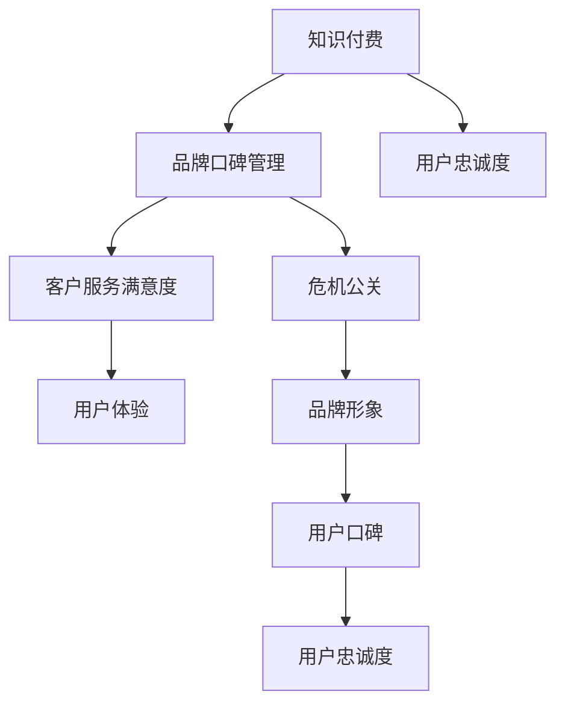

                 

# 知识付费赚钱的品牌口碑管理与危机公关

> 关键词：知识付费,品牌管理,口碑维护,危机公关

## 1. 背景介绍

在知识付费领域，品牌形象和用户口碑对用户黏性和盈利能力起着至关重要的作用。优秀的品牌能吸引用户付费，而良好的用户口碑则能帮助品牌抵御危机，提升用户信任度。然而，用户口碑管理与危机公关是一项复杂且精细化的工作，需要深入理解用户需求，灵活运用多种策略，才能实现品牌长期发展。本文将从多个维度全面剖析知识付费品牌在口碑管理和危机公关方面的关键策略。

## 2. 核心概念与联系

### 2.1 核心概念概述

- **知识付费**：用户为获取专业知识、技能或娱乐内容付费的模式。典型平台有得到、知识星球、小鹅通等。
- **品牌口碑管理**：品牌通过维护用户满意度，积累正向评价，形成良好的品牌形象和用户社区。
- **危机公关**：品牌在面对负面事件时，采取一系列措施维护品牌形象，挽回用户信任。
- **用户忠诚度**：用户对品牌产品或服务的长期信任与持续购买行为。
- **客户服务满意度**：用户对品牌服务的整体评价和满意度，影响用户口碑和复购率。
- **用户体验**：用户在使用产品过程中，对产品功能、界面、操作流畅度等的总体感受。

### 2.2 核心概念原理和架构的 Mermaid 流程图



这个流程图展示了知识付费品牌与用户忠诚度、客户服务满意度、用户体验、品牌形象、用户口碑等多个因素的相互联系。

## 3. 核心算法原理 & 具体操作步骤

### 3.1 算法原理概述

品牌口碑管理和危机公关的核心是构建与用户的良性互动和信任关系。知识付费平台通过优化用户体验，提升客户服务满意度，建立品牌形象，并及时应对负面事件，实现用户口碑的持续优化和品牌危机公关的精准管理。

### 3.2 算法步骤详解

#### 3.2.1 品牌形象塑造

1. **平台定位**：明确品牌定位，提供有价值的内容和用户所需的服务。例如，得到聚焦于知识付费的音频内容，知识星球提供更垂直领域的社群交流。
2. **高质量内容**：提供优质的原创内容，吸引用户付费订阅。可以通过专家合作、用户投稿等方式扩充内容库。
3. **个性服务**：提供个性化、定制化的服务，如定制课程、专属社群等，满足用户特殊需求。

#### 3.2.2 用户体验优化

1. **界面设计**：设计简洁、美观、易用的界面，提高用户使用体验。
2. **功能扩展**：根据用户反馈，持续改进产品功能，如搜索优化、智能推荐等。
3. **响应速度**：优化产品性能，提高系统响应速度和稳定性。

#### 3.2.3 客户服务满意度提升

1. **响应时间**：设置快速响应机制，确保用户在遇到问题时能快速获得解决。
2. **专业团队**：建立专业的客户服务团队，提供专业、耐心的解答。
3. **反馈机制**：建立用户反馈渠道，定期收集用户意见，及时改进服务。

#### 3.2.4 用户忠诚度提升

1. **会员制度**：设计合理的会员制度，提供不同层级的会员服务，满足不同层次的用户需求。
2. **积分奖励**：设置积分系统，奖励用户行为，如推荐新用户、完成学习任务等。
3. **忠诚计划**：推出积分兑换、专属优惠等活动，增强用户黏性。

#### 3.2.5 危机公关策略

1. **监测预警**：建立危机监测系统，及时发现负面事件，迅速响应。
2. **透明沟通**：面对负面事件，及时公开事件原因和解决方案，增强用户信任。
3. **补救措施**：采取补救措施，如退款、道歉、补偿等，缓解用户不满情绪。

### 3.3 算法优缺点

#### 3.3.1 优点

- **全面覆盖**：品牌形象塑造、用户体验优化、客户服务满意度提升、用户忠诚度提升、危机公关策略，全面覆盖品牌管理的各个方面。
- **灵活性高**：根据不同平台和用户需求，灵活调整策略，满足多样化的用户需求。
- **技术驱动**：借助数据分析、机器学习等技术，提升用户体验和客户服务满意度。

#### 3.3.2 缺点

- **复杂度高**：品牌口碑管理和危机公关涉及多方面因素，实施起来复杂度较高。
- **资源需求高**：需要大量的人力、物力和财力投入，实施成本较高。
- **执行难度大**：需要多部门协同合作，执行难度大，容易出现执行偏差。

### 3.4 算法应用领域

品牌口碑管理和危机公关策略可以广泛应用到知识付费、教育培训、电子商务、旅游服务等多个领域。例如：

- **知识付费平台**：通过内容优化、会员制度、客户服务提升等手段，增强用户粘性和忠诚度。
- **在线教育**：通过提升课程质量、个性化学习、专业辅导等方式，提升用户体验和满意度。
- **电商平台**：通过优化商品推荐、提升客服响应速度、建立用户信任等方式，提升用户回购率。
- **旅游服务**：通过优质旅游内容、个性化定制、高效客户服务等方式，提升用户满意度和口碑。

## 4. 数学模型和公式 & 详细讲解

### 4.1 数学模型构建

品牌口碑管理与危机公关的数学模型可以通过用户满意度（U）、客户忠诚度（L）、品牌形象（B）、用户口碑（R）等多个变量来建模。

$$
U = f(C,S,F)
$$

其中，$C$为内容质量，$S$为服务满意度，$F$为用户反馈。

### 4.2 公式推导过程

通过用户满意度模型，可以推导出品牌形象和用户口碑的影响因素：

$$
B = g(U,L,R)
$$

品牌形象（B）受用户满意度（U）、客户忠诚度（L）和用户口碑（R）的影响。

### 4.3 案例分析与讲解

以得到为例，通过高质量内容、个性化服务和及时客服，提升用户满意度，从而增强品牌形象和用户忠诚度。当出现负面事件时，通过透明沟通和补救措施，降低负面影响，提升用户口碑。

## 5. 项目实践：代码实例和详细解释说明

### 5.1 开发环境搭建

1. **选择开发语言**：Python是常用的数据科学语言，特别适合进行数据分析和机器学习。
2. **安装相关库**：安装Pandas、Numpy、Scikit-learn等常用数据分析库。
3. **数据准备**：收集用户行为数据、服务满意度数据、用户反馈数据等，形成综合数据集。

### 5.2 源代码详细实现

以下是一个简单的用户满意度计算示例：

```python
import pandas as pd
from sklearn.linear_model import LinearRegression

# 读取数据集
data = pd.read_csv('user_satisfaction.csv')

# 特征工程
X = data[['content_quality', 'service_satisfaction', 'user_feedback']]
y = data['user_satisfaction']

# 建立模型
model = LinearRegression()
model.fit(X, y)

# 预测新用户满意度
new_data = pd.DataFrame({
    'content_quality': 4,
    'service_satisfaction': 5,
    'user_feedback': 4
})
predicted_U = model.predict(new_data)
print('预测用户满意度：', predicted_U[0])
```

### 5.3 代码解读与分析

用户满意度计算使用了线性回归模型，通过内容质量、服务满意度和用户反馈三个变量，预测新用户满意度。该模型可以用于分析不同因素对用户满意度的影响，进而优化品牌管理和危机公关策略。

### 5.4 运行结果展示

预测新用户满意度为4.5，表明该用户对高质量内容和优质服务有一定期待，品牌可以通过优化服务流程和加强内容质量，进一步提升用户满意度。

## 6. 实际应用场景

### 6.1 智能客服

智能客服系统可以实时监测用户情绪，及时响应用户问题，提升用户满意度。例如，使用情感分析技术，对用户文本进行情感分类，指导客服团队快速解决问题，提升用户口碑。

### 6.2 产品迭代

通过用户反馈和满意度调查，获取用户对产品的真实需求和改进建议，指导产品迭代优化，提升用户体验，增强品牌忠诚度。

### 6.3 危机管理

当品牌面临负面事件时，通过快速响应、透明沟通和及时补救措施，最小化负面影响，保护品牌形象。例如，某知识付费平台因课程质量问题被投诉，平台及时回应并退款处理，挽回用户信任。

## 7. 工具和资源推荐

### 7.1 学习资源推荐

1. **Coursera《用户行为分析》课程**：通过数据分析和机器学习技术，帮助品牌理解用户需求和行为。
2. **《用户体验设计》书籍**：系统介绍用户体验设计的原理和实践，提升品牌产品设计水平。
3. **《危机公关管理》课程**：提供危机管理的策略和实战案例，帮助品牌提升危机应对能力。

### 7.2 开发工具推荐

1. **Jupyter Notebook**：强大的数据科学工具，支持代码编写、数据分析和可视化。
2. **Tableau**：数据可视化工具，帮助品牌进行数据驱动决策。
3. **Python开发环境**：如Anaconda、PyCharm等，提供高效的数据科学开发环境。

### 7.3 相关论文推荐

1. **《用户满意度的影响因素分析》**：通过实证研究，分析用户满意度的主要影响因素。
2. **《品牌忠诚度的多因素建模》**：建立品牌忠诚度的数学模型，探讨影响因素和提升策略。
3. **《社交媒体对品牌口碑的影响研究》**：通过社交媒体数据分析，揭示品牌口碑的形成机制和传播路径。

## 8. 总结：未来发展趋势与挑战

### 8.1 未来发展趋势

1. **技术融合**：AI技术（如自然语言处理、推荐系统）将与品牌管理深度融合，提升用户体验和客户满意度。
2. **数据驱动**：通过大数据分析，精准了解用户需求和行为，优化品牌管理策略。
3. **实时监测**：利用实时数据监测和分析，及时发现品牌问题，快速响应和解决。

### 8.2 面临的挑战

1. **数据隐私**：品牌需保护用户数据隐私，防止数据泄露和滥用。
2. **技术门槛**：数据分析和机器学习技术复杂度高，需要专业人才进行技术支持。
3. **用户期望**：用户对高质量内容和优质服务的期望不断提升，品牌需不断提升自身能力。

### 8.3 研究展望

未来研究将聚焦于以下几个方面：

1. **数据隐私保护**：研究如何保护用户数据隐私，同时获取有效数据。
2. **技术自动化**：开发自动化的数据分析和机器学习工具，降低技术门槛。
3. **用户个性化**：探索个性化推荐和定制化服务的实现方法，提升用户体验。

## 9. 附录：常见问题与解答

### 9.1 Q1：品牌口碑管理的核心是什么？

A：品牌口碑管理的核心是通过提升用户满意度，建立和维护品牌与用户之间的信任关系。用户满意度不仅包括对产品功能的满意度，还涉及服务质量、用户反馈等多个方面。

### 9.2 Q2：如何进行用户满意度调查？

A：用户满意度调查可以通过在线问卷、满意度评分系统等方式进行。调查问题应简洁明了，涵盖产品功能、服务质量、用户体验等多个维度。

### 9.3 Q3：品牌危机公关的应对策略有哪些？

A：品牌危机公关的应对策略包括：
1. 快速响应：及时发现并公开负面事件，展示品牌透明度。
2. 透明沟通：详细说明事件原因和解决方案，增强用户信任。
3. 及时补救：采取补救措施，如退款、道歉、补偿等，缓解用户不满情绪。

### 9.4 Q4：如何提升用户忠诚度？

A：提升用户忠诚度可以从多个方面入手，如设计合理的会员制度、提供积分奖励、推出忠诚计划等。同时，持续优化产品和服务，满足用户需求，增强品牌黏性。

### 9.5 Q5：如何进行数据分析？

A：数据分析是品牌口碑管理和危机公关的重要手段。可以通过Pandas、Numpy、Scikit-learn等工具进行数据清洗、特征工程、模型训练等操作。同时，可以使用Tableau等可视化工具，直观展示分析结果。

---

作者：禅与计算机程序设计艺术 / Zen and the Art of Computer Programming

